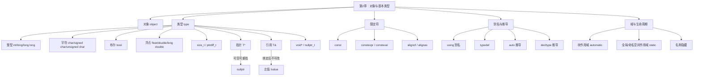

# 第二章：对象与基本类型

> **一句话定义**：本章界定 C++ 程序的最小单元 —— **对象 (object)**，并系统梳理内建基本类型（`int / char / bool / float / double`、`size_t`、`nullptr`、`void*`）、复合类型（指针 `*` 与引用 `&`）、限定符 (`const / constexpr`)、类型别名 (`using / typedef`) 与自动推导 (`auto / decltype`)；同时给出 `std::numeric_limits`、`sizeof / alignof / alignas` 等查询工具，并以「域 (scope) + 生命周期 (storage duration)」收束所有命名实体的可见性与寿命。

## 章节知识框架



> **相关模块预告**：本章覆盖《类型系统》模块的全部入门切面，同时与第 4 章「表达式」的值类别、第 8 章「动态内存」的对象存储期、第 11 章「类」的对象语义形成上下游。

---

## 类型详述1

### 概念 (Concept)
C++ 是 **静态强类型** 语言：每个对象在编译期就被确定为某个具体类型，类型决定了它占用多少字节、能进行哪些运算、参与哪些隐式转换。基本类型 (fundamental types) 分为 **整型族** (`bool / char / short / int / long / long long` 各自含 signed 与 unsigned)、**浮点族** (`float / double / long double`)、`void`、以及 C++11 起的空指针字面值类型 `std::nullptr_t`。

### 语法 (Syntax)
最常见的几个关键字（保留写法不变）：

| 关键字 | 含义 | 典型字节数 (x86-64 LP64) |
|--------|------|---------------------------|
| `bool` | 真/假 | 1 |
| `char` | 字符或最小整型 | 1 |
| `short` / `int` / `long` / `long long` | 整数族 | 2 / 4 / 8 / 8 |
| `unsigned` 修饰 | 无符号变体 | 同上 |
| `float` / `double` / `long double` | 浮点 (IEEE-754 binary32 / binary64 / 80-bit ext) | 4 / 8 / 16(LP64) |
| `size_t` | `sizeof` 结果的无符号别名 | 8 |
| `ptrdiff_t` | 指针差值的有符号别名 | 8 |

类型字节数 **由实现定义**，标准只保证下限（详见 `<climits>`）；要在编译期查询请用 `sizeof(T)`、`std::numeric_limits<T>::min/max()`、`alignof(T)`。

### 语义 (Semantics) — 经典示例
下面的代码同时演示了「整型溢出环绕到最小/最大值」、「`alignof` 查询对齐」、以及「`struct` 的内存填充 (padding)」三个语义点。

```c++
#include <iostream>
#include <cstdio>
#include <limits>

struct Str
{
    //8000
    char b;
    
    //8004-8007
    int x;
};

int main() {
    int x = 10;
    int y=std::numeric_limits<int>::max();
    y=y+1; // 最大值+1=0
    std::cout << y << std::endl;
    int z=std::numeric_limits<int>::min();
    z=z-1;// 最小值-1=最大值
    std::cout << z << std::endl;
    // 原因：数据的二进制表示
    
    std::cout << alignof(char) << std::endl;//对齐信息
    std::cout << std::numeric_limits<int>::min() << std::endl;
    std::cout << std::numeric_limits<int>::max() << std::endl;
    std::cout << std::numeric_limits<unsigned int>::min() << std::endl;
    std::cout << std::numeric_limits<unsigned int>::max() << std::endl;
    std::cout << sizeof(Str) << std::endl;
    //char占1个字节，int占4个字节，实际Str占了八个字节

    //return 0;
}
```

### 机制 (Mechanism)
- **环绕 (wrap-around) 仅对 *unsigned* 是良定义的**：标准规定 `unsigned` 算术按 `mod 2^N` 进行；而 **有符号溢出是 undefined behavior (UB)**——上面的 `y = y + 1` 在 `gcc -O2` 下经常被假设「不会发生」，编译器可能据此做激进优化（例如把循环展开），所以**不能依赖该现象写代码**。
- `struct Str` 实际占 8 字节而非 5 字节，是因为 `int x` 要求 4 字节对齐，编译器在 `char b` 之后插入 3 字节 padding。可以用 `#pragma pack(1)` 或 `alignas` 影响布局，但要权衡跨平台 ABI。
- `alignof(char) == 1`，最严格对齐的内建类型一般是 `long double` 或 `std::max_align_t`。

### 实践 (Practice)
- 计数器、容器下标用 **有符号** `std::ptrdiff_t` 比 `size_t` 更安全（避免无符号回环陷阱）—— 但 STL 历史选择了 `size_type = size_t`，按需配 `static_cast`。
- 对齐敏感场景（SSE/AVX、原子）写 `alignas(32) std::array<float, 8> v;`，不要靠运气。
- godbolt 实测：<https://godbolt.org/?source=#g:!((g:!((g:!((h:codeEditor,i:(filename:'1',fontScale:14,fontUsePx:'0',j:1,lang:c%2B%2B,source:'%23include+%3Climits%3E%0A%23include+%3Ciostream%3E%0Aint+main()%7B%0A++int+x+%3D+std::numeric_limits%3Cint%3E::max()%3B%0A++std::cout+%3C%3C+x%2B1+%3C%3C+%22%5Cn%22%3B+//UB%21%0A%7D'),k:50,l:'4',n:'0',o:'',s:0,t:'0'),(g:!((h:compiler,i:(compiler:g142,filters:(),lang:c%2B%2B,libs:!(),options:'-std%3Dc%2B%2B17+-O2+-Wall',source:1),l:'5',n:'0',o:'+x86-64+gcc+14.2+(C%2B%2B,+Editor+%231)',t:'0')),k:50,l:'4',n:'0',o:'',s:0,t:'0')),l:'2',n:'0',o:'',t:'0'),version:4>。

### 坑 (Pitfall)
- `int` **不是恒定 32 位**（嵌入式平台可能 16 位），需要确定宽度请用 `<cstdint>` 的 `int32_t` / `uint64_t`。
- `std::numeric_limits<float>::min()` 返回**最小正规化正值**而非最负值，要拿最负值用 `lowest()`。

---

## 类型详述2

### 概念
`char` 的**符号性是实现定义** (implementation-defined)：在 x86-64 Linux 上一般为 `signed char`，在 ARM / PowerPC 上常为 `unsigned char`。因此 C++ 实际提供 **三种不同的字符类型**：`char`、`signed char`、`unsigned char`，三者在重载解析中是**互不相同的类型**。

### 语法
```c++
int main()
{
    char ch1;//不知是否有符号
    unsigned char ch2;//无符号
    signed char ch3;//有符号
}
```

### 语义
- 文本字符（`'a'`、`u8'你'`）用 `char` / `char8_t` (C++20)；
- 表示「字节」(raw byte) 用 `std::byte` (C++17，`<cstddef>`) 或 `unsigned char`；
- 表示小整数请直接用 `int8_t / uint8_t`，避免 `char` 在不同平台符号性飘忽。

### 机制
重载决议中 `void f(char)`、`void f(signed char)`、`void f(unsigned char)` 是三个**独立函数**；指针类型 `char*`、`signed char*`、`unsigned char*` 之间**没有隐式转换**。

### 实践 / 坑
- `getchar()` / `EOF` 返回 `int`：直接赋给 `char` 会丢掉 `EOF` 标识，必须先与 `EOF` 比较。
- `printf("%c", -1)` 在 `unsigned char` 平台可能输出 0xFF 字符，跨平台测试要警惕。

---

## 指针

### 概念
**指针 (pointer)** 是「装着另一对象地址」的对象，可被赋值、可空 (`nullptr`)、可重新指向其他对象；类型 `T*` 携带「被指对象的大小信息」，使 `ptr + 1` 知道前进 `sizeof(T)` 字节。`void*` 是「**忘记类型**的通用指针」，不能解引用、不能算术，只能强转回有类型指针后使用。

### 语法
```c++
void fun(int){
	std::cout << "1\n";
}
void fun(int*){
    std::cout << "2\n";
}

int main()
{
    int x = 42;
    int y = 56;
    int* p = &x;//指针，取X的地址
    p = &y;//指向y
    
    fun(nullptr);
    int *p=0;
    fun(0);
    
}
```

### 语义 —— `nullptr` 与 `void*`
`nullptr` 是 C++11 引入的**真正的空指针字面值**，类型为 `std::nullptr_t`。它解决了 C 时代 `NULL` (= 0 或 `(void*)0`) 在重载解析中歧义的痛点。

```c++
void fun(void* param){
    std::cout << "BZY\n";
}


int main() {
    int* r = nullptr;
    char* k = nullptr;
    fun(r);
    fun(k);

}

int main()
{
    int x = 3;
    int* ptr = &x;
    int*& ref = ptr;//指针的引用
}
//////////////////////////////////////////////////
// 关于 nullptr , 类似于 C 中的 NULL ，但更加安全
#include <cstddef>
#include <iostream>
 
void f(int*)
{
   std::cout << "Pointer to integer overload\n";
}
 
void f(double*)
{
   std::cout << "Pointer to double overload\n";
}
 
void f(std::nullptr_t)
{
   std::cout << "null pointer overload\n";
}
 
int main()
{
    int* pi {}; double* pd {};
 
    f(pi);
    f(pd);
    f(nullptr); // 无 void f(nullptr_t) 可能有歧义
    // f(0);    // 歧义调用：三个函数全部为候选
    // f(NULL); // 若 NULL 是整数空指针常量则为歧义
                // （如在大部分实现中的情况）
}
```

### 机制 —— 指针算术与 `void*` 失忆
任何 `T*` 都可以隐式转为 `void*`（反之需要显式转换）。但 `void*` 不知道宽度，`*p`、`p + 1` 都是**非法**的：

```c++
void fun(void* param){
    //std::cout << (param+1) << std::endl;//移动多少字节不知道，因为是void*
}


int main() {
    int x = 42;
    int* r = &x;
    std::cout << r << std::endl;
    std::cout << r+1 << std::endl;
    fun(r);
    //fun(k);
}
```

### 实践 —— 通过指针修改实参
经典 C 风格「输出参数」：

```c++
void fun(int* param){
    *param = *param + 1;
}

int main() {
    int x = 3;
    fun(&x);
    std::cout << x << std::endl;
}
```

### 坑
- **悬空指针 (dangling pointer)**：指向已释放/已离开作用域的对象，访问即 UB。
- 函数形参类型 `int*` **不能保护 `nullptr`**；C++17 起首选 `std::optional<T&>` 或引用 `T&` 表达「必须非空」。
- `0` 不再当空指针字面值 —— 始终写 `nullptr`，让重载解析无歧义。

---

## 引用

### 概念
**引用 (reference)** 是「被绑定对象的别名」：声明时必须初始化、绑定后不可改绑、不占独立可观察存储（编译器通常用指针实现）、不存在「空引用」。引用让函数能**就地修改实参**而不暴露指针语法。

### 语法 & 语义
```c++
int& fun()
{
    int x;
    int& ref = x;
    return ref;
}

int main()
{
    int& res = fun();
}
int main()
{
    int x = 3;
    int& ref = x;// 引用只能改变它所绑定的对象所指向的内容
    
    int* ptr = &x;
    std::cout << ptr << std::endl;
    
    int y = 0;
    *ptr = y; // 对地址赋值，即使x=y，改变指针指向对象的内容
    std::cout << x << std::endl;
    ptr = &y; // 指针取址操作，改变指针指向的内容
    std::cout << ptr << std::endl;
    
    int z = 1;
    ref = z;
    std::cout << x << std::endl;
}
```

### 机制 —— 引用 vs 指针
| 维度 | 指针 `T*` | 引用 `T&` |
|------|----------|----------|
| 初始化必须 | 否 | 是 |
| 可空 | 是 (`nullptr`) | 否 |
| 可重绑 | 是 | 否 |
| 算术 | 是 | 否 |
| 占独立存储 | 是 (一个机器字) | 通常不（编译器消除） |
| 重载关键字 | `*` `->` | `.` |
| 函数形参成本 | 取地址 | 通常零成本（按地址传） |

### 实践
- `void f(const Str& x)` 是 C++ 中**最常用的「按引用传只读」**写法 —— 既零拷贝又禁止修改。
- 返回栈上局部变量引用是 **悬空引用 UB**（上面 `int& fun()` 中的 `return ref` 就是反例，C++ 编译器一般会发警告）。
- C++11 起又引入 **右值引用 `T&&`**（见第 4 章值类别），与「移动语义」绑定。

### 坑 —— 第 1 节示例中的悬空陷阱
`int& fun()` 把局部 `int x` 的引用返回出来，调用方 `int& res = fun();` 立即 UB。这是 C++ 工程中**最常见的内存错误来源之一**，clang 的 `-Wreturn-stack-address` 会提示。

---

## 常量类型与常量表达式

### 概念
`const` 是**只读限定符**：编译器禁止通过该名称改写所引用的对象。它与 `constexpr`（要求编译期可求值）和 C++20 的 `consteval`（**必须**编译期求值的「即时函数」）共同构成 C++ 的不可变性谱系。

### 语法 — `const` 基本用法
```c++
int main(){
    const int x = 4;//防止写操作
    std::cout << x << '\n';
    x = 6;
}
//常量指针
int main() {

    int x = 3;
    &x;//int*  --> const int*
    const int* ptr = &x;
    
    //const int*  -x-> int*
    //const int x = 3;
    //int* ptr = &x;
}
```

### 语义 — 顶层 const vs 底层 const
- **底层 const** 修饰被指/被引对象：`const int* p` —— 不能改 `*p`，可以改 `p`；
- **顶层 const** 修饰指针/对象本身：`int* const p` —— 不能改 `p`，可以改 `*p`；
- 二者可叠加：`const int* const p`。

### 机制 — 常量引用与「实参拷贝 vs 引用」
```c++
//常量引用
struct Str
{
    //...
};
void fun(const Str& param)
{
    //param = ...
}

// void fun2(const int& param)//画蛇添足，没必要，把x地址传给param，8个字节
void fun2(int param)//对输入值进行拷贝
{
    //param = ...
    //对
}

int main() {

    Str x;
    fun(x);
}


int main()
{
    int x = 3;
    //int& ref = 3;  错误，只能引用对象
    const int& ref = 3;
    
}
```

> **`const T&` 的特权**：可以绑定到右值（字面量、临时对象），编译器会构造匿名临时对象并把生命周期延长到引用结束（《引用绑定的生存期延长》规则）。

### 实践
- 形参传递准则（C++ Core Guidelines F.15–F.17）：
  - sizeof ≤ 2 个字 / 标量 → **按值** (`int`, `double`, `Point2D`)；
  - 只读大对象 → **`const T&`**；
  - 需要修改 → `T&` 或返回新对象（推荐 immutable）；
  - 移动语义 → `T&&` 配 `std::move`。
- 「画蛇添足」反例：`void fun2(const int& param)` —— `int` 才 4 字节，引用要 8 字节寻址 + 一次解引用，反而更慢，简单标量按值传即可。

### 坑
- `const int x; std::cin >> x;` —— `const` 一旦构造完成不可改，连流读取都不允许。
- `const Str* p = &nonConstStr;` —— **不能反向**，从底层 const 转回非 const 要 `const_cast`，且写它会 UB。

---

## 常量表达式 （从 C++11 开始）

### 概念
**`constexpr`** 修饰**变量**时，要求初始化表达式在**编译期**可求值；修饰**函数**时，意味着「**有可能**编译期执行」。C++14 放宽了 `constexpr` 函数体，可以包含 `if / for / switch`；C++17 引入 `if constexpr` 编译期分支；C++20 推出 **`consteval` (必须编译期)** 与 **`constinit` (必须常量初始化但运行期可改)**。

### 语法
```c++
#include <type_traits>
int main()
{
    int x;
    std::cin >> x;
    const int y1 = x;
    //constexpr int y1 = x;//错误，只能用在编译期确定值的情况
    constexpr int y2 = 3;//便于编译器优化，编译期常量
    if (y1 == 3)
    {
        
    }
    if(y2 == 3)
    {
        
    } 
}

int main()
{
    constexpr const int* ptr = nullptr;//constexpr修饰ptr
    ptr -> const int* const
     std::cout << std::is_same_v<decltype(ptr), const int* const> << std::endl;
    constexpr const char* ptr2 = "123";
}
```

### 语义
- `const int y1 = x;` 合法但**不是**编译期常量，因为 `x` 来自 `cin`；这种叫「运行期 const」。
- `constexpr int y2 = 3;` 是真正的编译期常量，可用于 `template <int N>`、数组大小、`switch case`。
- **`constexpr` 修饰指针时只作用在「最外一层」**：`constexpr const int* ptr = nullptr;` 中，`constexpr` 等价于把 `ptr` 本身变成 **顶层 const**，所以 `decltype(ptr)` 是 `const int* const`。

### 机制
编译器在 `constexpr` 上下文中以 **constant evaluator** 解释程序（一种受限的解释器），禁止「未定义、动态分配、虚函数调用、`reinterpret_cast`」等会破坏纯粹性的操作。GCC/Clang 失败时会指明哪一步「不是常量表达式」。

### 实践
- 与 `static_assert` 联用做编译期检查：`static_assert(constexpr_max(3, 5) == 5);`
- 与 `if constexpr` 联用做条件特化（见第 13/14 章）。
- C++20 `consteval int sqr(int n) { return n*n; }` —— 调用必须在编译期；`int v = sqr(x);` 当 `x` 非常量则编译失败。

### 坑
- `constexpr` 不等价于 `inline`，但「`constexpr` 函数模板」隐式 `inline`；多翻译单元定义不违反 ODR。
- C++17 起 `constexpr` 函数**可以**抛异常 —— 但只能在「未真正编译期求值」的路径上抛。

---

## 类型别名与类型的自动推导

### 概念
**别名**用来给已有类型起新名字：C 风格 `typedef T Alias;` 和 C++11 风格 `using Alias = T;`。后者**支持模板化别名**（alias template，第 13 章），表达力远胜 `typedef`。

**自动推导**让编译器从初始化表达式反推变量类型：`auto x = expr;` 以「按值复制」的方式推导出 `decay` 之后的类型（去引用、去顶层 const、数组/函数 → 指针）；`decltype(expr)` 则**精确**保留表达式的「声明类型」，包括引用与 cv 限定。

### 语法
```c++
#include <iostream>
#include <type_traits>

typedef int MyInt;
using MyInt = int;//从C++11开始

//使用using引入类型别名更好
typedef char MyCharArr[4];
using MyCharArr = char[4];


//类型的自动推导
auto x = 3.5 + 1.5l;
std::cout << x << '\n';

int x1 =3;
int& ref = x1;
auto ref2 = ref;//类型退化，ref2为int型
std::cout << std::is_same_v<decltype(ref2),int&> << std::endl;

const auto x = 3;
const auto& x = 3;
constexpr auto x = 3;
std::cout << std::is_same_v<decltype(x),const int> << std::endl;
std::cout << std::is_same_v<decltype(x),const int&> << std::endl;
std::cout << std::is_same_v<decltype(x),const int> << std::endl;

const int x =3;
const auto y = x;
std::cout << std::is_same_v<decltype(y),const int> << std::endl;
auto& y = x;//不再退化
std::cout << std::is_same_v<decltype(y),const int&> << std::endl;

const int& x =3;
auto& y = x;//不再退化
std::cout << std::is_same_v<decltype(y),const int&> << std::endl;

int x[3] = {1,2,3};
auto& x1 = x;
std::cout << std::is_same_v<decltype(x1),int(&)[3]> << std::endl;


decltype(3.5 + 15l) x = 3.5 + 15l;//不会产生类型退化

int x =3;
int& y1 = x; 

auto y2 = y1;
decltype(y1) y3 = y1;
std::cout << std::is_same_v<decltype(y3),int&> << std::endl;

    int x = 3;
    int* ptr = &x;
    const int y1 = 3;
    const int& y2 = y1;

    (x)=5;
    std::cout << std::is_same_v<decltype(*ptr),int&> << std::endl;
    std::cout << std::is_same_v<decltype(ptr),int*> << std::endl;
    std::cout << std::is_same_v<decltype(x),int> << std::endl;
    std::cout << std::is_same_v<decltype((x)),int&> << std::endl;
    std::cout << std::is_same_v<decltype(y1),const int> << std::endl;
    std::cout << std::is_same_v<decltype(y2),const int&> << std::endl;

	// (y1) 是表达式不再是变量；视为左值
	// 视为左值时通常访问它的地址，即其对应的内存，右值时处理所对应的值
    std::cout << std::is_same_v<decltype((y1)),const int&> << std::endl;
	// 没有引用的引用
    std::cout << std::is_same_v<decltype((y2)),const int&> << std::endl;


    decltype(auto) x = 3.5 + 15l;
    std::cout << std::is_same_v<decltype(x),double> << std::endl;


#include <concepts>
//--std=c++20
int main() {

    std::integral auto y = 3;// 限制在整型；3.5不行
    std::cout << std::is_same_v<decltype(y),int> << std::endl;
}


```

### 语义 — `auto` 三大「退化」规则
当写 `auto x = expr;`，编译器执行模板实参推导（`template<class T> void f(T x)` 的 `T` 推导规则）：

1. **去引用**：`int& → int`；
2. **去顶层 cv**：`const int → int`；
3. **数组/函数 → 指针**：`int[3] → int*`、`int(int) → int(*)(int)`。

要**保留引用 / const**，写 `auto&` / `const auto&` / `decltype(auto)`：
- `auto& y = x;` —— 保留 `x` 是 `const int&` 的事实，`y` 仍是 `const int&`；
- `decltype(auto) z = expr;` —— `expr` 是括号包裹的左值时，`z` 是引用；否则同 `auto`。

### 机制 — `decltype` 的「(expr) 加括号」规则
| 写法 | 含义 | 结果类型 |
|------|------|----------|
| `decltype(name)` | 变量本身的声明类型 | 不加引用 |
| `decltype((name))` | **表达式**类型，左值表达式→`T&` | 加引用 |
| `decltype(func())` | 返回值表达式 | 按返回类型 |
| `decltype(arr)` | 数组类型 | 不退化 |

这就是为什么 `decltype(x)` 与 `decltype((x))` 类型不同——一对括号能改变语义，是个典型「编译器笑话」。

### 实践 — `auto` 的工程价值
- **避免冗长**：`std::unordered_map<std::string, std::vector<int>>::const_iterator it = ...` → `auto it = ...`。
- **避免精度截断**：`auto x = a * 1.0;` 保留 `double`，比 `int x = a * 1.0;` 安全。
- 与 C++20 **缩写函数模板** + **概念约束**结合：`std::integral auto y = 3;` 既写得短又把语义锁定在整数。

### 坑
- `auto v = {1, 2, 3};` 推出 `std::initializer_list<int>` 而非 `std::vector<int>` 或数组。
- `auto v = my_vec[0];` 触发拷贝；想引用写 `auto& v` 或 `const auto& v`。
- `decltype(auto)` 容易意外返回引用 —— 函数返回类型用它要小心 dangling。

---

## 域与对象生命周期

### 概念
- **作用域 (scope)** 描述「名称在哪段源码内可见」：块作用域 (block) / 函数作用域 / 命名空间作用域 / 类作用域 / 模板形参作用域。
- **生命周期 / 存储期 (storage duration)** 描述「对象在哪段运行时存在」：
  - **automatic**：栈对象，进入块时构造，离开块时析构；
  - **static**：全局/命名空间变量和函数内 `static`，整个程序运行期存在，零初始化；
  - **thread**：`thread_local`，每线程一份；
  - **dynamic**：`new` / `make_unique` 产生，需要显式 `delete` 或智能指针管理。

「**作用域不是生命周期**」——`static int x;` 在函数内：作用域是块，但生命周期是整个程序。

### 语法 — 名称隐藏 (shadowing)
```c++
int x = 4;

int main()
{

    int x = 3;
    {
        int x = 5;// 嵌套域中定义的名称可以隐藏外部域中定义的名称 
        std::cout << x << '\n';
        
        //std::cout << x << '\n';// 与上面注意区分；域的生命周期
        //int x = 5;
    }
    std::cout << x << '\n';
}
```

### 语义
- 输出依次是 `5`（内层 `x`）和 `3`（外层 `x` 仍在作用域内）。
- 全局的 `int x = 4` 被 `main` 里的 `int x = 3` 隐藏；可用 `::x` 显式访问全局。

### 机制
块作用域对象遵循 **「构造逆序析构」**：

```cpp
{
    A a; // 1) 构造 a
    B b; // 2) 构造 b
    // 3) 离开块：~B(), ~A()，与构造相反顺序
}
```

这是 **RAII (Resource Acquisition Is Initialization)** 的根基（见第 8 章智能指针、第 11 章构造析构）。

### 实践
- **尽量缩小作用域**：`for (int i = 0; ...)` 让 `i` 限定在循环内；C++17 起 `if (auto p = make(); p)` 让初始化和判断写在一起；
- **避免全局可变状态**：必须用全局时配 `inline constexpr` 让其成为只读编译期常量；
- **`static` 局部 = 单例懒初始化**：C++11 起 magic static 是线程安全的：
  ```cpp
  Logger& instance() { static Logger inst; return inst; } // 线程安全
  ```

### 坑
- 同名变量隐藏会让 `-Wshadow` 报警，**强烈建议打开此警告**；
- 全局对象「构造顺序跨翻译单元未定义」（Static Initialization Order Fiasco），需要 *Construct On First Use* 惯用法解决；
- `thread_local` 与 `fork()`、CUDA、协程交互复杂，跨平台需测试。

---

## 易错点 / 现代 C++ 补丁

> 总共 10 条工程师常踩坑 + C++17/20/23 现代替代。

### 1) 有符号溢出是 UB，不是「环绕」
- **现象**：`int max = INT_MAX; ++max;` 不保证回环到 `INT_MIN`，是 UB。
- **解法**：用 `unsigned`/`int64_t`/`std::ckd_add` (C++26 提案、参考 [P0907R4 Signed Integers are Two's Complement](https://www.open-std.org/jtc1/sc22/wg21/docs/papers/2018/p0907r4.html))；编译期检查用 `__builtin_add_overflow`。
- 参考：[cppreference: Implicit conversions / overflow](https://en.cppreference.com/w/cpp/language/operator_arithmetic#Overflows)。

### 2) `NULL` vs `nullptr` vs `0`
- 始终用 **`nullptr`**；它的类型 `std::nullptr_t` 不会在重载解析中变成整数。
- 参考：[N1488 — A Proposal to Add a Null Pointer Constant](https://www.open-std.org/jtc1/sc22/wg21/docs/papers/2003/n1488.pdf)、cppreference `nullptr`。

### 3) `auto v = {1,2,3}` 是 `initializer_list` 不是数组
- 想得到数组用 `std::array{1,2,3}`（C++17 CTAD），想得到 `vector` 用 `std::vector{1,2,3}`。
- 参考：[CWG 1494 — auto and braced-init-list](https://www.open-std.org/jtc1/sc22/wg21/docs/cwg_active.html#1494)。

### 4) `const_cast` 改 const 对象是 UB
- 只能用来「撤销 const」回到**原本就是非 const** 的对象上（用于兼容旧 API）。
- 参考：[cppreference: const_cast](https://en.cppreference.com/w/cpp/language/const_cast)。

### 5) 返回栈引用 / 栈指针
- 编译器警告：`-Wreturn-stack-address`、Clang 静态分析、AddressSanitizer。
- 现代替代：**返回值优化 (RVO/NRVO)** 让 `T func() { T t; return t; }` 零成本，不要再用「out 参数」。C++17 起 RVO 在多数场景下是 **保证的**。
- 参考：[P0135R1 — Wording for guaranteed copy elision](https://www.open-std.org/jtc1/sc22/wg21/docs/papers/2016/p0135r1.html)。

### 6) `decltype(x)` vs `decltype((x))` 一对括号差一个引用
- 现代替代：写函数返回类型尽量用 **trailing return type + `auto`**（C++14：`auto f() -> int`），少用 `decltype(auto)`。
- 参考：[cppreference: decltype specifier](https://en.cppreference.com/w/cpp/language/decltype)。

### 7) Static Initialization Order Fiasco
- 同一程序两个翻译单元的全局对象，**构造顺序未定义**。
- 现代替代：**Construct On First Use** + C++11 magic static：
  ```cpp
  inline Config& cfg() { static Config c; return c; }
  ```
- 参考：[ISO C++ FAQ — static init order](https://isocpp.org/wiki/faq/ctors#static-init-order)。

### 8) `consteval` / `constinit` / `if consteval` (C++20)
- `consteval` 函数**必须**编译期调用；`constinit` 强制变量必须编译期初始化但运行期可改；`if consteval` 在 `constexpr` 函数里区分编译期/运行期分支。
- 参考：[P1073R3 — consteval](https://www.open-std.org/jtc1/sc22/wg21/docs/papers/2019/p1073r3.html)、[P1143R2 — constinit](https://www.open-std.org/jtc1/sc22/wg21/docs/papers/2019/p1143r2.html)、[P1938R3 — if consteval](https://www.open-std.org/jtc1/sc22/wg21/docs/papers/2021/p1938r3.html)。

### 9) `<format>` 与 `std::print` (C++20 / C++23)
- 不再 `cout << std::hex << std::setw(8) << ...`；写 `std::format("0x{:08x}", v)` 或 C++23 `std::print("0x{:08x}\n", v)`。
- 参考：[P0645R10 — Text Formatting](https://www.open-std.org/jtc1/sc22/wg21/docs/papers/2019/p0645r10.html)、[P2093R14 — std::print](https://www.open-std.org/jtc1/sc22/wg21/docs/papers/2022/p2093r14.html)。

### 10) Concept-constrained `auto` (C++20)
- 旧：`auto x = expr; static_assert(std::is_integral_v<decltype(x)>);`
- 新：`std::integral auto x = expr;` —— 不满足约束直接编译失败，错误信息清晰。
- 参考：[P0732R2 / N4861 §7.1.7.5 Placeholder Type Specifiers](https://en.cppreference.com/w/cpp/language/auto)、cppreference `concepts`。

---

## 相关模块

- [相关模块: → drawio/01.type-system.svg](../drawio/01.type-system.svg)
- [相关模块: → drawio/02.object-lifecycle.svg](../drawio/02.object-lifecycle.svg)

> 下游章节：第 3 章「数组、vector 与字符串」会基于本章的「指针 + 复合类型」展开；第 4 章「表达式」将正式定义「值类别 (value category)」并细化本章只点到的 `decltype((x))` 规则；第 8 章「动态内存」用本章的指针/`nullptr` 知识构建 `unique_ptr / shared_ptr`；第 11 章「类」中的构造/析构是本章「域与生命周期」的对象语义版。
