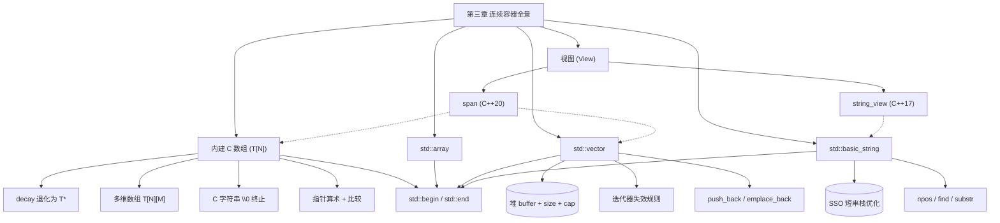

# 第三章：数组、 vector 与字符串

> **一句话定义**：本章是 C++ 连续序列容器的工程速查手册——围绕内建数组（`int a[N]`）、`std::array<T,N>`、`std::vector<T>`、`std::basic_string`，以及 C++17 `std::string_view` 与 C++20 `std::span` 这两类「轻量视图」，逐项对比内存布局、`std::begin/std::end` 迭代器、数组到指针的退化（decay）、指针算术、`size_type`、`push_back/emplace_back`、SSO 与迭代器失效规则等核心机制。

## 章节知识框架



## 3.0 容器全景速查表

> 一张大表统管全章；后续小节是它的展开。本章关注的全部是「连续内存」容器与视图；链表 / 树 / 哈希容器留给第九章。

| 容器/视图 | 头文件 | 内存布局 | 大小是否运行期可变 | 末尾插入 | 随机访问 | 迭代器类别 | C 兼容 | 典型用途 |
|---|---|---|---|---|---|---|---|---|
| `T a[N]`（内建数组） | — | 栈/全局连续 | 否（编译期固定） | × | O(1) | RA + Contiguous | 是（`a` 退化为 `T*`） | 嵌入式 / `constexpr` 表 / `char[]` 缓冲 |
| `std::array<T,N>` (C++11) | `<array>` | 同上，加成员函数包装 | 否 | × | O(1) | RA + Contiguous (C++17) | `.data()` | 替代 C 数组、可拷贝、值语义 |
| `std::vector<T>` | `<vector>` | 堆上连续 buffer | 是 | 摊还 O(1) | O(1) | RA + Contiguous (C++17) | `.data()` | 默认动态序列 |
| `std::basic_string<CharT>` | `<string>` | 连续 buffer + SSO | 是 | 摊还 O(1) | O(1) | RA + Contiguous | `.c_str()` `\0` | 字符串 |
| `std::string_view` (C++17) | `<string_view>` | (ptr, len) 借用 | — | × | O(1) | RA + Contiguous | `.data()` 不保 `\0` | 只读字符串入参 |
| `std::span<T[,N]>` (C++20) | `<span>` | (ptr, len) 借用 | — | × | O(1) | RA + Contiguous | `.data()` | 通用连续序列只读/读写视图 |

> 共同点：都满足 **ContiguousIterator**（C++17 起）——意味着 `&v[0]` 与 `&v[i] = &v[0] + i` 之间总是合法 `T*` 算术。

迭代器/指针术语对照（贯穿全章）：

| 概念 | 内建数组 | `std::array` | `std::vector` | `std::string` | view 类 |
|---|---|---|---|---|---|
| 首元素指针 | `&a[0]` / `a`（隐式 decay） | `a.data()` | `v.data()` | `s.data()` (C++17 起) | `.data()` |
| 末尾哨兵 | `a + N` | `a.data()+N` | `v.data()+v.size()` | `s.data()+s.size()` | `.data()+size()` |
| 通用 begin | `std::begin(a)` | `a.begin()` | `v.begin()` | `s.begin()` | `.begin()` |
| 通用 end | `std::end(a)` | `a.end()` | `v.end()` | `s.end()` | `.end()` |
| 反向 begin | — | `a.rbegin()` | `v.rbegin()` | `s.rbegin()` | C++20 `.rbegin()` |
| 元素数 | `std::size(a)` / `sizeof(a)/sizeof(a[0])` | `a.size()` | `v.size()` | `s.size()` | `.size()` |

godbolt（数组/`array`/`vector`/`string` 同时满足 ContiguousIterator 的静态断言）：
<https://godbolt.org/?source=#g:!((g:!((g:!((h:codeEditor,i:(filename:'1',fontScale:14,fontUsePx:'0',j:1,lang:c%2B%2B,source:'%23include+%3Carray%3E%0A%23include+%3Cvector%3E%0A%23include+%3Cstring%3E%0A%23include+%3Citerator%3E%0Atemplate%3Cclass+T%3E+constexpr+bool+is_ra+%3D+std::is_base_of_v%3Cstd::random_access_iterator_tag,typename+std::iterator_traits%3CT%3E::iterator_category%3E%3B%0Aint+main()%7B%0A++static_assert(is_ra%3Cint*%3E)%3B%0A++static_assert(is_ra%3Cstd::array%3Cint,3%3E::iterator%3E)%3B%0A++static_assert(is_ra%3Cstd::vector%3Cint%3E::iterator%3E)%3B%0A++static_assert(is_ra%3Cstd::string::iterator%3E)%3B%0A%7D'),k:50,l:'4',n:'0',o:'',s:0,t:'0'),(g:!((h:compiler,i:(compiler:g142,filters:(),lang:c%2B%2B,libs:!(),options:'-std%3Dc%2B%2B17',source:1),l:'5',n:'0',o:'+x86-64+gcc+14.2',t:'0')),k:50,l:'4',n:'0',o:'',s:0,t:'0')),l:'2',n:'0',o:'',t:'0'),version:4>

## 数组

C++ 中的「数组」分两种：**内建数组** `T[N]` 与 **`std::array<T,N>`**。本章 3.1 节主线是内建数组；`std::array` 见 9.1.1，本章只在对比表里出现。

> 内建数组：在编译期已知元素类型与个数的**连续**对象序列；通过聚合初始化（aggregate init）填充；不能整段赋值或拷贝；以「数组到指针的隐式转换（decay）」与其他大部分上下文打交道。

```c++
#include <iostream>
#include <type_traits>
#include <typeinfo>

int main()
{
    auto b = {1, 2, 3};
    std::cout << typeid(b).name() << std::endl;
    //std::cout << std::is_same_v<decltype(b),int[3]> <<std::endl;
}


//程序输出：St16initializer_listIiE
//实际数据类型：std::initializer_list<int>   //类模板所实例化出的类型


int main()
{
    int b[] = {1, 2, 3};
    auto a = b;//编译可通过，但 a 的类型绝不是 int型数组， a 的类型实际上是 int*
    
    auto& a = b;//引用避免类型退化
    std::cout << std::is_same_v<decltype(a), int(&)[3]> << std::endl;
}
```

> 易错点 ①：`auto b = {1,2,3};` 推导出的是 `std::initializer_list<int>`，**不是** `int[3]`，与「花括号 = 数组」的直觉相反。要拿到数组类型，必须用 `int b[] = {1,2,3};` 这种**完整声明**形式或加引用 `auto& a = b;` 防 decay。

**元素个数必须是一个常量表达式（编译期可计算的值）**

C 自 C99 起允许 VLA（变长数组），但 **C++ 标准从未接纳 VLA**；`int n; int a[n];` 在 g++ 下是非标准扩展。要运行期决定长度请用 `std::vector` 或 `std::make_unique<T[]>(n)`。

```c++
#include <iostream>
#include <typeinfo>

int main()
{
    char str[] = "Hello";//简化写法
    std::cout << std::is_same_v<decltype(str),char[6]> << std::endl;
    //在字符串最后隐式+0 表示字符串结束
    char str[] = {'H','e','l','l','o'，'\0'};//char[6]
    
    char str[] = {'H','e','l','l','o'};//char[5]
    std::cout << std::is_same_v<decltype(str),char[5]> << std::endl;
}


int main()
{
    int * a[3];
    std::cout << std::is_same_v<decltype(a),int*[3]> << std::endl;
}

int main()
{
    int x1;
    int x2;
    int x3;
    // 指针数组
    int *a[3] = {&x1,&x2,&x3};
    // 数组的指针
   	int (*a)[3] = {&x1,&x2,&x3};
    //  (*)修饰的是对象a,  a的类型首先是一个指针，指针解引用之后是一个包含三个元素的数组
}

```

声明语法速查（区分形似而义异）：

| 声明 | 类型 | 含义 |
|---|---|---|
| `int a[3]` | `int[3]` | 3 个 `int` 的数组 |
| `int* a[3]` | `int*[3]` | 3 个 `int*` 的数组（指针数组） |
| `int (*a)[3]` | `int(*)[3]` | **指向** 3 个 `int` 的数组的**指针**（数组的指针） |
| `int& a[3]` | — | **非法**，C++ 不支持「引用的数组」 |
| `int (&a)[3]` | `int(&)[3]` | 「数组的引用」——保留数组类型不 decay |
| `char str[]` (init by `"Hello"`) | `char[6]` | 末尾隐式 `\0` |
| `char str[]` (init by `{'H','e','l','l','o'}`) | `char[5]` | 无 `\0` |

### 声明数组的引用

```c++
#include <iostream>
#include <typeinfo>

int main()
{
    int b[3];
    // 数组的引用
    int (&a)[3] = b;
    //int& a[3] = b;//错误，不支持这样的引用
    std::cout << std::is_same_v<decltype(a), int(&)[3]> << std::endl;
    
    
    int x1;
    int x2;
    int x3;
    //int& a[3]={x1, x2, x3};//错误，不能定义引用的数组
}
```

> 工程心法：把数组作为参数传给模板函数时，**首选** `template<class T, std::size_t N> void f(T(&arr)[N])`。这种「按引用接受数组」既保留了 `N`，又避免 decay 成 `T*`；这是 `std::size`、`std::begin/end` 内部实现的关键模式。

### 数组中的元素访问

```c++
#include <iostream>
#include <typeinfo>


int main()
{
    int a[3] = {1, 2, 3};
    std::cout << a[1] << std::endl;
    std::cout << std::is_same_v<decltype((a),int(&)[3]> << std::endl;
    // a 不能被放在等号左边，因为它不能被修改；如果放在右边, 类型会发生隐式转换
    auto b = a;//  -> int*;     
    // b 会转换成int*; 且指针会指向它所包含元素的第一个元素                                    
    
    const int x = 3;// x 作为表达式 (x) 使用时，它是左值；x是左值，但它不能在被放在等号左边
    std::cout << std::is_same_v<decltype((x),const int&> << std::endl;
    
}
                                        
int main() {

    int a[3] = {4, 2, 3};

    auto b = a;
    std::cout << std::is_same_v<decltype(b),int*> << std::endl;
    std::cout << *b << std::endl;
    std::cout << b[1] << std::endl;
    std::cout << b << std::endl;
    std::cout << &(a[0]) << std::endl;
} 
                                         
Program returned: 0
Program stdout
1
4
2
0x7ffe06b722dc
0x7ffe06b722dc                                       
```

```C++
#include <iostream>
#include <type_traits>

int main() {

    int a[3] = {4, 2, 3};

    auto b = a;
    std::cout << b[1] << std::endl;
	// b[1] -> *(b+1); 
    // b中保存了一块内存，把 b 中保存的内存 +(1 * int*)  ;相当于移动 4 个字节
    // 把指针移动4个字节来解引用以获取其中元素的值
    std::cout << *(a + 1) << std::endl;//输出为 a[1]
    std::cout << 1[a] << std::endl;//同上，也可以这么表示
    //std::cout << a[100] << std::endl;//访问溢出
    //std::cout << *(a + 100) << std::endl;//上述问题的本质
    //std::cout << a[-1] << std::endl;//能通过编译，但访问越界，非常危险
    
    int x = 100;
    int* ptr = &x;
    std::cout << *ptr << std::endl;
    std::cout << ptr[0] << std::endl;// 对指针也可以用[]
    std::cout << ptr << std::endl;
    
    //x[y]  ->  *(x + y)
}
Program returned: 0
Program stdout
2
2
100
100
0x7ffe923631d0
```

下标运算符等价表速查：

| 写法 | 等价表达式 | 是否越界检查 | 备注 |
|---|---|---|---|
| `a[i]` | `*(a + i)` | × | 内建数组：经典语义 |
| `i[a]` | `*(i + a)` | × | 合法但「邪术」；不可读 |
| `*(a + i)` | 同 `a[i]` | × | 指针算术显式形式 |
| `a[-1]` | `*(a - 1)` | × | **越界**：UB（可能读到栈金丝雀） |
| `v.operator[](i)` (`std::vector`) | 同 `*(v.data()+i)` | × | UB on out-of-range（无 throw） |
| `v.at(i)` | 范围内同上 | √ | 越界抛 `std::out_of_range` |
| `std::array::at(i)` | 同上 | √ | 同上 |

### 数组到指针的隐式转换

```c++
#include <iostream>
#include <type_traits>

int main() {
    int a[3] = {1, 2, 3};
    std::cout << a[0] << std::endl;//数组到指针进行了隐式转换再处理
    std::cout << a[4] << std::endl;//不会报错，因为编译不会对它进行检查
    
    sizeof(a);	//12，不会产生数组到指针转换
    decltype(a);  // int[3]，不会产生数组到指针转换
    auto b = a; // decay, 退化     int*
    
    //可以通过声明引用来避免隐式转换
     auto& b = a; 	// int(&)[3]
}


int array[4] = {1, 2, 3 ,4};
//注意：不要使用 extern 指针来声明数组
extern int array[4];
extern int* array;//错误，运行期错误   //可编译，可链接    
//错误原因：数组和指针本质的区别，数组在内存空间保存值，指针保存的是首地址
//链接，省略了类型信息


// 1-> 00000001   ->01 00 00 00    实际，大端法
// 2-> 00000002   ->02 00 00 00
// 01 00 00 00 02 00 00 00 03 00 00 00 04 00 00 00
std::cout << array << std::endl;
Program stdout:
0x200000001


extern int array[];   //合法
std::cout << array << std::endl;//对应的地址
std::cout << array[0] << std::endl;//对应的值
```

decay 触发与豁免速查：

| 上下文 | 数组 `a` 类型 | 备注 |
|---|---|---|
| `sizeof(a)` | `int[3]`（不 decay） | 字节数 = `N * sizeof(T)` |
| `decltype(a)` | `int[3]`（不 decay） | 静态类型推导 |
| `&a` | `int(*)[3]`（不 decay） | 取整个数组的地址 |
| `auto b = a;` | `int*`（decay） | `auto` 剥落引用/cv，触发 decay |
| `auto& b = a;` | `int(&)[3]`（不 decay） | 引用形式保留 |
| `template<class T> f(T x); f(a);` | `T = int*`（decay） | 形参按值传 |
| `template<class T> f(T& x); f(a);` | `T = int[3]`（不 decay） | 形参按引用 |
| `void g(int p[3]);` 中 `p` | `int*` | 函数形参中数组语法**只是装饰**，等价 `int*` |
| `std::begin(a)` | `int*` | 数组特化重载产生指针 |
| `extern int array[];` 然后 `array[0]` | 未知边界数组 | 合法，链接时定长决定 |

> 易错点 ②：`extern int* array;` 与 `extern int array[];` 是 **ABI 上完全不同的两件事**，前者读 8 字节当指针解引用，后者直接读数组首地址处的值。链接时编译器**不会** check 类型不匹配；运行期才崩。教训：**永远不要用指针 extern 声明数组**。

### 获得指向数组开头与结尾的指针

```C++
#include <iostream>
#include <type_traits>


int main()
{
    int a[3] = {1, 2, 3};
    std::cout << &(a[0]) << std::endl;//指向数组开头元素的指针
    std::cout << a << std::endl;
    std::cout << &(a[3]) << std::endl;//指向数组结尾元素的指针
    std::cout << a + 3 << std::endl;
    
    std::cout << a << ' ' << &(a[0]) << ' ' << std::begin(a) << std::endl;
    std::cout << a + 3 << ' ' << &(a[2]) << ' ' << std::end(a) << std::endl;
    
    std::cout << a << ' ' << &(a[0]) << ' ' << std::cbegin(a) << std::endl;
    std::cout << a + 3 << ' ' << &(a[2]) << ' ' << std::cend(a) << std::endl;
    
    std::begin(a)   // int *
    std::cbegin(a)  // const int*
        
    auto b = a;
    //此时 b 不再是数组类型，因此不能再用begin和end获取数组开头和结尾元素
    std::cout << std::begin(b) << std::endl;
    std::cout << std::end(b) << std::endl;
    
    auto& b = a;//引用可以，b是a的一个别名
    std::cout << std::begin(b) << std::endl;
    std::cout << std::end(b) << std::endl;
}

extern int array[];
int main()
{
    //此处无法使用， 无法对 Unknown Bounded Array 使用
    std::cout << std::begin(array) << std::endl;
    std::cout << std::end(array) << std::endl;
}
```

`std::begin/std::end` 系列速查（`<iterator>`，对所有连续序列统一）：

| 函数 | 返回值（数组） | 返回值（容器） | C++ 版本 |
|---|---|---|---|
| `std::begin(c)` | `T*` 指向 `c[0]` | `c.begin()` | C++11 |
| `std::end(c)` | `T*` 指向 `c[N]`（哨兵） | `c.end()` | C++11 |
| `std::cbegin(c)` | `const T*` | `c.cbegin()` | C++14 |
| `std::cend(c)` | `const T*` | `c.cend()` | C++14 |
| `std::rbegin(c)` | reverse | reverse | C++14 |
| `std::size(c)` | `N` (`size_t`) | `c.size()` | C++17 |
| `std::ssize(c)` (C++20) | 同上，**带符号** `ptrdiff_t` | 同 | C++20 |
| `std::data(c)` | `T*` | `c.data()` | C++17 |
| `std::empty(c)` | `N == 0` | `c.empty()` | C++17 |

> 工程心法：**永远用 `std::begin/std::end` 而非裸 `a` 与 `a+N`**。原因：(1) 模板代码里两种容器统一；(2) 让 IDE 索引到正确的迭代器类别；(3) 防止 `a` 被无意 decay 后再 `+sizeof(a)/sizeof(a[0])` 算错（参见 3.x 「数组的其他操作」）。

### 指针算数：

```c++
#include <iostream>
#include <type_traits>

//	增加、减少
//	比较
//	求距离
//	解引用
//	指针索引

int main()
{
    int a[3] = {1, 2, 3};
    auto ptr = a;   // int*
    // 指针加减
    ptr = ptr + 1;
    auto ptr2 = a + 3;
    
    // 比较
    std::cout << (ptr == ptr2) << '\n';
    std::cout << (ptr != ptr2) << '\n';
    // 不建议对指针进行大于小于的比较
    // 如果指向一个数组的两个位置的话是可以
    // 不同数组不建议
    std::cout << (ptr > ptr2) << '\n';
    std::cout << (ptr < ptr2) << '\n';
    std::cout << (ptr >= ptr2) << '\n';
    std::cout << (ptr <= ptr2) << '\n';
    
    // 指针之间求距离, 与指针类型相关
    std::cout << ptr2 - ptr << '\n';
    
    // 指针索引
    std::cout << *ptr << '\n';
    std::cout << *a << '\n';// a 在之前被隐式转换成指针
    std::cout << ptr[0] << '\n';
    std::cout << *(ptr+1) << '\n';
}
```

指针算术合法性速查（[basic.compound]/4，[expr.add]/4）：

| 操作 | 合法范围 | 备注 |
|---|---|---|
| `p + n` / `p - n` | `[a, a+N]`（含尾哨兵） | `a + N` 不可解引用 |
| `p - q` | 同一数组内 | 返回 `ptrdiff_t` |
| `p == q` / `!=` | 任意指针 | 不同对象比较结果有限定义 |
| `p < q` / `>` | **同一数组内** | 跨数组未指定 |
| `*p` | `p ∈ [a, a+N)` | `p == a+N` 解引用是 UB |
| `p[i]` | 同 `*(p+i)` | 越界 UB |

> C++20 把 `<` 跨对象比较的「未指定」改为「显式不可比」；建议总用 `std::less<>` 或转 `uintptr_t` 来稳定排序指针。

### 数组的其他操作

```c++
#include <iostream>
#include <type_traits>

// 求元素个数
int main()
{
    int a[3];
    // 方法一
    std::cout << sizeof(a) << std::endl;
    std::cout << sizeof(int) <<std::endl;
    // 获取数组元素个数，使用 sizeof 不会退化
    std::cout << sizeof(a) / sizeof(int) << std::endl;
    
    // 方法二
    std::cout << std::size(a) << std::endl;
    
    // 方法三
    std::cout << std::end(a) - std::begin(a) << std::endl;
    std::cout << std::cend(a) - std::cbegin(a) << std::endl;
        
    auto b = a; // 对 b ，上述方法均失效，因为 b 是一个指针 int*
    //对 Unknown Bounded Array 也无法使用
}
```

求元素个数方案对照（**记住这张表，能避开 80% 的「数组长度」bug**）：

| 方法 | 返回值类型 | 数组退化为 `T*` 后是否失效 | 推荐场景 |
|---|---|---|---|
| `sizeof(a)/sizeof(a[0])` | `size_t` | 是 | C 兼容代码；编译期常量 |
| `sizeof(a)/sizeof(*a)` | `size_t` | 是 | 同上，简写 |
| `std::size(a)` (C++17) | `size_t` | 是 | **现代首选**；模板友好 |
| `std::ssize(a)` (C++20) | `ptrdiff_t` 带符号 | 是 | 与 `int i` 索引比较 |
| `std::end(a) - std::begin(a)` | `ptrdiff_t` | 是 | 与容器写法一致 |
| `extent_v<T>` (`<type_traits>`) | `size_t`（编译期） | 仅对类型 `T` 有效 | TMP / `static_assert` |
| C `ARRAYSIZE` 宏 | `size_t` | **不防退化** | 不推荐 |

### 元素遍历

```c++
#include <iostream>
#include <type_traits>
//基于元素个数
int main()
{
    int a[4] = {2, 3, 5, 7};
    
    size_t index = 0;
    while (index < std::size(a))
    {
        std::cout << a[index] << std::endl;
        index = index +1;
    }
}
//基于 (c)begin/(c)end
int main()
{
    int a[4] = {2, 3, 5, 7};
    
    auto ptr = std::cbegin(a); //int*
    while (ptr != std::cend(a))
    {
        std::cout << *ptr << std::endl;
        ptr = ptr +1;
    }
}
//基于 range-based for 循环
int main()
{
    int a[4]={1, 2, 3, 4};
    
    for (int x : a)
    {
        std::cout << x <<std::endl;
    }
}
```

三种遍历方式特性对照：

| 方式 | 元素类型可拿到 | 索引可拿到 | 适用类型 | 性能 |
|---|---|---|---|---|
| 下标 `for(i; i<N; ++i)` | 拷贝/引用，自行决定 | √ | 仅 RA + 已知 size | O(1) deref |
| 迭代器 `for(it=begin; it!=end; ++it)` | `*it` | 通过 `std::distance` | 所有容器 | O(1) deref |
| range-for `for(auto x : c)` | 拷贝 `auto x` 或引用 `auto& x` | × | 任何有 `begin/end` 的类型 | 同上；编译器展开 |
| **C++20 init-statement** `for(auto i=0; auto& x : c)` | √ | √ | 同 range-for | 同上 |

> range-for 在内建数组上**仍要求数组类型完整**（`int a[N]`，不能是 `int*`）；这与「数组到指针 decay」之前一致。

godbolt（range-for 在数组与 vector 上等价 lowering）：
<https://godbolt.org/?source=#g:!((g:!((g:!((h:codeEditor,i:(filename:'1',fontScale:14,fontUsePx:'0',j:1,lang:c%2B%2B,source:'%23include+%3Cvector%3E%0A%23include+%3Citerator%3E%0Aint+sum_arr(const+int(%26a)%5B4%5D)%7Bint+s%3D0%3Bfor(auto+x:a)s%2B%3Dx%3Breturn+s%3B%7D%0Aint+sum_vec(const+std::vector%3Cint%3E%26v)%7Bint+s%3D0%3Bfor(auto+x:v)s%2B%3Dx%3Breturn+s%3B%7D%0Aint+main()%7B%0A++int+a%5B4%5D%3D%7B1,2,3,4%7D%3B%0A++std::vector%3Cint%3E+v%7B1,2,3,4%7D%3B%0A++return+sum_arr(a)+%2B+sum_vec(v)%3B%0A%7D'),k:50,l:'4',n:'0',o:'',s:0,t:'0'),(g:!((h:compiler,i:(compiler:g142,filters:(),lang:c%2B%2B,libs:!(),options:'-std%3Dc%2B%2B17',source:1),l:'5',n:'0',o:'+x86-64+gcc+14.2',t:'0')),k:50,l:'4',n:'0',o:'',s:0,t:'0')),l:'2',n:'0',o:'',t:'0'),version:4>

### C字符串

```c++
#include <iostream>
#include <cstring>

int main()
{
    char str[] = "Hello";	// char[6] null-terminated string
    char str_1[] = { 'H', 'e', 'l', 'l', 'o' };	// 不能用指针，因为没有'\0'不会停止
    auto ptr = str; // char*
    std::cout << strlen(str) <<std::endl;
    std::cout << strlen(ptr) <<std::endl;
}
```

C 字符串 API 速查（`<cstring>` / `<string.h>`）：

| 函数 | 签名 | 复杂度 | 现代替代 |
|---|---|---|---|
| `strlen` | `size_t strlen(const char*)` | O(N)；遇 `\0` 停 | `string.size()` / `string_view.size()` |
| `strcmp` | `int strcmp(const char*, const char*)` | O(min) | `string::compare` / `<=>` |
| `strcpy` | `char* strcpy(char* dst, const char*)` | O(N)；**无边界检查** | `string = ...` |
| `strncpy` | 同上加 `n` | O(N) | 不保证 `\0` 终止；**陷阱** |
| `strcat` | append | O(M+N) | `string += ...` |
| `memcpy` | `void* memcpy(void*, const void*, n)` | O(n) | `std::copy` / `std::ranges::copy` |
| `memset` | `void* memset(void*, int, n)` | O(n) | `std::fill` / `std::ranges::fill` |
| `sprintf` | 旧式格式化 | — | C++20 `std::format` |

> 易错点 ③：`{'H','e','l','l','o'}` 形式初始化的 `char[5]` **没有** `\0`，把它当 C 字符串传给 `strlen` 是 UB；必须 `"Hello"` 双引号字面量或末尾手补 `'\0'`。

### 多维数组

```c++
#include <iostream>
#include <type_traits>


int main()
{
    int x1[3];
     
    int x2[3][4];
    x2[0]   -> int[4];
    (int int int int) (int int int int) (int int int int)
    
    int x3[3][4][5];	// x3[3 ]  ->  int[4][5]
    
    std::cout << sizeof(int) << std::endl;
    std::cout << sizeof(x2[0]) << std::endl;
    std::cout << std::is_same_v<decltype(x2[0]), int(&)[4]> << std::endl;
}

// 聚合初始化                    
int main()
{
    int x2[3][4] = {1, 2, 3, 4, 5}; 
    int x3[3][4] = {{1, 2, 3, 4}, {5, 6, 7, 8}};
    //(int, int, int, int), (int, int, int, int), (int, int, int, int)
    
    int x4[3][4] = {{1, 2, 3}, {4, 5, 6, 7}};
    int x5[3][4] = {{1, 2, 3, 4}, {5, 6, 7}};
    std::cout << x4[0][4] <<std::endl;
    std::cout << x5[1][4] <<std::endl;
    
    int x[][2] = {1, 2, 3, 4};
    int y[][3] = {1, 2, 3, 4};//   ->  y[2][3]
    std::cout << sizeof(y) <<std::endl;
}

// 多维数组索引与遍历
int main()
{
    int x2[3][4] = {1, 2, 3, 4, 5};
    std::cout << x2[0][3] << std::endl;//索引
    //for (auto p : x2) // 错误在于p隐式类型转换成了int*  无法在内嵌的for中使用begin和end
    for (auto& p : x2) 
    {       
       	for (auto q : p)
        {
            std::cout << q << '\n';//遍历
        }
    }    
}

int main()
{
    int x2[3][4][5] = {1, 2, 3, 4, 5};
    for (auto& p : x2) 
    {       
       	for (auto& q : p)
        {
            for (auto r : q)
            {
                std::cout << r << '\n';//遍历
            }
        }
    }    
}

int main()
{
    int x2[3][4] = {1, 2, 3, 4, 5};
    size_t index0 = 0;
    while (index0 < std::size(x2))
    {
        size_t index1 = 0;
        while (index1 < std::size(x2[index0]))
        {
            std::cout << x2[index0][index1] << std::endl;
            index1 = index1 + 1;
        }
        index0 = index0 + 1;
    }
}
```

多维数组类型分解速查：

| 表达式 | 类型 | 元素数 |
|---|---|---|
| `int x2[3][4]` | `int[3][4]` | 12 |
| `x2[0]` | `int(&)[4]` | 4 |
| `x2[0][0]` | `int&` | 1 |
| `sizeof(x2)` | `12 * sizeof(int)` | — |
| `sizeof(x2[0])` | `4 * sizeof(int)` | — |
| `decltype(x2[0])` | `int(&)[4]` | — |
| `int x3[3][4][5]` | `int[3][4][5]` | 60 |
| `x3[0]` | `int(&)[4][5]` | 20 |

> 易错点 ④：多维数组 range-for **外层必须 `auto&` 或 `auto&&`**，写 `auto p : x2` 会让 `p` 退化为 `int*`，内层 range-for 失效。`int (&p)[4]` 才是「数组的引用」。

### 指针与多维数组

```c++
#include <iostream>
#include <type_traits>

int main()
{
    int x2[3][4][5]; 
    auto ptr = x2;  //  ->  int (*ptr)[4][5] = x2;
    
    x2[1] ->  *(x2 + 1) // x2 移动一个元素所占的空间 
    // 不是移动一个int型（所以需要转换成指针）, 这样才满足 + 1 后移动低维个数的int型
    // 转换为指针只会丢掉最高维的信息
}

// 使用类型别名来简化多维数组指针的声明
using A2 = int[4][5];

int main()
{
    int x2[3][4][5];
    // 也可以这样定义   A2 x2[3]; // 这种定义方式，维度排列从低到高
    A2* ptr = x2;
    auto ptr1 = ptr[0];
    
}

int main()
{
    int x2[3][4] = {};
    auto ptr = std::begin(x2);
    while ( ptr != std::end(x2))
    {
        auto ptr2 = std::begin(*ptr);
        while (ptr2 != std::end(*ptr))
        {
            ptr2 = ptr2 + 1;
        }
        ptr = ptr + 1;
	}
}
// 作业：为什么range-based for不能使用
// 写一个for循环来遍历，再写一个基于指针的遍历。对比二者区别，为何for遍历不了
// C++ insights
#include <iostream>
#include <type_traits>

int main()
{
  int x2[3][4] = {0, 0, 0, 0, 0, 0, 0, 0, 0, 0, 0, 0};
  int (*ptr)[4] = std::begin(x2);
  while(ptr != std::end(x2)) {
    int * ptr2 = std::begin(*ptr);
    while(ptr2 != std::end(*ptr)) {
      ptr2 = (ptr2 + 1);
    }
    
    ptr = (ptr + 1);
  }
  
  return 0;
}
```

多维数组 decay 规则——「只丢最外维」：

| 原类型 | `auto ptr = x;` 后 | 指针算术 `ptr + 1` 移动的字节 |
|---|---|---|
| `int[3]` | `int*` | `sizeof(int)` |
| `int[3][4]` | `int(*)[4]` | `4 * sizeof(int)` |
| `int[3][4][5]` | `int(*)[4][5]` | `20 * sizeof(int)` |

> 工程心法：多维数组接口里**永远写 `T (*p)[N]` 或类型别名 `using Row = int[N]; Row*` 而不是 `T**`**。`T**` 是「指针数组」而非「数组的指针」，二者内存布局不同。`int**` 与 `int[3][4]` 不兼容。

## vector

> 元素连续存储的序列容器；运行期可改变元素个数；其内部维护三个字段 `T* buffer_, size_, capacity_`；末尾增删摊还 O(1)、中间增删 O(N)、随机访问 O(1)。

```c++
#include <iostream>
#include <vector>
#include <type_traits>

// vector 可在运行期动态改变元素个数
// 性能比内建数组差，更侧重易用性

int main()
{
    int a[3];
    int b[3] = a;	// 数组不支持复制，占太多资源
    std::vector<int> x;  // 创建 x 对象; 缺省，元素是0个；可插入、删除元素
    std::vector<float> y;
    std::vector<int> y;
    y = x;	// vector 支持复制

}

// 构造与初始化
int main()
{
    int a[3] = {1, 2, 3};
    std::vector<int> x = {1, 2, 3};
    std::vector<int> y(3); //y中包含3个元素，int型，且被初始化为0
    std::vector<int> z(3,1); //z中包含3个元素，int型，且被初始化为1
    std::vector<int> z = {1, 1, 1};
    std::vector<int> z1{3, 1};// z1包含2个元素，第一个是3，第二个是1
}

// 获取元素个数
int main()
{
    std::vector<int> x1;
    std::cout << x1.size() << std::endl;	
    std::cout << x1.empty() << std::endl;
    
    // 向其中添加一个元素 2 ; 在结尾插入
    x1.push_back(2);	// 运行期执行 
    std::cout << x1.size() << std::endl;	
    std::cout << x1.empty() << std::endl;
    
    x1.pop_back();	// 把数组最后一位弹出来，从x1中删除元素
    std::cout << x1.size() << std::endl;	
    
	// vector 比较
    // vector 的比较实际上是调用字典来比较
    // 从第一个元素开始比较哪个大
    std::vector<int> x1 = {1, 2, 3};
    std::vector<int> x2 = {1, 3, 2};
    std::cout << (x1 == x2) << std::endl;	
	std::cout << (x1 > x2) << std::endl;	
}
```

vector 构造函数速查（参照 cppreference）：

| 写法 | 元素 | 备注 |
|---|---|---|
| `vector<int> v;` | 0 个 | size = cap = 0；不分配 |
| `vector<int> v(3);` | 3 个 0 | 值初始化 |
| `vector<int> v(3, 1);` | 3 个 1 | 填充 |
| `vector<int> v{3, 1};` | 2 个: `3, 1` | **`initializer_list` 优先匹配**——「最经典坑」 |
| `vector<int> v = {1,2,3};` | `1, 2, 3` | 拷贝初始化 |
| `vector<int> v(a, a+N);` | 从迭代器对 | 任何 InputIt |
| `vector<int> v(c);` | 拷贝构造 | 同类型 |
| `vector<int> v(std::move(c));` | 移动构造 | 转移所有权；O(1) |
| C++17 CTAD：`vector v{1,2,3};` | `vector<int>` | 类模板实参推导 |

> 易错点 ⑤：`vector<int> v(3, 1)` 是「3 个 1」，`vector<int> v{3, 1}` 是「`{3, 1}` 两个元素」——**圆括号 vs 花括号语义不同**。Scott Meyers 称之为 "the most vexing brace"。规则：**只要容器能接受 `initializer_list`，花括号永远先匹配 `initializer_list` 重载。**

vector 接口分类速查：

| 类别 | 接口 | 复杂度 |
|---|---|---|
| 容量 | `size / max_size / capacity / empty / reserve(n) / resize(n[,v]) / shrink_to_fit` | O(1) (前 4 个) / O(N) (扩容) |
| 元素访问 | `operator[](i) / at(i) / front / back / data` | O(1) |
| 迭代器 | `begin/end/cbegin/cend/rbegin/rend/crbegin/crend` | O(1) |
| 末尾插入 | `push_back / emplace_back` (C++11) | 摊还 O(1) |
| 末尾删除 | `pop_back` | O(1) |
| 任意位置插入 | `insert(pos, ...) / emplace(pos, ...)` | O(N) |
| 任意位置删除 | `erase(pos) / erase(first,last) / clear` | O(N) |
| 元素交换 | `swap(other)` | O(1)（仅互换内部 3 字段） |
| 比较 | `== != < <= > >= <=>` (C++20) | O(N) 字典序 |

容量函数对比：

| 接口 | 含义 | 副作用 |
|---|---|---|
| `size()` | 当前元素数 | 无 |
| `capacity()` | 已分配容量 | 无 |
| `max_size()` | 理论上限（约 `2^61-1` for 64-bit `int`） | 无 |
| `reserve(n)` | 预分配 ≥ n | 若 `n>cap`，触发重分配 + 拷贝/移动，迭代器全失效 |
| `resize(n[, v])` | 调整 size 到 n | 可能触发重分配；构造或析构元素 |
| `shrink_to_fit()` (C++11) | 把 cap 收到 size | 非绑定请求；通常触发重分配 |

`push_back` vs `emplace_back` 关键差异：

| 维度 | `push_back(x)` | `emplace_back(args...)` |
|---|---|---|
| 加入版本 | C++98 | C++11 |
| 入参 | 一个已构造对象 | 元素构造函数的实参 |
| 路径 | (构造 +) 拷贝/移动 | **就地构造**（in-place） |
| 模板 | 单一签名 | 变长模板 + 完美转发 |
| 隐式转换 | √ | × （C++17 才返回引用） |
| 推荐场景 | 元素本就在手 | 构造函数有多参/想避免临时对象 |

vector 迭代器/引用失效规则：

| 操作 | 何时全部失效 | 何时部分失效 | 何时永不失效 |
|---|---|---|---|
| `push_back` / `emplace_back` | `size+1>cap` 触发重分配 | — | `size<cap` |
| `insert(pos, ...)` | `size+n>cap` 触发重分配 | 否则 `[pos, end)` 失效 | — |
| `erase(pos)` | — | `[pos, end)` 失效 | — |
| `reserve(n)` | `n>cap` 触发重分配 | — | `n<=cap` |
| `resize(n)` | `n>cap` 触发重分配 | `n<size` 时 `[n, size)` 失效 | `n<=size` 且不缩 cap |
| `clear()` | — | 全部失效（`end()` 仍合法） | — |
| `swap(b)` | a/b 互换；旧迭代器随原 vector 指向另一个对象 | — | — |
| `shrink_to_fit()` | 通常触发重分配 → 全失效 | — | 没收缩时 |

godbolt（`reserve` 防止迭代器失效 + `emplace_back` vs `push_back`）：
<https://godbolt.org/?source=#g:!((g:!((g:!((h:codeEditor,i:(filename:'1',fontScale:14,fontUsePx:'0',j:1,lang:c%2B%2B,source:'%23include+%3Cvector%3E%0A%23include+%3Cstring%3E%0A%23include+%3Ciostream%3E%0Astruct+S%7BS(const+char*)%7Bstd::cout%3C%3C%22ctor+%22%3B%7D+S(const+S%26)%7Bstd::cout%3C%3C%22copy+%22%3B%7D+S(S%26%26)noexcept%7Bstd::cout%3C%3C%22move+%22%3B%7D%7D%3B%0Aint+main()%7B%0A++std::vector%3CS%3E+v%3B+v.reserve(4)%3B%0A++std::cout%3C%3C%22pb:+%22%3B+v.push_back(%22a%22)%3B+std::cout%3C%3C!'%5Cn!'%3B%0A++std::cout%3C%3C%22em:+%22%3B+v.emplace_back(%22b%22)%3B+std::cout%3C%3C!'%5Cn!'%3B%0A%7D'),k:50,l:'4',n:'0',o:'',s:0,t:'0'),(g:!((h:compiler,i:(compiler:g142,filters:(),lang:c%2B%2B,libs:!(),options:'-std%3Dc%2B%2B17',source:1),l:'5',n:'0',o:'+x86-64+gcc+14.2',t:'0')),k:50,l:'4',n:'0',o:'',s:0,t:'0')),l:'2',n:'0',o:'',t:'0'),version:4>

### vector 中元素的索引与遍历：

```c++
#include <iostream>
#include <vector>

int main()
{
    int a[3] = {1, 2, 3};
    std::begin(a);      // 获取一个指针指向a中的第一个元素
    std::vector<int> x1 = {1, 2, 3};
    std::begin(x1);		// 获取一个东西指向a中的第一个元素，非指针
    auto b = std::begin(x1);
    auto e = std::end(x1);
    std::cout << x1[2] << std::endl;	// 索引
    std::cout << x1.at(2) << std::endl;	// 用[]可能会越界
}

// 元素遍历
int main()
{
    std::vector<int> x1 = {1, 2, 3};
    auto b = x1.begin();
    while ( b != x1.end() )
    {
        std::cout << *b << std::endl;
        b = b + 1;
    }
    for (auto val : x1)
    {
        std::cout << val << std::endl;
    }
    // 调用std::begin与std::end不再是一个指针
    // 返回的是 iterator 迭代器，模拟指针的行为
    auto b = std::begin(x1);
    auto e = x1.end;	//两种写法都可以
    
    // Iterator invalidation
    x1.push_back(3);   // 添加元素之前的 b 和 e 可能就失效了
}

// 多维vector
int main()
{
    int a[3][4];
    std::vector<std::vector<int>> x;
    x.push_back(std::vector<int>());
    x[0].push_back(1);
    std::cout << x[0][0] <<std::endl;
    
    // 聚合初始化，第一个vector包含了3个元素，第二个vector包含了2个元素
    std::vector<std::vector<int>> x1{{1, 2, 3}, {4, 5}};
    std::cout << x1[1][2] <<std::endl;
}

// 从 . 到 -> 操作符
int main()
{
    std::vector<int> x;
    std::cout << x.size() <<std::endl;
    
    // 使用 ptr 访问 x
    std::vector<int>* ptr = &x;
    std::cout << (*ptr).size() <<std::endl;
    std::cout << ptr -> size() <<std::endl;
    // 只要是指针指向某一个类的对象，就可以用 -> 操作符调用类所包含的方法
} 
```

`operator->` 与 `(*ptr).` 等价性速查：

| 表达式 | 等价 | 备注 |
|---|---|---|
| `ptr->m` | `(*ptr).m` | `ptr` 是原生指针 |
| `it->m` | `(*it).m` | `it` 是迭代器，类要重载 `operator->` |
| `sp->m` | `(*sp).m` | `sp` 是智能指针 |
| `obj.m` | — | `obj` 是值/引用 |

> 工程心法：vector 上**不要保存迭代器跨越增删操作**。把「位置」用 `size_t i` 索引保存，或用 `it - v.begin()` 转 offset，等增删后再 `v.begin() + offset` 复原。

`size_type` 与符号性问题：

| 类型 | 含义 | 注意 |
|---|---|---|
| `std::vector<T>::size_type` | 通常是 `std::size_t`（无符号） | `v.size() - 1` 当 `size == 0` 时是天文数字 |
| `std::vector<T>::difference_type` | 通常是 `std::ptrdiff_t`（有符号） | `it1 - it2` 类型 |
| `int i = 0; i < v.size()` | **有符号 vs 无符号比较** | 编译器警告；倒序循环陷阱 |
| C++20 `std::ssize(v)` | `ptrdiff_t` | 解决符号陷阱 |

## string

> `std::basic_string<CharT>` 是 STL 提供的字符串容器；`std::string` = `basic_string<char>`；与 `std::vector<char>` 相比，额外提供 `find / substr / npos / c_str` 等字符串语义，以及 **SSO 短串栈优化**。

```c++
#include <iostream>
#include <string>

int main()
{
    std::string x = "Hello World";
    std::string y = x;
    y = y + " !";
}

int main()
{	
    // 参照cppreference中string的构造函数
    std::string x(3,'a');	// 构造了 3 个字符，每个字符是 a
    // basic_string( const basic_string& other )
    std::string y(x);	// 更常用
    y = y + " !";
    std::cout << y << '\n';
}

// 其他方法
// 尺寸（size/empty）
// 比较、赋值、拼接、索引
// 转换为 C 字符串
int main()
{
    std::string x("hello world");
    std::string y("hello");
    std::cout << (y < x) << '\n';
    
    y = "New String";
    // 拼接
    y = y + x;
    //  "New String" + "hello world" 不合法
    y = y + "New String";// string 里定义的operator
    // y = "New String" + "hello world" + x ;// 不合法
    y = std::string("New String") + "hello world" + x ;// 构造临时对象
    y = std::string("New String") + "hello world" + " !" ;// 从左到右
    std::cout << y << '\n';
    // 索引
    std::cout << y[2] << std::endl;
    
    // 转换为 C 字符串
    auto ptr = y.c_str();// 看cppreference的定义
    // const CharT* c_str() const
    // Returns a pointer to a null-terminated character array 
    // with data equivalent to those stored in the string.
    std::cout << ptr << std::endl;
    std::cout << std::is_same_v<decltype(ptr),const char*> << std::endl;
}
```

`std::string` 构造函数速查：

| 写法 | 结果 | 备注 |
|---|---|---|
| `string s;` | 空 | `""`，长度 0 |
| `string s(3, 'a');` | `"aaa"` | 重复 |
| `string s("hello");` | `"hello"` | 从 C 字符串 |
| `string s("hello", 3);` | `"hel"` | 前 3 个字符 |
| `string s(other);` | 拷贝 | 深拷贝 buffer |
| `string s(other, pos, len);` | 子串 | 从 `pos` 取 `len` |
| `string s(it1, it2);` | 迭代器对 | 任意 InputIt |
| `string s{'a', 'b'};` | `"ab"` | `initializer_list<char>` |
| `string s = "hello"sv;` (C++17) | 从 `string_view` | 需 `using namespace literals;` |

字符串典型 API 速查：

| 类别 | 接口 | 备注 |
|---|---|---|
| 容量 | `size / length / empty / max_size / capacity / reserve / shrink_to_fit` | `size == length` |
| 元素访问 | `operator[] / at / front / back / data / c_str` | `at` 抛异常，`[]` UB |
| 末尾追加 | `push_back / pop_back / append / operator+=` | 摊还 O(1) |
| 拼接 | `operator+ / append` | 返回新 string |
| 查找 | `find / rfind / find_first_of / find_last_of / find_first_not_of / find_last_not_of` | 全部使用 `npos = size_type(-1)` 表示失败 |
| 子串 | `substr(pos, len)` | 返回新 string；高频写法应换 `string_view` |
| 修改 | `insert / erase / replace / clear` | 与 vector 接口对应 |
| 转换 | `c_str() / data()` | C++17 起 `data()` 也保证 `\0` |
| 与数值互转 | `std::to_string` / `std::stoi / std::stol / std::stof / std::stod` | `<string>` 头 |
| 比较 | `compare / == != < > <=> (C++20)` | 字典序 |

字符串拼接合法性「左到右」规则速查（重点）：

| 表达式 | 是否合法 | 原因 |
|---|---|---|
| `string("a") + "b"` | √ | `string + const char*` |
| `"a" + string("b")` | √ | `const char* + string` |
| `"a" + "b"` | **×** | `const char[N] + const char[M]` 是指针算术 |
| `"a" + "b" + string("c")` | × | 左侧先求值，与上一行同理 |
| `string("a") + "b" + "c"` | √ | 左到右：`(string("a") + "b") + "c"` |
| `string{} + 'x'` | √ | `string + char` |

> 易错点 ⑥：`auto s = "a" + "b";` 会编译失败——这是「两个字面量相加」，C++ 把 `"a"` 当 `const char[2]`，相加是非法指针算术。修复：**第一个操作数显式做成 `string`**，例如 `using namespace std::literals; auto s = "a"s + "b";`。

短串栈优化（SSO）实现速查（**实现定义**，仅供工程估算）：

| 实现 | `sizeof(std::string)` | SSO 容量上限 | 备注 |
|---|---|---|---|
| libstdc++ (GCC) | 32 | 15 | `_M_local_buf[16]` |
| libc++ (Clang) | 24 | 22 | 紧凑布局；`size << 1` 标志位 |
| MSVC | 32 | 15 | 同 GCC |

> 工程心法：**永远不要假设 SSO 上限**——SSO 只是性能优化，不是 API 契约。但短字符串作为 hash 表 key、log 行的中间载体时，SSO 能显著降低 malloc 压力。

godbolt（`string::find / substr / starts_with` 与 SSO 大小观察，C++20）：
<https://godbolt.org/?source=#g:!((g:!((g:!((h:codeEditor,i:(filename:'1',fontScale:14,fontUsePx:'0',j:1,lang:c%2B%2B,source:'%23include+%3Cstring%3E%0A%23include+%3Ciostream%3E%0Aint+main()%7B%0A++std::string+s+%3D+%22hello+world%22%3B%0A++std::cout+%3C%3C+%22sizeof(string)+%3D+%22+%3C%3C+sizeof(s)+%3C%3C+!'%5Cn!'%3B%0A++std::cout+%3C%3C+%22find(world)+%3D+%22+%3C%3C+s.find(%22world%22)+%3C%3C+!'%5Cn!'%3B%0A++std::cout+%3C%3C+%22substr(0,5)+%3D+%22+%3C%3C+s.substr(0,5)+%3C%3C+!'%5Cn!'%3B%0A++std::cout+%3C%3C+std::boolalpha+%3C%3C+s.starts_with(%22hello%22)+%3C%3C+!'%5Cn!'%3B%0A++std::cout+%3C%3C+s.ends_with(%22world%22)+%3C%3C+!'%5Cn!'%3B%0A%7D'),k:50,l:'4',n:'0',o:'',s:0,t:'0'),(g:!((h:compiler,i:(compiler:g142,filters:(),lang:c%2B%2B,libs:!(),options:'-std%3Dc%2B%2B2a',source:1),l:'5',n:'0',o:'+x86-64+gcc+14.2',t:'0')),k:50,l:'4',n:'0',o:'',s:0,t:'0')),l:'2',n:'0',o:'',t:'0'),version:4>

## 3.x C++17/20/23 现代化补丁

> 本章主线写于 C++17 视角。下列条目是工程上**强烈建议**在新代码里用的新机制，按使用频率排序。

### 3.x.1 `std::string_view`（C++17）

```cpp
#include <string_view>
void log(std::string_view sv);   // 接受 const char*、std::string、迭代器对

constexpr std::string_view kHint = "hello";
log(kHint);
log("literal");
std::string s = "abc";
log(s);
```

- 两个 8 字节字段：`const char* data_, size_t size_`；按值传递就好，不要 `const string_view&`。
- **不保证 `\0`**：`sv.data()` 不能直接传给 `printf("%s", ...)`，必要时 `std::string(sv).c_str()`。
- 风险：`std::string_view fn() { std::string s = ...; return s; }` 返回 **悬空** view。

### 3.x.2 `std::span<T[,N]>`（C++20）

```cpp
#include <span>
void scale(std::span<int> xs, int k) {
    for (auto& x : xs) x *= k;
}
int a[4] = {1,2,3,4};
std::vector<int> v = {1,2,3};
scale(a, 2); scale(v, 3); scale({v.data(), 2}, 4);
```

- 与 `string_view` 同结构，但元素可读写（`span<T>`）或只读（`span<const T>`）。
- 替代裸 `T*, size_t` 二元参数列表的**首选**。
- 静态 extent：`std::span<int, 4>` 编译期固定大小，性能等价于 `int(&)[4]`。

### 3.x.3 `string::starts_with / ends_with`（C++20）/ `contains`（C++23）

```cpp
std::string s = "config.toml";
if (s.ends_with(".toml")) { /* ... */ }   // C++20
if (s.contains("conf"))   { /* ... */ }   // C++23
```

- 老代码常见的 `s.compare(0, 4, "conf") == 0` 可以直接替换。
- `string_view` 同样提供这三个成员。
- 参考：[cppreference: std::basic_string::starts_with](https://en.cppreference.com/w/cpp/string/basic_string/starts_with)；提案 [P0457R2 (starts_with/ends_with)](https://wg21.link/P0457)、[P1679R3 (contains)](https://wg21.link/P1679)。

### 3.x.4 `std::ssize` 与 `std::size`（C++17/20）

```cpp
for (std::ptrdiff_t i = std::ssize(v) - 1; i >= 0; --i) { /* 倒序安全 */ }
```

- `std::size(c)` 返回 `size_t`，对所有 array/`array`/`vector`/`string` 统一。
- `std::ssize(c)` 返回**带符号** `ptrdiff_t`；解决「`v.size() - 1` 在空容器下溢」问题。
- 参考：提案 [P1227R2 (Signed `ssize`)](https://wg21.link/P1227)。

### 3.x.5 `std::format`（C++20）/ `std::print`（C++23）

```cpp
#include <format>
std::string msg = std::format("v.size()={}, capacity={}", v.size(), v.capacity());
// C++23: std::print("{}\n", msg);
```

- 替代 `std::stringstream`、`sprintf`；类型安全 + Python f-string 风格。
- 参考：[cppreference: std::format](https://en.cppreference.com/w/cpp/utility/format/format)。

### 3.x.6 CTAD（C++17）

```cpp
std::vector v{1, 2, 3};        // → std::vector<int>
std::array a{1.0, 2.0, 3.0};   // → std::array<double, 3>
std::string s = "hi";          // 旧
```

- 容器声明不再写元素类型；但要注意 `std::vector<int> v{3,1}` 与 `std::vector v(3,1)` 的隐藏分歧（详见构造函数表）。

### 3.x.7 `std::array` deduction guide & `to_array`（C++17/20）

```cpp
auto a = std::to_array({1, 2, 3});             // C++20: std::array<int, 3>
std::array<int, 3> b{1, 2, 3};                 // 经典写法
```

- `to_array` 从 C 数组安全构造 `std::array`；适合在常量表中替换 `int[]`。

### 3.x.8 designated initializer（C++20，主用于结构体；与本章相邻）

```cpp
struct Pixel { int r, g, b; };
Pixel p{.r=255, .g=0, .b=255};
```

- 数组**不支持** designated init（`int a[3] = {[0]=1, [2]=3};` 是 C99 特性，不在 C++ 标准）。

## 易错点 / 现代 C++ 补丁

> 工程师在实战中最常踩的 10 个坑，对应 C++17/20/23 标准化替代方案。

1. **数组到指针的隐式 decay 丢失 `N`**：模板里写 `template<class T, size_t N> void f(T(&a)[N])` 而非 `void f(T* a)`；用 `std::span` 或 `std::array` 携带长度。参考：[cppreference: array-to-pointer conversion](https://en.cppreference.com/w/cpp/language/implicit_conversion#Array-to-pointer_conversion)。
2. **`vector<int> v{3, 1}` vs `v(3, 1)` 隐藏歧义**：花括号永远优先匹配 `initializer_list` 构造；要 `n` 个 `v` 必须用圆括号。规避：写 `std::vector<int>(3, 1)` 加 `()` 显式断意；C++17 CTAD 同样要小心。
3. **`auto b = a; b[0]` 越界查不出**：`auto` 让数组退化为 `T*`，丢掉 `sizeof(a)`。改用 `auto& b = a;` 或 `std::span<int>`。
4. **`{'a','b','c'}` 与 `"abc"` 末尾 `\0` 差一**：`char[3]` vs `char[4]`；`strlen(c_array)` 在前者上是 UB。修：永远用字符串字面量或 `std::string`/`std::string_view`。
5. **C++20 前 `string::starts_with` 不存在**：旧代码 `s.compare(0, 4, "conf") == 0` 多。升 C++20 后直接 `s.starts_with("conf")`。参考：[P0457R2](https://wg21.link/P0457)。
6. **`auto s = "a" + "b"` 编译失败**：两个字面量相加是指针算术。修：`"a"s + "b"`（C++14 `<string>` 字面量）或 `std::string("a") + "b"`。
7. **vector 迭代器被 `push_back` 失效**：循环里收集 iterator 再删除，扩容后全部悬空。规避：用 `size_t` 索引保存位置；批量删除用 erase-remove `v.erase(std::remove_if(v.begin(),v.end(),pred), v.end())`；C++20 起可用 `std::erase_if(v, pred)` 一行。参考：[P1209R0 (Erasure functions)](https://wg21.link/P1209)。
8. **`vector<bool>` 不是 vector**：`operator[]` 返回代理类型不是 `bool&`；不能 `auto& b = v[i];`。替代：`std::vector<char>` 或 `std::array<bool, N>` 或 `std::bitset<N>`。参考：[cppreference: vector\<bool\>](https://en.cppreference.com/w/cpp/container/vector_bool)。
9. **`string_view`/`span` 悬空**：返回临时 `std::string` 的视图、捕获 prvalue 的 view 都会立刻悬空。规则：把 view 当成「短生命周期、不持有的窗口」用。C++23 [P2255R2 (Reject dangling references)](https://wg21.link/P2255) 部分场景已硬错。
10. **`v.size() - 1` 在空容器下溢**：`size_type` 是无符号；下溢得到 `SIZE_MAX`。修：先判 `if (!v.empty())`；或 C++20 `std::ssize(v)` 返回带符号 `ptrdiff_t`。参考：[P1227R2](https://wg21.link/P1227)。

参考资源：

- cppreference: [vector](https://en.cppreference.com/w/cpp/container/vector) / [array](https://en.cppreference.com/w/cpp/container/array) / [basic_string](https://en.cppreference.com/w/cpp/string/basic_string) / [string_view](https://en.cppreference.com/w/cpp/string/basic_string_view) / [span](https://en.cppreference.com/w/cpp/container/span)
- WG21 提案：[P0220 string_view](https://wg21.link/P0220)、[P0122 span](https://wg21.link/P0122)、[P0457 starts_with/ends_with](https://wg21.link/P0457)、[P1679 contains](https://wg21.link/P1679)、[P1227 ssize](https://wg21.link/P1227)
- godbolt 链接均使用 `x86-64 gcc 14.2`，`-std=c++17`（C++20/23 条目用 `-std=c++2a`/`-std=c++2b`），保留完整 `source/compiler` 参数避免 shortlink rot

[相关模块：→ drawio/03.containers-iterators.svg](../drawio/03.containers-iterators.svg)
[相关模块：→ drawio/01.type-system.svg](../drawio/01.type-system.svg)
