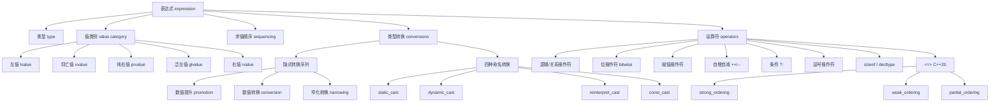

# 第四章：表达式

> **一句话定义**：表达式（expression）是 C++ 程序的"求值原子"，由**操作数（operand）**与**运算符（operator）**组合而成；每个表达式同时拥有**类型（type）**与**值类别（value category：lvalue / xvalue / prvalue 及其超类 glvalue / rvalue）**两个属性，并在**求值顺序（evaluation order / sequenced-before）**、**类型转换序列（standard conversion sequence + user-defined conversion）**、**`static_cast` / `dynamic_cast` / `reinterpret_cast` / `const_cast` 四种命名转换**、C++20 的 `<=>` 三路比较（spaceship operator）、收缩转换（narrowing conversion）等规则共同作用下决定一段代码的实际语义与可移植性。本章是 BZY C++ Notes 的「原理版」镜像，按"Why → Mechanism → Standard Clause → Practice → Modern Replacement"的金样路径，把表达式从值类别讲到 C++17 求值顺序新规与 C++20 spaceship。

## 章节知识框架



> **金样口径**：本章按 **Why → Mechanism → Standard Clause（cppreference + N4861 §） → Practice → Modern Replacement** 五段式展开每个 `##` 主题；关键引用包括 P0145R3（C++17 求值顺序统一）、P0515R3（spaceship operator）、P2266R3（更简单的隐式移动 / Implicit move for rvalue references）、cppreference [value_category]、[eval_order]、[expressions]。

---

## 表达式基础

### 0. 节段动机

「表达式（expression）」是 C++ 语义模型里最底层、却最容易被低估的对象。一段代码 `x = x + 1` 既牵涉求值顺序（先算右边 `x+1`，结果再赋给 `x`），又牵涉值类别（`x` 是 lvalue、`x+1` 是 prvalue），还牵涉隐式类型转换（如果 `x` 是 `short`，则会触发整型提升）。从 C++98 到 C++17，**求值顺序的不确定性**一直是大多数"我代码在 GCC 是 A 结果，clang 是 B 结果"问题的根源；而 C++17 P0145R3、C++20 P0145 后续条款大幅收紧了这套规则。本节先用法律口径建立"表达式 = 操作数 + 运算符 + 类型 + 值类别 + 求值顺序"的五元组心智模型，再展开后续 5 个细分主题。

> 一个对象不是左值or右值
> 仅在其作为表达式存在时，且同时对这个对象所表示的表达式进行求值之后，
> 得到的结果 才是左值和右值

### 1. 求值顺序与不可预期行为（Sequencing · C++17 P0145R3 之前 / 之后）

#### Why

最经典的"陷阱代码"如下：函数 `fun(x = x + 1, x = x + 1)` 在 clang 与 g++ 下输出不同。看似无害，却在生产代码里能演变成"周一在 CI 通过、周二在客户机崩"的诡异现象。这背后是 C++98/03/11/14 标准对**函数实参求值顺序**的有意未规定（unspecified），编译器可以为优化（如指令调度、寄存器复用）自由选择顺序。从 C++17 起，P0145R3 把这一类规则统一收紧：表达式 `E1` 与 `E2` 在赋值、复合赋值、`++`/`--`、`.`/`->`、`.*`/`->*`、`<<`/`>>`、`&&`/`||`/`?:`/`,` 等运算符附近的求值顺序得到了**明确的 sequenced-before 关系**；函数调用的实参之间则仍保留 unsequenced（C++17 仅保证"每个实参表达式的内部 sequenced-before 关系成立，实参之间无 sequenced-before"）。

#### Mechanism

C++ 标准用三种关系刻画求值之间的偏序：

| 关系 | 含义 | 典型示例 |
|---|---|---|
| **sequenced-before（A 在 B 之前完成）** | A 的所有副作用与值计算在 B 开始之前完成 | `;` 分号语句之间；`&&` `||` `?:` `,` 的左右；`a[i]` 中 `a` 在 `i` 之前 |
| **sequenced-after（B 在 A 之后）** | sequenced-before 的反向 | 同上反向 |
| **indeterminately sequenced（A B 顺序不定但不交错）** | 实现可任选先 A 后 B 或先 B 后 A，但二者内部不能交错 | C++17 起：函数实参之间 |
| **unsequenced（A B 可以交错）** | 实现可在 A 没完成时插入 B 的步骤 | 对 *同一标量对象*的两次修改且无 sequenced-before：UB |

```c++
#include <iostream>

void fun(int p1, int p2)
{
    std::cout << p1 << ' ' << p2 << '\n';
}
int main()
{
    int x = 0;
    fun(x = x + 1 ,x = x + 1); 	// 不同编译器输出结果不一样
    // clang打印结果： 1  2
    // gcc打印结果： 2  2
    
    /*
    //clang
    x = x + 1  ->  arg1
    p1 = arg1
    x = x + 1  ->  arg2
    p2 = arg2
    
    g++
    x = x + 1  ->  arg1
    x = x + 1  ->  arg2
    p1 = arg1
    p2 = arg2
    
 ////////////////////////////
    int a = 1;
    int b = 2;
    
    b = 4;// 编译尝试调整先后顺序，提高程序执行速度
    a = 3;
    */
}

// 正解
int main()
{
    // 生成依赖关系，防止编译器进行乱序调整
    int x = 0;
    x = x + 1;
    x = x + 1;
    fun(x,x);
}
```

> **关键解释**：上面 `fun(x = x + 1, x = x + 1)` 在 C++14 / C++17 下都是「unspecified 顺序 + 同一标量对象的两次修改无 sequenced-before」→ **未定义行为（UB）**。P0145R3 在 C++17 修复了部分（如 `<<` / `>>` / `=` / `.`），但**函数实参之间仍是 indeterminately sequenced**，故上面代码两次对 `x` 的副作用之间仍无 sequenced-before。

#### Standard Clause

- N4861 [intro.execution]/10–14：sequenced-before / indeterminately sequenced / unsequenced 三种关系定义。
- [expr.call]/8：函数实参 `(arg1, arg2, ...)` 之间 indeterminately sequenced（C++17 起）。
- [expr.ass]/1：`E1 = E2` 中 `E2` sequenced-before `E1`，赋值结果 sequenced-after 二者（C++17 起）。
- WG21 paper：**P0145R3** "Refining Expression Evaluation Order for Idiomatic C++" (Gabriel Dos Reis, Herb Sutter, Jonathan Caves)。
- cppreference：https://en.cppreference.com/w/cpp/language/eval_order

#### Practice

- **不要在同一表达式中对同一标量对象做两次修改**——除非中间有 sequenced-before（典型如 `,` 逗号操作符）。
- **拆开是最便宜的解药**：把"两次副作用"显式拆成两条语句，让 `;` 提供 sequenced-before 关系（如上面"正解"代码）。
- 编译选项：`-Wunsequenced`（clang）/ `-Wsequence-point`（gcc）能在编译期捕到 80% 的同类 bug。

#### Modern Replacement

C++17 后**多数日常运算符已有 sequenced-before**，可以放心写：

```c++
v[i] = i++;          // C++17 起：i++ 的副作用 sequenced-before LHS 求值，行为良定义
std::cout << f() << g();  // C++17 起：f() sequenced-before g()
```

但**函数实参间**与**多个独立 lambda 捕获间**仍是 indeterminately sequenced，工程上推荐"一行一副作用"，再借助 `[[nodiscard]]` / clang-tidy 自动检测。

---

### 2. 值类别（value category）

#### Why

「左值 / 右值」是 C 时代的二分概念，足够支撑赋值（"左值能放左边、右值不能"）。但 C++11 引入**移动语义（move semantics）**后，仅二分无法区分"我即将销毁的对象 vs 我还要用的对象"。N3055 / N3091 由此引入了**五分类**：lvalue / xvalue / prvalue / glvalue / rvalue，对应"是否有身份（identity）"× "是否可被移动（movable）"两个独立维度（cf. [basic.lval] 的双轴模型）。

| 类别 | 是否有身份 | 是否可被移动 | 典型来源 |
|---|---|---|---|
| **lvalue（左值）** | 有 | 否 | 变量名、`*p`、`arr[i]`、字符串字面值 `"abc"` |
| **xvalue（将亡值）** | 有 | 是 | `std::move(x)`、返回 `T&&` 的函数调用、`a.x` 当 `a` 是 xvalue |
| **prvalue（纯右值）** | 否 | 是 | 字面值（除字符串）、`T()`、算术表达式 `a+b`、返回 `T` 的函数调用（C++17 后特殊化为"未实质化值"） |
| **glvalue（泛左值）= lvalue ∪ xvalue** | 有 | — | — |
| **rvalue（右值）= xvalue ∪ prvalue** | — | 是 | — |

#### Mechanism

判定流程（[expr]/6）：先看一个表达式的语法形态，再按规则归类：

```
expression
├── 字面值 (literal)
│   ├── 字符串字面值 "abc" → lvalue（它有静态存储期、可取地址）
│   └── 其它 1, 3.14, true, nullptr → prvalue
├── id-expression (变量名 / 函数名)
│   ├── 变量名 → lvalue
│   ├── 引用变量 → 视引用本体的"原值"决定
│   ├── enumerator → prvalue
│   └── 函数名 → lvalue
├── 函数调用 f(...)
│   ├── 返回 T → prvalue
│   ├── 返回 T& → lvalue
│   └── 返回 T&& → xvalue
├── 成员访问 a.m
│   ├── m 是静态成员 / 引用成员 → 按 m 的本征
│   └── 否则：m 的类别 = a 的类别（lvalue → lvalue；rvalue → xvalue, 即"临时具体化"）
├── 强制转换
│   ├── static_cast<T&>(...) → lvalue
│   ├── static_cast<T&&>(...) → xvalue
│   └── static_cast<T>(...) → prvalue
└── ... (内置运算符各自有规定，[expr.*])
```

```c++
#include <iostream>

// 一个对象不是左值or右值
// 仅在其作为表达式存在时，且同时对这个对象所表示的表达式进行求值之后，
// 得到的结果 才是左值和右值
int main()
{ 
    int x;
    x = 3;
    // 3 = x; 无意义
}


// 纯右值

struct Str
{
    
};
int main()
{
    int{};// 构造临时对象，这类对象可用于操作符和操作数，或初始化中使用 // 纯右值
    Str{};
}


// 亡值
#include <iostream>
#include <vector>

void fun(std::vector<int>&& par)		// && 代表右值引用
{
    
}

int main()
{
    std::vector<int> x;
    fun(std::move(x));		// std::move(x) 使用x构造xvalue，转换成将亡值
    // 定义x为将亡值，表明后续不会再对x中包含的资源进行任何的处理，因为x即将消亡
}

struct Str{};

int main()
{
    const int x = 3;	// 左值 + lvalue
    x = 3; 	//左值不一定能放在左边
    
    int x = int();	// int() 纯右值
    Str x = Str();
    Str() = Str(); 	// 纯右值可以放在等号左边
}
struct Str
{
    int x;
}
void fun(const int& par)
{
    
}
    
// 左值与右值的转换
int main()
{
    int x = 3;
    int y = x;	// 左值转换为右值
    x + y = 3;
    
    // 临时具体化
    Str().x;	// prvalue -> xvalue 
   // 从Str()内存中取出相应的x
    fun(3);
}
```

> **核心补充**：C++17 引入「**临时量实质化（temporary materialization）**」（P0135R1，[class.temporary]）—— prvalue 默认**不**立即创建临时对象，只有当语法需要它"作为对象使用"（如取成员、取地址、绑定引用）时，prvalue 才被实质化为 xvalue。这就是为什么上面代码里 `Str().x` 是 **prvalue → xvalue** 的合法转换。这一改动使得 RVO 不再是"优化"而是**强制（mandatory copy elision）**。

#### Standard Clause

- [basic.lval]：值类别基础定义（C++03 的双分类历史）。
- [expr]/6：表达式分类规则统一表。
- [class.temporary]：临时量实质化（P0135R1）。
- **WG21 papers**：N3055 (Bjarne) "A Taxonomy of Expression Value Categories"、N3091 / N3055 后续、P0135R1 "Wording for guaranteed copy elision through simplified value categories"。
- cppreference：https://en.cppreference.com/w/cpp/language/value_category

#### Practice

- 「**`x = 3` 后 `3 = x` 无意义**」并不是因为"3 是右值"，而是因为**赋值运算符要求左操作数是可修改的 lvalue**。`const int x = 3; x = 3;` 也不合法，正是因为 `x` 虽是 lvalue 却不可修改。
- 「**`Str() = Str();` 可以**」看似反直觉，但 C++ 不阻止编译器为类类型重载 `operator=`，所以 prvalue 也可以被赋值（赋值表达式整体返回的是 lvalue 引用）。
- 「**字符串字面值 `"abc"` 是 lvalue**」常被新手错认成 rvalue。它的类型是 `const char[N]`，有静态存储期，可取地址。
- 「**`std::move(x)` 把 lvalue 强转为 xvalue**」—— 它**不真的移动**，仅是把值类别打上"可移动"标记，等待重载解析选中 `T&&` 形参。
- 「**`Str().x` 是 prvalue → xvalue 的临时具体化**」—— 这是 P0135R1 的核心修订点，C++17 前称为 "prvalue → xvalue conversion"。

#### Modern Replacement

C++20 引入 `[[no_unique_address]]`、C++23 引入 `if consteval`，对值类别本身改动有限，但 **P2266R3** "Simpler implicit move" 进一步澄清了 `return std::move(local)` 与"自动 move 自地命名 lvalue"的关系：在 C++23 起，函数返回时即使没写 `std::move`，本地变量在 return 语句里也会被视为 xvalue 参与重载（彻底取代 RVO 之外的"显式 move"），让代码更简洁。

---

### 3. decltype 说明符在表达式中的作用

> 2. 如果实参是其他类型为 `T` 的任何表达式，且
>
>    a) 如果 *表达式* 的[值类别](https://zh.cppreference.com/w/cpp/language/value_category)是*亡值*，将会 `decltype` 产生 `T&&`；
>
>    b) 如果 *表达式* 的值类别是*左值*，将会 `decltype` 产生 `T&`；
>
>    c) 如果 *表达式* 的值类别是*纯右值*，将会 `decltype` 产生 `T`。
>
>    | 如果 *表达式* 是返回类类型纯右值的函数调用，或是右操作数为这种函数调用的[逗号表达式](https://zh.cppreference.com/w/cpp/language/operator_other)，那么不会对该纯右值引入临时量。 | (C++17 前) |
>    | ------------------------------------------------------------ | ---------- |
>    | 如果 *表达式* 是除了（可带括号的）[立即调用](https://zh.cppreference.com/w/cpp/language/consteval)以外的 (C++20 起)纯右值，那么不会从该纯右值[实质化](https://zh.cppreference.com/w/cpp/language/implicit_conversion#.E4.B8.B4.E6.97.B6.E9.87.8F.E5.AE.9E.E8.B4.A8.E5.8C.96)临时对象：即这种纯右值没有结果对象。 | (C++17 起) |
>
>    **该类型不需要是[完整类型](https://zh.cppreference.com/w/cpp/language/type#.E4.B8.8D.E5.AE.8C.E6.95.B4.E7.B1.BB.E5.9E.8B)或拥有可用的[析构函数](https://zh.cppreference.com/w/cpp/language/destructor)，而且类型可以是[抽象的](https://zh.cppreference.com/w/cpp/language/abstract_class)。此规则不适用于其子表达式：decltype(f(g())) 中，g() 必须有完整类型，但 f() 不必。**

#### Why

`decltype(...)` 的双重身份是 C++ 入门最常踩的坑：

- `decltype(实体)` → 取该实体的"声明类型"（declared type），不考虑值类别；
- `decltype((表达式))` → 取表达式的**结果类型**，**且把值类别编码进引用层**：lvalue → `T&`，xvalue → `T&&`，prvalue → `T`。

这条规则是 C++11 模板元编程（如 `decltype(auto)`、`std::forward` 的实现、SFINAE 的 `decltype` 探测）的基石；同时也是为什么 `decltype((x))` 与 `decltype(x)` 输出不同。

#### Mechanism

```c++
#include <cstdio>

// prvalue → type
int main()
{
    decltype(3) x;	// 3是纯右值，且3是int型；decltype 产生 Type
    // 等价于 -> int x;
}

// lvalue → type&
int main()
{
    int x;
    decltype(x) y;	//   -> int y; prvalue → type
    decltype( (x) )	y = x;	//  -> int &y = x
}
#include <cstdio>
#include <utility>

// xvalue → type&&
int main()
{
    int x;
    decltype( std::move(x) ) y;	// std::move定义在<utility>，y是一个引用需要初始化
    decltype( std::move(x) ) y = x; // 错误，y是一个右值引用，不能绑定在左值上
    decltype( std::move(x) ) y = std::move(x); // 把x定义成将亡值
}
// C++ insights
int main()
{
  int x;
  int && y = std::move(x);
  return 0;
}
```

> **辨析口诀**：
> - `decltype(x)` —— 实体形态（无内层括号），返回**变量的声明类型**（包括 cv 与引用，不剥离）。
> - `decltype((x))` —— 表达式形态（内层括号让它变成表达式），返回**表达式类型 + 值类别附加**。
> - `decltype(f())` —— 函数调用本身就是表达式，看返回类型与值类别：返回 `T` → `T`、返回 `T&` → `T&`、返回 `T&&` → `T&&`。

#### Standard Clause

- N4861 [dcl.type.decltype]/4：两种形态规则。
- C++17 修订（P0135R1）：prvalue 不实质化；条款修订使得 `decltype(f())` 当 `f` 返回类类型 prvalue 时不再创建临时量。
- C++20（P0859R0）：扩展未求值语境的语义，使更多 SFINAE 写法良定义。
- cppreference：https://en.cppreference.com/w/cpp/language/decltype

#### Practice

- 模板中用 `decltype((arg))` 探测形参的真实值类别；用 `decltype(arg)` 取声明类型作为模板形参回填。
- `decltype(auto)`（C++14，[dcl.spec.auto]）= "按 `decltype` 表达式形态推断"，常用于"完美返回值类型"：

```c++
template<class F, class... Args>
decltype(auto) invoke_safe(F&& f, Args&&... a){
    return std::forward<F>(f)(std::forward<Args>(a)...);  // 保留 lvalue/xvalue/prvalue 完整
}
```

#### Modern Replacement

C++20 起 `decltype` 的诸多"未求值语境"已等价于 `requires` 表达式更直观的写法：

```c++
// C++11 SFINAE
template<class T, class = decltype(std::declval<T>().size())> void f(T);
// C++20
template<class T> requires requires(T t){ t.size(); } void f(T);
```

`decltype` 仍然不可替代——它是 `auto` 推导规则定义的一部分（[temp.deduct.call]）。

---

### 4. 类型转换概览（implicit conversion sequence · ICS）

```c++
#include <iostream>

int main()
{
    3 + 0.5;	// 隐式类型转换
    "abcd" + 0.5;	// 无法找到一个公共的类型，无法转换
    double x = "abcd";	// 错误，"abcd"无法转换成double
}
```

### 转换顺序

隐式转换序列由下列内容依照这个顺序所构成：

1) 零或一个*标准转换序列*；

2) 零或一个*用户定义转换*；

3) 零或一个*标准转换序列*（仅当使用用户定义的转换时）。

当考虑构造函数或用户定义转换函数的实参时，只允许一个标准转换序列（否则将实际上可以将用户定义转换串连起来）。从一个非类类型转换到另一非类类型时，只允许一个标准转换序列。

标准转换序列由下列内容依照这个顺序所构成：

1) 零或一个来自下列集合者：*左值到右值转换*、*数组到指针转换*及*函数到指针*转换；

2) 零或一个*数值提升*或*数值转换*；
3) 零或一个*函数指针转换*；(C++17 起)
4) 零或一个*限定转换*

#### Why

C++ 的隐式转换是一切重载解析（[over.match]）背后的"距离度量函数"——为了让 `int + double` 工作、为了让 `void*` 接受任意指针、为了让 `vector<int> v = {1,2,3};` 工作，每一次重载选择都要先把候选函数的形参类型与实参类型的"转换距离"算出来再排序。隐式转换序列（ICS）就是这个距离的标准定义。

#### Mechanism

将上述法律口径用流程图重新描述：

```
ICS = SC1 ?  + UDC ? + SC2 ?
其中：
  SC1 / SC2 = Standard Conversion Sequence (≤ 4 步：lvalue→rvalue / array→ptr / function→ptr → 数值提升/转换 → 函数指针转换 → 限定转换)
  UDC = User-Defined Conversion = 用户定义构造函数 OR 转换运算符
```

**关键约束**：

1. 非类类型 → 非类类型时**只允许一段 SC**（不允许穿插 UDC）。
2. 类类型转换时**只允许一次 UDC**（防止"用户定义转换被串联导致组合爆炸"）。
3. **左值到右值转换（lvalue-to-rvalue conversion）**——读取一个 lvalue 得到 prvalue，是几乎所有内置运算符的隐含第一步。

#### Standard Clause

- N4861 [conv]：转换总览。
- [over.best.ics]：ICS 排序与重载解析的关系。
- [conv.lval] / [conv.array] / [conv.func]：三种"消衰减（decay）转换"。
- [conv.prom]：数值提升 promotion。
- [conv.qual]：限定转换 qualification conversion。
- cppreference：https://en.cppreference.com/w/cpp/language/implicit_conversion

#### Practice / Modern Replacement

- 现代 C++ 主张**减少隐式转换**：构造函数加 `explicit`、用户定义转换运算符也加 `explicit`（C++11 起允许）、用 `concepts`（C++20）把"距离度量"换成"语义约束"。
- `static_cast` 在写明意图、抑制警告时优于"裸的隐式转换 + comment"。
- C++23 `std::to_underlying(e)` 取代 `static_cast<std::underlying_type_t<E>>(e)`，更短更明确。

---

### 数值提升

#### Why

CPU 的算术运算单元（ALU）多数只对"机器字长"的整数高效；C 与 C++ 都假定**小于 `int` 的整数类型必须先提升到 `int` 或 `unsigned int`** 才能参与运算。这条规则被冠以"整型提升（integral promotion）"，是 C 语言时代留下的硬件友好遗产，也是为什么 `signed char x = 3; ~x;` 返回 `-4`（被提升到 int 才取反）的原因。

#### 	整型提升

​	小整型类型（如 char）的[纯右值](https://zh.cppreference.com/w/cpp/language/value_category#.E7.BA.AF.E5.8F.B3.E5.80.BC)可转换成较大整型类型（如 int）的纯右值。具体而言，[算术运算符](https://zh.cppreference.com/w/cpp/language/operator_arithmetic)不接受小于 int 的类型作为它的实参，而在左值到右值转换后，如果适用就会自动实施整型提升。此转换始终保持原值。

- `signed char` 或 `signed short` 可转换到 int；
- 如果 int 能保有它的整个值范围，那么 `unsigned char`、`char8_t` (C++20 起) 或 `unsigned short` 可转换到 int，否则可转换到 unsigned int；
- **char**可转换到 int 或 unsigned int，取决于它的底层类型是 signed char 还是 unsigned char（见上文）；
- **wchar_t**、**char16_t**及 **char32_t** (C++11 起) 可转换到以下列表中能保有它的整个值范围的首个类型：int、unsigned int、long、unsigned long、long long、unsigned long long (C++11 起)；
- 底层类型不固定的[*无作用域枚举*](https://zh.cppreference.com/w/cpp/language/enum)类型可转换到以下列表中能保有它的整个值范围的首个类型：int、unsigned int、long、unsigned long、long long、unsigned long long、扩展整数类型（以大小顺序，有符号优先于无符号） (C++11 起)。如果值范围更大，那么不应用整型提升；

#### 	浮点提升

​	float 类型[纯右值](https://zh.cppreference.com/w/cpp/language/value_category#.E7.BA.AF.E5.8F.B3.E5.80.BC)可转换成 double 类型的纯右值。值不更改。

#### Standard Clause

- N4861 [conv.prom]/1–6：整型提升细则。
- [conv.fpprom]：浮点提升细则。
- cppreference：https://en.cppreference.com/w/cpp/language/implicit_conversion#Integral_promotion

#### Practice

- 「**`signed char x = 3; auto y = ~x;`** 得到 `int` 而非 `signed char`」—— 这是整型提升后再做按位取反；后文位操作符一节会展开。
- 「**`+x` / `-x` 也触发整型提升**」—— `auto y = +x;` 是 `int y = +static_cast<int>(x);`。
- 写库 API 时把"小整型"参数显式声明成 `int` 比依赖隐式提升更易读，并能避免 `unsigned` 与 `signed` 混合算术时的隐式 sign conversion warning（`-Wsign-conversion`）。

---

### 数值转换

不同于提升，数值转换可以更改值，而且有潜在的精度损失。

1. #### 整型转换

2. #### 浮点转换

3. #### 浮点整型转换

4. #### 指针转换

5. #### 成员指针转换

6. #### 布尔转换

#### Why

「**提升**」保值（width-widening），「**转换**」可丢值。窄化（narrowing）尤其危险：`int → short`、`double → int`、`unsigned → signed` 都可能让程序"看起来正常运行、其实数据被截断"。C++11 引入**大括号初始化（brace-init / `{}`）禁止窄化**，正是为了在编译期把这类陷阱拦在线下。

#### Mechanism

数值转换的六个子类别（[conv.integral] / [conv.fpconv] / [conv.fpint] / [conv.ptr] / [conv.mem] / [conv.bool]）—— 每一类都是"标准转换序列"中合法的一步：

| 子类 | 描述 | 是否窄化 |
|---|---|---|
| 整型转换 | 不同整型之间（含 signed/unsigned）的截断 / 符号位重新解释 | 一般是窄化 |
| 浮点转换 | `float ↔ double ↔ long double` | 缩窄方向是窄化 |
| 浮点 / 整型转换 | `float → int`（截断）/ `int → float`（精度可能丢） | 都视为窄化 |
| 指针转换 | `nullptr → T*`、`Derived* → Base*`、`T* → void*` | 一般非窄化 |
| 成员指针转换 | `nullptr → T::*`、`Derived::* → Base::*` | 一般非窄化 |
| 布尔转换 | 任意算术 / 指针 / 成员指针 → `bool` | 概念上 non-narrowing |

```c++
#include <iostream>

int main()
{
    3 + 0.5;	// 隐式类型转换
    "abcd" + 0.5;	// 无法找到一个公共的类型，无法转换
    double x = "abcd";	// 错误，"abcd"无法转换成double
    
    static_cast<double>(3) + 0.5;	// 显示类型转换
    static_cast<double>("abcd") + 0.5; // 错误
    
    std::cout << (3 / 4) << std::endl;	// 取整 -> 0
    int x = 3;
    int y = 4;
    std::cout << (x / static_cast<double>(y) ) << std::endl;	// 输出0.75
    std::cout << static_cast<double>(x / y)  << std::endl;	//先对括号内的求解，得到了0，再转换成double型
}


#include <iostream>

int main()
{
    int* ptr;
    void* v = ptr;
    
    //int* ptr2 = v;	// 报错，不支持由 void* 到 int* 的隐式转换
    
    int* ptr2 = static_cast<int*>(v);	// 可以，显示转换的应用
    
}

// C语言的处理方法，C++会用函数重载的方法
void fun(void* par, int t)
{
    if (t == 1)
    {
        int* ptr = static_cast<int*>(par);
        // ...
    }
    else if (t == 2)
    {
        double* ptr = static_cast<double*>(par);
        // ...
    }
}

int main()
{
    int* ptr;
    double* ptr2;
    fun(ptr,1);
    fun(ptr2,2);
}
```

#### Standard Clause

- [conv.integral] / [conv.fpconv] / [conv.fpint] / [conv.ptr] / [conv.mem] / [conv.bool]。
- [dcl.init.list]/7：大括号初始化禁止窄化（list-initialization narrowing forbidden）。
- cppreference：https://en.cppreference.com/w/cpp/language/implicit_conversion#Numeric_conversions

#### Practice

- **整数除法陷阱**：`3 / 4 == 0`，`x / static_cast<double>(y)` 才得 0.75，`static_cast<double>(x / y)` 先除再转，仍是 0.0。
- `void* → T*` 隐式转换在 C 里合法，在 C++ 里**不**——必须 `static_cast<T*>` 或 `reinterpret_cast<T*>`。这是 C++ 比 C 严格的"类型安全胜过便利"取舍。
- **C++17 起**：`auto i = std::any_cast<int>(v);` 这种"显式精确类型"接口在容器变体（`std::variant` / `std::any`）里取代了 `void*` 的"先存再强转"风格。

#### Modern Replacement

C++20 `std::bit_cast<To>(from)`（[bit.cast]）替代 `reinterpret_cast` 做 "type-pun"，**安全且 constexpr-friendly**：

```c++
constexpr float bits_to_float(std::uint32_t bits){
    return std::bit_cast<float>(bits);   // C++20，符合 strict aliasing
}
```

---

## const_cast 与 reinterpret_cast

#### Why

C++ 把 C 风格的"`(T)expr`"四合一强制转换拆成 4 个命名的运算符，每个职责单一：

| 命名转换 | 用途 | 风险 |
|---|---|---|
| `static_cast<T>` | 编译期已知的安全转换（数值、指针类层级 up-cast）、显式调用用户定义转换 | 安全 |
| `dynamic_cast<T>` | 向下转型（down-cast）并在运行期校验 RTTI | 失败返回 nullptr / 抛 bad_cast |
| `reinterpret_cast<T>` | 位级"重新解释"（指针 ↔ 整数、不相关指针之间） | 高危，多数情况是 UB |
| `const_cast<T>` | 添加 / 去除 `const` 或 `volatile` 限定 | 高危，去掉 const 后写入"真常量"是 UB |

```c++
#include <iostream>

int main()
{
    const int* ptr;
    static_cast<int*>(ptr);	// 错误，不能去除常量性
    const_cast<int*>(ptr);	// 可以帮助去除或增加常量性
}

// const_cast 使用起来还是比较危险，行为不确定
int main()
{
    int x = 3;
    const int& ref = x;
    int& ref2 = const_cast<int&>(ref);	// 把原来的const去掉了
    ref2 = 4;	// 通过ref2改变 x 的值
    std::cout << x << std::endl;
    
    // 危险在于  若 const int x = 3;最后编译输出是3或4，但编译不会报错
    // 且不同编译器可能输出结果不同（3是直接打印出来，4是被修改了）
}

// reinterpret_cast<double>(x)	把一段内存空间强行看成另外的含义；重新解释
int main()
{
    int x = 3;
    double y = reinterpret_cast<double>(x);		// 错误，有转换限制
}
int main()
{
    int x = 3;
    int* ptr = &x;
    double* ptr2 = reinterpret_cast<double*>(ptr);
    std::cout << *ptr2 << std::endl;	// 数据表示形式不同，
    // 强行用double方式解释表示int的内存
    // int占四个字节，double解释会取这四个字节以及后四个字节，因此解析出的值不一样
    float* ptr2 = reinterpret_cast<float*>(ptr);
    // 在相应的编译环境下，float也占四个字节，因此每次解析出的值一样
}
```

#### Mechanism

- `const_cast<T2>(e)`：仅在 `T2` 与 `e` 的类型只差 cv-qualifier 时合法。**"修改真正声明为 const 的对象是 UB"** —— 标准 [dcl.type.cv]/4。
- `reinterpret_cast<T2>(e)`：分四类许可（[expr.reinterpret.cast]）：指针 ↔ 整数、指针 ↔ 指针（含成员指针）、函数指针 ↔ 函数指针、左值 ↔ 引用。**绝大多数 `reinterpret_cast<T*>(p); *ptr;` 后立即解引用都是 strict-aliasing UB**，除非 T 是 `std::byte` / `char` / 与原类型 layout-compatible。

#### Standard Clause

- [expr.const.cast]：const_cast。
- [expr.reinterpret.cast]：reinterpret_cast。
- [basic.lval]/11：strict aliasing 规则（哪些类型可以互访问内存）。
- cppreference：https://en.cppreference.com/w/cpp/language/const_cast、https://en.cppreference.com/w/cpp/language/reinterpret_cast

#### Practice

- 项目级红线：`const_cast` 只在"接入一个错误声明为非 const 接口的旧库"时使用；新代码必须 review。
- `reinterpret_cast` 99% 可以被替换为：
  - `std::bit_cast<T>(x)`（C++20，类型大小相同、layout-compatible 的位 reinterpret，constexpr-friendly）；
  - `std::memcpy`（type-pun 经典写法，编译器优化后零开销）；
  - `std::launder`（C++17，在 placement-new 之后获取新对象指针）。

---

## C 形式的类型转换

```c++
#include <iostream>

int main()
{
    double(3);
}
```

#### Why · 为什么 C 风格强制转换在 C++ 中"不推荐"

`(T)expr` 或 `T(expr)`（functional cast）在 C++ 中按以下顺序逐一尝试：`const_cast` → `static_cast` → `static_cast + const_cast` → `reinterpret_cast` → `reinterpret_cast + const_cast`，**直到成功**为止。这意味着代码 grep 不到"哪些是危险转换"，code review 也不知道。

#### Standard Clause

- [expr.cast]：C-style cast 的语义优先级。
- cppreference：https://en.cppreference.com/w/cpp/language/explicit_cast

#### Practice

- 项目通用规则：**禁用 C-style cast**，clang-tidy 启用 `cppcoreguidelines-pro-type-cstyle-cast`、`google-readability-casting`。
- functional cast `T(expr)`（如 `double(3)`）等价于 `(T)expr`，同样不推荐；新代码统一 `static_cast<double>(3)`。
- 例外：在模板里写"显式构造一个对象"时，`T{arg}` 是清晰的，且禁止窄化。

---

## 表达式详述

### 0. 一元运算符 / 二元运算符 / 算术运算符

#### Why

C++ 内置运算符是"函数的语法糖"：每个运算符都有形参列表与返回值。但**它们的优先级、结合性与求值顺序**直接刻在语法里。掌握"`-x` 与 `x - 0` 不等价（前者触发整型提升 + 取负）"、"`a + b` 中 `a`/`b` 都被左值到右值转换"这类细节，是写出可预测代码的前提。

```c++
#include <iostream>

int main()
{
    int x = 3;
    int y = 5;
    + x;		// 一元操作符
    x + y;		// 二元操作符，x、y转换为纯右值，并得到一个纯右值
    7 * + 3;	// 一元操作符优先级最高，此处+3优先级高
}

int main()
{
    int a[3] = {1, 2, 3};
    int* ptr = a;
    ptr = ptr + 1;	// 含义：指针移动相应的位数
    ptr = ptr - 1;
    
    std::cend(a) - std::cbegin(a);	// 两个指针之间包含的元素个数
    std::cend(a) + std::cbegin(a);	// 两个指针不能相加，没有具体的含义
}

int main()
{
    int a[3] = {1, 2, 3};
    auto x = a;	// -> int* x = a;
    auto& x = a;	// -> int (&x)[3] = a;
    
    const auto& x = +a;		// -> int *const & x = +a;  用 + 强制实现了类型转换
    // + 不能应用于数组，但能应用于指针
    
    // 如果去掉 +
    const auto& x = a;	// -> int const (&x)[3] = a;  它就是数组的引用，不再是指针的引用
}


// 一元 + 操作符会产生 integral promotion
int main()
{
    short x = 3;
    auto y = x;		// -> short y = x
    auto y = +x;	// 类型提升-> int y = +static_cast<int>(x)
    auto y = -x;	// 类型提升-> int y = -static_cast<int>(x)，且 - 会改变取值 -3
}


// 求余只能接收整数类型操作数，结果符号与第一个操作数相同
// 满足 (m / n) * n + m % n == m
int main()
{
    4 / 3;
    4 % 3;
    std::cout << (4 / 3) * 3 + (4 % 3) << std::endl;
}
```

#### Mechanism

- 一元 `+`、`-`：操作数若为整型，先做整型提升；若为指针，**`+` 合法（保持指针），`-` 不合法**（不能对指针取负）。`+a`（数组）在表达式上下文中触发**数组到指针的衰减（array-to-pointer decay）**。
- 二元 `+`、`-`、`*`、`/`、`%`：操作数 lvalue→rvalue + 数值提升 + 通常算术转换（usual arithmetic conversions），生成 prvalue。
- 求余 `%`：仅整数；`(m/n)*n + m%n == m`（[expr.mul]）。

#### Standard Clause

- [expr.unary.op]：一元运算符。
- [expr.mul] / [expr.add] / [expr.sub]：算术运算符。
- [conv.usual]：usual arithmetic conversions（通常算术转换）。
- cppreference：https://en.cppreference.com/w/cpp/language/operator_arithmetic

#### Practice

- **`auto y = x;` vs `auto y = +x;`**：前者按变量类型推断（保留 `short`、保留数组），后者先做隐式转换/衰减再推断。这是模板里"我想要 decayed 类型"的一个语法捷径。
- **`std::cend(a) - std::cbegin(a)`** 给出元素个数（`ptrdiff_t`）；指针相加无意义，标准不支持。

---

### 1. 逻辑与关系运算符

#### Why

逻辑（`&&` / `||` / `!`）与关系（`<`、`<=`、`>`、`>=`、`==`、`!=`）运算符是控制流的语法基础。`&&` / `||` 提供**短路求值（short-circuit evaluation）**，是 C/C++ 区别于"完全求值"语言（如 Pascal）的安全保障——`if (p && *p == 3)` 因为短路而合法。

```c++
#include <iostream>

int main()
{
    3 < 5;
    int a[3];
    auto ptr1 = std::begin(a);
    auto ptr2 = std::end(a);
    ptr1 != ptr2;
    // ptr1 != 4;	不能把指针和算数类型操作数混用
}

int main()
{
    true && true;
    int x = 3;
    3 && x;		//只要能转换成bool值，逻辑操作符就是合法的
    // 左值会被转换为相应的右值，转换完之后进行相应的求 与 操作
    
    
    a && b && c;
    !...			// 除逻辑非外，其它操作符都是左结合的
}

//逻辑与、逻辑或具有短路特性
int main()
{
    a && b 		// 先对 a 求bool值，如果 a 为假直接返回 false；均为真才返回真
    a + b		// 对比 a+b; 系统先对a和b求值在进行相加，对a和b哪个先求值都可以;但上述一定是对a先求值
}

int main()
{
    int* ptr = nullptr;
    // 短路逻辑，保证程序操作可控
    if (ptr && (*ptr == 3))		//编译可通过，因为ptr是flase直接返回;*ptr本身错误
    {
        
    }
}

int main()
{
    a || b	 	// 只要一个为真就真，同&&; 先对a判断，a为真则直接返回真
    a && b && c	// 因为短路特性，也因此设计成了左结合
}


//逻辑与的优先级高于逻辑或
int main()
{
    a && b || c			// 先算逻辑与的部分，再求或
    a || b && c			// 建议加括号
    (a || (b && c))
}

//通常来说，不能将多个关系操作符串连
int main()
{
    int a = 3;
    int b = 4;
    int c = 5;
    
    std::cout << (c > b > a) << std::endl;		// -->false
    // c > b > a  --> true >a --> 1 > a --> false
    std::cout << (c > b) && (b > a) << std::endl;
    
    std::cout << (a == b == c) << std::endl;	// -->false
    std::cout << (a == b) && (b == c) << std::endl;
}

//不要写出 val == true 这样的代码
int main()
{
    int a = 3;
    if (a)	//可以		
    {
        
    }
    // if (a == true) 不好，包含了关系操作符	--> a == 1
    // 系统会把它们转换至公共类型，将bool值true隐式类型转换成 1 ，
    // 再对表达式进行判断，最后得出错误的结果
}
```

#### Mechanism

- `&&` / `||` **左结合**，且**左操作数 sequenced-before 右操作数**（C++11 起明确）。
- `!` **右结合**（一元 prefix 都右结合）。
- 操作数会被**上下文转换为 bool**（contextual conversion，[conv.bool]）。
- 关系运算符 `(c > b > a)` 不是数学的"c > b > a"——而是 `(c > b)` 得 `bool`，再 `bool > a` 进行整型提升。

#### Standard Clause

- [expr.log.and] / [expr.log.or] / [expr.unary.op]/3。
- [expr.rel] / [expr.eq]：关系与相等运算符。
- [conv.bool]：上下文转换为 bool。
- cppreference：https://en.cppreference.com/w/cpp/language/operator_logical、https://en.cppreference.com/w/cpp/language/operator_comparison

#### Practice

- **`if (val == true)` 是反模式**：`val` 是 `int` 时，`true` 被提升为 `1`，于是 `val == true` 只在 `val == 1` 时成立，与 `if (val)` 语义不同。
- **永远写 `if (p && p->ok)`**，依赖短路保证 `p` 非空才解引用。
- **避免链式比较 `a < b < c`**：写成 `a < b && b < c`，并用括号让读者放心。Python 3 有"链式比较"语法糖，C++ 没有。

---

### 2. C++20 三路比较运算符 `<=>`（spaceship operator）

```c++
//Spaceship operator: <=>
int main()
{
    -1,0,1	// C语言中用函数
    a <=> b // 返回a和b的关系
    auto res = (a <=> b)
    if (a > b)		// 如果数据结构比较复杂，比较起来比较耗时
    {
        
    }
    else if (a < b)	// 可能需要判断多次
    {
        
    }
    else
    {
        
    }
}


int main()
{
    int a = 3;
    int b = 5;
    auto res = (a <=> b);	// 只需要判断一次
    // 较新，有些版本编译器支持的不好
    if (res > 0)
    // if (res == std::strong_ordering::greater)
    {
        std::cout << "a > b\n";
    }
    // if (res == std::strong_ordering::less)
    else if (res < 0)
    {
        std::cout << "a < b\n";
    }
    else if (res == 0)
    // else if (res == std::strong_ordering::equal)
    {
        std::cout << "a == b\n";
    }
}

// 注意Spaceship operator: <=> 的返回
//strong_ordering
//weak_ordering
//partial_ordering
int main()
{
  int a = 5;
  int b = 5;
  std::strong_ordering res = (a <=> b);	// strong_ordering 刻画两个东西的关系
  return 0;
}

// C++ insights
#include <cstdio>
#include <compare>

int main()
{
    auto res = (3 <=> 5);
    // --> std::strong_ordering res = (3 <=> 5);
    auto res = (3.0 <=> 5.0);
    // --> std::partial_ordering res = (3.0 <=> 5.0);
}

#include <iostream>
#include <cmath>

int main()
{
    std::cout << sqrt(-1) << std::endl;
    // --> 在C++中会输出 -nan    Not a Number
}

#include <iostream>
#include <cmath>
#include <compare>

int main()
{
    double f = 3.0;
    auto res = (sqrt(-1) <=> 5.0);
    
    std::cout << (res > 0) << std::endl;
    std::cout << (res < 0) << std::endl;
    std::cout << (res == 0) << std::endl;
    std::cout << (res == std::partial_ordering::unordered) << std::endl;
    
}
```

#### Why

在 C 与 C++17 之前，"比较两个对象"如果想区分 `<` / `==` / `>` 三种结果，必须**手写 `compare(a,b)` 函数返回 `-1/0/1`**（如 `strcmp`、`memcmp`、`std::sort` 的比较器）。而要给类类型实现 `<` `<=` `>` `>=` `==` `!=` 六个运算符则得写六遍，每一遍还要保证彼此**逻辑一致**。C++20 P0515R3 引入 `<=>` 三路比较，一举解决：

- **写一遍 `<=>`，编译器自动合成全部六个**（甚至包括 `==` / `!=` 的反向，并在 C++20 P1185R2 后做了进一步细化）；
- **结果是有类型的（strong_ordering / weak_ordering / partial_ordering）**，编译期就分得清"严格序、等价类序、可能不可比序"；
- 比较一次得三态，避免老写法 `if (a<b) ... else if (a==b) ... else ...` 的重复 traversal（对深层数据结构尤其重要）。

#### Mechanism

`a <=> b` 的结果类型由实参类型决定：

| 操作数 | 结果类别 | 可能取值 |
|---|---|---|
| 整型、指针、枚举 | `std::strong_ordering` | `less` / `equal` / `greater` |
| 容器（如 `std::vector<int>`） | 通常 `std::strong_ordering`（按字典序） | 同上 |
| 浮点数 | `std::partial_ordering` | `less` / `equivalent` / `greater` / `unordered`（NaN） |
| 弱等价（如 `CaseInsensitiveString`） | `std::weak_ordering` | `less` / `equivalent` / `greater` |

类型层级：`strong_ordering` **隐式转换为** `weak_ordering`、`partial_ordering`，反之不可。

```c++
struct Point {
    int x, y;
    auto operator<=>(const Point&) const = default;  // 编译器合成字典序比较
};
// 默认 = default 后：
//   p1 < p2、p1 == p2、p1 != p2、p1 <= p2 ... 全部可用
```

#### Standard Clause

- N4861 [expr.spaceship]：spaceship operator 语法 + 语义。
- [cmp.categories]：`std::strong_ordering` / `std::weak_ordering` / `std::partial_ordering` 定义于 `<compare>`。
- **WG21 papers**：**P0515R3** "Consistent comparison" (Herb Sutter, Jens Maurer, Walter E. Brown)、**P1185R2** "<=> != =="、**P1186R3** "When do you actually use `<=>`?"。
- cppreference：https://en.cppreference.com/w/cpp/language/operator_comparison#Three-way_comparison

#### Practice

- 在类里写 `auto operator<=>(const Self&) const = default;` 几乎 99% 满足"我要一个有序类型"的需求。
- `<=>` 返回值与 0 比较即可（`if (res > 0)`），不必匹配 `strong_ordering::greater` 这类枚举常量——后者更明确，按团队规范选。
- 浮点比较得到 `partial_ordering`，**NaN 与任何值的比较都返回 `unordered`**——这就是为什么 `sqrt(-1) <=> 5.0` 既不大于也不小于。

#### Modern Replacement

C++20 起，**新代码直接 `= default` 默认 `<=>` 即可**；C++17 项目仍需 `friend bool operator<(const T&, const T&)` 写一族；C++23 没有进一步改动 spaceship 语义。

godbolt 演示：[`<=>` 与 strong / partial_ordering 完整示例](https://godbolt.org/?source=#g:!((g:!((g:!((h:codeEditor,i:(filename:'1',fontScale:14,fontUsePx:'0',j:1,lang:c%2B%2B,source:'%23include+%3Ciostream%3E%0A%23include+%3Ccompare%3E%0A%23include+%3Ccmath%3E%0Astruct+Point%7Bint+x,y%3Bauto+operator%3C%3D%3E(const+Point%26)const%3Ddefault%3B%7D%3B%0Aint+main()%7B%0A++Point+a%7B1,2%7D,b%7B1,3%7D%3B%0A++std::cout%3C%3C(a%3Cb)%3C%3C%27%5Cn%27%3B%0A++auto+r1+%3D+(3+%3C%3D%3E+5)%3B+%2F%2F+strong%0A++auto+r2+%3D+(std::sqrt(-1.0)+%3C%3D%3E+5.0)%3B+%2F%2F+partial%0A++std::cout%3C%3C(r2+%3D%3D+std::partial_ordering::unordered)%3C%3C%27%5Cn%27%3B%0A%7D'))),k:50,l:'4',n:'0',o:'',s:0,t:'0'),(g:!((h:compiler,i:(compiler:g142,filters:(),lang:c%2B%2B,libs:!(),options:'-std%3Dc%2B%2B20',source:1),l:'5',n:'0',o:'+x86-64+gcc+14.2+(C%2B%2B20,+Editor+%231)',t:'0')),k:50,l:'4',n:'0',o:'',s:0,t:'0')),l:'2',n:'0',o:'',t:'0'),version:4)

---

### 3. 位操作符（bitwise operators）

```C++
#include <iostream>


int main()
{
    signed char x = 3;				// 00000011
    std::cout << ~x << std::endl;	 // 11111100  -> -4
    signed char y = 5;				// 00000101
    std::cout << (x & y) << std::endl;	// 00000001	-> 1
    std::cout << (x | y) << std::endl;	// 00000111	-> 7
    std::cout << (x ^ y) << std::endl;	// 00000110	-> 6  取值不同取1，取值相同取0
    
    // 注意这里没有短路逻辑
    // 按位与 与 逻辑与 的区别
	x && y 
}

// C++ insights
#include <cstdio>
// 注意计算过程中可能会涉及到 integral promotion
int main()
{
    signed char x = 3;
    signed char y = 5;
    auto z = x & y;
    // --> 
    int z = static_cast<int>(x) & static_cast<int>(y);
}

// 移位操作符
#inlude <iostream>

int main()
{
    signed char x = 3;					// 00000011
    std::cout << (x << 1) << std::endl;	  // 00000110  左移一位
    std::cout << (x >> 1) << std::endl;	  // 00000001  右移一位
    
    signed char y = -4;					// 11111100
    std::cout << (y << 1) << std::endl;	  // 11111000  左移一位	--> -8
    std::cout << (y >> 1) << std::endl;	  // 11111110  右移一位 --> -2
    // 补的是符号位
    // 需要加 ()  << 移位操作符  << 操作符重载
}

//移位操作在一定情况下等价于乘（除） 2 的幂，但速度更快
//左移乘2，右移除2
int main(){
    int x = 3;
    constexpr int y = 2;	//编译期常量
    // 若能使用常量表达式尽量使用常量表达式，给编译器更多优化空间
    std::cout << x * y << std::endl;
    // -->
    std::cout << (x << 1) << std::endl;
}

// 注意整数的符号与位操作符的相关影响
int main()
{
    unsigned char x = 0xff;		// 11111111
    // 0000..00011111111
    // 1111..11100000000
    auto y = ~x;	// 整型提升    -->  -256
    std::cout << y << std::endl;
    
    
    signed char x = 0xff;	// 补的是符号位(二进制补码)
    // 1111..11111111111
    // 0000..00000000000
    auto y = ~x;	// 整型提升    -->  0
    std::cout << y << std::endl;
    
    char x = 0xff;  // 不确定，根据编译器而定
}

// C++ insight
int main()
{
  unsigned char x = 255;
  int y = ~static_cast<int>(x);		// 先对 x 进行提升，在对其进行按位取反
  std::cout.operator<<(y).operator<<(std::endl);
  return 0;
}


// 右移保持符号，但左移不能保证
// 左移可能把符号位移出去
int main()
{
    int x = 0x80000000;		// 10....0
    std::cout << x << std::endl;			// -2147483648
    std::cout << ( x >> 1 ) << std::endl;	 // -1073741824	   //110...0
    std::cout << ( x << 1 ) << std::endl;	 // 0	溢出		//000...0
    
    unsigned int x = 0x80000000;	// 10....0
    std::cout << x << std::endl;
    std::cout << ( x >> 1 ) << std::endl;	// 010....0		unsigned int 第一位不作符号位解释
    std::cout << ( x << 1 ) << std::endl;	// 000....0
    
    int x = -1;							// 11...11	
    std::cout << x << std::endl;
    std::cout << ( x >> 1 ) << std::endl;	// 11...11		--> -1
    std::cout << ( x << 1 ) << std::endl;	// 11...10		--> -2 
}
```

#### Why

位操作符是 C/C++ 触达硬件的底层武器：内核 flag、网络字段、嵌入式寄存器、位图（bitset）、哈希、加密原语都靠 `&` / `|` / `^` / `~` / `<<` / `>>`。但它们与逻辑运算符**长得像、行为大不一样**——按位与没有短路。

#### Mechanism

- `&` `|` `^` `~`：位级与 / 或 / 异或 / 取反；操作数若小于 int 必先整型提升（[expr.bit.and] / [expr.bit.or] / [expr.bit.xor] / [expr.unary.op]/8）。
- `<<` `>>` 移位：操作数也先整型提升；右操作数 ≥ 操作数位宽是 UB（C++20 起 unsigned 左移不再 UB）。
- **左移有符号溢出**：C++17 之前严格 UB；C++20 [expr.shift]/3 改成"二进制补码定义"。
- **右移有符号**：实现定义（implementation-defined）—— C++20 起强制算术右移（保留符号位）。
- `&&` 与 `&` 关键区别：`&&` 短路 + 上下文转 bool；`&` 不短路 + 位运算。

#### Standard Clause

- [expr.bit.and] / [expr.bit.or] / [expr.bit.xor] / [expr.shift]。
- [expr.unary.op]/8：按位取反 `~`。
- **WG21 paper**：**P1236R1** "Alternative wording for P0907R4 Signed Integers are Two's Complement" —— C++20 起所有有符号整数二进制补码表示，使移位语义可移植。
- cppreference：https://en.cppreference.com/w/cpp/language/operator_arithmetic#Bitwise_logic_operators

#### Practice

- **位掩码用 `unsigned`** 类型（避免符号位被左移挤出造成 UB / 二义性）。
- **`(x << 1)` 等价 `x * 2`** 但更快——只在性能敏感且类型为 `unsigned` / C++20 后 `int` 时使用。
- **`auto y = ~x;`** 若 `x` 是 `unsigned char`，`y` 是 `int`：`-Wsign-conversion` 会提示；显式 `static_cast<unsigned int>(~x)` 表意更清。
- 避免 `signed char x = 0xff;`：本意 `0xff = 255` 但 signed char 范围 [-128, 127]，赋值即实现定义甚至窄化警告。

#### Modern Replacement

- C++20 `<bit>` 头提供 `std::bit_width`、`std::countl_zero`、`std::countr_one`、`std::popcount`、`std::rotl`、`std::rotr`、`std::has_single_bit`——**编译器映射到 BMI / POPCNT 指令**，比手写位旋更快、可读。
- C++20 `std::endian` 取代 `#ifdef BIG_ENDIAN`。

---

### 4. 赋值操作符（assignment operators）

```c++
#include <iostream>

struct Str {};
// 左操作数为可修改左值；
// 右操作数为右值，可以转换为左操作数的类型
int main()
{
    int x = 3;
    x = 5;
    
    int y;
    y = true;	// 可以转换为左操作数的类型
    
    x = Str(); 	// 错误，不能把Str()转换成int类型
}

// 赋值操作符是右结合的
// 求值结果为左操作数
int main()
{
    int x;
    int y;
    
    x = y = 3;		// 从右往左算。 y = 3 -> x = y;
    x = 5 = 2       // 错误，先做了5 = 2，不合法
    (x = 5) = 2;	// 可以，改变操作顺序，(x = 5)得到左操作数，再 x = 2
}

// 可以引入大括号（初始化列表）以防止收缩转换（ narrowing conversion ） 
int main()
{
    short x;	// 16位类型，占两个字节  // 不同机器可能占的字节不同
    x = 0x80000000; // 占四个字节，int可以转换成short类型;这里把前四位扔掉，只取了后四位，因此输出为0
    std::cout << x << std::endl;
    
    x ={ 0x80000000 };		// 若发现收缩转换，系统直接报错   narrowing conversion；防止潜在错误

}

int main()
{
    int y = 3;
    short x;
    x = { y };		// 直接报错，因为 y 是变量，无法保证是否会发生收缩转换
    std::cout << x <<std::endl;
    
    constexpr int y = 3; // 告诉编译器 y 是编译期常量
    x = { y };		// y 一定为 3 ，因此不会产生收缩转换，因此编译器可通过
    
    const int y = 3;		// 运行期常量
    short x;
    x = { y };				// 虽然是const int但还是可能产生收缩转换（作业：改代码使它产生收缩转换）
    std::cout << x <<std::endl;
}

int main()
{
    const volatile int y = 3;		//运行期常量
    short x;
    int *p = const_cast<int*>(&y);
    *p = 256927476;
    x = { y };
   
    // 复合赋值运算符
    x = x + 3;
    x += 3;
    x = x * 3;
    x *= 3;
}

int main()
{
    int x = 2;
    int y = 3;
    x^=y^=x^=y;  // x 与 y 交换，节省了一块内存，没有速度上的优势
    std::cout << x << '\n';		// -> 3   x 与 y 交换
    std::cout << y << '\n';		// -> 2
    
    // 解析
    x = 2; y = 3;
    x^=y;	// x = 2^3, y = 3
    y^=x;	// x = 2^3; y = 3^2^3 =	3^3^2 =	0^2 = 2;// 亦或操作有交换律
    // 任何值与0亦或都是它本身
    x^=y;	// x = 2^3^2 = 3; y = 2;
}
```

#### Why

赋值 `=` 是改变程序状态的核心动作。C++ 在 C 的"右结合 + 返回 lvalue"基础上**加入了一族**复合赋值（`+=` / `-=` / `*=` / `/=` / `%=` / `<<=` / `>>=` / `&=` / `|=` / `^=`），以及**大括号初始化**禁止窄化的语义安全网（C++11，P0009）。

#### Mechanism

- 赋值 `E1 = E2`：左操作数必须是**可修改 lvalue**（modifiable lvalue）。
- **C++17 起**：`E2` sequenced-before `E1`（**之前**实现定义；之后明确）。
- 求值结果：**`E1`（即左操作数）的 lvalue**。所以 `(x = 5) = 2;` 合法——`x = 5` 返回 `x` 的 lvalue，可再被赋值。
- **复合赋值** `x += y` ≡ `x = x + y`，但 `x` 只求值一次（[expr.ass]/7）。
- **大括号赋值** `x = { value }`（list-assignment）禁止窄化。

```c++
x = x + y;      // x 表达式可能求值两次（在 LHS / RHS 都出现）—— 实际编译器优化只算一次
x += y;         // x 的求值在标准上保证一次
```

#### Standard Clause

- [expr.ass]：赋值 / 复合赋值 / 列表赋值。
- [dcl.init.list]/7：list-init 禁止窄化（这条与 `x = {expr}` 共享语义）。
- cppreference：https://en.cppreference.com/w/cpp/language/operator_assignment

#### Practice

- **`x^=y^=x^=y` 是经典面试题**，但**生产代码禁止使用**。原因：(1) 多次修改同一对象在 C++17 之前是 UB；C++17 起即使良定义可读性也极差。(2) 编译器对 `std::swap(x,y)` 优化为机器交换指令，速度并不慢。
- **`x = { 0x80000000 }`** 在 `x` 是 `short` 时**编译期**报 narrowing；这是 C++11 list-init 的工程红利。
- **`const int y = 3; short x = {y};`** 是否报错取决于编译器是否能 constant-fold 看穿"y 等于 3"——GCC 一般可，MSVC 历史上更严格。安全做法：用 `constexpr int y = 3;` 强制编译期。

#### Modern Replacement

C++20 起新增 `std::midpoint(a, b)`、`std::lerp(a, b, t)` 等"不会因 a+b 溢出而错"的工具，部分代替"先 `+= b/2`"等的危险写法。

---

### 5. 自增 / 自减运算符（++ / --）

```C++
#include <iostream>

int main()
{
    int x = 3;
    int y;
    // ++; --  分前缀与后缀两种情况
    y = x++; // -> x = 4; y = 3
    y = ++x; // -> x = 4; y = 4
    std::cout << x << '\n';
    std::cout << y << '\n';
    
    // 操作数为左值；前缀时返回左值；后缀时返回右值
    x++;  // 此时 x 已经更新    返回右值   
    ++x;  // 前缀时返回左值     对操作数对应的变量进行返回
    // 建议使用前缀形式
    ++(++x);  // 合法  ++++x; 从右到左
    (x++)++;  // 非法  括号出来的是右值
    
    std::cout << (5 + ++++x) << '\n';  // 合法 但(5+++++x)不合法，因为编译器解析是从左到右
}
// 补充：为什么用前缀    如果需要获得x的原始值
// 后缀需要用一个临时变量保存，需要额外付出临时变量构造、拷贝和内存成本；前缀不需要
// 但不必因噎废食
```

#### Why

自增 / 自减是迭代的"语义抽象"——而非"加 1"。`++p` 在迭代器上对应"next"、在原始指针上是"+1 element"，与 `+= 1` 都不可互换。前 / 后缀的差异更深刻：**前缀 `++x` 返回 lvalue**（可继续操作），**后缀 `x++` 返回 prvalue**（值已固化）。

#### Mechanism

- 前缀：`++x` ≡ "x += 1; return x"，返回 **lvalue**。
- 后缀：`x++` ≡ "tmp = x; x += 1; return tmp"，返回 **prvalue**（C++ 标准称 rvalue）。
- 形参为非 bool 算术或指针类型；C++17 起 bool 类型的 `++` 被废弃（[depr.bool.inc]）。
- **类类型重载**：成员函数 `T& operator++();`（前缀）vs `T operator++(int);`（后缀，加一个 dummy `int` 参数区分）。

#### Standard Clause

- [expr.pre.incr] / [expr.post.incr]。
- cppreference：https://en.cppreference.com/w/cpp/language/operator_incdec

#### Practice

- **优先用前缀**：对类类型迭代器（如 `std::map::iterator`），前缀比后缀少一次拷贝。**理由**：后缀需要构造一个 tmp 保存旧值。对内置类型现代编译器优化后无差，习惯比微优化重要。
- **后缀链 `(x++)++` 非法**：后缀返回 prvalue，prvalue 不能再被 `++`（需要 lvalue）。
- `(5 + ++++x)` 合法但反人类——`++++x` 等于 `++(++x)`，先加两次再读。

---

### 6. 成员访问运算符 `.` 与 `->`

```c++
#include <iostream>


// 成员访问操作符： . 与 ->

struct Str
{
    int x;
};

int main()
{
    // . 的左操作数是左值（或右值），返回左值（或右值 xvalue ）
    Str a;	// a 是左值
    a.x;	// a.x返回左值
    decltype(a.x) y;	// decltype ( 实体 )
    /////////////////////////////
    // C++ insight
    Str a = Str();
    int y;
    //////////再加个括号表示表达式//////////////////
    decltype((a.x)) y = a.x;	//decltype ( 表达式 )
    // --> int & y = a.x;  即 a.x 返回左值
    
    // decltype((Str().x)) y = a.x;  	// 报错
    //  如果 表达式 的值类别是亡值，将会 decltype 产生 T&&；
    decltype((Str().x)) y =std::move(a.x);
    // --> int && y = std::move(a.x);
    ////////////////////////////
    Str* ptr = &a;
    (*ptr).x;		// 若去掉括号，错误； 因为 . 操作符优先级高于*		//指针不支持成员访问
    // 简化上述写法
    ptr -> x;
    decltype((ptr->x)) y = a.x;
    // int & y = a.x; // 如果 表达式 的值类别是左值，将会 decltype 产生 T&；
    
}
```

#### Mechanism / Standard Clause

- `a.m`（[expr.ref]/4-7）：m 的值类别 = 取决于 a 的值类别 + m 是否静态 / 引用成员。
  - 静态成员：与 a 无关，按声明决定。
  - 非静态非引用：a 是 lvalue → 结果 lvalue；a 是 prvalue → 结果 xvalue（C++17 起的临时具体化）；a 是 xvalue → 结果 xvalue。
  - 引用成员：与引用本体匹配。
- `p->m` ≡ `(*p).m`。优先级：`->` 与 `.` 高于 `*`，所以 `(*ptr).x` 需要括号、`ptr->x` 不需要。

#### Practice

- 成员指针：`p->*pm`、`a.*pm`（C++ Primer §7.4，本章不展开，参考 Ch11）。
- 模板里写 `obj.template foo<T>()` 这种"模板消歧"是 `.` 的边角语法（详见 Ch13）。
- 用 `decltype((a.x))` 取"成员的左值类型 + 引用包装"，是 `decltype(auto)` 完美转发返回值的基本工具。

---

### 7. 条件运算符 `?:`（唯一的三元运算符）

```c++
// 条件操作符    true ? 3:5    由 ?  :  组成
// 唯一的三元操作符
// 有求值顺序，先对第一个操作数求值；
// 根据操作数求值是真是假选择第二个或第三个操作数进行求值
int main()
{
    std::cout << (true ? 3:5) << std::endl;
    
    int x = 1;
    int y =2;
    false ? (++x) : (++y);
    std::cout << x << '\n';
    std::cout << y << '\n';
}
// 第二个操作数与第三个操作数类型需相同
int main()
{
    bool value;
    // ....
    value ? 1 : "hello"; // 最后返回的类型不确定，故非法 
}

// 如果表达式均是左值，那么就返回左值，否则返回右值
int main()
{
    int x = 2;
    int y = 3;
    true ? 1 : x; 	// 一个右值一个左值;返回右值
    false ? y : x;  // x 左值 y 左值 返回左值
}

// 右结合
int main()
{
    int score = 100;
    // 右结合
    int res = (score > 0) ? 1 : (score == 0) ? 0 : -1;	// 合法，右结合
    // 不建议这种写法
    std::cout << res << std::endl;
}
```

#### Mechanism

- 三元 `cond ? a : b`：先求 cond → 上下文转 bool；按结果**只**求 `a` 或 `b`，**有 sequenced-before**（[expr.cond]/1）。
- 公共类型：a 与 b 必须能转到统一类型，否则非法（cppreference [expr.cond]/3 详细列举 9 种共同类型推导规则）。
- **结果值类别**：a 与 b 都是 lvalue → 结果 lvalue；否则 prvalue（实质化为 xvalue 视语境）。
- **右结合**：`a?b:c?d:e` ≡ `a?b:(c?d:e)`。

#### Standard Clause

- [expr.cond]：cppreference https://en.cppreference.com/w/cpp/language/operator_other#Conditional_operator
- C++23 P2266 让 `?:` 在异常路径上更智能（不影响主语义）。

#### Practice

- 把 `?:` 用在"小决策 + 表达式上下文"——`int n = vec.empty() ? 0 : vec.size();` 优雅。
- 嵌套 `?:` 仅当**每条分支都有明确缩进**或拆成 `if-else` 链。
- C++17 `if constexpr` 在模板里取代 `?:` 的编译期分支。

---

### 8. 逗号操作符 `,`

```C++
#include <iostream>

void fun(int x1, int x2)
{
    
    
}
// 确保操作数会被从左向右求值
// 求值结果为右操作数
int main()
{
    2,3
    std::cout << (2,3,4,5) << std::endl;
    
    fun(2,3);	//此处不是逗号操作符；函数调用表达式；
    // 把 2 赋予 x1 ; 把 3 赋予 x2
    
    int x;
    int y;
    (++x),(++y); // 先算第一个再算第二个
}
```

#### Mechanism / Standard Clause

- `E1, E2`：E1 sequenced-before E2，**值丢弃**；结果 = E2 的类型、值、值类别（[expr.comma]）。
- 优先级**最低**——通常需要括号包裹。
- 函数调用 `f(a, b)` 中的 `,` **不是**逗号操作符，是"实参分隔符"。
- 数组下标 `a[i, j]` 在 C++20 起被废弃（P1161R3），C++23 起这是非法（[expr.sub]，给 multi-dimensional subscript 让路）。

#### Practice

- 现代 C++ 几乎不用 `,` 表达式——`for (int i = 0, j = N; i < j; ++i, --j)` 是它唯一的高频用法。
- 切勿写 `return (a, b)`——你想要的是 `b`，但读者看不出来。

---

### 9. `sizeof` 与 `decltype` 等未求值语境

```C++
#include <iostream>

int main()
{
    int x;
    sizeof(int);   // 是个类型需要加括号
    sizeof x;	// 表达式  ->  sizeof(x)
    // 建议统一使用sizeof()，形式统一
}

// 并不会实际求值，而是返回相应的尺寸
int main()
{
    int* ptr = nullptr;
    sizeof(*ptr);	// 假装对它求值，其实没有;所以合法
    // -> sizeof(int)
}
```

#### Mechanism

- `sizeof` 与 `decltype`、`noexcept`、`typeid`（仅对非多态对象）、`requires` 表达式都属于**未求值语境（unevaluated context）**——参数表达式不被实际计算，只用其类型 / 静态语义。
- `sizeof *p` 即使 `p == nullptr` 也合法，因为 `*p` 不真求值。
- 对 VLA（C99 变长数组，C++ 不支持）`sizeof` 在 C 里是 runtime 计算，但 C++ 一律编译期。

#### Standard Clause

- [expr.sizeof]、[dcl.type.decltype]、[expr.unary.noexcept]、[expr.typeid]、[temp.constr.expr]。
- cppreference：https://en.cppreference.com/w/cpp/language/sizeof

#### Practice

- `sizeof(T)` 形式更稳——`sizeof T` 在 `T` 是有空格的复合类型时易出歧义。
- 用未求值语境做"形式探测"：`decltype(std::declval<T>().foo())` 是常见 SFINAE 模式（C++20 起被 `requires` 取代）。

---

### 10. 其它运算符（域、调用、下标、throw）

```c++
#include <iostream>

namespace ABC
{
    int x;
}

// 域操作符
int main()
{
    int x;
    int y = ABC::x;
}

// 函数调用操作符 ()
// 索引操作符 []
// 抛出异常操作符 throw
```

| 运算符 | 形态 | 备注 |
|---|---|---|
| `::` | 域 / 作用域解析 | `Namespace::name`、`Class::member`；最高优先级 |
| `()` | 函数调用 / 显式类型转换 | `f(args)`、`T(arg)`（functional cast）—— 后者 = C-style cast |
| `[]` | 数组下标 | C++23 起允许 multi-dimensional `a[i, j, k]` |
| `throw E` | 抛出异常 | 是表达式，返回 `void`，结合性右结合，详见 Ch15 |
| `co_await` / `co_yield` | 协程挂起 | C++20，详见 Ch15 / Module 08 |

---

## 4.M 表达式机制深度剖析

### M.1 优先级 / 结合性速查（节选）

| 优先级 | 运算符 | 结合性 |
|---|---|---|
| 1（最高） | `::` | 左 |
| 2 | `a++` `a--` `f()` `a[]` `.` `->` | 左 |
| 3 | `++a` `--a` `+a` `-a` `!` `~` `*a` `&a` `sizeof` `new` `delete` `(T)` | 右 |
| 4 | `.*` `->*` | 左 |
| 5 | `*` `/` `%` | 左 |
| 6 | `+` `-` | 左 |
| 7 | `<<` `>>` | 左 |
| 8 | `<=>`（C++20） | 左 |
| 9 | `<` `<=` `>` `>=` | 左 |
| 10 | `==` `!=` | 左 |
| 11 | `&` | 左 |
| 12 | `^` | 左 |
| 13 | `|` | 左 |
| 14 | `&&` | 左 |
| 15 | `||` | 左 |
| 16 | `?:` `=` `+=` `-=` `*=` `/=` `%=` `<<=` `>>=` `&=` `^=` `|=` `throw` `co_yield` | 右 |
| 17（最低） | `,` | 左 |

**记忆口诀**："括号最高、单目右结合、双目左结合、赋值与三元右结合、逗号垫底"。

### M.2 类型转换组合规则速查

| 工具 | 跨 cv | 跨 类型 / 数值 | 跨 polymorphic 类层级 | 跨 unrelated 指针 | 是否 constexpr |
|---|---|---|---|---|---|
| `static_cast<T>` | 不行 | 可 | 仅 up-cast / non-polymorphic down | 不行 | 部分 |
| `dynamic_cast<T>` | 不行 | 不行 | down-cast 含 runtime check | 不行 | 否 |
| `const_cast<T>` | 仅 cv | 不行 | 不行 | 不行 | 是 |
| `reinterpret_cast<T>` | 不行 | 不行 | 不行 | 可（但多数 UB） | 否 |
| `std::bit_cast<T>`（C++20） | 不行 | 同大小同 trivially-copyable | 不行 | 同大小 | 是 |
| `(T)expr` C-style | 任意组合 | 任意 | 任意 | 任意 | 否 |

### M.3 临时量与悬空引用陷阱

```c++
const std::string& bad = std::string("temp") + "!";  // 危险：表达式临时量可能在分号处销毁
// 修正：直接 std::string str = ...;
```

C++ 标准的"**生存期延长（temporary lifetime extension）**"（[class.temporary]）仅在"用 `const T&` 或 `T&&` 绑定 prvalue"时延长到引用作用域末——但**不**延长到表达式子对象。

### M.4 表达式诊断工具一览

| 工具 | 命令 | 用途 |
|---|---|---|
| `cppinsights.io` | 在线粘代码 | 把"`a.x`"这类成员访问翻译成显式 `decltype((a.x))` 推导链路 |
| godbolt | https://godbolt.org | 看不同编译器在 `-std=c++17 / c++20` 下对位移 / `<=>` 的实际行为差异 |
| clang `-Wunsequenced` | `clang++ -Wunsequenced t.cpp` | 检查同一 sequence point 内多次修改同一对象 |
| gcc `-fsanitize=undefined` | `g++ -fsanitize=undefined -g t.cpp && ./a.out` | 运行期捕获位移 UB / 整数溢出 / null 解引用 |
| MSVC `/permissive-` | `cl /permissive- ...` | 强制 conformance，捕到 C++17 求值顺序与值类别相关的非可移植写法 |

godbolt 演示：[求值顺序在 C++14 vs C++17 的差异](https://godbolt.org/?source=#g:!((g:!((g:!((h:codeEditor,i:(filename:'1',fontScale:14,fontUsePx:'0',j:1,lang:c%2B%2B,source:'%23include+%3Ciostream%3E%0Aint+f()%7Bstd::cout%3C%3C%22f%22%3Breturn+1%3B%7D%0Aint+g()%7Bstd::cout%3C%3C%22g%22%3Breturn+2%3B%7D%0Aint+main()%7B%0A++++int+r+%3D+f()+%2B+g()%3B%0A++++std::cout%3C%3C%27%5Cn%27%3C%3Cr%3C%3C%27%5Cn%27%3B%0A%7D'))),k:50,l:'4',n:'0',o:'',s:0,t:'0'),(g:!((h:compiler,i:(compiler:g142,filters:(),lang:c%2B%2B,libs:!(),options:'-std%3Dc%2B%2B17',source:1),l:'5',n:'0',o:'+x86-64+gcc+14.2+(C%2B%2B17,+Editor+%231)',t:'0')),k:50,l:'4',n:'0',o:'',s:0,t:'0')),l:'2',n:'0',o:'',t:'0'),version:4)

---

## 4.N 易错点 / 现代 C++ 补丁

> 表达式章节是工程师踩坑的高发区，下列每条配现象与诊断要点。

1. **同一表达式中对同一标量多次修改（C++17 之前 UB）** —— 现象：`i = i++;`、`a[i] = i++;` 在不同编译器有不同结果。**修复**：拆成两行；或升级到 C++17 后特定情形已变为良定义；启用 `-Wunsequenced` / `-Wsequence-point`。
2. **`(T)expr` C-style cast 隐式选了 `reinterpret_cast`** —— 现象：构建通过，运行崩溃。**修复**：clang-tidy `cppcoreguidelines-pro-type-cstyle-cast`；统一改用 `static_cast`/`bit_cast`/`const_cast`。
3. **`reinterpret_cast<T*>(p); *q;` 触发 strict-aliasing UB** —— 现象：`-O2` 与 `-O0` 输出不同。**修复**：换成 `std::memcpy`/`std::bit_cast<T>(x)`（C++20，[bit.cast]）。
4. **大括号初始化 narrowing 在 `const`/`constexpr` 边界** —— 现象：`short x = {y};` 当 `y` 是 `const int` 而非 `constexpr int` 时仍可能报错。**修复**：把"已知小整数"声明为 `constexpr`，让编译器看穿。
5. **位运算遭遇整型提升** —— 现象：`auto y = ~x;`（`x` 是 `unsigned char`）得到 `int -256` 而非 `0`。**修复**：写明 `static_cast<unsigned int>(~x)` 或 `~static_cast<unsigned char>(...)`。
6. **左移负数 / 移位超位宽**（C++17 前严格 UB）—— 现象：`int x = 0x80000000; x << 1;`。**修复**：用 `unsigned` 类型移位；C++20 后 signed 二进制补码定义放宽了部分情形，但仍应避免。
7. **逗号操作符与函数实参分隔符混淆** —— 现象：`f((a, b))` 与 `f(a, b)` 行为不同。**修复**：阅读时数括号层级；C++23 起 `a[i, j]` 等下标里也不再允许逗号操作符语义。
8. **`?:` 的两个分支类型不一致** —— 现象：`value ? 1 : "hello"` 编译报"no common type"。**修复**：显式 `static_cast` 让类型一致；C++17 起 if-init / `if constexpr` 更清晰。
9. **`std::move(x)` 不真的移动 / 不能移动 const** —— 现象：`std::move` 后调用的仍是 copy ctor（因为 `const T&&` 不会绑定到右值引用形参）。**修复**：把不必要的 `const` 去掉；用 `std::as_const` 做反向操作。
10. **`<=>` 与已有 `==` 的不一致** —— 现象：用 `= default` 合成 `<=>` 后再手写 `operator==` 报歧义。**修复**：`= default` 一次性合成 `<=>` + `==`；C++20 P1185R2 保证两者兼容。
11. **`std::partial_ordering::unordered` 被当作"等于"处理** —— 现象：浮点比较的 NaN 让 `(x <=> y) == 0` 仍可能是 unordered。**修复**：分支显式 `if (r == std::partial_ordering::unordered)`。
12. **`(c > b > a)` / `(a == b == c)` 链式陷阱** —— 现象：`(5 > 4 > 3)` 得 `0` 而非"3 < 4 < 5"。**修复**：`5 > 4 && 4 > 3`；启用 `-Wparentheses`。
13. **依赖临时量延长寿命却被表达式截断** —— 现象：`const auto& s = std::string("a") + "b";` 后 `s` 是悬空引用。**修复**：直接落地 `std::string s = ...;`；或显式 `auto&& s = ...;` 用 C++17 临时具体化的清晰语义。
14. **`sizeof` 对函数调用** —— 现象：误以为 `sizeof f()` 会调用 `f()`。**修复**：sizeof 是未求值语境，永远不会真的调用——这是优势不是 bug。
15. **godbolt 链接 6 个月后死链（client.gd 缩短链）** —— **修复**：本章一律使用完整 source/compiler 参数链接，且与 `drawio/CONCEPTS.md §5` 公约一致。

### 4.N.1 C++20 / C++23 替代写法速查

| 老写法 | 新写法 | 来源 |
|---|---|---|
| 手写 `operator< / <= / > / >= / == / !=` 六遍 | `auto operator<=>(const T&) const = default;` | P0515R3 |
| `static_cast<float>(uint32_to_bits)` 做 type-pun | `std::bit_cast<float>(bits)` | P0476R2（C++20） |
| `reinterpret_cast<T*>` 在 placement-new 之后取指针 | `std::launder<T>(...)` | P0137R1（C++17） |
| 手写 SFINAE `decltype(...)` 链 | `requires { t.foo(); }` | P0734R0（C++20 concepts） |
| `printf("%d ", x);` | `std::print("{} ", x);` | C++23（P2093R14） |
| `static_cast<std::underlying_type_t<E>>(e)` | `std::to_underlying(e)` | C++23（P1682R3） |

### 4.N.2 重要 WG21 paper 索引

| 编号 | 标题 | 影响 |
|---|---|---|
| N3055 / N3091 | A Taxonomy of Expression Value Categories | 引入 lvalue/xvalue/prvalue 五分类 |
| **P0135R1** | Wording for guaranteed copy elision through simplified value categories | C++17 prvalue 不再实质化 + RVO 强制 |
| **P0145R3** | Refining Expression Evaluation Order for Idiomatic C++ | C++17 求值顺序大改 |
| **P0515R3** | Consistent comparison | C++20 `<=>` 三路比较 |
| P1185R2 | `<=> != ==` | `<=>` 与 `==` 关系细化 |
| P1186R3 | When do you actually use `<=>`? | 默认合成扩展 |
| P0476R2 | `std::bit_cast` | C++20 安全 type-pun |
| P1236R1 | Two's Complement Sign Representation | C++20 整数补码统一 |
| **P2266R3** | Simpler implicit move | C++23 自动 move local 在 return |
| P1161R3 | Deprecate uses of the comma operator in subscripting expressions | C++23 `a[i,j]` 多维下标语义重置 |

---

## 相关模块

- [相关模块: → drawio/01.type-system.svg](../drawio/01.type-system.svg)
- [相关模块: → drawio/00.global-knowledge-map.svg](../drawio/00.global-knowledge-map.svg)
