# 第五章：语句

> **一句话定义**：本章是 C++ 控制流的工程速查手册——围绕 **表达式语句 / 复合语句 / 空语句 / 顺序语句 / 非顺序语句**、`if` / `else` / `if constexpr` 分支、`switch / case / default / [[fallthrough]]`、`while / do-while / for` 与 **范围-`for`** 三类循环、`break / continue / goto` 跳转，逐项对比 C++17 `if/switch` 初始化语句、C++20 范围-`for` 初始化语句、属性标签 `[[fallthrough]] / [[likely]] / [[unlikely]]`，并以 **达夫设备（Duff's Device）** 串起循环展开与 `switch` 嵌套的综合应用。

## 章节知识框架

```mermaid
graph TD
  c05_root["第五章 语句全景"]
  c05_root --> c05_basic["语句基本概念"]
  c05_root --> c05_seq["顺序 / 非顺序"]
  c05_root --> c05_branch["分支语句"]
  c05_root --> c05_loop["循环语句"]
  c05_root --> c05_jump["跳转语句"]
  c05_root --> c05_modern["现代 C++ 语句属性"]

  c05_basic --> c05_expr["表达式语句"]
  c05_basic --> c05_null["空语句 ;"]
  c05_basic --> c05_compound["复合语句 { }"]

  c05_seq --> c05_normal["顺序执行"]
  c05_seq --> c05_goto["goto / label"]

  c05_branch --> c05_if["if / else"]
  c05_branch --> c05_ifc["if constexpr (C++17)"]
  c05_branch --> c05_ifinit["if-init (C++17)"]
  c05_branch --> c05_switch["switch / case / default"]
  c05_branch --> c05_fallthrough["[[fallthrough]]"]

  c05_loop --> c05_while["while"]
  c05_loop --> c05_dowhile["do-while"]
  c05_loop --> c05_for["for"]
  c05_loop --> c05_rangefor["range-for (C++11)"]
  c05_rangefor --> c05_rangefor20["range-for 初始化 (C++20)"]

  c05_jump --> c05_break["break"]
  c05_jump --> c05_continue["continue"]
  c05_jump --> c05_return["return"]

  c05_modern --> c05_likely["[[likely]] / [[unlikely]] (C++20)"]
  c05_modern --> c05_consteval["if consteval (C++23)"]
  c05_modern --> c05_duff["达夫设备 (Duff's Device)"]
```



## 5.0 控制流速查表

> 全章 8 类语句一表统管；后续小节是它的逐项展开。

| 语句 | 出现处 | C++17/20 增量 | 退出方式 | 典型用途 |
|---|---|---|---|---|
| 表达式语句 `expr;` | 函数体 | — | 求值后丢弃 | 调用、赋值、副作用 |
| 空语句 `;` | 任意 | — | 不执行任何动作 | 占位、`for(;;)` |
| 复合语句 `{ ... }` | 任意 | — | 顺序求值 | 作用域、循环体 |
| `if / else` | 任意 | C++17 初始化语句 / `[[likely]]` `[[unlikely]]` | 选其一分支 | 二选一 |
| `if constexpr` | 任意 | C++17 | 编译期裁剪未选分支 | 模板分派 |
| `if consteval` | 任意 | C++23 | 区分常量求值 vs 运行时 | `constexpr` 函数双轨 |
| `switch / case / default` | 任意 | C++17 初始化语句 / `[[fallthrough]]` | 跳到匹配 `case` 或 `default` | 多分支整型 / 枚举派发 |
| `while` | 任意 | — | 条件为假退出 | 条件未知次数循环 |
| `do-while` | 任意 | — | 条件为假退出（先执行一次） | 至少执行一次 |
| `for` | 任意 | — | 条件为假 / `break` 退出 | 计数循环 |
| `range-for` | 任意 | C++17 改写规则 / C++20 初始化语句 | 迭代器 `==` 退出 | 容器遍历 |
| `break` | 循环 / `switch` | — | 跳出最内层循环 / switch | 提前终止 |
| `continue` | 循环 | — | 跳到下一次迭代 | 跳过当前轮 |
| `goto label;` | 函数内 | — | 跳到 `label:` | 跨多层循环退出 |
| `return` | 函数 | — | 退出函数 | 返回值 |
| `throw` | 任意 | — | 抛异常（见第 15 章） | 异常 |

C++17/20/23 语句属性与初始化语句一览：

| 语法 | 标准 | 用途 | 典型示例 |
|---|---|---|---|
| `if (init; cond)` | C++17 | 把辅助变量限定在分支作用域 | `if (auto it = m.find(k); it != m.end()) ...` |
| `switch (init; cond)` | C++17 | 同上 | `switch (auto s = read(); s.type) { ... }` |
| `if constexpr (cond)` | C++17 | 模板里编译期裁剪 | 元编程标签分派 |
| `if consteval` / `if !consteval` | C++23 | 区分常量求值上下文 | constexpr 函数双轨 |
| `for (init; range_decl : range)` | C++20 | 让范围表达式可保留临时量 | `for (auto db = open(); auto& row : db.rows()) ...` |
| `[[fallthrough]];` | C++17 | switch 直落显式标记 | 抑制 `-Wimplicit-fallthrough` |
| `[[likely]]` / `[[unlikely]]` | C++20 | 优化器分支提示 | `if (x == 0) [[unlikely]] return;` |
| `[[nodiscard]]` | C++17/20 | 返回值不可丢弃 | 函数 / 类型 / 枚举上 |
| `[[maybe_unused]]` | C++17 | 抑制未使用警告 | 形参、局部变量、`case` 标号上 |

## 5.1 语句基本概念

### 5.1.1 表达式语句、空语句、复合语句

> 表达式后面加 `;` 就是语句；只有 `;` 是空语句；用 `{}` 把若干语句括起来是复合语句，并形成独立的语句域（作用域）。

```c++
#include <iostream>


int main()
{
    2 + 3; 	// 加个 ; 就是语句
}

int main()
{
    int x;
    x = 3; // 表达式求值完后返回 x ; 把返回值丢弃，保留副作用——将 3 赋值给 x

    // 空语句   一个 ;
    ;   // 可用于循环中

    int x = 2;
    // 复合语句，只有一条语句
    // 形成独立的域（语句域）
    {
        int x = 3;
        x = x + 1;
        std::cout << x;
        // 跳出语句域 x 便消亡

    } 3 + 5;  // 无需在结尾加分号 // 此处加 ; 可以通过编译，但实际是两条语句 // ; 代表一条空语句
    // 分号作用：标识语句的结束

}

```

语句三态对比：

| 形态 | 语法 | 是否引入作用域 | 是否产生值 | 典型用途 |
|---|---|---|---|---|
| 表达式语句 | `expr;` | 否 | 求值后丢弃，保留副作用 | 调用、赋值、`++i;` |
| 空语句 | `;` | 否 | 无 | `for(;;)`、`while(cond);` 占位、`label:;` |
| 复合语句 | `{ s1; s2; ... }` | **是** | 顺序求值最后一条 | 函数体、循环体、`if`/`switch` 块 |

> **分号的真正作用**：标识一条语句的结束。`{}` 自身不是表达式，故复合语句末尾不需要 `;`；但 `};` 在标准里依然合法——其中 `;` 只是一条多余的空语句。

### 5.1.2 顺序语句与非顺序语句

> 顺序语句：从语义上按照先后顺序执行；编译器优化和硬件乱序执行可能改变实际执行顺序，但保证 **as-if** 语义。非顺序语句通过跳转引入控制流变化。

```c++
#include <iostream>

// 顺序语句
// 从语义上按照先后顺序执行
// 实际的执行顺序可能产生变化（编译器优化、硬件乱序执行）
// 与硬件流水线紧密结合，执行效率较高

int main()
{
    // 实际的执行顺序可能产生变化（编译器优化、硬件乱序执行）
    int x = 0;
    ++x;
    int y = 3;
    ++y;
}
// 非顺序语句  --> 执行效率相对较低
// 在执行过程中引入跳转，从而产生复杂的变化
// 分支预测错误可能导致执行性能降低

// 最基本的非顺序语句： goto
int main()
{
    int x = 3;
    if (x) goto label;	// 跳转到标签
    x = x + 1;
label:		// 标签
    return 0;

}

// 不能跨函数跳转
void fun()
{
    goto label;
}

int main()
{
    fun();
label:		// 错误，不能实现跨函数跳转
    return 1;
}

// 向前跳转时不能越过对象初始化语句
int main()
{
    int x = 3;
    goto label;
    int y = 4; // 向前跳转时不能越过对象初始化语句
label:
    y = y + 1;
}

// 向后跳转可能会导致对象销毁与重新初始化
int main()
{
    bool flag = true;
label:
    int x = 3;// 向后跳转可能会导致对象销毁与重新初始化
    if (flag)
    {
        flag = false;
        goto label;
    }
}


```

顺序 vs 非顺序语句对比：

| 维度 | 顺序语句 | 非顺序语句（含跳转） |
|---|---|---|
| 控制流 | 自上而下 | 跳转到标签 / `case` / 循环头/尾 |
| 流水线 | 友好；可深度乱序 | 跳转破坏 prefetch；分支预测失败成本高 |
| 编译器优化 | `-O2` 大量乘除合并 / 公共子表达式 | 跳转点形成基本块边界，影响优化 |
| 分支预测 | 不需要 | 需要 BTB / BHT；错误预测代价 ~ 10–20 ns |
| 典型代表 | `expr;`、声明、`++i;` | `goto / break / continue / return / throw`，以及 `if / switch / for / while` |
| 何时使用 | 默认；最容易写对 | 表达分支或循环时显式使用 |

`goto` 跳转的合法性规则速查：

| 跳转方向 | 越过的内容 | 合法性 | 解释 |
|---|---|---|---|
| 向前 / 向后 | 不越过任何初始化 | OK | 等价于无 goto 控制流 |
| **向前** | **越过对象初始化语句** | **错误** | 跳过初始化后引用未构造对象，UB |
| 向后 | 越过对象初始化语句 | OK，但会触发对象 **销毁 + 重新初始化** | 局部对象生命周期重启 |
| 跨函数 | — | **错误** | label 只对同一函数体可见 |
| 跨 `try`/`catch` 边界 | — | 受限 | 不能跳入 `try` 块 |

godbolt（goto 向后跳转触发对象重新初始化，gcc 14.2 / C++17）：
<https://godbolt.org/?source=#g:!((g:!((g:!((h:codeEditor,i:(filename:'1',fontScale:14,fontUsePx:'0',j:1,lang:c%2B%2B,source:'%23include+%3Ciostream%3E%0Astruct+Tag%7B+int+id%3B+Tag(int+i):id(i)%7Bstd::cout%3C%3C%22ctor+%22%3C%3Ci%3C%3C%22%5Cn%22%3B%7D+~Tag()%7Bstd::cout%3C%3C%22dtor+%22%3C%3Cid%3C%3C%22%5Cn%22%3B%7D+%7D%3B%0Aint+main()%7B%0A++int+n+%3D+0%3B%0Aloop:%0A++Tag+t(n)%3B%0A++if(%2B%2Bn+%3C+3)+goto+loop%3B%0A%7D'),k:50,l:'4',n:'0',o:'',s:0,t:'0'),(g:!((h:compiler,i:(compiler:g142,filters:(),lang:c%2B%2B,libs:!(),options:'-std%3Dc%2B%2B17',source:1),l:'5',n:'0',o:'+x86-64+gcc+14.2',t:'0')),k:50,l:'4',n:'0',o:'',s:0,t:'0')),l:'2',n:'0',o:'',t:'0'),version:4>

## 5.2 分支语句

### 5.2.1 if / else

> `if` 是一条语句，`else` 也是一条语句；二者各跟单条目标语句。**`else` 总与离它最近的尚未匹配的 `if` 匹配**，用 `{}` 可改变匹配规则。

```c++
#include <iostream>
// if // 是一条语句
int main()
{
    int x = 1;
    if (x > 2)
    {
        std::cout << "x > 2\n";
    }
    else	// if 会被视为一条语句
        if (x > 0)
            std::cout << "x > 0\n";
    	else
            std::cout << "x <= 0\n";
    // 由于 C++ 对格式要求不严格，上述else分支可以如下排版
    else if (x > 0)
        std::cout << "x > 0\n";
    else
        std::cout << "x <= 0\n";
}

// else 会与最近的 if 匹配
int main()
{
    // grade > 80 --> Excellent
    // grade <= 60 -> Bad
    int grade = 65;
    if (grade >60)
        if (grade > 80)
            std::cout << "Excellent\n";
    	// else
    else	// else 会与最近的 if 匹配
        std::cout << "Bad\n";
}
// 使用大括号改变匹配规则
int main()
{
    // grade > 80 --> Excellent
    // grade <= 60 -> Bad
    int grade = 65;
    if (grade >60)
    {
        if (grade > 80)	//不能与{}外的else匹配
            std::cout << "Excellent\n";
    }
    else
        std::cout << "Bad\n";
}
```

`if / else` 形式速查：

| 形式 | 语法 | 用途 |
|---|---|---|
| 单分支 | `if (cond) stmt;` | 只在条件成立时执行 |
| 二分支 | `if (cond) s1; else s2;` | 二选一 |
| 多级链 | `if (...) ... else if (...) ... else ...` | 顺序判定，命中即停 |
| 嵌套 + `{}` | `if (a) { if (b) ... } else ...` | 强制 `else` 与外层 `if` 匹配 |
| 初始化语句（C++17） | `if (init; cond) ...` | 把临时辅助变量限定在分支域 |

### 5.2.2 if constexpr（C++17）

> `if constexpr` 在 **编译期** 求值条件并裁剪未被选中的分支（不参与模板实例化的语义检查），是模板里替代 SFINAE / 标签分派的首选。

```c++
// if V.S. if constexpr
int main()
{
    constexpr int grade = 80;
    if constexpr (grade < 60)
    {	// 即使只有一条也建议加{}，避免后续更改出问题
        std::cout << "fail\n";
    }
    else
    {
        std::cout << "pass\n";
        if constexpr (grade == 100)
        {
			std::cout << "excellent\n";
        }
        else
        {
            std::cout << "not bad\n";
        }
    }
}

// 编译器优化
int main()
{
    constexpr int grade = 80;
//    if constexpr (grade < 60)
//    {	// 即使只有一条也建议加{}，避免后续更改出问题
//        std::cout << "fail\n";
//    }
//    else
//    {
        std::cout << "pass\n";
//        if constexpr (grade == 100)
//        {
//			std::cout << "excellent\n";
//        }
//        else
        {
            std::cout << "not bad\n";
        }
//    }
}
```

`if` vs `if constexpr` 对比：

| 维度 | `if (cond)` | `if constexpr (cond)` |
|---|---|---|
| 求值时机 | 运行时 | 编译期 |
| 条件类型 | 任何按语境可转 `bool` 的表达式 | 必须是 **常量表达式** |
| 未选分支 | 仍要通过语义检查（编译进二进制） | **跳过语义检查**（模板实例化中） |
| 模板里典型用途 | 不适用 | 标签分派、`constexpr if` 元编程 |
| 引入版本 | C++98 | **C++17** |
| 与 C++20 概念配合 | — | 与 `requires` / `concept` 协作 |

### 5.2.3 if 与 switch 初始化语句（C++17）

> C++17 起，`if` 与 `switch` 可以在条件前先写一条 **初始化语句**，把辅助变量的作用域限制在当前分支语句内，免去外层 `{}` 包裹。

```c++
//带初始化语句的 if
int main()
{
    int x = 3;
    // c++17 之前
    {
        int y = x * 3;  // 希望 y 不可见;因为它仅是辅助分支的判断，
        // 希望后续还能定义 y ; C++17前可用{}划分它的作用域
        if (y > 100)
        {

        }
        else
        {

        }
    }
    // c++17 后可以
    // y 只存在if-else结束
    if (int y = x * 3; y > 100)		// 此处 y 的作用域只在当前分支语句中
    {
        std::cout << "y\n";
    }
    else
    {

    }


    int y = 4;
}

```

`if-init` 工程典型场景：

| 场景 | 写法 |
|---|---|
| 查表后判命中 | `if (auto it = m.find(k); it != m.end()) use(it->second);` |
| 加锁 + 访问 | `if (std::lock_guard lk(mtx); !q.empty()) work(q.front());` |
| 调用 + 检查错误码 | `if (auto [ok, val] = parse(s); ok) use(val);` |
| 解析结构化绑定 | `if (auto [b, e] = split(s); b != e) ...` |

### 5.2.4 switch

> `switch` 条件部分应能 **隐式转换为整型或枚举类型**；C++17 起允许在条件前加初始化语句。`case` 标签后是顺序执行直到遇到 `break / return / throw / goto` 或 `switch` 块结束，未中断则 **直落** 到下一个 `case`。

```c++
#include <iostream>

// 条件部分应当能够隐式转换为整形或枚举类型，可以包含初始化的语句
int main()
{
    int x = 3;
    // 一条表达式语句（可以是空语句“;”）
    // 一条简单声明，典型地为带初始化器的变量声明，
    // 但它可以声明任意多个变量或结构化绑定 (C++17 起)
    switch (x+1)
        std::cout << "hello"; // 此处啥都不干
}

int main()
{
    int x;
    std::cin >> x;
    switch (x)
    {
        case 3:
            std::cout << "BZYHERO\n";
        case 2+2:
            std::cout << "常量表达式";
    }
}

int main()
{
    int x;
    // C++17 之后可以这么写
    switch (std::cin >> x; x) // 对 x 赋初值;对 x 判断
    {
        case 3:
            std::cout << "BZY\n";	// fall through
        case 4:
            std::cout << "HERO\n";
        // 输入 3 会把两个都打印出来，因为满足case条件后没有break
    }
}

int main()
{
    int x;
    // C++17 之后可以这么写
    switch (std::cin >> x; x) // 对 x 赋初值;对 x 判断
    {
        case 3:
            // int y = 4;   // 错误，对别的分支而言到底可见还是不可见？
            // y 的生命周期从初始化开始到结束都是可见
            // 但此处定义 y 会使代码直接跳到case 4；
            // 导致没有执行 y 的初始化，在case 4时 y 是否可见就会造成代码的歧义
            // 因此标准规定不能这样定义
            std::cout << "BZY\n";
        	break;
        case 4:
            std::cout << "HERO\n";
            break;
        // 输入 3 会把两个都打印出来，因为满足case条件后没有break
        default:
            std::cout << "china\n";
    }
}
// 在 case/default 中定义对象要加大括号
int main()
{
    int x;
    // C++17 之后可以这么写
    switch (std::cin >> x; x) // 对 x 赋初值;对 x 判断
    {
        case 3:
           	{
                int y = 4;
             	std::cout << "BZY\n";
        		break;
            }	// 域结束变量会被销毁；不会影响到其他标签
        case 4:
            std::cout << "HERO\n";
            break;
        default:
            std::cout << "china\n";
    }
}
int main()
{
    int x;
    // C++17 之后可以这么写
    switch (std::cin >> x; x) // 对 x 赋初值;对 x 判断
    {
        case 3:
           	{
                int y = 4;
             	std::cout << "BZY\n";
        		break;
            }	// 域结束变量会被销毁；不会影响到其他标签
        case 4:		// 4 和 5 共享一个逻辑
        case 5:
            std::cout << "HERO\n";
            break;
        default:
            std::cout << "china\n";
            break;
    }
}


// [[fallthrough]] 属性
int main()
{
    int x;
    std::cin >> x;
    switch (x)
    {
        case 3:
            std::cout << "BZYHERO\n";
            [[fallthrough]];  // [[fallthrough]] 属性   ;空语句
            // case 3 执行完后case 4 这样就不会报fallthrough的错误
        case 2+2:
            std::cout << "常量表达式";
            break;
    }
}
// 与 if 相比的优劣
// 分支描述能力较弱
// 在一些情况下能引入更好的优化


```

`switch` 语义速查：

| 元素 | 约束 | 备注 |
|---|---|---|
| 条件 | 可隐式转 **整型 / 枚举** | C++17 起可前接初始化语句 |
| `case` 标签值 | **常量表达式** | `case 2+2:` 合法；运行时变量不行 |
| 重复 `case` 值 | 编译错误 | — |
| `default` | 至多一个 | 可放任意位置；命中不到任何 `case` 时跳转 |
| `case` 内定义对象 | **必须加 `{}`** | 否则跳到后续 `case` 越过初始化，编译报错 |
| 直落（fallthrough） | 默认；建议显式 `[[fallthrough]];` | 抑制 `-Wimplicit-fallthrough` 警告 |
| 共享逻辑 | 多个 `case` 标签连写 | `case 4: case 5: ...` |
| 终止方式 | `break / return / throw / goto` / 块结束 | `continue` 不能用 |

`if` vs `switch` 工程取舍：

| 维度 | `if / else if` | `switch / case` |
|---|---|---|
| 条件类型 | 任意 `bool` 表达式 | 整型 / 枚举 / 强类型枚举 |
| 分支描述能力 | 强；区间 / 复合判定 | 弱；仅离散标签 |
| 编译器优化 | 顺序条件比较 | 跳转表 / 二分 / 平衡决策 |
| 直落 | 不存在；天然结构化 | 默认直落；忘 `break` 是经典 bug |
| 与编译期常量 | `if constexpr` | 无对等物，可结合 `if constexpr` 内的 switch |

### 5.2.5 [[fallthrough]] 属性（C++17）

> `[[fallthrough]];` 是一条 **属性化空语句**，放在 `case` 块末尾、下一个 `case` 标号前，告诉编译器「这里的直落是有意为之，请不要警告」。

`[[fallthrough]]` 使用要点：

1. 必须紧贴一条 `case` / `default` 标号之前；
2. 它本身是一条空语句，结尾要有 `;`；
3. 不影响生成代码，只影响 `-Wimplicit-fallthrough` 类警告；
4. **不能** 放在 `switch` 块外的普通流程里。

C++ 属性标签快速对照：

| 属性 | 标准 | 适用对象 | 一句话语义 |
|---|---|---|---|
| `[[fallthrough]]` | C++17 | `switch` 内的空语句 | 显式直落 |
| `[[nodiscard]]` | C++17/C++20 | 函数 / 类型 / 枚举 | 返回值不得丢弃 |
| `[[maybe_unused]]` | C++17 | 变量 / 形参 / case 标号 / 函数 | 抑制未使用警告 |
| `[[deprecated("...")]]` | C++14 | 实体声明 | 标记弃用 |
| `[[likely]]` / `[[unlikely]]` | C++20 | 语句 / 标号 | 分支预测提示 |
| `[[noreturn]]` | C++11 | 函数 | 永不返回（`std::abort` 一类） |
| `[[assume(cond)]]` | C++23 | 语句 | 优化器可假设 cond 为真 |

godbolt（`switch` + `[[fallthrough]]` 抑制警告，gcc 14.2 / C++17 `-Wimplicit-fallthrough`）：
<https://godbolt.org/?source=#g:!((g:!((g:!((h:codeEditor,i:(filename:'1',fontScale:14,fontUsePx:'0',j:1,lang:c%2B%2B,source:'%23include+%3Ciostream%3E%0Aint+main()%7B%0A++int+x%3B+std::cin%3E%3Ex%3B%0A++switch(x)%7B%0A++++case+3:+std::cout%3C%3C%22three%5Cn%22%3B+%5B%5Bfallthrough%5D%5D%3B%0A++++case+4:+std::cout%3C%3C%22four%5Cn%22%3B+break%3B%0A++++default:+std::cout%3C%3C%22other%5Cn%22%3B%0A++%7D%0A%7D'),k:50,l:'4',n:'0',o:'',s:0,t:'0'),(g:!((h:compiler,i:(compiler:g142,filters:(),lang:c%2B%2B,libs:!(),options:'-std%3Dc%2B%2B17+-Wimplicit-fallthrough',source:1),l:'5',n:'0',o:'+x86-64+gcc+14.2',t:'0')),k:50,l:'4',n:'0',o:'',s:0,t:'0')),l:'2',n:'0',o:'',t:'0'),version:4>

## 5.3 循环语句

### 5.3.1 while

> 条件能按语境转换为 `bool` 的任意表达式，或带花括号 / 等号初始化器的单个变量的声明；循环体可以是任意语句，典型为复合语句。每轮先判条件再执行体。

```c++
#include <iostream>

// 条件
// 		能按语境转换为 bool 的任意表达式，或带花括号或等号初始化器的单个变量的声明
// 语句
//		任意语句，典型地为复合语句，它是循环体

int main()
{
    while(int x = 3)	// 重新初始化
        ;
}


int main()
{
    int x = 3;
    while(x)
    {
        std::cout << x << std::endl;
        --x;
    }
}
// 注意：在 while 的条件部分不包含额外的初始化内容
// 包含额外的初始化内容可以用 for

```

> 注意：在 `while` 的条件部分不包含额外的初始化内容；要带初始化请改用 `for`。

`while` 与 `do-while` 对比：

| 维度 | `while (cond) stmt;` | `do stmt; while (cond);` |
|---|---|---|
| 判断时机 | 进入循环前 | 执行体后 |
| 最小迭代次数 | 0 | **1** |
| 典型用途 | 「条件不成立直接跳过」 | 「至少做一次」（菜单、读输入） |
| 末尾 `;` | 不需要 | **需要** |

### 5.3.2 do-while

> 先无条件执行一次循环体，再判断条件；条件为真就继续，否则退出。**至少执行一次** 是它的标志特性。

```c++
#include <iostream>
// 表达式	-	能按语境转换成 bool 的任意表达式
// 语句	-	任意语句，通常是复合语句，它是循环体

// 执行循环体
// 判断条件是否满足，如果不满足则跳出循环
// 如果条件满足则转向步骤 1

int main()
{
    int x = 3;
    do
    {
        std::cout << x << std::endl;
        --x;
    }while (x);
}
int main()
{
    int x = 0;
    do
    {
        std::cout << x << std::endl;	//执行一次
        --x;
    }while (x > 0);
}
int main()
{
    int x = 0;
    while (x > 0)	// 不会执行
    {
        std::cout << x << std::endl;
        --x;
    }
}
```

`do-while` 执行步骤：

1. 执行循环体；
2. 判断条件是否满足，如果不满足则跳出循环；
3. 如果条件满足则转向步骤 1。

### 5.3.3 for

> 语法：`for ( 初始化语句; 条件(可选); 迭代表达式(可选) ) 循环体`。三个槽都可省略；初始化槽可以是 **声明或表达式**，可声明多个 **同一声明说明符序列** 的名字。

```c++
#include <iostream>
// for ( 初始化语句 条件(可选) ; 迭代表达式(可选) )
// for ( 声明或表达式(可选) ; 声明或表达式(可选) ; 表达式(可选) )
// 注意任何 初始化语句 必须以分号 ; 结束


int main()
{
    for (int x = 0; x < 5;++x)
    {
        std::cout << x << std::endl;	// x 只在 for 作用域
    }
}
// 在初始化语句中声明多个名字
#include <iostream>
#include <vector>

int main()
{
    // 典型的以单语句作为循环体的循环
    for (int i = 0; i < 10; ++i)
        std::cout << i << ' ';
    std::cout << '\n';

    // 初始化语句可以声明多个名字，
    // 只要它们可以使用相同的声明说明符序列
    for (int i = 0, *p = &i; i < 9; i += 2) {
    // for (int i = 0, double p = 0.5; i < 9; i += 2) {
    // 不合法 不是相同的声明说明符序列
        std::cout << i << ':' << *p << ' ';
    }
    std::cout << '\n';

    // （循环）条件可以是声明
    char cstr[] = "Hello";
    for (int n = 0; char c = cstr[n]; ++n)	// 条件处声明，隐式转换成bool值
        std::cout << c;
    std::cout << '\n';

    // 初始化语句可以使用 auto 类型说明符
    std::vector<int> v = {3, 1, 4, 1, 5, 9};
    for (auto iter = v.begin(); iter != v.end(); ++iter) {
        std::cout << *iter << ' ';
    }
    std::cout << '\n';

   // 初始化语句可以是表达式
    int n = 0;
    for (std::cout << "循环开始\n";
         std::cout << "循环测试\n";
         std::cout << "迭代 " << ++n << '\n')
        if(n > 1)
            break;
    std::cout << '\n';
}


int main()
{
    int x = 3, *p = &x;		// 不建议这么写; 易引起误解
    int* p, q;  // 注意此处 q 的类型是 int
    int* p, *q; // 这样 q 才是int*
}

int main()
{
    // 第一个为空，系统不进行任何实质性的操作，执行空语句
    // 第二个（条件部分为空），系统会自动把它变为true
    // 第三个为空（迭代表达式为空），系统不进行任何实质性的操作
    for( ; ; )
        ;
}

```

`for` 三槽语义速查：

| 槽位 | 内容 | 省略时行为 | 备注 |
|---|---|---|---|
| 初始化 | 声明 / 表达式 | 不执行任何动作 | 多变量需同一声明说明符；`int* p, q;` 中 `q` 是 `int`，不是 `int*` |
| 条件 | 可转 `bool` 的表达式 **或** 声明 | 系统自动视为 `true`，**无限循环** | 条件处声明 `char c = cstr[n]` 会隐式转 `bool` |
| 迭代表达式 | 任意表达式 | 不执行任何动作 | 一般写 `++i` / 复合更新 |

> `for ( ; ; ) ;` 是合法的死循环（条件视为 true，初始化和迭代表达式均为空）。

### 5.3.4 基于范围的 for 循环（C++11 / C++17 / C++20）

> 语法：`for ( 初始化语句(可选) 范围变量声明 : 范围表达式 ) 循环语句`。编译器把它改写为传统 `for` + 迭代器三件套；不同标准的改写规则略有不同。

```c++
#include <iostream>
#include <vector>

// for ( 初始化语句(可选)范围变量声明 : 范围表达式 ) 循环语句
int main()
{
    std::vector<int> arr{1, 2, 3, 4, 5};
    for (int v : arr)
        std::cout << v << '\n';
}


// C++ insight
#include <iostream>
#include <vector>

// for ( 初始化语句(可选)范围变量声明 : 范围表达式 ) 循环语句
int main()
{
  std::vector<int> arr = std::vector<int, std::allocator<int> >{std::initializer_list<int>{1, 2, 3, 4, 5}, std::allocator<int>()};
  {
    // 在具体的情况下，推导之后万能引用退化成左值引用
    // auto && __range = 范围表达式 ;
    std::vector<int, std::allocator<int> > & __range1 = arr;	// 范围表达式
    __gnu_cxx::__normal_iterator<int *, std::vector<int, std::allocator<int> > > __begin1 = __range1.begin();  // 首表达式
    __gnu_cxx::__normal_iterator<int *, std::vector<int, std::allocator<int> > > __end1 = __range1.end();  // 尾表达式
      // for 循环
    for(; __gnu_cxx::operator!=(__begin1, __end1); __begin1.operator++()) {
      int v = __begin1.operator*();  // 范围变量声明
      std::operator<<(std::cout.operator<<(v), '\n');  // 循环语句
    }

  }
  return 0;
}


for (auto&& [first,second] : mymap) {
    // 使用 first 和 second
}

// (C++17 前)
{
	auto && __range = 范围表达式 ;
	for (auto __begin = 首表达式, __end = 尾表达式 ; __begin != __end; ++__begin) {
		范围变量声明 = *__begin;
		循环语句
	}
}

// (C++17 起)
// (C++20 前)
{
    auto && __range = 范围表达式 ;	// 若绑定临时变量被销毁，则失效
    auto __begin = 首表达式 ;
    auto __end = 尾表达式 ;
    for ( ; __begin != __end; ++__begin) {
        范围变量声明 = *__begin;
        循环语句
    }
}

// (C++20 起)
{
    初始化语句		// 把临时变量保留下来
    auto && __range = 范围表达式 ;
    auto __begin = 首表达式 ;
    auto __end = 尾表达式 ;
    for ( ; __begin != __end; ++__begin) {
        范围变量声明 = *__begin;
        循环语句
    }
}
////////////////////////////////////////////
int main()
{
    int arr[5] = {1, 2, 3, 4, 5};
    for (int v : arr)
        v + 1;
}
////////////////////////////////////////////
int main()
{
  int arr[5] = {1, 2, 3, 4, 5};
  {
    int (&__range1)[5] = arr;
    int * __begin1 = __range1;
    int * __end1 = __range1 + 5L;
    for(; __begin1 != __end1; ++__begin1) {
      int v = *__begin1;
      v + 1;
    }

  }
  return 0;
}

// 使用常量左值引用读元素；
// 用"万能引用( universal reference )"修改元素
////////////////////////////////////////////
#include <iostream>
#include <vector>


int main()
{
    std::vector<int> arr{1, 2, 3, 4, 5};
    for (int v : arr)
        std::cout << v << '\n';		// 读取 v 的值
}

int main()
{
    std::vector<std::string> arr{"h", "e", "l"};	// 不合法
    // for 中初始化语句对应的类型也得是 std::string
    // for (int v : arr)
    for (std::string v : arr)
        std::cout << v << '\n';		// 读取 v 的值
}	// 这样的代码不好

// C++ insight
int main()
{
  std::vector<std::string> arr = std::vector<std::basic_string<char>, std::allocator<std::basic_string<char> > >{std::initializer_list<std::basic_string<char> >{std::basic_string<char>("h", std::allocator<char>()), std::basic_string<char>("e", std::allocator<char>()), std::basic_string<char>("l", std::allocator<char>())}, std::allocator<std::basic_string<char> >()};
  {
    std::vector<std::basic_string<char>, std::allocator<std::basic_string<char> > > & __range1 = arr;
    __gnu_cxx::__normal_iterator<std::basic_string<char> *, std::vector<std::basic_string<char>, std::allocator<std::basic_string<char> > > > __begin1 = __range1.begin();
    __gnu_cxx::__normal_iterator<std::basic_string<char> *, std::vector<std::basic_string<char>, std::allocator<std::basic_string<char> > > > __end1 = __range1.end();
    for(; __gnu_cxx::operator!=(__begin1, __end1); __begin1.operator++()) {

      // 构造了一个std::string v ; 来自于__begin1.operator*
      // 只是为了实现对字符串 读; 却构造一个对象，又对对象拷贝再析构，非常耗时耗资源
      std::string v = std::basic_string<char>(__begin1.operator*());
      std::operator<<(std::operator<<(std::cout, v), '\n');
    }

  }
  return 0;
}
// 好的解决方法：引用，常量引用
int main()
{
    std::vector<std::string> arr{"h", "e", "l"};
    for (const std::string& v : arr)	// 引用，常量引用
    for (const auto& v : arr)		// 简写，使用自动推导
        std::cout << v << '\n';		// 读取 v 的值
}
////////////////////////////////////////////
// 用"万能引用( universal reference )"修改元素
int main()
{
    std::vector<int> arr{1, 2, 3};
    for (auto& v : arr)		// 非常量左值引用; 不是很好的解决方案；若类型是bool则不对
        v = v + 1;
    for (auto v : arr)
    {
        std::cout << v << ' ';
    }
}

int main()
{
    std::vector<bool> arr{true, false, true};
    for (auto&& v : arr)		// 万能引用; 修改元素
        v = false;
}

```

range-for 改写规则跨标准对比：

| 标准 | `__begin` / `__end` 取法 | 初始化语句 | 主要差异 |
|---|---|---|---|
| C++11 / C++14 | `auto __begin = 首表达式, __end = 尾表达式;` | 不支持 | `__begin` 与 `__end` **同类型**；用户提供的 `begin()/end()` 返回值类型必须相同 |
| **C++17** | `auto __begin = 首表达式; auto __end = 尾表达式;` 分开声明 | 不支持 | 支持 **不同类型** 的哨位（sentinel），为 C++20 ranges 铺路 |
| **C++20** | 同 C++17 | **支持** `for (init; decl : range)` | 把生成 `range` 的临时变量保留下来，避免悬空 |

`range-for` 范围变量声明类型选择速查：

| 写法 | 行为 | 何时使用 | 坑 |
|---|---|---|---|
| `for (T v : range)` | **拷贝**每个元素到 `v` | 元素小且只读 | 元素是 `std::string` 等大对象时严重浪费 |
| `for (const T& v : range)` | 只读引用 | 默认推荐的"只读" | 类型不匹配会触发临时量拷贝（如 `vector<string>` 用 `int&`） |
| `for (const auto& v : range)` | 自动推导只读引用 | 默认推荐 | 推导出值类型避免类型不匹配 |
| `for (T& v : range)` | 非 const 左值引用，可写 | 写入容器元素 | 对 `std::vector<bool>` 不可写（其元素为代理引用） |
| `for (auto&& v : range)` | **万能引用 / 转发引用** | 需要兼容代理引用（如 `vector<bool>`） | 推导后通常折叠为左值引用，依然可写 |

`std::vector<std::string>` 误用 `int v` 的连锁反应：

1. 元素类型是 `std::string`，写 `int v` 不合法；
2. 改写 `std::string v`：每轮构造一个 `std::string` 来自 `__begin1.operator*()`，再析构，开销巨大；
3. 正确写法：`for (const std::string& v : arr)` 或 `for (const auto& v : arr)`。

godbolt（range-for 三态：值 / 常引用 / 万能引用，gcc 14.2 / C++17）：
<https://godbolt.org/?source=#g:!((g:!((g:!((h:codeEditor,i:(filename:'1',fontScale:14,fontUsePx:'0',j:1,lang:c%2B%2B,source:'%23include+%3Cvector%3E%0A%23include+%3Cstring%3E%0A%23include+%3Ciostream%3E%0Aint+main()%7B%0A++std::vector%3Cstd::string%3E+v%7B%22a%22,%22b%22,%22c%22%7D%3B%0A++for(const+auto%26+s:v)+std::cout%3C%3Cs%3B%0A++std::vector%3Cbool%3E+vb%7Btrue,false%7D%3B%0A++for(auto%26%26+b:vb)+b%3D!b%3B%0A%7D'),k:50,l:'4',n:'0',o:'',s:0,t:'0'),(g:!((h:compiler,i:(compiler:g142,filters:(),lang:c%2B%2B,libs:!(),options:'-std%3Dc%2B%2B17',source:1),l:'5',n:'0',o:'+x86-64+gcc+14.2',t:'0')),k:50,l:'4',n:'0',o:'',s:0,t:'0')),l:'2',n:'0',o:'',t:'0'),version:4>

C++20 range-for 初始化语句典型用例：

| 场景 | 写法 |
|---|---|
| 保留链式调用的临时容器 | `for (auto db = open_db(); auto& row : db.rows()) { ... }` |
| 与结构化绑定结合 | `for (auto m = make_map(); auto& [k, v] : m) ...` |
| 配合 ranges 视图 | `for (auto v = build_view(); auto x : v | std::views::filter(p)) ...` |

## 5.4 跳转语句：break / continue

> `break` 立即跳出 **最内层** 循环或 `switch`；`continue` 立即结束当前一次循环迭代，进入下一次迭代（在 `for` 中先执行迭代表达式，再判条件）。两者均 **不能用于多重嵌套循环的整体退出**，需要时改用 `goto label;`。

```c++
#include <iostream>

int main()
{
    int i = 2;
    switch (i) {
        case 1: std::cout << "1";   //<---- 可能会有警告：直落
        case 2: std::cout << "2";   //从此 case 标号开始执行（+警告）
        case 3: std::cout << "3";   //<---- 可能会有警告：直落
        case 4:                     //<---- 可能会有警告：直落
        case 5: std::cout << "45";
                break;              //终止后续语句的执行
        case 6: std::cout << "6";
    }

    std::cout << '\n';

    for (int j = 0; j < 2; j++) {
        for (int k = 0; k < 5; k++) {         // break 只会影响此循环
            if (k == 2) break;
            std::cout << j << k << " ";
        }
    }
}

// 输出：
2345
00 01 10  11
////////////////////////////////////////////
// 跳出多个循环可用 goto 标签

// 注意这二者均不能用于多重嵌套循环，多重嵌套循环的跳转可考虑 goto 语句
int main()
{
    for (int j = 0; j < 2; j++) {
        for (int k = 0; k < 5; k++) {         // break 只会影响此循环
            if (k == 2) goto label;
            std::cout << j << k << " ";
        }
    }
label:
    ;	// 标签后一定要跟一条语句; 此处空语句
}

// 输出：
00 01
////////////////////////////////////////////
#include <iostream>

// continue

int main()
{
    for (int i = 0; i < 10; i++) {
        if (i != 5) continue;
        std::cout << i << " ";       // 每次 i!=5 时跳过此语句
    }

    std::cout << '\n';

    for (int j = 0; j < 2; j++) {
        for (int k = 0; k < 5; k++) {   // continue 只会影响此循环
            if (k == 3) continue;
            std::cout << j << k << " "; // 每次 k==3 时跳过此语句
        }
    }
}

// 输出：
5
00 01 02 04 10 11 12 14
```

跳转语句对比：

| 语句 | 跳到哪里 | 作用范围 | 与多重嵌套配合 | 编译期检查 |
|---|---|---|---|---|
| `break;` | 最内层循环 / switch 之后 | 1 层 | 需要 `goto label;` 或 IIFE / lambda + return | OK |
| `continue;` | 最内层循环的下一次迭代 | 1 层 | 同上 | OK |
| `goto label;` | 同函数的 `label:` 处 | 任意层 | **唯一** 直接跨多层退出的内置语句 | 不能越过对象初始化、不能跨函数 |
| `return [v];` | 退出当前函数 | 全函数 | 简单粗暴 | OK |
| `throw e;` | 最近匹配的 `catch` | 跨函数 | 异常路径，开销大；见第 15 章 | OK |

控制流退出路径速查：

| 起点 | 想退出 | 推荐 |
|---|---|---|
| `for` / `while` / `do-while` 内 | 当前一轮 | `continue;` |
| 同上 | 整个循环 | `break;` |
| 嵌套循环 | 最外层循环 | `goto outer_end;` 或封装到函数 + `return` |
| `switch` 内 | 当前 `switch` | `break;` |
| 函数内任意位置 | 函数本身 | `return;` |
| 任意位置 | 异常路径 | `throw e;` |

C++ 异常 vs 错误码 简对比（详见第 15 章）：

| 维度 | 返回错误码 | 抛异常 |
|---|---|---|
| 调用者强制处理 | 否（容易遗忘） | 是（不 catch 就传播） |
| 正常路径开销 | 几乎为 0 | 几乎为 0（零成本异常 ABI） |
| 异常路径开销 | 一次条件跳转 | 栈展开 + RTTI；ms 量级 |
| 适用场景 | 高频、可恢复 | 低频、不可预期 |

## 5.5 综合应用：达夫设备（Duff's Device）

> 达夫设备：用 `switch` 嵌套 `for / while` 实现循环展开，让循环展开 + 余数处理共享同一个展开体，是 C/C++ 控制流允许 **`switch` 内套循环、`case` 标号嵌入循环体** 的著名应用。**思路：先用 `switch` 跳到余数对应的 `case`，再借助直落和外层循环把全部元素处理完。**

```c++
#include <iostream>
#include <vector>


// 使用循环展开提升系统性能

int main()
{
    // 例子：求 buffer_count 中最大的值
    constexpr size_t buffer_count = 10000;		// 比如包含10000个元素
    std::vector<size_t> buffer(buffer_count);
    for (size_t i = 0; i < buffer_count; ++ i)
    {
        buffer[i] = i;
    }

    size_t max_value = buffer[0];
    for (size_t i = 0; i < buffer_count; ++ i)	// 花费很多成本在循环上
    {
        // 三元条件表达式
        max_value = (max_value > buffer[i]) ? max_value : buffer[i];	// 较快
        // 希望花更多的时间在具体的处理逻辑上; 而不是在迭代表达式和条件处理上
        // 因此需要循环展开
    }

	std::cout << max_value << '\n';
}
////////////////////////////////////////////
// 循环展开

int main()
{
    // 例子：求 buffer_count 中最大的值
    constexpr size_t buffer_count = 10000;		// 比如包含10000个元素
    // 10001怎么办？  会导致内存访问越界
    // 解决方案：1.要求是8的倍数
    // 2.把bug补上
    std::vector<size_t> buffer(buffer_count);
    for (size_t i = 0; i < buffer_count; ++ i)
    {
        buffer[i] = i;
    }

    // 0~7, 8~15, .. ,9992~9999
    size_t max_value = buffer[0];
    for (size_t i = 0; i < buffer_count; i += 8)	// 花费很多成本在循环上
    {
        // 循环展开，性能提升
        max_value = (max_value > buffer[i]) ? max_value : buffer[i];	// 较快
        max_value = (max_value > buffer[i + 1]) ? max_value : buffer[i + 1];
        max_value = (max_value > buffer[i + 2]) ? max_value : buffer[i + 2];
        max_value = (max_value > buffer[i + 3]) ? max_value : buffer[i + 3];
        max_value = (max_value > buffer[i + 4]) ? max_value : buffer[i + 4];
        max_value = (max_value > buffer[i + 5]) ? max_value : buffer[i + 5];
        max_value = (max_value > buffer[i + 6]) ? max_value : buffer[i + 6];
        max_value = (max_value > buffer[i + 7]) ? max_value : buffer[i + 7];

    }


	std::cout << max_value << '\n';
}
////////////////////////////////////////////
// 10001
// 解决方案2

int main()
{
    constexpr size_t buffer_count = 10001;

    std::vector<size_t> buffer(buffer_count);
    for (size_t i = 0; i < buffer_count; ++ i)
    {
        buffer[i] = i;
    }

    // 0~7, 8~15, .. ,9992~9999
    size_t max_value = buffer[0];
    for (size_t i = 0; i + 8 < buffer_count; i += 8)	// 花费很多成本在循环上
    {
        // 循环展开，性能提升
        max_value = (max_value > buffer[i]) ? max_value : buffer[i];	// 较快
        max_value = (max_value > buffer[i + 1]) ? max_value : buffer[i + 1];
        max_value = (max_value > buffer[i + 2]) ? max_value : buffer[i + 2];
        max_value = (max_value > buffer[i + 3]) ? max_value : buffer[i + 3];
        max_value = (max_value > buffer[i + 4]) ? max_value : buffer[i + 4];
        max_value = (max_value > buffer[i + 5]) ? max_value : buffer[i + 5];
        max_value = (max_value > buffer[i + 6]) ? max_value : buffer[i + 6];
        max_value = (max_value > buffer[i + 7]) ? max_value : buffer[i + 7];

    }
    // 获得被除尽的最大整数;  / 向下取整
    // 10001 / 8 * 8  -> 1250 * 8 -> 10000
   	for (size_t i = buffer_count / 8 * 8; i < buffer_count; ++i)
    {
         max_value = (max_value > buffer[i]) ? max_value : buffer[i];
    }

	std::cout << max_value << '\n';
}
////////////////////////////////////////////
// 10001
// 解决方案3: 使用指针统一

int main()
{
    constexpr size_t buffer_count = 10001;

    std::vector<size_t> buffer(buffer_count);
    for (size_t i = 0; i < buffer_count; ++ i)
    {
        buffer[i] = i;
    }

    // 0~7, 8~15, .. ,9992~9999
    size_t max_value = buffer[0];
    auto ptr = buffer.begin();
    for (size_t i = 0; i + 8 < buffer_count; i += 8)
    {
        // 改用指针; 处理完后使其向后移动一位
        max_value = (max_value > *ptr) ? max_value : *ptr; ++ptr;
        max_value = (max_value > *ptr) ? max_value : *ptr; ++ptr;
        max_value = (max_value > *ptr) ? max_value : *ptr; ++ptr;
        max_value = (max_value > *ptr) ? max_value : *ptr; ++ptr;
        max_value = (max_value > *ptr) ? max_value : *ptr; ++ptr;
        max_value = (max_value > *ptr) ? max_value : *ptr; ++ptr;
        max_value = (max_value > *ptr) ? max_value : *ptr; ++ptr;
        max_value = (max_value > *ptr) ? max_value : *ptr; ++ptr;

    }
    // 除不尽部分最多包含 7 个条目
    switch (buffer_count % 8)
    {
        case 7: max_value = (max_value > *ptr) ? max_value : *ptr; ++ptr;[[fallthrough]];
        case 6: max_value = (max_value > *ptr) ? max_value : *ptr; ++ptr;[[fallthrough]];
        case 5: max_value = (max_value > *ptr) ? max_value : *ptr; ++ptr;[[fallthrough]];
        case 4: max_value = (max_value > *ptr) ? max_value : *ptr; ++ptr;[[fallthrough]];
        case 3: max_value = (max_value > *ptr) ? max_value : *ptr; ++ptr;[[fallthrough]];
        case 2: max_value = (max_value > *ptr) ? max_value : *ptr; ++ptr;[[fallthrough]];
        case 1: max_value = (max_value > *ptr) ? max_value : *ptr; ++ptr;

     };

	std::cout << max_value << '\n';
}
////////////////////////////////////////////

int main()
{
    constexpr size_t buffer_count = 10001;

    std::vector<size_t> buffer(buffer_count);
    for (size_t i = 0; i < buffer_count; ++ i)
    {
        buffer[i] = i;
    }

    // 0~7, 8~15, .. ,9992~9999
    size_t max_value = buffer[0];
    auto ptr = buffer.begin();

    switch (buffer_count % 8)
    {
        case 0: max_value = (max_value > *ptr) ? max_value : *ptr; ++ptr;[[fallthrough]];
        case 7: max_value = (max_value > *ptr) ? max_value : *ptr; ++ptr;[[fallthrough]];
        case 6: max_value = (max_value > *ptr) ? max_value : *ptr; ++ptr;[[fallthrough]];
        case 5: max_value = (max_value > *ptr) ? max_value : *ptr; ++ptr;[[fallthrough]];
        case 4: max_value = (max_value > *ptr) ? max_value : *ptr; ++ptr;[[fallthrough]];
        case 3: max_value = (max_value > *ptr) ? max_value : *ptr; ++ptr;[[fallthrough]];
        case 2: max_value = (max_value > *ptr) ? max_value : *ptr; ++ptr;[[fallthrough]];
        case 1: max_value = (max_value > *ptr) ? max_value : *ptr; ++ptr;
     }

    // 前面switch最多处理8个元素，因为只执行一次；别的还是需要for来消化
    //
    // 24 -> 2
    // 31 -> 3
    for (size_t i = 0; i  < (buffer_count - 1) / 8; ++i)
    {
        // 改用指针; 处理完后使其向后移动一位
        max_value = (max_value > *ptr) ? max_value : *ptr; ++ptr;
        max_value = (max_value > *ptr) ? max_value : *ptr; ++ptr;
        max_value = (max_value > *ptr) ? max_value : *ptr; ++ptr;
        max_value = (max_value > *ptr) ? max_value : *ptr; ++ptr;
        max_value = (max_value > *ptr) ? max_value : *ptr; ++ptr;
        max_value = (max_value > *ptr) ? max_value : *ptr; ++ptr;
        max_value = (max_value > *ptr) ? max_value : *ptr; ++ptr;
        max_value = (max_value > *ptr) ? max_value : *ptr; ++ptr;

    }

	std::cout << max_value << '\n';
}

////////////////////////////////////////////
// switch 内可以的语句可以为 任何语句（典型地为复合语句）

int main()
{
    constexpr size_t buffer_count = 10001;

    std::vector<size_t> buffer(buffer_count);
    for (size_t i = 0; i < buffer_count; ++ i)
    {
        buffer[i] = i;
    }

    // 0~7, 8~15, .. ,9992~9999
    size_t max_value = buffer[0];
    auto ptr = buffer.begin();

    // 为避免for初始化的部分被switch跳过，将for的初始化拿出来
	size_t i = 0;
    // switch 直接跳转到余数的个数 case 先执行一轮; for再后续完整循环掉
    switch (buffer_count % 8)	// switch 内部套循环即达夫设备
        for ( ; i  < (buffer_count + 7) / 8; ++i)	// 比上面代码多一个循环；把第一轮失去的补回来
        {[[fallthrough]];// 避免 fallthrough 警告
            case 0: max_value = (max_value > *ptr) ? max_value : *ptr; ++ptr;[[fallthrough]];
            case 7: max_value = (max_value > *ptr) ? max_value : *ptr; ++ptr;[[fallthrough]];
            case 6: max_value = (max_value > *ptr) ? max_value : *ptr; ++ptr;[[fallthrough]];
            case 5: max_value = (max_value > *ptr) ? max_value : *ptr; ++ptr;[[fallthrough]];
            case 4: max_value = (max_value > *ptr) ? max_value : *ptr; ++ptr;[[fallthrough]];
            case 3: max_value = (max_value > *ptr) ? max_value : *ptr; ++ptr;[[fallthrough]];
            case 2: max_value = (max_value > *ptr) ? max_value : *ptr; ++ptr;[[fallthrough]];
            case 1: max_value = (max_value > *ptr) ? max_value : *ptr; ++ptr;
         }


	std::cout << max_value << '\n';
}
```

达夫设备解决方案演进表：

| 版本 | 数据规模 | 处理方式 | 缺点 |
|---|---|---|---|
| v0 朴素 | 任意 | `for (i=0; i<N; ++i) ...` | 每轮一次比较 + 一次自增，循环成本高 |
| v1 展开 8 倍 | `N % 8 == 0` | `for (i=0; i<N; i+=8)` 体内重复 8 次 | `N = 10001` 会越界 |
| v2 余数 for | 任意 | 主循环 `i+8<N`，再用一个余数 for 处理 `[N/8*8, N)` | 多写一个循环；两段逻辑重复 |
| v3 余数 switch | 任意 | 主循环 + 末尾 `switch (N%8)` 直落处理余数 | 余数处理仍与主循环分离 |
| v4 起始 switch | 任意 | 先 `switch (N%8)` 跳到余数对应 `case` 处理首段，再 `for` 跑完整轮 | 仍有两段独立体 |
| **v5 达夫设备** | 任意 | **`switch (N%8)` 内套 `for`，`case` 标号嵌入循环体** | 表达晦涩，但只写一份展开体；C/C++ 控制流允许 |

达夫设备运行示意（以 `N % 8 == 3` 为例）：

```
N = 11, N % 8 = 3
switch (3) → 跳到 case 3
  case 3: 处理 a[0]
  case 2: 处理 a[1]
  case 1: 处理 a[2]
}    ← 第 1 轮 for 结束 (i 从 0→1)，剩余 a[3..10] (8 个)
for 继续:
  case 0: 处理 a[3]
  case 7: 处理 a[4]
  ...
  case 1: 处理 a[10]
  ← 第 2 轮结束 (i = 2)
i < (N+7)/8 = 2 ? 否 → 循环退出
```

注意事项：

1. `for` 初始化部分会被 `switch` 跳过，所以要把 `size_t i = 0;` 提到 `switch` 之外；
2. 每个 `case` 块直落到下一个 `case`，要么显式 `[[fallthrough]];`，要么忍受 `-Wimplicit-fallthrough` 警告；
3. 现代编译器在 `-O2` / `-O3` 下 **自动循环展开**（`-funroll-loops`），手写达夫设备的工程价值已经远不如可读的朴素 `for`；它的真正意义在于展示 C++ 语句语法允许的极端组合（`switch` 内套循环，`case` 标号嵌入循环体）；
4. C++17 起，`[[fallthrough]]` 让达夫设备终于不再被警告淹没。

godbolt（达夫设备与 `-O3` 自动展开对照，gcc 14.2 / C++17）：
<https://godbolt.org/?source=#g:!((g:!((g:!((h:codeEditor,i:(filename:'1',fontScale:14,fontUsePx:'0',j:1,lang:c%2B%2B,source:'%23include+%3Cvector%3E%0A%23include+%3Ccstddef%3E%0Asize_t+maxv(const+std::vector%3Csize_t%3E%26+a)%7B%0A++size_t+m+%3D+a%5B0%5D%3B%0A++for(auto+x:a)+m+%3D+x%3Em%3Fx:m%3B%0A++return+m%3B%0A%7D'),k:50,l:'4',n:'0',o:'',s:0,t:'0'),(g:!((h:compiler,i:(compiler:g142,filters:(),lang:c%2B%2B,libs:!(),options:'-std%3Dc%2B%2B17+-O3+-funroll-loops',source:1),l:'5',n:'0',o:'+x86-64+gcc+14.2',t:'0')),k:50,l:'4',n:'0',o:'',s:0,t:'0')),l:'2',n:'0',o:'',t:'0'),version:4>

## 5.6 易错点 / 现代 C++ 补丁

1. **`if (x = 3)` 与 `if (x == 3)`**：单 `=` 是赋值，整个表达式的值是 3（非零，恒真），是 C/C++ 经典 bug；GCC `-Wparentheses` 会警告，可写成 `if ((x = 3))` 显式抑制。
2. **`else` 总与最近未匹配的 `if` 配对**（dangling else），用 `{}` 包住外层 `if` 是唯一可靠手段；MISRA C++ 强制规定 `if` 体必须带 `{}`。
3. **`switch` 直落是默认行为**，C++17 起请用 `[[fallthrough]];` 明确意图；GCC `-Wimplicit-fallthrough` 会扫描 `// fall through` 文本注释，但属性更可靠。
4. **`case` 标签后定义对象必须加 `{}`**：否则会越过对象初始化跳到下个 `case`，C++ 标准直接禁止，编译器报错 `crosses initialization of ...`。
5. **`switch` 条件只能是整型 / 枚举**：浮点、字符串、`std::string_view` 都不能；改用 `if / else if` 链，或 C++17 起的 `std::unordered_map<key, std::function>` 派发表。
6. **`goto` 不能越过对象初始化**（向前跳越过 `int y = 4;` 是错误）；但 **向后跳** 越过对象初始化会触发对象 **销毁 + 重新构造**，要小心 RAII 资源被反复获取/释放。
7. **`goto` 不能跨函数**：label 仅对同一函数体可见；跨函数请改用 `return + 调用者重试` 或异常机制。
8. **`break / continue` 只影响最内层循环 / `switch`**：跨多层退出可用 `goto outer_end;`、提取函数后 `return`、或 IIFE `[&]{ ... return; }()`。
9. **`for (auto x : container)` 默认拷贝**：元素是大对象时浪费严重；只读用 `for (const auto& x : container)`；写入用 `for (auto& x : container)`；兼容代理引用（如 `std::vector<bool>`）用 `for (auto&& x : container)`。
10. **range-for 与临时表达式**：C++17/20 前，`for (auto& x : make_range())` 中 `make_range()` 返回的是 **临时容器** 时安全（生命周期延长至循环结束），但 **链式调用**（如 `for (auto& r : obj().rows())` 中 `obj()` 不延寿）会悬空；C++20 引入 range-for 初始化语句正是为解决这一"range temporary 悬空"问题（参见 cppreference: range-based for loop）。
11. **C++20 `[[likely]] / [[unlikely]]` 别滥用**：放错位置会让优化器把热路径冷处理；只在确凿的极端分布场景使用（如 `if (err) [[unlikely]] return;`），WG21 P0479R5。
12. **`if constexpr` 不是 `static_assert`**：未选分支仍要求 **语法合法**（能解析），只是不要求语义合法；引用未声明的模板参数依赖名仍会报错。
13. **`if constexpr` 与短路求值**：`if constexpr (sizeof(T) > 4 && requires { typename T::value_type; })` 在 C++20 起可用；分支裁剪发生在模板实例化阶段。
14. **C++23 `if consteval`** 取代了 `std::is_constant_evaluated()` 的双轨写法：`if consteval { /* compile-time */ } else { /* runtime */ }`，参见 WG21 P1938R3。
15. **`while (cin >> x)` 与 `cin.fail()`**：`std::cin` 的 `operator bool` 在 `failbit` / `badbit` 置位时返回 false，是循环退出的惯用法；EOF 时也会成立。
16. **`do-while` 后忘记 `;`**：`do { ... } while (cond);` 的末尾 `;` 是必需的，否则编译器把后续表达式当循环体。
17. **`for ( ; ; ) ;` 与 `while (true) ;` 等价**：都是死循环；不会被 `-Wunreachable-code` 警告，常用于事件循环、嵌入式裸机；要打破得靠 `break / return / throw`。
18. **C++17 `if (init; cond)` + 结构化绑定**：`if (auto [it, ok] = m.insert({k, v}); ok)` 一行表达 "尝试插入并按结果分支"，比先 `auto p = ...; if (p.second)` 紧凑得多。
19. **C++20 `[[likely]]`/`[[unlikely]]` 适用范围**：可标在普通语句、`case` 标号、`label` 上；不能标在表达式中段。
20. **范围 for 与 `string_view`**：`for (char c : sv)` 是按字节遍历，对 UTF-8 多字节字符不解码；要按码点遍历请用 `<ranges>` + 手写解码器或第三方库（utfcpp）。
21. **`std::initializer_list` 的迭代器对 range-for 友好**：`for (int x : {1, 2, 3})` 合法；但 `auto il = {1,2,3}; for (int x : il)` 中 `il` 类型为 `std::initializer_list<int>`，其底层数组在 `il` 销毁时也销毁。
22. **`continue` 在 `for` 中会先跑迭代表达式再判条件**；在 `while` 中会直接回到条件判定；用 `do-while` 时 `continue` 跳到 **末尾条件** 处再判定。
23. **达夫设备已过时**：`-O2` / `-O3` 的循环展开 + SIMD 自动向量化在大多数场景下都比手写好；除非你在写 micro-kernel（如 BLAS）或裸机驱动，否则用现代 `<ranges>` / `std::reduce` (C++17) / `std::transform_reduce` 即可。

## 相关模块

- [相关模块: → drawio/02.object-lifecycle.svg](../drawio/02.object-lifecycle.svg)
- [相关模块: → drawio/07.modern-toolchain.svg](../drawio/07.modern-toolchain.svg)
- [相关模块: → drawio/00.global-knowledge-map.svg](../drawio/00.global-knowledge-map.svg)

## 参考

- cppreference: [if statement](https://en.cppreference.com/w/cpp/language/if)（含 C++17 init / `if constexpr` / C++23 `if consteval`）
- cppreference: [switch statement](https://en.cppreference.com/w/cpp/language/switch)（含 C++17 init / `[[fallthrough]]`）
- cppreference: [Range-based for loop](https://en.cppreference.com/w/cpp/language/range-for)（含 C++17 拆分 `__begin/__end` 与 C++20 init）
- cppreference: [`[[fallthrough]]`](https://en.cppreference.com/w/cpp/language/attributes/fallthrough), [`[[likely]] / [[unlikely]]`](https://en.cppreference.com/w/cpp/language/attributes/likely), [`[[nodiscard]]`](https://en.cppreference.com/w/cpp/language/attributes/nodiscard), [`[[maybe_unused]]`](https://en.cppreference.com/w/cpp/language/attributes/maybe_unused)
- WG21 P0292R2 `constexpr if`、P0305R1 `Selection statements with initializer`、P0479R5 `Likely and unlikely attributes`、P0614R1 `Range-based for statements with initializer`、P1938R3 `if consteval`
- Tom Duff, *Duff's Device*（USENET 1983）
