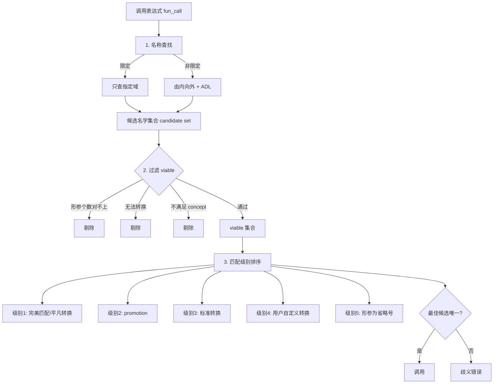

# 第六章：函数

> **一句话定义**：**函数 (function)** 是 C++ 中带名字、可被调用、可被重载的语句序列单元，由 *函数声明 (declaration)*、*函数定义 (definition)*、*形参列表 (parameter list)*、*返回类型 (return type)* 与可选的 *修饰符* (`inline`、`constexpr`、`consteval`、`noexcept`、`[[nodiscard]]`) 构成；调用时实参以拷贝/引用/指针方式初始化形参，编译期通过 **重载决议 (overload resolution)** 选择最匹配版本，运行期通过 **栈帧 (stack frame)** 维护调用上下文，并配合 `auto / decltype(auto)` 返回类型推导、`lambda` 表达式、`std::function`、`std::bind` 构成 C++ 的「**可调用对象 (callable)**」生态。

## 章节知识框架

```mermaid
graph TD
  c06_root[第6章：函数]

  c06_root --> c06_basics[函数基础]
  c06_root --> c06_params[参数传递]
  c06_root --> c06_overload[重载与重载决议]
  c06_root --> c06_return[返回值与 RVO]
  c06_root --> c06_modern[现代修饰符]
  c06_root --> c06_callable[可调用对象生态]

  c06_basics --> c06_decl[声明/定义/ODR]
  c06_basics --> c06_frame[栈帧 stack frame]
  c06_basics --> c06_extc[extern &quot;C&quot; 与 name mangling]
  c06_basics --> c06_default[缺省实参 default arg]
  c06_basics --> c06_main[main 两个版本]

  c06_params --> c06_byval[按值 by value]
  c06_params --> c06_byref[按引用 T&amp;]
  c06_params --> c06_byptr[按指针 T*]
  c06_params --> c06_decay[数组/函数退化]
  c06_params --> c06_initlist[std::initializer_list]

  c06_overload --> c06_namelookup[名称查找 + ADL]
  c06_overload --> c06_viable[viable 候选集]
  c06_overload --> c06_rank[匹配级别 1-5]
  c06_overload --> c06_ambig[歧义与解决]

  c06_return --> c06_implicit[隐式/显式返回]
  c06_return --> c06_dangle[悬空引用/指针]
  c06_return --> c06_rvo[RVO/NRVO 强制省略]
  c06_return --> c06_trailing[trailing return type]

  c06_modern --> c06_inline[inline 函数]
  c06_modern --> c06_constexpr[constexpr / consteval]
  c06_modern --> c06_noexcept[noexcept 修饰]
  c06_modern --> c06_nodiscard[[[nodiscard]]]

  c06_callable --> c06_fptr[函数指针 T_ptr]
  c06_callable --> c06_lambda[lambda + 捕获]
  c06_callable --> c06_stdfn[std::function]
  c06_callable --> c06_bind[std::bind / std::bind_front]
```

> **相关模块预告**：本章是《函数与算法》模块 (Module 04) 的入口。所讨论的「按引用传值」与第 11/12 章「拷贝/移动语义」直接接续；「函数指针/lambda/`std::function`」在第 10 章「泛型算法」中作为「策略 (callable)」被反复使用；`constexpr`/`consteval` 与第 2 章「常量类型」、第 13 章「模板元编程」联动；`extern "C"` 与 name mangling 把读者带向第 15 章的链接/ABI 话题。

---

## 函数基础

### 概念 (Concept)
**函数**是带名字、可调用、可被多次重用的语句序列。一个完整的 C++ 函数由两部分组成：
- **函数声明 (declaration)**：只给出函数头（返回类型、函数名、形参类型列表、可选修饰符），不含函数体；告诉编译器「有这么个名字可以调」。
- **函数定义 (definition)**：声明 + 函数体；告诉编译器「调用时具体怎么算」。

按 **一处定义原则 (ODR, One Definition Rule)**：函数声明可以在多个翻译单元、同一翻译单元内反复出现，但定义在整个程序里**通常只能出现一次**（少数例外：`inline` 函数、模板函数、`constexpr` 函数、类内定义的成员函数等天然 `inline`）。

### 语法 (Syntax)
函数基础语法骨架与栈帧示意：

```c++
#include <iostream>
#include <vector>
// 函数声明只包含函数头，不包含函数体，通常置于头文件中
int Add(int x, int y);
// 函数声明可出现多次，但函数定义通常只能出现一次（存在例外: 比如内联函数）

int main()
{    
	int z = Add(2, 3);
    std::cout << z << std::endl;
}

// 输入形参
// 返回类型

// 实际参数拷贝初始化形式参数
// int x = 2;
// int y = 3;
int Add(int x, int y)	// 函数名称——标识符，用于后续的调用
{
    return x + y;	// 函数体
    // 返回值会被拷贝给函数的调用者
}
////////////////////////////////////////////////////
// 栈帧结构

extern "C"
int Add(int x, int y)
{
    return x + y;	
}

int Sub(int x, int y)
{
    return x - y;	
}

int main()		// 1. 刚开始运行进入 main 这一帧
{    
	int z = Add(2, 3);  
    // 2. Add 进栈，main上落下Add这一帧 -> 执行完后Add出栈，重新回到main
    std::cout << z << std::endl;
    
    z = Sub(2, 3);
    // 3. Sub 进栈，main上落下Sub这一帧 -> 执行完后Sub出栈，重新回到main
    std::cout << z << std::endl;
}

////////////////////////////////////////////////////
extern "C"
int Add(int x, int y)
{
    return x + y;	
}

int Add(int x, int y)
{
    return x + y;	
}


int main()		
{    
	int z = Add(2, 3);  
    std::cout << z << std::endl;
}

// 上述编译可通过
// extern "C" int Add(int x, int y)  链接的名称是  Add
// int Add(int x, int y)  链接的名称是   _Z3Addii
// 但如果两个都加或者都不加extern "C"则输出的链接名称重复冲突；报错

// 使用extern "C"的目的是为了方便给外部调用; 暴露给外部程序调用，一般不用

```

### 语义 (Semantics)
- **栈帧 (stack frame)**：每次函数调用，运行时在调用栈上压入一段连续内存——它包含返回地址、保存的寄存器、形参拷贝、局部变量、对齐填充。函数返回后该帧弹出，**栈上局部对象生命周期随之结束**。因此「返回栈上局部对象的引用/指针」必然产生悬空引用 (dangling reference)，这是本章第 *返回值* 一节会反复警告的核心 UB 之一。
- **`extern "C"` 的链接语义**：C++ 函数默认走 **C++ 名称修饰 (name mangling)**，链接器在符号表里看到的不是 `Add` 而是类似 `_Z3Addii` 的修饰名（不同编译器规则不同，但通常包含参数类型）；`extern "C"` 强制使用 **C 链接**——不做 mangling，符号就是 `Add`，这样 C 程序、动态库（`.so`/`.dll`）、其他语言（Python ctypes / Rust FFI）才能找到入口。
- **正反例**：一个翻译单元里同时存在 `extern "C" int Add(int,int)` 和 `int Add(int,int)`——前者符号 `Add`，后者符号 `_Z3Addii`，**两个不同链接名共存合法**；但若两份都加 `extern "C"` 或都不加，符号冲突 → 链接错误 (multiple definition)。

### 机制 (Mechanism)
**调用约定 (calling convention)** 决定参数压栈/寄存器顺序、谁清栈、返回值在哪。常见约定：
- x86-64 System V (Linux/macOS)：前 6 个整型通过 `rdi/rsi/rdx/rcx/r8/r9`，前 8 个浮点通过 `xmm0–xmm7`，超出的入栈，返回值 `rax`/`rdx`/`xmm0`/`xmm1`。
- x86-64 Microsoft：前 4 个整型 `rcx/rdx/r8/r9`。
- 32 位 `cdecl`/`stdcall`/`fastcall`：差别在「谁清栈」。
- **跨编译器或跨语言交互**必须把 ABI 锁定到 `extern "C"`，否则 mangling 名一变，整个动态库就废。

**Name mangling 实例**（g++ x86-64）：
```
int Add(int, int)            → _Z3Addii
int Add(double, double)      → _Z3Adddd
namespace ns { int f(int); } → _ZN2ns1fEi
```
可以用 `nm libfoo.so | c++filt` 反 mangle 一探究竟。

### 实践 (Practice)
- **头文件只放声明**，定义放 `.cpp`；模板函数与 `inline` 函数才把定义放头文件（见后文）。
- **跨语言 FFI 边界**用 `extern "C"`，并把入口集中在一个 `api.cpp`；其内部仍可调用 C++ 函数。
- **godbolt 实测 mangling 与栈帧**：<https://godbolt.org/?source=#g:!((g:!((g:!((h:codeEditor,i:(filename:'1',fontScale:14,fontUsePx:'0',j:1,lang:c%2B%2B,source:'extern+%22C%22+int+Add(int+a,+int+b)+%7B+return+a+%2B+b%3B+%7D%0Aint+Sub(int+a,+int+b)+%7B+return+a+-+b%3B+%7D%0Aint+main()+%7B+return+Add(1,2)+%2B+Sub(3,4)%3B+%7D'),k:50,l:'4',n:'0',o:'',s:0,t:'0'),(g:!((h:compiler,i:(compiler:g142,filters:(),lang:c%2B%2B,libs:!(),options:'-std%3Dc%2B%2B17+-O2',source:1),l:'5',n:'0',o:'+x86-64+gcc+14.2+(C%2B%2B,+Editor+%231)',t:'0')),k:50,l:'4',n:'0',o:'',s:0,t:'0')),l:'2',n:'0',o:'',t:'0'),version:4>

### 坑 (Pitfall)
- **隐式声明 (implicit declaration)**：C++ 不允许调用未声明的函数 —— 一旦看到「函数未声明」错误，回头检查 `#include` 是否漏写或顺序错乱。
- **声明与定义形参类型必须严格一致**（顶层 `const` 可省略但底层 `const` 不能）；返回类型必须完全一致。
- **链接错误 vs 编译错误**：未声明 = 编译期 `error: 'X' was not declared`；声明了但缺定义 = 链接期 `undefined reference to 'X'`；定义两次 = 链接期 `multiple definition`。

---

## 函数详解

### 概念
函数的形参列表可以为 **空** 或包含 **任意个** 命名/匿名形参，每个形参必须带类型；C++ 中 `void fun()` 与 `void fun(void)` 等价（C 里二者不同，前者表示「未指定」）。形参名仅是**实现细节**——函数声明里的不同形参名不构成不同重载，但形参类型变化或个数变化会形成重载。

### 语法
```c++
void fun()		// or void fun(void)
{
    
}

////////////////////////////////////////////////////
#include <iostream>

void fun(int x)		// 形参必须要有类型，但可以没有名称
{
    std::cout << x << std::endl;
}
int main()		
{    
	fun(1);		// 类型输入需匹配
}
////////////////////////////////////////////////////
#include <iostream>

void fun(int, int y)		// 形参必须要有类型，但可以没有名称
{
    std::cout << y << std::endl;
}
// 形参名称的变化并不会引入函数的不同版本
void fun(int x, int y)		//也是一个重复定义
{
    std::cout << y << std::endl;
}

int main()		
{    
	fun(1, 4);		// 得输入对应的个数
}
////////////////////////////////////////////////////
// 实参到形参的拷贝求值顺序不定， 
// C++17 强制省略复制临时对象
void fun(int x, int y)		//也是一个重复定义
{
    std::cout << y << std::endl;
}

int main()		
{    
    int x = 0;
	fun(x++, x++);		// 实参到形参的拷贝求值顺序不定
    // 危险危险，编译器不同行为也可能不同
    fun(1, int{});	// 建立临时对象，临时对象拷贝给 y 时；对C++17而言，会把拷贝的过程强制省略
}
////////////////////////////////////////////////////
// C++17 强制省略复制临时对象
 
struct Str
{
    Str() = default;
    Str(const Str&)
    {
        // 如果出现了数据复制会打印这句话
        std::cout << "Copy constructor is called.\n";
    }
};
void fun(Str par)
{
    
};

int main()		
{    
    Str val;
    fun(val);		// 可正常打印
    // 会把 val 拷贝给 par；因此构造函数会被调用，所以打印了
    //////////////////////
    fun(Str{});		// 没有被正常打印，临时变量被省略；编译器优化
    // C++17 以前是否省略这种临时变量的赋值 是编译器自行决定的；因此也可能被省略
    
    // g++ avoid copy elision   编译器选项： -fno-elide-constructors  
    // 上述设置后可以打印出来，但是是 C++17 以前的编译器；C++17 之后还是会省略，强制省略
}
```

### 语义
- **形参名为标识器，不参与签名**：`void fun(int, int y)` 与 `void fun(int x, int y)` **是同一个函数**——签名取决于参数类型 `(int, int)`，名字仅作为函数体内的局部别名。因此在同一翻译单元里把它们都定义，会触发「重复定义 (redefinition)」错误。
- **实参求值顺序**：C++17 之前，`fun(x++, x++)` 中两个 `x++` 的求值**顺序未指定 (unspecified)**——编译器既可以从左到右、也可以从右到左、也可以交错。C++17 引入「函数调用中实参的求值是无序的 (indeterminately sequenced)」（但每个实参**内部**是有序的），仍不保证「先算左、再算右」。这意味着 `fun(x++, x++)` 在不同编译器、甚至同一编译器不同优化等级下都可能输出不同值——属于「**没有 UB 但有 implementation-defined / unspecified**」的灰色地带，工程上必须避免。
- **临时对象的强制省略 (C++17 mandatory copy elision)**：`fun(int{})`、`fun(Str{})` 这种「实参是 prvalue 临时对象」的情形，C++17 之后**强制**消除拷贝/移动构造——即「`int{}` 直接在形参位置上构造，不经过任何中间临时」。这是 P0135R1「guaranteed copy elision」的核心成果。

### 机制
**C++17 拷贝省略规则**分两档：
1. **强制省略 (mandatory)**：
   - 函数返回时返回的是「与返回类型相同的 prvalue」（`return T{};`）；
   - 函数调用时实参是「与形参类型相同的 prvalue」（`fun(T{});`）；
   - 这两种情况下，**就算拷贝/移动构造函数被 `delete` 或私有，也合法**——因为根本不发生拷贝。
2. **可选省略 (NRVO 等)**：
   - 具名 NRVO（`T t; ... return t;`）仍是「可选」，编译器可以做也可以不做；用 `-fno-elide-constructors` 关闭。

`-fno-elide-constructors` 在 C++17 模式下**只能关闭可选省略**，对 prvalue 强制省略无效，所以 `fun(Str{})` 依旧不打印。

### 实践
- **形参命名规范**：函数声明里**可省略形参名**，但工程上**强烈建议保留**——一是给文档/IDE 自动补全用，二是给读者看（`void copy(void* dst, const void* src, size_t n)` 比 `void copy(void*, const void*, size_t)` 友好太多）。
- **避免 `f(g(), h())` 这类多副作用调用**：若 `g()`/`h()` 都修改共享状态，求值顺序未定义将导致玄学 bug。把它们拆成两条独立语句即可。
- **C++20 改良**：[P0145R3](https://wg21.link/p0145) 进一步把「**赋值运算符**右值先求值、**位移运算符**左值先求值、**子标量访问**前两者先求值」等顺序约束落实——但函数调用实参之间仍未指定顺序。

### 坑
- `int{}` 这种「值初始化空大括号」**不是无意义**——它产生「零初始化的临时 int」，等价于 `int()`；和 `int x; fun(0, x);` 行为一致但更现代。
- 对 `fun(x++, x++);` 这种写法，编译器不一定报错——这是「合法但行为未指定」，IDE 静态分析（clang-tidy `bugprone-pointer-arithmetic-on-polymorphic-object` 类规则）才会提示。

---

## 函数传值、传址、传引用

### 概念
形参与实参之间的数据交换方式决定了「调用方对实参的可见副作用」：
- **按值 (pass by value)**：实参的值被**拷贝**到形参，函数内修改形参**不影响**调用方的实参。
- **按指针 (pass by pointer / address)**：实参的**地址**被拷贝到形参指针，函数内通过解引用**可以**修改调用方的对象。
- **按引用 (pass by reference)**：形参成为实参的**别名**，函数内对形参的任何操作就是对实参的操作。

### 语法
```c++
#include <iostream>

void fun(int par)		
{
    ++par;	// 形参
};

int main()		
{    
    // 传值
	int arg = 3;	// 实参
    fun(arg);	// 传值给par，对arg没有影响
    std::cout << arg << '\n';
    
    int par = arg;
    ++par;
    std::cout << arg << "\n";
}
////////////////////////////////////////////////////
void fun(int* par)		
{
    ++(*par);	// 形参
};

int main()		
{    
    // 传址
    int arg = 3;
    fun(&arg);	// 传址会导致数值发生改变
    std::cout << arg << '\n';
    
    int* par = &arg;
    ++(*par);
    std::cout << arg << '\n';
}
////////////////////////////////////////////////////
// 传引用
void fun(int& par)		
{
    ++par;	// 形参
};

int main()		
{    
    // 传引用
    int arg = 3;
    fun(arg);	// 传引用相当于别名；绑定了同一个对应地址
    std::cout << arg << '\n';

    int& par = arg;
    ++par;
    std::cout << arg << '\n';
}
```

### 语义
- **按值**：等价于「先在形参槽位上拷贝构造一个新对象 `par`，函数返回时析构它」。代价是一次拷贝构造 + 一次析构，对 `int` 几乎免费，对 `std::vector<int>` 则可能是巨大的堆分配。
- **按指针**：「形参 `int* par` 本身按值传——拷贝的是地址（4 或 8 字节）」，但通过 `*par` 能写到实参的内存。可空（可以传 `nullptr`），可改指向（`par = ...`，但这种 reseat 仅改局部形参指针不影响调用方）。
- **按引用**：「形参没有独立可观察存储，编译器通常用指针实现」——`++par` 直接修改 `arg`。引用必须绑定（不存在「空引用」），不可重绑。

### 机制
**C++ Core Guidelines F.16/F.17** 形参传递准则：
| 大小 / 用途 | 推荐写法 |
|-------------|----------|
| 标量、迭代器、`span`、视图等 ≤ 2 字 | 按值 `T` |
| 大对象，只读 | `const T&` |
| 需要修改 | `T&` 或「返回新对象」 |
| 移动语义（消耗实参） | `T&&` + `std::move` |
| 既可能拷贝也可能移动 | 函数模板 + 万能引用 `T&&` + `std::forward`（见第 13 章） |
| 可能为空的「输出参数」 | `T*`（或更现代 `std::optional<T&>`） |

引用底层用「内存地址寄存器」实现，编译器在简单情况下能完全消除引用的开销；指针则始终占一个机器字（即使经过 `-O3` 优化）。

### 实践
- **改名 (re-name)** 写法：`int& par = arg;` 在调用方手动建一个别名，等价于一次「按引用调用」——可以用于命名复杂表达式。
- **指针返回 "modify-in-place"** 是 C 风格的输出参数，例如 `int* malloc(size_t)`、`int sscanf(const char*, const char*, ...)`，C++ 应优先用 `T&` 或返回值。
- **godbolt 实测三种传参开销**：<https://godbolt.org/?source=#g:!((g:!((g:!((h:codeEditor,i:(filename:'1',fontScale:14,fontUsePx:'0',j:1,lang:c%2B%2B,source:'%23include+%3Cvector%3E%0Avoid+by_val(std::vector%3Cint%3E+v)+%7B+(void)v.size()%3B+%7D%0Avoid+by_ref(const+std::vector%3Cint%3E%26+v)+%7B+(void)v.size()%3B+%7D%0Avoid+by_ptr(const+std::vector%3Cint%3E*+v)+%7B+(void)v-%3Esize()%3B+%7D%0Aint+main()+%7B%0A++std::vector%3Cint%3E+a(1000)%3B%0A++by_val(a)%3B+by_ref(a)%3B+by_ptr(%26a)%3B%0A%7D'),k:50,l:'4',n:'0',o:'',s:0,t:'0'),(g:!((h:compiler,i:(compiler:g142,filters:(),lang:c%2B%2B,libs:!(),options:'-std%3Dc%2B%2B17+-O2',source:1),l:'5',n:'0',o:'+x86-64+gcc+14.2+(C%2B%2B,+Editor+%231)',t:'0')),k:50,l:'4',n:'0',o:'',s:0,t:'0')),l:'2',n:'0',o:'',t:'0'),version:4>

### 坑
- **按值传 `std::vector<...>` / `std::string`** 是 C++ 工程里最常见的性能漏洞——一次拷贝 = 一次堆分配 + 一次堆释放。请用 `const T&` 或在 C++17 起搭配 `std::string_view` / `std::span` 视图。
- **悬空引用**：`int& f() { int x = 0; return x; }`—— `x` 在 `return` 后立刻析构。`-Wreturn-stack-address` 必开。
- **`T&` 不能接受 prvalue**：`void inc(int&)` 不能写 `inc(3)`；要兼顾右值得加重载 `void inc(const int&)` 或 `void inc(int&&)`。

---

## 函数传参过程中的类型退化

### 概念
**类型退化 (type decay)** 是 C++ 沿袭自 C 的「数组/函数在函数实参语境下自动转换为指针」的规则：`int[3]` 退化为 `int*`，`int(int)` 退化为 `int(*)(int)`。这一规则让「数组首地址按值传」成本仅一个指针大小，但代价是**形参丢失数组大小信息**——`sizeof(par)` 拿到的是指针大小而非数组字节数。

### 语法
```c++
// 函数传参过程中的类型退化
#include <iostream>

void fun(int* par)		
{
    
};
// 或者  void fun(int par[])	或者 void fun(int par[3])		

int main()		
{    
    int a[3];
    auto b = a;	// b 会退化，是一个int*  ,指向 a 中的第一个元素
    fun(a);		// 可以用 a 拷贝初始化par
    
    // 上述三种写法，编译器对fun的理解，都会把传入的参数理解为指针
}
////////////////////////////////////////////////////
// C++ insights
#include <iostream>

// 上述三种都会认为为指针
void fun(int * par)		 //写数只对程序阅读者有用，编译器会忽略，容易让读者误解，建议不写数
{
}

int main()
{
  int a[3];
  int * b = a;
  fun(a);
  return 0;
}
////////////////////////////////////////////////////
// 高维数组
#include <iostream>

void fun(int (*par)[4])		 
{
}

int main()
{
  	int a[3][4];
    auto ptr = a;
    fun(a);
}
/////////////////////// C++ insights//////////////////
void fun(int (*par)[4]) 
//void fun(int par[3][4])  不会报错，但是编译器会忽略[3]这部分，[4]这部分不能修改
{
}
int main()
{
  int a[3][4];
  int (*ptr)[4] = a;
  fun(a);
  return 0;
}
///////////////////阻止退化//////////////////////////
void fun(int (&par)[3][4]) // 数组中元素信息可传给函数
{
}
int main()
{
  int a[3][4];
  auto& ptr = a;
  fun(a);
}

```

### 语义
- `void fun(int* par)`、`void fun(int par[])`、`void fun(int par[3])` 这**三种形参声明对编译器完全等价**——形参类型都是 `int*`。`[3]` 仅是「给读者看的注释」，编译器忽略并**不强制实参是 3 个元素**。
- 高维数组 `int[3][4]` 在退化中**只丢最外维**：传给 `void fun(int (*par)[4])` 或等价的 `void fun(int par[][4])`、`void fun(int par[3][4])`——内维 `[4]` 必须保留，因为「不同内维的指针类型不同」（`int[][4]` 和 `int[][5]` 是不同的二维数组指针类型）。
- **阻止退化的两条路径**：
  1. **数组引用** `void fun(int (&par)[3][4])`——编译器保留完整数组类型信息，`par` 不退化，`sizeof(par) == 48`，且实参必须是 `int[3][4]`。
  2. **模板形参** `template<size_t N> void fun(int (&par)[N])`——`N` 在编译期推导出实参的元素个数（数组长度感知 sort、`std::size` 实现等惯用法都靠它）。

### 机制
退化在标准里叫 **「array-to-pointer 转换 (§7.3.2)」** 与 **「function-to-pointer 转换 (§7.3.3)」**：
- 任何**非引用**形参类型若声明为 `T[N]` 或 `T[]`，等价改写为 `T*`；
- 任何**非引用**形参类型若声明为 `R(Args...)`，等价改写为 `R(*)(Args...)`。

退化只发生在「函数实参 → 形参」、「`auto x = arr;` 类型推导」、「条件运算符两分支合并」等少数语境，不会发生在 `sizeof`、`typeid`、`decltype(arr)`、`alignof` 等「未求值上下文 (unevaluated context)」中——这就是为什么 `sizeof(arr)` 在 main 内是 `12`，传入函数后 `sizeof(par)` 变成 `8`。

### 实践
- **现代替代品**：`std::array<int, 3>`（栈上，按值传带长度）、`std::span<int>` (C++20，零开销视图，不拥有内存)。这两个都不会退化。
- **C++17 起 `std::size(arr)`** 在 `<iterator>`，编译期返回数组长度——但仅对未退化的数组有效。

### 坑
- `void fun(int par[3])` 写 3 是骗自己——编译器不查长度，传 5 个元素的数组也照样接受。
- `sizeof(par) / sizeof(par[0])` 在函数内部得不到数组元素数；必须额外传 `size_t n` 或改用 `std::span`。
- 字符串字面量 `"abc"` 类型是 `const char[4]`，会退化为 `const char*`；不能绑定到 `char(&)[4]`（const 不匹配），要绑到 `const char(&)[4]` 才行。

---

## 变长参数

### 概念
**变长形参 (variable arguments)** 让函数接受「数量不固定但类型一致」的实参。C 风格用 `<stdarg.h>` 的 `va_list`/`va_start`/`va_arg` + 省略号 `...`（不安全，类型擦除）；C++ 推荐 **`std::initializer_list<T>`**（轻量、类型安全）或 **变长模板 (variadic template)**（编译期展开，零运行期开销，见第 13 章）。

### 语法
```c++
#include <iostream>
#include <initializer_list>

// void fun(const std::initializer_list<int>& par)  // 一般都不会这么干
// 无法传指针，可以传常量引用但没必要
void fun(std::initializer_list<int> par)	//包含两个指针，第一个指针包含开头，第二个包含结尾
    // <int>表示传递的类型
    // 也就是说传递的参数类型需要一样
{
    
};	
/*	这段代码非常危险
std::initializer_list<int> fun() //返回的是initializer_list，是两个指针
{
	return {1, 2, 3, 4, 5};   // 返回对象，fun函数执行完之后就被销毁
};	

如果在main函数中调用  
	auto res = fun(); // 对象已经被销毁，用 res 获取是非法的
*/
int main()		
{    
    
    fun({1, 2, 3, 4, 5});		// 传入参数个数可改变，类型需一样
    // 这一段数据的生存周期在整一段语句被执行完之后销毁；
    // 因此调用 par 这一对指针一定是合法的；fun调用完之后被销毁

}

```

[<initializer_list>]( https://zh.cppreference.com/w/cpp/utility/initializer_list)  如何使用

```c++
#include <iostream>
#include <vector>
#include <initializer_list>
 
template <class T>
struct S {
    std::vector<T> v;
    S(std::initializer_list<T> l) : v(l) {
         std::cout << "constructed with a " << l.size() << "-element list\n";
    }
    void append(std::initializer_list<T> l) {
        v.insert(v.end(), l.begin(), l.end());
    }
    std::pair<const T*, std::size_t> c_arr() const {
        return {&v[0], v.size()};  // 在 return 语句中复制列表初始化
                                   // 这不使用 std::initializer_list
    }
};
 
template <typename T>
void templated_fn(T) {}
 
int main()
{
    S<int> s = {1, 2, 3, 4, 5}; // 复制初始化
    s.append({6, 7, 8});      // 函数调用中的列表初始化
 
    std::cout << "The vector size is now " << s.c_arr().second << " ints:\n";
 
    for (auto n : s.v)
        std::cout << n << ' ';
    std::cout << '\n';
 
    std::cout << "Range-for over brace-init-list: \n";
 
    for (int x : {-1, -2, -3}) // auto 的规则令此带范围 for 工作
        std::cout << x << ' ';
    std::cout << '\n';
 
    auto al = {10, 11, 12};   // auto 的特殊规则
 
    std::cout << "The list bound to auto has size() = " << al.size() << '\n';
 
//    templated_fn({1, 2, 3}); // 编译错误！“ {1, 2, 3} ”不是表达式，
                             // 它无类型，故 T 无法推导
    templated_fn<std::initializer_list<int>>({1, 2, 3}); // OK
    templated_fn<std::vector<int>>({1, 2, 3});           // 也 OK
}

//输出：
constructed with a 5-element list
The vector size is now 8 ints:
1 2 3 4 5 6 7 8
Range-for over brace-init-list: 
-1 -2 -3 
The list bound to auto has size() = 3
```

可变长度模板参数

使用省略号表示形式参数    ——C语言中使用，对C++不是很好，不用

### 语义
- `std::initializer_list<T>` 是「**底层为 `T const[N]`、对象层提供 `begin/end/size`**」的轻量视图——它**不拥有**所引用的数组，所引用的数组生命周期由「围绕大括号字面量的最外层完整表达式 (full-expression)」决定。
- `fun({1,2,3,4,5});` 中底层数组 `int[5]` 是「调用表达式的临时对象」，生命周期延续到 `fun` 返回——**调用过程中所有指针访问安全**。
- **危险案例**：函数返回 `std::initializer_list<int>`——底层数组是栈临时，函数返回后立即析构，外层 `auto res = fun();` 拿到的是悬空对的两个指针。GCC 在 `-Winit-list-lifetime` 下会警告。

### 机制
- `initializer_list<T>` 仅有 **`begin()` 返回 `const T*`、`end()` 返回 `const T*`、`size()` 返回 `size_t`**——只能 const-迭代，**不能修改元素**。
- 编译器把 `{1,2,3,4,5}` 这种 braced-init-list 翻译为「构造一个 `const int[5]`，让 `initializer_list<int>` 的两个指针指向这块」。
- **`auto al = {10, 11, 12};`** 是 `auto` 的「**特殊规则**」：通常 `auto x = 3;` 推 `int`，但 `auto x = {a, b, c};` 推 `std::initializer_list<int>`（C++17 起仅当**所有元素同类型**时这样推；否则编译失败）。
- **函数模板不会推 `initializer_list`**：`templated_fn({1,2,3})` 编译失败，因为 braced-init-list 本身没有类型，无法用于模板形参推导；需要显式实例化或显式构造。

### 实践
- **接受变长同类型实参**：`void log(std::initializer_list<std::string_view>)`、构造函数 `std::vector<int> v{1,2,3}` 都靠它。
- **变长**且**异类型****编译期** → 用变长模板 + 折叠表达式：
  ```cpp
  template <class... Args>
  void log(Args&&... args) {
      (std::cout << ... << args) << '\n'; // C++17 fold expression
  }
  ```
- C 风格 `printf(const char*, ...)` 在现代 C++ 几乎不该自写——`<format>` (C++20) / `std::print` (C++23) 是类型安全替代。

### 坑
- **绝对不要返回 `std::initializer_list`**——底层数组随表达式结束而析构，调用方拿到的是悬空对。
- braced-init-list **没有类型**——`auto v = {1, 2.0};` 不合法（混合类型推不出来）；`std::min({1,2,3})` 调用的是「接受 `initializer_list` 的重载」而非普通三参数版本。
- C 风格 `...` 形参**不做隐式转换**：`printf("%d", 3.5)` 不会自动把 `3.5` 转 `int`，会读到错乱字节。

---

## 函数可以定义缺省实参

### 概念
**缺省实参 (default argument)** 让调用方在调用时省略尾部若干参数，编译器自动用声明里给定的值补齐。它**不是重载**——本质上只生成一个函数，调用方写 `fun()` 时编译器把它改写为 `fun(default1, default2, ...)`。

### 语法
```c++
#include <iostream>


void fun(int x = 0) // 可以给形参赋一个缺省实参
{
    std::cout << x << '\n';
}

int main()
{
	//fun(1);	// 若形参较多，不方便，因此函数可以定义缺省实参
    fun();	// 使用缺省实参初始化
}
////////////////////////////////////////////////////
// 如果某个形参具有缺省实参，那么它右侧的形参都必须具有缺省实参
// void fun(int x, int y = 1, int z)  // 会报错	，为什么？
// void fun(int x = 0, int y) // 会报错

// 因为形参与实参需要匹配

void fun(int x = 0, int y = 1)  // ok
void fun(int x, int y = 1)  // 也ok
{
    std::cout << x + y << '\n';
}

int main()
{
    fun(1, 2);	// 传入的实参会按照从左到右的顺序匹配形参
}
////////////////////////////////////////////////////
// 在 一个翻译单元 中，每个形参的缺省实参只能定义一次

// void fun(int x, int y = 2, int z = 3); // 报错
void fun(int x, int y, int z);	// 声明

void fun(int x, int y, int z = 3);	
void fun(int x, int y = 2, int z); // 这也行
/*
void fun(int x, int y = 2, int z);	错误，顺序不对
void fun(int x, int y, int z = 3); 
*/
/*  这个可以
void fun(int x, int y, int z = 3);	
void fun(int x, int y = 2, int z);
void fun(int x = 1, int y, int z);
*/

// void fun(int x, int y = 2, int z = 3)
void fun(int x, int y, int z)
{
    std::cout << x + y + z << '\n';
}

int main()
{
    fun(1);	// 传入的实参会按照从左到右的顺序匹配形参
}


////////////////////////////////////////////////////
// 缺省实参为对象时，实参的缺省值会随对象值的变化而变化
#include <iostream>

int x = 3;
void fun(int y = x)		// 缺省实参是变量		//不建议，会对阅读者造成困扰
{
    std::cout << y << '\n';
}

int main()
{	
    x = 4;
    fun();	//编译器解释成 fun(x) --> 打印出 4
}

int main()
{	
    int x = 4;
    fun();	// --> 打印出 3; 对应的不是同一个 x
}
// 在头文件老老实实定义，老老实实给缺省实参是最安全也是对大家最方便的
```

### 语义
**规则一**：「**若某个形参具有缺省实参，那么它右侧的形参都必须具有缺省实参**」。否则调用 `fun(1)` 时编译器无法确定 `1` 该填哪个形参——故 `void fun(int x, int y = 1, int z)` 非法。
**规则二**：「**在一个翻译单元中，每个形参的缺省实参只能定义一次**」——但可以分散在多个声明里**累积**给定：
```c++
void fun(int x, int y, int z);            // 声明 1：无缺省
void fun(int x, int y, int z = 3);        // 声明 2：补给 z
void fun(int x, int y = 2, int z);        // 声明 3：补给 y（z 已在声明 2 给过，这里不重复，合法）
```
前提是「**只能从右向左**累积补充」，即同一形参不能给两次；试图给前面的形参提供缺省实参，必须保证其右侧形参已有缺省实参。

**规则三**：缺省实参是「**ODR-use** 时按上下文重新求值的**表达式**」——`int x = 3; void fun(int y = x);` 中 `x` 是全局变量，每次调用 `fun()` 都重新读 `x` 的当前值。但**作用域**按「声明缺省实参时的可见作用域」绑定——如果在不同 `main` 里定义同名局部 `x`，这个 `x` **不会**替换缺省实参里那个全局 `x`。

### 机制
缺省实参在 **调用点**展开，不是在「函数定义点」生成代码。这意味着：
- 调用 `fun()` 时编译器把它改写为 `fun(currentValueOfX)`；
- 缺省实参表达式中的名字按「**声明该缺省实参时的查找规则**」找——通常找到的是全局或命名空间作用域里的名字，**不会**被调用点的局部同名变量替换。

这就是上例两个 `main` 里 `fun()` 行为不同的根源：第一个 `main` 改了全局 `x = 4`，缺省表达式 `x` 找到的就是这个 4；第二个 `main` 里定义的局部 `int x = 4` 没碰全局 `x`（仍是 3），缺省表达式还是读全局 → 打印 3。

### 实践
- **在头文件里集中给缺省实参**——把缺省实参写在「客户能看到的最早声明」中；不要在多个翻译单元各自给一次，否则容易引发「同一形参两个不同缺省值」的 ODR 违规。
- **缺省实参用字面量、`constexpr` 值或不可变的全局常量**——避免引用可变全局变量，否则程序员看到 `fun()` 调用根本猜不到实际传入的值。
- 与重载相比：**优先用重载**；缺省实参在「形参类型完全一致且尾部可省」这种「弱区分」场景下更简洁，但易产生歧义。

### 坑
- 缺省实参**不是函数签名的一部分**——`void f(int = 0);` 和 `void f(int);` 是同一个函数，不能并存。
- 缺省实参在 **派生类虚函数覆盖** 时**按静态类型**取：`Base* b = new Derived; b->f();` 取的是 `Base::f` 的缺省值——这是「**虚函数 + 缺省实参 = 几乎肯定的 bug**」反模式，避免之。
- 缺省实参表达式里若调用了别的函数，**每次调用都重新计算**——`void log(time_t t = time(nullptr));` 每次都取当前时间，这通常是想要的，但要明确。

---

## main 函数的两个版本

### 概念
**`main`** 是 C++ 程序的入口（freestanding 环境例外）。标准只规定两种合法签名：
- 无形参版本：`int main()`
- 带参版本：`int main(int argc, char* argv[])`（等价 `char** argv`）

部分实现（Linux glibc、Windows）还提供 `int main(int, char**, char**)` 第三参数为环境变量数组，但**不是标准**。

### 语法
```c++
#include <iostream>

int main () { 函数体 }
int main (int argc, char *argv[]) { 函数体 }	

// argc	-	非负数，表示从程序运行的环境传递给程序的实参个数。
// argv	-	指针，指向包含 argc + 1 个指针的数组的首元素。数组末元素为空指针，若其前面有任何元素，则它们指向空终止多字节字符串，表示从执行环境传递给程序的若干参数。若 argv[0] 不是空指针，或等价地 argc > 0 ，则它指向表示用于调用程序的名称的字符串，或空字符串。


int main(int argc, char* argv[])	
{	
    // 可以通过argc控制执行的逻辑
    if (argc != 3)	// 输入一定要三个数
    {
        std::cerr << "Usage: " << argv[0] << " param1 param2\n";
        // argv[0] 包含了程序的名称路径
        return -1;
    }
    
    // argc 输入一串字符串，末位自动添加 '\0'
    // 可以利用 argc 输入参数
    std::cout << "argc = " << argc << std::endl;
    for(int i = 0; i < argc; ++i)
    {
        std::cout << argv[i] << '\n';
    }
}

```

### 语义
- **`argc`** = 命令行实参个数（包含程序名本身，最少 1）。
- **`argv`** = 长度为 `argc + 1` 的指针数组，`argv[argc]` 必为 **空指针**（哨兵）。
  - `argv[0]` 通常是程序名（可能含路径），但**标准不保证非空**；
  - `argv[i]` (`1 ≤ i < argc`) 是各条命令行实参的 `'\0'`-终止 C 字符串。
- **`main` 是 C++ 中唯一允许「**隐式 `return 0;`**」的函数**——若函数体执行到末尾未显式 `return`，等同于 `return 0;`。这是标准 `[basic.start.main]/5` 的特殊豁免。

### 机制
- 进程启动时，操作系统加载器把命令行字符串切分为 token、构造 `argv[]` 数组、把 `argc` 和 `argv` 通过 C 运行时启动代码（`crt0.o` / `_start`）传给 `main`。
- 退出值 `main` 返回的 `int` 被 C 运行时转交给 `exit()`：
  - `0` 通常表示成功；
  - 非 0 表示失败；
  - 标准在 `<cstdlib>` 提供 `EXIT_SUCCESS` / `EXIT_FAILURE` 两个可移植常量。
- **不可对 `main` 取地址**（不是函数指针标准用法）、**不可递归调用 `main`**——`main` 不是普通函数。

### 实践
- 把命令行解析独立成函数：`int main(int argc, char* argv[]) { return run(parse_args({argv, argv + argc})); }`——主体逻辑用 `std::span<char*>` 视图传入，易于单元测试。
- 健壮性：始终检查 `argc` 边界后再 `argv[i]` 解引用；推荐 CLI 库 `CLI11`、`cxxopts`、`docopt.cpp` 而非手撕字符串。
- 现代化：C++23 已开始讨论 `std::main_args`，但目前仍以 `int main(int, char**)` 为准。

### 坑
- `argv[argc]` **必须**是 nullptr——基于这个哨兵的循环（`while (*argv) ++argv`）才安全。
- Windows GUI 程序用 `WinMain` / `wWinMain` 而非 `main`，子系统 `/SUBSYSTEM:CONSOLE` vs `/SUBSYSTEM:WINDOWS` 决定入口。
- 在 freestanding 环境（内核、嵌入式）**没有** `main`，入口由实现定义（`_start`、`reset_handler`）。

---

## 函数体

### 概念
**函数体 (function body)** 是一对花括号 `{ ... }` 内的语句序列。函数返回方式有两种：
- **隐式返回**：函数体执行到 `}` 末尾时返回；只对 `void` 与 `main` 合法。
- **显式返回**：通过 `return [expr];` 关键字提前结束函数；对非 `void` 函数必须提供返回表达式。

### 语法
```c++
#include <iostream>

// 隐式返回
// 要隐式返回就得用void定义
void fun()	// void 表明该函数不需要返回任何数值或者对象
    // 改为 int fun() 能编译但是有warning
{
    std::cout << "Hello" << std::endl;
    // 此函数没有显示说明函数该返回了，即隐式返回
    // return; 显示返回  此处用不用没区别
}

int main()	// main 函数例外；标识程序入口
{	
    fun();
    /*
    int x = fun();	// 应避免隐式返回；要隐式返回就得用void定义
    std::cout << x << std::endl;	
    // -> -1256153600	返回未定义的值
    */
    
}
////////////////////////////////////////////////////
// 显式返回关键字： return
void fun()	
{
    std::cout << "Hello" << std::endl;
    return;  // 直接返回，不打印下一句
    // 这就是显示返回的魅力
    // 不希望执行该函数后续的语句，直接跳出
    // 但没有说要返回一个具体的数值；如果不是void的话这个就非法
    std::cout << "Hello" << std::endl;
}
////////////////////////////////////////////////////
// return 表达式 
int fun()	
{
    std::cout << "Hello" << std::endl;
    return 100; 	// 还是直接跳出，返回 100
    std::cout << "Hello" << std::endl;
}
int fun2()	
{
    std::cout << "Hello" << std::endl;
    int x = 2;
    return x + 100; // 只要return后面加的是表达式就没有问题
    // 主要表达式求值之后的类型一定要是int，或者能够转换成int
    // 字符串就不行： return "123";
    std::cout << "Hello" << std::endl;
}

int main()	// main 函数例外；标识程序入口
{	
    int x = fun();		// fun() 返回的值用于 x 初始化
    std::cout << x << std::endl;	
    int y = fun2();		
    std::cout << y << std::endl;	
}
////////////////////////////////////////////////////
// return 初始化列表
#include <iostream>
#include <vector>
#include <initializer_list>

std::initializer_list<int> fun()	// 会报错，因为包含两个指针；传回去后对象被销毁了
    //
{
    std::cout << "Hello" << std::endl;
    return {1, 2, 3, 4, 5}; // 自动对象，会在执行完后被销毁
    // 并不能通过这样的方法来延长这个底层数组的生存周期
    std::cout << "World" << std::endl;
    // warning: returning temporary 'initializer_list' does not extend the lifetime of the underlying array [-Winit-list-lifetime]
}

std::vector<int> fun()
{
    std::cout << "Hello" << std::endl;
    return {1, 2, 3, 4, 5}; //初始化列表
    // 可以用来初始化vector
    std::cout << "World" << std::endl;
}

int main()
{
    auto x = fun();	
    // std::initializer_list<int> fun()时
    // x 拿到这两个指针后对应的数组已经被消除，因此它的行为未定义
}
////////////////////////////////////////////////////
// 小心返回自动对象的引用或指针
int& fun()
{
    int x = 3;
    return x;
}
int* fun2()
{
    int x = 3;
    return &x;
}

int& fun3()
{
    static int x = 3; //局部静态对象
    // 生存周期:从 首次 执行这条语句开始到 整个 程序执行完成
	// 因此不存在对象被销毁造成的问题 
    return x;
}
int main()
{
    int& ref = fun(); // 把 ref 绑定到返回的fun()上，即绑定到 x 上
    // 但是执行完之后相应的 x 生存周期结束，相当于ref绑定了已经销毁的对象
    // 接下来对 ref 做的任何操作，所有行为都是未定义的
    int* ptr = fun2(); // 指针亦是如此
    // ... 指向的对象被销毁，ptr 后续行为未定义
    int&ref2 = fun3(); // 对象没有被销毁，可用
}    
////////////////////////////////////////////////////
// 返回值优化（ RVO ）—— C++17 对返回临时对象的强制优化
struct Str
{
    Str() = default;
    // 拷贝构造函数
    // 如果涉及到对象间的拷贝，系统就会调用拷贝构造函数
    Str(const Str&)
    {
        std::cout << "Copy constructor is called\n";
    }
};

Str fun()	//C++优化可能会对fun进行修改，引入一个额外参数——res的地址
{
    Str x;	// 第一个拷贝构造过程
    // 优化： 在res内存上构造 x // 对 x 的处理本质上都是对 res 进行处理
    // 把拷贝构造的过程省略，一定程度上提升性能
    return x;
}

int main()
{
    Str a;
    Str b = a; // 拷贝构造
    
    Str res = fun(); // 不会打出任何值		// 第二个拷贝构造的过程
    // 编译选项：fno-elide-constructors
    // 会打出两个Copy constructor is called；因为有两个拷贝构造的过程
    
    
    // 主要是拷贝构造通常是进行复制，但复制在有些时候很耗费资源
    // C++ 会引入优化：
    // 将 Str fun()
    // 因为已经有了res这块对象，直接在这块内存上构造res的
    
    // 上述是具名返回值优化，对具体的 x 
}

// 编译选项：fno-elide-constructors 关闭返回值优化
// 非具名返回值优化
struct Str
{
    Str() = default;
    /// Str(int) {}		表示Str()构造函数接收一个int类型变量
    Str(const Str&)
    {
        std::cout << "Copy constructor is called\n";
    }
};

Str fun()
{
    return Str{};//调用Str缺省构造函数 构造 非具名对象
    /// return Str{3}; 仍然是非具名对象
    	// 此处不再使用缺省构造函数构造，使用接收一个参数的构造函数构造
    	// 编译器也会尝试返回值优化
}
////////////////////////////////////////////////////
// 上述是C++14版本
// C++17 对返回临时对象的强制优化
// 无论加不加fno-elide-constructors，都没有Copy constructor is called
// 但这是针对返回临时对象时
// 如果加了fno-elide-constructors且具名返回值，还是可能会有Copy constructor is called
// 如果是非具名返回值，那一定会被优化掉

```

### 语义
- **`return [expr];`** 中 `expr` 必须能 *转换为* 函数返回类型——`int fun()` 里 `return "123";` 不合法（指针不能转 `int`），`return 3.7;` 合法但会触发隐式 `double → int` 截断警告。
- **`return {1,2,3,4,5};`** 是「列表初始化的返回」——编译器用 brace-init-list 初始化「与返回类型相同的临时对象」。
  - 若返回类型是 `std::vector<int>`：等价 `return std::vector<int>{1,2,3,4,5};`，构造一个 vector 返回，**合法且地道**。
  - 若返回类型是 `std::initializer_list<int>`：底层 `const int[5]` 是函数内栈临时——**返回后被析构**，调用方收到的两个指针悬空，GCC 警告 `-Winit-list-lifetime`。
- **返回栈引用 / 栈指针 = UB**：上例 `int& fun()` 与 `int* fun2()` 都返回栈上局部对象——函数返回后栈帧销毁，`ref`/`ptr` 失效，访问即 UB。
- **局部静态对象**：`int& fun3() { static int x = 3; return x; }` 合法——`static` 局部对象的生命周期是「**首次执行该声明** → **程序终止**」，引用安全；并且 C++11 起 magic static 是线程安全初始化的。

### 机制
**返回值优化 (RVO / NRVO)** 让「返回一个对象」零拷贝。机制是「**调用方在自己的栈帧上为返回值预留一块槽位 (return slot)**，被调函数收到一个隐藏的指针参数指向该槽，直接在槽位上构造对象——不再先构造局部对象再拷贝出去」。
- **C++14 与之前**：是否做 RVO/NRVO **由编译器决定**——`-fno-elide-constructors` 可关闭，结果会打印「Copy constructor is called」。
- **C++17 起**：对**返回 prvalue 临时对象**（`return T{};`、`return T(args)`）**强制省略 (mandatory copy elision)**——即使加 `-fno-elide-constructors` 也不再有任何拷贝，连「概念上的临时对象」都不存在。这是 P0135R1 落地的结果，让以下代码合法：
  ```cpp
  struct NonCopyable {
      NonCopyable() = default;
      NonCopyable(const NonCopyable&) = delete;
  };
  NonCopyable make() { return NonCopyable{}; } // C++17 起合法
  ```
- **NRVO (Named Return Value Optimization)** 仍是「可选省略」：`return x;` 中 `x` 是函数内具名对象，多数编译器仍能消除拷贝，但**不强制**；`-fno-elide-constructors` 会让它失效。

### 实践
- **「按值返回」是 C++ 工程默认选择**——既符合 RAII 又能借助 RVO/NRVO 接近零开销，**禁用** C 风格「输出参数」（`void make(Result* out)`）。
- 不要 `return std::move(x);`——`std::move` 阻止 NRVO，反而增加一次移动构造。让编译器自由优化。
- godbolt 实测 RVO：<https://godbolt.org/?source=#g:!((g:!((g:!((h:codeEditor,i:(filename:'1',fontScale:14,fontUsePx:'0',j:1,lang:c%2B%2B,source:'%23include+%3Ciostream%3E%0Astruct+S+%7B+S()%7Bstd::cout%3C%3C%22ctor%5Cn%22%3B%7D+S(const+S%26)%7Bstd::cout%3C%3C%22copy%5Cn%22%3B%7D+%7D%3B%0AS+make()+%7B+return+S%7B%7D%3B+%7D%0AS+nrvo()+%7B+S+s%3B+return+s%3B+%7D%0Aint+main()+%7B+auto+a%3Dmake()%3B+auto+b%3Dnrvo()%3B+%7D'),k:50,l:'4',n:'0',o:'',s:0,t:'0'),(g:!((h:compiler,i:(compiler:g142,filters:(),lang:c%2B%2B,libs:!(),options:'-std%3Dc%2B%2B17+-O2',source:1),l:'5',n:'0',o:'+x86-64+gcc+14.2+(C%2B%2B,+Editor+%231)',t:'0')),k:50,l:'4',n:'0',o:'',s:0,t:'0')),l:'2',n:'0',o:'',t:'0'),version:4>

### 坑
- **隐式 `int x = fun();` 而 `fun` 是 `void`**——编译错误；若 `fun` 是返回 `int` 但走「隐式返回」未提供 `return`——UB，读到未定义的栈垃圾。`-Wreturn-type` 应永远开启并升级为 error。
- **`return std::move(x);`** 抑制 NRVO，让编译器**只能**做移动而非省略——多写一行反而更慢。
- **返回引用类型的函数同样要警惕**：`T& f(T& x) { return x; }` 安全（引用穿透）；`T& f() { T x; return x; }` UB。

---

## 函数重载与重载解析

### 概念
**函数重载 (overloading)** 允许在**同一作用域**用相同函数名定义多个函数，要求形参列表（个数或类型）**不同**；返回类型**不参与**重载区分。调用时编译器根据实参类型，按一套确定规则选出唯一最匹配版本——这一过程叫 **重载决议 (overload resolution)**。

### 语法
```c++
#include <iostream>

int fun_int(int x)
{
    return x + 1;
}

double fun_double(double x)
{
    return x + 1;
}

int main()
{
    std::cout << fun_double(3.5) << std::endl;
}
////////////////////////////////////////////////////
// 函数重载
// 使用相同的函数名定义多个函数，每个函数具有不同的参数列表
// 不同的参数列表：不同个数or不同类型


#include <iostream>

int fun(int x)
{
    return x + 1;
}
    
// 不能基于不同的返回类型进行重载
/* 
// 只在返回类型上有差异
	fun(3);
// 当忽略函数返回值的时候
// 意味着可以忽略调用函数的返回类型
// 此时编译器无从得知该选择哪种类型的返回值
// 即不知道该执行哪一段函数
double fun(int x)	
{
    return x + 1;
}
*/

double fun(double x)
{
    return x + 1;
}

int main()
{
    std::cout << fun(3.5) << std::endl;		// 会自动选择类型
}

```

### 语义
- 「**不能基于不同的返回类型进行重载**」——`int fun(int)` 与 `double fun(int)` 不构成合法重载，因为「**当调用方忽略返回值**」时编译器无法选；为统一规则，C++ 干脆禁止返回类型差异参与重载。
- 重载也**不能仅靠顶层 cv 区分**：`void f(int)` 与 `void f(const int)` 是同一函数（形参 `int` 与 `const int` 在调用方眼里都是拷贝，cv 是局部）；但 `void f(int*)` 与 `void f(const int*)` 是合法重载（底层 const）。
- **未列出的差异**也不算重载：函数体内 `static`、`inline`、`constexpr`、异常声明、`noexcept` 一般**不**参与签名（C++17 起 `noexcept` 是函数类型一部分但**不参与**重载决议）。

### 机制
重载决议是 C++ 中**最复杂的语言机制之一**，参见 cppreference [overload_resolution](https://en.cppreference.com/w/cpp/language/overload_resolution)。本节先说明「合法重载」要件——下一节单独剖析「重载决议」的步骤。

### 实践
- 用重载让 API 更易读：`std::abs(int)` / `std::abs(double)` / `std::abs(long)` 是经典正例。
- 函数模板 + 重载是 C++ 泛型的「**标签分派 (tag dispatch)**」基石——通过提供 `*_impl(T, std::true_type)` / `*_impl(T, std::false_type)` 不同重载实现编译期分支（详见第 13/14 章）。
- C++20 后**更推荐用 concept 约束**取代部分重载场景，错误信息更友好。

### 坑
- `int fun(int)` 与 `int fun(int) volatile`：在自由函数上 `volatile` 不算签名一部分，重定义错误；在成员函数上才有 `void f() const` / `void f() volatile` 这类 cv 限定重载。
- 模板与非模板同名时，**非模板优先**（详见下一节匹配级别）；这是为了让特化版本「跑赢」泛型。

---

## 重载解析

### 概念
**重载决议**是「**给定调用表达式 `fun(args...)`，编译器从所有可见的同名实体里挑出唯一最佳匹配**」的过程。它由三个阶段构成：
1. **名称查找 (name lookup)**——找出所有可能候选；
2. **过滤不可调用候选 (non-viable candidates)**——参数个数对不上、无法转换、不满足约束的版本剔除；
3. **匹配级别排序 (ranking)**——按转换序列等级挑最优；并列时报歧义。

### 语法 — 名称查找
```c++
// 名称查找
#include <iostream>

void fun()
{
    std::cout << "global fun is called.\n";
}

namespace MyNS
{
    void fun()
    {
        std::cout << "MyNS::fun is called.\n";
    }
    void g()
    {
        fun();	// 先在名字空间中查找fun()，没有再在全局查找
    }
}

int main()
{
    // 限定查找
    ::fun();	 // 调用全局的fun()   只会在全局域查找
    MyNS::fun(); // 调用名字空间的fun()  只会在名字空间查找
    
    // 非限定查找
    // 会进行域的逐级查找——名称隐藏（ hiding ）
    fun();
}

// 会进行域的逐级查找——名称隐藏（ hiding ）
int main()
{
    MyNS::g();	// 先在名字空间中查找fun()，没有再在全局查找
}
////////////////////////////////////////////////////
#include <iostream>

void fun(int)
{
    std::cout << "global fun is called.\n";
}

namespace MyNS
{
    // 得现有声明
    // void fun(double);
    void g()
    {
        fun(3); // 执行时还没看到下面那个fun()
    }
    // 函数写的顺序有影响
    void fun(double)
    {
        std::cout << "MyNS::fun is called.\n";
    }
}


// 会进行域的逐级查找——名称隐藏（ hiding ）
int main()
{
    MyNS::g();	// 此处会打印全局域的fun()
    // 因为程序自上而下运行
}
////////////////////////////////////////////////////
// 名称隐藏
#include <iostream>

void fun(int)
{
    std::cout << "global fun is called.\n";
}

namespace MyNS
{
    int fun = 3; // 名称查找会调用这个，从而报错
    void g()
    {
        fun(3); 
    }
    void fun(double)
    {
        std::cout << "MyNS::fun is called.\n";
    }
}

// 名称隐藏（ hiding ）
int main()
{
    MyNS::g();	
}
////////////////////////////////////////////////////
// 查找通常只会在已声明的名称集合中进行
#include <iostream>

void fun(int);
void fun(double);

void fun(int)
{
    std::cout << "global fun is called.\n";
}

void g()
{
    fun(3.5);
}

void fun(double)
{
    std::cout << "MyNS::fun is called.\n";
}

// 会进行域的逐级查找——名称隐藏（ hiding ）
int main()
{
    ::g();	// 选择 fun(double) 打印
}
////////////////////////////////////////////////////
//  实参依赖查找（ Argument Dependent Lookup: ADL ）
//	只对自定义类型生效
#include <iostream>

template <typename T>	// 函数模板
// 实例化成相应的函数
// 此处把 T 替换成 MyNS::Str
void fun(T x)
{
    g(x);
}

struct Str2 {};
namespace MyNS
{
    struct Str {};
    void g(Str x)
    {
        std::cout << "MyNS::g is called.\n";
    }
    void p(int x )
    {
        
    }
}

int main()
{
    MyNS::Str obj; //在此处定义了结构体，位于MyNS空间
    g(obj);	// 非限定查找，但此处能编译
    // 由于使用了定义在MyNS空间中的结构体对象obj
    // 其作为函数参数传入函数时，编译器会把在名字空间已经看到的内容纳入到考虑范围
    p(3); // 编译不通过，此处定义的是int，不是自定义类型
    // 只对自定义类型生效
    Str2 obj2;
    p(obj2); // 依旧不通过，随是自定义类型但不是定义在名字空间内，因此看不见里面
    
    fun(obj); // 编译通过，函数模板
    // 函数模板处理分为两步
    // 1.编译器自上而下编译，查看函数模板是否有语法错误
    // 2.在具体的位置实例化函数，实例化的过程发生在编译器具体执行的位置
    // 因此此处可以使用namespace里的内容
}


```

### 语义 — 三种名称查找
- **限定查找 (qualified lookup)**：`MyNS::fun()`、`::fun()` 由 `::` 限定查找域，**仅**在该域内找名字，无回退。
- **非限定查找 (unqualified lookup)**：直接 `fun()`，编译器从当前作用域**由内向外**逐级查找，找到第一个匹配的「名字集合」就停止（注意：**找的是「名字」不是「函数」**——一旦同名变量、类型先被找到，函数都不再考虑，这就是 **名称隐藏 (name hiding)**）。
- **实参依赖查找 (ADL, Argument-Dependent Lookup)**：当实参里出现 **自定义类型**（class/struct/enum/template）时，编译器会**额外**到该类型所属的命名空间里再找一遍函数。这就是 `std::cout << "x"` 能找到 `operator<<` 的关键——`operator<<` 在 `std` 里，`std::cout` 是 `std::ostream` 类型，ADL 把 `std` 加入查找集。

**典型陷阱**——名称查找在「**声明顺序处**」决定可见性：`MyNS::g()` 体内的 `fun(3)`，**只看 `g` 定义点之前**已经声明过的 `fun`；下面那个 `MyNS::fun(double)` 在 `g` 定义之后才声明，对 `g` 不可见——因此 `fun(3)` 命中**全局** `void fun(int)`。

**名称隐藏 + ADL 的组合**：
- `MyNS::int fun = 3;` 一旦在 `g` 之前出现，「`fun`」这个名字就被解析成「变量」——再 `fun(3)` 试图把变量当函数调用，报错。
- 模板函数 `template<class T> void fun(T x) { g(x); }` 内部的 `g(x)`，由于 `T` 实例化为 `MyNS::Str`，ADL 把 `MyNS` 加入查找集合 → 命中 `MyNS::g(Str)`，即使 `g` 在模板外不可见。

### 机制 — 重载决议步骤


### 语义 — 匹配级别 (五档)
```c++
#include <iostream>
#include <string>
//过滤不能被调用的版本 (non-viable candidates)
//	 参数个数不对
//	 无法将实参转换为形参
//	 实参不满足形参的限制条件

/*
在剩余版本中查找与调用表达式最匹配的版本，
匹配级别越低越好（有特殊规则）
	级别 1 ：完美匹配 或 平凡转换（比如加一个 const ） 
	级别 2 ： promotion 或 promotion 加平凡转换
	级别 3 ：标准转换 或 标准转换加平凡转换
	级别 4* ：自定义转换 或 自定义转换加平凡转换 或 自定义转换加标准转换
	级别 5* ：形参为省略号的版本
	函数包含多个形参时，所选函数的所有形参的匹配级别都要优于或等于其它函数
*/

void fun(int x)
{
    std::cout << "int x is called\n";
}
    
// 重定义，和int x同级别；
// 无法在剩余版本 用级别选择使用哪个 最匹配的 函数
void fun(const int x )	
{
    std::cout << "const int x is called\n";
}

void fun(double x )
{
    std::cout << "double x is called\n";
}

void fun(std::string x )
{
    std::cout << "std::string x is called\n";
}
// 形参为省略号的版本
void fun(...)  // 合法，理论上可以匹配任意形参，匹配级别最高
{
    std::cout << "... is called\n";
}
int main()
{
    fun(3); // 可以匹配int，不能用 3 构造一个std::string；因此过滤不能被调用的函数
    // int 完美匹配，级别 1
    // double  标准转换，级别 3
}
////////////////////////////////////////////////////
// 重载解析特殊规则
#include <iostream>
#include <string>

// 改为引用
void fun(int& x)
{
    std::cout << "int x is called\n";
}
    
void fun(const int& x )	
{
    std::cout << "const int x is called\n";
}

int main()
{
    int x;  // 左值，变量；希望对 x 进行读的时候还能对 x 进行写
    // void fun(int& x)能干的比void fun(const int& x )多
    // 因此编译器倾向于 选择能干更多事情的 函数调用，因此选择 int&
    fun(x); // 左值 x -> int& 优于 左值 int -> const int&
    fun(3); // 3 是一个右值，左值引用不能绑定在右值上；因此把 int& 过滤
    // const int& 能绑定到任意对象，左值or右值都可
}
////////////////////////////////////////////////////
// 或若非如此，S1 和 S2 都绑定到仅在顶层 cv 限定性有别的引用形参，
// 而 S1 的类型比 S2 的 cv 限定性更少
int f(const int &); // 重载 #1
int f(int &);       // 重载 #2（都是引用）
 
int g(const int &); // 重载 #1
int g(int);         // 重载 #2
 
int i;
int j = f(i); // 左值 i -> int& 优于 左值 int -> const int&
              // 调用 f(int&)
int k = g(i); // 左值 i -> const int& 排行为准确匹配
              // 左值 i -> 右值 int 排行为准确匹配
              // 有歧义的重载：编译错误
////////////////////////////////////////////////////
// 函数包含多个形参时，
// 所选函数的所有形参的匹配级别都要优于或等于其它函数
#include <iostream>
#include <string>


void fun(int x, int y)     // 1, 3
{
    std::cout << "int x, int y is called\n";
}
    
void fun(int x, double y)  // 1, 1	
{
    std::cout << "int x, double y is called\n";
}

int main()
{
    fun(1, 1.0);  // 所选函数的所有形参的匹配级别都要优于或等于其它函数
}
////////////////////////////////////////////////////
void fun(int x, float y)     // 1, 3
{
    std::cout << "int x, float y is called\n";
}
    
void fun(int x, double y)  // 1, 3	
{
    std::cout << "int x, double y is called\n";
}

int main()
{
    fun(1, 1);  // 因为上述两个都是 1, 3 因此有歧义
}
////////////////////////////////////////////////////
void fun(bool x, float y)     // 1, 3
{
    std::cout << "bool x, float y is called\n";
}
    
void fun(int x, double y)  // 2, 1	
{
    std::cout << "int x, double y is called\n";
}

int main()
{
    fun(true, 1.0);  
    // warning  无法满足所有形参的匹配级别都要优于或等于其它函数
    // 得消除 warning
    fun(static_cast<int>(true), 1.0f); // 显示类型转换为int 
}

```

### 机制 — 五档匹配级别详解
| 级别 | 含义 | 例 |
|------|------|----|
| 1 | **完美匹配 / 平凡转换** | `int → int`、`int → const int`、`T& → T`、`T[N] → T*`、`T(...) → T(*)(...)` |
| 2 | **整型/浮点 promotion** | `bool → int`、`short → int`、`float → double` |
| 3 | **标准转换** | `int → double`、`int → bool`、`int → unsigned`、派生类指针 → 基类指针 |
| 4 | **用户自定义转换** | 类的转换构造或转换运算符；如 `const char* → std::string` |
| 5 | **可变参数 `...`** | `void f(...)`；几乎匹配一切但级别最低 |

特殊规则：
- 「**多形参时**所选函数的**所有形参**匹配级别都要 ≥ 其它候选，且至少一个形参 > 其它候选」——这就是 `void fun(int, int)` (1,3) 和 `void fun(int, double)` (1,1) 调用 `fun(1, 1.0)` 选后者的原因。
- 「**绑定到引用的左值/右值优先级**」：左值实参优先绑 `T&`，右值实参优先绑 `T&&` 或 `const T&`；这是「`fun(x)` 选 `int&`、`fun(3)` 选 `const int&`」的根据。
- 「**S1 与 S2 都绑到引用，仅顶层 cv 不同，cv 限定少的优先**」——这就是 cppreference 里 [over.ics.rank]/3 的「rank.cv」规则。
- 多个形参组合「(1,3) vs (1,3)」**完全持平**就是歧义错误；「(1,3) vs (2,1)」每个形参各有所长 → 也是歧义。

### 实践
- **简化 API 设计**：避免「形参类型相近但都暴露」的多重载——`void f(int)` + `void f(unsigned)` + `void f(double)` 容易把调用者拖进歧义。要么收敛为单个模板，要么用强类型 (newtype) 区分。
- **`if constexpr`** (C++17) 与 **concept** (C++20) 让重载决议更可控：在单个模板里按编译期条件选分支，错误信息比 SFINAE 友好得多。

### 坑
- `fun(true, 1.0)` 触发歧义——`bool` → `int`（promotion，级别 2）和 `int` → `double`（标准转换，级别 3），两条转换路径各占一项；显式 `static_cast<int>(true)` 立刻消除。
- 字面量类型陷阱：`fun(0)` 可能命中 `int` 重载或 `T*` 重载（`0` 是空指针常量）——C++11 起改写 `nullptr` 即可消除。
- 字符串字面量：`f("abc")` 是 `const char[4]` → 既能匹配 `const char*`（数组退化）也能匹配 `std::string`（用户自定义转换，级别 4）——前者更优。

---

## 递归函数——避免无限循环

### 概念
**递归函数 (recursive function)**：函数体内**直接或间接**调用自身。常用于「问题可分解为同类型更小子问题」的算法：二分查找、深度优先搜索、分治、动态规划记忆化等。每次递归都新建一个栈帧，因此**必须设置递归出口 (base case)**，否则栈溢出。

### 语法
```c++
// 递归函数：在函数体中调用其自身的函数
//	  通常用于描述复杂的迭代过程（示例）
#include <iostream>

void g()
{
    std::cout << "hello" << std::endl;
    g();
}

void f()
{
    g();
}

int main()
{
    for (int i = 0; i < 10; ++i)
    {
        std::cout << i << std::endl;
    }
    
}

////////////////////////////////////////////////////
// 二分查找————递归实现
// C++ program to implement recursive Binary Search
#include <bits/stdc++.h>
using namespace std;

// A recursive binary search function. It returns
// location of x in given array arr[l..r] is present,
// otherwise -1
int binarySearch(int arr[], int l, int r, int x)
{
	if (r >= l) {
		int mid = l + (r - l) / 2;

		// If the element is present at the middle
		// itself
		if (arr[mid] == x)
			return mid;

		// If element is smaller than mid, then
		// it can only be present in left subarray
		if (arr[mid] > x)
			return binarySearch(arr, l, mid - 1, x);
        	// 典型的递归，本质上改变了此函数的输入参数
        	// 改变输入参数，把原先大的序列变成小的序列
        	// 保证在有限的步骤中使此函数执行完毕，避免无限循环
		
		// Else the element can only be present
		// in right subarray
		return binarySearch(arr, mid + 1, r, x);
	}

	// We reach here when element is not
	// present in array
	return -1;
}

int main(void)
{
	int arr[] = { 2, 3, 4, 10, 40 };
	int x = 10;
	int n = sizeof(arr) / sizeof(arr[0]);
	int result = binarySearch(arr, 0, n - 1, x);
	(result == -1)
		? cout << "Element is not present in array"
		: cout << "Element is present at index " << result;
	return 0;
}

////////////////////////////////////////////////////
// 二分查找————迭代实现
// C++ program to implement iterative Binary Search
#include <bits/stdc++.h>
using namespace std;

// A iterative binary search function. It returns
// location of x in given array arr[l..r] if present,
// otherwise -1
int binarySearch(int arr[], int l, int r, int x)
{
	while (l <= r) {
		int m = l + (r - l) / 2;

		// Check if x is present at mid
		if (arr[m] == x)
			return m;

		// If x greater, ignore left half
		if (arr[m] < x)
			l = m + 1;

		// If x is smaller, ignore right half
		else
			r = m - 1;
	}

	// if we reach here, then element was
	// not present
	return -1;
}

int main(void)
{
	int arr[] = { 2, 3, 4, 10, 40 };
	int x = 10;
	int n = sizeof(arr) / sizeof(arr[0]);
	int result = binarySearch(arr, 0, n - 1, x);
	(result == -1)
		? cout << "Element is not present in array"
		: cout << "Element is present at index " << result;
	return 0;
}


```

### 语义
- **递归三要件**：(1) 出口条件、(2) 每次递归都使「规模严格减小」、(3) 子问题最终归到出口。
- 二分查找递归版每次 `mid = l + (r-l)/2`，然后递归到「左半 `[l, mid-1]`」或「右半 `[mid+1, r]`」——区间长度每次至少减少一半，最多 `⌈log₂(n)⌉` 层递归。
- **避免 `(l + r) / 2` 的溢出陷阱**——当 `l + r` 超 `INT_MAX` 时溢出 UB（有符号溢出）；改写为 `l + (r - l) / 2` 不溢出。

### 机制
- 每次递归调用新建一个栈帧（参数 + 局部变量 + 返回地址）；栈大小通常 1–8 MB（Linux 默认 8 MB，可 `ulimit -s` 改）。
- **尾递归 (tail call)**：若递归调用是函数体「最后一条要做的事」，编译器**有可能**复用当前栈帧（tail-call optimization, TCO），但 C++ 标准**不强制** TCO；GCC/Clang `-O2` 经常做，MSVC 一般不做。
- 编译器对二分查找这种「每次问题规模减半」的递归很容易内联展开成循环。

### 实践
- **递归 vs 迭代**：递归代码更短、贴近数学定义；迭代避免栈消耗、便于「中途记账」（如保存路径）。性能敏感场景优先迭代；正确性优先且深度可控的场景选递归。
- **深度上限**：递归层数应远小于 `RLIMIT_STACK / frame_size`；对动辄百万级的递归（如未优化的 Fibonacci），改用迭代或记忆化。
- **C++20 协程**可以把「看似递归」的算法（如生成树前序遍历）改写为协程惰性生成器，避免栈爆炸。

### 坑
- `void g() { std::cout << "hello"; g(); }` 是**无限递归**——递归出口缺失，会迅速栈溢出 (SIGSEGV)。
- 二分查找中 `l + r` 溢出已经在多家公司线上事故中出现过——记住 `l + (r - l) / 2` 这个写法。
- **互相递归** `f → g → f → g → ...` 同样需要至少一条出口；调试时画**调用图**，标出出口。

---

## 内联函数

### 概念
**内联函数 (inline function)** 是「**建议**编译器在调用点直接展开函数体」的优化提示，目的是消除「**栈帧创建/销毁 + 参数传递**」开销。但 `inline` 的现代主要作用已经**不是**这个性能提示了——而是**「把 ODR 从程序级别放宽到翻译单元级别」**：同一函数在多个 TU 内可重复定义而不违反 ODR。

### 语法
```c++
///////////////////header.h//////////////////////////
void fun();
///////////////////source.cpp////////////////////////
#include "header.h"
#include <iostream>

void fun()
{
    std::cout << "hello world\n";
    // 若fun()内部逻辑十分简单，
    // 那执行所耗费的大部分时间成本在 创建栈帧和销毁栈帧 上
    // 如果把这部分简单的执行直接放到main函数中，则可以减少创建、销毁栈帧的步骤，从而提高效率
    // 这样性能好了但是放弃了函数的优点
    // 因此 C++ 引入内联函数，它是一种优化机制
}
/////////////////////main.cpp////////////////////////
#include "header.h"
#include <iostream>

int main()
{
    fun();  // 开辟栈帧，栈帧包括函数参数对象等等
    // 栈帧目的：保护函数的调用，确保此函数的调用不会修改内存上的东西，对其他函数造成影响
    // 执行完之后系统将fun()开辟的栈帧进行销毁
}
//改进/////////内联函数/////////main.cpp///////////////
#include "header.h"
#include <iostream>

// in line
void fun()  // 需和 main函数在一个翻译单元
{
    // 因为此函数较为简单，C++会直接将需要执行的语句放到 main 中
    std::cout << "hello world\n";
}

int main()
{
    fun(); 
}


// 看编译器是否优化
// 看汇编代码
main：
	call fun(). // 即没有放入main中
    
// 引入第三级优化  -O3
    call    std::basic_ostream<char, std::char_traits<char> >& std::__ostream_insert<char, std::char_traits<char> >(std::basic_ostream<char, std::char_traits<char> >&, char const*, long)
// 放入了 main 中展开
// 并不是简单展开，编译器会优化
    
// 不在一个翻译单元里无法进行in line展开    
// 除非，在头文件中定义此函数
// 可能错误：ld —— 链接错误，重定义    
// 解决办法：关键词 inline
///////////////////header.h//////////////////////////
#include <iostream>
// C++标准  inline 从程序级别的一次定义原则变成了翻译单元级别的一次定义原则
inline void fun()	// 避免同样fun()函数定义两次
{
    std::cout << "Hello" << std::endl;
}
// 一定要在翻译单元里看到inline函数的定义
```

### 语义
- **内联展开 (inlining)** 是「**编译器优化**」决定的，不取决于 `inline` 关键字——编译器在 `-O2`/`-O3` 下会自动内联任意 *它认为划算* 的函数，不论是否标 `inline`。
- **`inline` 的语法承诺** 是「**ODR 弱化**」：同一函数若被多个翻译单元 `#include` 到（即头文件中带定义的函数），必须标 `inline`，否则链接器会报「multiple definition」。
- **C++17 起 `inline` 也可用于变量**——同样把变量定义放头文件不再违反 ODR，常用于类内静态成员：
  ```cpp
  struct Cfg { static inline int n = 0; };
  ```

### 机制
- 没有 `inline` 时：函数在 `.cpp` 定义 → 编译器生成对应的「外部链接符号 `_Z3funv`」；多个 `.cpp` 各自有 `void fun() {...}` 定义就会产生多个相同符号，链接器报错。
- 有 `inline` 时：编译器把符号标为 **「weak / COMDAT (Common Data)」**——多个翻译单元给出**相同定义**时，链接器**合并为一个**（要求所有版本字节级别一致——否则未定义行为）。
- **类内定义的成员函数、`constexpr` 函数、模板函数、`consteval` 函数、`= default` 特殊成员**——都隐含 `inline`，所以可以直接放头文件。

### 实践
- **小工具函数 / 一行 getter** → `inline` + 头文件定义；
- **大函数** → 不加 `inline`，定义放 `.cpp`，避免编译期膨胀；
- **`inline namespace`** 是另一个用途，与 ABI 版本化相关，不在本节范围。
- **godbolt 实测内联**：用 `-O2 -S` 看汇编里 `call fun` 是否被消除（消除即被内联）。

### 坑
- **`inline` ≠ 性能提示**——它的主要作用是 ODR，不是「让编译器一定内联」。
- 把大函数标 `inline` 并放头文件，会导致**所有 `#include` 该头文件的 TU 都重新编译该函数体**——拖慢编译，但运行性能不一定更好。
- 在头文件定义的 `inline` 函数若使用了 `static` 局部变量，每个 TU 共享同一个变量（COMDAT 合并）——这是想要的；但若用 `static inline T x;` C++17 起 OK，C++14 之前 UB。

---

## constexpr 函数 (C++11 起 )

### 概念
**`constexpr` 函数**：声明「**可以**在编译期求值」的函数。当所有实参都是常量表达式、且函数体可作为常量求值时，编译器在编译期把调用替换为结果；否则退化为普通运行期函数。

### 语法
```c++
#include <iostream>

// 编译期常量，值不能改变，且必在编译期得到
constexpr int x = 3;
// x 常量表达式

constexpr int fun(int y)
{
    return y + 1;
}

int main()
{
    constexpr int y = fun(3);  // fun()能在编译期被求值，因此可用
    return y;
}

/////////////////// 汇编 -O3 //////////////////////////
main:
        mov     eax, 4  // 直接编译期完成，输出 4
        ret
////////////////////////////////////////////////////
// 只能在运行期执行
int main()
{
    int z ;
    std::cin >> z;
    int y = fun(z);
    return y;
}
////////////////////////////////////////////////////
constexpr int fun(int y)	// 函数内部所有值都得在编译期确定
{
    int z = 1;	
    std::cin >> z; // 编译错误，z 的求值只能在运行期完成
    return y + 1;
}
// constexpr  在 C++11 和 C++14 里还是有区别（能放的东西），具体看cppreference
// 如上述函数，C++11 不可通过，C++14 可通过
```

### 语义
- **`constexpr int x = 3;`** 是编译期常量——可以做模板非类型参数、数组大小、`switch case`。
- **`constexpr int fun(int y) { return y + 1; }`** 既可作编译期函数，也可作运行期函数：
  - `constexpr int y = fun(3);` 编译期求值，汇编看到的 `main` 是直接 `mov eax, 4`；
  - `int z; cin >> z; int y = fun(z);` 退化为运行期调用。
- **`constexpr` 函数体的限制**随标准放宽：
  - **C++11**：函数体只能是一条 `return` 语句（极严苛）；
  - **C++14**：放宽到允许 `if / for / switch / 局部变量 / 多条语句`；
  - **C++17**：允许 `constexpr lambda`；
  - **C++20**：允许 `try-catch`、`std::vector`/`std::string`、虚函数、`new/delete`（受限）；
  - **C++23**：进一步放宽 `goto`、UB-trap 等。

### 机制
- 编译器内有一个 **常量求值器 (constant evaluator)**，对 `constexpr` 函数体「**用受限的解释器运行一遍**」：
  - 禁止 `goto`（C++23 前）、`reinterpret_cast`、内联汇编、未定义行为；
  - 禁止读未求值的非 `constexpr` 全局变量；
  - 禁止调用非 `constexpr` 函数。
- 若违反，就**只能在运行期调用**——不报错，但当你写 `constexpr int y = fun(non_const_arg);` 时编译失败。
- **`constexpr` 函数隐含 `inline`**：定义可以放头文件而不违反 ODR。

### 实践
- 把「形状简单、副作用为零、纯算术」的工具函数都标 `constexpr`——开销几乎零，但能让用户自由把它用在常量上下文：模板参数、数组大小、`if constexpr` 分支条件。
- 与 `static_assert` 配合做编译期检查：
  ```cpp
  static_assert(fun(3) == 4, "compile-time arithmetic broken");
  ```
- C++20 起 `<algorithm>` 中绝大部分算法都 `constexpr` 化，能直接用在编译期容器（`constexpr std::vector<int>`）上。

### 坑
- `constexpr int fun(int y) { int z; std::cin >> z; return y + 1; }`——`std::cin >> z` 是运行期 IO，让 `fun` 在「试图编译期求值时失败」；**整个函数变成「**只能运行期**」**。C++11 直接拒绝该写法；C++14 允许定义但调用方使用编译期上下文时报错。
- `constexpr` 函数**不能**有未定义行为——若编译期路径触发 UB（如有符号溢出），编译器会拒绝。这反过来是个好处：`constexpr` 充当**编译期 UB 检测器**。

---

## consteval 函数 (C++20 起 )	// 只能在编译期执行

### 概念
**`consteval`** 是 C++20 引入的「**即时函数 (immediate function)**」修饰符：**强制**所有调用必须在编译期求值——比 `constexpr` 更严格。`consteval` 函数只能调用 `constexpr` 或 `consteval` 函数，并且**不存在「运行期版本」**——它的产物只是「编译期可计算的常量」。

### 语法
```c++
#include <iostream>
// 有些函数写出来只想让它在编译期执行
// constexpr 可以在编译期执行也可以在运行期执行
    
consteval int fun(int x)
{
    return x + 1;
}

int main()
{
    constexpr int x = 3;  
    // int x = 3; 报错，因为这样是在运行期执行
    int y = fun(x);
}

```

### 语义
- 调用 `fun(x)`：要求 `x` 在调用点必须是「**常量表达式**」——`constexpr int x = 3` 合法；普通 `int x = 3` 编译失败（即使 `x` 是字面量，标识符本身不算常量表达式）。
- **错误示例**：
  ```cpp
  int n = 5;
  consteval int sqr(int v) { return v * v; }
  int r = sqr(n); // error: 'n' is not a constant expression
  ```
- **`if consteval`** (C++23) 让 `constexpr` 函数体内区分「编译期/运行期」分支——常用于在编译期采取「精确路径」、在运行期采取「快速路径」。

### 机制
- 编译器把 `consteval` 函数视作「**模板宏**」——它的所有调用都会被立刻常量求值并以「字面量替代」；不生成实际的目标代码符号（除非取地址，但 `consteval` 函数**不能**取地址）。
- **`consteval` 与模板的差异**：`consteval` 不是泛型，而是「强制求值时机」；可以和模板叠加 `consteval template<int N> ...`。

### 实践
- **强制类型/检查在编译期完成**——如「校验 URL 是否合法」、「计算字符串哈希用于 `switch`」、「在编译期生成查找表」。
- 与 `std::format` 互动：`std::format` 的格式串若标 `consteval`，能在编译期检查 `{:d}` 与对应实参类型是否兼容；`fmt::format("{:d}", "abc")` 直接编译报错。
- **P1073R3 — consteval**（标准提案）：<https://www.open-std.org/jtc1/sc22/wg21/docs/papers/2019/p1073r3.html>

### 坑
- `consteval` 函数**不能**有运行期可见的副作用——不能 `std::cout << ...`、不能调用非 `constexpr` 函数。
- `consteval` 函数**不能取地址**——`&sqr` 编译错误（因为它没有「运行期函数实例」）。
- `consteval` 与「调用方上下文」绑定——传 `consteval` 结果给运行期函数是合法的；但反过来在 `consteval` 内试图依赖运行期值非法。

---

## 函数指针

### 概念
**函数指针 (function pointer)** 是「**指向函数代码段入口的指针**」。形式 `R(*)(Args...)`——R 返回类型、Args 形参类型。函数指针让函数能像数据一样被「**作为参数传给别的函数**」「**作为返回值返回**」，从而构造 **高阶函数 (higher-order function)**——回调、策略模式、状态机的核心。

### 语法 — 函数类型

```C++
#include <iostream>
// 函数类型
int fun(int x)	//int(int)
{
    return x + 1;
}

// int(int) fun  错误
using K = int(int);
K fun;	//函数声明    只能声明
// -> int fun(int)
// K fun() = { return 0; };  错误，只能声明，不能定义


int main()
{
	int a[3];	// int[3] 形式和特性同函数类型有些类似
    using K = int[3];
    K a;
    K a = {1, 2, 3}; // 合法
    // int[3] a  // 错误
}
////////////////////////////////////////////////////
// 函数指针
// 作为高阶函数使用：一个函数能够接收另一个函数或者返回另一个函数
// 高阶函数优势：内部逻辑不变

#include <iostream>
int inc(int x)	//int(int)
{
    return x + 1;
}
int dec(int x)	//int(int)
{
    return x - 1;
}
 
using K = int(int);
// 高阶函数
int Twice(K* fun, int x)	// 接收函数指针
{
    int tmp = (*fun)(x);	// 调用函数指针
    return tmp * 2;
}
int main()
{
    K* fun = &inc;
    std::cout << inc(100) << std::endl;
    std::cout << (*fun)(100) << std::endl;
    // 高阶函数典型应用
    std::cout << Twice(&inc, 100) << std::endl;
}


K* fun;	// 不再是函数声明
// 构造了一个fun的变量，是指针;
// 可以接收int类型的形参，返回int类型的数值


int main()
{
    using K = int[3];
    K* a;	// 数组的指针
    
    int (*a) [3];	// 括号不能省略  // 上述两者含义相同
    //int *a[3]  a 是一个数组，包含3个元素，每个元素包含int*的对象
    
}

```

### 语义 — 函数类型 vs 函数指针
- **函数类型**`int(int)`：可作为「**类型**」用于声明 (`K fun;` → `int fun(int);`)、模板形参；**不能定义对象**（`K a = {...}` 非法——函数类型不可拷贝）。
- **函数指针**`int(*)(int)`：可作为「**值**」存储到变量；可拷贝、可比较、可被 `nullptr` 初始化。
- **隐式转换**：`&fun`（取地址）与 `fun`（裸函数名）都自动 decay 为函数指针 `int(*)(int)`——所以 `K* fun = inc;` 与 `K* fun = &inc;` 等价。
- 调用语法：`(*fun)(100)`、`fun(100)` 完全等价——函数指针解引用再调用 = 直接调用。

### 机制 — 函数指针 vs 函数对象
| 维度 | 函数指针 `R(*)(Args)` | 仿函数 / lambda |
|------|----------------------|------------------|
| 占内存 | 一个指针 | sizeof 取决于捕获 |
| 调用开销 | 1 次间接跳转 | 直接调用 + inlining |
| 类型擦除 | 否——签名固定 | 通过 `std::function` 类型擦除 |
| 状态 | 无 | 可携带状态（捕获列表） |
| 内联可能 | 编译期能看清就能内联 | 几乎总能内联 |

### 实践
- **C 风格回调**：`qsort(arr, n, sizeof(int), int_cmp)`；
- **策略模式**：把不同算法写成同签名函数，用函数指针选择；
- **`std::transform(begin, end, dst, &inc)`** 把 `inc` 作为可调用对象传给算法。

### 坑
- `K a;` 与 `K* a;` 含义截然不同 —— 前者声明函数，后者声明函数指针变量。
- `int *a[3]` 是「指针数组」（3 个 `int*`）；`int (*a)[3]` 是「指向 3 元素数组的指针」——括号是关键，**返回数组**或**数组指针**写法必须背熟。
- 函数指针调用不像 lambda 一样能被编译器轻松内联——若性能敏感，优先用 lambda 或函数对象作为模板形参。

---

## 函数指针——高阶函数

### 概念
**高阶函数 (higher-order function)** 是「**接收函数作为参数**或**返回函数**」的函数。`std::transform`、`std::sort`、`std::for_each` 都是经典高阶函数——它们的「策略」由调用方提供，自身只关心「容器迭代 + 调用策略」的骨架。

### 语法
```c++
#include <iostream>
#include <vector>
#include <algorithm>	// 包含一些泛型算法

int inc(int x)	//int(int)
{
    return x + 1;
}
int dec(int x)
{
    return x - 1;
}
int main()
{
    std::vector<int> a{1, 2, 3, 4, 5};
    // transform 对 a 中的元素依次调用 inc, 并把调用结果保存到 a 中
    std::transform(a.begin(), a.end(), a.begin(), &inc);
    // 可以把 inc 改成 dec, 而 transform 内部逻辑不会改变
    for (int i = 0; i < 5; ++i)
    {
        std::cout << a[i] << std::endl;
    }
}
// 同数组比较
int main()
{
    // 数组不能复制
    int a[3];
    auto b = a;  // b 是一个指针，指向 a 的第一个元素 //类型退化
    
    // 函数也不能复制
    auto fun = inc;
    // C++ insights
    using FuncPtr_17 = int (*)(int); // 函数指针类型
    FuncPtr_17 fun = inc;
    
    // 结合数组理解
    using K = int[3];
    k* -> int(*)[3];
    int(*)int;	// 函数指针类型
    int*(int);	// 还是一个函数类型，传入 int 传出int
}

// 数组
void Demo(int a[3])  //void Demo(int * a)
{
    
}
int main()
{
    int a[3];
    Demo(a);	// 数组不能直接传入
    // 此处Demo接收的是一个指针，指向数组的第一个元素
}
// 函数指针
int inc(int x)	//int(int)
{
    return x + 1;
}
using K = int(int);
void Demo(K input)  // 会把input 自动视为函数指针
    //void Demo(K * input)
{
    
}

int main()
{
    Demo(inc);
    Demo(&inc);// 明确传入函数指针;行为同上一样
}
```

### 语义
- 「**数组不能复制**」与「**函数不能复制**」是一组对偶：`auto b = a;` 与 `auto fun = inc;` 中右值都不是「值类型」本身，而是其退化版本——`b` 是指针、`fun` 是函数指针。
- 「**`void Demo(K input)`** 等价 **`void Demo(K* input)`**」——参考前文「类型退化」一节，函数类型形参自动退化为函数指针形参。
- `std::transform(a.begin(), a.end(), a.begin(), &inc)` 把第四参数 `&inc` 推为 `int(*)(int)` 并对每个元素调用——更换为 `&dec`、`[](int x){return x*2;}`、`std::negate<int>{}` 都一样能编译，因为 `transform` 是函数模板，对「**可调用对象**」一视同仁。

### 机制
**函数模板里的「可调用」**形参类型签名很灵活：
```cpp
template <class It, class OutIt, class Func>
OutIt transform(It first, It last, OutIt out, Func f) {
    for (; first != last; ++first, ++out) *out = f(*first);
    return out;
}
```
`f` 既可以是函数指针，也可以是 lambda、`std::function`、自定义带 `operator()` 的仿函数——**所有「能被像函数那样调用」的对象**都满足约束。这就是 C++ 泛型的「duck typing 编译期版」。

### 实践
- 标准库高阶算法位于 `<algorithm>` / `<numeric>` / `<execution>`；调用形式都遵循 `algo(begin, end, ..., callable)`。
- C++17 起 `<execution>` 允许传 `std::execution::par` 等执行策略让算法并行执行；这不是「函数指针」但延续了「策略由调用方注入」的精神。

### 坑
- **函数指针的内联机会比 lambda 少**——若编译器无法证明指针指向哪个函数（比如指针来自外部），就无法内联，每次调用一次间接跳转。性能敏感场景优先 lambda + 模板。
- `void Demo(int a[3])` 与 `void Demo(int* a)` 完全等价，传 `int b[5]` 一样能编译——形参里写「3」是骗自己的注释。

---

## 函数指针与重载，函数指针不常用，因为有很多代替品，易读且速度更快

### 概念
**重载与函数指针的冲突**：当函数名同时指向多个重载版本时，`auto x = fun;` 无法推导（编译器不知道选哪个重载），必须**显式给出指针类型**让编译器筛选。这是函数指针「不如 lambda 通用」的典型表现——lambda 永远是单一类型，没有这种歧义。

### 语法
```c++
#include <iostream>
void fun(int)
{
    
}
/*
void fun(int, int)
{
    
}
*/
int main()
{
    auto x = fun;	// 相当于定义了函数指针类型
    //  -> 
    using FuncPtr_14 = void (*)(int);
  	FuncPtr_14 x = fun;
}
////////////////////////////////////////////////////
#include <iostream>
// 函数重载
void fun(int)   	 // void(int)
{  
}

void fun(int, int)	// void(int, int)
{
}

int main()
{
    auto x = fun;	// 报错，此处fun不再代表一个函数;代表了一组函数
    // 两个不同的函数类型，无法用 auto ; 编译器不知道该对应哪一个fun
    
    using K = void(int);
    K* x = fun;  // x 有确切的函数类型，编译器能选择出来
}
////////////////////////////////////////////////////
int inc(int x)	
{
    return x + 1;
}
int dec(int x)
{
    return x - 1;
}
// 高阶函数
// 函数不能复制，返回的是函数指针
auto fun(bool input)	
{
    if (input)
        return inc;
    else
        return dec;
}

int main()
{
    std::cout << (*fun(true))(100) << std::endl;// 解引用后把100传入函数
}
```

### 语义
- `auto x = fun;` 推导失败的原因：`fun` 在重载状态下不是一个「值」，而是「一组重载」——`auto` 必须从「具体值」推类型，所以无解。
- 解决：**显式声明目标类型**——`void(*x)(int) = fun;` 或等价 `using K = void(int); K* x = fun;`，编译器据此选中「`fun(int)`」那个重载。
- `auto fun(bool input)` 的返回类型推导：函数返回的是 `inc` 或 `dec` —— 都是 `int(*)(int)` —— `auto` 推为 `int(*)(int)`。**所有 return 表达式必须有共同类型**才能 `auto` 推导。

### 机制
- C++14 起函数可以用 **`auto`** 返回类型推导（"abbreviated return"）；C++14 之前必须显式声明 `int (*fun(bool))(int)` 这种「函数返回函数指针」的复杂签名。
- **trailing return type (C++11)** 是另一条路：`auto fun(bool input) -> int(*)(int)`——把返回类型挪到形参后面，比 `int (*fun(bool))(int)` 易读得多。
- `auto` 推导按「**模板形参 T 的规则**」进行——会**退化**（去 cv、去引用）；多个 return 必须类型一致。

### 实践
- **`static_cast` 显式选择重载**：`auto x = static_cast<void(*)(int)>(fun);` 是消除歧义的标准写法，比 `using K` + 中介变量更紧凑。
- **优先 lambda 替代函数指针**——`auto f = [](int x){ return x + 1; };` 永远单一类型、永远能内联、可捕获状态、与 `std::function` 完美互操作。
- **trailing return** + `decltype` 是 C++ 中表达「**返回类型依赖形参类型**」的标准写法：
  ```cpp
  template <class T, class U>
  auto add(T a, U b) -> decltype(a + b) { return a + b; }
  ```

### 坑
- `auto x = overloaded_fun;` 报错信息有时晦涩——`error: cannot deduce 'auto' from 'overloaded_fun'`，要立刻想到「重载歧义」。
- **`auto` 返回类型**对外暴露 ABI 时要慎用——一旦内部 return 表达式改了类型，调用方编译失败。库的公有 API 仍建议写明返回类型。
- 函数指针**没有捕获能力**——需要捕获就必须用 lambda + `std::function` 类型擦除。

---

## Lambda 表达式

### 概念
**Lambda 表达式 (lambda expression)** 是 C++11 引入的 **匿名函数对象** 字面量。语法 `[capture](params) -> ret { body }` 会让编译器**自动生成一个唯一的闭包类 (closure type)**，并构造该类的一个对象——拥有 `operator()`、可拷贝/可移动、可携带状态（捕获）。Lambda 是「函数指针无法表达带状态回调」的现代替代。

### 语法
```cpp
#include <iostream>
#include <vector>
#include <algorithm>
#include <functional>

int main() {
    int base = 10;
    // [捕获] (形参) -> 返回类型 { 函数体 }
    auto add = [](int a, int b) -> int { return a + b; };

    // 按值捕获 base
    auto addBase = [base](int x) { return x + base; };

    // 按引用捕获 base —— 修改外部 base
    auto incBase = [&base]() { ++base; };

    // 同时按引用与按值
    auto mix = [&, base](int x) { return x + base; };

    // mutable —— 允许修改按值捕获的副本
    auto counter = [n = 0]() mutable { return ++n; };

    // generic lambda (C++14)
    auto print = [](const auto& x) { std::cout << x << '\n'; };

    // template lambda (C++20)
    auto sumPack = []<class... T>(T... args) { return (... + args); };

    std::vector<int> v{3, 1, 4, 1, 5, 9, 2, 6};
    std::sort(v.begin(), v.end(), [](int a, int b){ return a > b; });

    // std::function 类型擦除
    std::function<int(int,int)> f = add;
    std::cout << f(3, 4) << '\n';
}
```

### 语义 — 捕获语义
| 捕获子句 | 含义 |
|---------|------|
| `[]` | 无捕获——纯函数，可隐式转 `R(*)(Args...)` 函数指针 |
| `[x]` | 按值捕获 `x`：闭包对象内有一份拷贝 |
| `[&x]` | 按引用捕获 `x`：闭包内存放对 `x` 的引用 |
| `[=]` | 按值捕获所有用到的外部变量 |
| `[&]` | 按引用捕获所有用到的外部变量 |
| `[=, &x]` | 默认按值，单独 `x` 按引用 |
| `[this]` | 类成员函数中按值捕获 `this` 指针（C++17 起更推荐 `[*this]` 按值捕获整个对象） |
| `[x = expr]` (C++14) | **初始化捕获 (init-capture)**：把任意表达式结果存入闭包成员，可用于移动捕获 `[p = std::move(uptr)]` |

### 语义 — `mutable` / `constexpr` / `consteval` lambda
- **`mutable`**：默认 `operator()` 是 `const`——不能改按值捕获的副本；标 `mutable` 后允许改。
- **`constexpr` lambda** (C++17)：`auto f = []() constexpr { return 42; };`——可在编译期调用。
- **`consteval` lambda** (C++20)：强制编译期。
- **`noexcept` lambda**：`auto f = [] noexcept { return 0; };`。

### 机制 — 闭包类的等价展开
```cpp
auto f = [n = 0, &base](int x) mutable -> int { return x + base + (++n); };
// 等价（语义上）：
struct __closure_42 {
    int n;          // init-capture
    int& base;      // ref-capture
    int operator()(int x) /* mutable -> non-const */ { return x + base + (++n); }
};
__closure_42 f{0, base};
```
- 闭包类型**没有名字**（"unnamed class type"），只能用 `auto` / `decltype` / `std::function` 接住；
- 闭包大小 = 所有按值捕获成员之和（受 alignment 影响）；
- 无捕获 lambda 隐含 `static auto __invoke(...)`，可隐式转为对应签名的函数指针。

### 实践
- **算法谓词**：`std::sort(v.begin(), v.end(), [](auto a, auto b){ return a > b; });`——比写仿函数 / 函数指针都直观。
- **延迟执行**：`auto task = [data = std::move(big)](){ ... };`——把大对象**移动到闭包**，传给线程池/coroutine。
- **范围-for + 捕获**写状态机；
- **递归 lambda**：lambda 本身不能递归（没有名字），用 `std::function` 或 C++23 的「**deducing this**」(P0847R7)：
  ```cpp
  auto fact = [](this auto self, int n) -> int {
      return n <= 1 ? 1 : n * self(n - 1);
  };
  ```

### 坑
- **按引用捕获 + 异步**：`[&x](){ ... }` 在 `x` 离开作用域后调用 → 悬空引用 UB。改按值捕获或 init-capture。
- **`[&]` 捕获 `this`** 实际上捕获了 `this` 指针（按值），不是按引用——`this` 指针失效（对象析构）后 lambda 内 `this->m` UB。
- **lambda 不能默认构造** (C++14 之前)；C++20 起无捕获 lambda 可默认构造、可赋值。
- **lambda 内移动捕获**只能用 init-capture：`[p = std::move(uptr)]`——不要用 `[uptr]`（按值意味拷贝，`unique_ptr` 拷贝禁用）。

---

## `std::function` 与 `std::bind`

### 概念
- **`std::function<R(Args...)>`**：标准库的**通用可调用容器**——通过「类型擦除 (type erasure)」可以装下任意签名匹配的可调用对象（函数指针、lambda、仿函数、成员函数指针 + 对象）。代价是一次间接调用 + 可能的小对象堆分配。
- **`std::bind`**：把可调用对象与若干固定参数绑定，产生一个新的可调用对象。C++20 起更推荐 **`std::bind_front`**（语义清晰）和 **lambda**（开销更小）。

### 语法
```cpp
#include <functional>
#include <iostream>

int add(int a, int b) { return a + b; }
struct Mul { int operator()(int a, int b) const { return a * b; } };
struct Obj { int n = 10; int sub(int x) const { return n - x; } };

int main() {
    std::function<int(int,int)> f;

    f = add;            // 函数指针
    std::cout << f(2, 3) << '\n';                        // 5

    f = Mul{};          // 仿函数
    std::cout << f(2, 3) << '\n';                        // 6

    f = [](int a, int b){ return a - b; };               // lambda
    std::cout << f(5, 2) << '\n';                        // 3

    Obj o;
    // 成员函数 + 对象：bind 把第二个槽固定，需要重定义 function 签名
    std::function<int(int)> g = std::bind(&Obj::sub, &o, std::placeholders::_1);
    std::cout << g(3) << '\n';                            // 7

    // C++20 std::bind_front —— 更简洁
    auto h = std::bind_front(&Obj::sub, &o);
    std::cout << h(3) << '\n';                            // 7

    // 等价的 lambda
    auto k = [&o](int x){ return o.sub(x); };
    std::cout << k(3) << '\n';                            // 7
}
```

### 语义
- `std::function` **可空** (`if (f)` 检查)；调用空 function 抛 `std::bad_function_call`。
- `std::function` **可拷贝**——要求装入的可调用对象本身可拷贝（不可拷贝的 lambda，比如捕获了 `unique_ptr` 的，不能装进 `std::function`，C++23 用 `std::move_only_function` 替代）。
- `std::bind(f, a1, a2, _1)` 返回一个绑定对象——`_1, _2, ...` 是 `<functional>` 里的 `std::placeholders` 占位符。

### 机制 — 类型擦除
`std::function` 内部典型布局：
```cpp
struct any_callable_base {
    virtual R invoke(Args...) = 0;
    virtual any_callable_base* clone() = 0;
    virtual ~any_callable_base() = default;
};
template <class F>
struct any_callable_impl : any_callable_base {
    F f;
    R invoke(Args... a) override { return f(std::forward<Args>(a)...); }
    any_callable_base* clone() override { return new any_callable_impl(*this); }
};
```
真实实现还有 **小对象优化 (SBO)**：`std::function` 内部留 16–24 字节槽位，无堆分配。

### 实践
- **API 接收回调**优先用模板 + concept 或 `std::function`：
  ```cpp
  void on_event(std::function<void(Event)> cb);   // 类型擦除
  template <class F> void on_event(F&& cb);       // 零开销，但头文件可见
  ```
- **解决 `std::bind` 痛点**：`std::bind` 默认按引用绑定 placeholders、捕获方式难掌握、错误信息冗长——**99% 场合 lambda 更好**。
- **C++23 `std::move_only_function`**：装载不可拷贝的 callable（捕获 `unique_ptr` 的 lambda、`std::packaged_task` 等），见 [P0288R9](https://wg21.link/p0288)。

### 坑
- **`std::function` 调用比 lambda 慢**——虚函数间接调用 + 可能的堆分配。性能敏感路径用模板形参或 `std::function_ref` (P0792，**仅观察不拥有**)。
- **`std::bind` 的占位符语义**易错：`std::bind(f, x, _1, _2)` 把 `f` 第一个参数固定为 `x`，**剩余两个参数**由 `_1, _2` 接管——位置易混。
- `std::function` 装 lambda 会拷贝 lambda——若 lambda 捕获了大对象，会有显著开销。

---

## 返回类型推导与 trailing return type

### 概念
- **`auto` 返回类型推导** (C++14)：让编译器从函数体内的 `return` 表达式推断返回类型——多个 `return` 必须有共同类型。
- **`decltype(auto)` 返回类型**：保留「**引用与 cv 限定**」的精确推导——`return x;` 返回 `int`，`return (x);` 返回 `int&`。
- **trailing return type** (C++11)：`auto fn(args) -> Ret`——把返回类型挪到形参列表后，可用 `decltype(expr)` 引用形参（形参在前文已可见）；用于复杂返回类型表达式或泛型代码。

### 语法
```cpp
// 1) 简单 auto 返回类型 (C++14)
auto square(int x) { return x * x; }   // 推为 int

// 2) decltype(auto) 保留引用
template <class Map, class Key>
decltype(auto) get(Map& m, const Key& k) { return m[k]; }   // 可能是 V&

// 3) trailing return type (C++11)
template <class T, class U>
auto add(T a, U b) -> decltype(a + b) { return a + b; }

// 4) 函数返回函数指针 —— trailing return 显著更可读
auto pick(bool b) -> int(*)(int) {
    return b ? +[](int x){ return x + 1; }
             : +[](int x){ return x - 1; };
}

// 5) 多 return 必须同类型，否则编译失败
// auto bad(bool b) { if (b) return 1; else return 1.0; }  // 错：int vs double

// 6) C++20 abbreviated function template
auto inc(std::integral auto x) { return x + 1; }   // 等价 template<class T> auto inc(T x)
```

### 语义
- **`auto`** 按「**模板形参 T 推导规则**」工作 —— 退化（去引用、去顶层 cv）。`auto f() { int x; return x; }` 返回 `int`，**不是** `int&`。
- **`decltype(auto)`** 按「**`decltype((expr))` 规则**」工作 —— 保留引用与 cv。`decltype(auto) f() { int& r = ...; return r; }` 返回 `int&`。
- **trailing return** 让 `decltype` 能引用形参：`auto f(T a, U b) -> decltype(a + b)`——形参出现在 `->` 之前，对 `decltype` 可见；若写传统 `decltype(a+b) f(T a, U b)`，`a`、`b` 在 `decltype` 之前未声明，无法用。

### 机制
- `auto` 返回类型推导本质是 **「函数模板按返回值实例化」** ——但它**不允许递归**（函数体内调用自身时返回类型尚未推出）。解决：显式声明返回类型 / 拆分递归与封装。
- C++20「**deducing this**」(P0847R7) 让成员函数像普通模板一样推 `this` 类型：`auto value(this auto&& self) -> decltype(self.m_) { return self.m_; }`——const/non-const 一行覆盖。
- **概念约束的 `auto` 形参**(C++20)：`void f(std::integral auto x)` ≡ `template <class T> requires std::integral<T> void f(T x)`——简写函数模板 (abbreviated function template)。

### 实践
- 库的**公有 API** 一般写明返回类型——避免 ABI 漂移；`auto` 返回类型适合内部辅助函数。
- 泛型代码大量使用 trailing return + `decltype` 表达「**结果类型 = 形参类型某种运算**」；C++14 起常被 `auto` 直接推导替代。
- 调用方写 `decltype(f(args)) r = f(args);` 来取得「与 `f` 返回类型相同」的本地变量——配合 `auto` 比这种写法更简洁。

### 坑
- **多 return 类型不一致**编译失败：`auto f(bool b){ if(b) return 1; else return 1.0; }` 报错。
- **`decltype(auto) f() { return x; }`** 若 `x` 是栈对象但返回 `int&` ——悬空。要么写 `auto f()`（退化为值），要么改返回 `const&` 并确保对象生命周期足够。
- **trailing return + 推导**组合写得过深时反而失去可读性——保持 `auto fn(params) -> ConcreteType` 是最稳定的折衷。

---

## `noexcept` 与 `[[nodiscard]]`

### 概念
- **`noexcept`** 是 C++11 引入的「**不抛异常**」承诺：函数若标 `noexcept` 而内部异常逃逸，**直接 `std::terminate`**（不展开栈、不调用析构）。它既是修饰符 `void f() noexcept` 也是操作符 `noexcept(expr)`（返回 `bool` 表示 `expr` 是否标了 noexcept）。
- **`[[nodiscard]]`** (C++17) 是「**返回值不可丢**」属性：调用者忽略返回值时编译器警告——常用于「错误码、句柄、`unique_ptr::release()`、`std::async`」等。

### 语法
```cpp
#include <vector>
#include <utility>

// 1) noexcept 修饰
void hot() noexcept;                                      // 不抛
void cold();                                              // 可能抛

// 2) noexcept 条件 —— 依赖模板形参
template <class T>
void swap_helper(T& a, T& b) noexcept(std::is_nothrow_move_constructible_v<T>
                                    && std::is_nothrow_move_assignable_v<T>) {
    T tmp = std::move(a);
    a = std::move(b);
    b = std::move(tmp);
}

// 3) noexcept 操作符
static_assert(noexcept(hot()));
static_assert(!noexcept(cold()));

// 4) [[nodiscard]] 修饰函数 / 类型
[[nodiscard]] int parse(const char* s);
struct [[nodiscard]] Error { int code; };

// 5) [[nodiscard("reason")]]  C++20 起带原因
[[nodiscard("ignoring leak")]] int* allocate();
```

### 语义
- **`noexcept` 让 STL 选择移动而非拷贝**：`std::vector::push_back` 在扩容时，若 `T` 的移动构造函数标 `noexcept`，会移动元素；否则**只能拷贝**（保证强异常安全）。这意味着「不写 `noexcept` 的移动构造」会让你的类型在 vector 扩容时被昂贵地拷贝。
- **`noexcept` 是函数类型的一部分** (C++17 起)：`void(*)() noexcept` 与 `void(*)()` 不同；但 `noexcept` **不参与重载决议**。
- **`[[nodiscard]]`** 只是警告——并非强制；可被 `(void)foo();` 显式抑制。

### 机制
- `noexcept` 函数内若仍 `throw`，运行时调用 `std::terminate`（默认 `abort`）——不会展开调用栈、不会执行析构。
- `noexcept(expr)` 操作符**不求值** `expr`，仅检查类型；常用于 `<type_traits>` 元函数构造。
- `[[nodiscard]]` 由编译器在调用点检查「**调用表达式作为完整表达式被丢弃**」——`auto _ = parse(...);` 不警告；`parse(...);` 警告。

### 实践
- **移动构造/移动赋值**几乎总应标 `noexcept`——`std::vector` 扩容选移动的前提；`swap` 一般也应 `noexcept`。
- **`[[nodiscard]]`** 加在「易被忘记检查的 API」上：`malloc` 风格返回值、`std::async`、`std::launder`、`unique_ptr::release`、自定义 `expected<T,E>`。
- 标准库 `std::optional::value()`、`std::unexpected`、`std::ranges::find` 等大量返回类型已经标了 `[[nodiscard]]`。

### 坑
- **`noexcept` 不能撒谎**——内部偷偷抛异常 → 直接 `terminate`，不可恢复。
- **`noexcept(false)`** 显式标「会抛」——多用于覆盖父类标 `noexcept` 的虚函数（不推荐）。
- **`[[nodiscard]]` 不是错误**——使用 `-Wno-unused-result` 可抑制；CI 建议 `-Werror=unused-result`。

---

## 易错点 / 现代 C++ 补丁

### 1) 形参类型选择：F.16/F.17 准则
- **小标量按值，大对象 `const&`，需修改 `T&`，移动消耗 `T&&`**。
- 现代替代：观察大对象用 `std::string_view` (C++17) / `std::span` (C++20)——零开销视图。
- 参考：[ISO C++ Core Guidelines F.15–F.17](https://isocpp.github.io/CppCoreGuidelines/CppCoreGuidelines#Rf-conventional)、cppreference [parameter passing](https://en.cppreference.com/w/cpp/language/function)。

### 2) 数组形参不带长度
- `void f(int a[10])` 与 `void f(int* a)` 完全等价，长度不被验证。
- 现代替代：`std::span<int, 10>`（固定大小）或 `std::span<int>`（动态），P0122R7 已落地 C++20。
- 参考：[P0122R7 — span](https://wg21.link/p0122)。

### 3) 不要 `return std::move(local);`
- `std::move` 让对象成为 xvalue，**阻止 NRVO**——多一次移动构造，反而更慢。
- 直接 `return local;` 让编译器自由选择 NRVO（C++17 对 prvalue 强制省略，对具名 lvalue 仍可选）。
- 参考：[cppreference: Copy elision](https://en.cppreference.com/w/cpp/language/copy_elision)、[P0135R1 — guaranteed copy elision](https://wg21.link/p0135)。

### 4) `nullptr` 优于 `NULL`/`0`
- C++ 函数重载时 `NULL` 是整型常量 0，可能命中 `void f(int)` 而非 `void f(int*)`。
- 现代替代：始终 `nullptr`；C++14 起 `std::nullptr_t` 可作为重载形参类型。
- 参考：[N1488 — A Proposal to Add a Null Pointer Constant](https://www.open-std.org/jtc1/sc22/wg21/docs/papers/2003/n1488.pdf)。

### 5) Lambda 优于函数指针
- 函数指针不能捕获状态、不易内联、重载场景下 `auto` 推导失败。
- 现代替代：用 lambda 作模板形参（零开销）或 `std::function`/`std::function_ref` 作类型擦除接口。
- 参考：[cppreference: lambda expression](https://en.cppreference.com/w/cpp/language/lambda)。

### 6) 不要返回 `std::initializer_list`
- 底层数组随完整表达式析构，调用方拿到的是悬空指针对。
- 现代替代：返回 `std::vector<T>` / `std::array<T, N>` / `std::span<const T>`（仅当数据持久）。
- 参考：[cppreference: initializer_list lifetime](https://en.cppreference.com/w/cpp/utility/initializer_list)。

### 7) `noexcept` 是性能契约
- STL 在「移动构造 noexcept」前提下才选择移动；不标 `noexcept` → 扩容拷贝代价飙升。
- 现代替代：所有移动特殊成员标 `noexcept`；`swap` 函数标 `noexcept`；析构默认 `noexcept(true)`。
- 参考：[N3050 — noexcept](https://www.open-std.org/jtc1/sc22/wg21/docs/papers/2010/n3050.pdf)。

### 8) `[[nodiscard]]` 防止「忘了检查返回值」
- 错误码、句柄、`unique_ptr::release()`、`std::expected<T,E>` 都应标 `[[nodiscard]]`。
- 现代替代：C++20 起 `[[nodiscard("reason")]]` 还能附理由。
- 参考：[P0189R1 — [[nodiscard]] attribute](https://wg21.link/p0189)、[P1771R1 — nodiscard with reason](https://wg21.link/p1771)。

### 9) `consteval` 强制编译期 / `if consteval` (C++20/23)
- 用 `consteval` 锁住「**必须**编译期」的工具函数（格式串校验、哈希、表生成）。
- C++23 `if consteval { ... } else { ... }` 让 `constexpr` 函数在编译期/运行期采取不同策略。
- 参考：[P1073R3 — consteval](https://wg21.link/p1073)、[P1938R3 — if consteval](https://wg21.link/p1938)。

### 10) `<=>` 默认比较与函数减少 (C++20)
- 类内 `auto operator<=>(const T&) const = default;` 自动生成 `==, !=, <, <=, >, >=` 六个运算符——把「**重载六个函数**」缩成一行。
- 现代替代：旧代码大量 `bool operator<(const T&) const` 重载可统一替换为 spaceship + default。
- 参考：[P0515R3 — Consistent comparison](https://wg21.link/p0515)、cppreference [operator<=>](https://en.cppreference.com/w/cpp/language/operator_comparison#Three-way_comparison)。

### 11) 结构化绑定 + `auto` 分解返回值 (C++17)
- 函数返回 `std::pair`/`std::tuple` 或自定义聚合，调用方写 `auto [k, v] = m.insert({1, 42});`——免去 `.first`/`.second`。
- 参考：[P0144R2 — Structured bindings](https://wg21.link/p0144)、cppreference [structured binding](https://en.cppreference.com/w/cpp/language/structured_binding)。

### 12) `if constexpr` 编译期分支 (C++17)
- 把传统 SFINAE 写法的「多个重载」收敛为单个函数模板内 `if constexpr` 分支——错误信息友好，可读性强。
- 参考：[P0292R2 — if constexpr](https://wg21.link/p0292)、cppreference [if statement](https://en.cppreference.com/w/cpp/language/if#Constexpr_If)。

---

## 相关模块

- [相关模块: → drawio/00.global-knowledge-map.svg](../drawio/00.global-knowledge-map.svg)
- [相关模块: → drawio/07.modern-toolchain.svg](../drawio/07.modern-toolchain.svg)

> 下游章节：第 7 章「深入 IO」继承本章「函数 + 流操作符」基础；第 8 章「动态内存」通过 `make_unique` / `make_shared` 等工厂函数把本章「按值返回 + RVO」推到极致；第 10 章「泛型算法」用本章「可调用对象」生态把回调 / 谓词标准化；第 11/12 章「类」与第 13 章「模板」把「重载决议 + ADL + 引用折叠」扩展到 OOP 与泛型；`extern "C"` / name mangling 在第 15 章再次出现于 ABI / 链接讨论。
