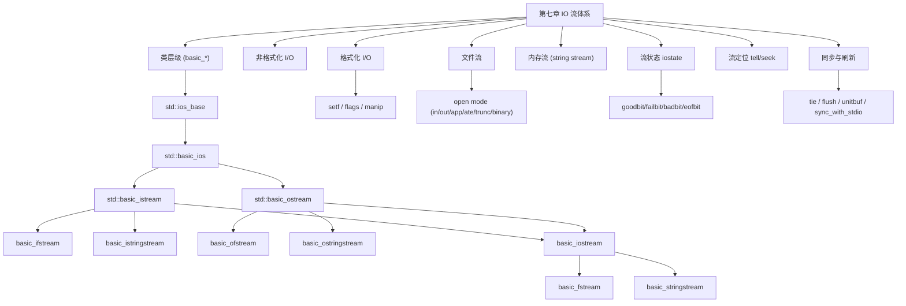

# 第七章：深入IO

> **一句话定义**：本章是 C++ IO 流体系的工程速查手册——围绕 `std::cin` / `std::cout` / `std::cerr` / `std::clog` 四大全局流、`std::ifstream` / `std::ofstream` / `std::fstream` 文件流、`std::istringstream` / `std::ostringstream` / `std::stringstream` 内存流，全景梳理 `std::basic_istream` / `std::basic_ostream` 类层级,并逐项对照非格式化 I/O、格式化 I/O、操纵符、文件打开模式、`failbit / badbit / eofbit / goodbit` 流状态、`tellg/seekg` 定位与 `std::ios::sync_with_stdio` 同步,附 `std::format` (C++20) / `std::print` (C++23) 等现代 C++ 补丁。

## 章节知识框架



## 7.0 IO 类层级速查图

> C++ IO 库全部基于类模板 `basic_*<CharT, Traits>` — `char` 实例化得 `std::cin / std::cout / std::ifstream / ...`;`wchar_t` 实例化得 `std::wcin / std::wcout / std::wifstream / ...`。

| 模板 | 头文件 | char 别名 | wchar_t 别名 | 角色 |
|---|---|---|---|---|
| `std::ios_base` | `<ios>` | — | — | 与字符无关的基类:格式标志、状态位、回调 |
| `std::basic_ios<CharT,Traits>` | `<ios>` | `std::ios` | `std::wios` | 与字符相关基类:`tie()`、`fill()`、`rdbuf()`、`operator bool()` |
| `std::basic_streambuf` | `<streambuf>` | `std::streambuf` | `std::wstreambuf` | 缓冲区,连接外部设备 |
| `std::basic_istream` | `<istream>` | `std::istream` | `std::wistream` | 输入流;`operator>>` / `read` / `get` / `getline` |
| `std::basic_ostream` | `<ostream>` | `std::ostream` | `std::wostream` | 输出流;`operator<<` / `write` / `put` / `flush` |
| `std::basic_iostream` | `<istream>` | `std::iostream` | `std::wiostream` | 双向流,虚继承自 istream + ostream |
| `std::basic_ifstream` | `<fstream>` | `std::ifstream` | `std::wifstream` | 文件输入流 |
| `std::basic_ofstream` | `<fstream>` | `std::ofstream` | `std::wofstream` | 文件输出流 |
| `std::basic_fstream` | `<fstream>` | `std::fstream` | `std::wfstream` | 双向文件流 |
| `std::basic_istringstream` | `<sstream>` | `std::istringstream` | `std::wistringstream` | 字符串输入流 |
| `std::basic_ostringstream` | `<sstream>` | `std::ostringstream` | `std::wostringstream` | 字符串输出流 |
| `std::basic_stringstream` | `<sstream>` | `std::stringstream` | `std::wstringstream` | 双向字符串流 |

四个全局流对象(`<iostream>`):

| 名字 | 关联设备 | 是否默认 unitbuf | 用途 |
|---|---|---|---|
| `std::cin` | stdin | 否;默认 `tie(&std::cout)` | 标准输入;每次提取前自动冲刷 `cout` |
| `std::cout` | stdout | 否;行缓冲(终端) | 标准输出 |
| `std::cerr` | stderr | 是;`unitbuf` | 标准错误,每次写入立刻刷新 |
| `std::clog` | stderr | 否 | 标准日志;与 `cerr` 同设备但带缓冲 |

```c++
// 常用的类型实际上是类模板实例化的结果
#include <iostream>

// 表示形式的变化：使用格式化 / 解析在数据的内部表示与字符序列间转换
int main()
{
    int x = 100;	// 00..00 01100100  
    // 将二进制的值格式化成 三个字符： 1 0 0 ; 输出流
    std::cout << x << std::endl;
    
    std::cin 
}

////////////////////////////////////////////////////

int main()
{
    union	// 联合体
    {		// 使用一块内存既表示 x , 又表示 y
        // int 和 float 都占了四个字节
        // 这四个字节可以同时用来表示 x 和 y
        int x;
        float y;
    };
    
    x = 100;
    
    std::cout << x << std::endl;	// -> 100
    std::cout << y << std::endl;	// -> 1.4013e-43
    // 用不同的方式解释同一块内存， 相应的格式化处理方式不同，
    // 类型不同输出流转换出来的字符序列不同
}
////////////////////////////////////////////////////
/*
template<
    class CharT,
    class Traits = std::char_traits<CharT>
> class basic_ifstream : public std::basic_istream<CharT, Traits>
*/

#include <fstream>	// 对文件进行输入输出操作

int main()
{
    std::ifstream x;
    std::basic_ifstream<char,std::char_traits<char>> x; //同上面等价
    // ifstream  -> basic_ifstream<char>
    //char 是一个模板的实参
    // wifstream -> basic_ifstream<wchar_t>
    
    // -->
    std::ifstream x = std::basic_ifstream<char>();
}

```

> 关键洞察:所有 `std::xxxstream` 都是 `basic_xxxstream<char, std::char_traits<char>>` 的别名;类型名按 `CharT` 实参分支,宽字符版本以 `w` 前缀命名。

godbolt(类模板别名 + 静态断言验证类层级):
<https://godbolt.org/?source=#g:!((g:!((g:!((h:codeEditor,i:(filename:'1',fontScale:14,fontUsePx:'0',j:1,lang:c%2B%2B,source:'%23include+%3Cfstream%3E%0A%23include+%3Csstream%3E%0A%23include+%3Ctype_traits%3E%0Aint+main()%7B%0A++static_assert(std::is_same_v%3Cstd::ifstream,std::basic_ifstream%3Cchar%3E%3E)%3B%0A++static_assert(std::is_base_of_v%3Cstd::basic_istream%3Cchar%3E,std::basic_ifstream%3Cchar%3E%3E)%3B%0A++static_assert(std::is_base_of_v%3Cstd::basic_ios%3Cchar%3E,std::basic_istream%3Cchar%3E%3E)%3B%0A++static_assert(std::is_base_of_v%3Cstd::ios_base,std::basic_ios%3Cchar%3E%3E)%3B%0A%7D'),k:50,l:'4',n:'0',o:'',s:0,t:'0'),(g:!((h:compiler,i:(compiler:g142,filters:(),lang:c%2B%2B,libs:!(),options:'-std%3Dc%2B%2B17',source:1),l:'5',n:'0',o:'+x86-64+gcc+14.2',t:'0')),k:50,l:'4',n:'0',o:'',s:0,t:'0')),l:'2',n:'0',o:'',t:'0'),version:4>

## 7.1 输入与输出

> 一切 IO 都在做两件事——**格式化**(把数据的二进制内部表示 ↔ 字符序列)与**搬运**(在内存、文件、终端之间移动字节)。

输入与输出

### 7.1.1 非格式化 I/O

非格式化 I/O

```c++
#include <iostream>

int main()
{
    // 格式化
    int x;
    std::cin >> x;	// 格式化操作，读入字符解析成二进制表示，并保存在int中
    std::cout << x << std::endl; // 把 x 中二进制表示进行格式化，输出
    
    // 非格式化输入
    // basic_istream& read( char_type* s, std::streamsize count );
    std::cin.read(reinterpret_cast<char*>(&x), sizeof(x));
    std::cout << x << std::endl;
    // 输入 100 输出  170930225
    // 原因：希望读入四个字符，100和回车;每个字符都对应一个ASCII码，
    // 每个ASCII码是一串二进制的数值，read会把每个字符对应的ASCII码读出来
    // 把这个数值不作任何解析操作和变换，直接放到 x 的某个字节当中
    // 会把四个字符对应的ASCII码原封不动放到 x 的字符中
    // 放完后再尝试打印 x ，使用格式化的输出系统尝试把这样二进制的序列进行格式化解析
    // 二进制 -> int 转换; 因此转换完之后并不与 100 对应
    
    // 输入 1 ; 还在等待输入; 在输入 2 ; 输出  171051569
    // 因为采用非格式化输入，需要输入四个字符；1 + 回车 + 2 + 回车
}


// 非格式化优势
int main()
{
    float y = 3.14;  // 类型确定，对象所占的尺寸基本确定
    // 但字符个数不同，在寄存器内部所占宽度不同：3 是一个字符; 3.14是四个字符
    std::cout << y << std::endl; // 对人友好
    
    // 在一堆 float 数里找某一个字符输出，长度不可控
    // 非格式化：每个类型占的字符个数确定，可以定位到具体的字符，对计算机友好，人不可读
}
```

格式化 vs 非格式化对照速查:

| 维度 | 格式化 (`operator>> / <<`) | 非格式化 (`read / write / get / put`) |
|---|---|---|
| 转换 | 字符序列 ↔ 类型语义值(如 `"100"` ↔ `int 100`) | 原始字节直接搬运,不解析 |
| 长度 | 变长,按分隔符 / 数字串切 | 定长(由 `sizeof` / `count` 决定) |
| 受 locale 影响 | 是(数字分隔、`boolalpha` 等) | 否 |
| 受 `width/precision` 影响 | 是 | 否 |
| 跳空白 | 默认 `skipws` 跳过空白 | 不跳 |
| 受 `failbit` 影响 | 解析失败 → `failbit` | EOF / IO 错误 → `eofbit` / `badbit` |
| 适用 | 人可读、日志、配置文本 | 二进制结构、文件持久化、序列化 |

非格式化输入接口速查(`std::basic_istream`,`<istream>`):

| 接口 | 行为 |
|---|---|
| `get()` | 读 1 个字符,返回 `int_type` |
| `get(c)` / `get(s, n)` / `get(s, n, delim)` | 读 1 字符 / 读 n-1 + `\0` / 读到分隔符 |
| `getline(s, n[, delim])` | 行读,丢弃分隔符(不写入 buffer) |
| `read(buf, count)` | 二进制读 count 字节,受 `gcount()` 跟踪 |
| `readsome(buf, count)` | 仅从缓冲区读,不阻塞 |
| `gcount()` | 上次非格式化读取实际字节数 |
| `peek()` | 偷看下一个字符不消费 |
| `unget()` / `putback(c)` | 退回 1 字符 / 替换并退回 |
| `ignore(n[, delim])` | 丢弃 n 个或直到分隔符 |
| `tellg()` / `seekg()` | 取/定位 get 指针 |

非格式化输出接口速查(`std::basic_ostream`,`<ostream>`):

| 接口 | 行为 |
|---|---|
| `put(c)` | 写 1 字符 |
| `write(buf, count)` | 二进制写 count 字节 |
| `flush()` | 把缓冲区压向 streambuf 的下游 |
| `tellp()` / `seekp()` | 取/定位 put 指针 |

### 7.1.2 格式化 I/O

格式化 I/O


```c++
#include <iostream>

// C++ 通过操作符重载以支持内建数据类型的格式化 I/O
// 触发函数重载

int main()
{
    char x = '0';
    // 重载了移位操作符进行输入输出
    std::cout << x << std::endl;	// -> 0
    // std::cout << x 触发重载
    int y = static_cast<int>(x);
    std::cout << y << std::endl;	// -> 48
    // 根据传入的类型选择适当的调用以格式化
}

// 格式控制
// 可接收位掩码类型（ showpos ）
// C++ 基本数据单位是字节，一个字节占 8 位，
// 在一些特殊情况下，仅需要对 1 位或几位数据进行操作
// showpos 用来修改某一个字节的某一位
int main()
{
    char x = '0';
    // setf -> set flag   flag 一位
    std::cout.setf(std::ios_base::showpos); // positive + 
    // 需要显示正号时
    // 相当于改变了格式化的行为
    std::cout << x << std::endl;	// -> 0
    // 此处打印字符，并不是一个整数，不存在正负，所以没有正号
    int y = static_cast<int>(x);
    std::cout << y << std::endl;	// -> +48
}


// 取值相对随意（ width ）
// 字符类型（ fill ）
int main()
{
    char x = '0';
    std::cout.setf(std::ios_base::showpos); 
    std::cout.width(10);	// 要让整个输出占 10 个字符
    std::cout.fill('.');	// 用 . 填充字符
    std::cout << x << std::endl;	// -> "         0"
    int y = static_cast<int>(x);
    // 注意 width 方法的特殊性：触发后被重置
    std::cout << y << std::endl;	// -> +48
}
```

**`std::ios_base` 格式标志位速查**(位掩码类型 `fmtflags`,按组列):

| 组 / 掩码 | 标志 | 等价操纵符 | 含义 |
|---|---|---|---|
| basefield (整数进制) | `dec` | `std::dec` | 十进制(默认) |
|  | `oct` | `std::oct` | 八进制 |
|  | `hex` | `std::hex` | 十六进制 |
|  | `showbase` | `std::showbase` / `std::noshowbase` | 输出 `0x` / `0` 前缀 |
|  | `uppercase` | `std::uppercase` / `std::nouppercase` | 字母大写(`0X`, `1E10`) |
| floatfield (浮点) | `fixed` | `std::fixed` | 固定小数 |
|  | `scientific` | `std::scientific` | 科学计数 |
|  | (hex float, C++11) | `std::hexfloat` | 同时设 fixed+scientific |
|  | (default) | `std::defaultfloat` | 清空 floatfield |
|  | `showpoint` | `std::showpoint` / `std::noshowpoint` | 强制小数点 |
| adjustfield (对齐) | `left` | `std::left` | 左对齐填充 |
|  | `right` | `std::right` | 右对齐(默认) |
|  | `internal` | `std::internal` | 符号靠左、数字靠右 |
| 符号 | `showpos` | `std::showpos` / `std::noshowpos` | 强制 `+` |
| 布尔 | `boolalpha` | `std::boolalpha` / `std::noboolalpha` | `true/false` vs `1/0` |
| 输入 | `skipws` | `std::skipws` / `std::noskipws` | 提取前跳空白(默认开) |
| 输出 | `unitbuf` | `std::unitbuf` / `std::nounitbuf` | 每次输出后自动 flush |

**`setf` / `unsetf` / `flags` 接口**:

| 方法 | 用途 |
|---|---|
| `setf(flag)` | 置位(不清掩码内其它位) |
| `setf(flag, mask)` | 在 mask 内换位(如 `setf(std::ios::hex, std::ios::basefield)`) |
| `unsetf(flag)` | 清位 |
| `flags()` | 取当前 fmtflags |
| `flags(f)` | 整体替换 |
| `width(n)` / `width()` | 设置 / 读取下次输出宽度(**用一次即重置**) |
| `precision(n)` | 设置浮点精度(不重置) |
| `fill(c)` / `fill()` | 填充字符 |

### 7.1.3 操纵符 (manipulators)

操纵符

```c++
#include <iostream>
#include <string>
#include <iomanip>

int main()
{
    char x = '0';
    int y = static_cast<int>(x);
    
    std::cout.setf(std::ios_base::showpos); 
    std::cout.width(10);	
    std::cout.fill('.');	
    std::cout << x << std::endl;	
	std::cout.width(10);
    std::cout << y << std::endl;	
    
    std::cout << x << '\n' << y << '\n';
}

#include <iomanip>

// 操纵符
int main()
{
    char x = '0';
    int y = static_cast<int>(x);
    
    std::cout << std::showpos 
              << std::setw(10) << std::setfill('.') << x << '\n'
              << std::setw(10) << y << std::endl;
}

// 提取会放松对格式的限制, 部分数据类型有效
int x;
char x; // 行为不一样，只取第一个字符
std::string x;
std::cin >> x; // +10;    10  -> 10

//提取 C 风格字符串时要小心内存越界
int main()
{
    char x[5];	// abcdefg \0
    std::cin >> x;
    std::cout << x << std::endl;
    
    std::cin >> std::setw(5) >> x; // abcdefg \0
    std::cout << x << std::endl;   // abcd
    
}
```

**操纵符速查表**(按头文件):

| 头文件 | 操纵符 | 等价 fmtflag / 行为 |
|---|---|---|
| `<ios>` | `std::boolalpha` / `std::noboolalpha` | 切换 `boolalpha` |
| `<ios>` | `std::showbase` / `std::noshowbase` | 切换 `showbase` |
| `<ios>` | `std::showpoint` / `std::noshowpoint` | 切换 `showpoint` |
| `<ios>` | `std::showpos` / `std::noshowpos` | 切换 `showpos` |
| `<ios>` | `std::uppercase` / `std::nouppercase` | 切换 `uppercase` |
| `<ios>` | `std::skipws` / `std::noskipws` | 切换 `skipws` |
| `<ios>` | `std::unitbuf` / `std::nounitbuf` | 切换 `unitbuf` |
| `<ios>` | `std::left` / `std::right` / `std::internal` | 设 adjustfield |
| `<ios>` | `std::dec` / `std::oct` / `std::hex` | 设 basefield |
| `<ios>` | `std::fixed` / `std::scientific` / `std::hexfloat` / `std::defaultfloat` | 设 floatfield |
| `<ostream>` | `std::endl` | 写 `'\n'` 并 `flush` |
| `<ostream>` | `std::flush` | flush 缓冲区 |
| `<ostream>` | `std::ends` | 写 `'\0'` |
| `<istream>` | `std::ws` | 提取并丢弃前导空白 |
| `<iomanip>` | `std::setw(n)` | 设宽度(用一次重置) |
| `<iomanip>` | `std::setfill(c)` | 设填充字符 |
| `<iomanip>` | `std::setprecision(n)` | 设浮点精度 |
| `<iomanip>` | `std::setbase(b)` | 设进制 8/10/16 |
| `<iomanip>` | `std::setiosflags(f)` / `std::resetiosflags(m)` | 置位 / 清位 |
| `<iomanip>` (C++14) | `std::quoted(s[, delim, esc])` | 引号化字符串,便于 read-trip |
| `<iomanip>` (C++11) | `std::put_money` / `std::get_money` | 货币格式 |
| `<iomanip>` (C++11) | `std::put_time` / `std::get_time` | 时间格式(`strftime` 风格) |

**两种风格等价对照**:

| 方法风格 | 操纵符风格 |
|---|---|
| `std::cout.setf(std::ios_base::showpos);` | `std::cout << std::showpos;` |
| `std::cout.width(10);` | `std::cout << std::setw(10);` |
| `std::cout.fill('.');` | `std::cout << std::setfill('.');` |
| `std::cout.precision(6);` | `std::cout << std::setprecision(6);` |
| `std::cout.flush();` | `std::cout << std::flush;` |

> 关键易错:`width()` / `setw()` 只生效一次;接连两次输出第二次又得重新设置。`std::cin >> std::setw(N) >> char_array` 是防止 C 风格字符串提取越界的标准做法(实测把第 N 个位置留给 `\0`)。

## 7.2 文件与内存操作

文件与内存操作

### 7.2.1 文件操作

文件操作

```c++
// basic_ifstream / basic_ofstream / basic_fstream
#include <iostream>
#include <fstream>
#include <string>

int main()
{
    std::ofstream outFile("my_file");
    std::cout << outFile.is_open() << '\n'; // 判断文件流是否打开
    outFile << "Hello\n";  // 输出到文件里，cout 输出到终端
    
    std::ofstream outFile;	// 缺省构造，此时outFile没有和指定文件相关联
    std::cout << outFile.is_open() << '\n'; // 此时关闭，无关联
    outFile.open("my_file");	// 使 outFile 与文件关联
    std::cout << outFile.is_open() << '\n'; // 此时打开
    outFile.close();   // 解除关联
    std::cout << outFile.is_open() << '\n';  // 关闭
    
    // 读取文件
    std::ifstream inFile("my_file");
    std::string x;
    inFile >> x;
    std::cout << x << '\n';  // -> Hello
}

// 文件流可以处于打开 / 关闭两种状态
// 处于打开状态时无法再次打开，只有打开时才能 I/O


int main()
{
    // 类模板：1.构造函数，构造对象  2.析构函数，销毁对象
    // 销毁对象时会调用析构函数，此处的析构函数包含了关闭数据流的逻辑
    // 因此没有显示包含outFile.close()也能把缓存中的内容放入文件
	std::ofstream outFile;	// ofstream 抽象数据函数，使用类模板实现
    
    outFile.open("my_file");
    outFile << "Hello\n";	// 写到缓存
    outFile.close();  	// 把缓存中的内容放到文件里，再关闭
    // 确保缓存中的内容全部放到文件中
    
	// 如果想在某一行之前执行完销毁
    // 构造域  即可
    {
        std::ofstream outFile("my_file");
        outFile << "Hello\n";
    }
    // 此时 outFile 已经被关闭
}
```

**文件流接口速查**(`<fstream>`):

| 接口 | 适用 | 行为 |
|---|---|---|
| `T(path[, mode])` | i/o/fstream | 构造并打开;失败设 `failbit` |
| `open(path[, mode])` | i/o/fstream | 关联文件;当前已打开则失败 |
| `is_open()` | i/o/fstream | 是否打开 |
| `close()` | i/o/fstream | 刷新 + 关闭;析构自动调用 |
| `rdbuf()` | i/o/fstream | 取底层 `std::filebuf*` |

> 析构 = RAII:`ofstream` 离开作用域时其析构函数会 `close()` 并刷新缓冲区。所以局部作用域 `{ ofstream f(...); f << ...; }` 在右花括号处保证内容落盘——这是 C++ 文件 IO 与 C `FILE*` 最重要的差异。

### 7.2.2 文件流的打开模式

文件流的打开模式

```c++
// 每种文件流都有缺省的打开方式
#include <iostream>
#include <fstream>

int main()
{
    std::ofstream outFile("my_file", std::ios_base::out);
    outFile << "Hello\n";
    
    std::ifstream inFile("my_file", std::ios_base::in);
    
    std::ios_base::in;		// 0010
    std::ios_base::ate;		// 0001
    std::ios_base::in | std::ios_base::ate  // 按位或 不是逻辑或
    // 按位或  0011  -> 表示既能实现 in 的功能又能实现 ate 的功能
        
    // 如果文件存在，会把原始文件清了，再写入  
    std::ofstream outFile("my_file", std::ios_base::out | std::ios_base::trunc);
    outFile << "World\n";
    
    // 附加
    std::ofstream outFile("my_file", std::ios_base::out | std::ios_base::app);
}

```

**`std::ios_base::openmode` 位掩码速查**:

| 标志 | 含义 |
|---|---|
| `in` | 允许读 |
| `out` | 允许写 |
| `app` | append——每次写入前 seek 到文件末(多进程安全) |
| `ate` | at end——打开后立即 seek 到末(首次写之后位置任意) |
| `trunc` | 打开时截断为 0 字节 |
| `binary` | 二进制模式(不做 `\n` ↔ `\r\n` 转换) |

**默认模式 + 常见组合**:

| 类 | 默认 mode | 典型用法 |
|---|---|---|
| `std::ifstream` | `in` | 读已存在文件;不存在 → `failbit` |
| `std::ofstream` | `out \| trunc` | 写文件;存在则清空;不存在则创建 |
| `std::fstream` | `in \| out` | 读写;**文件必须存在**,否则 `failbit` |
| 追加日志 | `out \| app` | 多进程并发写,原子 append |
| 读末尾偏移 | `in \| ate` | 打开后 `tellg()` 直接得文件大小 |
| 二进制读写 | `in \| out \| binary` | 序列化二进制结构体 |

> 关键区分:**`app` vs `ate`**——`app` 在**每次写之前**重新 seek 到末尾(多写入者安全);`ate` 只在**打开瞬间** seek 到末尾,之后位置受 `seekp` / 写入自然推进控制。

### 7.2.3 内存流

内存流

```c++
//	basic_istringstream
//	basic_ostringstream
//	basic_stringstream
#include <iostream>
#include <sstream>

// 输出流
int main()
{
    std::ostringstream obj1;	// 构造输出的内存流对象
    obj1 << 1234;	// 格式化方式输出，注意 这里输入是 1234 整数--> 字符串
    // obj1 << true;  // -> 1  最终是把数据放到 res 内；不是终端不是文件
    // 把 1234 放到一块内存中
    // 需要找到对应的内存读取相应的数据
    // 用 str 获取底层所对应的内存
    // 返回 std::basic_string<CharT,Traits,Allocator>  其实就是string
    auto res = obj1.str();
    // 可以直接写成
    std::string res = obj1.str();  // obj1 内部保存的对应的信息
    std::cout << res << std::endl; // -> 1234 字符串
}

#include <iomanip>

int main()
{
    std::ostringstream obj1;
    obj1 << std::setw(10) << std::setfill('.') << 10; // -> ........10
    std::string res = obj1.str();  
    std::cout << res << std::endl;
}
// 输入流
int main()
{
    std::ostringstream obj1;
    obj1 << 10;
    std::string res = obj1.str();  
    
    std::istringstream obj2(res); // 构造输入流时需把读取的内存给出
    int x;
    obj2 >> x;	// std::cin >> x 
    std::cout << x << std::endl;
}

// 也会受打开模式： in / out / ate / app 的影响

int main()
{
    // 输出流在 append 模式 (C++11)
    std::ostringstream buf2("test", std::ios_base::ate);
    buf2 << '1'; // 位于结尾处 + 1  // 可以自动扩大内存
    std::cout << buf2.str() << '\n';
    
    std::ostringstream buf2("test");
    buf2 << '1'; // 输出 1est ; 会把 t 替换掉
    std::cout << buf2.str() << '\n';
}

// 使用 str() 方法获取底层所对应的字符串
// 小心 避免使用 str().c_str() 的形式获取 C 风格字符串
int main()
{
    std::ostringstream buf2("test", std::ios_base::ate);
    buf2 << '1';
    std::string res = buf2.str();
    auto c_res = res.c_str();  // C 风格字符串
    // c_res 是一个指针，指向 字符串 开头地址
    std:: cout << c_res << std::endl;	// 合法
    // 这样也行，但要 小心销毁内存 导致 程序未定义 的情况发生
    std:: cout << buf2.str().c_str() << std::endl;
    
    // 不能这么写，程序未定义
    auto c_res = buf2.str().c_str();
    // buf2.str()返回的是右值 字符串，c_str()指向了这块字符串内部的首地址，此处还没问题
    // 因为执行了右值，此处会被释放掉
    std:: cout << c_res << std::endl;
    // 可能会指向一块已经被释放掉的内存，导致行为未定义
}

// 基于字符串流的字符串拼接优化操作
int main()
{
    std::string x;   // string 
    x += "Hello";	 // 插入字符串，先看string 是否有足够的缓冲区 保存
    x += "World";	 // 插入新的字符，基本上要建立新的缓冲区
    x += "Hello";	 // 把原始缓冲区的内容拷到新的缓冲区中
    x += "World";	 // 再把插入的字符添加到新的缓冲区中，再把原始的缓冲区释放
    // 涉及到缓冲区开辟，内存拷贝，缓冲区释放过程
    std::cout << x << std::endl;
    // 这样性能较差
    
    // 行为一样，但较上述性能要好
    // 基于字符串流的字符串拼接优化操作
    // 原理：数据先放到缓冲区而不是直接输出到设备；
    // 此处缓冲区较大，且在缓冲区满了的时候一次性把内容输出到对应设备
    // 此时才会设计到内存开辟、拷贝、释放; 减少了内存的消耗成本。因此性能更好
    std::ostringstream obj;
    obj << "Hello";
    obj << "World";
    obj << "Hello";
    obj << "World";
    std::cout << obj.str() << std::endl;
    // obj.str()触发缓冲区刷新，把内容输出到目标内存
}
```

**内存流接口速查**(`<sstream>`):

| 接口 | 行为 |
|---|---|
| `T()` | 构造空内存流 |
| `T(s[, mode])` | 用初始字符串构造 |
| `str()` | 返回底层 `std::string` 副本 |
| `str(s)` | 把底层缓冲替换为 `s` |
| `rdbuf()` | 取底层 `std::stringbuf*` |
| C++20 `str()` (move) | 直接搬走底层串,零拷贝 |
| C++20 `view()` (ostringstream) | 取底层串的 `string_view`,无拷贝 |

**内存流三大用途**:

| 用途 | 模式 | 示例 |
|---|---|---|
| 任意类型 → string | `ostringstream` | 替代 `std::to_string`;可附带格式化 |
| string → 任意类型 | `istringstream` | 解析行内 token;替代 `sscanf` |
| 高性能拼接 | `ostringstream` | 多次 `<<` 累加;末尾 `str()` 一次落地 |

> C++23 起,`std::ostringstream::str() &&` 可以 move 出底层缓冲,避免再拷贝一次大字符串。

## 7.3 流的状态

流的状态

```c++
// iostate
typedef /*implementation defined*/ iostate;
static constexpr iostate goodbit = 0;
static constexpr iostate badbit = /*implementation defined  实现定义*/
static constexpr iostate failbit = /*implementation defined*/
static constexpr iostate eofbit = /*implementation defined*/
// 编译器定义的

/*    
常量   	解释
goodbit	无错误
badbit	不可恢复的流错误
failbit	输入/输出操作失败（格式化或提取错误）
eofbit	关联的输出序列已抵达文件尾*/
    
#include <iostream>

int main()
{
    //指定流状态标志。它是位掩码类型 (BitmaskType) 
    iostate -- char
        badbit  -- 0000,0001	// badbit | failbit = 0000,0011
        failbit -- 0000,0010
        eofbit  -- 0000,0100
}

#include <iostream>
#include <fstream>
//  badbit 不可恢复
int main()
{
    std::ofstream outFile; // 构造outFile
    outFile << 10;  // 没有对应文件，把outFile由一个正常状态变成异常状态
    // 异常状态 -> badbit 不可恢复
}

// failbit 可恢复
int main()
{
    // 输入流
    int x;
    std::cin >> x;
    // 输入 Hello 因为不是 int型 因此会 failbit
    
    // 输出流
    std::ofstream outFile;// 当前状态即是关闭状态
    outFile.close();// 再次进行关闭  failbit
}

// eofbit : end of file 读到文件尾没得读了会产生eofbit
// 对文件流、内存流以及终端流都有效
// 只对输入序列有关
int main()
{
    int x;
    std::cin >> x;
    // Ubuntu下 ctrl + D   --> eofbit
}

// 检测流的状态
// good() / fail() / bad() / eof()
int main()
{
    int x;
    std::cin >> x;
    
    std::cout << std::cin.good()
   	          << std::cin.fail()
              << std::cin.bad()
              << std::cin.eof()		// 检测异常状态eofbit
              << static_cast<bool>(std::cin) << std::endl;
}

//注意区分 fail 与 eof
// char 时 eof 和 fail 会被同时设置
int main()
{
    char x;
    // 先输入 a
    // Ubuntu下按两次 ctrl + D 
    std::cin >> x;
    std::cout << std::cin.fail() << ' ' << std::cin.eof() << std::endl;
    // 读完 a 已经读取完了系统不会再往下读取，因此 eof 输出为 0
    std::cin >> x;
    // 因为已经读到了结尾，eof 输出为 1，fail 输出 1
    std::cout << std::cin.fail() << ' ' << std::cin.eof() << std::endl;
    // 输出 0 0; 1 1
}
// int 时 eof 和 fail 不会被同时设置
int main()
{
    int x;	
    std::cin >> x;
    // 输入 10 ; 第一个字符 1 第二个字符 0，读到输入结尾
    // 输出 0 1   
    std::cout << std::cin.fail() << ' ' << std::cin.eof() << std::endl;
}
// 通常来说，只要流处于某种错误状态时，插入 / 提取操作就不会生效
// 复位流状态
// clear ：设置流的状态为具体的值（缺省为 goodbit ）
void clear( std::ios_base::iostate state = std::ios_base::goodbit );
int main()
{
    int x;	
    std::cin >> x;
    std::cout << std::cin.fail() << ' ' << std::cin.eof() << std::endl;
    std::cin.clear(); // 传入了 goodbit
    // 相当于把所有错误的状态给清空了，复位了流的状态
    // 也可以传入 failbit、badbit、eofbit，设置流的状态为具体的值   
}
// setstate ：将某个状态附加到现有的流状态上
// 通常不会调用上述方法，一般不太需要对流的状态进行处理

// 捕获流异常：exceptions方法
// 程序处于非正常状态时 抛出异常，使程序跳转到异常处理
#include <iostream>
#include <fstream>
 
int main() 
{
    int ivalue;
    try {
        std::ifstream in("in.txt");
        in.exceptions(std::ifstream::failbit);
        in >> ivalue;
    } catch (std::ios_base::failure &fail) {
        // 此处处理异常
    }
}
```

**`iostate` 四个状态位速查**:

| 位 | 含义 | 触发场景 | 可恢复 |
|---|---|---|---|
| `goodbit = 0` | 无错误 | 默认 | — |
| `eofbit` | 已抵达输入末尾 | 读完文件 / `Ctrl-D` (Linux) / `Ctrl-Z` (Windows) | 可(`clear()`) |
| `failbit` | 格式化 / 提取失败、`close` 一个未打开流、`open` 失败 | 输入类型不匹配(向 `int` 喂 `"Hello"`)、`open` 不存在的文件用于 `ifstream` | 可 |
| `badbit` | 不可恢复的 IO 错误 / streambuf 异常 | 物理 IO 错误、底层缓冲区抛异常 | 难 |

**状态查询接口**:

| 方法 | 等价 |
|---|---|
| `good()` | `rdstate() == goodbit` |
| `eof()` | `rdstate() & eofbit` |
| `fail()` | `rdstate() & (failbit \| badbit)` |
| `bad()` | `rdstate() & badbit` |
| `operator bool()` | `!fail()` — 这是 `while (cin >> x)` 能成立的根源 |
| `operator!()` | `fail()` |
| `rdstate()` | 取 raw iostate |
| `clear([state=goodbit])` | 整体重置 |
| `setstate(state)` | 按位 OR 设置 |
| `exceptions([mask])` | 设定哪些位触发 `std::ios_base::failure` 异常 |

**`fail` vs `eof` 关键区分**(来自原文实验):

| 类型 | 输入 | 读完后 `fail` | `eof` |
|---|---|---|---|
| `char` | `a` + EOF | 第二次读 → `1` | 第二次读 → `1`(同时置位) |
| `int` | `10` + EOF | `0`(成功解析) | `1`(看到 EOF) |

> 工程惯例:**循环读取用 `while (cin >> x)` 而不是 `while (!cin.eof())`**——后者在最后一次失败提取后还会进入循环一次。

> 异常路径:`stream.exceptions(failbit | badbit)` 之后,状态位被置时会抛 `std::ios_base::failure`,方便集中处理。

## 7.4 流的定位

流的定位

```c++
// 获取流位置
#include <iostream>

// tellg() / tellp() 可以用于获取输入 / 输出流位置 (pos_type 类型 )
// gap  拿       put 放
// 若 fail()==true ，则返回 pos_type(-1)  流错误则不能使用
#include <iostream>
#include <sstream>
int main()
{
    std::ostringstream s;	// 输出流
    std::cout << s.tellp() << '\n'; // 返回的是 当前 可以写入的位置
    s << 'h';
    std::cout << s.tellp() << '\n';
    s << "ello, world ";
    std::cout << s.tellp() << '\n';
    s << 3.14 << '\n';
    std::cout << s.tellp() << '\n' << s.str();
}
// 输出
0	// 当前可以写入的位置是 0 
1	// 写入位置往后挪一位
13
18
hello, world 3.14
    
    
//  tellg()
#include <iostream>
#include <string>
#include <sstream>
 
int main()
{
    std::string str = "Hello, world";
    std::istringstream in(str);  // 输入流
    std::string word;
    in >> word;	// 用 in 读取字符串并保存至 word
    std::cout << "After reading the word \"" << word
              << "\" tellg() returns " << in.tellg() << '\n';
    // 标准输入处理字符串时，按顺序依次处理，直到遇到分隔符
    // tellg 打印出 接下来 要读取或写入的字符
}
// 输出
After reading the word "Hello," tellg() returns 6
    
    
// 设置流位置
// seekg()  用于设置输入流的位置
basic_istream& seekg( pos_type pos );
basic_istream& seekg( off_type off, std::ios_base::seekdir dir);
// off_type 偏移量
pos	-	设置输入位置指示器到的绝对位置。
off	-	设置输入位置指示器到的相对位置。
dir	-	定义应用相对偏移到的基位置。它能为下列常量之一：
        常量	解释
        beg	流的开始
        end	流的结尾
        cur	流位置指示器的当前位置
    
#include <iostream>
#include <string>
#include <sstream>
 
int main()
{
    std::string str = "Hello, world";
    std::istringstream in(str);	// 定义输入流
    std::string word1, word2;
 
    in >> word1;
    in.seekg(0); // 回溯  //调用了第一个方法
    // 流的当前位置是6，回溯到了0
    in >> word2;
 
    std::cout << "word1 = " << word1 << '\n'
              << "word2 = " << word2 << '\n';
}
// 输出：
word1 = Hello,
word2 = Hello,

// seekp() 用于设置输出流的位置
basic_ostream& seekp( pos_type pos );
basic_ostream& seekp( off_type off, std::ios_base::seekdir dir );

#include <sstream>
#include <iostream>
 
int main()
{
    std::ostringstream os("hello, world");
    os.seekp(7);
    os << 'W';	// 小 w 换成 W
    os.seekp(0, std::ios_base::end);// 挪到最后一个位置
    os << '!';
    os.seekp(0);// 挪到开头
    os << 'H';
    std::cout << os.str() << '\n';
}
// 输出
Hello, World!
```

**定位接口速查**:

| 接口 | 流 | 行为 |
|---|---|---|
| `tellg()` | `basic_istream` | 返回当前 get 位置(`pos_type`);`fail()` 时返回 `pos_type(-1)` |
| `tellp()` | `basic_ostream` | 返回当前 put 位置(`pos_type`) |
| `seekg(pos)` | `basic_istream` | 绝对定位 |
| `seekg(off, dir)` | `basic_istream` | 相对定位 |
| `seekp(pos)` | `basic_ostream` | 绝对定位 |
| `seekp(off, dir)` | `basic_ostream` | 相对定位 |

**`std::ios_base::seekdir` 三个起点**:

| 常量 | 含义 |
|---|---|
| `std::ios_base::beg` | 流开始 |
| `std::ios_base::cur` | 当前指示器位置 |
| `std::ios_base::end` | 流结尾 |

**常见 idiom**:

| 目标 | 写法 |
|---|---|
| 读文件大小 | `f.seekg(0, std::ios_base::end); auto sz = f.tellg();` |
| 回到开头 | `f.seekg(0);` 或 `f.seekg(0, std::ios_base::beg);` |
| 跳过 N 字节 | `f.seekg(N, std::ios_base::cur);` |
| 倒数第 N 字节 | `f.seekg(-N, std::ios_base::end);` |

> 注意:**文本模式下的 `seekg` 不保证字节偏移**(CRLF 转换);需精确字节偏移请用 `std::ios_base::binary` 打开。`fstream` 双向流上的 `seekg` 与 `seekp` 通常同步(同一个 streambuf)。

## 7.5 流的同步

流的同步

```c++
#include <sstream>
#include <iostream>
 
// 输出流的同步
int main()
{
    std::cout << "What's your name\n";
    // 缓冲区满了在一次性输出
    // 若是基于缓冲区的用法，这句话还在缓冲区中，而系统还在等待输入
    // 不能采用缺省行为（缓冲区满输出），需要主动刷新缓冲区——流的同步
    // 方法1
    std::cout.flush();
    // 方法2
    std::cout << "What's your name\n" << std::flush;
    // 方法3
    std::cout << "What's your name" << std::endl;
    // endl  回车和刷新放在一起
    std::string name;
    std::cin >> name;
    // cin 绑定到了 cout 上
    // cin 在做任何操作之前会对 cout 的缓冲区进行刷新
    // 因此此处 cout 的内容一定能打印出来
    
}


// 输入流的同步
// sync() 用于输入流同步，其实现逻辑是编译器所定义的


// 输出流可以通过设置 unitbuf 来保证每次输出后自动同步
// std::cout << std::unitbuf; // 启用自动冲入
// 好处：信息立即显示
// 坏处：影响程序性能（与外部设备交互次数变多）


int main()
{
    // 区别
    std::cout << "What's your name" << std::endl;
    // 标准输出
    // cout 一般会设置缓冲区
    std::cerr << "What's your name" << std::endl;
    // 标准错误输出
    // 缺省情况会被设置成unitbuf，
    // 即cerr中的内容会被直接显示出来
}

// 基于绑定 (tie) 的同步
// 流可以绑定到一个输出流上，这样在每次输入 / 输出前可以刷新输出流的缓冲区
   A --> C // 将输出流 A 绑定到 C 上，即 A 记录了 C 中的内容
         D // 若再将 A 绑定到 D 上， A  不再绑定 C
   B --> C
       // A、B 可以同时绑定到一个输出流

// 绑定后， A 无论是输入还是输出流，A 在做输入输出操作之前一定会刷新 C 的缓冲区

       
// 缺省情况下， C++ 的输入输出操作会与 C 的输入输出函数同步
#include <iostream>
#include <cstdio>
 
int main()
{
    // 可以通过 sync_with_stdio 关闭该同步
    std::ios::sync_with_stdio(false); // 解除同步
       // 除非特别注重性能，一般不用关闭此同步
    std::cout << "a\n";
    std::printf("b\n");
    std::cout << "c\n";
}

// Possible output:
b
a
c
```

**四种刷新输出缓冲区的写法**:

| 方法 | 写法 | 备注 |
|---|---|---|
| 方法 1 | `std::cout.flush();` | 仅刷新,不写 `\n` |
| 方法 2 | `std::cout << ... << std::flush;` | 操纵符等价 |
| 方法 3 | `std::cout << ... << std::endl;` | 写 `\n` + flush |
| 方法 4 | `std::cout << std::unitbuf;` | 之后每次 `<<` 都自动 flush |

**`tie` 绑定关系速查**:

| 流 | 默认 tie | 含义 |
|---|---|---|
| `std::cin` | `&std::cout` | 每次提取前自动 `cout.flush()` —— 这是 `std::cout << "Prompt: "; std::cin >> x;` 能看到 prompt 的原因 |
| `std::wcin` | `&std::wcout` | 同上 |
| `std::cerr` | 无;自身 `unitbuf` | 错误流总即时显示 |
| `std::clog` | 无 | 带缓冲日志 |

**`tie` API**:

| 方法 | 行为 |
|---|---|
| `s.tie()` | 取当前绑定流(`std::ostream*`) |
| `s.tie(p)` | 设新绑定,返回旧绑定 |
| `s.tie(nullptr)` | 解绑(高频 IO 优化常见做法) |

**`sync_with_stdio` 速查**:

| 状态 | 含义 | 性能 |
|---|---|---|
| `true`(默认) | C++ stream 与 C `<cstdio>` 共用缓冲;多流交替混打有序 | 慢 |
| `false` | 解除同步;C++ stream 自走缓冲 | 快(竞赛常用) |

> 关键:**调用顺序很重要**——`std::ios::sync_with_stdio(false);` 应在任何 IO 之前调用,否则行为未指定。`std::cin.tie(nullptr);` 是另一半常用搭配,用于停止每次提取前的 `cout` 自动 flush。

## 7.6 现代 C++ 补丁(C++17/20/23)

> 旧式 `printf` / `stringstream` 拼接慢且类型不安全;C++17/20/23 提供了一整套替代品。引用:cppreference、WG21 papers。

| 标准 | 特性 | 替代 | 一句话用法 |
|---|---|---|---|
| C++17 | **`std::filesystem`** | C `stat / opendir / rename` | 跨平台路径 / 文件系统操作(`<filesystem>`) |
| C++17 | **`std::byte`** | `char` / `unsigned char` 表二进制 | 二进制 IO buffer 元素类型(`<cstddef>`) |
| C++17 | **`std::string_view`** | `const std::string&` IO 参数 | 零拷贝传文本,避免 `std::string` 构造 |
| C++17 | **结构化绑定** | `tie(a,b)=...` | `auto [k,v] : map`;与 `>>` 解析对 token 友好 |
| C++17 | **`if constexpr`** | SFINAE 选择 IO 路径 | 编译期分支选择格式化分支 |
| C++17 | **`std::from_chars / std::to_chars`** | `std::stoi` / `sprintf` | 无 locale、不抛异常、不分配——竞赛/底层最快文本转数值(`<charconv>`) |
| C++20 | **`std::format(fmt, args...)`** | `sprintf / boost::format / stringstream` | 类型安全、`{}`-占位符;返回 `std::string`(`<format>`,[P0645](https://wg21.link/P0645)) |
| C++20 | **`std::format_to(out, fmt, ...)`** | — | 写到任意输出迭代器,零分配 |
| C++20 | **`std::chrono::format`** | `put_time / strftime` | 直接 `std::format("{:%F %T}", tp)` 格式化时间 |
| C++23 | **`<spanstream>`** | `stringstream` | 在外部 buffer 上跑 stream,无分配 |
| C++20 | **`std::ostringstream::view()`** | `obj.str()` 大字符串拷贝 | 取 `string_view`,零拷贝 |
| C++20 | **`std::osyncstream`** | 多线程并发写日志 | 线程安全的 cout 包装(`<syncstream>`) |
| C++23 | **`std::print(fmt, args...)`** | `printf` + `cout` 混用 | 直写 stdout / 任意流;可选 `\n`(`<print>`,[P2093](https://wg21.link/P2093)) |
| C++23 | **`std::println(fmt, args...)`** | `printf + \n` | 自动追加 `\n` 并 flush |
| C++23 | **`std::ostringstream::str() &&`** | `oss.str()` 大字符串拷贝 | 在 rvalue 上 move-out 底层 buffer |
| C++23 | **`std::expected<T,E>`** | `failbit + try/catch` | 函数式错误传递;与 `from_chars` 自然搭配 |
| C++26 (拟) | **`std::format` 编译期检查** | 运行期 `throw format_error` | 错误格式串 → 编译错([P2216](https://wg21.link/P2216) 已部分 C++20 fmt-string) |

**`std::format` vs `sprintf` 对照**([P0645](https://wg21.link/P0645)):

| 维度 | `std::format` | `printf / sprintf` |
|---|---|---|
| 类型安全 | 编译期检查类型 | 运行期未定义 |
| 占位符 | `"{}"` / `"{:>10.3f}"` | `"%s"` / `"%10.3f"` |
| 自定义类型 | 特化 `std::formatter<T>` | 不可能(除非格式化前转 string) |
| 异常 | `std::format_error` | UB 或崩溃 |
| locale | 默认无 locale;可选 `std::format(std::locale, fmt, ...)` | 受全局 locale 影响 |
| 性能 | 通常快于 `stringstream` | 略快但不安全 |

```c++
// C++20 std::format + chrono 速查示例
#include <format>
#include <chrono>
#include <iostream>

int main() {
    using namespace std::chrono;
    auto now = system_clock::now();
    // 直接格式化时间点（C++20）
    std::cout << std::format("{:%F %T}\n", now);
    // 数值 / 对齐 / 精度
    std::cout << std::format("{:>10.3f}\n", 3.14159265);
    // 命名参数（按位置）
    std::cout << std::format("{0} + {0} = {1}\n", 2, 4);
}
```

```c++
// C++23 std::print / std::println — 替代 printf 与 cout
#include <print>

int main() {
    std::print("Hello, {}!\n", "world");
    std::println("score = {:.2f}", 99.5);
    // 写到任意 FILE*
    // std::print(stderr, "error: {}\n", 42);
}
```

```c++
// C++17 std::filesystem 速查
#include <filesystem>
#include <iostream>
#include <fstream>
namespace fs = std::filesystem;

int main() {
    fs::path p = "/tmp/demo";
    fs::create_directories(p / "a/b");
    {
        std::ofstream(p / "a/hello.txt") << "hi";
    }
    for (auto& e : fs::recursive_directory_iterator(p)) {
        std::cout << e.path() << " " << fs::file_size(e.path()) << "\n";
    }
}
```

godbolt(`std::format` + 格式化标志组合):
<https://godbolt.org/?source=#g:!((g:!((g:!((h:codeEditor,i:(filename:'1',fontScale:14,fontUsePx:'0',j:1,lang:c%2B%2B,source:'%23include+%3Cformat%3E%0A%23include+%3Ciostream%3E%0Aint+main()%7B%0A++std::cout+%3C%3C+std::format(%22%7B:%3E10.3f%7D%5Cn%22,3.14159265)%3B%0A++std::cout+%3C%3C+std::format(%22%7B:%23x%7D%5Cn%22,255)%3B%0A++std::cout+%3C%3C+std::format(%22%7B:b%7D%5Cn%22,10)%3B%0A%7D'),k:50,l:'4',n:'0',o:'',s:0,t:'0'),(g:!((h:compiler,i:(compiler:g142,filters:(),lang:c%2B%2B,libs:!(),options:'-std%3Dc%2B%2B20',source:1),l:'5',n:'0',o:'+x86-64+gcc+14.2',t:'0')),k:50,l:'4',n:'0',o:'',s:0,t:'0')),l:'2',n:'0',o:'',t:'0'),version:4>

## 7.7 易错点 / 工程师避坑指南

1. **`std::cin >> x` 失败后不会清状态**:输入 `Hello` 给 `int x` → `failbit` 置位;后续所有 `cin >> ...` 立即返回失败,且**输入缓冲区里的 `Hello` 还在**。修复:`cin.clear(); cin.ignore(std::numeric_limits<std::streamsize>::max(), '\n');`。
2. **`while (!cin.eof())` 多读一次**:最后一次提取失败时 EOF 已置位,但循环体仍会执行一次脏读。永远写 `while (cin >> x) { ... }`——`operator bool()` 在 `fail()` 或 `bad()` 时返回 false。
3. **`std::cin >> char_array` 越界**:C 风格字符串提取无边界。改用 `std::cin >> std::setw(N) >> s;`(留位给 `\0`)或直接 `std::string`。
4. **`std::endl` 性能陷阱**:`endl` = `'\n'` + `flush`。批量日志或循环里写 `endl` 会强制每行 flush,导致大量 syscall。改用 `'\n'`,必要时再手动 `flush`。
5. **`width()` / `setw()` 只生效一次**:连续两个数字都要补齐?每次输出前都必须重新 `setw(n)`。`fill` 和 `precision` 没有这个性质,会持续生效。
6. **`std::ostringstream::str().c_str()` 悬空**(来自原文):`auto p = oss.str().c_str();` 中 `oss.str()` 是临时 `std::string`,表达式结束后析构,`p` 立刻悬空。改写为 `auto s = oss.str(); auto p = s.c_str();`。
7. **`ifstream` 默认不打开 binary**:在 Windows 上文本模式会做 `\r\n` ↔ `\n` 转换,影响 `tellg/seekg` 字节偏移。读写二进制必加 `std::ios_base::binary`。
8. **`fstream` 默认模式 `in | out` 不创建文件**:要既读又写新文件需 `fstream("f", in | out | trunc)` 或先 `ofstream` 一次再 `fstream` 开。
9. **`app` 与 `ate` 区别**:`app` 每次写入前都 seek end(多写者安全的 append);`ate` 仅在 open 时 seek end,之后位置可被 `seekp` 改变。日志类务必 `app`。
10. **`sync_with_stdio(false)` 之后混用 `printf` 与 `cout` 顺序未定义**:竞赛常加这行,但同时也别再用 `printf`。`std::cin.tie(nullptr);` 也要在所有 IO 之前调。
11. **`std::cin.tie(nullptr)` 之后失去 prompt**:`std::cout << "Prompt: "; std::cin >> x;` 看不到 prompt(cout 还在缓冲)。要么用 `std::endl` / `std::flush`,要么不解绑。
12. **格式标志在流间不共享**:`std::cout << std::hex << 255;` 不会影响 `std::cerr`;但对 `std::cout` 来说 `hex` **会一直生效**直到再切回 `std::dec`。
13. **`std::ifstream f("not-exists"); f >> x;` 静默失败**:`open` 失败设 `failbit`,但不抛异常。必查 `f.is_open()` 或 `if (!f)`;或者 `f.exceptions(std::ifstream::failbit);` 让它抛 `std::ios_base::failure`。
14. **流上 `goto` 跳过局部变量构造仍合法**:但跳过 `std::ifstream f(...);` 会触发编译错(C++ 不允许跳过有 ctor 的对象作用域),是合理 fail-fast。
15. **`std::format` 错误格式串**:C++20 之后 `std::format("{:d}", "abc")` 会在编译期或运行期抛 `std::format_error`。运行期版可改用 `std::vformat` 配 `std::make_format_args`。
16. **`std::println` / `std::print` 不一定立刻 flush 到 stdout**:标准只保证写到 stream 自身缓冲;要看到输出需要 `std::cout.flush()` 或写 `'\n'` 触发行缓冲(终端默认)。
17. **`std::ios_base::failure` 的 `what()` 内容实现相关**:libstdc++ 与 libc++ 不一致。日志只取 `code()` 或自己加上下文。
18. **`std::stringstream` 是重资源**:循环里每帧 `std::stringstream ss;` 反复构造很慢;考虑 `ss.str("")` 复用、`ss.clear()` 清状态,或直接 `std::format`。
19. **`std::cin.read` 期间 `gcount()` 永远是上一次结果**:要在 `read` 返回后立刻读 `gcount()`;插入其他非格式化操作会覆盖它。
20. **`std::filesystem::path` 与原始 string 隐式拼接**:`p / "file.txt"` 安全,跨平台分隔符自动;`p + "file.txt"` 是字符串拼接,可能拼出非法路径。

## 相关模块

- [相关模块: → drawio/06.io-exceptions.svg](../drawio/06.io-exceptions.svg)
- [相关模块: → drawio/05.memory-and-io.svg](../drawio/06.io-exceptions.svg)
- [相关模块: → drawio/00.global-knowledge-map.svg](../drawio/00.global-knowledge-map.svg)
