```mermaid
graph LR
  classic[shared_ptr&#160;ptr&#160;new&#160;int]
  classic --> obj1[heap: T]
  classic --> cb1[heap: ctrl_block]
  classic -. 两次分配 .-> alloc1

  factory[std::make_shared&#60;T&#62;]
  factory --> combined[heap: ctrl_block + T 连续]
  factory -. 一次分配 .-> alloc2
```

```mermaid
graph LR
  A[shared_ptr&#160;A] -->|强引用| objA[Object A]
  B[shared_ptr&#160;B] -->|强引用| objB[Object B]
  objA -.弱引用 weak_ptr.-> objB
  objB -.弱引用 weak_ptr.-> objA
  objA -- 强计数=1 --> end1((可释放))
  objB -- 强计数=1 --> end2((可释放))
```

# 第八章： 动态内存管理

> **一句话定义**：动态内存管理（dynamic memory management）是 C++ 在**自由存储区 (free store / heap)** 上申请、构造、销毁、释放对象的全部机制 —— 由 `new` / `delete` / `new[]` / `delete[]` / placement new 四对核心表达式负责"地址 + 生命周期"双重操作，由 `std::allocator` / `std::pmr` 负责"原始字节"分配，由 `std::unique_ptr` / `std::shared_ptr` / `std::weak_ptr` 三大智能指针以 **RAII (Resource Acquisition Is Initialization)** 把所有权确定下来；本章是 BZY C++ Notes 的「原理版」复刻，按 Why → Mechanism → Standard Clause → Practice → Modern Replacement 五段式拆解 `new` 表达式的两阶段语义、控制块布局、`make_unique` / `make_shared` 的工程取舍以及 `std::aligned_alloc` / `std::pmr` / `std::out_ptr` 等 C++17/20/23 现代补丁。

## 章节知识框架

```mermaid
graph TD
  c08_root[第8章：动态内存管理] --> c08_dur[存储期 storage duration]
  c08_root --> c08_new[new 表达式]
  c08_root --> c08_del[delete 表达式]
  c08_root --> c08_smart[智能指针 smart pointers]
  c08_root --> c08_alloc[分配器 allocator]
  c08_root --> c08_misc[异常安全 / GC]

  c08_dur --> c08_auto[automatic 自动]
  c08_dur --> c08_static[static 静态/线程]
  c08_dur --> c08_dyn[dynamic 动态]

  c08_new --> c08_new_obj[new T 单对象]
  c08_new --> c08_new_arr[new T[N] 数组]
  c08_new --> c08_place[placement new]
  c08_new --> c08_nothrow[nothrow new]
  c08_new --> c08_align[over-aligned new C++17]

  c08_del --> c08_del_obj[delete 单对象]
  c08_del --> c08_del_arr[delete[] 数组]
  c08_del --> c08_del_null[delete nullptr 安全]
  c08_del --> c08_place_del[placement delete]

  c08_smart --> c08_unique[unique_ptr 独占]
  c08_smart --> c08_shared[shared_ptr 共享 + 引用计数]
  c08_smart --> c08_weak[weak_ptr 弱引用]
  c08_shared --> c08_ctrl[控制块 control block]
  c08_shared --> c08_make_shared[make_shared / allocate_shared]
  c08_unique --> c08_make_unique[make_unique C++14]

  c08_alloc --> c08_default_al[std::allocator]
  c08_alloc --> c08_traits[allocator_traits]
  c08_alloc --> c08_pmr[std::pmr C++17 多态]
  c08_alloc --> c08_aligned[aligned_alloc C11/C++17]
```

## 8.0 为什么需要动态内存（设计动机 · Why dynamic memory exists）

在系统编程语言里，一个对象的「**地址 (address)**」与「**生命周期 (lifetime)**」是必须显式建模的两件事。栈上的自动对象 (automatic) 满足"作用域 = 生命周期"，足够覆盖局部计算；静态对象 (static / thread) 整个程序运行期或线程运行期都活着，适合配置 / 单例。但工程中大量场景都不满足这两类，例如：

1. **运行期才知道大小 / 数量**：用户输入 100 还是 1000000 个元素，编译期不能预先决定，栈不够大；
2. **跨作用域、跨调用栈共享**：图、双向链表节点、`shared_ptr` 引用计数控制块；
3. **对象比创建者活得更久**：工厂函数返回新建对象给调用者，调用者决定何时销毁；
4. **手动控制对齐 / 池化 / NUMA 节点**：高性能服务需要按缓存行对齐、按线程池预分配。

C++ 给出的统一答案是 **自由存储区 (free store, 一般实现在 heap 上)** 的「**分两步**」操作：

| 阶段 | 单一对象语法 | 数组语法 | 谁负责 |
|---|---|---|---|
| 1. 分配原始字节 | `operator new(sizeof(T))` | `operator new[](sizeof(T)*N + overhead)` | 全局/类作用域 `operator new` / 分配器 |
| 2. 在所分配字节上构造对象 | placement new `::new(p) T(...)` | 循环 placement new | 构造函数 (RAII 入口) |
| 3. 析构对象 | 显式 `p->~T()` | 反向循环 `~T()` | 析构函数 (RAII 出口) |
| 4. 归还原始字节 | `operator delete(p)` | `operator delete[](p)` | 全局/类作用域 `operator delete` |

`new` / `delete` 表达式把第 1+2 合并、第 3+4 合并；`std::allocator` / `placement new` 把它们重新拆开供库 (`std::vector` 的扩容 / `std::pmr::monotonic_buffer_resource`) 使用。理解这套**两阶段语义**是阅读 STL 实现、写自定义容器、定位"野指针 / double free / 内存泄漏 / placement new 后忘 dtor"的根。

> **金样口径**：本章每个 `####` 子节按 **Why → Mechanism → Standard Clause → Practice → Modern Replacement** 五段式展开。`Standard Clause` 引用 [cppreference](https://en.cppreference.com/w/cpp/memory) 与 N4861 / draft 章节号（重点：[basic.stc.dynamic]、[expr.new]、[expr.delete]、[util.smartptr]、[allocator.requirements]）。`Modern Replacement` 给出 C++17/20/23 替代写法（`make_unique` / `make_shared<T[]>` / `std::pmr` / `std::out_ptr` / `std::aligned_alloc`）。

---

## 1.动态内存基础

### 1.0 节段动机

本节直接复刻 legacy 的最小可运行示例：把"栈 vs 堆"对照、"`new` 返回指针"、"堆比栈活得久"三件事钉死。这是后续所有讨论（数组 new、placement new、nothrow new、对齐 new、智能指针、分配器）的语义底座。

### 1. 栈与堆的并列示例（new / delete 入门）

1. 栈内存：作用域结束自动销毁；变量名是地址的别名。
2. 堆内存：`new` 分配 + 构造 + 返回首地址；`delete` 析构 + 归还字节。
3. 堆内存有**更长的生存周期**，但代价是必须**显式释放**。

#### Why

栈机制天然提供"作用域 = 生命周期"的零开销保护，但栈空间小（Linux 默认 8 MiB）、生命周期与作用域绑死。堆 (heap) 由 `malloc` / `mmap` 等系统调用借给进程的连续地址，由 `new` 表达式包装出**类型安全**接口。

#### Mechanism

```c++
#include <iostream>

int main()
{
    // 栈内存
    int x;
    x = 2;
    std::cout << x << std::endl;
    // 取值，传递给 cout

    // 堆内存，  分配内存 、 关联对象
    // 获取到指向内存的指针，返回内存对应的地址
    int* y = new int(2); // 使用 new 分配堆内存
    // int多大，分配的内存多大；连续的 4 个字节，用int来解释，赋值为 2
    // 把这 4 个字节的第一个字节首地址返回出来保存到 y
    std::cout << *y << std::endl;


    // 显示释放堆内存
    delete y;// y 所对应的 4 个字节不再使用；
    // 堆内存需显示释放，因此堆内存有更长的生存周期
}
```

`new int(2)` 语义被 [expr.new] 拆为四步：(a) `operator new(sizeof(int))` 申请 ≥4 字节原始内存；(b) 在该地址 placement-construct 一个 `int`，并用初始化器 `2` 直接初始化；(c) 返回 `int*`；(d) 若 (a) 抛 `std::bad_alloc`，(b) 永不执行。

#### Standard Clause

- 存储期：N4861 [basic.stc] / [basic.stc.dynamic]
- new 表达式：[expr.new]
- delete 表达式：[expr.delete]
- cppreference：https://en.cppreference.com/w/cpp/language/new

#### Practice

- "`new` 返回首地址" 不是字面真理，而是 [expr.new]/22 的规定：返回的指针指向**完整对象**的首字节，可安全 `delete`。
- 对**单一对象**与**对象数组**必须用配对的 `delete` / `delete[]`；混用是未定义行为（§2.1）。

#### Modern Replacement

```c++
auto y = std::make_unique<int>(2);   // C++14；不显式 delete，作用域结束自动释放
std::cout << *y << '\n';
```

godbolt：[栈 vs 堆 + make_unique 等价](https://godbolt.org/?source=#g:!((g:!((g:!((h:codeEditor,i:(filename:'1',fontScale:14,fontUsePx:'0',j:1,lang:c%2B%2B,source:'%23include+%3Ciostream%3E%0A%23include+%3Cmemory%3E%0Aint+main()%7B%0A++int+x%3D2%3Bstd::cout%3C%3Cx%3C%3C%27%5Cn%27%3B%0A++int*+y%3Dnew+int(2)%3Bstd::cout%3C%3C*y%3C%3C%27%5Cn%27%3Bdelete+y%3B%0A++auto+z%3Dstd::make_unique%3Cint%3E(2)%3Bstd::cout%3C%3C*z%3C%3C%27%5Cn%27%3B%0A%7D'),k:50,l:'4',n:'0',o:'',s:0,t:'0'),(g:!((h:compiler,i:(compiler:g142,filters:(),lang:c%2B%2B,libs:!(),options:'-std%3Dc%2B%2B17',source:1),l:'5',n:'0',o:'+x86-64+gcc+14.2+(C%2B%2B17,+Editor+%231)',t:'0')),k:50,l:'4',n:'0',o:'',s:0,t:'0')),l:'2',n:'0',o:'',t:'0'),version:4)

### 2. 工厂函数：堆对象跨越调用栈

1. 返回堆指针：调用方拥有所有权。
2. 返回栈对象地址：**未定义行为** (UB)，函数返回后栈帧失效。
3. 由此引出"所有权归属"问题，后续 §4 用智能指针根治。

#### Why

工厂函数 (`fun()` 返回 `T*`) 是 C++ 最常见的"创建—调用栈传递"模式。它揭示了堆的核心价值：**对象寿命不再受函数作用域束缚**。但同时也带来 ownership 不清晰的代价。

#### Mechanism

```c++
int* fun()
{
    int *res = new int (2);// 分配堆内存
    return res;
}
int* fun2()	//非常危险，指向临时对象的指针
{
    int res = 2;// 分配栈内存
    return &res;
}
int main()
{
    int *y = fun();
    // fun() 结束之后这块堆内存还是存在，因此可打印出来
    std::cout << *y << std::endl;

//    int *z = fun2();// 指向临时对象的指针，非常危险
// 	  内存已经被抛出去
//    std::cout << *z << std::endl;
    //...
    delete y;
}
```

`fun()` 返回时，`res` (栈对象) 被销毁，但它**保存的堆地址**被复制给调用方的 `y`；堆对象仍活着。`fun2()` 返回栈地址，函数结束栈帧被回收，地址悬空。

#### Standard Clause

- 堆 / 自由存储：[basic.stc.dynamic]/1
- "结束生命周期" 行为：[basic.life]/4，未定义行为：[defns.undefined]

#### Practice

- 工厂函数的"对象构造分两步"问题：**(a) 分配内存 (b) 在所分配内存上构造对象**；对象销毁与之类似 —— 这是 placement new / smart pointer 控制块所有讨论的入口。
- 对象数组的两步语义会被 `delete[]` 一并完成（§1.3）。

#### Modern Replacement

```c++
std::unique_ptr<int> fun() { return std::make_unique<int>(2); }
int main(){ auto y = fun();  /* main 离开作用域自动 delete */ }
```

`unique_ptr` 把所有权"语法上"绑给返回值，调用方一接收就拥有；忘记 `delete` 不再可能。

### 3. 数组 new：new[] / delete[]

1. `new T[N]` 开辟 N 个 T 大小的连续内存 + 默认初始化。
2. C++11 起允许 `new T[N]{...}` 聚合初始化。
3. 必须用 `delete[]` 配对释放。

#### Why

数组 new 满足"**运行期才知道长度**"的需求 (`int n; std::cin>>n; auto* p = new int[n];`)。`new[]` 还需在分配的内存头部偷偷塞入"元素个数"，让 `delete[]` 知道要析构多少次 —— 这就是 single / array delete 不能混用的根。

#### Mechanism

```c++
//对象的构造分成两步
//	1.分配内存与在所分配的内存上构造对象；
//	2.对象的销毁与之类似
int main()
{
    int* y = new int[5]; // 开辟了连续的 20 个字节；同时解释成连续的 5 个int
    // 并对这 5 个int进行缺省初始化；局部缺省初始化随机的值
    // 返回首地址

    // C++ 11 之前只能对上述进行缺省初始化
    // C++ 11 之后可以幅值
    int* y = new int[5]{1, 2, 3, 4, 5}; // 聚合初始化
    std::cout << y[2] << std::endl;

    // 注意！删除数组


    delete[] y;
}
```

实现细节（典型 libstdc++）：`new int[5]` 实际申请 `sizeof(int)*5` 字节（无 dtor 的标量类型不存 cookie），返回首元素地址；对有 dtor 的类类型则在头部多分配 cookie 存 `n`，`delete[]` 跳到 cookie 取 `n` 反向析构 `n` 次。

#### Standard Clause

- 数组 new：[expr.new]/8、/15
- 数组 delete：[expr.delete]/2
- cppreference：https://en.cppreference.com/w/cpp/language/new#Array_form

#### Practice

- **千万别**对 `new T[N]` 做 `delete p`；标量元素往往"看起来工作"，对类类型会少调用 N-1 次析构 + 释放错位地址。
- 局部 (automatic) 默认初始化对内建类型是**不确定值**；要清零写 `new int[5]{}`（空聚合 = 全零）。

#### Modern Replacement

```c++
auto p = std::make_unique<int[]>(5);          // C++14；析构自动调用 delete[]
auto q = std::make_shared<int[]>(5);          // C++20；shared_ptr<T[]> 自动 delete[]
std::vector<int> v(5);                        // 90% 场景的首选：自带容量管理
```

godbolt：[new[] / delete[] vs make_unique<int[]>](https://godbolt.org/?source=#g:!((g:!((g:!((h:codeEditor,i:(filename:'1',fontScale:14,fontUsePx:'0',j:1,lang:c%2B%2B,source:'%23include+%3Ciostream%3E%0A%23include+%3Cmemory%3E%0Aint+main()%7Bauto+p%3Dstd::make_unique%3Cint%5B%5D%3E(5)%3Bp%5B0%5D%3D1%3Bp%5B4%5D%3D5%3Bstd::cout%3C%3Cp%5B4%5D%3C%3C%27%5Cn%27%3B%7D'),k:50,l:'4',n:'0',o:'',s:0,t:'0'),(g:!((h:compiler,i:(compiler:g142,filters:(),lang:c%2B%2B,libs:!(),options:'-std%3Dc%2B%2B17',source:1),l:'5',n:'0',o:'+x86-64+gcc+14.2+(C%2B%2B17,+Editor+%231)',t:'0')),k:50,l:'4',n:'0',o:'',s:0,t:'0')),l:'2',n:'0',o:'',t:'0'),version:4)

### 4. nothrow new：让 new 失败返回 nullptr 而非抛异常

1. `new (std::nothrow) T` 改用**不抛异常**的 `operator new(size_t, std::nothrow_t const&)`。
2. 失败时返回 `nullptr`，要用 `if (p == nullptr)` 显式检查。
3. 不写 `(std::nothrow)` 仍走默认的抛异常路径。

#### Why

历史代码 / 嵌入式 / 不允许异常的内核态代码需要 C 风格"分配失败返回 NULL"。标准库提供 `std::nothrow_t` 重载满足此需求。

#### Mechanism

```c++
// nothrow new
// 内存分配不成功：1.内存占满 2.中间空闲的内存片段，比较小无法放入大内存，没法用
// new 分配不成功，会抛出异常；跳出代码，走到专门处理异常的代码
// 判断是否分配成功：nothrow new
#include<new>

int main()
{
    int* y = new (std::nothrow) int[5]{}; // 注意，一定要有(std::nothrow)
    if ( y == nullptr )
    {
        //.. 分配不成功
    }
    // 如果没有这个(std::nothrow)会直接跳到异常处理的逻辑，不会走后续逻辑

    delete[] y;
}
```

`std::nothrow_t` 是一个空类型，`std::nothrow` 是它的 inline constexpr 实例 (`std::nothrow_t const`)。`new (std::nothrow) int(3)` 走 `operator new(sizeof(int), std::nothrow)` 重载 ([new.delete.single]/1.6)。

#### Standard Clause

- `std::nothrow_t`：[new.nothrow] / N4861 §17.6.3
- 重载列表：[new.delete.single] / [new.delete.array]
- cppreference：https://en.cppreference.com/w/cpp/memory/new/nothrow_t

#### Practice

- 现代 C++ 默认让 `new` 抛 `std::bad_alloc` —— 上层捕获更整洁。`nothrow new` 主要保留给"绝对不能抛"的硬实时 / 内核 / no-exceptions 编译选项 (`-fno-exceptions`)。
- 注意：`new (std::nothrow) T(args)` 仅保证**分配**不抛；`T` 的构造函数仍可能抛异常，此时已分配内存会被自动释放（[expr.new]/19）。

#### Modern Replacement

```c++
// C++26 提案 P2079 讨论 std::allocate_at_least() / std::nothrow_alloc 的更细粒度
// 当前最实用的"不抛分配"是直接 std::malloc + std::launder 自己 placement new
void* raw = std::malloc(sizeof(int));
if (!raw) return -1;
auto* p = ::new(raw) int(3);
```

### 5. placement new：在已有内存上构造对象

1. 已经持有一块**合法且足够大**的内存，只在其上**构造对象**而不分配新内存。
2. 内存可来自栈、堆、内存池、mmap 段。
3. `vector` 的"分配多余容量，按需构造"就基于 placement new。

#### Why

很多场景下"**内存生命周期 ≠ 对象生命周期**"：内存来自池子可以反复用，而每次插入的对象需要重新构造、删除时仅析构。这正是 **`std::vector` / `std::optional` / `std::variant` / `std::aligned_storage`** 的底层套路。

#### Mechanism

```c++
// placement new
// 已经有一块内存，不需要再分配内存；只需要在这块内存
// 参考 vector 动态增长：重新分配一块新的内存，
// 将原先的元素拷到新的内存中，再把新的元素放进去；
// 比较耗时，因此 vector 在分配内存时会多分配一些，典型以×2的大小分配
// 多分配的内存没有被构造对象，只有对象要进来时进行构造
// 即内存分配与对象构造分离
#include<new>

int main()
{
    char ch[sizeof(int)]; // 栈内存，main结束会被销毁
    int* y = new (ch) int (4);// placement new
    // 不需要再堆上开辟新内存，在(ch)提供了一块内存，提供了ch的首指针
    // placement new 仅需在这块内存上把 int 构造出来
    // 只要 ch 是合法的地址即可；指针所对应的地址  有效且足够大
    // 传入的内存可以是 堆 or 栈内存，合法即可

    // 此处 (ch) 首先会被隐式转换成char*；
    // 然后被 new 转换成 void*
    std::cout << *y << std::endl;
}
```

语法：`::new (addr) T(args)`。它调用 `operator new(size_t, void*) noexcept { return addr; }` —— 该重载在 `<new>` 里被定义为**直接返回输入**，不做任何分配，由编译器再把它转回构造调用。

#### Standard Clause

- placement 形式：[new.delete.placement]
- 与 RAII 对齐：[basic.life]/1.4 "对象生命周期始于构造函数返回"
- cppreference：https://en.cppreference.com/w/cpp/language/new#Placement_new

#### Practice · 危险用法

```c++
// 非常危险，placement new使用需要小心
int* fun()
{
    char ch[sizeof(int)]; // 栈内存
    int* y = new (ch) int (4);// 在栈内存基础上构造int
    return y;
}
int main()
{
    int* y = fun(); // fun()结束栈内存被销毁，y指向被销毁的地址，行为不可预计
    std::cout << *y << std::endl;
}
```

placement new 本身只是**改地址来源**；它不会延长底层内存寿命。返回指向栈上"已死内存"的指针仍然 UB。

#### Modern Replacement

- C++17 `std::aligned_storage<T,Align>::type` 替代 `char ch[sizeof(T)]`，保证对齐；C++23 [P1413] 已弃用，建议用 `alignas(T) std::byte buf[sizeof(T)]` + `std::construct_at`。
- C++20 `std::construct_at(p, args...)` / `std::destroy_at(p)` 让 constexpr 上下文也能 placement-construct（[memory.syn]）。

```c++
alignas(int) std::byte buf[sizeof(int)];
int* p = std::construct_at(reinterpret_cast<int*>(buf), 4);
std::destroy_at(p);
```

### 6. new auto：依实参推导对象类型

1. `new auto(expr)` 用 `expr` 推导构造的对象类型。
2. 与变量声明的 `auto x = expr;` 推导规则一致（忽略顶层 cv / 引用，array → ptr decay）。
3. `new auto;`（无初始化器）不合法，因为没有可推导的实参。

#### Why

类比变量 `auto`，让"new 出来的对象类型"也能由初始化器决定，减少重复书写类型。

#### Mechanism

```c++
// new auto

int main()
{
    int* y = new auto(3); // 类似 auto，输入 3 自动推导成int
    // int* y = new auto 不行，无法推导
}
```

#### Standard Clause

- [expr.new]/2: new-type-id 中允许 `auto`
- cppreference：https://en.cppreference.com/w/cpp/language/auto

#### Practice

- 与 `decltype(auto)` 不同：`new auto(x)` 只用值类别推导，不保留引用。
- 真实工程中 `new auto` 用得很少；多见于"明显由初始化器决定类型"的元编程过渡代码。

### 7. new 与对象对齐 (over-aligned new, C++17)

1. `alignas(N)` 给类型引入**额外对齐**要求，N 必须是 2 的幂。
2. C++17 之前的 `operator new` 不感知对齐，对 `alignas(64)` 类型可能返回未对齐地址 —— UB。
3. C++17 引入 `operator new(size_t, std::align_val_t)`，让 new 表达式自动传对齐。

#### Why

SIMD 指令 (AVX-512 要求 64 字节对齐)、缓存行隔离 (false sharing) 经常需要 `alignas(64)`。C++17 之前要靠 `posix_memalign` / `_aligned_malloc` 手写，破坏抽象一致性。

#### Mechanism

```c++
// new 与对象对齐

struct Str{};
// 没有对齐信息；采用缺省对齐

struct alignas(256) Str{};
// 引入额外对齐信息
// Str2{} 开辟的内存的首地址一定要是256的整数倍
// 字节对齐是 256 个字节

int main()
{
    Str* ptr = new Str();
    std::cout << ptr << std::endl;
}
```

C++17 起，若 `alignof(T) > __STDCPP_DEFAULT_NEW_ALIGNMENT__` (典型 16)，编译器自动调用 `operator new(size_t, std::align_val_t)` 重载。

#### Standard Clause

- 对齐：[basic.align]
- over-aligned new：[new.delete.single]/1.5（P0035R4）
- cppreference：https://en.cppreference.com/w/cpp/memory/new/align_val_t

#### Practice

- 自定义 `operator new` 必须同时重载对齐与非对齐版本，否则 over-aligned 类型走默认 `::operator new` 失去对齐。
- 静态断言：`static_assert(alignof(Str) == 256);` 防对齐被悄悄改变。

#### Modern Replacement

- C++17 `std::aligned_alloc(align, size)` 进入 `<cstdlib>`（来自 C11），是函数级备选。
- C++23 `std::allocate_at_least()` (P0401) 帮助容器实现获得"至少 N 字节"的真实容量，从而少做一次重分配。

---

## 2.delete 的常见用法

### 2.0 节段动机

`delete` 是 `new` 的对偶，但语义比"释放内存"更复杂：它**先析构**再**回收字节**。本节按 legacy 章节顺序梳理：单对象 vs 数组、placement delete、`delete nullptr`、非 new 指针、双重 delete 与"`delete` 之后 `ptr` 内容不变" 的细节。

### 1. 销毁单一对象 / 对象数组

1. `delete ptr` 调一次析构 + 一次 `operator delete`。
2. `delete[] ptr` 反向调 N 次析构 + 一次 `operator delete[]`。
3. **不匹配**（如 `new int[1]` 配 `delete`）编译通过但行为未定义。

#### Why

类型系统不区分 `T*` 是"指向单对象"还是"指向数组首元素"——这点交给程序员承担。`delete` / `delete[]` 用语法上的区别强制声明"我意图删除的是哪种"。

#### Mechanism

```c++
// 销毁单一对象 / 对象数组
#include<iostream>
#include<new>


int main()
{
    int* ptr = new int; // 构造单一对象
    delete ptr; // 销毁单一对象

    int* ptr = new int[1]; // 构造对象数组
    delete[] ptr; // 销毁数组对象
    // 注意，int[1]时，delete ptr编译可通过但程序未定义
}
```

`new int[1]` 仍然走 array form：可能存 cookie，`delete ptr` 取不到 cookie 就出错。

#### Standard Clause

- [expr.delete]/2: array form 必须用 `delete[]`
- cppreference：https://en.cppreference.com/w/cpp/language/delete

#### Practice

- 任何"我不确定是不是数组"的代码都用智能指针：`std::unique_ptr<T>` vs `std::unique_ptr<T[]>` 在编译期区分两套 deleter。

### 2. placement delete：只析构不归还内存

1. 对内建类型（无析构）**不需要**显式 placement delete。
2. 对类 / 结构体（有析构）必须显式 `p->~T()` 触发析构，否则资源 (文件句柄、网络连接、锁) 不会被释放。
3. 内存本身（来自 `char ch[N]` / 池）保留待下次使用。

#### Why

placement new 把"分配"与"构造"解耦；对偶地，placement delete (其实就是直接调用析构) 把"析构"与"回收"解耦。`std::vector::pop_back` / `std::optional::reset` 都依赖这个能力。

#### Mechanism

```c++
// placement delete
// 只把这块内存上的对象进行销毁，但不会把这块内存归还给系统
// 好处：1.销毁过程快；2.再要插入新数据方便

// 1.对内建数据类型，不需要考虑placement delete
// 2.对类或结构体，有相应的析构函数，此时需要考虑placement delete
// 析构函数：对象销毁时调用
// 比如销毁文件流的对象：调用析构函数，析构函数->刷新缓存，关闭文件
// 若使用placement new 构造这个文件对象，
// 就一定要调用placement delete来显示触发这个析构函数的调用
```

更准确说，"placement delete" 这个词在标准里指 `operator delete(void*, void*)` —— 它是 placement new 失败时的补救回收路径；日常工程语义里的"只析构"通常写成 `p->~T()` 或 `std::destroy_at(p)`。

#### Standard Clause

- 对应 `operator delete(void*, void*)`：[new.delete.placement]/3
- 显式析构调用：[class.dtor]/12, [expr.prim.id.dtor]
- cppreference：https://en.cppreference.com/w/cpp/memory/destroy_at

#### Modern Replacement

```c++
std::destroy_at(p);     // C++17；语义清晰，constexpr-friendly (C++20)
std::destroy_n(first, n); // 对范围
```

### 3. delete nullptr：安全无操作

1. `delete p` 中如果 `p == nullptr` (0)，标准保证**什么都不做**。
2. 因此可以省略 "if (p) delete p;" 这种防御写法。

#### Why

减少模板代码、让 `delete` 与"未初始化指针"统一处理。

#### Mechanism

```c++
// delete nullptr

int main()
{
    int* x = 0; // nullptr

    if(...)
    {
        x = new int(3);
    }

    delete x; // 可正常运行，
    // 如果地址是 0 或者 nulllptr，delete什么都不做
}
```

#### Standard Clause

- [expr.delete]/2: "If the value of the operand of the delete-expression is a null pointer value, there are no effects."
- cppreference：https://en.cppreference.com/w/cpp/language/delete

### 4. 不能 delete 一个非 new 返回的内存

1. 栈对象地址 (`&x`)：不可 delete。
2. `malloc` 返回的指针：用 `free` 释放，不能 delete。
3. `new[]` 返回指针 + offset (`ptr+1`)：也不可 delete[]，必须是 new 返回的**原始首地址**。

#### Why

`operator delete` 期望接收"由 `operator new` 返回的原始指针"，分配器要据此查找元数据 (大小、bucket)。给它任何其他来源的地址，分配器一定崩。

#### Mechanism

```c++
// 不能 delete 一个非 new 返回的内存

int main()
{
    int x;
    delete &x;// 不行
    malloc()// 也不能用delete释放
}
```

```c++
int main()
{
    int* ptr = new int[5];  // 全局的new
    // 通常不要修改全局的new、delete
    int* ptr2 = (ptr + 1);// 相当于指向这 5 个元素中的第 2 个元素
    delete[] ptr2;// 错误，ptr2不是指向 new 返回的内存
    // 虽然指向了new返回内存的一个地方，但不是new直接返回的指针，系统行为未定义，大概率崩溃
    // 老实点，不要对这个内存进行变化
}
```

#### Standard Clause

- [basic.stc.dynamic.deallocation]/3: 实参必须是先前由对应 new 返回的指针、或 null。
- cppreference：https://en.cppreference.com/w/cpp/memory/new/operator_delete

### 5. delete 之后指针内容不变；二次 delete = UB

1. 调用 `delete ptr` **不会修改 `ptr` 本身的值**，`ptr` 仍指向已归还的字节 (悬挂指针 / dangling pointer)。
2. 同一块内存不可 delete 两次。
3. 工程惯例：`delete ptr; ptr = nullptr;` —— 让后续 `delete ptr` 变成无操作。

#### Why

C++ 把 "指针 = 整数地址" 直接暴露给用户，delete 没有"用完顺手清零"的语义（性能取舍）。

#### Mechanism

```c++
int main()
{
    int* ptr = new int(3);
    // 此处 ptr 是个对象， 放在栈中
    // ptr 中包含的数据指向了一块在堆中分配的内存

    std::cout << ptr << std::endl;
    delete ptr; // 把内存释放，同时把内存归还给系统；
    // 调用了 delete 之后 ptr 中的内容不会发生改变
    std::cout << ptr << std::endl;
    // 同一块内存不能 delete 多次
    // delete ptr; 不能再次释放

    // 如果要用多次
    delete ptr;//之后加：
    ptr = nullptr;
    delete ptr;// 如果地址是 0 或者 nulllptr，delete什么都不做
}
```

#### Standard Clause

- [expr.delete]/7: 二次 delete 同一非空指针 → UB
- cppreference：https://en.cppreference.com/w/cpp/language/delete

#### Practice · 调整系统自身的 new / delete 行为

```c++
//调整系统自身的 new / delete 行为
//  	不要轻易使用
```

- 全局 `operator new` / `operator delete` 可以替换（[new.delete.single]）；类作用域也可以重载。但全局替换牵动整个程序，调试 / profiler / asan 都会受影响 —— 仅在写 allocator / 性能瓶颈调优时才考虑。

#### Modern Replacement

- 智能指针 (§4) 让"delete + 置空"成为内部自动行为。
- C++17 `std::pmr::polymorphic_allocator` 让"换分配器"不再需要替换全局 new。

godbolt：[double delete 的 ASan 报错](https://godbolt.org/?source=#g:!((g:!((g:!((h:codeEditor,i:(filename:'1',fontScale:14,fontUsePx:'0',j:1,lang:c%2B%2B,source:'%23include+%3Ciostream%3E%0Aint+main()%7Bint*+p%3Dnew+int(3)%3Bdelete+p%3Bp%3Dnullptr%3Bdelete+p%3B%7D'),k:50,l:'4',n:'0',o:'',s:0,t:'0'),(g:!((h:compiler,i:(compiler:g142,filters:(),lang:c%2B%2B,libs:!(),options:'-std%3Dc%2B%2B17+-fsanitize%3Daddress',source:1),l:'5',n:'0',o:'+x86-64+gcc+14.2+(ASan)',t:'0')),k:50,l:'4',n:'0',o:'',s:0,t:'0')),l:'2',n:'0',o:'',t:'0'),version:4)

---

## 3.智能指针——类，抽象数据类型（可以规定复制和删除的行为）

### 3.0 节段动机

裸 `new` / `delete` 的根本问题不在"语法不熟"，而在 **所有权 (ownership) 不清晰**：谁负责 `delete`？跨函数 / 跨线程的对象寿命管理，仅靠注释根本无法表达。C++ 的解决方案是**用类型系统编码所有权**——这就是智能指针 (smart pointer)：把指针包成一个类，构造时取得资源，析构时自动释放，即 **RAII (Resource Acquisition Is Initialization)**。本节先用 legacy 的 `fun()` 案例展示问题，再 §4/§5/§6 分别讲三大智能指针。

### 1. 所有权不清的典型示例

1. `fun()` 返回 `new int*`：调用方与函数双方都可能误以为对方负责销毁。
2. 改成"局部 static + 返回地址"：拥有权属于函数 / 程序生命周期，main 无权 delete。
3. 结论：**手写 new/delete 无法表达 ownership 语义**。

#### Why · 删除，析构函数

智能指针——类，抽象数据类型（可以规定复制和删除的行为）—— "删除" 这一操作被绑定到对象的**析构函数**上：当包装类离开作用域，析构函数自动调用绑定的删除逻辑。这是把"运行期需要主动调用的 delete"转化为"作用域结束时自动触发"的关键一步。

#### Mechanism · legacy 示例

```c++
//使用 new 与 delete 的问题
//	内存所有权不清晰，容易产生不销毁，多销毁的情况
#include<iostream>
#include<new>

int* fun()
{
    int* res = new int(100);
    return res; // 指针，指向在堆上分配的内存
}
int* fun()
{
    static int res = new int(100);// 全局变量
    return &res;
}
int main()
{
    int* y = fun(); // y也指向这块内存
}
// 问题： main和fun到底谁拥有对象的所有权
// 到底用main来负责delete销毁还是fun来销毁？

// 程序执行到最后，系统自动销毁
// 可以视为fun拥有所有权，main没有权力销毁
```

#### Standard Clause

- 智能指针族：[memory] / [util.smartptr]
- RAII 概念非标准术语但行为见 [basic.life]/1.4 与 [class.dtor]/12
- cppreference 全景：https://en.cppreference.com/w/cpp/memory

#### Modern Replacement

```c++
// 用类型表达所有权：
std::unique_ptr<int> fun_unique() { return std::make_unique<int>(100); } // 独占
std::shared_ptr<int> fun_shared() { return std::make_shared<int>(100); } // 共享
```

### 2. C++ 的解决方案：智能指针

> 标题与 legacy 一致，整章主线在此分叉到三类智能指针。

C++11 起标准库提供三大智能指针，外加一个被 C++17 删除的 `auto_ptr`：

| 智能指针 | 所有权模型 | 引入版本 | 关键 API | 替代品 |
|---|---|---|---|---|
| `std::auto_ptr` | 移动式独占 (拷贝即转移) | C++98，C++11 弃用，**C++17 删除** | `release()` | `std::unique_ptr` |
| `std::unique_ptr` | 独占；不可拷贝，可移动 | C++11 | `release()` / `reset()` / deleter | — |
| `std::shared_ptr` | 共享；强引用计数 | C++11 | `use_count()` / `reset()` / `get()` | — |
| `std::weak_ptr` | 弱引用；不参与计数 | C++11 | `lock()` / `expired()` | — |

下表给出三者的"指针-语义 cheat sheet"：

| 操作 | `unique_ptr<T>` | `shared_ptr<T>` | `weak_ptr<T>` |
|---|---|---|---|
| 拷贝构造 | 删除（编译错） | 引用计数 +1 | 弱计数 +1，强计数不变 |
| 移动构造 | 转移指针 | 转移；引用计数不变 | 转移；弱计数不变 |
| 析构 | `delete` 持有指针 | 强计数 -1 → 为 0 时 delete + 弱计数 -1 | 弱计数 -1 → 控制块全 0 时 free 控制块 |
| 解引用 | `*` / `->` | `*` / `->` | **不可**，先 `lock()` 取 `shared_ptr` |

---

## 4.shared_ptr——基于引用计数的共享内存解决方案

### 4.0 节段动机

`shared_ptr<T>` 是工程中最常用的共享所有权智能指针：多个 `shared_ptr` 指向同一对象，标准库维护**引用计数 (reference count)**；最后一个 `shared_ptr` 析构时才 `delete` 真正对象。它的代价是控制块 (control block) + 计数原子化 (atomic increment / decrement) 带来的额外指令；收益是"**所有权随复制传递**"的清晰语义。

### 1. 基础：构造 / 引用计数 / 自动释放

1. `std::shared_ptr<int> x(new int(3))` 构造对象 + 引用计数 = 1。
2. `auto y = x;` 拷贝构造，引用计数 = 2；x、y 共享底层 `int`。
3. 作用域结束按"后构造先销毁"反向回收，引用计数依次 -1，到 0 时 delete。

#### Why

引用计数解决"多个所有者，何时释放"问题。C++ 把这一逻辑封装到类的拷贝构造 / 析构函数里，让"赋值 = 自动共享"。

#### Mechanism

```c++
//	auto_ptr （ C++17 删除）
//	shared_ptr / uniuqe_ptr / weak_ptr


// shared_ptr——基于引用计数的共享内存解决方案
#include<iostream>
#include<new>
#include<memory>	// 需引入此头文件

int main()
{
        // 引用计数  1；同一时刻多少对象对该地址进行引用
    std::shared_ptr<int> x(new int(3));// int* x(new int(3))
    std::cout << x.use_count() << std::endl;
    // 构造对象 x，类型是std::shared_ptr<int>
    // new int(3)对 x 进行初始化

    // std::shared_ptr<> 类模板；
    // 可以接收一个类型作为模板的实参，构造出智能指针

    // 智能体现在：
    // 引入机制：引用计数 -> shared_ptr 能维护内存何时销毁
    // 不用担心内存泄漏，x 在执行玩main函数之后 x 的生命周期就结束了
    // x 是抽象数据类型，shared_ptr类型，内部包含析构函数
    // 析构函数销毁 new int 构造的内存
    	// 引用计数  2；y 与 x 引用同一地址
    std::shared_ptr<int> y = x;
   		// 系统会先对 y 进行销毁。先构造的后销毁，后构造的先销毁
    	// 销毁过程：先对引用计数进行 -1 ，判断引用计数是否为 0
    	// 引用计数为 0 时执行delete操作进行销毁

    std::cout << y.use_count() << std::endl;

    std::cout << *x << std::endl;
}


int main()
{
    std::shared_ptr<int> x(new int(3));	// 1
    std::cout << x.use_count() << std::endl;
    {
        std::shared_ptr<int> y = x; 	// 2
        std::cout << y.use_count() << std::endl;
    } // 此语句体结束后 y 被显示删除
    std::cout << x.use_count() << std::endl;
}
// 输出： 1 2 1
```

`shared_ptr` 的内存模型 (典型实现)：每个 `shared_ptr` 对象 ≈ **两个指针** —— `T* ptr_` 指向真正对象，`ctrl_block* cb_` 指向控制块。控制块包含 (a) 强引用计数 `use_count`（原子）、(b) 弱引用计数 `weak_count`（原子）、(c) deleter、(d) (可选) allocator、(e) (`make_shared` 时) 紧随其后的 T 内存。

```mermaid
graph LR
  sp1[shared_ptr&#160;x] -->|ptr_| obj[T 对象]
  sp1 -->|cb_| cb[控制块]
  sp2[shared_ptr&#160;y] -->|ptr_| obj
  sp2 -->|cb_| cb
  cb -->|use_count=2| obj
  cb -->|weak_count| wp[关联 weak_ptr]
  cb -->|deleter / allocator| del[销毁回调]
```



#### Standard Clause

- `shared_ptr`：[util.smartptr.shared]
- 计数线程安全：[util.smartptr.shared.const]/2 (assignment 与析构的并发安全)
- cppreference：https://en.cppreference.com/w/cpp/memory/shared_ptr

#### Practice

- `use_count()` 只用于**调试**；多线程下读到的值随时可能过期。
- `shared_ptr<T>` 是"两指针"对象，比 `T*` 大；不要在性能敏感的内层循环里复制。

#### Modern Replacement

- C++17 起 `std::shared_ptr<T[]>`，C++20 起 `std::make_shared<T[]>(n)` (P0674)。
- C++26 候选 `std::shared_ptr<T>` 的 "atomic operations" 由 `<atomic>` 中 `std::atomic<std::shared_ptr<T>>` 接管 (P0718R2, C++20)，比 `std::atomic_load/store(&sp)` 更清晰。

### 2. shared_ptr 工厂模式 (返回堆对象)

1. 返回 `shared_ptr<T>` 让所有权随返回值传递。
2. `get()` 取出原始 `T*`，传给只接受裸指针的 C API。
3. `get()` **不转移**所有权。

#### Why

工厂返回 `shared_ptr` = 不再有内存泄漏疑虑；`get()` 是与裸 C 接口对接的桥。

#### Mechanism

```c++
#include<iostream>
#include<new>
#include<memory>

// 不再有内存泄漏的问题
// 返回智能指针
std::shared_ptr<int> fun()
{
    std::shared_ptr<int> res(new int(100));
    return res;
}
void fun2(int*)
{

}
int main()
{
    auto y = fun();	// 引用计数 1，此时res已被销毁
    // main结束时y被销毁，引用计数为0，调用析构函数销毁new int
    std::cout << *y << std::endl;	// 对智能指针解引用
    std::cout << *(y.get()) << std::endl; // 对int*解引用，而不是智能指针
    // std::shared_ptr<T>::get    T* get()
    // 返回的是 int*

    // fun2(y) 错误，类型不匹配
    // 修改函数传入的类型，但很多时候传入参数的类型有其他原因
    // 因此，引入y.get()，把int*传进去
    fun2(y.get());
}
```

#### Standard Clause

- `T* get() const noexcept`：[util.smartptr.shared.obs]/3
- 返回值优化 / NRVO：[expr.return]/5（保证 `return res;` 不引发额外拷贝）

#### Practice

- 把 `y.get()` 传给可能 `delete` 它的 API 是危险的——会绕过引用计数。
- C 风格 out-pointer 接口（如 `HRESULT CreateThing(IThing**)`）：C++23 新增 `std::out_ptr(sp)` / `std::inout_ptr(sp)` (P1132R7) 自动桥接。

### 3. reset：替换或释放 shared_ptr 持有的资源

1. `y.reset(new int(3))`：先释放原资源 (引用计数 -1)，再接管新资源 (新计数 = 1)。
2. `y.reset()`：仅释放原资源，进入空状态。
3. `y.reset((int*)nullptr)`：等价于"接管一个 null `int*`"，与 `reset()` 行为基本一致，但需要显式类型转换避开 `std::nullptr_t` 重载。

#### Mechanism

```c++
std::shared_ptr<int> fun()
{
    std::shared_ptr<int> res(new int(100));
    return res;
}

int main()
{
    auto y = fun();
    // reset 把原始资源释放并关联到一个新的资源上
    y.reset(new int(3)); // 尝试释放 y 所包含的指针资源
    // 先对 y 所对应的引用计数置 -1 ，-1 为 0 直接 delete 内存
    // 接下来 y 接收一个新的指针，把指针保存在 y ，并把引用计数置 1

    // 把 y 之前的关联 cut 掉，并不加入新的关联
    y.reset((int*)nullptr);// 必须传入int*，显示类型转换
    // nullptr类型为 std::nullptr_t
    std::shared_ptr<int> y;
    // 上述两者类似

    y.reset();// 简化
}
```

#### Standard Clause

- `reset` 重载组：[util.smartptr.shared.mod]/2~5
- cppreference：https://en.cppreference.com/w/cpp/memory/shared_ptr/reset

### 4. 指定内存回收逻辑 (custom deleter)

1. `std::shared_ptr<T> x(ptr, deleter)`：将默认的 `delete` 替换为用户提供的可调用对象。
2. deleter 在引用计数 0 时被调用，参数是 `ptr`。
3. 典型用途：管理 `fopen`/`fclose`、`OpenSSL_CTX_new`/`free`、共享内存段、设备句柄。

#### Why

并不是所有"资源"都用 `delete` 释放。`shared_ptr` 让"释放策略"成为对象属性，使其可用于任意 RAII 包装。

#### Mechanism

```c++
// 指定内存回收逻辑

int main()
{
    std::shared_ptr<int> x(new int(3));
//    delete x.get();  // 通常情况下系统的默认销毁方式
}
```

```c++
void fun(int* ptr)
{
    std::cout << "fun is called" << std::endl;
    delete ptr;
}

int main()
{
    std::shared_ptr<int> x(new int(3), fun);
    // 传入fun，系统会用 fun 来销毁这一块内存
    // 销毁 x 时会令引用计数 -1 ，若引用计数为 0 则执行 fun
}
```

```c++
// 不会造成内存泄漏

void dummy(int*) {}// 自定义回收逻辑

std::shared_ptr<int> fun()
{
    static int res = 3;
    return std::shared_ptr<int>(&res, dummy);
    // 缺省时默认对res进行引用计数减1，但这里传入了dummy，因此不会对res做操作
}

int main()
{
    auto y = fun();
}
```

`shared_ptr` 的 deleter **不进入类型**——`shared_ptr<int>` 不带 deleter 类型参数 —— deleter 被**类型擦除 (type erasure)** 保存到控制块中。所以两个 `shared_ptr<int>` 可以用不同 deleter 互相赋值，代价是额外一次间接调用。

#### Standard Clause

- 构造函数 (4)：[util.smartptr.shared.const]/8 `shared_ptr(Y* p, D d)`
- 类型擦除 deleter：[util.smartptr.shared] note 1
- cppreference：https://en.cppreference.com/w/cpp/memory/shared_ptr/shared_ptr

#### Practice

- 自定义 deleter 必须 `noexcept`（[util.smartptr.shared.const]/9）—— 否则析构抛异常 → `std::terminate`。
- 把 deleter 写成 lambda 时，捕获列表里**不要再持有 shared_ptr**，否则循环引用。

#### Modern Replacement

- `std::unique_ptr<T, Deleter>` 把 deleter 放进**类型**，零额外存储；性能优先选 `unique_ptr`。
- C++23 `std::out_ptr` (P1132) 用于将 `shared_ptr` 适配到 C 接口的 out-pointer 参数。

### 5. std::make_shared：合并分配 + 局部性

1. `std::make_shared<int>(3)` 把"对象内存 + 控制块"在**同一次分配**中拿到，提升局部性、减少 fragmentation。
2. 与 `shared_ptr<int> ptr(new int(3))` 等价但更高效（少一次 `operator new`）。
3. C++20 起 `std::make_shared<T[]>(n)` 支持数组（P0674）。

#### Why

`new T` + `new ctrl_block` 是两次分配，地址离散；`make_shared` 把它们融到一次分配的连续内存里，CPU 访问对象时控制块往往在同一 cache line。

#### Mechanism

```c++
// std::make_shared

#include<iostream>
#include<new>
#include<memory>

int main(){
    std::shared_ptr<int> ptr(new int (3));
    // shared_ptr 构造时将包含两部分信息：1.构造的指针地址；2.引用计数(用一个指针保存)
    std::shared_ptr<int> ptr2 = std::make_shared<int>(3);
    // 想让 ptr 和 ptr2 共享一套引用计数的逻辑
    auto ptr2 = std::make_shared<int>(3);;// 同上一样
    // make_shared 确保局部性，把两个内存放的尽量紧

}
```



#### Standard Clause

- `make_shared`：[util.smartptr.shared.create]
- 一次分配保证：[util.smartptr.shared.create]/7
- cppreference：https://en.cppreference.com/w/cpp/memory/shared_ptr/make_shared

#### Practice · 陷阱

- 合并分配 = `weak_ptr` 还活着时，对象内存也不能归还操作系统 —— 对**大对象 + 长寿 `weak_ptr`** 反而占用更多内存。
- 自定义 allocator：`std::allocate_shared<T>(alloc, args...)` 把 `make_shared` 的分配换成 `alloc`。
- 不允许自定义 deleter：因为对象在控制块内联，必须用 `~T()` + `operator delete`。

### 6. shared_ptr 对对象数组的支持

1. C++17 之前：必须自定义 deleter (`delete[]`) 才能管理数组。
2. C++17：`std::shared_ptr<T[]>` 内置 `delete[]`。
3. C++20：`std::make_shared<T[]>(n)` 一次分配 + 数组构造。

#### Mechanism

```c++
// 对对象数组的支持
//  C++17 之前只能使用指定内存回收逻辑的方式
//	C++17 支持 shared_ptr<T[]>
// 	C++20 支持 make_shared 分配数组

int main(){
    std::shared_ptr<int> ptr(new int[5]);// 分配的方式和删除的方式不匹配；不可定义的
    // delete ptr.get(); // 对单一的对象可以，对数组不行

    // C++17
    std::shared_ptr<int[]> ptr(new int[5]);// 可以
    // C++20
    auto ptr = std::make_shared<int[]>(5);
}
```

`std::shared_ptr<int[]>` 自动选择 `std::default_delete<int[]>` 作为 deleter，调用 `delete[]`。

#### Standard Clause

- `shared_ptr<T[]>` 特化：[util.smartptr.shared.const]/13 (P0414)
- `make_shared<T[]>`：[util.smartptr.shared.create]/2 (P0674)

### 7. 危险：不要 delete shared_ptr 管理的对象 / 两个 shared_ptr 用同一裸指针

1. `delete x.get()` ：等于绕过引用计数手动释放，等 x 析构会**二次释放**。
2. `shared_ptr<int> y(x.get())`：y 与 x **拥有不同控制块**，各自计数 = 1，析构时双重释放。
3. 正确写法：`shared_ptr<int> y(x);`——拷贝构造，共享控制块。

#### Mechanism

```c++
// 注意： shared_ptr 管理的对象不要调用 delete 销毁
#include <iostream>
#include <new>
#include <memory>

int main()
{
    std::shared_ptr<int> x(new int(3)); // x 这个对象被销毁时，内存会自动被释放
    // delete x.get(); // 会发生两次释放，此处仅将 x.get() 对应的内存还给系统，
    // x 中的内容没有发生改变，因此 x 是一个悬挂的指针，指向一个已经释放的内存
    // 此时不会发生错误，在销毁 x 时才会发生
    // 销毁时，对 x 的引用计数由 1 变为 0，再进一步调用 delete

    std::shared_ptr<int> y(x.get()); // 依旧报错，double free
    // 仅有内存信息传给 y ，此时认为 y 拥有整块内存所有权
    // 销毁 y 引用计数由 1 变为 0 ，释放内存；销毁 x 时就造成了double free

    std::shared_ptr<int> y(x); // 没有问题；x 的两个信息都会传递到 y
    // 1. x 所指向的内存；2. x 引用计数的信息； y 和 x 共享一套引用计数
}
```

`shared_ptr<int> y(x.get())` 等于"对一个裸指针重新构造 shared_ptr"，触发"alias from raw" 构造函数——它创建新控制块，无法察觉已有的 `x`。

#### Standard Clause

- 单一所有权来源：[util.smartptr.shared.const]/5 "T* shall not have already been managed by a different shared_ptr"

#### Modern Replacement

- 对"已经被 shared_ptr 管理的对象在自身方法里再获得 shared_ptr"——使用 `std::enable_shared_from_this<T>` (CRTP)：

```c++
struct Widget : std::enable_shared_from_this<Widget> {
    std::shared_ptr<Widget> self() { return shared_from_this(); }
};
auto p = std::make_shared<Widget>();
auto q = p->self();  // 与 p 共享控制块
```

godbolt：[正确 vs 错误的 shared_ptr 二次构造](https://godbolt.org/?source=#g:!((g:!((g:!((h:codeEditor,i:(filename:'1',fontScale:14,fontUsePx:'0',j:1,lang:c%2B%2B,source:'%23include+%3Cmemory%3E%0A%23include+%3Ciostream%3E%0Aint+main()%7Bauto+x%3Dstd::make_shared%3Cint%3E(3)%3Bauto+y%3Dx%3Bstd::cout%3C%3Cx.use_count()%3C%3C%27%5Cn%27%3B%7D'),k:50,l:'4',n:'0',o:'',s:0,t:'0'),(g:!((h:compiler,i:(compiler:g142,filters:(),lang:c%2B%2B,libs:!(),options:'-std%3Dc%2B%2B17',source:1),l:'5',n:'0',o:'+x86-64+gcc+14.2+(C%2B%2B17,+Editor+%231)',t:'0')),k:50,l:'4',n:'0',o:'',s:0,t:'0')),l:'2',n:'0',o:'',t:'0'),version:4)

---

## 5.uniuqe_ptr——独占内存的解决方案

### 5.0 节段动机

`unique_ptr<T>` 是"独占所有权"——同一时刻只能由一个 `unique_ptr` 持有该资源。它**只能移动，不能拷贝**，零运行期开销（与裸指针等大）。这是绝大多数 C++ 工程"`new` 的默认替代"。

### 1. 基础：构造 / 不可拷贝 / 可移动

1. `std::unique_ptr<T> x(new T(...))` 构造独占指针。
2. 拷贝 `unique_ptr<T> y = x;` 编译失败（拷贝构造被 deleted）。
3. 移动 `unique_ptr<T> y = std::move(x);` 把所有权从 x 转给 y，x 变成"空指针"。

#### Why · 支持移动不支持拷贝

如果允许拷贝，就会有两个 `unique_ptr` 同时持有同一资源 —— 析构时双重释放。禁止拷贝、改用 **移动语义 (move semantics)** 把"独占"在编译期保证。

#### Mechanism

```c++
#include <iostream>
#include <new>
#include <memory>
// 支持移动不支持拷贝
int main()
{
    std::unique_ptr<int> x(new int(3));
    // std::unique_ptr<int> y = x; 不行，独占内存
    // 复制不行，但是可以移动
    std::cout << x.get() << std::endl;
    std::unique_ptr<int> y = std::move(x);
    // 构造一个将亡值：对象即将消亡，对象保存的资源可以直接给其他对象使用
    // y 将拥有 x 的资源，x 丧失此资源的拥有权
    std::cout << x.get() << std::endl;
    std::cout << y.get() << std::endl;
}
// 输出
0x1d195291470
0
0x1d195291470
```

`std::move(x)` 把 `x` 强转为右值引用 `unique_ptr<int>&&`；`unique_ptr` 的移动构造函数把 x 内部指针交给 y，把 x 内部指针清零。

#### Standard Clause

- `unique_ptr`：[unique.ptr]
- 移动语义 / 拷贝禁用：[unique.ptr.single.ctor]/3,5
- cppreference：https://en.cppreference.com/w/cpp/memory/unique_ptr

#### Practice

- **总是用 `std::make_unique<T>(args...)`**（C++14），而不是 `unique_ptr<T>(new T(args...))` —— 前者异常安全（构造抛异常不会泄漏）、可读性更高。
- 函数参数：传 `unique_ptr<T>` 值形参 = "我要拿走所有权"；传 `T*` / `T&` = "我只借用"。

#### Modern Replacement

```c++
auto x = std::make_unique<int>(3);             // C++14
auto arr = std::make_unique<int[]>(5);          // 数组
```

### 2. 工厂函数与所有权转移

1. `std::unique_ptr<T> fun() { return res; }` —— 返回左值 `res` 自动触发移动（隐式 std::move on local NRVO，[class.copy.elision]/3）。
2. 调用方接收 `unique_ptr<T>`：完整接管所有权。
3. 是 C++ "用类型表达 ownership 转移"的标准范例。

#### Mechanism

```c++
#include <iostream>
#include <new>
#include <memory>
// 解决资源所有权不清晰的问题

// 移动的方式返回 res，即资源所有权转移
std::unique_ptr<int> fun() {
    std::unique_ptr<int> res(new int(3)); // 所有权转移
    return res;
}

int main() {
    std::unique_ptr<int> x = fun();
}
```

#### Standard Clause

- NRVO + 隐式移动：[class.copy.elision]/3 (C++17 强制 copy elision)
- cppreference：https://en.cppreference.com/w/cpp/memory/unique_ptr/unique_ptr

### 3. std::make_unique (C++14)

1. `auto p = std::make_unique<T>(args...)` 在内部完成 `new T(args...)` 并包装。
2. 异常安全：表达式 `foo(std::unique_ptr<A>(new A), std::unique_ptr<B>(new B))` 中两次 `new` 之间若抛异常会泄漏；`make_unique` 写法避开此陷阱。
3. 不允许自定义 deleter（用 `std::unique_ptr<T, D>(new T, d)` 替代）。

#### Mechanism

```c++
// make_unique
// make_unique 传入参数
// make_unique 在内部分配内存，分配时直接将接收到的参数传过去，
// 然后使用该参数初始化所分配的int内存来构造unique_ptr
std::unique_ptr<int> fun() {
    auto res = std::make_unique<int>(3);
    return res;
}

int main() {
    std::unique_ptr<int> x = fun();
}
```

#### Standard Clause

- `make_unique`：[unique.ptr.create]
- C++14 引入：N3656；C++20 [P1020] 添加 `make_unique_for_overwrite`（不初始化）。
- cppreference：https://en.cppreference.com/w/cpp/memory/unique_ptr/make_unique

### 4. 为 unique_ptr 指定 deleter

1. `unique_ptr<T, Deleter>` 把 deleter 类型编入模板参数，**零额外存储** (空类优化 EBO)。
2. 与 shared_ptr 不同，unique_ptr 必须显式指定 deleter 类型 (`decltype(&fun)` / lambda 类型 / 仿函数)。
3. 默认 deleter 是 `std::default_delete<T>`，对单对象调 `delete`，对 `T[]` 特化为 `delete[]`。

#### Why

`unique_ptr` 选"性能优先"路线：deleter 类型已知 → 编译期内联调用 → 与裸指针等价。代价是"两个 unique_ptr 用不同 deleter 是不同类型，不能互相赋值"。

#### Mechanism

```c++
// 为 unique_ptr 指定内存回收逻辑

void fun(int* ptr) {
    std::cout << "fun is called\n";
    delete ptr;
}

int main() {
    std::shared_ptr<int> x(new int(3),fun); // 调用 fun 销毁 x
    // std::unique_ptr<int> x(new int(3),fun); 错误, fun类型不匹配
    // unique_ptr 模板参数有 T 和 Deleter
    // class Deleter = std::default_delete<T>
    std::unique_ptr<int, decltype(&fun)> x(new int(3), fun);
}
```

#### Standard Clause

- `default_delete`：[unique.ptr.dltr.dflt]
- 模板形参列表：[unique.ptr]/3 `template<class T, class D = default_delete<T>>`
- cppreference：https://en.cppreference.com/w/cpp/memory/default_delete

#### Practice

- 常见 RAII 包装：`std::unique_ptr<FILE, decltype(&fclose)> f(fopen(...), &fclose);`
- 用 lambda 作 deleter 让"类型不便书写"：`auto d = [](T*){...};` 然后 `unique_ptr<T, decltype(d)> p(raw, d);`。

---

## 6.weak_ptr——防止循环引用而引入的智能指针

### 6.0 节段动机

`shared_ptr` 的引用计数对**循环引用 (cycle)** 无能为力：A 持有 B、B 持有 A，两个对象的强计数永远 ≥ 1，无法归零。`weak_ptr<T>` 不增加强计数（只增加弱计数），但**不能解引用**，需要先 `lock()` 升级成 `shared_ptr<T>` 检查对象是否还活。这正是"基于 shared_ptr 构造，lock 方法"两条 legacy 提示的展开。

### 1. 循环引用的死锁

1. 双向链表 / 树父子节点 / 观察者 → 用 `shared_ptr` 互相持有 → 引用计数永不归零 → 内存泄漏。
2. 析构函数永远不被调用，连"`~Str() is called`" 都不打印。

#### Mechanism

```c++
#include <iostream>
#include <new>
#include <memory>

struct Str {
    std::shared_ptr<Str> m_nei;

    // 引入析构函数
    ~Str() {
        std::cout << "~Str() is called\n";
    }
};

int main() {
    std::shared_ptr<Str> x(new Str{}); // 引用计数	// [x] = 1
    std::shared_ptr<Str> y(new Str{});// [y] = 1
    // 循环引用，引用计数失效
    x->m_nei = y;	// [y] = 2
    y->m_nei = x;	// [x] = 2
    // 结束程序时 [y] - 1 ; [x] - 1 因此引用计数不为 0 , 没有销毁
}
```

#### Standard Clause

- 循环不破：[util.smartptr.shared] note 2 "shared_ptr cycles must be broken via weak_ptr"

### 2. weak_ptr + lock：打破环路

1. `std::weak_ptr<T> w(sp);` 不增加强计数，只增加弱计数。
2. `w.lock()` 返回 `shared_ptr<T>`：若对象还活，强计数 +1；若已析构，返回空 `shared_ptr`。
3. `w.expired()` 等价于 `w.use_count() == 0`，是 `lock() == nullptr` 的轻量检查。

#### Why · 基于 shared_ptr 构造，lock 方法

弱引用回答"对象现在还活着吗？" `lock()` 把回答固化成一个新的 `shared_ptr`，**整个 lock 调用是原子**——`shared_ptr` 内部用 atomic CAS 在"读控制块强计数"和"+1"之间保证不被中间 reset 切走。

#### Mechanism

```c++
// weak_ptr——防止循环引用而引入的智能指针
//	基于 shared_ptr 构造，weak_ptr 构造时不会增加引用计数

#include <iostream>
#include <new>
#include <memory>

struct Str {
    std::weak_ptr<Str> m_nei;

    // 引入析构函数
    ~Str() {
        std::cout << "~Str() is called\n";
    }
};
int main() {
    std::shared_ptr<Str> x(new Str{}); // [x] = 1
    std::shared_ptr<Str> y(new Str{}); // [y] = 1
	// m_nei 是weak_ptr, 不会增加引用计数
    x->m_nei = y;	// [x] = 1
    y->m_nei = x;	// [y] = 1

    // lock 方法：返回 shard_ptr，expired 返回shard_ptr是否还有效
    // 若 std::weak_ptr::expired 返回 false 则为共享被占有对象所有权的 shared_ptr
    // 否则返回默认构造的 T 类型的 shared_ptr
    if (auto ptr = x->m_nei.lock();ptr) {	// lock之后返回一个shard_ptr
        std::cout << "Can access pointer\n";
    } else {
        std::cout << "Cannot access pointer\n";
    }
}
// 输出：Can access pointer

int main() {
    std::shared_ptr<Str> x(new Str{});
    {
        std::shared_ptr<Str> y(new Str{});
        x->m_nei = y;
        y->m_nei = x;
    }

    if (auto ptr = x->m_nei.lock();ptr) {	// 此时 y 已被销毁，指向空地址，返回false
        std::cout << "Can access pointer\n";
    } else {
        std::cout << "Cannot access pointer\n";
    }
}
// 输出：Cannot access pointer
```



#### Standard Clause

- `weak_ptr`：[util.smartptr.weak]
- `lock()`：[util.smartptr.weak.obs]/3
- cppreference：https://en.cppreference.com/w/cpp/memory/weak_ptr

#### Practice

- 父子树：父用 `shared_ptr<Node>` 持有子；子用 `weak_ptr<Node>` 持有父。
- 观察者模式：Subject 用 `vector<weak_ptr<Observer>>`；通知时遍历 `lock()` 过滤。

#### Modern Replacement

- C++17 `std::shared_ptr<T>::shared_from_this()` 让 `this` 在成员函数里安全升级 `shared_ptr` 而无需外部传 `weak_ptr`。
- C++20 `std::atomic<std::shared_ptr<T>>` (P0718)：在并发观察者列表中替代 mutex 保护的 `shared_ptr` 容器。

---

## 7.动态内存的相关问题

### 7.0 节段动机

本节是一组短主题速查，按 legacy 列表展开：(1) `sizeof` 不返回动态内存大小 (2) 分配器 `std::allocator` (3) `malloc`/`free` C 风格 (4) `aligned_alloc` 对齐分配 (5) 动态内存与异常安全 (6) GC 支持。前 5 项是工程必备，第 6 项是历史遗物（C++23 已删除）。

### 1. sizeof 不会返回动态分配的内存大小

1. `sizeof(ptr)` 返回的是**指针**本身的大小（典型 64-bit 平台 = 8）。
2. `sizeof(x)`（x 是 `std::vector<int>`）返回**容器对象自身大小**（指针 + size + capacity 等），不包含 push_back 后底层存放元素的字节。
3. `sizeof` 在**编译期**求值；动态分配是**运行期**行为，互不相干。

#### Why

`sizeof` 的语义是"该类型在内存中占用的字节数"，定义在编译期；动态分配后的真实占用属于运行期，编译器无信息可用。

#### Mechanism

```c++
#include <iostream>
#include <vector>
#include <new>
#include <memory>

// sizeof 不会返回动态分配的内存大小
int main()
{
    int* ptr = new int(3); // 返回 8
    // int* ptr = new int(3);// 返回 8
    // 实际 ptr 保存的是这块内存起始的地址，而返回的必是 int* 的大小
    std::cout << sizeof(ptr) << std::endl;
}
int main()
{
    std::vector<int> x; // 返回 24
    // 返回指针 8，还有其他的信息辅助vector
    x.push_back(10);
    x.push_back(10);
    x.push_back(10);
    // push_back 影响的是 x 中的指针指向的内存，对指针本身大小不会产生影响
    std::cout << sizeof(x) << std::endl;
    // 另外，添加或删减元素在运行期完成，sizeof 在编译期完成
}
```

#### Standard Clause

- `sizeof` 是编译期：[expr.sizeof]/1
- 数组 / VLA：C 有 VLA 让 sizeof 走运行期，C++ 标准不支持 VLA
- cppreference：https://en.cppreference.com/w/cpp/language/sizeof

### 2. 使用分配器（allocator）来分配内存

1. `std::allocator<T>` 只负责**原始字节**分配，不调构造函数。
2. `allocate(n)` 返回 `T*`（实质 `(T*)::operator new(sizeof(T)*n)`），需手动 placement new。
3. `deallocate(p, n)` 配对回收，n 必须与 allocate 时一致。
4. 标记 `[[nodiscard]]` 会让 `al.allocate(3);` 单独成行触发 warning。

#### Why

容器实现需要"先批量分配，再按需构造"——`vector::reserve` / `vector::emplace_back` 都基于 allocator。把 allocator 作为模板形参可以让用户**注入内存池**而不改容器代码。

#### Mechanism

```c++
// 使用分配器（ allocator ）来分配内存
#include <iostream>
#include <vector>
#include <new>
#include <memory>
// 只负责内存分配，不负责构造对象
int main()
{
    std::allocator<int> al;// 定义allocator分配器al，可以用来分配 int 类型的对象
    int* ptr = al.allocate(3);// 分配一块内存，其中可以包含3个int，然后返回
    // allocate 不包含 int 的初始化
    // 不会涉及构造函数的调用，只会分配相关内存
    // 再用 placement new 来构造相关的对象

    // 没有把返回值保存下来
    // nodiscard，报warning
    al.allocate(3); // 没有实质的意义
}
```

```c++
// deallocate 回收内存
int main()
{
    std::allocator<int> al;
    int* ptr = al.allocate(3);
    // constexpr void deallocate( T* p, std::size_t n );
    al.deallocate(ptr, 3); // 尺寸得对应上
}
```

#### Standard Clause

- `std::allocator`：[default.allocator]
- 分配器需求集：[allocator.requirements]
- `std::allocator_traits<A>`：[allocator.traits]（统一访问 `allocate` / `deallocate` / `construct` / `destroy`）
- cppreference：https://en.cppreference.com/w/cpp/memory/allocator

#### Practice

- C++20 起 `std::allocator::construct` / `destroy` 被弃用 → 改走 `std::allocator_traits<A>::construct(a, p, args...)`，让自定义 allocator 也兼容。
- 自定义 allocator 必须满足"无状态相等 = 同型相等"或"携带状态时实现 `operator==`"。

#### Modern Replacement

- **C++17 `std::pmr` (polymorphic memory resource)**：`<memory_resource>` 头文件，引入 `std::pmr::polymorphic_allocator<T>` —— 把 allocator 的"换分配器"做成**运行期多态**，不再污染容器类型。

```c++
#include <memory_resource>
std::array<std::byte, 1024> buf;
std::pmr::monotonic_buffer_resource pool{buf.data(), buf.size()};
std::pmr::vector<int> v{&pool};   // 在 pool 上分配；类型仍是 vector<int>
v.push_back(1);
```

### 3. 使用 malloc / free 来管理内存 ( C语言 )

1. `malloc(size)` 仅分配 size 字节，不构造对象、不感知对齐 (仅保证 `max_align_t`)。
2. `free(ptr)` 必须与 `malloc` 配对；不能与 `delete` 互换。
3. allocator 比 malloc 多了**类型 + 对齐 + 可替换实现**三件事。

#### Why

C 接口 / OS 系统调用 / 移植到旧代码时仍可能需要 `malloc`。它的存在让 C++ 标准库的分配器底层有 fallback。

#### Mechanism

```c++
#include <iostream>
#include <vector>
#include <new>
#include <memory>
// 使用 malloc / free 来管理内存
// 只会分配内存，不会构造对象
int main()
{
    //
    int *p1 = malloc(4*sizeof(int));  // allocates enough for an array of 4 int
    int *p2 = malloc(sizeof(int[4])); // same, naming the type directly
    // *p3 是一个表达式，对 p3 解引用，由int* -> int型
    int *p3 = malloc(4*sizeof *p3);   // same, without repeating the type name
 	// sizeof 可使用表达式或者类型作为参数，可以加or不加括号
    if(p1) {
        for(int n=0; n<4; ++n) // populate the array
            p1[n] = n*n;
        for(int n=0; n<4; ++n) // print it back out
            printf("p1[%d] == %d\n", n, p1[n]);
    }

    free(p1);
    free(p2);
    free(p3);
}
/* Output:
*  p1[0] == 0
*  p1[1] == 1
*  p1[2] == 4
*  p1[3] == 9
*/

// 相较于 allocator ， allocator 包含更多信息
// malloc 只管分配内存的大小；
// allocator 输入类型，包含其大小和对齐信息
// 主要是内存对齐的效果，因此建议 allocator
```

#### Standard Clause

- `malloc` / `free`：C 标准 §7.22.3（C++ 通过 `<cstdlib>` 引入）
- 与 `operator new` 的关系：[new.delete.single]/2 通常实现以 malloc 为底

#### Practice

- C++ 中 `malloc` 返回 `void*`，**必须显式转换**为目标指针类型 (`int* p = static_cast<int*>(std::malloc(...));`)，legacy 代码片段省略了强转。
- `free(nullptr)` 与 `delete nullptr` 一样安全（C 标准保证）。

### 4. 使用 aligned_alloc 来分配对齐内存

1. C11 引入 `aligned_alloc(alignment, size)`，C++17 通过 `<cstdlib>` 进入 C++。
2. alignment 必须是 2 的幂且 size 必须是 alignment 的整数倍。
3. `free` 释放。

#### Why · 为了保证内存对齐

```c++
// 为了保证内存对齐，C语言引入
// 使用 aligned_alloc 来分配对齐内存
// void *aligned_alloc( size_t alignment, size_t size );
// 输入 对齐的方式，字节


// 建议使用分配器 allocator 分配内存
// 是一个类模板，用类型实例化之后能产生一个类
//  	获得类所包含的一系列好处
// 可以把一些内部实现替换掉
// 比如：实现一个内存池，用 allocator 分配内存池，分配时从内存池拿，回收时放到内存池里
//       用这样的方法可以进一步提升系统性能
// 从外部的接口来说，依旧是 allocator 和 deallocator
// 可提供更多内部实现上的修改
```

#### Standard Clause

- `std::aligned_alloc`：[c.malloc]/4（C++17 引入，[support.runtime]）
- 与 over-aligned new (§1.7) 的关系：互补，前者是函数级 C 接口，后者是表达式级 C++ 接口。
- cppreference：https://en.cppreference.com/w/cpp/memory/c/aligned_alloc

#### Practice

- Windows MSVC 不提供 `aligned_alloc`（CRT 限制），改用 `_aligned_malloc` / `_aligned_free`。
- 跨平台代码：用 `operator new (size, std::align_val_t{N})` 或 `std::pmr::polymorphic_allocator` 让标准 C++ 抽象屏蔽差异。

### 5. 动态内存与异常安全

1. 裸 `new` / `delete` 间若抛异常，会跳过 `delete`，造成内存泄漏。
2. 智能指针把"释放"绑定到对象析构，函数退出（无论正常返回 / 异常抛出）都自动调用析构。
3. 因此**使用智能指针 → 自动获得基础异常安全保证**。

#### Why · 动态内存与异常安全

异常会触发栈展开 (stack unwinding)：所有局部对象的析构函数依次调用，但**裸指针没有析构函数**，分配的资源就漏了。智能指针是把"释放"挂到栈对象析构上的标准方案，与 RAII (Resource Acquisition Is Initialization) 思想完全一致。

#### Mechanism · 泄漏示例 vs 智能指针保护

```c++
#include <iostream>
#include <vector>
#include <new>
#include <memory>

void fun()
{
    int* ptr = new int(3);
    //...	//可能会产生一种异常
    // 背景：系统会在有异常时不会执行后续代码，系统会跳到 异常捕获逻辑
    // 本程序没有异常捕获逻辑，因此被迫中止
    // 即 造成内存没有被后续释放，造成内存泄漏
    delete ptr;
    // main 函数在一个线程中执行，操作系统会保证在当前线程执行完之后，
    // 线程相关的所有内存被自动释放掉
    // 但它不在main函数中时就可能会造成内存泄漏
}
int main()
{
    ....
}
```

```c++
// 异常安全
#include <iostream>
#include <vector>
#include <new>
#include <memory>

void fun() {
    std::shard_ptr<int> ptr(new int(3));
    //...
    // 此时 ptr 在销毁时能自动调用析构函数，销毁内存
}// 函数在退出时，函数中的变量被销毁，相应被分配的内存一定能被释放
// 因此建议，使用智能指针
// 减少手动销毁内存，同时异常安全

int main()
{
    ....
}
```

> 注意：legacy 写了 `std::shard_ptr` 拼写笔误；正确名为 `std::shared_ptr`。本章保留原文形态。

#### Standard Clause

- 栈展开：[except.ctor]
- "Basic / Strong / No-throw 三级异常保证"——Sutter 在 *Exceptional C++* 中固化（也是 [container.requirements.general]/13 的 STL 标准要求）。
- cppreference：https://en.cppreference.com/w/cpp/language/exceptions

#### Practice

- 三级异常保证：**Basic**（不泄漏，不崩溃，状态有效但不确定）/ **Strong**（要么成功要么状态原样回滚）/ **No-throw**（绝不抛）。智能指针默认提供 Basic。
- 写 `void foo(std::shared_ptr<A>, std::shared_ptr<B>);` 时，**先在调用站**用 `make_shared` 构造再传递；这样不会让两个 `new` 之间留下"异常窗口"。

#### Modern Replacement

- C++23 `std::expected<T, E>` 给"返回错误代替抛异常"提供库支持，进一步减少对异常窗口的依赖。
- `std::scope_exit` (P0052R10, 已纳入 Library Fundamentals TS) 提供"任意代码也能像 RAII 那样在作用域结束执行"的能力。

### 6. C++ 对于垃圾回收的支持

1. C++11 曾引入一组"指针可达性"接口：`declare_reachable` / `undeclare_reachable` / `declare_no_pointers` / `undeclare_no_pointers` / `pointer_safety` / `get_pointer_safety`，让用户告诉运行时哪些指针仍可达，配合可选的 GC 实现。
2. **没有任何主流实现真正支持 GC**，长期被视为"未使用、徒占接口面"。
3. C++23 (P2186R2) 删除全部六个接口。

#### Why

C++ 的核心价值是"零开销抽象"，与 GC 的运行期暂停 / 写屏障代价相冲突。社区与厂商投票后放弃 GC 路径，转向智能指针 + 内存池 + 分代分配器的"工程化方案"。

#### Mechanism · legacy 列表

```c++
// Garbage collector support  不实用，耗费资源

declare_reachable
	(C++11)(removed in C++23)

undeclare_reachable
	(C++11)(removed in C++23)

declare_no_pointers
	(C++11)(removed in C++23)

undeclare_no_pointers
	(C++11)(removed in C++23)

pointer_safety
	(C++11)(removed in C++23)

get_pointer_safety
    (C++11)(removed in C++23)
#include <iostream>
#include <vector>
#include <new>
#include <memory>
int main()
{
    int* ptr = new int(3);
    // ...
    // 假设使用垃圾回收器
    // ptr的生命周期很难知道，很难控制
    // delete ptr;
}
```

#### Standard Clause

- C++11/14/17/20 [util.dynamic.safety]（已删除）
- C++23 P2186R2 "Remove Garbage Collection Support"
- cppreference：https://en.cppreference.com/w/cpp/memory/gc

#### Modern Replacement

| 场景 | 现代 C++ 方案 |
|---|---|
| 共享所有权 | `std::shared_ptr` + `weak_ptr` 打破环 |
| 大量短命对象 | `std::pmr::monotonic_buffer_resource` 池 + 一次性释放 |
| 长寿命图结构 | 智能指针 + 显式遍历清理 / 区域 (arena) 分配 |
| 与 GC 语言互操 | 嵌入语言运行时（V8 / CPython）做边界 RAII 包装 |

---

## 易错点 / 现代 C++ 补丁（≥ 10 条）

> 动态内存是 C++ 工程师最常踩坑的领域之一；下列每条配排查关键词与修复建议。

1. **`new T[N]` 用 `delete` 释放（漏掉 `[]`）** —— 现象：少调用 N-1 次析构、堆元数据错位；valgrind 报 `Mismatched free()/delete/delete[]`。修复：换 `std::unique_ptr<T[]>` / `std::vector<T>`，类型系统逼你写对。
2. **`shared_ptr<int> y(x.get())` double free** —— 两个 `shared_ptr` 各自有独立控制块，析构两次释放同一指针。修复：`shared_ptr<int> y(x);` 拷贝构造；或为类用 `std::enable_shared_from_this<T>` (cppreference) 实现 `shared_from_this()`。
3. **循环引用导致 shared_ptr 永不释放** —— 现象：析构函数永不调用，valgrind / heaptrack 报泄漏。修复：把"反向边"换成 `std::weak_ptr<T>` (cppreference)。
4. **placement new 后忘 `~T()`** —— 类对象的资源（文件、锁、socket）不会释放。修复：显式 `p->~T()` 或用 `std::destroy_at(p)` (C++17, P0040)。
5. **`make_shared` 配合大对象 + 长寿 `weak_ptr`** —— 控制块与对象内存共享一次分配，`weak_ptr` 活着时对象内存不能归还。修复：用 `std::shared_ptr<T>(new T(...))` 分开两次分配，或者改用 `make_shared` + 早期 `weak_ptr.reset()`。
6. **`new (std::nothrow) T(args)` 仍可能抛异常** —— `nothrow` 只覆盖分配失败；`T::T(args)` 仍可能抛。修复：必要时再 try-catch 构造异常，或用 `std::malloc + std::construct_at`。
7. **`shared_ptr` 自定义 deleter 抛异常** —— 析构期间抛 → `std::terminate`。修复：deleter 必须 `noexcept`；可在内部 `try { ... } catch(...) { /* log */ }`。
8. **裸 `new` + 多步函数调用的异常窗口** —— `foo(new A, new B)` 中两次 new 之间抛异常会泄漏。修复：先 `auto a = std::make_unique<A>();` 再传入，或全程 `make_shared` / `make_unique`。
9. **`unique_ptr` 错用拷贝赋值** —— 编译报 "use of deleted function"。修复：`std::move(src)` 转移，或改用 `shared_ptr` 表达"多所有者"。
10. **`shared_ptr` 多线程 `use_count` 误读** —— 计数随时可能被其它线程改写。修复：仅用于调试日志；并发场景用 `std::atomic<std::shared_ptr<T>>` (P0718, C++20) 或 `mutex`。
11. **over-aligned 类型用未 align-aware 的 `operator new`** —— C++17 之前会出对齐 UB，C++17 之后只有同时重载 `operator new(size_t, std::align_val_t)` 才不丢对齐。修复：升级到 C++17 + 同时定义两套 operator new (P0035R4)。
12. **`std::shared_ptr<T[]>` 在 C++14 用法错误** —— C++17 之前 shared_ptr 没有数组特化，必须 `shared_ptr<T>(new T[5], std::default_delete<T[]>{})`。修复：升级到 C++17+。
13. **`std::pmr` 中 polymorphic_allocator 的所有权混淆** —— `pmr::vector` 不拥有 `memory_resource*`；resource 必须比 vector 活得久。修复：用 `monotonic_buffer_resource` + 显式 reset 时机。
14. **godbolt 链接漂移** —— 用 `client.gd` 缩短链 6 个月后死链。本章一律用完整参数链接（参考 `drawio/CONCEPTS.md §5`）。
15. **GC 接口的残余使用** —— 老代码可能调 `std::pointer_safety` / `declare_reachable`，C++23 编译失败。修复：直接删除调用；改用 `weak_ptr` / `pmr` 等现代方案。

### 现代 C++ 补丁速查表

| 标准 | 增项 / 改项 | 一句话用法 | 引用 |
|---|---|---|---|
| C++14 | `std::make_unique<T>(args...)` | 替代 `unique_ptr<T>(new T(args...))` | N3656 |
| C++17 | `std::shared_ptr<T[]>` + 数组 deleter | `shared_ptr<int[]> p(new int[5]);` | P0414 |
| C++17 | over-aligned new `operator new(size_t, std::align_val_t)` | `alignas(64)` 类型直接 `new` | P0035R4 |
| C++17 | `std::pmr::polymorphic_allocator` + `memory_resource` | 运行期换分配器，类型不变 | P0220R1 |
| C++17 | `std::aligned_alloc` 进入 `<cstdlib>` | C 风格对齐分配 | C11 §7.22.3.1 |
| C++17 | `std::destroy_at` / `std::uninitialized_*` | 配 placement new 的析构辅助 | P0040 |
| C++17 | `std::launder` | 修复 placement new 后类型指针的"重叠对象"问题 | P0137R1 |
| C++20 | `std::make_shared<T[]>(n)` | 数组也享受一次分配 + 局部性 | P0674R1 |
| C++20 | `std::construct_at(p, args...)` | constexpr-friendly placement new 替代 | P0784R7 |
| C++20 | `std::atomic<std::shared_ptr<T>>` | shared_ptr 并发读写无需外部 mutex | P0718R2 |
| C++20 | `std::make_unique_for_overwrite<T>()` | 不做值初始化，性能更高 | P1020R1 |
| C++23 | `std::out_ptr(sp)` / `std::inout_ptr(sp)` | 适配 C 风格 out-pointer 接口 | P1132R7 |
| C++23 | 删除 GC 接口（`declare_reachable` 等） | 移除未使用的 GC 支持 | P2186R2 |
| C++23 | `std::allocate_at_least` | 容器实现可以"申请至少 N"减少 reallocation | P0401R6 |

### 重要 WG21 paper 索引

| 编号 | 标题 | 影响 |
|---|---|---|
| N4861 | C++20 Working Draft | 本章所引标准条款的根（[expr.new] / [expr.delete] / [util.smartptr] / [allocator.requirements] / [basic.stc.dynamic]） |
| P0035R4 | Dynamic memory allocation for over-aligned data | over-aligned new |
| P0040R3 | Extending memory management tools | `destroy_at` / `uninitialized_default_construct` |
| P0137R1 | Replacement of class objects containing reference members | `std::launder` |
| P0220R1 | Adopt Library Fundamentals V1 TS Components for C++17 | `std::pmr` 进 17 |
| P0414R2 | Merging shared_ptr changes from Library Fundamentals TS | `shared_ptr<T[]>` |
| P0674R1 | Extending make_shared to support arrays | C++20 `make_shared<T[]>` |
| P0718R2 | Atomic shared_ptr | C++20 |
| P0784R7 | Standard library support for more constexpr containers | `construct_at` |
| P1020R1 | Smart pointer creation functions for default initialization | `make_unique_for_overwrite` |
| P1132R7 | out_ptr - a scalable output pointer abstraction | C++23 |
| P2186R2 | Removing Garbage Collection Support | C++23 删 GC |
| P0401R6 | Providing size feedback in the Allocator interface | C++23 `allocate_at_least` |

### C++23 与 C++26 展望（速记）

- **C++23**：`std::out_ptr` / `std::inout_ptr` 让"C 接口要 `T**` 让我填充" 与智能指针互通；删除 GC 接口；`std::expected<T,E>` 提供异常之外的错误传递。
- **C++26**：候选 P2079 / P3045 讨论 `std::nothrow_alloc` / `std::shared_ptr<T>::atomic_*` 整合；reflection（P2996）或允许更丰富的 allocator 描述。

---

## 相关模块

- [相关模块: → drawio/02.object-lifecycle.svg](../drawio/02.object-lifecycle.svg)
- [相关模块: → drawio/00.global-knowledge-map.svg](../drawio/00.global-knowledge-map.svg)
