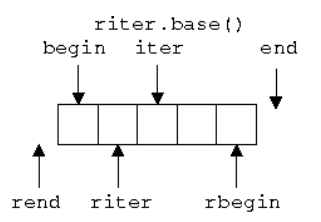

# 第十章：泛型算法

> **一句话定义**：本章是 C++ 泛型算法的工程速查手册——围绕 `<algorithm>` / `<numeric>` / `<execution>` 三大头文件，逐项对比 STL 经典算法（`std::find` / `std::sort` / `std::transform` / `std::accumulate` / `std::copy_if` / `std::unique` ...）与 C++20 `std::ranges::` 同名版本，配合迭代器五分类、`std::back_inserter` 家族、`std::istream_iterator` / `std::ostream_iterator` 流迭代器、`std::execution::seq/par/par_unseq/unseq` 并行策略、`std::bind` / `std::bind_front` (C++20) 与 Lambda 表达式七大说明符；并对 `views::filter/transform/take/drop/iota` 等 C++20/23 视图与 `std::ranges::to`（C++23）做端到端速查。

## 章节知识框架

```mermaid
graph TD
  c10_root["第十章 泛型算法全景"]
  c10_root --> c10_class["10.0 算法分类速查表"]
  c10_root --> c10_iter["10.1 迭代器分类"]
  c10_root --> c10_algo["10.2 STL 算法 ↔ ranges"]
  c10_root --> c10_special["10.3 特殊迭代器"]
  c10_root --> c10_sent["10.4 哨兵 Sentinel"]
  c10_root --> c10_exec["10.5 <execution> 并行策略"]
  c10_root --> c10_call["10.6 可调用对象与 bind"]
  c10_root --> c10_lambda["10.7 Lambda 表达式"]
  c10_root --> c10_ranges["10.8 ranges 视图管道"]

  c10_iter --> c10_input["Input / Output"]
  c10_iter --> c10_forward["Forward"]
  c10_iter --> c10_bid["Bidirectional"]
  c10_iter --> c10_ra["RandomAccess"]
  c10_iter --> c10_contig["Contiguous (C++17)"]

  c10_algo --> c10_nonmod["不修改 (find/count)"]
  c10_algo --> c10_mod["修改 (transform/copy_if)"]
  c10_algo --> c10_sort["排序 (sort/unique)"]
  c10_algo --> c10_num["数值 (accumulate/partial_sum)"]

  c10_special --> c10_ins["插入迭代器 back/front/inserter"]
  c10_special --> c10_stream["流迭代器 istream/ostream"]
  c10_special --> c10_rev["反向迭代器 rbegin/rend"]
  c10_special --> c10_move["移动迭代器 make_move_iterator"]

  c10_lambda --> c10_capture["捕获 [&/=]/this/init"]
  c10_lambda --> c10_spec["说明符 mutable/constexpr/consteval"]
  c10_lambda --> c10_idiom["惯用法 IIFE/Lifting/递归"]

  c10_ranges --> c10_proj["projection 投影"]
  c10_ranges --> c10_view["views::filter/transform"]
  c10_ranges --> c10_to["std::ranges::to (C++23)"]
```



## 10.0 算法分类速查表

> 一张大表统管 `<algorithm>` 与 `<numeric>`，后续小节按类展开；每条都给出 C++20 `std::ranges::` 等价。

| 类别 | 经典 STL | C++20 `std::ranges::` | 头文件 | 最低迭代器 | 一句话用途 |
|---|---|---|---|---|---|
| 非修改 · 查找 | `std::find` / `find_if` / `find_if_not` | `std::ranges::find` / `find_if` | `<algorithm>` | Input | 线性查找首个匹配 |
| 非修改 · 计数 | `std::count` / `count_if` | `std::ranges::count` / `count_if` | `<algorithm>` | Input | 计数匹配元素 |
| 非修改 · 距离 | `std::distance` | `std::ranges::distance` | `<iterator>` | Input | 两迭代器之间元素数 |
| 非修改 · 等价 | `std::equal` / `mismatch` | `std::ranges::equal` / `mismatch` | `<algorithm>` | Input | 区间相等/差异点 |
| 非修改 · 全/任 | `std::all_of` / `any_of` / `none_of` | `std::ranges::all_of` ... | `<algorithm>` | Input | 谓词归约判定 |
| 修改 · 写值 | `std::fill` / `fill_n` / `generate` | `std::ranges::fill` / `fill_n` | `<algorithm>` | Forward / Output | 覆盖式赋值 |
| 修改 · 拷贝 | `std::copy` / `copy_if` / `copy_n` / `move` | `std::ranges::copy` / `copy_if` / `move` | `<algorithm>` | Input → Output | 写入到目标区间 |
| 修改 · 变换 | `std::transform` | `std::ranges::transform` | `<algorithm>` | Input → Output | 一/二元映射 |
| 修改 · 替换 | `std::replace` / `replace_if` | `std::ranges::replace` | `<algorithm>` | Forward | 原地替换 |
| 修改 · 翻转/旋转 | `std::reverse` / `rotate` | `std::ranges::reverse` / `rotate` | `<algorithm>` | Bidir / Forward | 倒序 / 循环移位 |
| 修改 · 去重 | `std::unique` | `std::ranges::unique` | `<algorithm>` | Forward | 相邻去重（需先 sort） |
| 修改 · 删除 | `std::remove` / `remove_if` | `std::ranges::remove` / `remove_if` | `<algorithm>` | Forward | erase-remove idiom 头 |
| 划分 partition | `std::partition` / `stable_partition` | `std::ranges::partition` | `<algorithm>` | Forward / Bidir | 按谓词二分布置 |
| 排序 sort | `std::sort` / `stable_sort` / `partial_sort` / `nth_element` | `std::ranges::sort` / `stable_sort` ... | `<algorithm>` | RandomAccess | 整体或部分排序 |
| 排序辅助 | `std::is_sorted` / `is_permutation` | `std::ranges::is_sorted` / `is_permutation` | `<algorithm>` | Forward | 排序判定 / 等价排列 |
| 二分查找 | `std::binary_search` / `lower_bound` / `upper_bound` / `equal_range` | `std::ranges::binary_search` ... | `<algorithm>` | Forward | 有序区间二分 |
| 集合运算 | `std::merge` / `set_union` / `set_intersection` / `set_difference` | `std::ranges::merge` ... | `<algorithm>` | Input | 有序区间合并/差并 |
| 堆 heap | `std::make_heap` / `push_heap` / `pop_heap` / `sort_heap` | `std::ranges::make_heap` ... | `<algorithm>` | RandomAccess | 堆操作 |
| 极值 | `std::min` / `max` / `minmax` / `min_element` | `std::ranges::min` / `min_element` | `<algorithm>` | Forward | 单值/区间极值 |
| 字典序 | `std::lexicographical_compare` / `_three_way` (C++20) | `std::ranges::lexicographical_compare` | `<algorithm>` | Input | 序列字典序比较 |
| 数值 · 累加 | `std::accumulate` / `reduce` (C++17) | `std::ranges::fold_left` (C++23) | `<numeric>` | Input | 折叠求和；`reduce` 可并行 |
| 数值 · 内积 | `std::inner_product` / `transform_reduce` (C++17) | — | `<numeric>` | Input | `(a·b)` 与变换归约 |
| 数值 · 前缀和 | `std::partial_sum` / `inclusive_scan` / `exclusive_scan` (C++17) | — | `<numeric>` | Input → Output | 累计扫描；C++17 可并行 |
| 数值 · 差分 | `std::adjacent_difference` | — | `<numeric>` | Input → Output | 邻差 |
| 数值 · 序列 | `std::iota` | `std::views::iota` (惰性) | `<numeric>` / `<ranges>` | Forward | 等差序列填充 |

> **要点**：
> 1. **`std::ranges::*` 完整覆盖 `<algorithm>`；`<numeric>` 的折叠类在 C++23 才进入 `std::ranges::fold_*`。**
> 2. `std::ranges::*` 第一个参数从「`begin, end`」改为「容器/视图」，**返回 `std::ranges::dangling`** 以避免悬空迭代器（见 §10.8）。
> 3. `<execution>` 并行策略（C++17）只对 `<algorithm>` 与部分 `<numeric>` 重载生效，**不能与 `std::ranges::` 组合**（截至 C++23）。

godbolt（STL ↔ ranges 等价示例）：
<https://godbolt.org/?source=#g:!((g:!((g:!((h:codeEditor,i:(filename:'1',fontScale:14,fontUsePx:'0',j:1,lang:c%2B%2B,source:'%23include+%3Calgorithm%3E%0A%23include+%3Cranges%3E%0A%23include+%3Cvector%3E%0A%23include+%3Ciostream%3E%0Aint+main()%7B%0A++std::vector%3Cint%3E+v%7B5,2,4,1,3%7D%3B%0A++auto+it1+%3D+std::find(v.begin(),+v.end(),+3)%3B%0A++auto+it2+%3D+std::ranges::find(v,+3)%3B%0A++std::cout%3C%3C*it1%3C%3C!'+!'%3C%3C*it2%3C%3C!'%5Cn!'%3B%0A++std::ranges::sort(v)%3B%0A++for(int+x:v)+std::cout%3C%3Cx%3C%3C!'+!'%3B%0A%7D'),k:50,l:'4',n:'0',o:'',s:0,t:'0'),(g:!((h:compiler,i:(compiler:g142,filters:(),lang:c%2B%2B,libs:!(),options:'-std%3Dc%2B%2B20',source:1),l:'5',n:'0',o:'+x86-64+gcc+14.2+(C%2B%2B20)',t:'0')),k:50,l:'4',n:'0',o:'',s:0,t:'0')),l:'2',n:'0',o:'',t:'0'),version:4>

## 泛型算法

```c++
#include <vector>
#include <algorithm> //包含了基本的泛型算法
#include <numeric>	// 包含一些数值算法，比如accumulate用作累积
#include <ranges>	// C++20 新引入

int main() {
	std::vector<int> x(100);
    int x[100];// 也可以传入这个，传给sort int*
    // 把迭代器传给 sort 即可实现排序
	std::sort(std::begin(x), std::end(x));
    // 泛型体现在：std::sort 支持多种类型
}

// 迭代器 ：是一个模拟的指针，目的：模拟数组的相关操作：递增、解引用。因此用迭代器作为容器与算法间的桥梁
// 泛型算法通常来说都不复杂，但优化足够好

//一些泛型算法与方法同名，实现功能类似，此时建议调用方法而非算法
//	std::find V.S. std::map::find


////////////////////////////////////////
// 读算法
// accumulate
template<class InputIt, class T>
constexpr // since C++20
T accumulate(InputIt first, InputIt last, T init)
{
    for (; first != last; ++first)
        init = std::move(init) + *first; // std::move since C++20
 
    return init;
}
////////////////////////////////////////
// find
template< class InputIt, class T >
InputIt find( InputIt first, InputIt last, const T& value );
(until C++20)
////////////////////////////////////////
// count
template< class InputIt, class T >
typename iterator_traits<InputIt>::difference_type
    count( InputIt first, InputIt last, const T& value );
(until C++20)

////////////////////////////////////////
// 写算法
// fill
template< class ForwardIt, class T >
void fill( ForwardIt first, ForwardIt last, const T& value );
(until C++20)


// Possible implementation
template< class ForwardIt, class T >
void fill(ForwardIt first, ForwardIt last, const T& value)
{
    for (; first != last; ++first) {
        *first = value;
    }
}

// fill_n，给开头元素，个数，写入的值
template< class OutputIt, class Size, class T >
OutputIt fill_n( OutputIt first, Size count, const T& value );

// Possible implementation
template<class OutputIt, class Size, class T>
OutputIt fill_n(OutputIt first, Size count, const T& value)
{
    for (Size i = 0; i < count; i++) {
        *first++ = value;
    }
    return first;
}
////////////////////////////////////////
// transform
template< class InputIt, class OutputIt, class UnaryOperation >
// InputIt 区间用来读，OutputIt d_first 表示写入区间开头位置
// unary_op 一元操作符
OutputIt transform( InputIt first1, InputIt last1,
                    OutputIt d_first, UnaryOperation unary_op );
(until C++20)


First version
template<class InputIt, class OutputIt, class UnaryOperation>
OutputIt transform(InputIt first1, InputIt last1,
                   OutputIt d_first, UnaryOperation unary_op)
{
    while (first1 != last1)
        *d_first++ = unary_op(*first1++);// 先对区间解引用
    	// 获取到的值放入unary_op计算，同时把当前迭代器向下移动一位
    return d_first;
}

////////////////////////////////////////
// copy
template< class InputIt, class OutputIt >
OutputIt copy( InputIt first, InputIt last, OutputIt d_first );

////////////////////////////////////////
// fill_n
#include <vector>
#include <algorithm>

int main() {
    std::vector<int> x(10);
    std::fill_n(x.begin(), 100, 3);// 危险，内存访问越界
    
    // 有动态拓展的算法
}
////////////////////////////////////////
// sort
template< class RandomIt > // 传入的元素需要支持><判断
void sort( RandomIt first, RandomIt last );
////////////////////////////////////////
// unique
// 返回一个迭代器，迭代器指向做完unique之后所有无重复元素的下一个位置，通常，需要调用erase把后面的元素删除
#include <algorithm>
#include <iostream>
#include <vector>
 
int main()
{
    // a vector containing several duplicate elements
    std::vector<int> v{1, 2, 1, 1, 3, 3, 3, 4, 5, 4};
    auto print = [&] (int id)
    {
        std::cout << "@" << id << ": ";
        for (int i : v)
            std::cout << i << ' ';
        std::cout << '\n';
    };
    print(1);
 
    // remove consecutive (adjacent) duplicates
    auto last = std::unique(v.begin(), v.end());
    // v now holds {1 2 1 3 4 5 4 x x x}, where 'x' is indeterminate
    v.erase(last, v.end());
    print(2);
 
    // sort followed by unique, to remove all duplicates
    std::sort(v.begin(), v.end()); // {1 1 2 3 4 4 5}
    print(3);
 
    last = std::unique(v.begin(), v.end());
    // v now holds {1 2 3 4 5 x x}, where 'x' is indeterminate
    v.erase(last, v.end());
    print(4);
}

Output:

@1: 1 2 1 1 3 3 3 4 5 4 
@2: 1 2 1 3 4 5 4 	// 没有进行sort，因此只删除连续的相同元素
@3: 1 1 2 3 4 4 5 
@4: 1 2 3 4 5  
    
////////////////////////////////////////
// distance
template< class InputIt > // 接收输入迭代器
typename std::iterator_traits<InputIt>::difference_type distance( InputIt first, InputIt last );
(constexpr since C++17)
// implementation via tag dispatch, available in C++98 with constexpr removed
namespace detail {
 
template<class It>
constexpr // required since C++17
typename std::iterator_traits<It>::difference_type 
    do_distance(It first, It last, std::input_iterator_tag)// 根据迭代器类别不同引入重载
    // 输入迭代器重载
{
    typename std::iterator_traits<It>::difference_type result = 0;
    while (first != last) {
        // 对输入元素而言，求两个迭代器之间的距离，加到相等为止；返回加的次数
        ++first;
        ++result;
    }
    return result;
}
 
template<class It>
constexpr // required since C++17
typename std::iterator_traits<It>::difference_type 
    do_distance(It first, It last, std::random_access_iterator_tag)
    // 随机访问迭代器重载
{
    // 对于随机访问迭代器而言，之间相减即可；随机访问器支持的功能（两个迭代器相减）
    return last - first;
}
 
} // namespace detail
 
template<class It>
constexpr // since C++17
typename std::iterator_traits<It>::difference_type 
    distance(It first, It last)
{
    // 传给了do_distance
    return detail::do_distance(first, last,
                               typename std::iterator_traits<It>::iterator_category());// 获取迭代器类别
}
```

### 10.1 迭代器五分类速查

> 迭代器是「**容器与算法的桥梁**」——同一句 `std::sort(begin, end)` 之所以能作用在数组、`vector`、`deque` 上，正是依赖迭代器作为统一接口。把迭代器按其支持的操作分桶，是**让算法在编译期选择最优实现**的关键（tag dispatch，见上面 `distance` 的源码）。

| 类别 (Category) | tag 类型 | 支持操作 | 多次遍历 | 代表来源 | 典型算法限制 |
|---|---|---|---|---|---|
| Input | `std::input_iterator_tag` | `*it`(读)、`++it`、`==/!=` | 否 (single-pass) | `std::istream_iterator` | `find/count/accumulate` |
| Output | `std::output_iterator_tag` | `*it = v`、`++it` | 否 | `std::ostream_iterator`、`back_inserter` | `copy/fill_n` 写入端 |
| Forward | `std::forward_iterator_tag` | Input + 多次遍历 | 是 | `std::forward_list::iterator` | `replace/unique/remove` |
| Bidirectional | `std::bidirectional_iterator_tag` | Forward + `--it` | 是 | `std::list/map/set` | `reverse/inplace_merge` |
| RandomAccess | `std::random_access_iterator_tag` | Bidir + `it+n` / `it-it` / `<` / `[]` | 是 | `std::deque / vector` | `sort/nth_element/binary_search` |
| Contiguous (C++17) | `std::contiguous_iterator_tag` | RA + 「物理连续」语义 | 是 | `std::vector / array / span / basic_string` | 可作为 `T*` 用于 `memcpy/SIMD` |

C++20 概念（concepts）化等价：

| 旧 tag | C++20 concept | 在 `<iterator>` 中 |
|---|---|---|
| input | `std::input_iterator` | C++20 |
| output | `std::output_iterator<T>` | C++20 |
| forward | `std::forward_iterator` | C++20 |
| bidirectional | `std::bidirectional_iterator` | C++20 |
| random_access | `std::random_access_iterator` | C++20 |
| contiguous | `std::contiguous_iterator` | C++20 |

> **要点**：旧 tag 仍然存在并继续工作（库内部 tag dispatch 不被破坏）；C++20 新增 concepts 让算法约束更可读，且支持 `std::sized_sentinel_for / std::indirectly_writable` 等更细粒度协议。

godbolt（`iterator_traits::iterator_category` 编译期判别）：
<https://godbolt.org/?source=#g:!((g:!((g:!((h:codeEditor,i:(filename:'1',fontScale:14,fontUsePx:'0',j:1,lang:c%2B%2B,source:'%23include+%3Cvector%3E%0A%23include+%3Clist%3E%0A%23include+%3Cforward_list%3E%0A%23include+%3Citerator%3E%0A%23include+%3Ctype_traits%3E%0Aint+main()%7B%0A++using+v+%3D+std::vector%3Cint%3E::iterator%3B%0A++using+l+%3D+std::list%3Cint%3E::iterator%3B%0A++using+f+%3D+std::forward_list%3Cint%3E::iterator%3B%0A++static_assert(std::is_same_v%3Cstd::iterator_traits%3Cv%3E::iterator_category,std::random_access_iterator_tag%3E)%3B%0A++static_assert(std::is_same_v%3Cstd::iterator_traits%3Cl%3E::iterator_category,std::bidirectional_iterator_tag%3E)%3B%0A++static_assert(std::is_same_v%3Cstd::iterator_traits%3Cf%3E::iterator_category,std::forward_iterator_tag%3E)%3B%0A%7D'),k:50,l:'4',n:'0',o:'',s:0,t:'0'),(g:!((h:compiler,i:(compiler:g142,filters:(),lang:c%2B%2B,libs:!(),options:'-std%3Dc%2B%2B17',source:1),l:'5',n:'0',o:'+x86-64+gcc+14.2',t:'0')),k:50,l:'4',n:'0',o:'',s:0,t:'0')),l:'2',n:'0',o:'',t:'0'),version:4>

### 10.2 读 / 写 / 排序算法 STL ↔ ranges 对照

> 上一节代码块里的 `accumulate / find / count / fill / fill_n / transform / copy / sort / unique / distance` 是面试和工程里的高频面孔。下面按 STL 与 `std::ranges::` 两栏对照，并标明最低迭代器要求与典型坑。

| 经典 STL (C++98–17) | C++20 `std::ranges::` | 入口签名要点 | 最低迭代器 | 复杂度 | 典型坑 |
|---|---|---|---|---|---|
| `std::find(first, last, v)` | `std::ranges::find(R, v, proj)` | 范围 + 投影 | Input | O(N) | 没找到返回 `last`，先判 `it != last` 再解引用 |
| `std::find_if(first, last, p)` | `std::ranges::find_if(R, p, proj)` | 谓词 + 投影 | Input | O(N) | 谓词不要有副作用，否则不可重入 |
| `std::count_if(first, last, p)` | `std::ranges::count_if(R, p)` | 返回 `difference_type` | Input | O(N) | 大数据用 `int` 接住会溢出 |
| `std::accumulate(first, last, init [, op])` | C++23 `std::ranges::fold_left(R, init, op)` | `<numeric>`；C++20 起 `constexpr` | Input | O(N) | `init` 类型决定结果类型，`accumulate(v.begin(), v.end(), 0)` 对 `vector<double>` 仍然以 `int` 累加 |
| `std::fill(first, last, v)` | `std::ranges::fill(R, v)` | Forward；要求区间已存在 | Forward | O(N) | 不能写入容量外位置 |
| `std::fill_n(first, n, v)` | `std::ranges::fill_n(it, n, v)` | Output；可配合 `back_inserter` 实现“边写边长” | Output | O(N) | 直接给 `vector<int>(10)` 写 100 个值即上面注释中的越界 UB |
| `std::transform(in, in_end, out, op)` | `std::ranges::transform(R, out, op, proj)` | 一/二元映射 | Input → Output | O(N) | `out` 必须保证容量；二元版 `transform(in1, in1_end, in2, out, op)` |
| `std::copy(first, last, d_first)` | `std::ranges::copy(R, d_first)` | 直接写值 | Input → Output | O(N) | `d_first` 区间长度必须 ≥ N |
| `std::copy_if(first, last, d_first, p)` | `std::ranges::copy_if(R, d_first, p)` | 过滤拷贝 | Input → Output | O(N) | 与 `views::filter` 在 C++20 后语义重叠 |
| `std::sort(first, last [, comp])` | `std::ranges::sort(R, comp, proj)` | RandomAccess；不稳定 | RandomAccess | O(N log N) | `comp` 必须是严格弱序，否则 UB |
| `std::stable_sort` | `std::ranges::stable_sort` | 同上但稳定 | RandomAccess | O(N log² N) 最坏 | 内存预分配失败时退化 |
| `std::unique(first, last)` | `std::ranges::unique(R)` | 相邻去重 | Forward | O(N) | **不实际删除**，需 `erase` 收尾；先 `sort` |
| `std::distance(first, last)` | `std::ranges::distance(R)` | tag dispatch | Input | O(N) / O(1) | RA 上 O(1)，否则 O(N) |

代码块中 `accumulate / find / fill / fill_n / transform / copy / sort / unique / distance` 的 `(until C++20)` 注释标志着 **C++20 引入约束化签名**：`<algorithm>` 的旧版仍可用，新版多了 `std::indirectly_*` concept 约束，签名形如 `template<std::input_iterator I, std::sentinel_for<I> S, ...>`。

C++17 `std::sample / std::clamp / std::for_each_n` 与 `std::reduce / inclusive_scan / exclusive_scan / transform_reduce` 是 `<algorithm>` / `<numeric>` 的新成员：

| 算法 | 标准 | 用途 |
|---|---|---|
| `std::clamp(v, lo, hi)` | C++17 | 三参夹紧 |
| `std::sample(first, last, out, n, gen)` | C++17 | 无重复均匀采样 |
| `std::for_each_n(first, n, f)` | C++17 | 对前 n 个元素执行 f |
| `std::reduce(first, last, init, op)` | C++17 | `accumulate` 的并行版（要求 op 满足结合律/交换律） |
| `std::inclusive_scan` / `exclusive_scan` | C++17 | 前缀和的并行版 |
| `std::transform_reduce` | C++17 | 先 transform 再 reduce；可并行 |
| `std::ranges::fold_left/right` | C++23 | `accumulate` 的 ranges 版（无并行） |
| `std::ranges::starts_with / ends_with` | C++23 | 前缀/后缀判定 |
| `std::ranges::contains` | C++23 | 元素存在性 |

### 特殊的迭代器

1. ### 插入迭代器

   ```c++
   ////////////////////////////////////////
   // back_insert_iterator
   // 写算法一定要保证目标区间足够大，但有些时候没法保证，因此引入back_insert_iterator
   // std::back_insert_iterator<Container>::operator=
   // inserts an object into the associated container
   // 1.不支持insert, 向容器结尾来查找
   // 2.调用容器的push_back来插入
   #include <iostream>
   #include <iterator>
   #include <deque>
    
   int main()
   {
       std::deque<int> q;
       std::back_insert_iterator< std::deque<int> > it(q);
    
       for (int i=0; i<10; ++i)
           it = i; // calls q.push_back(i) 相当于调用这个
    
       for (auto& elem : q) std::cout << elem << ' ';
   }
   Output:
   	1 2 3 4 5 6 7 8 9 10
           
   int main() 
   {
      std::vector<int> x;
      // std::fill_n(x.begin(), 10 , 3);// 会报错，内存溢出
      // 利用 back_insert_iterator 插入的特性
      std::fill_n(std::back_insert_iterator<std::vector<int>>(x), 10 , 3);
           // 打印出 10 个 3
           // 用插入迭代器作为fill_n的第一个参数，在fill_n内部循环了10次，相当于调用了10次push_back
      // 为了方便调用，C++简化，可使用 back_inserter
      std::fill_n(std::back_inserter(x), 10 , 3);
      for (auto i : x)
      {
          std::cout << i << ' ';
      }
   }    
   ////////////////////////////////////////
   // front_insert_iterator    
   // 同上类似，调用 push_front 实现
   // 同样，有 front_inserter
   // 注意：想使用插入迭代器时，需要确保底层的容器支持相应的操作
   #include <list>
   int main() 
   {
      std::list<int> x;// 支持 push_front
       //  std::vector<int> x; 不行，因为不支持 push_front
      std::fill_n(std::front_inserter(x), 10 , 3);
      for (auto i : x)
      {
          std::cout << i << ' ';
      }
   }
   ////////////////////////////////////////
   // insert_iterator
   // 需要提供一个容器和这个容器的迭代器
   // 对它赋值时会调用容器的 insert
   template< class Container >
   class insert_iterator : public std::iterator< std::output_iterator_tag,
                                                 void,void,void,void >
                                                     
   // std::inserter      
   #include <algorithm>
   #include <iostream>
   #include <iterator>
   #include <vector>
   #include <set>
    
   int main()
   {
       std::multiset<int> s {1, 2, 3};
    
       // std::inserter is commonly used with multi-sets
       std::fill_n(std::inserter(s, s.end()), 5, 2);
    
       for (int n : s)
           std::cout << n << ' ';
       std::cout << '\n';
    
       std::vector<int> d {100, 200, 300};
       std::vector<int> v {1, 2, 3, 4, 5};
    
       // when inserting in a sequence container, insertion point advances
       // because each std::insert_iterator::operator= updates the target iterator
       std::copy(d.begin(), d.end(), std::inserter(v, std::next(v.begin())));
    
       for (int n : v)
           std::cout << n << ' ';
       std::cout << '\n';
   }
   Output:
       1 2 2 2 2 2 2 3 
       1 100 200 300 2 3 4 5
   ```

   插入迭代器三件套对比：

   | 迭代器 | 工厂函数 | 调用容器接口 | 底层要求 | 典型用途 |
   |---|---|---|---|---|
   | `std::back_insert_iterator<C>` | `std::back_inserter(c)` | `push_back` | `vector / deque / list / basic_string` | `fill_n / copy_if` 收尾 |
   | `std::front_insert_iterator<C>` | `std::front_inserter(c)` | `push_front` | `list / forward_list / deque` | 反向收集 |
   | `std::insert_iterator<C>` | `std::inserter(c, it)` | `insert(pos, v)` | 任意支持 `insert` 的容器（set/map/multiset/vector …） | 关联容器收尾、序列中段插入 |

   > **要点**：插入迭代器是 `OutputIterator`，对其赋值即调用底层 `push_back/push_front/insert`，因此写入端可以**无限增长**，是 `fill_n / copy / copy_if` 配合「未知大小目标」的标准做法。

2. ### 流迭代器 istream_iterator / ostream_iterator

   ```c++
   // istream_iterator 
   #include <algorithm>
   #include <iostream>
   #include <iterator>
   #include <vector>
   #include <list>
   #include <sstream>
   #include <numeric> // accumulate
   
   int main() 
   {
      std::istringstream str("1 2 3 4 5");
       // istream_iterator( istream_type& stream ); 构造
      std::istream_iterator<int> x(str);
      // 迭代器通常可用*解引用
      std::cout << *x << std::endl;// int tmp; str >> tmp
      std::cout << *x << std::endl;// int tmp; str >> tmp
      
      ++x;						  // str >> tmp
      std::cout << *x << std::endl;
   }
   
   int main() {
       std::istringstream str("1 2 3 4 5");
       std::istream_iterator<int> x(str);
       // 缺省构造 constexpr istream_iterator();
       std::istream_iterator<int> y{};// C++规定，缺省为流迭代器结尾位置
       // y() 是一个函数声明，y{}是类对象定义
       // std::istream_iterator<int> y; 也可以
       /*
       for (; x != y; ++x) {
           std::cout << *x << std::endl;
       }*/
       
       // 应用在一些算法上
       int res = std::accumulate(x, y, 0);
       std::cout << res << std::endl;// 输出 15
       // 用输入流迭代器标识了一个区间，区间为 1 2 3 4 5
   }
   
   
   //  ostream_iterator
   #include <algorithm>
   #include <numeric>
   
   int main() {
       std::ostream_iterator<char> oo {std::cout};
       std::ostream_iterator<int> i1 {std::cout, ", "};
       std::fill_n(i1, 5, -1);
       *oo++ = '\n';
       
       std::ostream_iterator<double> i2 {std::cout, "; "};
       *i2++ = 3.14;
       *i2++ = 2.71;
       *oo++ = '\n';
   }
   
   // Output:
   -1, -1, -1, -1, -1,
   3.14; 2.71;
   
   #include <iostream>
   #include <sstream>
   #include <iterator>
   #include <numeric>
   int main()
   {
       std::istringstream str("0.1 0.2 0.3 0.4");
       std::partial_sum(std::istream_iterator<double>(str),
                         std::istream_iterator<double>(),
                         std::ostream_iterator<double>(std::cout, " "));
   }
   ```

   流迭代器速查表：

   | 迭代器 | 模板形式 | 关键构造 | 终止位置 | 算法搭配 |
   |---|---|---|---|---|
   | `std::istream_iterator<T>` | `<T, char, std::char_traits<char>, std::ptrdiff_t>` | `istream_iterator<T>(stream)` | 缺省构造 `istream_iterator<T>{}` 表示「流结束」 | `accumulate / partial_sum / find` |
   | `std::ostream_iterator<T>` | `<T, char, std::char_traits<char>>` | `ostream_iterator<T>(stream)` 或 `ostream_iterator<T>(stream, ", ")` | 无（仅写） | `copy / fill_n / transform` 输出端 |
   | `std::istreambuf_iterator<CharT>` | `<CharT, Traits>` | 直接读底层 streambuf | 缺省构造 | 整段读取文件 |
   | `std::ostreambuf_iterator<CharT>` | 同上 | 直接写底层 streambuf | 无 | 不带格式化的二进制输出 |

   > **要点**：`istream_iterator` 是 InputIterator（单次遍历），且**第一次解引用之前**还没有真正 `>>` 过——这点常被误解；上面代码 `++x` 才把流位置往前推。

3. ### 反向迭代器

   

   ```c++
   #include <iostream>
   #include <vector>
   #include <iterator>
   #include <array>
   
   int main() {
       std::vector<int> x{1, 2, 3, 4, 5};
       std:;copy(x.begin(), x.end(), std::ostream_iterator<int>(std::cout, " "));
       // 反向迭代器
       std:;copy(x.rbegin(), x.rend(), std::ostream_iterator<int>(std::cout, " "));
       // x.rbegin() x.begin() 不能混用
   }
   ```

   反向迭代器换算表：

   | 反向位置 | `base()` 对应正向位置 | 解引用值 |
   |---|---|---|
   | `rbegin()` | `end()` | `*(end()-1)` 即最后一个元素 |
   | `rend()` | `begin()` | （越界占位，**不可解引用**） |
   | `rit` | `rit.base()` | `*std::prev(rit.base())` |

   > **要点**：`rit.base()` 与 `*rit` 错位一位——这是 erase/insert 与反向迭代器互转时最容易踩的坑（`v.erase((rit + 1).base())`）。

4. ### 移动迭代器  move_iterator

   ```c++
   #include <iostream>
   #include <iomanip>
   #include <algorithm>
   #include <vector>
   #include <iterator>
   #include <numeric>
   #include <string>
    
   int main()
   {
       std::vector<std::string> v{"this", "_", "is", "_", "an", "_", "example"};
    
       auto print_v = [&](auto const rem) {
           std::cout << rem;
           for (const auto& s : v)
               std::cout << std::quoted(s) << ' ';
           std::cout << '\n';
       };
    
       print_v("Old contents of the vector: ");
    
       std::string concat = std::accumulate(std::make_move_iterator(v.begin()),
                                            std::make_move_iterator(v.end()),
                                            std::string());
    
       // An alternative that uses std::move_iterator directly could be:
       // using moviter_t = std::move_iterator<std::vector<std::string>::iterator>;
       // std::string concat = std::accumulate(moviter_t(v.begin()),
       //                                      moviter_t(v.end()),
       //                                      std::string());
    
       // Starting from C++17, which introduced class template argument deduction,
       // the constructor of std::move_iterator can be used directly without
       // template parameters in most cases:
       // std::string concat = std::accumulate(std::move_iterator(v.begin()),
       //                                      std::move_iterator(v.end()),
       //                                      std::string());
    
       print_v("New contents of the vector: ");
    
       std::cout << "Concatenated as string: " << quoted(concat) << '\n';
   }
   
   // Output:
   Old contents of the vector: "this" "_" "is" "_" "an" "_" "example"
   New contents of the vector: "this" "_" "is" "_" "an" "_" "example"
   Concatenated as string: "this_is_an_example"
       
       
   ////////////////////////////////////////
   int main() {
       std::string x = "abc";
       auto y = x;
       std::cout << x << std::endl;
       auto z = std::move(x);
       std::cout << x << std::endl;// x 的值被移动给了 z，因此 x 空
   }
   ```

   特殊迭代器全家福：

   | 名称 | 工厂函数 / 类型 | 范畴 | 一句话用途 |
   |---|---|---|---|
   | `back_insert_iterator` | `std::back_inserter(c)` | Output | 边写边 `push_back` |
   | `front_insert_iterator` | `std::front_inserter(c)` | Output | 边写边 `push_front` |
   | `insert_iterator` | `std::inserter(c, it)` | Output | 在指定位置 `insert` |
   | `istream_iterator<T>` | 流构造 | Input | 把输入流当容器读 |
   | `ostream_iterator<T>` | 流 + 分隔符 | Output | 把输出流当容器写 |
   | `reverse_iterator` | `c.rbegin()` | 与原迭代器同范畴 | 倒序遍历 |
   | `move_iterator` | `std::make_move_iterator(it)` | 与原迭代器同范畴 | 解引用得右值，触发移动 |
   | `std::counted_iterator` (C++20) | `std::counted_iterator{it, n}` | Input/Forward... | 携带计数器的迭代器，与 `default_sentinel` 配对 |
   | `std::common_iterator` (C++20) | `views::common(R)` | Forward | 把 `(it, sentinel)` 转回「同类型 begin/end」以兼容旧算法 |

### 迭代器与哨兵（ Sentinel ）

要求：两个迭代器描述两个对象，其中一个迭代器不断变化后能变成另一个对象，在判等时能够相等；

哨兵：**标识区间结尾**

哨兵 vs 迭代器（C++20）：

| 概念 | 经典 STL | C++20 ranges |
|---|---|---|
| 区间表达 | `[first, last)`，两端必须同类型 | `[first, sentinel)`，类型可不同 |
| 终止判定 | `first != last` | `first != sentinel`（可以是 `default_sentinel_t`） |
| 类型约束 | `std::input_iterator` 等 tag | `std::sentinel_for<S, I>` concept |
| 典型例子 | `vector::iterator` 与同种 `vector::iterator` 比较 | `counted_iterator{it,n}` 与 `default_sentinel` 比较；`views::take_while` 内部用谓词哨兵 |
| 收益 | 一致简单 | **早停**、**类型擦除少**、可表达「找到为止」无界区间 |

godbolt（`counted_iterator` + `default_sentinel`）：
<https://godbolt.org/?source=#g:!((g:!((g:!((h:codeEditor,i:(filename:'1',fontScale:14,fontUsePx:'0',j:1,lang:c%2B%2B,source:'%23include+%3Citerator%3E%0A%23include+%3Cvector%3E%0A%23include+%3Cranges%3E%0A%23include+%3Ciostream%3E%0Aint+main()%7B%0A++std::vector%3Cint%3E+v%7B1,2,3,4,5,6%7D%3B%0A++std::counted_iterator+ci%7Bv.begin(),3%7D%3B%0A++for(auto+it+%3D+ci%3B+it+!!%3D+std::default_sentinel%3B+%2B%2Bit)%0A++++std::cout+%3C%3C+*it+%3C%3C+!'+!'%3B%0A%7D'),k:50,l:'4',n:'0',o:'',s:0,t:'0'),(g:!((h:compiler,i:(compiler:g142,filters:(),lang:c%2B%2B,libs:!(),options:'-std%3Dc%2B%2B20',source:1),l:'5',n:'0',o:'+x86-64+gcc+14.2+(C%2B%2B20)',t:'0')),k:50,l:'4',n:'0',o:'',s:0,t:'0')),l:'2',n:'0',o:'',t:'0'),version:4>

### [并发算法（ C++17 /  ）](https://en.cppreference.com/w/cpp/algorithm/execution_policy_tag)

1. ### 	std::execution::seq

   顺序执行

2. ### 	std::execution::par

   并发执行

3. ### 	std::execution::par_unseq

   并发（多线程）非顺序（SIMD）执行

   SIMD（单指令多数据）

4. ### 	std::execution::unseq 

   SIMD单线程执行
   
   一条指令处理多组数据，一般是硬件提供的支持

```c++
#include <iostream>
#include <vector>
#include <execution>
#include <random>
#include <ratio>
#include <chrono>

int main() {
    std::random_device rd;// 产生随机数
    
    std::vector<double> vals(10000000);
    for (auto& d : vals) {
        d = static_cast<double>(rd());
    }// 构造包含10000000个double型数据的数组，且随机排布
    
    for (int i = 0; i < 5; ++i)
    {
        using namespace std::chrono;
        std::vector<double> sorted(vals);// 复制到sorted数组中
        const auto startTime = high_resolution_clock::now();// 获取当前时间
        // std::sort(sorted.begin(), sorted.end());// 对 sorted 进行排序
        // 使用并行算法：std::execution::unseq
        std::sort(std::execution::unseq,sorted.begin(), sorted.end());// 对 sorted 进行排序
        // 尝试其他并行算法par,建立多线程
        std::sort(std::execution::par,sorted.begin(), sorted.end());\
        
        const auto endTime = high_resolution_clock::now();
        std::cout << "Latency: "
                  << duration_cast<duration<double, std::milli>>(endTime - startTime).count()// 计算 sort 计算时间
                  << std::endl;
    }
}
// 注意加速时，需要加入一些编译的链接和选项  -O3 -ltbb，不同编译环境不一样
```

`<execution>` 四种策略速查（**WG21 P0024 → C++17；C++20 起 `std::unseq` 也正式入标，由 P1001 引入**）：

| 策略 | 语义 | 多线程 | SIMD | 线程安全要求 | 何时用 |
|---|---|---|---|---|---|
| `std::execution::seq` | 顺序、单线程、单元素一次 | 否 | 否 | 无并发 | 与原算法等价；用于「显式声明不并行」 |
| `std::execution::par` | 多线程，可重排单元素之间顺序 | 是 | 否 | 谓词须线程安全（互不依赖、无数据竞争） | 大数据排序/扫描；I/O 友好工作负载 |
| `std::execution::par_unseq` | 多线程 + SIMD；允许同线程内交错（unsequenced） | 是 | 是 | 谓词须可重入、不可加锁（不可 `mutex.lock`） | 数值密集（向量内积、阈值过滤）+ CPU SIMD |
| `std::execution::unseq` (C++20) | 单线程 + SIMD/交错 | 否 | 是 | 谓词须可重入、不可加锁 | 单线程数据级并行；GPU 离线 prepass |

链接与平台：
- libstdc++ 需 `-ltbb`（Intel TBB），libc++ 自带；MSVC 在 `<execution>` 启用编译器自带并行库。
- **不能并行的算法**：所有依赖输入顺序的算法（`std::accumulate`、有副作用的 `for_each` 等）；改用 `std::reduce / transform_reduce / inclusive_scan` 等专门设计为可并行的 C++17 新成员。
- 并行版返回值与 `seq` 一致（除 `for_each` 在 C++17 起并行版返回 `void`）。

并行/顺序版返回值对照：

| 顺序版 | 并行版差异 |
|---|---|
| `std::for_each(...)` 返回 `UnaryFunction` | 并行版返回 `void` |
| `std::accumulate(...)` | 不接受 ExecutionPolicy（依赖顺序）；改 `std::reduce` |
| `std::transform(...)` | 并行版要求 op 「elemtwise」线程安全 |
| `std::sort(...)` | 并行版仍然 O(N log N)；不稳定 |
| `std::find_if(...)` | 并行版**仍然返回首个**满足谓词的迭代器（不是任意一个） |

godbolt（`std::reduce` 并行 + `<execution>`）：
<https://godbolt.org/?source=#g:!((g:!((g:!((h:codeEditor,i:(filename:'1',fontScale:14,fontUsePx:'0',j:1,lang:c%2B%2B,source:'%23include+%3Cexecution%3E%0A%23include+%3Cnumeric%3E%0A%23include+%3Cvector%3E%0A%23include+%3Ciostream%3E%0Aint+main()%7B%0A++std::vector%3Cint%3E+v(1000,1)%3B%0A++auto+s+%3D+std::reduce(std::execution::par,v.begin(),v.end(),0)%3B%0A++std::cout%3C%3Cs%3C%3C!'%5Cn!'%3B%0A%7D'),k:50,l:'4',n:'0',o:'',s:0,t:'0'),(g:!((h:compiler,i:(compiler:g142,filters:(),lang:c%2B%2B,libs:!(),options:'-std%3Dc%2B%2B17+-ltbb',source:1),l:'5',n:'0',o:'+x86-64+gcc+14.2+(-ltbb)',t:'0')),k:50,l:'4',n:'0',o:'',s:0,t:'0')),l:'2',n:'0',o:'',t:'0'),version:4>

## bind与lambda表达式

基于泛型算法引入

很多算法允许通过可调用对象自定义计算逻辑的细节
	transform / copy_if / sort…

```c++
// transform
template<class InputIt, class OutputIt, class UnaryOperation>
OutputIt transform(InputIt first1, InputIt last1,//获取元素
                   OutputIt d_first, UnaryOperation unary_op)
{
    while (first1 != last1)
        *d_first++ = unary_op(*first1++);//对每个元素调用unary_op，获取相应的结果
    // 因此可以通过定义不同的UnaryOperation来实现不同的功能
 
    return d_first;
}

// copy_if
template<class InputIt, class OutputIt, class UnaryPredicate>
OutputIt copy_if(InputIt first, InputIt last,
                 OutputIt d_first, UnaryPredicate pred)// 有一个谓词
{
    for (; first != last; ++first)
    {
        if (pred(*first)) // 输入一个元素，返回布尔值表示这个元素是真是假
        { // pred(*first) 语法形式很像函数，因此将pred称为可调用对象
            // 函数、函数指针--典型的可调用对象
            *d_first = *first; // 真则写入
            ++d_first;
        }
    }
 
    return d_first;
}
// sort
template< class RandomIt, class Compare >
constexpr void sort( RandomIt first, RandomIt last, Compare comp );
// 自定义Compare comp比较方法进行排序
```

### 可调用对象

```c++
#include <iostream>
#include <vector>
#include <functional>

// 函数指针，不能在函数内部定义函数
bool MyPredict(int val) {
    return val > 3;
}

int main() {
    std::vector<int> x{1, 2, 3, 4, 5, 6, 7, 8, 9, 10};
    std::vector<int> y;
    // copy_if 输入区间包含x的所有元素，输出的迭代器是back_inserter，每次往y里面push_back
    std::copy_if(x.begin(), x.end(), std::back_inserter(y), MyPredict);
    // MyPredict 是谓词,给定任意数据返回是真是假，只有返回真是y中才会写入
    // MyPredict 如上，即 > 3 时写入
    for (auto p : y) {
        std::cout << p << ' ';
    }
    std::cout << std::endl;
}
```

可调用对象（Callable）五大形式速查：

| 形式 | 例子 | 大小 | 何时用 |
|---|---|---|---|
| 函数指针 | `bool (*p)(int) = MyPredict;` | 1 指针 | C 接口；最简单；无捕获 |
| 函数对象 / 仿函数 | `struct F { bool operator()(int) const; };` | sizeof(成员) | 有内部状态；可被内联 |
| `std::function<R(Args...)>` | `std::function<bool(int)> f = MyPredict;` | 几十字节（含小对象优化 SBO） | 需要类型擦除、跨边界传递；性能略低 |
| Lambda 表达式 | `[](int v){return v>3;}` | 等价匿名类 | 局部、即用即抛；优先选择 |
| `std::bind` / `std::bind_front`(C++20) | `std::bind(f, _1, 3)` | 内部存绑定参数 | 部分应用；C++20 后多用 lambda |

> **要点**：C++ 标准库的所有算法都按值取 callable，所以**lambda 表达式 + auto 推导**是现代 C++ 默认选择；`std::function` 仅当需要**异质回调集合**或**跨 ABI**时才用。

### bind：通过绑定的方式修改可调用对象的调用方式

```C++
#include <iostream>
#include <algorithm>
#include <vector>
#include <functional> // bind

bool MyPredict2(int val1, int val2) {
    return val1 > val2;
}

int main() {
    std::vector<int> x{1, 2, 3, 4, 5, 6, 7, 8, 9, 10};
    std::vector<int> y;
    // 利用bind2nd
    std::copy_if(x.begin(), x.end(), std::back_inserter(y), std::bind2nd(std::greater<int>(), 3));
    // std::greater 接收两个参数，这里把bind2nd第二个参数固定成 3，因此只接收第一个参数。因此得到类似的结果
    //constexpr bool operator()(const T &lhs, const T &rhs) const {
    //return lhs > rhs; }
    
    // 利用bind1st
    std::copy_if(x.begin(), x.end(), std::back_inserter(y), std::bind2nd(std::greater<int>(), 3));
    // 此处会打印出比 3 小
    // 这是因为 bind1st 把第一个参数绑定成 3
    
    
    // bind1st使用场景有限
    std::copy_if(x.begin(), x.end(), std::back_inserter(y), std::bind2nd(MyPredict2, 3));
    // 无法完成绑定，即只有部分对象才可以使用bind1st和bind2nd
    
    for (auto p : y) {
        std::cout << p << ' ';
    }
    std::cout << std::endl;
}
////////////////////////////////////////
//bind
#include <iostream>
#include <algorithm>
#include <vector>
#include <functional> // bind
#include <memory> 

bool MyPredict2(int val1, int val2) {
    return val1 > val2;
}

int main() {
    using namespace std::placeholders; // 用bind需要这个名字空间
    
    std::vector<int> x{1, 2, 3, 4, 5, 6, 7, 8, 9, 10};
    std::vector<int> y;
    // bind
    std::copy_if(x.begin(), x.end(), std::back_inserter(y), std::bind(MyPredict2, _1, 3));
    
    for (auto p : y) {
        std::cout << p << ' ';
    }
    std::cout << std::endl;
}

bool MyAnd(bool val1, bool val2) {
    return val1 && val2;
}

void MyProc(int* ptr) {
    
}
// 使用智能指针
void MyProc2(std::shared_ptr<int> ptr) {
    
}

auto fun() {
    int x;
    return std::bind(MyProc, &x);
}

auto fun2() {
    std::shared_ptr<int> x(new int());// 在堆上分配一块内存
    return std::bind(MyProc2, x);
}

int main() {
    using namespace std::placeholders;
    
    auto x = std::bind(MyPredict2, _1, 3);
    x(50);// 会用50来调用MyPredict2，作为其第一个参数，_1
    // _1 定义在名字空间 std::placeholders
    std::cout << x(50);
    std::bind(MyPredict2, 3, _1)// 这里3对应val1，_1对应val2;
    // _1指的是传入的x(50)的第1个参数
        
    auto x = std::bind(MyPredict2, _2, 3);
    std::cout << x("hello", 50);//hello对应_1，50对应_2
    
    auto x = std::bind(MyPredict2, _2, _1);
    std::cout << x(3, 4);// 3 -> _1 -> val2; 4 -> _2 -> val1
    // 4 > 3 -> True
    
    // bind 组合 通过绑定的方式修改可调用对象的调用方式
    // 调用 std::bind 时，传入的参数会被复制，这可能会产生一些调用风险
    auto x1 = std::bind(MyPredict2, _1, 3);	 //  5 > 3
    //x1 要包含MyPredict2、3等信息，其中3是被复制进去的
    auto x2 = std::bind(MyPredict2, 10, _1); // 10 > 5
    auto x3 = std::bind(MyAnd, x1, x2);		// 1 && 1
    std::cout << x3(5);// x3的值会尝试传递给x1, x2
    
    auto x4 = std::bind(MyPredict2, _1, _1);
    std::cout << x4(2);
    
    // 返回可调用对象，是 bind 的构造的一个可调用对象，其内部包含了int* 指针，并指向了局部的对象；局部的指针会被复制到band的对象中
    auto ptr = fun();
    ptr();// 该行为即未定义，因为x地址是被复制进去的，但x已经不存在
    // 这种情况可以尝试使用智能指针,较为安全
    auto ptr = fun2();
    ptr();
}


void Proc(int& x) {
    ++x;
}
int main() {
    int x = 0;
    auto b = std::bind(Proc, x); // 构造 bind 时 x 会被拷贝给 b 这个对象的数据成员中，接下来再用 Proc 用的是拷贝的 x，即 b 内部的 x 被修改了
    // 而 x 不会被修改
    b();
    std::cout << x << std::endl;// 打印出0
    
    // 如果真的要修改这里的 x ，可以使用 std::ref 或 std::cref 避免复制的行为
    auto b = std::bind(Proc, std::ref(x));//std::ref会构成一个对象，并会被拷贝复制给b；但是这个对象内部会包含一个引用，引用这个x，因此在调用Proc时会修改x的值，即传引用
    auto b = std::bind(Proc, std::cref(x));//传常量引用也可以避免拷贝
    b();// 这里有点问题..报错
    std::cout << x << std::endl;// 打印出1
    
    
    // std::bind_front （ C++20 引入） 绑定第一个
    auto y = std::bind_front(MyPredict2, 3);
    std::cout << y(2);
}
// 用bind实现比较复杂的功能会很麻烦
```

`bind` API 演进对照：

| API | 标准 | 一句话用法 | 现代替代 |
|---|---|---|---|
| `std::bind1st(f, v)` | C++98（**C++17 弃用、C++20 移除**） | 把二元函数第一个参数绑定为 `v` | `std::bind` 或 lambda |
| `std::bind2nd(f, v)` | C++98（**C++17 弃用、C++20 移除**） | 把第二个参数绑定为 `v` | `std::bind` 或 lambda |
| `std::bind(f, args...)` | C++11 | 任意位置绑定 + 占位符 `_1.._N` | lambda（更易读，零开销） |
| `std::placeholders::_1.._N` | C++11 | 占位符；最多到 `_29` | 同上 |
| `std::ref(x)` / `std::cref(x)` | C++11 | 强制按引用传递 | 同上 |
| `std::bind_front(f, args...)` | C++20 | 仅绑定**前缀参数**，不支持占位符 | lambda |
| `std::bind_back(f, args...)` | C++23 | 仅绑定**末尾参数** | lambda |
| `std::not_fn(f)` | C++17（替代 C++98 `std::not1/not2`） | 取反谓词 | lambda |

> **要点**：除非维护遗留代码，否则**新代码应优先用 lambda**。`std::bind_front`/`std::bind_back` 是「轻量化的 bind」，编译期生成等价类，没有占位符语义包袱。

#### lambda 表达式，C++11开始

新引入的一套语法 《C++ Lambda Story》

**lambda 表达式会被编译器翻译成类进行处理**

```c++
#include <iostream>
#include <algorithm>
#include <vector>

// lambda 表达式的基本组成部分
int main() {
    auto x = [](int val) { return val > 3; }; // lambda表达式
    // 形参列表: ()
    // 函数体:   {}   其中每一条语句都要以 ; 结尾，并在括号外加 ; 
    // 函数体 描述了 x 赋值的具体的语句
    std::cout << x(5) << std::endl;
    
    auto x = [](int val)
    {
        return (val > 3) && (val  < 10);// 返回bool值
    };// 相比bind操作简单清晰
}
////////////////////////////////////////
// C++ insight
int main()
{
    // 定义了一个类
  class __lambda_4_14
  {
    public: // 定义了一个operator()(int val)
    inline /*constexpr */ bool operator()(int val) const
    {
      return (val > 3) && (val < 10);// return的逻辑
    }
    
    using retType_4_14 = bool (*)(int);
    inline constexpr operator retType_4_14 () const noexcept
    {
      return __invoke;
    };
    
    private: 
    static inline /*constexpr */ bool __invoke(int val)
    {
      return __lambda_4_14{}.operator()(val);
    }
    
    // 可见类复杂，lambda表达式简洁
  };
  
  __lambda_4_14 x = __lambda_4_14{};
  return 0;
}
////////////////////////////////////////
#include <iostream>
#include <algorithm>
#include <vector>
#include <memory>

int main() {
    auto x = [](int val)  -> float  // 指定返回类型
    {
        if (val > 3) {
            return 3.0; // 返回的数据类型需要相同，告诉编译器这是什么类型
        }
        else {
            return 1.5;
            // return 1.5f 会报错，因为3.0是double类型，1.5f是float，系统无法判断最后给x什么类型，可以显式得给x规定返回数据类型
        }
    };
    std::cout << x(5) << std::endl;
}

////////////////////////////////////////////
// 捕获

int main()
{
    int y = 10; // 局部自动对象
    // static int y = 10; //此时为局部静态对象，不需要/不能捕获它，直接[]即可，全局/静态对象都不用捕获
    auto x = [](int val)
    {
        return val > y; // 无法编译成功，lambda表达式内部不知道y
    };
    std::cout << x(5) << std::endl;
    ///////中括号是用来捕获的///////
    auto x = [y](int val)
    {
        return val > y; // 这样可以
    };
}
////////////////////////////////////////////

int main()
{
    int y = 10;
    auto x = [y] (int val) mutable  // 需要加一个mutable
    {
        ++y; // 不会传递到 lambda表达式外部
        // 原因是这里采用了y的值捕获，即y被赋值到lambda表达式内部
        // 对内部的'y'操作
        return val > y;
    };
    std::cout << x(5) << std::endl;
    std::cout << y << std::endl; // 打印出 10
}

// 引用捕获
int main()
{
    int y = 10;
    int z = 3;
    auto x = [&y,z] (int val) // 引用捕获,[]捕获列表，可以包含多种捕获，即混合捕获
    {
        ++y; // 内部的'y'是外部的y的别名
        return val > z;
    };
    std::cout << x(5) << std::endl;
    std::cout << y << std::endl; // 打印出 11
}

int main()
{
    int y = 10;
    int z = 3;
    auto x = [=] (int val) 
    // [=] 编译器会分析内部使用了哪些局部自动对象，且没有显式出现在[]捕获列表，值捕获会把这个局部自动对象捕获下来
    {
        return val > z;
    };
    std::cout << x(5) << std::endl;
}
// 注意看c++insight中的实现
int main()
{
    int y = 10;
    int z = 3;
    auto x = [&] (int val) 
    // [&] 内部使用了局部自动对象，没有显式出现在[]捕获列表，此时用引用的方式对其捕获
    {
        return val > z;
    };
    std::cout << x(5) << std::endl;
    
    /////// 
    auto x = [&, z] (int val) //通常采用引用捕获，但 z 是例外
    {
        ++y;
        return val > z;
    };
    
    auto x = [=, &y] (int val) //通常采用值捕获，但 y 是引用捕获
    {
        ++y;
        return val > z;
    };
}

//////////////////////////////////
#include <iostream>
#include <algorithm>
#include <vector>
#include <functional>
#include <memory>

// this 捕获
// 关键字 this：如果构造Str对象，对其调用fun()函数，this是一个指向Str的指针
struct Str
{
    auto fun()
    {
        int val = 3;	// 局部自动对象
        auto lam = [val,this] () //只有this才能捕获对象x，相当于传了指针
        {
            return val > x;
            // return val > __this->x; // -> 成员访问
        };
        return lam();
    }
    int x; // 不在fun()中定义，不是局部自动对象；同时不是静态/全局对象，无法直接对其捕获
};

int main()
{
    Str s;
    s.fun(); // this 对应的是 s 的地址
}


// 初始化捕获
int main()
{
    int x = 3;
    auto lam = [y = x](int val) // C++14中引入，初始化捕获，构造自动对象y，并将x值赋予y，y可在lambda表达式内部使用
    {
        return val > y;
    };
    std::cout << lam(100) << std::endl;
}
int main()
{
    std::string a = "hello";
    auto lam = [y = std::move(a)]()
    {
        std::cout << y << std::endl;
    };
    std::cout << a << std::endl;// a 里面没有值了，构造lambda表达式时就已经空了
    lam();
}
int main() 
{
    int x = 3;
    int y = 10;
    auto lam = [z = x + y](int val) // lambda表达式构造的时候执行了一次，仅保存z，不需要后续重复计算x+y
    {
        return val > z;
    };
    
    auto lam = [x = x](int val) // 构造对象x，此对象用于lambda表达式，并用x初始化
    {
        return val > x;
    }
}

//////////////////////////////////
// *this 捕获（ C++17 ）
struct Str
{
    auto fun()
    {
        int val = 3;
        auto lam = [val, this] ()
        auto lam = [val, *this] ()
            // *this是一个解引用，此时会把其指向的对象copy到lambda表达式中，此时会较安全，缺点是进行了一个复制，较耗费资源
        {
            return val > x;
        };
        return lam;
    }
    int x;
};

auto wrapper() // 返回的是lambda表达式
    // 捕获了局部自动对象 val；会用值的方式保存在lambda表达式内部
    // 还捕获了一个this，一个指向Str对象的指针，指向s，调用结束后s会被销毁，此时即为一个悬挂指针，其行为未定义
{
    Str s;
    return s.fun();
}

int main()
{
    auto lam = wrapper();
    lam();// this指向一个已被销毁的对象
}

```

Lambda 捕获形式速查（**C++11 → C++23**）：

| 捕获 | 语法 | 行为 | 引入版本 |
|---|---|---|---|
| 值捕获 | `[x]` | 把 `x` 拷贝到闭包内 | C++11 |
| 引用捕获 | `[&x]` | 闭包内 `x` 是外部 `x` 别名 | C++11 |
| 隐式值捕获 | `[=]` | 函数体里**用到的**所有局部自动对象按值捕获 | C++11（C++20 起 `[=, this]` 仍需显式写 `this`） |
| 隐式引用捕获 | `[&]` | 同上但按引用 | C++11 |
| 混合 | `[&, x]` / `[=, &y]` | 默认 + 例外 | C++11 |
| `this` 捕获 | `[this]` | 拷贝指针；访问成员 | C++11 |
| `*this` 拷贝捕获 | `[*this]` | 拷贝整个对象（避免悬空指针） | C++17 |
| 初始化捕获 | `[y = expr]` | 闭包成员 = `expr`；可移动捕获 | C++14 |
| 包捕获 | `[...args = std::move(pack)]` | 折叠 + 初始化捕获 | C++20 |
| 默认捕获 + 名字 | `[=, this]` | C++20 起 `[=]` 不再隐式捕获 `this`，需显式 | C++20 |

说明符

```c++
#include <iostream>
#include <algorithm>
#include <vector>
#include <functional>
#include <memory>
#include <string>

int main()
{
    int y = 3;
    // lam 表明类的对象，
    auto lam = [y](int val)
        // 调用()实现可调用运算时，不应该对对象内部的东西产生任何改变
    auto lam = [y](int val) mutable //加入说明符 mutable，此时const小事
        // 此时可以对类中的内容改变
    {
      ++y;// 与 const 矛盾
      return val > y;  
    };
    
    // C++ insight
    inline /*constexpr */ bool operator()(int val) const
    {
      return val > y;
    } 
}

// constexpr (C++17)
int main ()
{
    auto lam = [](int val) constexpr
        // 这个lambda可以在编译期进行调用
    {
      return val + 1;
    }; 
    
    constexpr int val = lam(100);
    std::cout << val << std::endl;
}

// consteval (C++20)
int main ()
{
    auto lam = [](int val) consteval
        // 这个lambda只能在编译期进行调用
    {
      return val + 1;
    }; 
    
    constexpr int val = lam(100);
    std::cout << val << std::endl;
}


// 模板形参 (C++20)
int main()
{
    auto lam = []<typename T>(T val) // 可以接收任意类型的数据
        // 编译器还是会主动优化，把输出在编译期确定了，如果要确保可以在运行期执行，就加 constexpr
    {
      return val + 1;  // 数据类型要支持 + 1 的操作
    };
    constexpr int val = lam(100);
    return val;
}

```

Lambda 说明符速查：

| 说明符 | 引入 | 一句话用法 | 默认是否启用 |
|---|---|---|---|
| `mutable` | C++11 | 允许在 `operator()` 内修改值捕获的成员 | 否（默认 `operator() const`） |
| `noexcept(expr)` | C++11 | 标记不抛异常 | 否 |
| `-> Ret` | C++11 | 显式返回类型；多 return 必备 | 否（默认从 return 推导） |
| `constexpr` | C++17 | 允许在编译期常量表达式中调用 | C++17 起隐式（满足条件就推出） |
| `consteval` | C++20 | 必须在编译期求值 | 否 |
| `static` | C++23 | `operator()` 为静态，节省一个 `this` | 否 |
| 模板形参 `[]<typename T>(T)` | C++20 | 显式模板参数（替代 `[](auto)`） | — |
| `requires` 从句 | C++20 | 用 concept 约束模板形参 | — |

lambda 表达式的深入应用

```c++
#include <iostream>
#include <functional>

// 捕获时计算
int main()
{
    int x = 3;
    int y = 5;
    auto lam = [z = x + y]()
    {
      return z;  
    };
    lam();
}

// 即调用函数表达式
// ( Immediately-Invoked Function Expression, IIFE )
int main()
{
    int x = 3;
    int y = 5;
    auto lam = [z = x + y]()
    {
      return z;  
    }(); // 构造完lambda表达式后马上调用
    
    const auto val = [z = x + y]() 
        // 常量需要在初始化就给它值
        // 即调用函数表达式把它初始化了，不需要额外定义函数
    {
      return z;  
    }();
    std::cout << val << std::endl;
}

// 使用 auto 避免复制（ C++14 ）
int main()
{
    auto lam = [](auto x)
    {
      return x + 1;  
    };
    // C++ insights
    template<class type_parameter_0_0> // 可以接收任何类型的参数
    inline /*constexpr */ auto operator()(type_parameter_0_0 x) const
}

#include <map>
int main()
{
    std::map<int, int> m{{2, 3}};
    auto lam = [](const std::pair<int, int>& p) // const & 避免复制；但还是会复制
        // 解引用之后类型如果不完全匹配，还是会引入复制
    auto lam = [](const std::pair<const int, int>& p) // 这样才没复制
        // 因为std::map的value_type是std::pair<const Key, T>
        // 使用 auto 避免因为类型不匹配导致的复制
    auto lam = [](const auto&p) // 使用 auto 避免复制（ C++14 ）
    {
      return p.first + p.second;
    };
    std::cout << lam(*m.begin()) << std::endl; 
}


// Lifting （ C++14 ）
auto fun(int val)
{
    return val + 1;
}

auto fun(double val) // 函数重载
{
    return val + 1;
}

int main()
{
    auto b = std::bind(fun, 3);// 报错，fun对应两个可调用对象，编译器无法区分
    std::cout << b() << std::endl;
    
    // Lifting （ C++14 ）
    auto lam = [](auto x)
    {
        return fun(x); // Lifting
    };
    std::cout << lam(3) << std::endl; 
    std::cout << lam(3.5) << std::endl;
    // 使用了函数模板，根据参数具体类型调用具体的函数
}

// 递归调用（ C++14 ）
int factorial(int n)
{
    return n > 1 ? n * factorial(n - 1) : 1;
}

int main()
{
    auto factorial_lam = [](int n)
    { // 初始化 factorial_lam 的类型，但是不定
        return n > 1 ? n * factorial_lam(n - 1) : 1;
        // 解析过程又遇到factorial_lam，类型不定，括号中的行为不定
        // 1.表达式合法不确定，2.返回类型不确定
    };
    auto x = 3; // 根据表达式信息解析 x 的类型
    std::cout << factorial(5) << std::endl;
}
// 修改
int main()
{
    auto factorial_lam = [](int n)
    {
        auto f_impl = [](int n, const auto& impl) -> int // 代表f_impl会返回一个int型整数，要递归的话一定要把返回类型显式的标出来
        {
            return n > 1 ? n * impl(n - 1, impl) : 1;
        };
        return f_impl(n, f_impl);
    };
    std::cout << factorial_lam(5) << std::endl;
}

template<>
inline /*constexpr */ int operator()<__lambda_8_23>(int n, const __lambda_8_23 & impl) const
{
	return n > 1 ? n * impl.operator()(n - 1, impl) : 1;
}

int main()
{
    auto factorial_lam = [](int n)
    {
        auto f_impl = [](int n, const auto& impl) // 没有显式指定返回类型，被C++解析成了auto
        {
            return n > 1 ? n * impl(n - 1, impl) : 1;
        };
        return f_impl(n, f_impl);//n传入，f_impl传入；编译器需要确定auto返回类型，根据里面的return语句自动推导返回类型；又是一个鸡生蛋蛋生鸡的问题，就无法解析
    };
}
// factorial_lam 是lambda表达式，被C++翻译成一个随机的类型，会翻译成一个类， 但是类的名称由C++随机确定，我们无权干涉；因此无法解析出factorial_lam的具体类型
// 但是要确定 operator() 的返回类型，我们有权确定
// 编译器解析 -> int 即能推断出 f_impl 的返回类型
// 递归内层的lambda表达式的返回类型需要显式表达出来

```

Lambda 惯用法表（业界高频）：

| 惯用法 | 模式 | 何时用 |
|---|---|---|
| IIFE (Immediately-Invoked Function Expression) | `auto val = []{ ...; return v; }();` | 复杂初始化、`const` 对象一次性求值 |
| 捕获时计算 | `[z = x + y]() { return z; }` | 避免每次调用都算一次 |
| `auto` 形参 | `[](auto x) { ... }` (C++14) | 泛型 lambda，等价模板化 `operator()` |
| Lifting | `[](auto&& x){ return fun(std::forward<decltype(x)>(x)); }` | 把重载函数族包装为单一 callable |
| Y-combinator 递归 | `auto f = [](int n, auto& self) -> int { return n<2?1:n*self(n-1,self); };` | 没有命名的递归 lambda |
| 自递归 (C++23) | `[](this auto& self, int n) { return n<2?1:n*self(n-1); }` | C++23 显式 `this` 形参，免去 Y-combinator |
| 重载 lambda | `overload{ [](int){...}, [](double){...} }` + deduction guide | 与 `std::variant + std::visit` 配合 |
| 偏应用 | `[](int v){ return MyPredict2(v, 3); }` | 替代 `std::bind(MyPredict2, _1, 3)` |
| 模板形参 | `[]<typename T>(T x){...}` (C++20) | 需要拿到形参类型 `T` 做 `decltype` |

godbolt（Lambda 七大形态汇总）：
<https://godbolt.org/?source=#g:!((g:!((g:!((h:codeEditor,i:(filename:'1',fontScale:14,fontUsePx:'0',j:1,lang:c%2B%2B,source:'%23include+%3Calgorithm%3E%0A%23include+%3Cvector%3E%0A%23include+%3Cnumeric%3E%0A%23include+%3Ciostream%3E%0Aint+main()%7B%0A++std::vector%3Cint%3E+v%7B1,2,3,4,5,6%7D%3B%0A++auto+gt3+%3D+%5B%5D(int+x)%7Breturn+x%3E3%3B%7D%3B%0A++auto+sum+%3D+std::accumulate(v.begin(),v.end(),0,%5B%5D(int+a,int+b)%7Breturn+a%2Bb%3B%7D)%3B%0A++auto+pow2+%3D+%5B%5D%3Ctypename+T%3E(T+x)%7Breturn+x*x%3B%7D%3B%0A++auto+iife+%3D+%5B%5D%7Breturn+42%3B%7D()%3B%0A++std::cout%3C%3Cstd::count_if(v.begin(),v.end(),gt3)%3C%3C!'+!'%3C%3Csum%3C%3C!'+!'%3C%3Cpow2(5)%3C%3C!'+!'%3C%3Ciife%3B%0A%7D'),k:50,l:'4',n:'0',o:'',s:0,t:'0'),(g:!((h:compiler,i:(compiler:g142,filters:(),lang:c%2B%2B,libs:!(),options:'-std%3Dc%2B%2B20',source:1),l:'5',n:'0',o:'+x86-64+gcc+14.2+(C%2B%2B20)',t:'0')),k:50,l:'4',n:'0',o:'',s:0,t:'0')),l:'2',n:'0',o:'',t:'0'),version:4>

3. 泛型算法的改进——ranges

```c++
#include <iostream>
#include <algorithm>
#include <vector>
#include <ranges>

int main()
{
    std::vector<int> x{1, 2, 3, 4, 5};
    auto it = std::find(x.begin(), x.end(), 3);
    std::cout << *it << std::endl;
}
// ranges
// 可以使用容器而不是迭代器输入
	// 通过 std::ranges::dangling 避免返回无效的迭代器
// 引入迭代器的目的：区分一个区间
 
// 引入映射概念，简化代码编写
// 引入 view ，灵活组织程序逻辑
	// 1.对输入不是立即计算，需要时再计算
	// 既是算法也是容器
	// 2.灵活组织程序逻辑
int main()
{
    std::vector<int> x{1, 2, 3, 4, 5};
    auto it = std::ranges::find(x, 3);
    std::cout << *it << std::endl;
}

//  通过 std::ranges::dangling 避免返回无效的迭代器
auto fun()
{
    return std::vector<int>{1, 2, 3, 4, 5};
}
int main()
{
    std::vector<int> x{1, 2, 3, 4, 5};
    auto it = std::ranges::find(fun(), 3); //有问题
    // fun()返回了一个局部自动对象，返回之后该对象被销毁
    std::cout << *it << std::endl;// *it 指向的右值对象已被销毁
}

// 引入映射概念，简化代码编写
#include <map>

int main()
{
    std::map<int, int> m{{2,3}};
    // find需要用lambda表达式查找
    // ranges 使用proj映射
    auto it = std::ranges::find(m,3, &std::pair<const int, int>::second);
    std::cout << it->first << ' ' << it->second << std::endl;
}
```

### 10.8 ranges 与 views 速查（C++20/23）

> `std::ranges`（**WG21 P0896**，Eric Niebler 主导）把「容器/区间/视图」抽象成 concept 体系；**算法 + 投影 + 视图管道**三件套，配合 `operator|` 让代码读起来像 Unix shell pipeline。

`std::ranges::*` 与 `std::*` 三大差异：

| 维度 | `std::*` (C++98–17) | `std::ranges::*` (C++20+) |
|---|---|---|
| 入参 | `(first, last)` 两个迭代器 | 一个 range（容器/视图/braced-init-list） |
| 投影 `proj` | 无 | 可选第 N 个参数，对元素先做投影再 callable |
| 返回值 | `Iter` | 「range + Iter」复合结构；rvalue range 返回 `std::ranges::dangling` 哨兵 |
| 约束 | 函数模板 + SFINAE | concept 约束（编译错误更可读） |
| 并行 | 可加 `<execution>` | 不可（截至 C++23） |

`<ranges>` 视图（views）速查（**惰性、零拷贝**）：

| 视图 | 标准 | 语义 | 链式举例 |
|---|---|---|---|
| `std::views::all(R)` | C++20 | 拿到 range 的 view 包装 | `v \| views::all` |
| `std::views::filter(pred)` | C++20 | 谓词过滤 | `v \| views::filter([](int x){return x%2==0;})` |
| `std::views::transform(f)` | C++20 | 元素变换 | `v \| views::transform([](int x){return x*x;})` |
| `std::views::take(n)` | C++20 | 取前 n 个 | `v \| views::take(3)` |
| `std::views::take_while(pred)` | C++20 | 取到谓词不真为止 | `v \| views::take_while([](int x){return x<10;})` |
| `std::views::drop(n)` | C++20 | 丢前 n 个 | `v \| views::drop(2)` |
| `std::views::drop_while(pred)` | C++20 | 丢到谓词不真为止 | — |
| `std::views::reverse` | C++20 | 倒序 | `v \| views::reverse` |
| `std::views::iota(start [,stop])` | C++20 | 等差/无限序列 | `views::iota(0, 10)` |
| `std::views::join` | C++20 | 拍平嵌套 range | `vv \| views::join` |
| `std::views::split(delim)` | C++20 / C++23 简化 | 按分隔符切片 | `s \| views::split(',')` |
| `std::views::elements<I>` | C++20 | 取 tuple/pair 的第 I 列 | `m \| views::elements<0>`（取 map 的 key） |
| `std::views::keys / values` | C++20 | `elements<0>` / `elements<1>` 别名 | `m \| views::values` |
| `std::views::zip` | C++23 | 同步遍历多 range | `views::zip(a, b)` |
| `std::views::zip_transform(f)` | C++23 | zip + transform | — |
| `std::views::adjacent<N>` | C++23 | 相邻 N 元滑窗 | `views::adjacent<2>(v)` |
| `std::views::chunk(n)` | C++23 | 等长分块 | — |
| `std::views::slide(n)` | C++23 | 长度 N 滑动窗口 | — |
| `std::views::stride(n)` | C++23 | 每隔 n 取 | — |
| `std::views::cartesian_product` | C++23 | 笛卡尔积 | — |
| `std::views::enumerate` | C++23 | `(index, value)` 配对 | — |
| `std::views::repeat(v [,n])` | C++23 | 重复 v | — |

`std::ranges::to<C>` 物化（C++23，**P1206**）：

```cpp
// C++23：把视图收集成具体容器
auto v = std::views::iota(1, 6)
       | std::views::transform([](int x){ return x*x; })
       | std::ranges::to<std::vector>();   // → vector<int>{1,4,9,16,25}

// C++20 等价但啰嗦：必须显式构造 + back_inserter
std::vector<int> v;
std::ranges::copy(std::views::iota(1, 6)
                | std::views::transform([](int x){ return x*x; }),
                  std::back_inserter(v));
```

`std::projected` / 投影 `proj` 使用模式：

```cpp
struct Person { std::string name; int age; };
std::vector<Person> ps{ {"Alice",30}, {"Bob",25}, {"Cara",28} };

// 经典 STL：自定义比较器
std::sort(ps.begin(), ps.end(),
          [](const auto& a, const auto& b){ return a.age < b.age; });

// ranges：投影 + 默认 less
std::ranges::sort(ps, std::less{}, &Person::age);     // proj = &Person::age

// ranges + 投影 + find
auto it = std::ranges::find(ps, 25, &Person::age);    // 按 age=25 找
```

`std::ranges::dangling` 速查：

| 调用 | 返回类型 | 说明 |
|---|---|---|
| `std::ranges::find(lvalue_v, x)` | `iterator_t<V>` | 正常迭代器 |
| `std::ranges::find(rvalue_v(), x)` | `std::ranges::dangling` | 编译期返回占位类型，**强制使用者立刻分清生命周期** |
| `std::ranges::find(views::all(v), x)` | `iterator_t<V>` | 通过显式 `views::all` 表态「视图借用」 |

godbolt（管道：`iota | filter | transform | take`，C++20）：
<https://godbolt.org/?source=#g:!((g:!((g:!((h:codeEditor,i:(filename:'1',fontScale:14,fontUsePx:'0',j:1,lang:c%2B%2B,source:'%23include+%3Cranges%3E%0A%23include+%3Cvector%3E%0A%23include+%3Ciostream%3E%0Aint+main()%7B%0A++auto+v+%3D+std::views::iota(1,20)%0A++++++++++%7C+std::views::filter(%5B%5D(int+x)%7Breturn+x%252%3D%3D0%3B%7D)%0A++++++++++%7C+std::views::transform(%5B%5D(int+x)%7Breturn+x*x%3B%7D)%0A++++++++++%7C+std::views::take(4)%3B%0A++for(int+x:v)+std::cout%3C%3Cx%3C%3C!'+!'%3B%0A%7D'),k:50,l:'4',n:'0',o:'',s:0,t:'0'),(g:!((h:compiler,i:(compiler:g142,filters:(),lang:c%2B%2B,libs:!(),options:'-std%3Dc%2B%2B20',source:1),l:'5',n:'0',o:'+x86-64+gcc+14.2+(C%2B%2B20)',t:'0')),k:50,l:'4',n:'0',o:'',s:0,t:'0')),l:'2',n:'0',o:'',t:'0'),version:4>

## 10.9 现代 C++ 补丁（C++17/20/23）

| 标准 | 特性 | 与本章接口 | 一句话用法 |
|---|---|---|---|
| C++17 | **`<execution>` 并行策略** | `seq/par/par_unseq` | 给算法加并行/向量执行；需 `-ltbb` |
| C++17 | **`std::reduce` / `inclusive_scan` / `exclusive_scan`** | `<numeric>` | `accumulate / partial_sum` 的可并行版本 |
| C++17 | **`std::sample / clamp / for_each_n`** | `<algorithm>` | 采样 / 夹紧 / 前 n 个 |
| C++17 | **`std::not_fn(f)`** | `<functional>` | 取代 C++98 `std::not1/not2` |
| C++17 | **CTAD** | `std::move_iterator(it)` | 不再需要 `std::make_move_iterator<It>(it)` |
| C++17 | **lambda `constexpr`** | 默认隐式 | 可在常量表达式中调用 |
| C++17 | **`*this` 捕获** | `[*this]` | 安全拷贝整个对象，规避悬空指针 |
| C++20 | **`std::ranges::*` 算法** | `find / sort / transform / copy_if ...` | 一站式范围算法 + 投影 |
| C++20 | **`std::views::filter / transform / take / drop / iota / join / split / reverse / elements`** | `<ranges>` | 惰性视图管道 |
| C++20 | **`std::bind_front(f, args...)`** | `<functional>` | 轻量化 bind；不带占位符 |
| C++20 | **`std::execution::unseq`** | `<execution>` | 单线程 SIMD 策略 |
| C++20 | **`std::counted_iterator` / `default_sentinel`** | `<iterator>` | 计数迭代器 + 哨兵 |
| C++20 | **`std::projected<I,Proj>`** | `<iterator>` | concept 化的投影类型 |
| C++20 | **lambda 模板形参** | `[]<typename T>(T x){...}` | 显式模板形参 |
| C++20 | **lambda 包捕获** | `[...args = std::move(pack)]` | 折叠 + 初始化捕获 |
| C++20 | **`[=]` 不再隐式捕获 `this`** | `[=, this]` | 显式 |
| C++23 | **`std::views::zip / chunk / slide / stride / cartesian_product / adjacent / enumerate / repeat`** | `<ranges>` | 多 range 协同视图 |
| C++23 | **`std::ranges::to<C>`** | `<ranges>` | 把视图物化成具体容器 |
| C++23 | **`std::ranges::fold_left/right`** | `<algorithm>` | `accumulate` 的 ranges 版 |
| C++23 | **`std::ranges::starts_with / ends_with / contains`** | `<algorithm>` | 前/后缀与存在性 |
| C++23 | **`std::bind_back(f, args...)`** | `<functional>` | 绑定末尾参数 |
| C++23 | **lambda 显式 `this` 形参** | `[](this auto& self, int n){...}` | 自递归无 Y-combinator |
| C++23 | **`static operator()`** | `[]() static { ... }` | 闭包 `operator()` 静态化 |

## 10.10 易错点 / 工程师避坑指南

1. **`std::find` 没找到返回 `last` 而非 `nullptr`**：使用前必须 `if (it != v.end())` 判一下，否则解引用 UB。`std::ranges::find` 同理。
2. **`std::fill_n / std::copy / std::transform` 写入端必须有容量**：原文示例 `std::fill_n(x.begin(), 100, 3);` 在 `vector<int>(10)` 上属于内存越界 UB；解法是 `std::fill_n(std::back_inserter(x), 100, 3);` 让其动态扩容。
3. **`std::unique` 不删除元素**：返回的是新逻辑末尾迭代器，必须配合 `v.erase(last, v.end())` 才物理紧缩；并且要求**先排序**或仅去除「相邻」重复。
4. **`std::accumulate` 累加类型由 init 决定**：`std::accumulate(v.begin(), v.end(), 0)` 在 `vector<double>` 上仍以 `int` 累加，导致截断；要么写 `0.0`，要么显式模板参数。
5. **`std::accumulate` 不可并行**：因为它要求严格顺序；要并行用 `std::reduce`（要求 op 满足结合律 + 交换律）。
6. **`std::sort` 的比较器必须是严格弱序**：`a < b && b < a` 不允许同时为 true、`!(a<a)` 必须为 true；不满足将破坏排序不变量，行为 UB。
7. **`std::sort` 不稳定**：相等元素相对顺序可能改变；需要稳定用 `std::stable_sort`。
8. **`std::sort` 要求 RandomAccess**：不能直接对 `std::list / forward_list` 用；`list` 自带 `list::sort`，`forward_list` 也是。
9. **`std::reverse` 对 forward_list 不可用**：要求 Bidirectional；`forward_list` 自带 `reverse()` 成员。
10. **`std::bind1st / std::bind2nd` 在 C++17 弃用、C++20 移除**：新代码请用 lambda 或 `std::bind_front / std::bind_back`。
11. **`std::bind` 默认按值拷贝参数**：原文 `auto b = std::bind(Proc, x);` 中 `x` 被复制，`b()` 不影响外部 `x`；改 `std::ref(x)` 才传引用。
12. **`std::bind` 占位符 `_1` 在 `std::placeholders` 命名空间**：忘记 `using namespace std::placeholders;` 编译报错。
13. **`std::bind` 返回的 callable 拷贝时也会拷贝绑定参数**：链式 `bind(bind(...), ...)` 性能差且类型不可读，**改用 lambda**。
14. **`std::bind(MyProc, &x)` 把局部地址绑入返回值**：返回后 `x` 析构，`ptr()` 调用即 UB；应改用 `std::shared_ptr` 或 lambda 按值捕获副本。
15. **lambda 默认 `operator() const`**：值捕获的成员不能在函数体内修改；要修改必须加 `mutable` 说明符。
16. **`[=]` 在 C++20 起不再隐式捕获 `this`**：写成员函数里的 lambda 用到 `this` 必须显式 `[=, this]` 或 `[*this]`，否则 deprecated 警告 / 编译错。
17. **`[this]` 捕获带来悬空风险**：闭包返回到外部后，原对象可能析构；改用 `[*this]`（C++17）以拷贝整个对象。
18. **lambda 引用捕获返回到外部**：`return [&x](){...};` 中 `x` 是局部变量，返回即悬空；要么按值捕获，要么改用 `std::move` 初始化捕获。
19. **`auto` 返回类型推导冲突**：原文示例返回 `3.0`（double）与 `1.5`（系统无法判断）冲突；解法是 `-> float` 显式标返回类型。
20. **递归 lambda 必须显式返回类型**：因为推导内层 `auto` 时已经在内部使用 `factorial_lam`，鸡生蛋问题；解法是 `auto f_impl = [](int n, const auto& impl) -> int {...}` 或 C++23 显式 `this` 形参。
21. **范围 for + lambda 引用捕获跨循环迭代**：`for (auto& e : v) { tasks.push_back([&e]{...}); }` 所有任务都引用同一 `e`；改为初始化捕获 `[e = e]`。
22. **`back_inserter / front_inserter / inserter` 要求底层支持对应操作**：`vector` 没有 `push_front`，给 `front_inserter` 编译失败；插入关联容器（set/map）必须用 `inserter(c, c.end())`。
23. **`istream_iterator` 第一次解引用之前未真正读入**：从 stream 构造时尚未 `>>` 一次；首次解引用才触发读取；连续两次 `*it` 不会前进。
24. **`ostream_iterator` 没有分隔符则不打印空格**：`std::ostream_iterator<int> i1(std::cout, ", ")` 才有 `, `；忘记会粘连。
25. **`reverse_iterator` 与正向迭代器**：`x.rbegin() x.begin() 不能混用`；它们类型不同、且 `rit.base()` 错位一位。
26. **`std::execution::par` 要求谓词线程安全**：lambda 内捕获共享 `mutex / 共享计数器`时必须自己加锁；竞态条件不会被运行库自动检测。
27. **`std::execution::par_unseq` / `unseq` 禁止加锁**：因为允许同线程内交错执行；在谓词里 `mutex.lock()` 即 UB（**P0024 明文要求**）。
28. **`std::find_if` 并行版仍然返回首个**：即便多线程扫描，返回值是逻辑顺序上第一个满足谓词的元素，不是最先「物理上找到」的那个。
29. **`std::ranges::find(temporary, x)` 返回 `std::ranges::dangling`**：编译期就拦截了「在右值上找东西并返回迭代器」的悬空错误；想用必须 `auto&& r = make_v(); std::ranges::find(r, x);`。
30. **`std::views::filter` 不是 `const`-correct**：内部缓存「下一个满足」的迭代器；多个线程同时遍历同一视图是 UB；需要每线程构造一份新视图。
31. **`std::views::join` 嵌套右值会悬空**：内层 range 必须是引用语义（`views::all`）或持久容器；临时容器拍平即 UB。
32. **`views::filter` 不是 `bidirectional_range`**：哪怕底层是 `vector`，套上 `filter` 后只是 `forward_range`；`ranges::sort` 在它上面用不了。
33. **`std::ranges::to<std::vector>()` 仅 C++23**：在 C++20 必须用 `std::vector<T>(r.begin(), r.end())` 或 `ranges::copy` + `back_inserter`。

参考文献：

- cppreference: [`<algorithm>`](https://en.cppreference.com/w/cpp/header/algorithm) / [`<numeric>`](https://en.cppreference.com/w/cpp/header/numeric) / [`<execution>`](https://en.cppreference.com/w/cpp/header/execution) / [`<ranges>`](https://en.cppreference.com/w/cpp/header/ranges)
- WG21 papers: P0024 (Parallelism TS → C++17)、P0896 (Ranges TS → C++20，Eric Niebler)、P1001 (`std::unseq` → C++20)、P1206 (`std::ranges::to` → C++23)、P2502 (`std::ranges::fold_left/right` → C++23)、P2387 (Pipe support for user-defined range adaptors → C++23)。
- 标准库实现：libstdc++ (gcc) / libc++ (clang) / MSVC STL 三家都已完整支持 `<ranges>`（gcc 10+、clang 15+、MSVC 19.30+）；`<execution>` 需链接 TBB（libstdc++）。

## 相关模块

- [相关模块: → drawio/03.containers-iterators.svg](../drawio/03.containers-iterators.svg)
- [相关模块: → drawio/07.modern-toolchain.svg](../drawio/07.modern-toolchain.svg)
