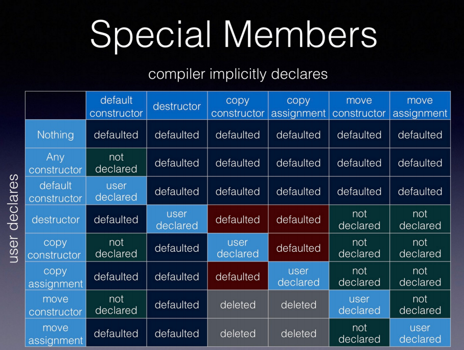

# 11.第十一章：类

## 1.结构体与对象聚合

### 结构体

```c++
#include <iostream>

/* 
结构体：对基本数据结构进行扩展，将多个对象放置在一起视为一个整体
– 结构体的声明与定义（注意定义后面要跟分号来表示结束）
– 仅有声明的结构体是不完全类型（ incomplete type ）
– 结构体（以及类）的一处定义原则：翻译单元级别 
*/

struct Str1; // 声明
// 需要让编译器知道该给多少内存

struct Str
{
    int x; // 其实只是声明
    int y;
}; // 必须要分号结束

int main()
{
    Str m_str; // 隐式定义了 x 和 y
    m_str.x=3;
    std::cout << m_str.x << std::endl;
}
// typedef
typedef struct Str
{
    int x;
    int y;
} Mstr; // 别名，C语言
// 如果没有分号，不知道是typedef还是定义结构体，不完整

int main()
{
    Mstr m_str; 
    Str1 m_str1;// 不行，不完全类型，不知道给多少内存
    Str1* m_str1;//可以，指针大小已知
    
}

//////////////////////////////////////////////////////
```

### 数据成员（数据域）的声明与初始化

```c++
/*
（ C++11 ）数据成员可以使用 decltype 来声明其类型，但不能使用 auto
	数据成员声明时可以引入 const 、引用等限定
	数据成员会在构造类对象时定义
	（ C++11 ）类内成员初始化
	聚合初始化：从初始化列表到指派初始化器
*/
struct Str
{
    decltype(3) x;
    // auto x 不行
    int y;
}

int main()
{
    Str m_str{3, 4};// 聚合初始化
    // 如果结构体中定义的元素顺序改变，赋值情况也改变，不建议
    
    // 指派初始化器
    Str m_str{.x = 3, .y = 4};
}
```

### mutable 限定符

```c++
struct Str
{
    int x = 0;
    int y = 1;
}
struct Str1
{
    mutable int x = 0;
    int y = 1;
}

int main()
{
    const Str m_str; // 常量结构体，不可更改
    // 希望改变常量对象中的某些元素
    const Str1 m_str1; //  mutable
    m_str1.x = 3; // 可赋值
}


```

### 静态数据成员——多个对象之间共享的数据成员

```c++
#include<iostream>

struct Str
{
    static int x; // 声明
    // 静态数据成员被所有对象所共享
    int y = 1;
};

// C++98 ：类外定义， const 静态成员的类内初始化
int Str::x; // 此处不需要再写static
// 注意链接

int main()
{
    Str m_str1;
    Str m_str2;
    m_str1.x = 100;
    std::cout << m_str2.x << std::endl;
    // 此时打出来是 100
}

//////////////////////////////////////////////////////
// const 静态成员的初始化
struct Str
{
    // const static int array_Size; // 需要保证array_Size为编译期常量
    // 不完全类型，没有给值
    // 所以必须类内给出定义
    const static int array_Size = 100; // 编译期常量
    int buffer[array_Size]; // 编译器直接替换成 100
};

int main()
{
    Str m_str1;
    m_str1;
    
    std::cout << &(m_str1.array_Size) << std::endl;
    // 错误，因为编译期直接把值替换了，所以没有这块内存
    // 没有构造出 array_Size 这块内存与其关联
    // 此时需要类外给出定义
}

// 类外定义，有定义编译器才会给相应的内存分配
const int Str::array_Size;
//////////////////////////////////////////////////////
// C++17 ：内联静态成员的初始化
struct Str
{
    inline static int array_Size = 100;
    int buffer[array_Size]; 
    inline static int test = 10; // 可以修改，不用 const
};

int main()
{
    Str m_str1;
    m_str1;
    m_str1.test = 50;
    std::cout << &(m_str1.array_Size) << std::endl;
    std::cout << (m_str1.test) << std::endl; // 输出50
}
//////////////////////////////////////////////////////
// 可以使用 auto 推导类型
struct Str
{
    // 静态数据成员可以使用 auto
    inline static auto array_Size = 100;
    // 一般数据成员可以使用decltype来声明，不能用auto
};
//////////////////////////////////////////////////////
// 静态数据成员的访问
// “.” 与“ ->” 操作符
// “::” 操作符

int main()
{
    Str m_str1;
    m_str1.array_Size = 50;
    Str* ptr = &m_str1;
    
    std::cout << m_str1.array_Size << std::endl;
    std::cout << ptr -> array_Size << std::endl;
    // 对共享数据成员
    std::cout << Str::array_Size << std::endl;
}
//////////////////////////////////////////////////////
// 在类的内部声明相同类型的静态数据成员

    // 解析时需要分析 Str 内部需要占多少内存
    Str x;  // 不知道占多少内存，因此不能包含自己
    
    // 但是这个可以
    static Str x;// 它被所有Str共享，意味着它不属于某一个对象
    // 它不存在谁包含谁的关系
    // 编译器在计算Str大小时，不会包含静态数据成员
    
    // 编译认为此句会产生一个x的定义，
    // 因此需要对Str这个类型有一个全面的了解
    inline static Str x;// 不行，不完全类型
};

int main()
{
    Str m_str1;
    Str m_str2;
    
    std::cout << &(m_str1.x) << std::endl;// 链接出错
}
//////////////////////////////////////////////////////
// 新的头文件内
struct Str
{
    static Str x;
};

// 此时不能把inline去掉，链接时会被多次定义
inline Str Str::x;
```


## 2.成员函数（方法） 

```c++
#include <iostream>

struct Str
{
    int x;
    void fun() // 把函数放入结构体，不需要传入 Str obj
    {
        std::cout << x << std::endl;
    }
};

void fun(Str obj)
{
    std::cout << obj.x << std::endl;
}

int main()
{
    Str m_str;
    // fun(m_str);
    m_str.fun();
}
//////////////////////////////////////////////////////
// 成员函数（方法）：对内操作数据成员，对外提供调用接口
// 类可视为一种抽象数据类型，通过相应的接口（成员函数）进行交互

int x = 5
// 类本身形成域，称为类域
class Str
{
public:
    int x;
    // inline static int x = 3; 
    
    // 类内定义（隐式内联）
    void fun()  
    {
        std::cout << x << std::endl;
    }
};

int main()
{
    Str m_str;
    // 类内定义（隐式内联）, 避免重复定义
    m_str.fun();
}

// 类内声明 + 类外定义
class Str
{
public:
    int x;
    void fun();// 希望更简洁，但需要注意类外定义时手动内联 inline
};
// void Str::fun() // 另一个cpp文件内, 但此时不是内联
inline void Str::fun() // 主动添加内联
{
    std::cout << x << std::endl;
}
// 提供接口，将函数定义单独放到一个cpp文件中，给用户只有.h，将cpp编译成一个链接库，提供用户使用。

//////////////////////////////////////////////////////
// 类与编译期的两遍处理
struct Str
{
    // 类更关注函数的接口，通常把重要的东西放到前面
    // 因此有编译期的两遍处理，先不处理函数内部，处理完整个类后再对函数内部处理
    void fun()
    {
        std::cout << x << std::endl;
        // 第一遍 x 其实还没定义（从上往下），第二遍才被处理
    }
    int x;
};
// 不能用类的两遍处理的情况
struct Str{
    using MyRes = int;
    MyRes fun()
    {
        return x;
    }
    int x;
};
// 错误
struct Str{
    MyRes fun() // 从上到下处理，不知道返回的MyRes是什么类型
    {
        return x;
    }
    using MyRes = int;
    int x;
};
//////////////////////////////////////////////////////
// 成员函数与尾随返回类型（ trail returning type ）
struct Str{
    using MyRes = int;
    MyRes fun();
    int x;
};

// MyRes Str::fun() // 编译器不认识 MyRes
Str::MyRes Str::fun() // 有点麻烦
// trail returning type 简化代码
auto Str::fun() -> MyRes // 尝试从Str域中找相关类型，C++11
{
    return x;
}
//////////////////////////////////////////////////////
// 使用 this 指针引用当前对象
struct Str
{
    void fun() // Str* this 实际上是该函数的第一个参数传入
    {
        //std::cout << x << std::endl; // this -> x 访问的是同一块内存
        std::cout << this << std::endl;
    }
    int x;
};
int main()
{
    Str m_str1;
    m_str1.x = 3;
    std::cout << &(m_str1) << std::endl;
    m_str1.fun(); // fun(&m_str1)
    
    Str m_str2;
    m_str2.x = 4;
    std::cout << &(m_str2) << std::endl;
    m_str2.fun();
}
// output
0xb2e83ffc28
0xb2e83ffc28
0xb2e83ffc2c
0xb2e83ffc2c
// 编译器如何知道调用哪个 x ？
// 编译器处理时会给函数一个隐藏的参数
    
//////////////////////////////////////////////////////
// 使用 this 指针引用当前对象
struct Str
{
    void fun(int x) 
    {
        std::cout << x << std::endl;// 函数内部域的 x
        std::cout << Str::x << std::endl;// 类的数据成员 x
        std::cout << this->x << std::endl;// 类的数据成员 x
        this->x = x; // 防止域屏蔽
    }
    int x;
};
int main()
{
    Str m_str1;
    m_str1.x = 3;
    m_str1.fun(8); // 打出结果是 8
}
//////////////////////////////////////////////////////
// 基于 const 的成员函数重载
struct Str
{
    // 希望类对外提供的接口，不会修改类内部任何的数据成员
    // 引入强制性的限制
    void fun(int x) const // 加入const
    {
        // this -->  Str * const //const 表示 this 不能修改
        // 指针本身不能被修改，但是可以改指向的内容 
        
        this -> x = 100;//有 const 会报错
        // 此时，this -> const Str * const
        // 即指向的内容也不能被修改
    }
    int x;
};

struct Str
{
    void fun(int x) // Str* const this
    {
    }
    
    void fun(int x) const // const Str* const this
    {
    }
    
    void fun(double x) // 函数重载
    {
    }
    

    int x;
};
//////////////////////////////////////////////////////
// 成员函数的名称查找与隐藏关系
// 函数内部（包括形参名称）隐藏函数外部
// 类内部名称隐藏类外部
// 使用 this 或域操作符引入依赖型名称查找
int x;
struct Str
{
    void fun()
    {
    }
    void fun(int x) const
    {
    }
    int x;
};
inline void Str::fun(int x)
{
    x; // 先是形参，再找类内部的，再往外找
    // 指定 x 
    // 使用 this 或域操作符引入依赖型名称查找
    this->x;
    Str::x;
}
//////////////////////////////////////////////////////
//静态成员函数
//	在静态成员函数中返回静态数据成员
// 用于描述与类紧密相关的东西，同时不需要对象获取相应的结果
struct Str
{
    inline static int x;// 所有数据对象共享静态数据成员
    // 静态成员函数, 也可被所有Str共享
    static void fun()//不会传入隐含参数
    {
        std::cout << x << std::endl;// 错误没有Str* const this
    }
    
    int x;
};
int main()
{
    Str m_str1;
    m_str1.fun();// 此时报错，不能在静态成员函数内部使用成员对象
    Str m_str2;
    Str::fun();// 也可以直接这样
}
//////////////////////////////////////////////////////
struct Str
{
    int size()
    {
        return 100;
    }
    static int size2()
    {
        return 100;
    }
    
    int x[100];
};

int main()
{
    Str m_str1;
    std::cout << m_str1.size; // 代码可运行，但获得100较麻烦，首先要构造对象，再调用对象的size()；但100其实与x[]的定义紧密相关
    // 此时使用静态数据成员函数
    std::cout << Str::size2();
    
}
//////////////////////////////////////////////////////
// 在静态成员函数中返回静态数据成员
struct Str
{
    static int size()
    {
        return x;
    }
    static int size2()
    {
        static int y;// 不是Str的静态数据成员
        // 局部静态变量，从首次调用size2()开始构造出来，一直存在，直到程序结束
        return y;
    }
    static int x;
    
    static auto size3()
    {
        return z;
    }
    // 这样使得静态数据成员在开始就被建立起来，被占更多的内存与耗费更多时间初始化，可能在整个程序中没有被用到
    inline static std::vector<int> z;
    
    static auto& size4() //返回引用避免拷贝
    {
        static std::vector<int> xx;
        // 只有调用size4时 xx 才会被建立
        return xx;
    }
    
    static auto& instance() // 单例模式(这里还不完整)
    {
        static Str yy;
        return yy;
    }
    
};
int main()
{
    Str::instance();
}
//////////////////////////////////////////////////////
// 成员函数基于引用限定符的重载（ C++11 ）
class some_type
{
  void foo() & ;		 // 左值引用
  void foo() && ;		 // 右值引用
  void foo() const & ;	 // 常量左值引用
  void foo() const && ;  // 常量右值引用
    // 一般不会用常量右值
};
int main()
{
    some_type t; // t 是左值
    t.foo();			// some_type::foo() &
    some_type().foo(); 	 // some_type::foo() && 
    // some_type()相当于构造了纯右值
}

// 注意：基于const的成员函数重载是 C++98引入，基于引用限定符的重载是C++11引入的，二者不可混用
```


## 3.访问限定符与友元

### 使用 public/private/protected 限定类成员的访问权限

1. 访问权限的引入使得可以对抽象数据类型进行封装
2. 类与结构体缺省访问权限的区别

```C++
#include <iostream>
#include <vector>

struct Str
{
    void fun()
    {
        std::cout << x << std::endl; // 可以访问 private
    }
private: // 不可以在 Str 以外访问数据成员，私有的
    inline static int x; // 也不能被访问
    int z;
public:
    int y;
protected: // 类似 private，用于继承
    
// 类与结构体缺省访问权限的区别 ,struct 缺省是 public
    // 注意，class 缺省是 private
};
class Str2{
public:
    inline static int x;
private:
    // ...
}
int main() 
{
    Str m_str;
    std::cout << m_str.y << std::endl;
}

```

### 使用友元打破访问权限限制—关键字friend

1. 声明某个类或某个函数是当前类的友元─慎用!

2. 在类内首次声明友元类或友元函数

   **注意使用限定名称引入友元并非友元类(友元函数)的声明**

3. 友元函数的类内外定义与类内定义

4. 隐藏友元( hidden friend):常规名称查找无法找到（参考文献)
   	好处:减轻编译器负担，防止误用
   	改变隐藏友元的缺省行为:在类外声明或定义函数

1. ```c++
   #include <iostream>
   #include <vector>
   
   int main(); // 声明
   class Str2;
   
   class Str{
       friend int main(); // 表明 main 是Str的友元，打破封装
       friend Str2;
       // 可以访问class 私有的成员函数
       inline static int x;
   };
   
   class Str2
   {
       void fun()
       {
           std::couty << Str::x << std::endl;
       }
   };
   
   int main()
   {
       std::couty << Str::x << std::endl;
   }
   ////////////////////////////////////////////////////////////////
   // 在类内首次声明友元类或友元函数
   // 注意使用限定名称引入友元并非友元类(友元函数)的声明
   void fun3();// 这里加了才对
   
   class Str
   {
       inline static int x;
       int y;
       friend void fun();// 在类内首次声明，就不用在前面先声明
       friend class Str2;// 注意不能这这里直接定义Str2
       
       friend void ::fun3();//::意味着fun3位于全局名字空间中，
       // 编译会出错，它不是一个函数的声明，意味着要求它前面已经有过对应的声明
       
       // 友元函数可以在类内定义
       friend void fun4() // fun4()的作用域？一定不是Str内部，它是友元，位于类外的全局域中；但是，其是隐藏友元，外部直接调用找不到
           //有定义而无声明
       {
           Str val;
           std::cout << val.y << std::endl;
       }
       // 隐藏友元( hidden friend):常规名称查找无法找到（参考文献)
   	// 	好处:减轻编译器负担，防止误用
   	// 	改变隐藏友元的缺省行为:在类外声明或定义函数
       // 常规找不到，ADL找得到，实参依赖查找（argument-dependent lookup）
       
       friend void fun5(const Str& val)
       {
           std::cout << val.y << std::endl;
       }
   };
   void fun()
   {
       Str val;
       std::cout << val.y << std::endl;
   }
   
   class Str2
   {
       void fun2()
       {
           Str val;
           std::cout << val.y << std::endl;
       }
   }
   
   int main()
   {
       Str val;
       fun5(val);// 使用ADL，传入val,会进行实参类型依赖查找
       // 实际上，这才是隐藏友元的正确打开方式
       // why 定义友元函数？希望友元函数可以访问类对象私有的数据成员
       // 而访问数据成员通常要传入对应的对象，即定义隐藏友元函数
       // 既实现了解析，也保留了对应的好处
   }
   ```


## 4.构造、析构与复制成员函数

### 构造函数:构造对象时调用的函数

1. 名称与类名相同，无返回值，可以包含多个版本(重载)
2.  (C++11）代理构造函数

```c++
#include <iostream>
#include <vector>

class Str
{
public:
    Str()
    {
        std::cout << "Constructor is called." << std::endl;
    }
    // 构造函数可以包含多个版本
    Str(int input) //参数列表不同就可以形成重载的关系
    {
        x = input;
        std::cout << x << std::endl;
    }
    
    Str(int input = 3) // 逻辑相似时的优化，缺省实参，但是某个形参缺少缺省实参的话，编译器会报错
    {
        x = input;
    }
private:
    int x;
    
};
int main()
{
    Str m;	// 调用构造函数
    Str m(3); // 调用第二个
}
////////////////////////////////////////////////////
class Str
{
public:
    Str() : Str(3) // (C++11）代理构造函数
        // 缺省但是代理给了 Str(3) 
        // 先调用缺省构造函数，再执行函数体
    {
        std::cout << "here1" << std::endl;
    }
    Str(int input)
    {
        std::cout << "here2" << std::endl;
        x = input;
    }
    void fun()
    {
        std::cout << x << std::endl;
    }
private:
    int x;
};

int main()
{
    Str m(30);
    // Str m; // 此时输出 3
    m.fun();
}

```


### 初始化列表: 区分数据成员的初始化与赋值

1. 通常情况下可以提升系统性能
2. 一些情况下必须使用初始化列表(如类中包含引用成员)
3. 注意元素的初始化顺序与其声明顺序相关，与初始化列表中的顺序无关
4. 使用初始化列表覆盖类内成员初始化的行为

```c++
#include <iostream>
#include <vector>

class Str
{
public:
    Str(const std::string& val)
    {
        std::cout << "Pre-assignment: "<< x << std::endl;
        // 此时 x 已经被构造，
        // x 是缺省初始化构造出来的
        x = val; // 赋值，本质上不够高效
        std::cout << "Post-assignment: "<< x << std::endl;
        // std::string x = val;
        // 初始化，x 临时对象，但是隐藏的原则，会把 x 隐藏了
    }

private:
    std::string x;
};

int main()
{
    Str m("abc");
    // 等价于
    std::string x;
    x = "abc";
    // 较慢，多余操作，希望直接构造完成初始化
    std::string x = "abc";
}
////////////////////////////////////////////////////
// 初始化列表
#include <iostream>
#include <vector>

class Str
{
public:
    Str(const std::string& val, int& p_i) 
        : x(val)
        , y(0)   // 初始化列表
        , ref(p_i)
        // 对于 x 初始化时直接使用 val 初始化，而不是缺省初始化
    {
        std::cout << "Pre-assignment: "<< x << std::endl;
        std::cout << "Post-assignment: "<< x << std::endl;
        ref = 3;
    }

private:
    // 初始化列表初始化对应的值
    std::string x;
    int y;
    
    int z; // 缺省初始化
    
    int& ref;
};

int main()
{
    int val;
    Str m("abc",val);
    std::cout << val << std::endl;
}
////////////////////////////////////////////////////
// 注意元素的初始化顺序与其声明顺序相关，与初始化列表中的顺序无关
// 为了程序可读性，要求初始化列表顺序和声明顺序一致
#include <iostream>
#include <vector>

class Str
{
public:
    Str() // 如果使用初始化列表的顺序，那由于重载调用构造函数的不同，x和y构造的顺序就不同，那销毁的顺序也不同，可能会出现问题
        : x("")
        , y(0)  
    {
    }

    Str(const std::string& val) 
        : y(x.size())  
        , x(val)
        // 还是先初始化 x 再初始化 y，这是因为先声明了 x
    {
        std::cout << x << ' ' << y << std::endl;
    }

private:
    std::string x;
	size_t y;
};
int main()
{
    Str m("abc");
    
    // c++ 先构造A再构造B，则先销毁B再销毁A
    // 因为B有可能依赖A
    A, B
    xB, xA 
}

////////////////////////////////////////////////////
// 使用初始化列表覆盖类内成员初始化的行为
class Str
{
public:
    Str()
        : x(50) //  使用初始化列表覆盖类内成员初始化的行为
            // 优先级高
    {
        std::cout << x << ' ' << y << std::endl;
    }
private:
    size_t x = 3;
    size_t y = 4;
};

int main()
{
    Str m;
}
```

### 缺省构造函数:

不需要提供实际参数就可以调用的构造函数

1. **如果类中没有提供任何构造函数，那么在条件允许的情况下，编译器会合成一个缺省构造函数**
2. 合成的缺省构造函数会使用缺省初始化来初始化其数据成员
3. 调用缺省构造函数时避免most vexing parse
4. 使用default关键字定义缺省构造函数

```c++
#include <iostream>
#include <vector>
#include <string>

class Str
{
public:
    Str(int input = 3)
        : x(50)
    {
        std::cout << x << ' ' << y << std::endl;
    }
private:
    size_t x = 3;
    size_t y = 4;
};

int main()
{
    Str m;
}
////////////////////////////////////////////////////
#include <iostream>
#include <vector>
#include <string>

struct Str // 没有定义任何构造函数
{
    size_t x ;
    size_t y ;
    // 合成的缺省构造函数会使用缺省初始化来初始化其数据成员
    
    // 对于内建数据类型，会使用随机的值进行初始化
    // 对于抽象数据类型，会调用val的缺省构造函数（前提得有缺省构造函数）
    std::string val;
};
struct Str2 
{
    Str(int) // 构造函数，此时编译器不会合成缺省构造函数，报错
    {
        
    }
    size_t x ;
    size_t y ;
};
int main()
{
    // 如果类中没有提供任何构造函数，那么在条件允许的情况下，编译器会合成一个缺省构造函数
    // 合成原因是为了与C语言兼容
    // 若提供了任何形式的构造函数，此时不会合成缺省构造函数
    Str m;
    std::cout << m.x << ' ' <<m.y << std::endl;// 打出不确定的值
    // val 空
    
    
    // 调用缺省构造函数时避免most vexing parse
    Str m(); // 画蛇添足, 声明了一个函数；函数名叫m(), 接收了 0 个参数
    Str m{}; // 这个倒可以
    std::cout << m.x << std::endl;// m.x没有意义
}
////////////////////////////////////////////////////
// 使用default关键字定义缺省构造函数
#include <iostream>
#include <vector>
#include <string>

struct Str
{
    Str(const std::string& input)
        : x(input) {}
    
    std::string x;
};//此时编译器不会合成缺省构造函数

// 使用default关键字定义缺省构造函数
struct Str
{
    Str() = default; // C++11 引入
     // 此时会调用缺省构造函数
    Str(const std::string& input)
        : x(input) {}
    // int fun() = default;// 会报错，编译器不知道缺省行为是啥
    // 只有一些特殊函数 编译器能合成，此时为了显式触发使用default
    std::string x;
};

int main()
{
    Str m;
}
```

### 单一参数构造函数

​	可以视为一种类型转换函数
​	可以使用explicit关键字避免求值过程中的隐式转换

```c++
#include <iostream>
#include <vector>
#include <string>

struct Str
{
    Str(int x) // 单一参数构造函数
        : val(x)
        {}
private:
    int val;
};
void foo(int x)
{
    
}
void fun(Str m)
{
    
}
int main()
{
    Str m(3);
    Str m = 3; // 这样也可以，使用 3 初始化 m
    // 3 是int 型，m 是 Str 型，相当于发生了隐式类型转换
    // 经过单一构造函数转换，因此可视其为 类型转换函数
    fun(3); // 可以运行
    // 有时候不希望产生这种隐式类型转换
    // 例：想使用foo(3),写错fun(3),此时不会报错，希望会报错
    // 此时使用 explicit 关键字，显式转换，此时会报错
}
// 可以使用explicit关键字避免求值过程中的隐式转换
struct Str
{
    explicit Str(int x) // 单一参数构造函数
        : val(x)
        {}
private:
    int val;
};

int main()
{
    // 此时
    Str m(3);
    Str m{3};
    Str m = Str(3);
    // Str m = 3; 不行，要显式类型转换
    fun(Str(3)); // 这样可以
}
```

### 拷贝构造函数:

接收一个当前类对象的构造函数

1. **会在涉及到拷贝初始化的场景被调用**，比如:参数传递。因此要**注意拷贝构造函数的形参类型**
2. 如果未显式提供，那么编译器会自动合成一个，合成的版本会依次对每个数据成员调用拷贝构造

```c++
#include <iostream>
#include <vector>
#include <string>

struct Str
{
    Str() = default; // 引入缺省构造函数,val缺省初始化，其值不定
    // 拷贝构造函数，通过原有对象构造新对象，目的是复制
    Str(const Str& x) 
        : val(x.val) //原有对象 val 的数值
    {
        std::cout << "Copt=constructor is called." << std::endl;
    }
private:
    // int val;
    int val = 3;
};

int main()
{
    //Str m = static_cast<Str>(3);
    Str m;
    Str m2(m);
    Str m3 = m2;
}
////////////////////////////////////////////////////
// 会在涉及到拷贝初始化的场景被调用，比如:参数传递。因此要注意拷贝构造函数的形参类型

struct Str
{
    Str() = default;
    Str(Str x) // 报错，必须传引用
        // 此处拷贝时依然要调用拷贝构造函数，因此会陷入无限循环
        // 引用即绑定，此时不会调用拷贝构造，因此合理
        // 但是传入后，可能在函数中对引用对象产生修改，因此需要加入 const，避免修改
    Str(const Str& x) 
        : val(x.val) 
    {
        std::cout << "Copt=constructor is called." << std::endl;
    }
private:
    int val = 3;
};
int main()
{
    Str m;
    Str m2(m); 
}
////////////////////////////////////////////////////
// 如果未显式提供，那么编译器会自动合成一个，合成的版本会依次对每个数据成员调用拷贝构造

struct Str
{
    Str() = default;
  	Str(const Str&) = default; // 注意加入显式缺省构造函数
    // 拷贝构造函数，但不需要加入形参的名称，因为没有显式引用此形参，主要表明是拷贝构造函数，且该构造函数是缺省构造函数
  	int val;// 内建数据类型，不对应拷贝构造函数，直接内存复制进行拷贝
 	std::string a;// 调用抽象数据类型的拷贝构造函数
};

int main()
{
    Str m;
    Str m2 = m;
    // 复制的本质是调用拷贝构造函数，如果没有
    // 那么编译器会自动合成一个，合成的版本会依次对每个数据成员调用拷贝构造
}

```

### 移动构造函数(C++11)︰

接收一个当前类右值引用对象的构造函数

1. 可以从输入对象中“偷窃"资源，只要确保传入对象处于合法状态即可（偷窃之后）
2. 当某些特殊成员函数(如拷贝构造)未定义时，编译器可以合成一个
3. 通常声明为不可抛出异常的函数
4. 注意右值引用对象用做表达式时是左值!

```C++
#include <iostream>
#include <vector>
#include <string>


int main()
{
    std::string ori("abc");
    std::string newStr = ori; // 拷贝构造，C++98
    std::cout << newStr << std::endl;
    std::cout << ori << std::endl;
    // 不再关心 ori，要把其中的资源偷过来给newStr，提升系统性能
    // 移动构造
    std::string newStr2 = std::move(ori);// 转移速度很快，不涉及拷贝，内存开辟等操作
    std::cout << newStr2 << std::endl;
    std::cout << ori << std::endl; // ori -> 空
}
////////////////////////////////////////////////////
struct Str
{
  	Str() = default;
    Str(const Str&) = default;
    // 移动构造
    Str(Str&& x) // 接收一个当前类右值引用对象的构造函数
        // 表示 x 是一个右值，可以放心大胆偷它资源
        // 同时一定不能声明成 const, 不然没办法偷
        : val(x.val)
        , a(std::move(x.a)) // 移动构造
    {

    }
    
    void fun()
    {
        std::cout << val << ' ' << a << std::endl;
    }
    int val = 3;
    std:: string a = "abc";
};
int main()
{
    Str m;
    m.fun();
    Str m2 = std::move(m);
    m.fun();// 如果偷窃之后某个值销毁时程序崩溃，则不合法
    m2.fun();
}

////////////////////////////////////////////////////
struct Str2
{
    Str2() = default;
    Str2(const Str2&)
    {
        std::cout << "Str2's copy constructor is called."
                  << std::endl;
    }
    Str2(Str2&&) noexcept // 有移动则使用移动，没有移动则调拷贝
    {
        std::cout << "Str2's move constructor is called."
                  << std::endl;
    }
};
struct Str
{
    Str() = default; // 并不保证一定能合成出缺省构造，因为包含了Str2
    // 而Str2中的缺省构造函数如果没有被产生，那Str也没办法构造缺省
    Str(const Str&) = default;
    Str(Str&&) noexcept = default;
    // 如果移动构造函数有效，同时Str包含某个数据成员只有拷贝构造函数，此时移动构造函数在处理Str2构造时，调用相应的拷贝构造函数来完成构造
    int val = 3;
    std:: string a = "abc";
    Str2 m_str2;// C++11 会报错，因为不知道怎么对它进行移动
    // 很多时候虽然没有移动，但有拷贝，因此C++标准在后续进行了修改
};
int main()
{
    Str m;
    Str m2 = std::move(m);
}
////////////////////////////////////////////////////
// 通常声明为不可抛出异常的函数 noexcept
// 注意，移动构造函数通常不会抛出异常，但拷贝构造函数可能抛出异常，此时如果声明成 noexcept，系统会直接崩溃
// 为什么要声明 noexcept
//     1.为了支持异常需要引入一些额外的逻辑，会造成性能上一点点的损失
//     2.要使用移动构造函数时，需保证其不会抛出异常再使用
//     典型：vector
int main()
{
    std::vector<Str> v;
    v.push_back(...);// 消耗完所有内存后构造新的内存，并把之前的数据都拷贝过去，再把旧的删掉。复制的过程可以用移动也可以拷贝，
    // vector 内部有异常安全的机制，如果push_back出现异常，能够保证v中内容不会发生改变；如果移动构造会抛出异常，那vector就不会使用移动构造来进行复制，
    //（因为：移动10个元素，第5个发生异常，抛出异常后vector行为发生改变，原始内存最后5个元素还在，前面的都被移走了，新内存前5个正常，后5个空的，这样就不能满足出现异常时保证push_back原始内容没有发生改变，这是因为调用了一个可能会抛出异常的移动构造函数产生的），
    // 因此，当vector发现移动构造函数没有noexcept时，它会调用拷贝构造函数，保证异常安全
    // 如果有noexcept，则会调用移动构造函数
}
////////////////////////////////////////////////////
// 注意右值引用对象用做表达式时是左值!
struct Str
{
    Str() = default;
    Str(const Str&) = default;
    Str(Str&& x) noexcept // x 是一个右值引用的对象 
    {
        std::string tmp = x.a; // 对其求值时，x 视为左值，打出abc
        // 左值时，一般访问其地址
        
        std::string tmp = std::move(x.a); //打出空，此时视为右值
        std::cout << x.a << std::endl;
    }
    std:: string a = "abc";
};
void fun(Str&& x)
{
    x; // 左值
    std::move(x);// 视为右值
}
int main()
{
    Str m;
    Str m2 = std::move(m);
}
```

### 拷贝赋值与移动赋值函数（ operator= )

运算符重载

1. ​	注意赋值函数不能使用初始化列表
2. ​	通常来说返回当前类型的引用
3. ​	注意处理给自身赋值的情况
4. ​	在一些情况下编译器会自动合成

```c++
#include <iostream>
#include <vector>
#include <string>

struct Str
{
    Str() = default;
    Str(const Str&) = default;
    Str(Str&& x) noexcept = default;
    
    // 通常来说返回当前类型的引用，为了连等
    // 返回非引用的话系统会构造临时对象，要耗费更多资源开辟内存
    Str& operator = (const Str& x) // 拷贝赋值函数
        // 注意赋值函数不能使用初始化列表.因为构造已完成，不再初始化。只能改变一些值
    {
        if(&x == this) // 避免自身到自身的赋值函数
        {
            std::cout << " Dummy assignment" << std::endl; 
            return *this;
        }
        // 赋值函数
        val = x.val;
        a = x.a;
        std::cout << "Copy assignment is called." << std::endl;
        return *this;// 因为要返回 Str&，一般都写 *this
    }
    
    Str& operator = (Str&& x) // 移动赋值函数 // this -> m; x -> m
    {
        // 所以应该对自身做如下判断
        if(&x == this)
        {
            std::cout << " Dummy assignment" << std::endl; 
            return *this;
        }
        // 对自身的指针
        delete ptr; // m->ptr被释放
        ptr = x.ptr;// 指向m.ptr，未定义
        x.ptr = nullptr; // 又都指向空了
        
        // 赋值函数
        val = std::move(x.val);
        a = std::move(x.a);
        std::cout << "Move assignment is called." << std::endl;
        return *this;
    }
    
    int val = 3;
    std:: string a = "abc";
    // 注意处理给自身赋值的情况
    int* ptr;
};

int main()
{
    Str m;
    // Str m2 = std::move(m); // 对 m2 的定义，移动构造
    // Str m2 = m; // 拷贝构造
    
    Str m2;
    Str m3;
    m3 = m2 = m，; // 赋值，拷贝赋值or移动赋值
    // 先执行m2 = m，operator运算符重载不会改变运算优先级和结合性，此时返回&m2
    
    // C++ insight
    // m2 = m -> m2.operator = (m)
    
    int x, y, z;
    x = y = z;// 复合表达式，等号右结合
    // y = z, 1.把z中内容赋值给y，2.对 y = z 进行求值，求值结果为y
    // 对抽象数据类型，希望模拟 C++ 基本数据类型
    
    // 移动赋值运算符
    Str m2;
    m2 = std::move(m);
    
    // 注意处理给自身赋值的情况
    m = std::move(m);
    
}

////////////////////////////////////////////////////
// 在一些情况下编译器会自动合成
struct Str
{
    int val = 3;
	std:: string a = "abc";
    int* ptr;
};
int main()
{
    Str m;
    Str m2;
    Str m3;
    m3 = m2 = m;
}
```

### 析构函数

1. **函数名:“～”加当前类型，无参数,无返回值**
2. 用于释放资源
3. 注意内存回收是在调用完析构函数时才进行
4. 除非显式声明，否则编译器会自动合成一个，其内部逻辑为平凡的
5. 析构函数通常不能抛出异常

```c++
#include <iostream>
#include <vector>
#include <string>

struct Str
{
    ~Str()  // 析构函数
    {
        std::cout << val << std::endl;//此时还存在
        a.clear; // 清空，释放资源
        std::cout << "Destructor is called." << std::endl;
    } // 此时才会执行内存回收
    int val = 3;
	std:: string a = "abc";
    int* ptr;
};
int main()
{
    Str m;
    Str m2;
    Str m3; // 先销毁
    m = std::move(m2);
    m = m3;
    
    // 输出文件流
    std::ofstream file(...);
    file.write(...);
    // file 超过当前生存期会被释放，即调用析构函数
    // 判断file是否打开，先把file关闭，即一系列扫尾工作
}
////////////////////////////////////////////////////
// 注意内存回收是在调用完析构函数时才进行
// 除非显式声明，否则编译器会自动合成一个，其内部逻辑为平凡的
struct Str
{
    Str()
    {
        std::cout << "	Constructor is called." << std::endl;
    }
    ~Str()  // 析构函数
    {
        std::cout << "Destructor is called." << std::endl;
    }
    // 否则编译器会自动合成一个，其内部逻辑为平凡的
    // ~Str() {}; // 编译器合成的
    ~Str() noexcept = default; // 声明了一个析构函数，阻止编译器自动合成，内部的逻辑也是平凡的
    // noexcept 不抛出异常
    int val = 3;
	std:: string a = "abc";
    int* ptr;
};
int main()
{
    Str* m = new Str();
    // new 1.分配内存，2.在相关内存的基础上调用析构函数
    
    // 需要显式内存回收
    delete m;// 此时才会调用析构函数
}
////////////////////////////////////////////////////
// 析构函数通常不能抛出异常
void fun()
{
    Str m;
    throw ...;
}

int main()
{
    fun();//抛出一个异常，系统会自动调用析构函数把 m 销毁；并把异常传递到外围函数
    // 此时异常调用析构函数，如果析构函数也异常，（不知道到底抛出哪个异常），系统崩溃
}
```

### 通常来说，一个类:

1. 如果需要定义析构函数，

   那么也需要定义拷贝构造与拷贝赋值函数

2. 如果需要定义拷贝构造函数，

   那么也需要定义拷贝赋值函数

3. 如果需要定义拷贝构造（赋值)函数，

   那么也要考虑定义移动构造（赋值)函数

```c++
#include <iostream>
#include <vector>
#include <string>

class Str
{
public:
    Str() : ptr(new int()) {} 
    // 显式方式分配内存，但没有析构时，会造成内存泄漏
    ~Str() { delete ptr; } // 不会造成内存泄漏
    
    int& Data()
    {
        return *ptr;
    }

private:
    int* ptr; 
    // &(a.ptr) = 1234; a.ptr = 5678; 
    // &(b.ptr) = 2345; b.ptr = 5678; 
    // 销毁时，按照先构造后销毁的原则，b 先被销毁
    // 此时把 5678 对应的内存删了，而在销毁 a 时则相当于销毁两次，报错 debug下（release没报错，但是一个隐患）
};

int main()
{
    Str a;
    a.Data() = 3;
    std::cout << a.Data() << std::endl;
    
    Str b(a); // 采用拷贝构造
    // 但是类内并没有拷贝构造函数，因此自动生成
}
////////////////////////////////////////////////////
//如果需要定义析构函数，那么也需要定义拷贝构造与拷贝赋值函数
class Str
{
public:
    Str() : ptr(new int()) {} 
    ~Str() { delete ptr; }
    // 定义拷贝构造与拷贝赋值函数
    Str(const Str& val)
        : ptr(new int()) // 对新的ptr分配一块新的内存
    {
        *ptr = *(val.ptr); // 拷贝
        // 此时 b.ptr 是另一块内存了，就不会多次销毁
    }
    Str(Str&& val) noexcept// 移动构造, 不用再开辟内存，很快
    	: ptr(val.ptr) // 右值，val的地址赋值
    {
        val.ptr = nullptr; // 指向空指针
            // a 不再使用，相对安全，a 能使用析构
    }
    
    // 拷贝赋值
    Str& operator = (const Str& val)
    {
        *ptr = *(val.ptr); // 对ptr指向的内容赋值
        return *this;
    }
    int& Data()
    {
        return *ptr;
    }

private:
    int* ptr; 
};

int main()
{
    Str a;
    a.Data() = 3;
    std::cout << a.Data() << std::endl;
    
    Str b(a); 
    b = a;
    Str b = std::move(a);
}
```

### default关键字

- 只对特殊成员函数有效

### delete关键字

1. 对所有函数都有效
2. 注意其与未声明的区别
3. 注意不要为移动构造(移动赋值)函数引入delete限定符
   1. 如果只需要拷贝行为，那么引入拷贝构造即可
   2. 如果不需要拷贝行为，那么将拷贝构造声明为delete 函数即可
   3. 注意delete移动构造(移动赋值)对C++17的新影响

```c++
#include <iostream>
#include <vector>
#include <string>

void fun(int) = delete;
void fun(double a)
{
    std::cout << "fun(double) is called." << std::endl;
}

int main()
{
    // 函数名称查找的机制
    fun(3); // 报错，编译器使用void fun(int) 
    // delete 报错
    // 不声明 void fun(int) = delete 则选void fun(double a)
}
////////////////////////////////////////////////////
// 注意其与未声明的区别
class Str
{
public:
    Str() : ptr(new int()) {} 
    // 把构造函数声明成 delete，报错
    // Str() = delete;
    ~Str() { delete ptr; } 
    // ~Str() = delete; // 析构函数+delete
    
    // Str(const Str& val) = delete; // 拷贝构造+delete
    Str(const Str& val)
        : ptr(new int())
    {
        *ptr = *(val.ptr);
    }
    Str(Str&& val) noexcept
    	: ptr(val.ptr)
    {
        val.ptr = nullptr;
    }
    Str& operator = (const Str& val)
    {
        *ptr = *(val.ptr);
        return *this;
    }
    int& Data()
    {
        return *ptr;
    }

private:
    int* ptr; 
};

int main()
{
    Str a;// 调用构造函数，只要存在自定义的构造函数，编译器就不会自动合成缺省构造函数
    // 1.缺省构造函数未声明的报错，
    // 2.delete 的报错
    
    // 调用delete析构函数报错
    // 构造临时对象，析构函数标记delete，编译器不知道如何处理
    a.Data() = 3;
    std::cout << a.Data() << std::endl;
    
    Str b = std::move(a);
    
    Str* ptr = new Str();
    // 此时不会报错，因为使用new构造，除非显式调用delete，否则ptr不会被销毁，但有内存泄漏
    delete ptr;// 此时会报错
}
////////////////////////////////////////////////////
// 注意不要为移动构造(移动赋值)函数引入delete限定符
//    1. 如果只需要拷贝行为,那么引入拷贝构造即可
//    2. 如果不需要拷贝行为，那么将拷贝构造声明为delete 函数即可
//    3. 注意delete移动构造(移动赋值)对C++17的新影响

class Str
{
public:    
    Str() = default;
    Str(const Str& val) = default;
    Str(Str&& val) noexcept = delete;
};

void fun(Str val)
{
    
}

int main()
{
    fun(StrP{});
    // 在 C++11 中不能编译
    // 因为此处传入临时对象，并用其初始化val，而 Str 会尝试使用移动构造函数，而其被标识为delete
    // 在 C++17 中可以通过
    // C++17 中，使用临时对象初始化val时，强制编译器引入优化：把移动初始化步骤删除，因此本程序work，而本意是提升性能
    // 因此，不要为移动构造(移动赋值)函数引入delete限定符
}
```

### 特殊成员的合成行为列表(红框表示支持但可能会废除的行为)


根据用户声明判断：

1. 类的设计者没有声明任何东西
   1. 自动合成缺省构造函数、析构函数...，如表
2. 声明任何构造函数
   1. 不再合成缺省构造函数

##  5.字面值类，成员指针与 bind 交互

### 1.字面值类：可以构造编译期常量的类型

1. 其数据成员需要是字面值类型
2. 提供constexpr / consteval构造函数(小心使用consteval )
3. 平凡的析构函数
4. 提供 constexpr / consteval成员函数(小心使用consteval )
5. 注意:从C++14起constexpr / consteval成员函数非const成员函数

```c++
#include <iostream>
#include <vector>
#include <string>
// 字面值类
class Str 
{
    
public:
    // 构造函数
    // 注意声明任意构造函数之后，缺省构造函数不会再自动生成
    //Str(int val) // 错误，没有声明constexpr
    constexpr Str(int val) // 需要声明编译期常量constexpr
    consteval Str(int val) // C++20之后，consteval修饰函数，这个函数的每一次调用都得返回一个编译期常量;用编译期常量可以返回编译期常量，运行期变量也可以返回；它不能在常量表达式中使用
        : x(val)
        {}
    
    
    Str (double f)
        :x(f)
        {}
    // const，C++ 11及其之前加不加const都一样
    // 从C++14开始，constexpr的缺省是非const
    constexpr int fun() const
    {
        return x + 1;
    }
    
    constexpr void inc() {
        x = x + 1;
    }
    constexpr int read() const{
        return x;
    }
    
  
    
// 平凡的析构函数
    ~Str() = defalut;
    //~Str() {};// 出错，不再是平凡，用户定义了析构的逻辑；
	// 析构的逻辑会在运行期对对象销毁时执行，编译器定义了一个编译期常量，此时不知道怎么销毁；此时编译失败
private:
    int x = 3; // 其数据成员需要是字面值类型
    //str::string abc; // 错误，本身不是字面值类型
};

constexpr int a = 3; // 编译期常量,int是内建数据类型
constexpr Str a(3);
// C++ 14之后开始可以这么操作
constexpr int MyFun(int x) {
    for (int i = 0; i < 3; ++i) {
        x = x + i;
    }
    return x;
}// C++11中不合法
// 在编译期调用这种函数，限制很大，通常这种函数只能包含一条return语句
// 为了引入这样复杂的逻辑，产生问题：函数内部会产生带引号的变量，虽然能改变但能放在constexpr，并在编译期调用，这说明，函数中声明的对象是constexpr类型，但是在一定程度上能改变

// 所有逻辑都在编译期执行
// 如果想要在编译期执行，那必须声明字面值类
// 不是字面值类就会错误
// 通过字面值类中，constexpr 但是非const 的成员函数来进行修改
// C++14为了支持这样的功能，因此缺省了非const
constexpr int MyFun2() {
    Str x(10);
    x.inc();
    x.inc();
    x.inc();
    return x.read();
}    
    
// 目的：调用抽象类型接口，获取相应信息
int main() {
    Str b(3.0);
    // b.fun(); // 错误，如果fun是用consteval声明的，此时b不是常量表达式，不能调用；如果是constexpr可以
    return a.fun();// 计算过程直接在编译期完成
}

```

### 2.成员指针

1. 数据成员指针类型示例:int A::*;
2. 成员函数指针类型示例:int(A::*)(double);
3. 成员指针对象赋值:auto ptr = &A::x;
   1. 注意域操作符子表达式不能加小括号(否则A::x一定要有意义)
4. 成员指针的使用:
   1. 对象.*成员指针
   2. 对象指针->*成员指针

```c++
#include <iostream>
#include <vector>
#include <string>
#include <type_traits>
// class Str; // 声明
class Str
{
};

class Str2
{  
};

int main(){
    // 只需要引入声明，编译器就能构造
    // 只需要知道 Str 是一个类即可
    int Str::*ptr; // ptr的类型是 int Str::* ；
    void (Str::* ptr_fun)();// 定义函数成员的指针
    
    double* x;// 不包含double型的对象，但是可以这么声明，只是无法给这个指针赋予具体的地址；与上面类似
    
    int Str2::* ptr2;
    std::cout << std::is_same_v<decltype(ptr), decltype(ptr2)> << std::endl;
    // 输出为0，说明ptr和ptr2的类型不一样，从属类不同
    // 侧面证明，ptr的类型是 int Str::*
}
////////////////////////////////////////////////////
// 成员指针对象赋值:auto ptr = &A::x;
class Str
{
public:
    // 对 x 引入实体的定义，添加 inline or 类外定义
    inline static int x;// x 的声明
    // 静态数据成员，本质上不依赖于类存在；不依赖于类的对象存在，所有类的对象共享一个实体。
    // 在构造这样的数据结构时，Str单独构建，x 会和Str分开，单独分配一块内存，因此 x 的类型不依赖于Str，虽然其定义在Str中，仅表示 x 所属的域存在在Str中
    int y;
    
    void fun() {};
    void fun(double) {};
};
int main() {
    Str obj; // 在构造 obj 的同时为 x 引入定义
    // 即时 x 是声明，也可以使用指向成员对象的指针来指向 x
    int Str::*ptr = &Str::x;// 注意，不能加小括号，&(Str::x)
    // 虽然::操作符优先级本身高于&，&(Str::x)含义发生改变，不再是取某个类中数据成员的地址了，此时要求Str::x一定要有定义，才能对其取地址；&(Str::x)类型是int*
    int* ptr = &(Str::x); // 注意两者区别
        
    int Str::*ptr2 = &Str::y;
    // ptr2 - ptr;// 此时报错
    // 如果是简单的int*是支持相减的，继承自C语言，通过这种方式计算数组中两个元素的距离；
    // 对这种情况，C++认为成员指针相减没有太大的意义，因此不支持
    
    // 通常可以简化写成
    auto ptr = &Str::x;
    void (Str::* ptr_fun)() = &Str::fun;
    auto ptr_fun = &Str::fun;// 错误，此时auto不能唯一确定函数（因为有重载）
    
    //注意域操作符子表达式不能加小括号(否则A::x一定要有意义)
    decltype(auto) val = Str::x; // val 类型为 int
}
////////////////////////////////////////////////////
int main() {
    int *ptr = &(Str::x);
    int Str::*ptr2 = &Str::y;
    // 通常对指针解引用，需要获取指针指向内存的位置；因此，关注指针指向内存的定义，因为只有定义才会有相应的分配内存；可以认为&Str::y是一个指针的声明，因此没有办法对它解引用；解引用需要引入相应的对象
    *ptr2;
    
    Str obj;
    obj.y = 3;
    std::cout << obj.*ptr2 << std::endl;
    // .是数据成员操作符，操作了*ptr2指向的数据成员y
    // 对数据成员的解引用需要引入对象
    // 静态数据成员除外，因为其指针类型也不是 int Str::*
    
    // 另一种理解，把 .* 看成一个整体，pointer-to-member
    // 1. 对象.*成员指针
    // 2. 对象指针->*成员指针
}


int main(){
    int Str::*ptr2 = &Str::y;
    
    Str obj;
    Str* ptr_obj = &obj;
    // 可以认为 -> 是一个操作符；
    // 如果操作符的左边是一个对象的话使用 .
    // 如果操作符的左边是一个指针的话使用 ->
    ptr_obj->y = 3;
    std::cout << ptr_obj->*ptr << std::endl;
    // 成员指针的访问
    Str obj2;
    obj2.y = 5;
}
```


### 3.bind 交互

1. 使用bind+ 成员指针构造可调用对象
2. 注意这种方法也可以基于数据成员指针构造可调用对象

```c++
#include <iostream>
#include <vector>
#include <string>
#include <type_traits>
#include <functional> // 包含 bind

class Str{
public:
    int x;
    int y;
    
    void fun(double x) {
        std::cout << x << std::endl;
    };
};

int main()
{
    auto ptr = &Str::fun;
    Str obj;
    (obj.*ptr)(100.0);//注意加()，表示*ptr需要先和obj.结合；这样才能定位出对应的函数，然后再传值进入；
    
    auto x = std::bind(ptr, 100.0);// 传一个可调用对象，绑定一下100.0，绑定完后生成一个新的可调用对象 x; 错误，绑定了一个成员函数的指针，仅使用成员函数的指针是没用办法构造出一个可调用对象的，必须要引入对象
    // 需要把这个对象，作为bind的第二个参数
    // 使用bind+ 成员指针构造可调用对象，一点要引入类的对象
    auto x = std::bind(ptr, obj, 100.0);
    x();
    
    // 注意这种方法也可以基于数据成员指针构造可调用对象
    auto ptr2 = &Str::x;
    obj.*ptr2 = 3;
    auto y = std::bind(ptr2, obj);
    std::cout << y() << std::endl;
    
}

```

