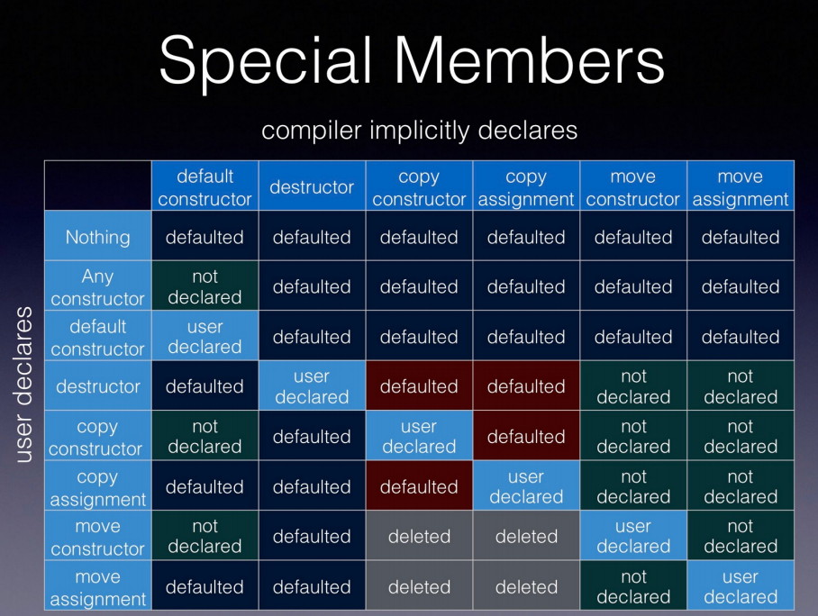

# 第十一章：类

> **一句话定义**：本章用 **C++ 标准中的「类 (class)」** 把对象语义工程化 —— 围绕 **`struct/class`、数据成员、成员函数 (含 `this`)、`public/private/protected/friend` 访问控制、构造函数（默认/带参/委托/继承）、初始化列表、析构、五大特殊成员函数 (rule of five)、拷贝/移动构造与赋值 (含 copy-and-swap idiom)、`explicit` / 转换运算符、聚合类与字面值类、静态成员与 C++17 `inline variable`、C++20 designated initializer 与 defaulted `<=>`、成员指针与 `std::bind` 交互** 一整套机制，给出「资源所有权 + 编译期常量 + 接口契约」三条工程主线。

## 章节知识框架


```mermaid
graph TD
  c11_root[第11章：类]

  c11_root --> c11_struct[1.结构体与对象聚合]
  c11_root --> c11_method[2.成员函数]
  c11_root --> c11_access[3.访问限定符与友元]
  c11_root --> c11_ctor[4.构造析构复制]
  c11_root --> c11_lit[5.字面值类 / 成员指针 / bind]

  c11_struct --> c11_data[数据成员 / 类内初值]
  c11_struct --> c11_mut[mutable 限定]
  c11_struct --> c11_static[static / inline static C++17]

  c11_method --> c11_this[this 指针 / const]
  c11_method --> c11_overload[const / 引用限定符重载]
  c11_method --> c11_smfunc[static 成员函数]

  c11_access --> c11_pubpri[public / private / protected]
  c11_access --> c11_friend[friend / 隐藏友元 / ADL]

  c11_ctor --> c11_default[默认 / 委托构造]
  c11_ctor --> c11_init[初始化列表]
  c11_ctor --> c11_explicit[单参 ctor / explicit]
  c11_ctor --> c11_copy[拷贝构造 / 拷贝赋值]
  c11_ctor --> c11_move[移动构造 / 移动赋值 / noexcept]
  c11_ctor --> c11_dtor[析构函数]
  c11_ctor --> c11_rof5[Rule of 3/5/0]
  c11_ctor --> c11_dd[= default / = delete]

  c11_lit --> c11_litcls[constexpr / consteval 字面值类]
  c11_lit --> c11_mptr[成员指针 .* ->*]
  c11_lit --> c11_bind[std::bind 交互]

  c11_root -. C++20 .-> c11_desig[designated initializer]
  c11_root -. C++20 .-> c11_spaceship[defaulted operator<=>]
  c11_root -. C++17 .-> c11_inline[inline variable]
```

> **相关模块预告**：本章是「类与面向对象」模块的入门骨架，向下与第 8 章「动态内存」一起构成 RAII 资源管理的两根支柱，向上为第 12 章「类的进阶 (继承 / 虚函数 / RTTI / 多重继承)」铺路；与第 4 章「值类别」配合理解移动语义，与第 13 章「模板」配合理解 `friend template` 与 CTAD。

---

## 1.结构体与对象聚合

### 概念 (Concept)
**结构体 (`struct`)** 是 C++ 沿袭自 C 的**对象聚合 (aggregate)** 机制：把多个对象「放置在一起视为一个整体」，给每段数据起名并共享同一段内存布局。C++ 把 `struct` 升级为 **完整的类**：可以含成员函数、构造析构、访问控制；`class` 与 `struct` 的唯一差别是**默认访问权限**（`class` 默认 `private`，`struct` 默认 `public`）。仅有声明而无完整定义的结构体属于 **不完全类型 (incomplete type)**：可以声明指针 / 引用，但不能定义对象、不能 `sizeof`。结构体（以及类）遵循 **翻译单元级一处定义原则 (ODR)**。

### 语法 (Syntax) — 声明、定义与 `typedef`
```c++
#include <iostream>

/* 
结构体：对基本数据结构进行扩展，将多个对象放置在一起视为一个整体
– 结构体的声明与定义（注意定义后面要跟分号来表示结束）
– 仅有声明的结构体是不完全类型（ incomplete type ）
– 结构体（以及类）的一处定义原则：翻译单元级别 
*/

struct Str1; // 声明
// 需要让编译器知道该给多少内存

struct Str
{
    int x; // 其实只是声明
    int y;
}; // 必须要分号结束

int main()
{
    Str m_str; // 隐式定义了 x 和 y
    m_str.x=3;
    std::cout << m_str.x << std::endl;
}
// typedef
typedef struct Str
{
    int x;
    int y;
} Mstr; // 别名，C语言
// 如果没有分号，不知道是typedef还是定义结构体，不完整

int main()
{
    Mstr m_str; 
    Str1 m_str1;// 不行，不完全类型，不知道给多少内存
    Str1* m_str1;//可以，指针大小已知
    
}

//////////////////////////////////////////////////////
```

### 语义 (Semantics)
- `struct Str { int x; int y; };` 里的 `int x` / `int y` 是**数据成员声明**，并未真正分配存储；只有 `Str m_str;` 才会在栈上一次性「隐式定义」 `x` 与 `y` 两个对象。
- `Str1 m_str1;`（仅声明 `struct Str1;`）失败：编译器不知道 `sizeof(Str1)`，无法分配存储。但 `Str1* p;` 合法 —— 指针大小固定（机器字宽），与被指类型完整性无关。
- `typedef struct Str { ... } Mstr;` 是 C 风格双名约定：`Str` 与 `Mstr` 都可作为类型名；C++ 里直接 `struct Str { ... };` 已经够用，无需再 `typedef`。
- **末尾分号是语法刚性要求**：与 `typedef` 解析路径冲突，缺一个分号编译器会把后续 `int main()` 当成 `Str` 的成员去解析，错误信息常常对不上号。

### 机制 (Mechanism)
- 编译期为每个 `struct/class` 计算**布局**：按声明顺序铺数据成员，依据 ABI 对齐规则插 padding；与第 2 章 `alignof / alignas` 联动。
- **不完全类型的「窗口」**：声明 `struct A;` 后到完整定义之间，`A*` / `A&` / `using P = A*;` 都合法，但 `A x;` / `sizeof(A)` / `delete pa;` 都非法 —— 这是设计**前向声明跨头文件依赖**与 **PImpl 惯用法**的基础。
- ODR：跨 TU 中 `struct Str { ... };` 必须**字节级一致**（同样的成员名、同样的顺序、同样的访问限定、同样的访问指示符）；否则链接阶段不会报错但运行期会出现「同一对象两种布局」的 UB。

### 数据成员（数据域）的声明与初始化

```c++
/*
（ C++11 ）数据成员可以使用 decltype 来声明其类型，但不能使用 auto
	数据成员声明时可以引入 const 、引用等限定
	数据成员会在构造类对象时定义
	（ C++11 ）类内成员初始化
	聚合初始化：从初始化列表到指派初始化器
*/
struct Str
{
    decltype(3) x;
    // auto x 不行
    int y;
}

int main()
{
    Str m_str{3, 4};// 聚合初始化
    // 如果结构体中定义的元素顺序改变，赋值情况也改变，不建议
    
    // 指派初始化器
    Str m_str{.x = 3, .y = 4};
}
```

#### 语义补充
- C++11 起允许 `decltype(expr) x;` 在类内声明成员类型；但 `auto x;` 一直禁止 —— 类内 `auto` 需要初始化器，且 ODR 难以保证。
- C++ Core Guidelines C.48：能用**类内成员初始化** (`int y = 1;`) 就写在声明处，避免每个构造函数都重复一次。
- **聚合初始化** `Str{3, 4}` 按**声明顺序**绑定到成员；如果你重排了结构体的成员顺序，**意义会静默改变** —— 编译器不会报错，但赋错了字段。
- **指派初始化器 (designated initializer)** 是 C++20 P0329 引入的：`Str{.x = 3, .y = 4}` 按名字绑定，**必须沿声明顺序写**（不能 `.y` 在前、`.x` 在后，这是 C++ 与 C99 的关键差别）。它把「位置耦合」改成「名字耦合」，是聚合初始化的现代救星。

### mutable 限定符

```c++
struct Str
{
    int x = 0;
    int y = 1;
}
struct Str1
{
    mutable int x = 0;
    int y = 1;
}

int main()
{
    const Str m_str; // 常量结构体，不可更改
    // 希望改变常量对象中的某些元素
    const Str1 m_str1; //  mutable
    m_str1.x = 3; // 可赋值
}


```

#### 机制
- **`mutable` 是「常量豁免」**：在 `const Str1` 对象上，仍然允许修改 `mutable` 数据成员。
- 典型场景：**缓存 / 懒计算 / `std::mutex`**：逻辑上只读的接口，物理上需要写一些「实现细节」字段。例如 `mutable std::mutex m_;` 配合 `const T get() const { std::lock_guard g(m_); ... }`。

### 静态数据成员——多个对象之间共享的数据成员

```c++
#include<iostream>

struct Str
{
    static int x; // 声明
    // 静态数据成员被所有对象所共享
    int y = 1;
};

// C++98 ：类外定义， const 静态成员的类内初始化
int Str::x; // 此处不需要再写static
// 注意链接

int main()
{
    Str m_str1;
    Str m_str2;
    m_str1.x = 100;
    std::cout << m_str2.x << std::endl;
    // 此时打出来是 100
}

//////////////////////////////////////////////////////
// const 静态成员的初始化
struct Str
{
    // const static int array_Size; // 需要保证array_Size为编译期常量
    // 不完全类型，没有给值
    // 所以必须类内给出定义
    const static int array_Size = 100; // 编译期常量
    int buffer[array_Size]; // 编译器直接替换成 100
};

int main()
{
    Str m_str1;
    m_str1;
    
    std::cout << &(m_str1.array_Size) << std::endl;
    // 错误，因为编译期直接把值替换了，所以没有这块内存
    // 没有构造出 array_Size 这块内存与其关联
    // 此时需要类外给出定义
}

// 类外定义，有定义编译器才会给相应的内存分配
const int Str::array_Size;
//////////////////////////////////////////////////////
// C++17 ：内联静态成员的初始化
struct Str
{
    inline static int array_Size = 100;
    int buffer[array_Size]; 
    inline static int test = 10; // 可以修改，不用 const
};

int main()
{
    Str m_str1;
    m_str1;
    m_str1.test = 50;
    std::cout << &(m_str1.array_Size) << std::endl;
    std::cout << (m_str1.test) << std::endl; // 输出50
}
//////////////////////////////////////////////////////
// 可以使用 auto 推导类型
struct Str
{
    // 静态数据成员可以使用 auto
    inline static auto array_Size = 100;
    // 一般数据成员可以使用decltype来声明，不能用auto
};
//////////////////////////////////////////////////////
// 静态数据成员的访问
// “.” 与“ ->” 操作符
// “::” 操作符

int main()
{
    Str m_str1;
    m_str1.array_Size = 50;
    Str* ptr = &m_str1;
    
    std::cout << m_str1.array_Size << std::endl;
    std::cout << ptr -> array_Size << std::endl;
    // 对共享数据成员
    std::cout << Str::array_Size << std::endl;
}
//////////////////////////////////////////////////////
// 在类的内部声明相同类型的静态数据成员

    // 解析时需要分析 Str 内部需要占多少内存
    Str x;  // 不知道占多少内存，因此不能包含自己
    
    // 但是这个可以
    static Str x;// 它被所有Str共享，意味着它不属于某一个对象
    // 它不存在谁包含谁的关系
    // 编译器在计算Str大小时，不会包含静态数据成员
    
    // 编译认为此句会产生一个x的定义，
    // 因此需要对Str这个类型有一个全面的了解
    inline static Str x;// 不行，不完全类型
};

int main()
{
    Str m_str1;
    Str m_str2;
    
    std::cout << &(m_str1.x) << std::endl;// 链接出错
}
//////////////////////////////////////////////////////
// 新的头文件内
struct Str
{
    static Str x;
};

// 此时不能把inline去掉，链接时会被多次定义
inline Str Str::x;
```

#### 机制
- **静态数据成员被所有对象共享**：在类内只是「声明」，类外必须给「定义」才会真正分配存储。C++98 写 `int Str::x;`；C++17 起首选 **`inline static int x = 100;`** —— 类内即定义，省掉头文件 vs 源文件的两段式骨架。
- **`const static` 类内初始化** 看似有值，其实是「编译期常量替换」，并未真正分配存储；想取地址 `&Str::array_Size` 仍要在类外补 `const int Str::array_Size;`。这是「**ODR-used**」概念的入门示例：被 ODR-used 的对象必须有定义。
- **类内不能声明同类型的非静态成员对象 (`Str x;`)** —— 会形成无穷递归布局；但 `static Str x;` 可以，因为静态成员不计入 `sizeof(Str)`，逻辑上不属于「某一个对象」。`inline static Str x;` 此时仍不行：要求**完整类型**才能定义对象。

### 实践 (Practice)
- 「config 单例」推荐写法（C++17）：`struct Cfg { inline static int kPageSize = 4096; };` —— 头文件即定义，跨 TU 不重复符号。
- 不要用 `#define` 表达「类范围常量」：写 `inline static constexpr` 让它带类型、带域、带常量性，编译期可参与模板实参。
- 聚合 + 指派初始化：用于**结构化的命令行 / 配置数据**：`Opts o{.timeout_ms = 500, .retries = 3};`，命名清晰，又能省 builder 模板。

### 坑 (Pitfall)
- 没分号收尾会被 IDE 标在「下一行」，**遵循「定义完结构体先打分号」的肌肉记忆**；
- 聚合初始化 `Str{3, 4}` 顺序与结构体声明顺序绑死 —— 字段重排是**寂静破坏者**；
- `const static int array_Size = 100;` 在 C++17 之前**不是定义**，对它取地址前需要类外补一行 `const int Str::array_Size;`；
- 想跨平台用 designated initializer 必须 `-std=c++20`（gcc 8+, clang 10+, MSVC 19.21+）；
- `mutable` 与多线程共享的字段同用必须配 `std::atomic` 或锁。

> 参考 godbolt：x86-64 gcc 14.2，演示 inline static + designated initializer：
> <https://godbolt.org/?source=#g:!((g:!((g:!((h:codeEditor,i:(filename:'1',fontScale:14,fontUsePx:'0',j:1,lang:c%2B%2B,source:'%23include+%3Ciostream%3E%0Astruct+Opts+%7B%0A++++int+timeout_ms+%3D+100%3B%0A++++int+retries+++++%3D+3%3B%0A++++inline+static+int+kVer+%3D+2%3B%0A%7D%3B%0A%0Aint+main()+%7B%0A++++Opts+o%7B.timeout_ms+%3D+500%7D%3B%0A++++std::cout+%3C%3C+o.timeout_ms+%3C%3C+%22+%22+%3C%3C+Opts::kVer+%3C%3C+%22%5Cn%22%3B%0A%7D'),k:50,l:'4',n:'0',o:'',s:0,t:'0'),(g:!((h:compiler,i:(compiler:g142,filters:(),lang:c%2B%2B,libs:!(),options:'-std%3Dc%2B%2B20+-O2',source:1),l:'5',n:'0',o:'+x86-64+gcc+14.2+(C%2B%2B,+Editor+%231)',t:'0')),k:50,l:'4',n:'0',o:'',s:0,t:'0')),l:'2',n:'0',o:'',t:'0'),version:4>

---

## 2.成员函数（方法） 

### 概念 (Concept)
**成员函数 (method)** 是「定义在类域内的函数」：对内操作数据成员，对外提供调用接口。每个非静态成员函数都隐含一个 **`this` 指针**（指向调用方对象），编译期自动作为第 0 个参数传入。**类可视为一种抽象数据类型**，通过相应的接口（成员函数）与外界交互；这套语义把「数据 + 行为」打包成一个**接口契约**，是 OOP 的语言级骨架。

### 语法 (Syntax) — 类内定义 / 类外定义 / `this`

```c++
#include <iostream>

struct Str
{
    int x;
    void fun() // 把函数放入结构体，不需要传入 Str obj
    {
        std::cout << x << std::endl;
    }
};

void fun(Str obj)
{
    std::cout << obj.x << std::endl;
}

int main()
{
    Str m_str;
    // fun(m_str);
    m_str.fun();
}
//////////////////////////////////////////////////////
// 成员函数（方法）：对内操作数据成员，对外提供调用接口
// 类可视为一种抽象数据类型，通过相应的接口（成员函数）进行交互

int x = 5
// 类本身形成域，称为类域
class Str
{
public:
    int x;
    // inline static int x = 3; 
    
    // 类内定义（隐式内联）
    void fun()  
    {
        std::cout << x << std::endl;
    }
};

int main()
{
    Str m_str;
    // 类内定义（隐式内联）, 避免重复定义
    m_str.fun();
}

// 类内声明 + 类外定义
class Str
{
public:
    int x;
    void fun();// 希望更简洁，但需要注意类外定义时手动内联 inline
};
// void Str::fun() // 另一个cpp文件内, 但此时不是内联
inline void Str::fun() // 主动添加内联
{
    std::cout << x << std::endl;
}
// 提供接口，将函数定义单独放到一个cpp文件中，给用户只有.h，将cpp编译成一个链接库，提供用户使用。

//////////////////////////////////////////////////////
// 类与编译期的两遍处理
struct Str
{
    // 类更关注函数的接口，通常把重要的东西放到前面
    // 因此有编译期的两遍处理，先不处理函数内部，处理完整个类后再对函数内部处理
    void fun()
    {
        std::cout << x << std::endl;
        // 第一遍 x 其实还没定义（从上往下），第二遍才被处理
    }
    int x;
};
// 不能用类的两遍处理的情况
struct Str{
    using MyRes = int;
    MyRes fun()
    {
        return x;
    }
    int x;
};
// 错误
struct Str{
    MyRes fun() // 从上到下处理，不知道返回的MyRes是什么类型
    {
        return x;
    }
    using MyRes = int;
    int x;
};
//////////////////////////////////////////////////////
// 成员函数与尾随返回类型（ trail returning type ）
struct Str{
    using MyRes = int;
    MyRes fun();
    int x;
};

// MyRes Str::fun() // 编译器不认识 MyRes
Str::MyRes Str::fun() // 有点麻烦
// trail returning type 简化代码
auto Str::fun() -> MyRes // 尝试从Str域中找相关类型，C++11
{
    return x;
}
//////////////////////////////////////////////////////
// 使用 this 指针引用当前对象
struct Str
{
    void fun() // Str* this 实际上是该函数的第一个参数传入
    {
        //std::cout << x << std::endl; // this -> x 访问的是同一块内存
        std::cout << this << std::endl;
    }
    int x;
};
int main()
{
    Str m_str1;
    m_str1.x = 3;
    std::cout << &(m_str1) << std::endl;
    m_str1.fun(); // fun(&m_str1)
    
    Str m_str2;
    m_str2.x = 4;
    std::cout << &(m_str2) << std::endl;
    m_str2.fun();
}
// output
0xb2e83ffc28
0xb2e83ffc28
0xb2e83ffc2c
0xb2e83ffc2c
// 编译器如何知道调用哪个 x ？
// 编译器处理时会给函数一个隐藏的参数
    
//////////////////////////////////////////////////////
// 使用 this 指针引用当前对象
struct Str
{
    void fun(int x) 
    {
        std::cout << x << std::endl;// 函数内部域的 x
        std::cout << Str::x << std::endl;// 类的数据成员 x
        std::cout << this->x << std::endl;// 类的数据成员 x
        this->x = x; // 防止域屏蔽
    }
    int x;
};
int main()
{
    Str m_str1;
    m_str1.x = 3;
    m_str1.fun(8); // 打出结果是 8
}
//////////////////////////////////////////////////////
// 基于 const 的成员函数重载
struct Str
{
    // 希望类对外提供的接口，不会修改类内部任何的数据成员
    // 引入强制性的限制
    void fun(int x) const // 加入const
    {
        // this -->  Str * const //const 表示 this 不能修改
        // 指针本身不能被修改，但是可以改指向的内容 
        
        this -> x = 100;//有 const 会报错
        // 此时，this -> const Str * const
        // 即指向的内容也不能被修改
    }
    int x;
};

struct Str
{
    void fun(int x) // Str* const this
    {
    }
    
    void fun(int x) const // const Str* const this
    {
    }
    
    void fun(double x) // 函数重载
    {
    }
    

    int x;
};
//////////////////////////////////////////////////////
// 成员函数的名称查找与隐藏关系
// 函数内部（包括形参名称）隐藏函数外部
// 类内部名称隐藏类外部
// 使用 this 或域操作符引入依赖型名称查找
int x;
struct Str
{
    void fun()
    {
    }
    void fun(int x) const
    {
    }
    int x;
};
inline void Str::fun(int x)
{
    x; // 先是形参，再找类内部的，再往外找
    // 指定 x 
    // 使用 this 或域操作符引入依赖型名称查找
    this->x;
    Str::x;
}
//////////////////////////////////////////////////////
//静态成员函数
//	在静态成员函数中返回静态数据成员
// 用于描述与类紧密相关的东西，同时不需要对象获取相应的结果
struct Str
{
    inline static int x;// 所有数据对象共享静态数据成员
    // 静态成员函数, 也可被所有Str共享
    static void fun()//不会传入隐含参数
    {
        std::cout << x << std::endl;// 错误没有Str* const this
    }
    
    int x;
};
int main()
{
    Str m_str1;
    m_str1.fun();// 此时报错，不能在静态成员函数内部使用成员对象
    Str m_str2;
    Str::fun();// 也可以直接这样
}
//////////////////////////////////////////////////////
struct Str
{
    int size()
    {
        return 100;
    }
    static int size2()
    {
        return 100;
    }
    
    int x[100];
};

int main()
{
    Str m_str1;
    std::cout << m_str1.size; // 代码可运行，但获得100较麻烦，首先要构造对象，再调用对象的size()；但100其实与x[]的定义紧密相关
    // 此时使用静态数据成员函数
    std::cout << Str::size2();
    
}
//////////////////////////////////////////////////////
// 在静态成员函数中返回静态数据成员
struct Str
{
    static int size()
    {
        return x;
    }
    static int size2()
    {
        static int y;// 不是Str的静态数据成员
        // 局部静态变量，从首次调用size2()开始构造出来，一直存在，直到程序结束
        return y;
    }
    static int x;
    
    static auto size3()
    {
        return z;
    }
    // 这样使得静态数据成员在开始就被建立起来，被占更多的内存与耗费更多时间初始化，可能在整个程序中没有被用到
    inline static std::vector<int> z;
    
    static auto& size4() //返回引用避免拷贝
    {
        static std::vector<int> xx;
        // 只有调用size4时 xx 才会被建立
        return xx;
    }
    
    static auto& instance() // 单例模式(这里还不完整)
    {
        static Str yy;
        return yy;
    }
    
};
int main()
{
    Str::instance();
}
//////////////////////////////////////////////////////
// 成员函数基于引用限定符的重载（ C++11 ）
class some_type
{
  void foo() & ;		 // 左值引用
  void foo() && ;		 // 右值引用
  void foo() const & ;	 // 常量左值引用
  void foo() const && ;  // 常量右值引用
    // 一般不会用常量右值
};
int main()
{
    some_type t; // t 是左值
    t.foo();			// some_type::foo() &
    some_type().foo(); 	 // some_type::foo() && 
    // some_type()相当于构造了纯右值
}

// 注意：基于const的成员函数重载是 C++98引入，基于引用限定符的重载是C++11引入的，二者不可混用
```

### 语义 (Semantics) — 类内定义即隐式 `inline`
- **类内定义的成员函数隐式 `inline`**：可以在多个翻译单元包含同一个头文件而不违反 ODR；类外定义则需要手动加 `inline` 才能放头文件。
- **「类与编译期的两遍处理」**：编译器先扫描整个类体，把所有成员名（类型 / 函数签名）收集完，再回头处理函数体。所以类内函数体可以**先用后定义**：`fun()` 中引用 `x`，即使 `x` 声明在 `fun()` 之后也合法。
- 但**不能在类外的类内** 用这种「两遍」：在类外用 `using MyRes` 声明类型必须在 `fun()` 定义之前，否则编译器读到 `MyRes fun()` 当下不知道 `MyRes` 是何物。
- **尾置返回类型 (trailing return type)** `auto Str::fun() -> MyRes` 解决类外定义引用类内类型的问题：函数名之后即进入「类域」，可以省掉 `Str::MyRes` 的繁琐限定。

### 机制 (Mechanism) — `this`、`const`、引用限定符
- **`this` 是隐含参数**：非静态成员函数等价于 `void Str::fun(Str* const this, ...)`；调用 `m_str1.fun()` 等价于 `Str::fun(&m_str1)`。
- **`const` 成员函数**：把 `this` 的类型从 `Str* const` 升级为 `const Str* const` —— 既不能改 `this` 指针本身，也不能改它指向的对象。这是「类对外承诺只读」的语言层契约。
- **`const` 重载**：`void fun(int)` 与 `void fun(int) const` 是两个独立函数，根据**调用对象的 `const` 性**择选；这是「const-correctness」实践基础（cppreference / C++ Core Guidelines Con.2）。
- **`& / && / const & / const &&` 引用限定符 (C++11)**：把 `this` 的值类别也纳入重载，让接口区分「左值上调用」与「右值上调用」（典型用例：`std::optional::value() &` vs `value() &&` 可以决定是返回引用还是 move 出去）。
- **静态成员函数没有 `this`**：可以用 `Str::fun()` 直接调用，也可以 `obj.fun()` 调用（但仍不持 `this`）；适合表达「与类紧密相关、不依赖具体对象」的工厂、辅助函数。

### 实践 (Practice)
- **接口契约写 `const`**：所有**不修改对象状态**的成员函数都标 `const`；编译器替你把 bug 锁在常量对象的调用面之外。
- **类内定义保持精简**：复杂成员函数移到类外 + `inline`，让头文件可读；模板成员函数除外（必须可见定义）。
- **`static` + magic static 单例**：C++11 起 `static Str& instance() { static Str s; return s; }` 是**线程安全的懒初始化**（详见第 8 章 / N2660）。
- **引用限定符做「右值优化路径」**：`std::string && data() && { return std::move(s_); }` 让链式调用避免拷贝。

### 坑 (Pitfall)
- 类内定义函数体里**先用后定义**只对**同类内成员**生效；引用**类内类型别名 / 嵌套类型** 仍要遵循「先声明后使用」。
- `void fun(int) const` 的「常量性」是**对 `this` 的承诺**，不是对参数 —— 别误以为 `int x` 也变了 const。
- 形参 `int x` 与类成员 `int x` 同名时，**形参隐藏成员**；用 `this->x` 或 `Str::x` 显式定位（gcc/clang `-Wshadow-member` 会提醒）。
- 静态成员函数里写 `x` 直接报错（无 `this`），必须 `Str::x` 或写 `inline static`。
- `&` 引用限定符与 `const` 重载**不能混用** —— `void foo() const` (C++98) 与 `void foo() &` (C++11) 是两套机制，不要在同一函数族里乱混。

> godbolt：const 重载 + 引用限定符，gcc 14.2 -std=c++17：
> <https://godbolt.org/?source=#g:!((g:!((g:!((h:codeEditor,i:(filename:'1',fontScale:14,fontUsePx:'0',j:1,lang:c%2B%2B,source:'%23include+%3Ciostream%3E%0A%23include+%3Cstring%3E%0Aclass+Opt+%7B%0A++std::string+s_+%3D+%22abc%22%3B%0Apublic:%0A++auto%26+get()+%26+++++++%7B+std::cout%3C%3C%22%26%22%3B+return+s_%3B+%7D%0A++auto+++get()+%26%26+++++%7B+std::cout%3C%3C%22%26%26%22%3B+return+std::move(s_)%3B+%7D%0A++auto%26+get()+const%26+%7B+std::cout%3C%3C%22c%26%22%3B+return+s_%3B+%7D%0A%7D%3B%0Aint+main()%7B%0A++Opt+a%3B+const+Opt+b%3B%0A++a.get()%3B+b.get()%3B+Opt().get()%3B%0A%7D'),k:50,l:'4',n:'0',o:'',s:0,t:'0'),(g:!((h:compiler,i:(compiler:g142,filters:(),lang:c%2B%2B,libs:!(),options:'-std%3Dc%2B%2B17+-O2',source:1),l:'5',n:'0',o:'+x86-64+gcc+14.2+(C%2B%2B,+Editor+%231)',t:'0')),k:50,l:'4',n:'0',o:'',s:0,t:'0')),l:'2',n:'0',o:'',t:'0'),version:4>

---

## 3.访问限定符与友元

### 概念 (Concept)
**访问限定符 (access specifier)** 把类的成员按可见性分三层：`public` 对所有调用方开放；`private` 只对当前类内部开放；`protected` 对当前类和其派生类开放（详见第 12 章）。这套机制让我们**对抽象数据类型进行封装**——把「不变量 (invariant)」锁在 `private`，向外只暴露经过校验的接口。**`friend` 关键字**是封装的「合法后门」：可以指定某个函数 / 类 / 模板能跨过访问墙读写 `private`，用于实现需要紧耦合但又不想公开的协作 —— 慎用！

### 使用 public/private/protected 限定类成员的访问权限

1. 访问权限的引入使得可以对抽象数据类型进行封装
2. 类与结构体缺省访问权限的区别

```C++
#include <iostream>
#include <vector>

struct Str
{
    void fun()
    {
        std::cout << x << std::endl; // 可以访问 private
    }
private: // 不可以在 Str 以外访问数据成员，私有的
    inline static int x; // 也不能被访问
    int z;
public:
    int y;
protected: // 类似 private，用于继承
    
// 类与结构体缺省访问权限的区别 ,struct 缺省是 public
    // 注意，class 缺省是 private
};
class Str2{
public:
    inline static int x;
private:
    // ...
}
int main() 
{
    Str m_str;
    std::cout << m_str.y << std::endl;
}

```

#### 语义
- `class` 与 `struct` 的**唯一差别**就是**默认访问权限**：`class` 默认 `private`，`struct` 默认 `public`。除此之外**完全等价**，包括成员函数、虚函数、模板、继承机制。
- 访问限定符**作用域是「下一个限定符之前」**：可以反复切换，写多次 `public:` / `private:` 合法但不优雅。
- `protected` 在不继承场景下与 `private` 等同；只有出现派生类时差异才显现（第 12 章）。

#### 机制
- 访问限定符**只影响名字查找的结果**，不影响布局：编译器知道**所有成员**的位置，调用违法成员时报错只是在语义检查阶段拒绝，不改 ABI。
- **`friend` 不传递、不继承**：A friend B、B friend C，不代表 A friend C；派生类不会自动继承基类的友元。

### 使用友元打破访问权限限制—关键字friend

1. 声明某个类或某个函数是当前类的友元─慎用!

2. 在类内首次声明友元类或友元函数

   **注意使用限定名称引入友元并非友元类(友元函数)的声明**

3. 友元函数的类内外定义与类内定义

4. 隐藏友元( hidden friend):常规名称查找无法找到（参考文献)
   	好处:减轻编译器负担，防止误用
   	改变隐藏友元的缺省行为:在类外声明或定义函数

1. ```c++
   #include <iostream>
   #include <vector>
   
   int main(); // 声明
   class Str2;
   
   class Str{
       friend int main(); // 表明 main 是Str的友元，打破封装
       friend Str2;
       // 可以访问class 私有的成员函数
       inline static int x;
   };
   
   class Str2
   {
       void fun()
       {
           std::couty << Str::x << std::endl;
       }
   };
   
   int main()
   {
       std::couty << Str::x << std::endl;
   }
   ////////////////////////////////////////////////////////////////
   // 在类内首次声明友元类或友元函数
   // 注意使用限定名称引入友元并非友元类(友元函数)的声明
   void fun3();// 这里加了才对
   
   class Str
   {
       inline static int x;
       int y;
       friend void fun();// 在类内首次声明，就不用在前面先声明
       friend class Str2;// 注意不能这这里直接定义Str2
       
       friend void ::fun3();//::意味着fun3位于全局名字空间中，
       // 编译会出错，它不是一个函数的声明，意味着要求它前面已经有过对应的声明
       
       // 友元函数可以在类内定义
       friend void fun4() // fun4()的作用域？一定不是Str内部，它是友元，位于类外的全局域中；但是，其是隐藏友元，外部直接调用找不到
           //有定义而无声明
       {
           Str val;
           std::cout << val.y << std::endl;
       }
       // 隐藏友元( hidden friend):常规名称查找无法找到（参考文献)
   	// 	好处:减轻编译器负担，防止误用
   	// 	改变隐藏友元的缺省行为:在类外声明或定义函数
       // 常规找不到，ADL找得到，实参依赖查找（argument-dependent lookup）
       
       friend void fun5(const Str& val)
       {
           std::cout << val.y << std::endl;
       }
   };
   void fun()
   {
       Str val;
       std::cout << val.y << std::endl;
   }
   
   class Str2
   {
       void fun2()
       {
           Str val;
           std::cout << val.y << std::endl;
       }
   }
   
   int main()
   {
       Str val;
       fun5(val);// 使用ADL，传入val,会进行实参类型依赖查找
       // 实际上，这才是隐藏友元的正确打开方式
       // why 定义友元函数？希望友元函数可以访问类对象私有的数据成员
       // 而访问数据成员通常要传入对应的对象，即定义隐藏友元函数
       // 既实现了解析，也保留了对应的好处
   }
   ```

#### 机制 —— 隐藏友元 (hidden friend) 与 ADL
- **首次声明 vs 限定名称引入**：`friend void fun();` 是 `fun` 的**首次声明**（无需在 `class Str` 之前先声明）；而 `friend void ::fun3();` 用了限定名 `::fun3`，编译器认为这是**引用已存在的全局函数**，必须前置声明。
- **隐藏友元 (hidden friend)**：在类内**同时声明 + 定义** `friend void fun4() { ... }`，函数本身位于类外的命名空间作用域，但**常规名称查找找不到** —— 只有通过 **ADL (实参依赖查找)** 才能命中。好处：减轻编译器负担、防止误用、避免名字污染。
- **ADL 的正确打开方式**：`friend void fun5(const Str& val) { ... }` 在调用 `fun5(val)` 时，编译器从实参类型 `Str` 出发查找其关联命名空间，命中类内的隐藏友元定义。
- **改变隐藏友元的缺省行为**：若想让它能被普通名称查找命中，就在类外补一行声明 `void fun5(const Str&);` —— 此时它「重新公开」。

### 实践 (Practice)
- **`friend operator<<`** 是最常见用例：`friend std::ostream& operator<<(std::ostream& os, const Date& d) { ... }` —— 让流操作既能访问 `private`，又通过 ADL 自然命中。
- **`friend class Builder;`** 让构建器访问类内 invariants，但保持类的对外 API 干净。
- **避免「裸 `friend`」**：友元等于打破封装；优先考虑「在 public 接口上提供专用 setter」「拆出 pImpl」「用 nested class」三种替代方案。

### 坑 (Pitfall)
- `friend int main();` 让 `main` 成为类的友元，看上去能 work，但 `main` 通常不应介入实现细节 —— 这是**反模式**示例，仅用于教学。
- `friend Str2;` C++11 起合法（无需 `class` 关键字）；C++98 必须写 `friend class Str2;`。
- 类外的限定名 `friend void ::fun3();` 要求 `fun3` **已声明**；用 `friend void fun3();`（不限定）则会**同时声明**它。
- 隐藏友元不能被「显式 `Str::fun4()`」调用 —— 它不是成员函数；也不能被 `fun4();` 命中（除非提供类外声明）。

> godbolt：隐藏友元 + ADL 实战，gcc 14.2 -std=c++17：
> <https://godbolt.org/?source=#g:!((g:!((g:!((h:codeEditor,i:(filename:'1',fontScale:14,fontUsePx:'0',j:1,lang:c%2B%2B,source:'%23include+%3Ciostream%3E%0Astruct+Pt+%7B%0A++int+x%2C+y%3B%0A++friend+std::ostream%26+operator%3C%3C(std::ostream%26+os%2C+const+Pt%26+p)+%7B%0A++++return+os+%3C%3C+%22(%22+%3C%3C+p.x+%3C%3C+%22%2C%22+%3C%3C+p.y+%3C%3C+%22)%22%3B%0A++%7D%0A%7D%3B%0Aint+main()%7B%0A++Pt+p%7B1%2C+2%7D%3B+std::cout+%3C%3C+p+%3C%3C+%22%5Cn%22%3B%0A%7D'),k:50,l:'4',n:'0',o:'',s:0,t:'0'),(g:!((h:compiler,i:(compiler:g142,filters:(),lang:c%2B%2B,libs:!(),options:'-std%3Dc%2B%2B17+-O2',source:1),l:'5',n:'0',o:'+x86-64+gcc+14.2+(C%2B%2B,+Editor+%231)',t:'0')),k:50,l:'4',n:'0',o:'',s:0,t:'0')),l:'2',n:'0',o:'',t:'0'),version:4>

---

## 4.构造、析构与复制成员函数

### 概念 (Concept)
**构造函数 (constructor)** 在对象创建瞬间执行，负责把不变量 (invariant) 建立到合法初值；**析构函数 (destructor)** 在对象销毁前夕执行，负责释放资源；**拷贝构造 / 拷贝赋值 / 移动构造 / 移动赋值** 这四个加上析构，合称 C++ 的 **「五大特殊成员函数」(special member functions, SMF)**，对应「Rule of Five」工程惯例 (Scott Meyers, *Effective Modern C++* Item 17、N4861 §11.4.4)。在涉及裸资源（`new`/`delete`、文件句柄、`mmap`、套接字）时，五大函数必须**整体设计**；不涉及裸资源时则推崇 **Rule of Zero**，把资源所有权委托给 `std::unique_ptr / std::string / std::vector` 等已实现 RAII 的类型。

### 构造函数:构造对象时调用的函数

1. 名称与类名相同，无返回值，可以包含多个版本(重载)
2.  (C++11）代理构造函数

```c++
#include <iostream>
#include <vector>

class Str
{
public:
    Str()
    {
        std::cout << "Constructor is called." << std::endl;
    }
    // 构造函数可以包含多个版本
    Str(int input) //参数列表不同就可以形成重载的关系
    {
        x = input;
        std::cout << x << std::endl;
    }
    
    Str(int input = 3) // 逻辑相似时的优化，缺省实参，但是某个形参缺少缺省实参的话，编译器会报错
    {
        x = input;
    }
private:
    int x;
    
};
int main()
{
    Str m;	// 调用构造函数
    Str m(3); // 调用第二个
}
////////////////////////////////////////////////////
class Str
{
public:
    Str() : Str(3) // (C++11）代理构造函数
        // 缺省但是代理给了 Str(3) 
        // 先调用缺省构造函数，再执行函数体
    {
        std::cout << "here1" << std::endl;
    }
    Str(int input)
    {
        std::cout << "here2" << std::endl;
        x = input;
    }
    void fun()
    {
        std::cout << x << std::endl;
    }
private:
    int x;
};

int main()
{
    Str m(30);
    // Str m; // 此时输出 3
    m.fun();
}

```

#### 语法 / 语义
- **构造函数名 = 类名，无返回值**（连 `void` 都不写）。
- **可重载**：根据参数列表区分；如 `Str()` 与 `Str(int)`。但**缺省实参与重载混用**要小心 —— `Str()` 与 `Str(int = 3)` 同时存在会导致**默认调用歧义**。
- **委托构造函数 (delegating ctor, C++11)**：`Str() : Str(3) {}` —— 先把构造工作委托给另一版本，再进入自己的函数体。它**只能写在初始化列表的位置**且**只能委托一个**，不能与其他成员初始化器同列。
- 执行序：先执行被委托的 `Str(int)` 完整流程（含初始化列表和函数体），再回到 `Str()` 的函数体。

### 初始化列表: 区分数据成员的初始化与赋值

1. 通常情况下可以提升系统性能
2. 一些情况下必须使用初始化列表(如类中包含引用成员)
3. 注意元素的初始化顺序与其声明顺序相关，与初始化列表中的顺序无关
4. 使用初始化列表覆盖类内成员初始化的行为

```c++
#include <iostream>
#include <vector>

class Str
{
public:
    Str(const std::string& val)
    {
        std::cout << "Pre-assignment: "<< x << std::endl;
        // 此时 x 已经被构造，
        // x 是缺省初始化构造出来的
        x = val; // 赋值，本质上不够高效
        std::cout << "Post-assignment: "<< x << std::endl;
        // std::string x = val;
        // 初始化，x 临时对象，但是隐藏的原则，会把 x 隐藏了
    }

private:
    std::string x;
};

int main()
{
    Str m("abc");
    // 等价于
    std::string x;
    x = "abc";
    // 较慢，多余操作，希望直接构造完成初始化
    std::string x = "abc";
}
////////////////////////////////////////////////////
// 初始化列表
#include <iostream>
#include <vector>

class Str
{
public:
    Str(const std::string& val, int& p_i) 
        : x(val)
        , y(0)   // 初始化列表
        , ref(p_i)
        // 对于 x 初始化时直接使用 val 初始化，而不是缺省初始化
    {
        std::cout << "Pre-assignment: "<< x << std::endl;
        std::cout << "Post-assignment: "<< x << std::endl;
        ref = 3;
    }

private:
    // 初始化列表初始化对应的值
    std::string x;
    int y;
    
    int z; // 缺省初始化
    
    int& ref;
};

int main()
{
    int val;
    Str m("abc",val);
    std::cout << val << std::endl;
}
////////////////////////////////////////////////////
// 注意元素的初始化顺序与其声明顺序相关，与初始化列表中的顺序无关
// 为了程序可读性，要求初始化列表顺序和声明顺序一致
#include <iostream>
#include <vector>

class Str
{
public:
    Str() // 如果使用初始化列表的顺序，那由于重载调用构造函数的不同，x和y构造的顺序就不同，那销毁的顺序也不同，可能会出现问题
        : x("")
        , y(0)  
    {
    }

    Str(const std::string& val) 
        : y(x.size())  
        , x(val)
        // 还是先初始化 x 再初始化 y，这是因为先声明了 x
    {
        std::cout << x << ' ' << y << std::endl;
    }

private:
    std::string x;
	size_t y;
};
int main()
{
    Str m("abc");
    
    // c++ 先构造A再构造B，则先销毁B再销毁A
    // 因为B有可能依赖A
    A, B
    xB, xA 
}

////////////////////////////////////////////////////
// 使用初始化列表覆盖类内成员初始化的行为
class Str
{
public:
    Str()
        : x(50) //  使用初始化列表覆盖类内成员初始化的行为
            // 优先级高
    {
        std::cout << x << ' ' << y << std::endl;
    }
private:
    size_t x = 3;
    size_t y = 4;
};

int main()
{
    Str m;
}
```

#### 语义 — 「初始化」vs「赋值」
- 写在函数体的 `x = val;` 是**赋值**：成员 `x` 已经先被**缺省初始化**了一遍，然后再赋一遍 —— 对于 `std::string` 这种持资源的成员，是「构造空串 + 再调 `operator=` 释放并重新分配」的两步开销。
- 写在 `: x(val), y(0), ref(p_i)` 的**初始化列表**直接用 `val` 初始化 `x` —— 一次到位，且**对引用 / `const` 成员是唯一合法初始化方式**（构造完毕的引用 / const 不可再赋值）。
- **初始化顺序 = 声明顺序，与列表中顺序无关**：`: y(x.size()), x(val)` 看似先初始化 `y` 再 `x`，实际上仍按声明顺序先 `x`，导致 `y(x.size())` 中 `x` 是未初始化值，UB。打开 `-Wreorder`（gcc/clang）让编译器替你定位。
- **构造逆序析构**：构造 `A, B` → 析构 `B, A`，因为 `B` 可能依赖 `A` 的存在（与第 2 章 RAII 同根同源）。
- **初始化列表覆盖类内成员初始化**：若类内已写 `size_t x = 3;`，构造函数列表里 `: x(50)` 会**覆盖**默认值；这是 C++11「类内成员初始化器 (NSDMI)」与构造列表的优先级关系。

### 缺省构造函数:

不需要提供实际参数就可以调用的构造函数

1. **如果类中没有提供任何构造函数，那么在条件允许的情况下，编译器会合成一个缺省构造函数**
2. 合成的缺省构造函数会使用缺省初始化来初始化其数据成员
3. 调用缺省构造函数时避免most vexing parse
4. 使用default关键字定义缺省构造函数

```c++
#include <iostream>
#include <vector>
#include <string>

class Str
{
public:
    Str(int input = 3)
        : x(50)
    {
        std::cout << x << ' ' << y << std::endl;
    }
private:
    size_t x = 3;
    size_t y = 4;
};

int main()
{
    Str m;
}
////////////////////////////////////////////////////
#include <iostream>
#include <vector>
#include <string>

struct Str // 没有定义任何构造函数
{
    size_t x ;
    size_t y ;
    // 合成的缺省构造函数会使用缺省初始化来初始化其数据成员
    
    // 对于内建数据类型，会使用随机的值进行初始化
    // 对于抽象数据类型，会调用val的缺省构造函数（前提得有缺省构造函数）
    std::string val;
};
struct Str2 
{
    Str(int) // 构造函数，此时编译器不会合成缺省构造函数，报错
    {
        
    }
    size_t x ;
    size_t y ;
};
int main()
{
    // 如果类中没有提供任何构造函数，那么在条件允许的情况下，编译器会合成一个缺省构造函数
    // 合成原因是为了与C语言兼容
    // 若提供了任何形式的构造函数，此时不会合成缺省构造函数
    Str m;
    std::cout << m.x << ' ' <<m.y << std::endl;// 打出不确定的值
    // val 空
    
    
    // 调用缺省构造函数时避免most vexing parse
    Str m(); // 画蛇添足, 声明了一个函数；函数名叫m(), 接收了 0 个参数
    Str m{}; // 这个倒可以
    std::cout << m.x << std::endl;// m.x没有意义
}
////////////////////////////////////////////////////
// 使用default关键字定义缺省构造函数
#include <iostream>
#include <vector>
#include <string>

struct Str
{
    Str(const std::string& input)
        : x(input) {}
    
    std::string x;
};//此时编译器不会合成缺省构造函数

// 使用default关键字定义缺省构造函数
struct Str
{
    Str() = default; // C++11 引入
     // 此时会调用缺省构造函数
    Str(const std::string& input)
        : x(input) {}
    // int fun() = default;// 会报错，编译器不知道缺省行为是啥
    // 只有一些特殊函数 编译器能合成，此时为了显式触发使用default
    std::string x;
};

int main()
{
    Str m;
}
```

#### 机制 — 「最烦人解析 (most vexing parse)」
- C++ 语法歧义：`Str m();` 既可以理解为「定义无参对象 m」，也可以理解为「声明一个返回 `Str`、无参数的函数 m」 —— **标准强制选后者**（声明优先），结果 `m.x` 不可访问。
- 解法：写 `Str m;` 或 C++11 起的 `Str m{};` —— 列表初始化语法无歧义。这就是 Scott Meyers 命名的「**most vexing parse**」（*Effective STL* Item 6, *Effective Modern C++* Item 7）。

### 单一参数构造函数

​	可以视为一种类型转换函数
​	可以使用explicit关键字避免求值过程中的隐式转换

```c++
#include <iostream>
#include <vector>
#include <string>

struct Str
{
    Str(int x) // 单一参数构造函数
        : val(x)
        {}
private:
    int val;
};
void foo(int x)
{
    
}
void fun(Str m)
{
    
}
int main()
{
    Str m(3);
    Str m = 3; // 这样也可以，使用 3 初始化 m
    // 3 是int 型，m 是 Str 型，相当于发生了隐式类型转换
    // 经过单一构造函数转换，因此可视其为 类型转换函数
    fun(3); // 可以运行
    // 有时候不希望产生这种隐式类型转换
    // 例：想使用foo(3),写错fun(3),此时不会报错，希望会报错
    // 此时使用 explicit 关键字，显式转换，此时会报错
}
// 可以使用explicit关键字避免求值过程中的隐式转换
struct Str
{
    explicit Str(int x) // 单一参数构造函数
        : val(x)
        {}
private:
    int val;
};

int main()
{
    // 此时
    Str m(3);
    Str m{3};
    Str m = Str(3);
    // Str m = 3; 不行，要显式类型转换
    fun(Str(3)); // 这样可以
}
```

#### 语义 — `explicit` 与隐式转换
- **单参构造函数同时是「隐式转换函数」**：`Str m = 3;` 会调 `Str(int)` 把 `3` 转成 `Str`；`fun(3)` 同理（参数传递触发同样的转换）。这套机制曾经导致大量 bug —— 你不想要的转换默默发生。
- **`explicit` 关键字 (C++98)** 关掉单参构造的隐式转换路径：从此 `Str m = 3;` 报错；`Str m(3); / Str m{3}; / Str m = Str(3); / fun(Str(3));` 全合法。
- **C++11 `explicit` 扩展到多参构造**：避免 `Foo f = {1, "abc"};` 这种「列表初始化也走隐式」。
- **C++20 `explicit(bool)`** 可条件 explicit：`explicit(std::is_integral_v<T>) Str(T);`，模板里常用。
- C++ Core Guidelines C.46：**默认所有单参构造写 `explicit`** —— 显式优于隐式。

### 拷贝构造函数:

接收一个当前类对象的构造函数

1. **会在涉及到拷贝初始化的场景被调用**，比如:参数传递。因此要**注意拷贝构造函数的形参类型**
2. 如果未显式提供，那么编译器会自动合成一个，合成的版本会依次对每个数据成员调用拷贝构造

```c++
#include <iostream>
#include <vector>
#include <string>

struct Str
{
    Str() = default; // 引入缺省构造函数,val缺省初始化，其值不定
    // 拷贝构造函数，通过原有对象构造新对象，目的是复制
    Str(const Str& x) 
        : val(x.val) //原有对象 val 的数值
    {
        std::cout << "Copt=constructor is called." << std::endl;
    }
private:
    // int val;
    int val = 3;
};

int main()
{
    //Str m = static_cast<Str>(3);
    Str m;
    Str m2(m);
    Str m3 = m2;
}
////////////////////////////////////////////////////
// 会在涉及到拷贝初始化的场景被调用，比如:参数传递。因此要注意拷贝构造函数的形参类型

struct Str
{
    Str() = default;
    Str(Str x) // 报错，必须传引用
        // 此处拷贝时依然要调用拷贝构造函数，因此会陷入无限循环
        // 引用即绑定，此时不会调用拷贝构造，因此合理
        // 但是传入后，可能在函数中对引用对象产生修改，因此需要加入 const，避免修改
    Str(const Str& x) 
        : val(x.val) 
    {
        std::cout << "Copt=constructor is called." << std::endl;
    }
private:
    int val = 3;
};
int main()
{
    Str m;
    Str m2(m); 
}
////////////////////////////////////////////////////
// 如果未显式提供，那么编译器会自动合成一个，合成的版本会依次对每个数据成员调用拷贝构造

struct Str
{
    Str() = default;
  	Str(const Str&) = default; // 注意加入显式缺省构造函数
    // 拷贝构造函数，但不需要加入形参的名称，因为没有显式引用此形参，主要表明是拷贝构造函数，且该构造函数是缺省构造函数
  	int val;// 内建数据类型，不对应拷贝构造函数，直接内存复制进行拷贝
 	std::string a;// 调用抽象数据类型的拷贝构造函数
};

int main()
{
    Str m;
    Str m2 = m;
    // 复制的本质是调用拷贝构造函数，如果没有
    // 那么编译器会自动合成一个，合成的版本会依次对每个数据成员调用拷贝构造
}

```

#### 机制 — 形参为何必须是 `const T&`
- 若写 `Str(Str x)`（按值），调用者构造 `x` 又需要调一次拷贝构造 → **无限递归** → 编译器直接报错。
- 写 `Str(Str& x)`（非 const 引用）合法但**不能接受 const / 临时**对象；几乎所有库都要求 `const Str&`。
- 默认合成版本 `Str(const Str&) = default;` 对每个成员**逐个**调拷贝构造：内建类型 → memcpy 语义；类类型 → 对应的拷贝构造。

### 移动构造函数(C++11)︰

接收一个当前类右值引用对象的构造函数

1. 可以从输入对象中“偷窃"资源，只要确保传入对象处于合法状态即可（偷窃之后）
2. 当某些特殊成员函数(如拷贝构造)未定义时，编译器可以合成一个
3. 通常声明为不可抛出异常的函数
4. 注意右值引用对象用做表达式时是左值!

```C++
#include <iostream>
#include <vector>
#include <string>


int main()
{
    std::string ori("abc");
    std::string newStr = ori; // 拷贝构造，C++98
    std::cout << newStr << std::endl;
    std::cout << ori << std::endl;
    // 不再关心 ori，要把其中的资源偷过来给newStr，提升系统性能
    // 移动构造
    std::string newStr2 = std::move(ori);// 转移速度很快，不涉及拷贝，内存开辟等操作
    std::cout << newStr2 << std::endl;
    std::cout << ori << std::endl; // ori -> 空
}
////////////////////////////////////////////////////
struct Str
{
  	Str() = default;
    Str(const Str&) = default;
    // 移动构造
    Str(Str&& x) // 接收一个当前类右值引用对象的构造函数
        // 表示 x 是一个右值，可以放心大胆偷它资源
        // 同时一定不能声明成 const, 不然没办法偷
        : val(x.val)
        , a(std::move(x.a)) // 移动构造
    {

    }
    
    void fun()
    {
        std::cout << val << ' ' << a << std::endl;
    }
    int val = 3;
    std:: string a = "abc";
};
int main()
{
    Str m;
    m.fun();
    Str m2 = std::move(m);
    m.fun();// 如果偷窃之后某个值销毁时程序崩溃，则不合法
    m2.fun();
}

////////////////////////////////////////////////////
struct Str2
{
    Str2() = default;
    Str2(const Str2&)
    {
        std::cout << "Str2's copy constructor is called."
                  << std::endl;
    }
    Str2(Str2&&) noexcept // 有移动则使用移动，没有移动则调拷贝
    {
        std::cout << "Str2's move constructor is called."
                  << std::endl;
    }
};
struct Str
{
    Str() = default; // 并不保证一定能合成出缺省构造，因为包含了Str2
    // 而Str2中的缺省构造函数如果没有被产生，那Str也没办法构造缺省
    Str(const Str&) = default;
    Str(Str&&) noexcept = default;
    // 如果移动构造函数有效，同时Str包含某个数据成员只有拷贝构造函数，此时移动构造函数在处理Str2构造时，调用相应的拷贝构造函数来完成构造
    int val = 3;
    std:: string a = "abc";
    Str2 m_str2;// C++11 会报错，因为不知道怎么对它进行移动
    // 很多时候虽然没有移动，但有拷贝，因此C++标准在后续进行了修改
};
int main()
{
    Str m;
    Str m2 = std::move(m);
}
////////////////////////////////////////////////////
// 通常声明为不可抛出异常的函数 noexcept
// 注意，移动构造函数通常不会抛出异常，但拷贝构造函数可能抛出异常，此时如果声明成 noexcept，系统会直接崩溃
// 为什么要声明 noexcept
//     1.为了支持异常需要引入一些额外的逻辑，会造成性能上一点点的损失
//     2.要使用移动构造函数时，需保证其不会抛出异常再使用
//     典型：vector
int main()
{
    std::vector<Str> v;
    v.push_back(...);// 消耗完所有内存后构造新的内存，并把之前的数据都拷贝过去，再把旧的删掉。复制的过程可以用移动也可以拷贝，
    // vector 内部有异常安全的机制，如果push_back出现异常，能够保证v中内容不会发生改变；如果移动构造会抛出异常，那vector就不会使用移动构造来进行复制，
    //（因为：移动10个元素，第5个发生异常，抛出异常后vector行为发生改变，原始内存最后5个元素还在，前面的都被移走了，新内存前5个正常，后5个空的，这样就不能满足出现异常时保证push_back原始内容没有发生改变，这是因为调用了一个可能会抛出异常的移动构造函数产生的），
    // 因此，当vector发现移动构造函数没有noexcept时，它会调用拷贝构造函数，保证异常安全
    // 如果有noexcept，则会调用移动构造函数
}
////////////////////////////////////////////////////
// 注意右值引用对象用做表达式时是左值!
struct Str
{
    Str() = default;
    Str(const Str&) = default;
    Str(Str&& x) noexcept // x 是一个右值引用的对象 
    {
        std::string tmp = x.a; // 对其求值时，x 视为左值，打出abc
        // 左值时，一般访问其地址
        
        std::string tmp = std::move(x.a); //打出空，此时视为右值
        std::cout << x.a << std::endl;
    }
    std:: string a = "abc";
};
void fun(Str&& x)
{
    x; // 左值
    std::move(x);// 视为右值
}
int main()
{
    Str m;
    Str m2 = std::move(m);
}
```

#### 机制 — 「偷资源」与 `noexcept` 契约
- **`Str(Str&& x)` 接受右值引用**：`x` 是一个**左值表达式**（它有名字、可以取地址），但**绑定到右值**；因此 `a(std::move(x.a))` 中要再次 `std::move` 把 `x.a` 强转回右值。
- **「偷窃后保留合法状态」**：被偷的对象必须仍可安全析构（不崩溃、不重复释放），但其内容**未定义**。这是标准库统一约定（cppreference: *MoveConstructible* requirement）。
- **`noexcept` 契约**：`std::vector` 在扩容时会判断元素的移动构造是否 `noexcept`（用 `std::move_if_noexcept`）—— 若是，用移动；若不是，回退到拷贝，以保**强异常安全**。所以一句 `Str(Str&&) noexcept = default;` 直接决定容器性能。
- **`Str(Str&&) noexcept = default;` 的成立条件**：所有数据成员都可移动；如果包含一个没有移动构造的成员（如示例中早期标准的 `Str2`），编译器拒绝合成 —— C++14 起标准放宽：缺移动则**回退到拷贝**而非拒绝合成（详见 P1185 "=default Means =default"）。

### 拷贝赋值与移动赋值函数（ operator= )

运算符重载

1. ​	注意赋值函数不能使用初始化列表
2. ​	通常来说返回当前类型的引用
3. ​	注意处理给自身赋值的情况
4. ​	在一些情况下编译器会自动合成

```c++
#include <iostream>
#include <vector>
#include <string>

struct Str
{
    Str() = default;
    Str(const Str&) = default;
    Str(Str&& x) noexcept = default;
    
    // 通常来说返回当前类型的引用，为了连等
    // 返回非引用的话系统会构造临时对象，要耗费更多资源开辟内存
    Str& operator = (const Str& x) // 拷贝赋值函数
        // 注意赋值函数不能使用初始化列表.因为构造已完成，不再初始化。只能改变一些值
    {
        if(&x == this) // 避免自身到自身的赋值函数
        {
            std::cout << " Dummy assignment" << std::endl; 
            return *this;
        }
        // 赋值函数
        val = x.val;
        a = x.a;
        std::cout << "Copy assignment is called." << std::endl;
        return *this;// 因为要返回 Str&，一般都写 *this
    }
    
    Str& operator = (Str&& x) // 移动赋值函数 // this -> m; x -> m
    {
        // 所以应该对自身做如下判断
        if(&x == this)
        {
            std::cout << " Dummy assignment" << std::endl; 
            return *this;
        }
        // 对自身的指针
        delete ptr; // m->ptr被释放
        ptr = x.ptr;// 指向m.ptr，未定义
        x.ptr = nullptr; // 又都指向空了
        
        // 赋值函数
        val = std::move(x.val);
        a = std::move(x.a);
        std::cout << "Move assignment is called." << std::endl;
        return *this;
    }
    
    int val = 3;
    std:: string a = "abc";
    // 注意处理给自身赋值的情况
    int* ptr;
};

int main()
{
    Str m;
    // Str m2 = std::move(m); // 对 m2 的定义，移动构造
    // Str m2 = m; // 拷贝构造
    
    Str m2;
    Str m3;
    m3 = m2 = m，; // 赋值，拷贝赋值or移动赋值
    // 先执行m2 = m，operator运算符重载不会改变运算优先级和结合性，此时返回&m2
    
    // C++ insight
    // m2 = m -> m2.operator = (m)
    
    int x, y, z;
    x = y = z;// 复合表达式，等号右结合
    // y = z, 1.把z中内容赋值给y，2.对 y = z 进行求值，求值结果为y
    // 对抽象数据类型，希望模拟 C++ 基本数据类型
    
    // 移动赋值运算符
    Str m2;
    m2 = std::move(m);
    
    // 注意处理给自身赋值的情况
    m = std::move(m);
    
}

////////////////////////////////////////////////////
// 在一些情况下编译器会自动合成
struct Str
{
    int val = 3;
	std:: string a = "abc";
    int* ptr;
};
int main()
{
    Str m;
    Str m2;
    Str m3;
    m3 = m2 = m;
}
```

#### 机制 — copy-and-swap idiom
- 上面那段 `if (&x == this) return *this;` 是**自赋值检查**：必要但只能预防 `m = m` 这种「同对象」误用；当 `m` 指向的资源跟 `x` 重叠时仍然有别名问题。
- **现代写法：copy-and-swap (Sutter, *Exceptional C++* §3)**

```c++
class Buf {
    char* p_;
    size_t n_;
public:
    Buf(const Buf& o) : p_(new char[o.n_]), n_(o.n_) { std::copy_n(o.p_, n_, p_); }
    Buf(Buf&& o) noexcept : p_(o.p_), n_(o.n_) { o.p_ = nullptr; o.n_ = 0; }
    friend void swap(Buf& a, Buf& b) noexcept {
        using std::swap; swap(a.p_, b.p_); swap(a.n_, b.n_);
    }
    Buf& operator=(Buf o) noexcept {        // 按值收参 → 编译器自动选 copy / move
        swap(*this, o);
        return *this;
    }                                       // o 在退出时析构旧资源
    ~Buf() { delete[] p_; }
};
```

- 优势：**一份代码同时实现拷贝赋值与移动赋值**；**自赋值天然安全**（值参数自带一份拷贝）；**强异常安全**（swap 不抛）；不需要写 `if (&x == this)`。
- `return *this;` 是为了支持**链式赋值** `m3 = m2 = m;`，模拟内建类型 `x = y = z;` 的右结合语义。

### 析构函数

1. **函数名:“～”加当前类型，无参数,无返回值**
2. 用于释放资源
3. 注意内存回收是在调用完析构函数时才进行
4. 除非显式声明，否则编译器会自动合成一个，其内部逻辑为平凡的
5. 析构函数通常不能抛出异常

```c++
#include <iostream>
#include <vector>
#include <string>

struct Str
{
    ~Str()  // 析构函数
    {
        std::cout << val << std::endl;//此时还存在
        a.clear; // 清空，释放资源
        std::cout << "Destructor is called." << std::endl;
    } // 此时才会执行内存回收
    int val = 3;
	std:: string a = "abc";
    int* ptr;
};
int main()
{
    Str m;
    Str m2;
    Str m3; // 先销毁
    m = std::move(m2);
    m = m3;
    
    // 输出文件流
    std::ofstream file(...);
    file.write(...);
    // file 超过当前生存期会被释放，即调用析构函数
    // 判断file是否打开，先把file关闭，即一系列扫尾工作
}
////////////////////////////////////////////////////
// 注意内存回收是在调用完析构函数时才进行
// 除非显式声明，否则编译器会自动合成一个，其内部逻辑为平凡的
struct Str
{
    Str()
    {
        std::cout << "	Constructor is called." << std::endl;
    }
    ~Str()  // 析构函数
    {
        std::cout << "Destructor is called." << std::endl;
    }
    // 否则编译器会自动合成一个，其内部逻辑为平凡的
    // ~Str() {}; // 编译器合成的
    ~Str() noexcept = default; // 声明了一个析构函数，阻止编译器自动合成，内部的逻辑也是平凡的
    // noexcept 不抛出异常
    int val = 3;
	std:: string a = "abc";
    int* ptr;
};
int main()
{
    Str* m = new Str();
    // new 1.分配内存，2.在相关内存的基础上调用析构函数
    
    // 需要显式内存回收
    delete m;// 此时才会调用析构函数
}
////////////////////////////////////////////////////
// 析构函数通常不能抛出异常
void fun()
{
    Str m;
    throw ...;
}

int main()
{
    fun();//抛出一个异常，系统会自动调用析构函数把 m 销毁；并把异常传递到外围函数
    // 此时异常调用析构函数，如果析构函数也异常，（不知道到底抛出哪个异常），系统崩溃
}
```

#### 机制 — 析构语义与 `noexcept`
- **执行顺序**：函数体执行完毕 → 按声明逆序析构每个成员 → 真正释放对象本身的存储。
- **`new` / `delete` 配对**：`new` 分配内存 + 调构造；`delete` 调析构 + 释放内存；`delete[]` 与 `new[]` 必须配对（错配 UB，详见第 8 章）。
- **析构函数默认 `noexcept(true)`** (C++11)：从析构里抛异常 + 栈展开中再次抛异常 → `std::terminate` —— 编译器干脆假设析构不抛。强烈避免在析构函数里抛异常。
- `~Str() noexcept = default;` 显式声明默认析构 + 不抛异常；不写也是等价的，但显式更清楚。

### 通常来说，一个类:

1. 如果需要定义析构函数，

   那么也需要定义拷贝构造与拷贝赋值函数

2. 如果需要定义拷贝构造函数，

   那么也需要定义拷贝赋值函数

3. 如果需要定义拷贝构造（赋值)函数，

   那么也要考虑定义移动构造（赋值)函数

```c++
#include <iostream>
#include <vector>
#include <string>

class Str
{
public:
    Str() : ptr(new int()) {} 
    // 显式方式分配内存，但没有析构时，会造成内存泄漏
    ~Str() { delete ptr; } // 不会造成内存泄漏
    
    int& Data()
    {
        return *ptr;
    }

private:
    int* ptr; 
    // &(a.ptr) = 1234; a.ptr = 5678; 
    // &(b.ptr) = 2345; b.ptr = 5678; 
    // 销毁时，按照先构造后销毁的原则，b 先被销毁
    // 此时把 5678 对应的内存删了，而在销毁 a 时则相当于销毁两次，报错 debug下（release没报错，但是一个隐患）
};

int main()
{
    Str a;
    a.Data() = 3;
    std::cout << a.Data() << std::endl;
    
    Str b(a); // 采用拷贝构造
    // 但是类内并没有拷贝构造函数，因此自动生成
}
////////////////////////////////////////////////////
//如果需要定义析构函数，那么也需要定义拷贝构造与拷贝赋值函数
class Str
{
public:
    Str() : ptr(new int()) {} 
    ~Str() { delete ptr; }
    // 定义拷贝构造与拷贝赋值函数
    Str(const Str& val)
        : ptr(new int()) // 对新的ptr分配一块新的内存
    {
        *ptr = *(val.ptr); // 拷贝
        // 此时 b.ptr 是另一块内存了，就不会多次销毁
    }
    Str(Str&& val) noexcept// 移动构造, 不用再开辟内存，很快
    	: ptr(val.ptr) // 右值，val的地址赋值
    {
        val.ptr = nullptr; // 指向空指针
            // a 不再使用，相对安全，a 能使用析构
    }
    
    // 拷贝赋值
    Str& operator = (const Str& val)
    {
        *ptr = *(val.ptr); // 对ptr指向的内容赋值
        return *this;
    }
    int& Data()
    {
        return *ptr;
    }

private:
    int* ptr; 
};

int main()
{
    Str a;
    a.Data() = 3;
    std::cout << a.Data() << std::endl;
    
    Str b(a); 
    b = a;
    Str b = std::move(a);
}
```

#### 机制 — Rule of Five (rule of three/five/zero)
- **Rule of Three (C++98)**：自定义了**析构 / 拷贝构造 / 拷贝赋值** 中任意一个，通常另外两个也得自定义 —— 否则编译器合成的版本会破坏资源所有权（典型：浅拷贝两次 `delete` 同一指针）。
- **Rule of Five (C++11)**：加上**移动构造 / 移动赋值** —— 想吃移动语义的性能红利就必须显式声明这五个。
- **Rule of Zero (Sutter)**：**最佳实践**：让成员都是 `unique_ptr / string / vector / span` 这类自带 RAII 的类型，五大特殊函数全交给编译器合成，零样板。
- 「合成 = default 与 deleted」的判定流程详见下表（C++17 N4861 §11.4.4–§11.4.6）：

| 场景 | 默认构造 | 拷贝构造 | 拷贝赋值 | 移动构造 | 移动赋值 | 析构 |
|---|---|---|---|---|---|---|
| 类内无任何 user-declared SMF | 合成 | 合成 | 合成 | 合成 | 合成 | 合成 |
| 用户声明任何构造函数 | **不合成** | 合成 | 合成 | 合成 | 合成 | 合成 |
| 用户声明析构 / 拷贝构造 / 拷贝赋值之一 | 合成 | 合成 | 合成 | **不合成**（C++11 起） | **不合成** | 合成 |
| 用户声明移动构造或移动赋值之一 | 合成 | **deleted** | **deleted** | 合成 / 用户 | 合成 / 用户 | 合成 |
| 任一非静态成员或基类的对应 SMF 不可访问/被 delete | 合成失败 → **deleted** | 同左 | 同左 | 同左 | 同左 | 同左 |
| 类含引用 / `const` 成员 | 拷贝/移动**赋值** deleted | 拷贝/移动构造可合成 | 同左 | 同左 | 同左 | 合成 |
| 类有虚函数且析构非虚 | 合成 | 合成 | 合成 | 合成 | 合成 | 合成（不安全 —— 应声明 virtual） |

> 上表是 C++17 后的统一规则。Scott Meyers 在 *Effective Modern C++* Item 17 中提到 C++11 与 C++14 间的微调；P1185 (C++20 起) 允许更宽松的「`= default; = delete;` 配对」，详见 https://wg21.link/p1185。

### default关键字

- 只对特殊成员函数有效

### delete关键字

1. 对所有函数都有效
2. 注意其与未声明的区别
3. 注意不要为移动构造(移动赋值)函数引入delete限定符
   1. 如果只需要拷贝行为，那么引入拷贝构造即可
   2. 如果不需要拷贝行为，那么将拷贝构造声明为delete 函数即可
   3. 注意delete移动构造(移动赋值)对C++17的新影响

```c++
#include <iostream>
#include <vector>
#include <string>

void fun(int) = delete;
void fun(double a)
{
    std::cout << "fun(double) is called." << std::endl;
}

int main()
{
    // 函数名称查找的机制
    fun(3); // 报错，编译器使用void fun(int) 
    // delete 报错
    // 不声明 void fun(int) = delete 则选void fun(double a)
}
////////////////////////////////////////////////////
// 注意其与未声明的区别
class Str
{
public:
    Str() : ptr(new int()) {} 
    // 把构造函数声明成 delete，报错
    // Str() = delete;
    ~Str() { delete ptr; } 
    // ~Str() = delete; // 析构函数+delete
    
    // Str(const Str& val) = delete; // 拷贝构造+delete
    Str(const Str& val)
        : ptr(new int())
    {
        *ptr = *(val.ptr);
    }
    Str(Str&& val) noexcept
    	: ptr(val.ptr)
    {
        val.ptr = nullptr;
    }
    Str& operator = (const Str& val)
    {
        *ptr = *(val.ptr);
        return *this;
    }
    int& Data()
    {
        return *ptr;
    }

private:
    int* ptr; 
};

int main()
{
    Str a;// 调用构造函数，只要存在自定义的构造函数，编译器就不会自动合成缺省构造函数
    // 1.缺省构造函数未声明的报错，
    // 2.delete 的报错
    
    // 调用delete析构函数报错
    // 构造临时对象，析构函数标记delete，编译器不知道如何处理
    a.Data() = 3;
    std::cout << a.Data() << std::endl;
    
    Str b = std::move(a);
    
    Str* ptr = new Str();
    // 此时不会报错，因为使用new构造，除非显式调用delete，否则ptr不会被销毁，但有内存泄漏
    delete ptr;// 此时会报错
}
////////////////////////////////////////////////////
// 注意不要为移动构造(移动赋值)函数引入delete限定符
//    1. 如果只需要拷贝行为,那么引入拷贝构造即可
//    2. 如果不需要拷贝行为，那么将拷贝构造声明为delete 函数即可
//    3. 注意delete移动构造(移动赋值)对C++17的新影响

class Str
{
public:    
    Str() = default;
    Str(const Str& val) = default;
    Str(Str&& val) noexcept = delete;
};

void fun(Str val)
{
    
}

int main()
{
    fun(StrP{});
    // 在 C++11 中不能编译
    // 因为此处传入临时对象，并用其初始化val，而 Str 会尝试使用移动构造函数，而其被标识为delete
    // 在 C++17 中可以通过
    // C++17 中，使用临时对象初始化val时，强制编译器引入优化：把移动初始化步骤删除，因此本程序work，而本意是提升性能
    // 因此，不要为移动构造(移动赋值)函数引入delete限定符
}
```

#### 语义 — `= default` vs `= delete` vs 未声明
- **`= default`**：让编译器合成；只对**特殊成员函数 (default ctor / dtor / copy / move / `<=>`)** 有效。
- **`= delete`**：参与重载解析但**禁止调用**；对**任何函数**（含普通函数、运算符）都有效。这是「让错误显式」的语言级武器。
- **「不声明」与 `= delete` 区别**：未声明的函数**根本不参与重载解析**，编译器看不到它；`= delete` 则参与解析**然后报错**，错误信息更准确。
- 经典用法：禁用拷贝（`Str(const Str&) = delete;`）、禁用从 `int` 隐式转换（`void f(int) = delete; void f(double); f(3)` 报错，让你显式 `f(3.0)`）。

### 特殊成员的合成行为列表(红框表示支持但可能会废除的行为)


根据用户声明判断：

1. 类的设计者没有声明任何东西
   1. 自动合成缺省构造函数、析构函数...，如表
2. 声明任何构造函数
   1. 不再合成缺省构造函数

### 实践 (Practice) —— 五大函数的工程取舍
- **Rule of Zero 优先**：能用 `unique_ptr / vector / string` 解决资源，就不写五大函数。
- 必须自己管理资源时（OS 句柄、第三方 C API），**写齐五个 + 写 `swap`**；用 copy-and-swap 把拷贝赋值与移动赋值合二为一。
- **`noexcept` 移动构造**是性能关键：影响 `std::vector` 增长路径与 `std::move_if_noexcept` 选择。
- **不可拷贝类型**（`std::mutex / std::lock_guard / std::unique_ptr`）：拷贝构造 + 拷贝赋值标 `= delete`；C++11 起表达成「移动 only」。
- **多态基类的析构必须 `virtual`**（第 12 章）：否则 `delete base_ptr` 走到的派生析构是 UB。

### 坑 (Pitfall)
- `Str m();` 触发 most vexing parse，写 `Str m{};`；
- 初始化列表顺序与声明顺序不一致 → `-Wreorder`；
- 拷贝构造形参必须 `const T&`，否则递归 / 不能接 const；
- 移动后的原对象处于「未指定但合法」状态，**不要再访问其内容**；
- 析构函数不要抛异常；多态基类析构要 `virtual`；
- `Str(Str&&) noexcept = delete;` 在 C++17 guaranteed copy elision 路径下表现与 C++11 不一致 —— 不要 delete 移动函数；
- `delete[] p` 与 `delete p` 错配 / 用 `delete` 销毁 `new[]` 都是 UB。

> godbolt：copy-and-swap idiom + Rule of Five，gcc 14.2 -std=c++17：
> <https://godbolt.org/?source=#g:!((g:!((g:!((h:codeEditor,i:(filename:'1',fontScale:14,fontUsePx:'0',j:1,lang:c%2B%2B,source:'%23include+%3Calgorithm%3E%0A%23include+%3Ciostream%3E%0Aclass+Buf+%7B%0A++int*+p_%3B+std::size_t+n_%3B%0Apublic:%0A++Buf(std::size_t+n)+:+p_(new+int%5Bn%5D())%2C+n_(n)+%7B%7D%0A++Buf(const+Buf%26+o)+:+p_(new+int%5Bo.n_%5D)%2C+n_(o.n_)+%7B+std::copy_n(o.p_%2C+n_%2C+p_)%3B+%7D%0A++Buf(Buf%26%26+o)+noexcept+:+p_(o.p_)%2C+n_(o.n_)+%7B+o.p_+%3D+nullptr%3B+o.n_+%3D+0%3B+%7D%0A++friend+void+swap(Buf%26+a%2C+Buf%26+b)+noexcept+%7B+std::swap(a.p_%2C+b.p_)%3B+std::swap(a.n_%2C+b.n_)%3B+%7D%0A++Buf%26+operator%3D(Buf+o)+noexcept+%7B+swap(*this%2C+o)%3B+return+*this%3B+%7D%0A++~Buf()+%7B+delete%5B%5D+p_%3B+%7D%0A%7D%3B%0Aint+main()%7B+Buf+a(4)%2C+b(2)%3B+a+%3D+b%3B+%7D'),k:50,l:'4',n:'0',o:'',s:0,t:'0'),(g:!((h:compiler,i:(compiler:g142,filters:(),lang:c%2B%2B,libs:!(),options:'-std%3Dc%2B%2B17+-O2',source:1),l:'5',n:'0',o:'+x86-64+gcc+14.2+(C%2B%2B,+Editor+%231)',t:'0')),k:50,l:'4',n:'0',o:'',s:0,t:'0')),l:'2',n:'0',o:'',t:'0'),version:4>

---

##  5.字面值类，成员指针与 bind 交互

### 概念 (Concept)
**字面值类 (literal class)** 是「可以作为 `constexpr` 初值的类」—— 它的对象能在**编译期**就被完整构造出来，参与 `template <int N>`、`std::array` 大小、`switch case` 等需要常量的语境。**成员指针 (pointer-to-member)** 是 C++ 特有机制：把「类的某个数据成员 / 成员函数」的「位置」打包成一种类型，配合 `.*` / `->*` 在运行时访问；它**与对象解耦**，但**与类绑定**，可以与 `std::bind / std::invoke / std::function` 组成可调用对象。

### 1.字面值类：可以构造编译期常量的类型

1. 其数据成员需要是字面值类型
2. 提供constexpr / consteval构造函数(小心使用consteval )
3. 平凡的析构函数
4. 提供 constexpr / consteval成员函数(小心使用consteval )
5. 注意:从C++14起constexpr / consteval成员函数非const成员函数

```c++
#include <iostream>
#include <vector>
#include <string>
// 字面值类
class Str 
{
    
public:
    // 构造函数
    // 注意声明任意构造函数之后，缺省构造函数不会再自动生成
    //Str(int val) // 错误，没有声明constexpr
    constexpr Str(int val) // 需要声明编译期常量constexpr
    consteval Str(int val) // C++20之后，consteval修饰函数，这个函数的每一次调用都得返回一个编译期常量;用编译期常量可以返回编译期常量，运行期变量也可以返回；它不能在常量表达式中使用
        : x(val)
        {}
    
    
    Str (double f)
        :x(f)
        {}
    // const，C++ 11及其之前加不加const都一样
    // 从C++14开始，constexpr的缺省是非const
    constexpr int fun() const
    {
        return x + 1;
    }
    
    constexpr void inc() {
        x = x + 1;
    }
    constexpr int read() const{
        return x;
    }
    
  
    
// 平凡的析构函数
    ~Str() = defalut;
    //~Str() {};// 出错，不再是平凡，用户定义了析构的逻辑；
	// 析构的逻辑会在运行期对对象销毁时执行，编译器定义了一个编译期常量，此时不知道怎么销毁；此时编译失败
private:
    int x = 3; // 其数据成员需要是字面值类型
    //str::string abc; // 错误，本身不是字面值类型
};

constexpr int a = 3; // 编译期常量,int是内建数据类型
constexpr Str a(3);
// C++ 14之后开始可以这么操作
constexpr int MyFun(int x) {
    for (int i = 0; i < 3; ++i) {
        x = x + i;
    }
    return x;
}// C++11中不合法
// 在编译期调用这种函数，限制很大，通常这种函数只能包含一条return语句
// 为了引入这样复杂的逻辑，产生问题：函数内部会产生带引号的变量，虽然能改变但能放在constexpr，并在编译期调用，这说明，函数中声明的对象是constexpr类型，但是在一定程度上能改变

// 所有逻辑都在编译期执行
// 如果想要在编译期执行，那必须声明字面值类
// 不是字面值类就会错误
// 通过字面值类中，constexpr 但是非const 的成员函数来进行修改
// C++14为了支持这样的功能，因此缺省了非const
constexpr int MyFun2() {
    Str x(10);
    x.inc();
    x.inc();
    x.inc();
    return x.read();
}    
    
// 目的：调用抽象类型接口，获取相应信息
int main() {
    Str b(3.0);
    // b.fun(); // 错误，如果fun是用consteval声明的，此时b不是常量表达式，不能调用；如果是constexpr可以
    return a.fun();// 计算过程直接在编译期完成
}

```

#### 语义
- **字面值类的成立条件**（cppreference: *LiteralType*）：(a) 所有非静态数据成员是**字面值类型**（标量、引用、聚合，或递归满足）；(b) 至少有一个 `constexpr` 构造函数（非拷贝/移动）；(c) **析构函数平凡** (`= default` 且基类 / 成员的析构都平凡)；(d) `constexpr` 成员函数可选 —— 但若要在编译期调用，必须有。
- **`constexpr` vs `consteval` 构造函数**：`constexpr` 允许「可以在编译期」；`consteval` 强制「必须在编译期」。`consteval Str(int)` 后，`Str b(some_runtime_int);` 直接编译失败。**慎用 `consteval`**：调用方一旦失去常量上下文，整个调用链断裂。
- **C++14 起 `constexpr` 成员函数不再默认 `const`**：所以 `constexpr void inc() { x = x + 1; }` 合法 —— 在编译期可以「在一个 `constexpr` 对象上反复修改」，前提是该对象本身在 `constexpr` 函数内部局部构造。
- **平凡析构函数**：用 `~Str() = default;` 或干脆不写；写 `~Str() {}` 即使函数体空也**不再平凡**，编译器拒绝把它作为字面值类。

### 2.成员指针

1. 数据成员指针类型示例:int A::*;
2. 成员函数指针类型示例:int(A::*)(double);
3. 成员指针对象赋值:auto ptr = &A::x;
   1. 注意域操作符子表达式不能加小括号(否则A::x一定要有意义)
4. 成员指针的使用:
   1. 对象.*成员指针
   2. 对象指针->*成员指针

```c++
#include <iostream>
#include <vector>
#include <string>
#include <type_traits>
// class Str; // 声明
class Str
{
};

class Str2
{  
};

int main(){
    // 只需要引入声明，编译器就能构造
    // 只需要知道 Str 是一个类即可
    int Str::*ptr; // ptr的类型是 int Str::* ；
    void (Str::* ptr_fun)();// 定义函数成员的指针
    
    double* x;// 不包含double型的对象，但是可以这么声明，只是无法给这个指针赋予具体的地址；与上面类似
    
    int Str2::* ptr2;
    std::cout << std::is_same_v<decltype(ptr), decltype(ptr2)> << std::endl;
    // 输出为0，说明ptr和ptr2的类型不一样，从属类不同
    // 侧面证明，ptr的类型是 int Str::*
}
////////////////////////////////////////////////////
// 成员指针对象赋值:auto ptr = &A::x;
class Str
{
public:
    // 对 x 引入实体的定义，添加 inline or 类外定义
    inline static int x;// x 的声明
    // 静态数据成员，本质上不依赖于类存在；不依赖于类的对象存在，所有类的对象共享一个实体。
    // 在构造这样的数据结构时，Str单独构建，x 会和Str分开，单独分配一块内存，因此 x 的类型不依赖于Str，虽然其定义在Str中，仅表示 x 所属的域存在在Str中
    int y;
    
    void fun() {};
    void fun(double) {};
};
int main() {
    Str obj; // 在构造 obj 的同时为 x 引入定义
    // 即时 x 是声明，也可以使用指向成员对象的指针来指向 x
    int Str::*ptr = &Str::x;// 注意，不能加小括号，&(Str::x)
    // 虽然::操作符优先级本身高于&，&(Str::x)含义发生改变，不再是取某个类中数据成员的地址了，此时要求Str::x一定要有定义，才能对其取地址；&(Str::x)类型是int*
    int* ptr = &(Str::x); // 注意两者区别
        
    int Str::*ptr2 = &Str::y;
    // ptr2 - ptr;// 此时报错
    // 如果是简单的int*是支持相减的，继承自C语言，通过这种方式计算数组中两个元素的距离；
    // 对这种情况，C++认为成员指针相减没有太大的意义，因此不支持
    
    // 通常可以简化写成
    auto ptr = &Str::x;
    void (Str::* ptr_fun)() = &Str::fun;
    auto ptr_fun = &Str::fun;// 错误，此时auto不能唯一确定函数（因为有重载）
    
    //注意域操作符子表达式不能加小括号(否则A::x一定要有意义)
    decltype(auto) val = Str::x; // val 类型为 int
}
////////////////////////////////////////////////////
int main() {
    int *ptr = &(Str::x);
    int Str::*ptr2 = &Str::y;
    // 通常对指针解引用，需要获取指针指向内存的位置；因此，关注指针指向内存的定义，因为只有定义才会有相应的分配内存；可以认为&Str::y是一个指针的声明，因此没有办法对它解引用；解引用需要引入相应的对象
    *ptr2;
    
    Str obj;
    obj.y = 3;
    std::cout << obj.*ptr2 << std::endl;
    // .是数据成员操作符，操作了*ptr2指向的数据成员y
    // 对数据成员的解引用需要引入对象
    // 静态数据成员除外，因为其指针类型也不是 int Str::*
    
    // 另一种理解，把 .* 看成一个整体，pointer-to-member
    // 1. 对象.*成员指针
    // 2. 对象指针->*成员指针
}


int main(){
    int Str::*ptr2 = &Str::y;
    
    Str obj;
    Str* ptr_obj = &obj;
    // 可以认为 -> 是一个操作符；
    // 如果操作符的左边是一个对象的话使用 .
    // 如果操作符的左边是一个指针的话使用 ->
    ptr_obj->y = 3;
    std::cout << ptr_obj->*ptr << std::endl;
    // 成员指针的访问
    Str obj2;
    obj2.y = 5;
}
```

#### 机制 — 类型如何「带类」
- 数据成员指针 `int A::*` 表达「指向 `A` 内某个 `int` 成员」，**类型上携带宿主类 `A`**：`int A::*` 与 `int B::*` 是不同类型（`std::is_same_v` 输出 `0`）。它本质上是一个**偏移量** (offset) 而非传统意义的「地址」。
- 成员函数指针 `void (A::*)(double)` 同理 —— 它甚至比数据指针更复杂，要兼顾**虚函数 vtable 偏移**与**多重继承的 this 调整**，多数 ABI 用「2 个机器字」表示。
- **静态成员特殊**：`int Str::x;` 是 `inline static`，**不属于任何对象** —— `&(Str::x)` 是 `int*` 而非 `int Str::*`；这是它与普通成员指针的关键差异。
- `.* / ->*` 必须**与对象配合**：`obj.*ptr` 等价于「在 `obj` 的存储里按偏移取那个成员」；`obj_ptr->*ptr` 同理。

### 3.bind 交互

1. 使用bind+ 成员指针构造可调用对象
2. 注意这种方法也可以基于数据成员指针构造可调用对象

```c++
#include <iostream>
#include <vector>
#include <string>
#include <type_traits>
#include <functional> // 包含 bind

class Str{
public:
    int x;
    int y;
    
    void fun(double x) {
        std::cout << x << std::endl;
    };
};

int main()
{
    auto ptr = &Str::fun;
    Str obj;
    (obj.*ptr)(100.0);//注意加()，表示*ptr需要先和obj.结合；这样才能定位出对应的函数，然后再传值进入；
    
    auto x = std::bind(ptr, 100.0);// 传一个可调用对象，绑定一下100.0，绑定完后生成一个新的可调用对象 x; 错误，绑定了一个成员函数的指针，仅使用成员函数的指针是没用办法构造出一个可调用对象的，必须要引入对象
    // 需要把这个对象，作为bind的第二个参数
    // 使用bind+ 成员指针构造可调用对象，一点要引入类的对象
    auto x = std::bind(ptr, obj, 100.0);
    x();
    
    // 注意这种方法也可以基于数据成员指针构造可调用对象
    auto ptr2 = &Str::x;
    obj.*ptr2 = 3;
    auto y = std::bind(ptr2, obj);
    std::cout << y() << std::endl;
    
}

```

#### 机制 — `std::invoke` 统一调用语法
- **`std::bind(memptr, obj, args...)`** 内部用 `std::invoke` 协议：当第一个实参是成员指针时，把第二个实参作为「宿主对象」（值 / 引用 / 指针都可），余下实参作为函数实参。这就是 C++17 P0024 把 `std::invoke` 标准化的核心 use case。
- **现代写法**：`std::invoke(&Str::fun, obj, 100.0)` 与 `(obj.*&Str::fun)(100.0)` 等价；`std::bind` 更适合**部分应用 (partial application)**；C++20 `std::bind_front(&Str::fun, obj)` 更类型友好。
- **优先 lambda**：`auto f = [obj]() mutable { obj.fun(100.0); };` 易读、便于内联、与 ranges 配合好；`std::bind` 主要用于**类型擦除场景** (`std::function<void()>`)。

### 实践 (Practice)
- 字面值类 + `constexpr` 表用 `std::array<Cfg, N>` 静态查表，零运行期成本。
- 数据成员指针配合**反射 / 序列化**：把字段集合写成 `std::tuple<int Str::*, double Str::*>`，统一遍历做 JSON 编解码。
- 成员函数指针在**事件回调**里偶有出场，但更主流是 `std::function / lambda`。

### 坑 (Pitfall)
- 字面值类不能持 `std::string / std::vector` 这类非字面值类型（C++20 之前），C++20 起在 `constexpr` 内允许 `std::vector / std::string` 但需要**编译期分配并完整析构在编译期** —— 不能跨越编译/运行边界，详见 P0784 *More constexpr containers*。
- `~Str() = default;` 与 `~Str() {}` **不等价**：后者**不平凡**，破坏字面值类资格。
- `auto ptr = &Str::fun;` 在 `fun` 有重载时编译失败 —— 必须显式签名 `void (Str::*ptr)(double) = &Str::fun;`。
- `&(Str::x)` 与 `&Str::x` 不是同一类型：前者要求 `Str::x` **必须有定义**（ODR-use），后者只需声明。
- `std::bind(memptr, args...)` 必须提供 obj 实参（按值 / 引用 / 指针），缺一不可。

> godbolt：字面值类 + 编译期循环，gcc 14.2 -std=c++17：
> <https://godbolt.org/?source=#g:!((g:!((g:!((h:codeEditor,i:(filename:'1',fontScale:14,fontUsePx:'0',j:1,lang:c%2B%2B,source:'%23include+%3Ciostream%3E%0Aclass+Ct+%7B%0A++int+x_%3B%0Apublic:%0A++constexpr+Ct(int+v)+:+x_(v)+%7B%7D%0A++constexpr+void+inc()+%7B+%2B%2Bx_%3B+%7D%0A++constexpr+int+read()+const+%7B+return+x_%3B+%7D%0A%7D%3B%0Aconstexpr+int+roll()+%7B+Ct+c%7B10%7D%3B+for+(int+i%3D0%3B+i%3C3%3B+%2B%2Bi)+c.inc()%3B+return+c.read()%3B+%7D%0Astatic_assert(roll()+%3D%3D+13)%3B%0Aint+main()%7B+std::cout+%3C%3C+roll()+%3C%3C+%22%5Cn%22%3B+%7D'),k:50,l:'4',n:'0',o:'',s:0,t:'0'),(g:!((h:compiler,i:(compiler:g142,filters:(),lang:c%2B%2B,libs:!(),options:'-std%3Dc%2B%2B17+-O2',source:1),l:'5',n:'0',o:'+x86-64+gcc+14.2+(C%2B%2B,+Editor+%231)',t:'0')),k:50,l:'4',n:'0',o:'',s:0,t:'0')),l:'2',n:'0',o:'',t:'0'),version:4>

---

## 易错点 / 现代 C++ 补丁

> 9 条工程师常踩坑 + C++17/20/23 现代替代。引用 cppreference / WG21 paper 编号便于追溯。

### 1) Most Vexing Parse — `Str m();` 是函数声明
- **现象**：`Str m();` 被解析为「返回 `Str` 的无参函数 `m` 的声明」，而非对象 `m`。
- **解法**：写 `Str m;` 或 C++11 列表初始化 `Str m{};` —— 永无歧义。
- 参考：[cppreference: most vexing parse](https://en.cppreference.com/w/cpp/language/list_initialization#Notes)；Scott Meyers *Effective Modern C++* Item 7。

### 2) 拷贝构造形参必须 `const T&`，不可按值
- **现象**：`Str(Str x)` 调用时构造 `x` 又要拷贝构造 → 无限递归 → 编译报错。
- **解法**：`Str(const Str& x)`；想避免 const → 自家工厂函数返回 `Str`。
- 参考：N4861 §11.4.4.1 [class.copy.ctor]/2。

### 3) 初始化列表顺序 ≠ 声明顺序 — 静默 UB
- **现象**：`: y(x.size()), x(val)` 看似先 `y`，实际仍按声明顺序先 `x` —— 但 `y(x.size())` 时 `x` 尚未初始化。
- **解法**：开 `-Wreorder`；坚持「初始化列表顺序与成员声明顺序一致」。
- 参考：N4861 §11.10.3 [class.base.init]/13。

### 4) `noexcept` 影响 `std::vector` 性能
- **现象**：`std::vector::push_back` 扩容时遇到「非 `noexcept` 移动构造」会**退化到拷贝**。
- **解法**：移动构造 / 移动赋值 / `swap` 都标 `noexcept`；对每个有资源的类型加 `static_assert(std::is_nothrow_move_constructible_v<T>)`。
- 参考：[N3050 — Allowing Move Constructors to Throw](https://www.open-std.org/jtc1/sc22/wg21/docs/papers/2010/n3050.html)、cppreference: `std::move_if_noexcept`。

### 5) Rule of Three / Five / Zero
- **现象**：写了析构却忘了拷贝构造 / 拷贝赋值，浅拷贝触发双重释放。
- **解法**：能用 `unique_ptr/string/vector` 就 **Rule of Zero**；必须自管资源就**写齐 5 个 + `swap`**，用 copy-and-swap 简化。
- 参考：[GotW 102 — Exception-Safe Function Calls](https://www.gotw.ca/gotw/102.htm)；C++ Core Guidelines C.20–C.22。

### 6) `= delete` 单参隐式转换避坑
- **现象**：`void f(int); void f(double); f(3.0f);` 二义性；忘了禁用整型版本。
- **解法**：`void f(int) = delete;` 禁用整型路径；或单参 ctor 加 `explicit`。C++ Core Guidelines C.46。
- 参考：[N2346 — Defaulted and Deleted Functions](https://www.open-std.org/jtc1/sc22/wg21/docs/papers/2007/n2346.htm)。

### 7) C++17 guaranteed copy elision 改变 `delete` 移动函数的行为
- **现象**：`Str(Str&&) = delete;` 在 C++11 下阻止 `fun(Str{})`；C++17 起 RVO/拷贝消除被**写入标准**，临时对象**直接就地构造**到形参 → 不再触发移动 → 反而能编译。
- **解法**：**不要 delete 移动函数**；想禁用复制就只 delete 拷贝。
- 参考：[P0135R1 — Wording for guaranteed copy elision](https://www.open-std.org/jtc1/sc22/wg21/docs/papers/2016/p0135r1.html)；[P1185R2 — = default Means = default](https://wg21.link/p1185)。

### 8) C++17 `inline static` 与 C++20 designated initializer
- **现象**：C++98 写 `static int x;` + 类外 `int Str::x;` 两段式骨架；忘写定义链接报错。
- **解法**：C++17 起写 `inline static int x = 100;`，一处即定义。
- **现象**：`Opts o{500, 3};` 字段顺序变了静默赋错值。
- **解法**：C++20 `Opts o{.timeout_ms = 500, .retries = 3};` 按名绑定。
- 参考：[P0329R4 — Designated Initializers](https://wg21.link/p0329)；cppreference: `inline variable`。

### 9) C++20 defaulted `operator<=>` 把六个比较一次写完
- **现象**：写一个值类型要手写 `==, !=, <, <=, >, >=` 六个 —— 八成会写错。
- **解法**：`auto operator<=>(const T&) const = default;` 一行合成全部，可选返回 `std::strong_ordering / weak_ordering / partial_ordering`。
- 参考：[P0515R3 — Consistent Comparison](https://wg21.link/p0515)；[P1185R2 — `<=> != ==`](https://wg21.link/p1185)；cppreference: [Default comparisons](https://en.cppreference.com/w/cpp/language/default_comparisons)。

---

## 相关模块

- [相关模块: → drawio/04.classes-inheritance.svg](../drawio/04.classes-inheritance.svg)
- [相关模块: → drawio/02.object-lifecycle.svg](../drawio/02.object-lifecycle.svg)

> 上游章节：第 2 章「对象与基本类型」交代了 `const / 引用 / 指针 / 域与生命周期`；第 4 章「值类别」铺垫了左值 / 右值 / xvalue，是理解移动语义和引用限定符的基础；第 8 章「动态内存管理」与本章「构造析构」共同实现 RAII。
>
> 下游章节：第 12 章「类的进阶」覆盖继承、虚函数、运算符重载、`<=>` 默认实现、RTTI、虚继承；第 13 章「模板」中的 CTAD 与 friend template 是本章 friend 与构造函数语义的进一步演化。
