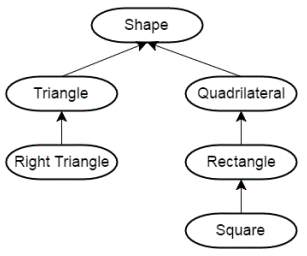
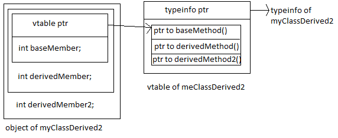

# 第十二章：类的进阶

## 1.运算符重载

### 1.使用 operator 关键字引入重载函数

1. 重载不能发明新的运算，不能改变运算的优先级与结合性，通常不改变运算含义
2. 函数参数个数与运算操作数个数相同，至少一个为类类型
3. 除 operator() 外其它运算符不能有缺省参数
4. 可以选择实现为成员函数与非成员函数
   1. 通常来说，实现为成员函数会以 *this 作为第一个操作数（[注意 == 与 <=> 的重载](https://en.cppreference.com/w/cpp/language/operators)

```c++
#include <iostream>

struct Str
{
    int val = 3;
    // 成员函数
    //通常，实现为成员函数会以 *this 作为第一个操作数（注意 == 与 <=> 的重载）
    // 实际已经接收了两个操作数，一个是Str类型的对象，一个是y
    auto operator () (int y = 4) // 可以加缺省参数
    {
        // 第一个()和 + 等价，描述运算符是什么
        // ()中引入多少参数不确定，所以此时可以引入缺省参数
        return val + y;
    }  
    
    // auto operator + (Str x, Str y)// 实际包含了三个参数，错误
    auto operator + (Str x)
    {
        Str res;
        res.val = val + x.val;
        return res;
    }
};

Str Add(Str &x, Str &y)
{
    Str z;
    z.val = x.val + y.val;
    return z;
}

// C++11还不支持 auto
auto operator + (Str &x, Str &y)// 函数的函数名
{
    Str z;
    z.val = x.val + y.val;
    return z;
}

auto operator + (Str2 &x, Str2 &y)// 函数的函数名
{
    // 也可以重载
}

//函数参数个数与运算操作数个数相同，至少一个为类类型
auto operator + (Str &x, Str &y, Str &z)// 函数的函数名
{
    // 可以包含1 or 2个参数，但绝不能包含3个及以上参数
    // 因为 + 本身是二元操作符
}
// 至少一个为类类型
auto operator + (int &x, double &y)
{
    // 不能都是内建数据类型，至少有一个是类类型or枚举类型
}

// 除 operator() 外其它运算符不能有缺省参数
auto operator + (Str x, Str y = Str{})// 错误
{
    //
}

int main()
{
    Str x;
    Str y;
    Str z = Add(x, y);   // x + y  更简洁明了，+ 运算符重载
    // 希望实现Str的 x + y, 运算符重载
    Str z = x + y;
    std::cout << z.val << std::endl;
    std::cout << x(5) << std::endl;
    // 打出 8, 也可以x(), 使用缺省参数; ()中引入多少参数不确定，所以此时可以引入缺省参数
    
    //operator +定义在类内
    Str z = x + y;
    // 注意，x对应缺省参数，*this对应的缺省Str类型参数
    // 实参 y 对应形参 Str x
}

```

### [2.根据重载特性，可以将运算符进一步划分](https://en.cppreference.com/w/cpp/language/operators)

1. 可重载且必须实现为成员函数的运算符（ =,[],(),-> 与转型运算符）
2. 可重载且可以实现为非成员函数的运算符
3. **可重载但不建议重载的运算符**（ &&, ||, 逗号运算符）	
   1. C++17 中规定了相应的求值顺序但没有方式实现短路逻辑
4. 不可重载的运算符（如 ? ：运算符）

### 3.重载详述1

1. 对称运算符通常定义为非成员函数以支持**首个操作数的类型转换**
2. 移位运算符一定要定义为非成员函数，因为其首个操作数类型为流类型
3. 赋值运算符也可以接收一般参数
4. operator [] 通常返回引用
5. 自增、自减运算符的前缀、后缀重载方法
6. 使用解引用运算符（ * ）与成员访问运算符（ -> ）模拟指针行为
   1. 注意“ .” 运算符不能重载
   2.  “→” 会递归调用“→”操作
7. 使用函数调用运算符构造可调用对象

```c++
// 对称运算符通常定义为非成员函数以支持首个操作数的类型转换
// 对称运算符: 接收的两个操作数可以互换
#include <iostream>

struct Str
{
    Str(int x)
        : val(x)
        {}
    auto operator +(Str input) {
        return Str(val + input.val);
    }
    
    int val;
};

int main() {
    Str x = 3;
}


```

### 4.重载详述 2

1. 类型转换运算符
   1. 函数声明为 operator type() const 
   2. 与单参数构造函数一样，都引入了一种类型转换方式
   3. 注意避免引入歧义性与意料之外的行为
   4. explicit bool 的特殊性：用于条件表达式时会进行隐式类型转换
2. C++ 20 中对 == 与 <=> 的重载
   1. 通过 == 定义 !=
   2. 通过 <=> 定义多种比较逻辑
   3. 隐式交换操作数
   4. 注意 <=> 可返回的类型： strong_ordering, week_ordering, partial_ordering

## 2.类的继承

### 通过类的继承（派生）来引入“是一个”的关系

1. 通常采用 public 继承（ struct V.S. class ）
2. 注意：继承部分不是类的声明
3. 使用基类的指针或引用可以指向派生类对象
4. 静态类型 V.S. 动态类型
5. protected 限定符：派生类可访问



```c++
#include <iostream>
#include <string>
#include <vector>

// 通常采用 public 继承（ struct V.S. class ）
// 通常可以把public省略，此时struct缺省public继承
// 如果是class，缺省时是private继承

struct Base
{
    void fun() {}
};

struct Base2 : Base
{
};

//注意：继承部分不是类的声明
class Derive;

// Derive 派生自 Base
class Derive : public Base // public 公有继承
{
    // 好处
    // 使用基类的指针或引用可以指向派生类对象
};

class Derive : public Base2
{
    void fun() {}
};
class Derive2 : public Base2
{
};

int main() 
{
    Derive d; // Derive 直接继承自 Base
    Derive2 d2;
    // 通常不能使用不同的类型绑定
    //（某一个类型的指针绑定到另一个类型的对象）
    // 使用基类的指针或引用可以指向派生类对象
    Base& ref = d;
    Base* ptr = &d;
    
    // 静态类型 V.S. 动态类型
    // ref 类型为 Base&; ptr类型为 Base* ---- 静态类型（对编译器）
    // 动态类型：运行期为 ref 和 ptr 赋予的实际类型
    // 动态类型：ref 为 Derive& ;ptr类型为 Derive*
    
    ref.fun2();// 编译会报错，虽然ref的动态类型绑定到了Derive&，但是编译器无法接收，它只看静态类型
    ptr = &d2;// 不会报错，对应的静态类型不会发生改变，但是动态类型发生改变
    // 动态类型是在运行期知道的类型，可以在运行期发生改变
    // 静态类型在编译期知道，不可以发生改变
}
///////////////////////////////////////////////////////////////
// protected 限定符：派生类可访问
struct Base
{
public:
    void Fun() {}
protected:
    void proFun() {}
    int x;
private:
    void fun() {}
};

class Derive : public Base
{
public:
    void fun2() {
        // fun(); // 也无法访问
        Fun(); // public 可以访问
        proFun();// protected 可以调用
        x; // 对于数据成员也一样
    }
};

int main()
{
    Base b;
    // b.fun();// 错误，private，不能在类外调用

    Derive d;
    d.Fun();// 可以运行
    // b.proFun(); d.proFun() 都不能调用（类外）
    d.fun2();
}
```

### 类的派生会形成嵌套域

1. 派生类所在域位于基类内部
2. 派生类中的名称定义会覆盖基类
3. 使用域操作符显式访问基类成员
4. 在派生类中调用基类的构造函数

```c++
#include <iostream>
#include <string>
#include <vector>

struct Base
{
public:
    void Fun() {}
    int val = 2;
protected:
    void proFun() {}
    int x;
private:
    void fun() {}
};
// 4.在派生类中调用基类的构造函数
class Derive : public Base
    // Derive 派生自 Base，相当于Base是一个大的域，
    // Derive 嵌套在 Base 中
{
public:
    Derive()
    {
        std::cout << "Derive Constructor is called." << std::endl;
    }
    void fun2() {
        proFun();
        x; 
        std::cout << val << std::endl;
        // 打印出 3 
        // 先在 Derive 域中找，再去 Base
        // 3.使用域操作符显式访问基类成员
        std::cout << Base::val << std::endl;// 显式操作
    }
    int val = 3; // 去掉后打印Base中的val
};
// 1. 派生类所在域位于基类内部
// 2. 派生类中的名称定义会覆盖基类
int d; // 
int main()
{
    Derive d; // 会把全局域中同名的 d 掩盖掉
    d.fun2();
    {
        
    }
    std::cout << d.val << std::endl;
}
///////////////////////////////////////////////////////////////
// 4.在派生类中调用基类的构造函数
struct Base
{
    Base()
    // Base(int)
    {
        std::cout << "Base Constructor is called." << std::endl;
    }
};
class Derive : public Base
{
public:
    Derive()
    // Derive(int a) // Derive 会调用Base构造函数，但是在缺省情况下，只会尝试去调用Base的缺省构造函数；此时需要在Derive中显式调用Base构造函数：先完成基类的构造，再完成派生类的构造
    {
        std::cout << "Derive Constructor is called." << std::endl;
    }
};

int main()
{
    Derive d;
    //Base Constructor is called.
    //Derive Constructor is called.
}
///////////////////////////////////////////////////////////////
// 4.在派生类中调用基类的构造函数
struct Base
{
    // 初始化列表只对构造函数有用
    Base(int)
    {
        std::cout << "Base Constructor is called." << std::endl;
    }
};
class Derive : public Base
{
public:
    Derive(int a) // 用初始化列表 显式调用基类的构造函数
        : Base(a) // 不需要域构造符指定Base::Base(a)
    {
        // 此时需要在Derive中显式调用Base构造函数：
        // 先完成基类的构造，再完成派生类的构造
        // Base::Base(a) // 此处不行
        // 当执行至此时，初始化的部分已经完成了
        std::cout << "Derive Constructor is called." << std::endl;
    }
};

int main()
{
    Derive d;
}

```

### 虚函数

1. #### 通过虚函数与引用（指针）实现动态绑定

   

   1. 使用关键字 virtual 引入
   2. 非静态、非构造函数可声明为虚函数
   3. 虚函数会引入 [vtable 结构](https://www.avabodh.com/cxxin/multivirtual.html)
      1. dynamic_cast
      2. 好处：
         1. 整个类的对象中包含typeinfo，它是一个动态类型

2. #### 虚函数在基类中的定义

   1. 引入缺省逻辑
   2. 可以通过 = 0 声明纯虚函数，相应地构造抽象基类

3. #### 虚函数在派生类中的重写（ override ）

   1. 函数签名保持不变（返回类型可以是原始返回指针 / 引用类型的派生指针 / 引用类型）
   2. 虚函数特性保持不变
   3. override 关键字

4. #### 由虚函数所引入的动态绑定属于运行期行为，与编译期行为有所区别

   1. 虚函数的缺省实参只会考虑静态类型
   2. 虚函数的调用成本高于非虚函数
      1. final 关键字
   3. 为什么要使用指针（或引用）引入动态绑定
   4. 在构造函数中调用虚函数要小心
   5. 派生类的析构函数会隐式调用基类的析构函数
   6. 通常来说要将基类的析构函数声明为 virtual 的 
   7. 在派生类中修改虚函数的访问权限

```c++
#include <iostream>
#include <string>
#include <vector>

// 对于构造任何虚函数，都会引入vtable的结构
// 好处1.引入动态类型 typeinfo
struct Base
{
    virtual void baseMethod() {}
    int baseMember;
};
struct myClassDerived : public Base
{
	virtual void derivedMethod() {}
    int derivedMember;
};
struct myClassDerived2 : public myClassDerived
{
	virtual void derivedMethod2() {}
    int derivedMember2;
};
int main()
{
    myClassDerived2 d;
    Base& b = d;
    Base* ptr = &d;
    // 上述转换是派生类转换为基类，描述了 “是一个” 的关系
    // 反过来不行，基类的引用or指针转换为派生类的不可以；因为基类->派生类的转换本质上是静态类型->动态类型的转换，静态类型不一定对应动态类型，转换会出错。为了引入相对安全的转换，利用 dynamic_cast
    myClassDerived2& d2 = dynamic_cast<myClassDerived2&>(b);
    myClassDerived2* ptr2 = dynamic_cast<myClassDerived2*>(ptr);
    // 此时支持编译并运行，是因为系统中包含了 typeinfo
    // typeinfo 由 vtable 引入
    // vtable 是因为我们定义了 virtual引入
    // Base中的虚函数注释掉则会报错，即基类不支持多态
}
//////////////////////////////////
int main()
{
    myClassDerived2 d;
    myClassDerived& b = d;
    myClassDerived* ptr = &d;
    // 此时需要 myClassDerived 中有虚函数
    myClassDerived2& d2 = dynamic_cast<myClassDerived2&>(b);
    myClassDerived2* ptr2 = dynamic_cast<myClassDerived2*>(ptr);
    // 对于 dynamic_cast
    // 转换指针：对于要把基类的指针转换为派生类的指针，如果基类的指针指向的确实是派生类的地址，转换成功；否则返回 nullptr
    // 转换引用：如果基类的引用确实绑定到派生类的引用，转换成功；否则，动态类型不匹配，抛出异常；异常会在最后一章讨论
    // dynamic_cast 是在运行期发生的，需要花时间（还不少）；
    // 需要通过 vtable 指针获取 vtable，通过vtable查找typeinfo
}
//////////////////////////////////
int main()
{    
    myClassDerived2 d;
    Base& b = d;
    Base* ptr = &d;
    // 因为myClassDerived2继承自myClassDerived，因此如下转换也可以
    // 这样的转换过程是要在 dynamic_cast 中计算完成的，即运行期计算，较耗时，一般高性能，dynamic_cast慎用
    myClassDerived& d2 = dynamic_cast<myClassDerived&>(b);
    myClassDerived* ptr2 = dynamic_cast<myClassDerived*>(ptr);
}

```

```c++
// 虚函数在基类中的定义
// 1. 引入缺省逻辑
// 2. 可以通过 = 0 声明纯虚函数，相应地构造抽象基类
#include <iostream>
#include <string>
#include <vector>

struct Base
{
    // 1. 在基类中引入缺省逻辑
    virtual void fun() // 缺省虚函数
    {
        std::cout << "Base::fun() is called." << std::endl;
    }
};

struct Derive : Base
{
    // Derive 派生自 Base
    // fun()是 public的
    // 虚函数在派生类中的重写（ override ）
    void fun()
    {
        std::cout << "Derive::fun() is called." << std::endl;
    }
};

int main()
{
    Derive d;
    d.fun();
    
    Base& b = d;// 即使是 Base& 打出的也是Derive::fun() is called.
    b.fun();
    // 此时打印的也是 Derive::fun() is called.
    // 因为引入虚函数，构造vtable
    
    // 注意，如果Base没有使用虚函数定义，打印的是 Base::fun() is called.
    // 这意味着：1.在派生类确实可以覆盖基类的行为；
    // 2.调用派生类的函数必须使用派生类的对象而不能是基类的对象
    // 因为没有虚函数的定义相当于没有vtable，即所有的调用都在编译期时绑定，同时，编译期只看静态类型，因此调用 Base::fun()
    
}
//////////////////////////////////
// 虚函数在派生类中的重写（ override ）//区分overload 重载
// 1. 函数签名保持不变
//   （返回类型可以是原始返回指针 / 引用类型的派生指针 / 引用类型）
// 2. 虚函数特性保持不变
// 3. override 关键字
struct Base
{
    virtual void fun()
    {
        std::cout << "Base::fun() is called." << std::endl;
    }
};
struct Derive : Base
{
    void fun()
    {
        std::cout << "Derive::fun() is called." << std::endl;
    }
};

// 同样调用proc，由于传递类型不一样，表现出了不同的行为
// 称之为： 动态多态（通过动态类型实现的运行期的多态）
// 动态多态实际上是基于派生类和基类实现的
void proc(Base& b)
{
    b.fun();
}

int main()
{
    Derive d;
    proc(d);// 这样调用本质是拿d去初始化d
    // 调用 Derive::fun()
    
    Base b;
    proc(b);// 调用Base::fun
    // proc 
}
//////////////////////////////////
// 函数签名保持不变
// （返回类型可以是原始返回指针 / 引用类型的派生指针 / 引用类型）
struct Base2 {};
struct Derive2 : Base2 {};
struct Base
{
    // 虚函数仅限于这样的修改
    virtual Base2& fun()
    // virtual void fun()
    {
        std::cout << "Base::fun() is called." << std::endl;
        static Base2 b;
        return b;
        
    }
};
struct Derive : Base
{
    Derive2& fun()
    //int fun() // 错误，return type不匹配，改了虚函数，函数签名不一样
    // void fun(int ) // 能编译，但是打印出来的是Base::fun()
    // 此时，构成的不是override关系，而是overload，两个函数签名的参数列表不一样，Derive会获取Base中的fun()作为重载
    {
        std::cout << "Derive::fun() is called." << std::endl;
        static Derive2 inst;
        return inst;
        // return 3;
    }
};
void proc(Base& b)
{
    b.fun();
}

int main()
{
    Derive d;
    proc(d);
    
    Base b;
    proc(b);
}
//////////////////////////////////
// 定义纯虚函数
struct Base
{
	virtual void fun() = 0; // 定义纯虚函数
    // 可以通过 = 0 声明纯虚函数，相应地构造抽象基类
    // 纯虚函数在基类中定义，可能的目的：引入缺省逻辑
    // 功能1.在 vtable 中开个槽，调用函数需要通过vtable找到这个槽去调用，= 0 大概率就是为了开个槽，这个指针并不指向具体的逻辑；想表达的意思是：这实际上是一个接口，需要在基类中有这个接口，然后在派生类中可能没有给缺省的实现，但是要求在派生类中实现这样的接口，
    // 2. 可能指向一个函数，为这个函数引入缺省逻辑
    
    // 本质：在派生类中引入了这样的接口，但是派生类太抽象了，不知道如何给它引入缺省逻辑，所以在基类中可以直接=0，然后再在派生类中给出具体的实现。所以相当于是开了个槽的作用
    // 同时，这个类叫做抽象基类（包含纯虚函数）特性：不能声明抽象基类的对象；但是可以声明它的指针or引用指向一个派生类

};
struct Derive : Base
{
    void fun()
    {
        std::cout << "Derive::fun() is called." << std::endl;
    }
};
struct Derive2 : Base
{
    // 合法
};
void proc(Base& b)
{
    b.fun();
}

int main()
{
    Derive d;
    proc(d);
    // 这个类叫做抽象基类（包含纯虚函数）特性：不能声明抽象基类的对象；但是可以声明它的指针or引用指向一个派生类
    Base& b = d;
    proc(b);
    // Derive2 d2;//但是无法构造Derive2类型的对象，这是因为它派生自Base，Base中有纯虚函数，Derive2并没有对这个纯虚函数进行重写，因此这个fun()还是个纯虚函数，因此Derive2还是一个抽象基类
    
    // 如果包含纯虚函数，想构造出相应的对象，就必须把所有的纯虚函数都进行重写
}
//////////////////////////////////
struct Base
{
	virtual void fun() = 0;
};
struct Derive : Base
{
    void fun()
    {
        std::cout << "Derive::fun() is called." << std::endl;
    }
};
struct Derive2 : Derive // 继承自Derive，不再是纯虚函数
{ // 因此，Derive2 不再是抽象基类，可被构造对象
};
void proc(Base& b)
{
    b.fun();
}
int main()
{
    Derive d;
    proc(d);    
    Derive2 d2;
}
//////////////////////////////////
// 给纯虚函数引入定义
struct Base
{
	virtual void fun() = 0;
};
// 要求1：不能在类内部定义，必须在类外部定义
void Base::fun()
{
    std::cout << "Base::fun() is called." << std::endl;
}
// 2.为纯虚函数引入定义，应用非常少
// 即便对纯虚函数引入定义，这并不改变 Base 是一个抽象基类的本质
// 还是不能 Base b; 无法构造出来
struct Derive : Base
{
    void fun()
    {
        Base::fun();// 需要使用域操作符显式调用，才能使用
        std::cout << "Derive::fun() is called." << std::endl;
    }
};
// 什么情况需要给纯虚函数给出定义：在基类中不知道它缺省的实现是怎么样的；
// 要求派生类必须给出具体实现；
// 虽然不知道缺省实现是怎么样的，但可能会知道缺省实现中包含一些辅助逻辑，比如这些辅助逻辑是能放到具体实现的开头来调用的；此时，可以利用纯虚函数的定义，来引入这个辅助逻辑。
// 即便如此，给纯虚函数引入定义使用较少
///////////////////////////////////////////////////////////////
// 虚函数特性保持不变
struct Base
{
	virtual void fun()
    {
        std::cout << "Base::fun() is called." << std::endl;
    }
};
struct Derive : Base
{
    void fun() // 没有引入 virtual
        // 但只要在基类中声明是虚函数，它还是虚函数
    {
        std::cout << "Derive::fun() is called." << std::endl;
    }
};
struct Derive2 : Derive
{
    void fun() // 仍然是虚函数
    {
        std::cout << "Derive::fun() is called." << std::endl;
    }
};
///////////////////////////////////////////////////////////////
// override 关键字，更好地检查重写情况
struct Base
{
	virtual void fun()
    {
        std::cout << "Base::fun() is called." << std::endl;
    }
};
struct Derive : Base
{
    // void fun(int) // 重载关系
    // void fnu() // 不相关, 希望编译期给出报错信息
    void fun() override // 此时显式声明它是一个重写函数，上述情况就可以报错了
    {
        std::cout << "Derive::fun() is called." << std::endl;
    }
};
```

```c++
/*
由虚函数所引入的动态绑定属于运行期行为，与编译期行为有所区别
	虚函数的缺省实参只会考虑静态类型
	虚函数的调用成本高于非虚函数
		final 关键字
	为什么要使用指针（或引用）引入动态绑定
	在构造函数中调用虚函数要小心
	派生类的析构函数会隐式调用基类的析构函数
	通常来说要将基类的析构函数声明为 virtual 的 
	在派生类中修改虚函数的访问权限
*/
///////////////////////////////////////////////////////////////
#include <iostream>
#include <string>
#include <vector>

struct Base
{
	virtual void fun(int x = 3)
    {
        std::cout << "Base: " << x << std::endl;
    }
};
struct Derive : Base
{
    // 加入 final 关键字，告诉编译器接下来会有一些类派生自 Derive，但是派生自 Derive 的新的类，都不会对 fun() 这个虚函数再进行重写；编译器能在一定程度上优化原有的 vtable 的结构，从而使性能在一定程度上得到提升。
    void fun(int x = 4) override final
    {
        std::cout << "Derive: " << x << std::endl;
    }
};
void proc(Base& b)
{
    b.fun();
    // 在C++ insight中，被翻译成：
    // b.fun(3); // 编译期完成
    
    // 在编译期只知道它的静态类型，因此缺省能够选择的范围有限，将对应的值直接填进去
}
int main()
{
    // 虚函数的缺省实参只会考虑静态类型
    Derive d;
    proc(d); // 系统打印的是 Derive: 3
    // 选择 3 而不是 4 ，这是因为虚函数的缺省实参只会考虑静态类型
}
///////////////////////////////////////////////////////////////
// 虚函数的调用成本高于非虚函数
// 对于非虚函数：函数的位置在编译后直接固定下来，翻译成汇编代码，调用是时参数压栈，跳转到函数对应的具体的位置再执行即可。
// 对于虚函数，在运行期调用哪一个函数本质是通过函数指针实现的，函数指针本身是一个相对较慢的实现：先到 vtable 指针中获取 vtable 的地址，在槽中找到对应的函数的地址，找到地址后再跳转到相应的函数中。
// 因此，C++缺省情况下，不会把函数声明成虚函数，必须显式添加 virtual
// java 没有虚函数的概念，换句话说，java所有的函数都是虚函数；虚函数是比较容易使用的
// 引入虚函数，在派生类中修改虚函数：希望相应的对象调用修改后的逻辑。
// 好处：对用户友好
///////////////////////////////////////////////////////////////
// final 关键字
// 在 vtable 中查找函数较慢，运行期行为
// 加入 final 关键字，告诉编译器接下来会有一些类派生自 Derive，但是派生自 Derive 的新的类，都不会对 fun() 这个虚函数再进行重写；编译器能在一定程度上优化原有的 vtable 的结构，从而使性能在一定程度上得到提升。
// 考虑类中定义了很多虚函数，一个派生类可能对很多虚函数进行重写，
// 比如一个派生类中对10个虚函数进行重写，并在接下来不会对这10个虚函数引入任何修改，此时解决方案：1.对 10 个虚函数都加final关键字，提升一定性能；2.通常情况下不会再修改意味着这个类不再会被派生，（类的派生和虚函数紧密相关），如果一个派生类的虚函数都是final，那此时可以在这个类定义处加上final
struct Derive final : Base
// 不会有派生类派生自它，类中虚函数也不会再被修改

struct Derive2 : Derive // 此时就会报错了
///////////////////////////////////////////////////////////////
// 为什么要使用指针（或引用）引入动态绑定
struct Base
{
	virtual void fun()
    {
        std::cout << "Base::fun() is called." << std::endl;
    }
};
struct Derive : Base
{
    void fun() override final
    {
        std::cout << "Derive::fun() is called." << y <<std::endl;
        // 如果构造Base打印的是Derive的版本，程序出错，因为不知道y是啥
    }
    int y;
};
void proc(Base b) // 此时调用Base::fun()
    // 注意Derive派生自Base，因此先会把Base构造出来，在构造过程中所有的虚函数都是和Base相匹配的，构造完之后再构造Derive（相当于是额外部分），此时会将原始虚函数的指针指向函数具体的位置替换成override的，这是编译器实现的过程，因此会产生以下影响：
    // Base b 会使用d来构造Base b，d是一个派生类可以被隐式转换成基类，但是构造b的结果的虚函数一定是Base::fun()版本
{
    b.fun();
}
// Base& b 使用引用或指针时不一样，因为并不会构造一个实际的对象，指向原始的对象
int main() {
    Derive d;
    proc(d);
}
///////////////////////////////////////////////////////////////
// 在构造函数中调用虚函数要小心
struct Base
{
    Base()
    {
        // 此时Base()已经构造好了
        fun();
    }
	virtual void fun()
    {
        std::cout << "Base: " << std::endl;
    }
};
struct Derive : Base
{
    Derive()
        : Base() // 此时还没构造好Derive，调用Base()
        {
            fun();// 此时Derive构造完毕，打印Derive
        }
    void fun() override final
    {
        std::cout << "Derive: " << std::endl;
    }
};

int main()
{
    Derive d;
}
///////////////////////////////////////////////////////////////
// 派生类的析构函数会隐式调用基类的析构函数
struct Base
{
    virtual ~Base() // 这样可以保证析构时肯定会调用Derive再调用Base
    ~Base()
    {
        std::cout << "Base: " << std::endl;
    }
};
struct Derive : Base
{
    ~Derive(){
        std::cout << "Derive: " << std::endl;
    }
};

int main()
{
    Derive* d = new Derive();
    delete d;
    // 先打印出Derive: 再打印Base:
    // 构造时先构造Base，再构造Derive
    // 析构时先析构Derive，析构Base
    // 先构造后删除原则
}
/////////////////
int main(){
    Derive* d = new Derive();
    // 整点花的
    Base* b = d;
    delete b;
    // 系统未定义的行为，大概率只会调用Base的析构
    // delete 干了两件事，1.调用类的析构，2.释放内存
    // 对于第一点，是在编译器确定的
}
/////////////////
#include <memory>
int main()
{
    // C++ 不能控制这样的行为
    std::shared_ptr<Base> ptr(new Derive()); 
    // 调用了 Derive 和 Base
    
    std::unique_ptr<Base> ptr(new Derive()); 
    // 只调用了 Base 的析构
}

virtual ~Base() // 保证析构时先调用 Derive 再调用 Base
// 此时 ~Base() 和 ~Derive() 都是虚函数；因此编译删除时会查找vtable对应的槽，对于 Derive 构造的对象，动态类型，Derive 的指针；对于 Derive 析构一定会调用 ~Derive()；C++规定，调用虚函数的析构后，一定会调用基类的析构。
    
// 引申：
// 1. virtual ~Base() = default; // C++11，基类中，目的：把析构函数搞成virtual，后面所有派生于它的析构函数都是 virtual；这样后续操作会比较和谐；
// 2. 是否基类中的析构函数一定要定义成虚函数？不是，当使用基类的指针来删除派生类的对象时，行为不确定，需要。如果使用派生类的指针删除，则不需要
// 什么时候使用派生类的指针而不是基类的指针？实际上是有的，但是大部分情况下，定义派生结构和引入虚函数，通常需要基类的指针或引用来绑定派生类的对象；当派生类是一个泛型类，基类里面实现了一些特定功能，泛型类派生自基类，将这些功能拿过来作为泛型类的一些接口，此时会直接用泛型类的指针，这种情况下基类的析构函数就不需要声明成虚函数（因为虚函数调用成本高）
 ///////////////////////////////////////////////////////////////
// 在派生类中修改虚函数的访问权限
struct Base
{
// protected:
private:
	virtual void fun()
    {
        std::cout << "Base: " << std::endl;
    }
};
struct Derive final : Base
{
public:
    void fun() override
    {
        // Base::fun(); // 不行，private 只能类内访问，派生类也不能访问
        // 编译期就不行
        std::cout << "Derive: " << std::endl;
    }
};

int main()
{
    Derive d;
    d.fun(); // Derive::fun() 是 public 的
    
    Base& b = d;
    b.fun(); // 此时报错，因为编译期考虑静态类型，绑定为 Base::fun()
}   
    
    
```

### 继承与特殊成员函数

1. 派生类合成的...
   1. 缺省构造函数会隐式调用**基类**的缺省构造函数
   2. 拷贝构造函数将隐式调用**基类**的拷贝构造函数
   3. 赋值函数将隐式调用**基类**的赋值函数
2. 派生类的析构函数会调用基类的析构函数
3. 派生类的其它构造函数将隐式调用基类的缺省构造函数
4. 所有的特殊成员函数在显式定义时都可能需要显式调用基类相关成员
5. 构造与销毁顺序
   1. 基类的构造函数会先调用，之后才涉及到派生类中数据成员的构造
   2. 派生类中的数据成员会被先销毁，之后才涉及到基类的析构函数调用

```c++
#include <iostream>
#include <memory>

struct Base
{
    Base() // 缺省构造函数
    {
        std::cout << "Base default constructor is called " << std::endl;
    }
    // Base(int) 可能对于这个类而言有意义，但是这个意义并不能像缺省、拷贝、赋值、析构函数推广到其他的类；意义不固定，编译器不敢用
    Base(int) 
    {
        std::cout << "Base constructor 2 is called " << std::endl;
    }
    
    Base(const Base& val) // 拷贝构造函数
    {
        std::cout << "Base copy constructor is called " << std::endl;
    }
    Base& operator = (const Base&) // 赋值函数
    {
        std::cout << "Base assignment is called " << std::endl;
    }
    
    ~Base()
    {
        std::cout << "Base destructor is called " << std::endl;
    }
};

struct Derive : Base
{
    // Derive() = default;  // 这样也是从基类中调用合成
    // Derive(const Derive& val) = default; // 编译器所合成的拷贝构造函数会调用基类的拷贝构造函数
    // Derive(const Derive& val){}    // 派生类的其它构造函数将隐式调用基类的缺省构造函数，这时候编译器调用的也是缺省 Base() 
    // Derive& operator = (const Derive&) = default;
    // 派生类的析构函数会调用基类的析构函数
    // Derive(int) {}
    ~Derive()
    {
        std::cout << "Derive destructor is called " << std::endl;
    }
    
   // 所有的特殊成员函数在显式定义时都可能需要显式调用基类相关成员
   // 通过初始化列表
   Derive()
       : Base(0) // Base constructor 2 is called
   {}
   Derive(const Derive& input)
       : Base(input) // Base copy constructor is called
   {
           
   }
   Derive& operator = (const Derive& val)
   {
       Base::operator = (val);
       return *this;
   }
};

int main()
{
    /// 缺省构造函数会隐式调用 基类 的缺省构造函数
    // Derive 中没有显式给出相关的构造函数的实现，系统会合成一个，考虑基类的相关构造函数
    Derive d;     // Base default constructor is called
    // 拷贝构造函数将隐式调用 基类 的拷贝构造函数
    Derive x(d);  // Base copy constructor is called
    // 赋值函数将隐式调用 基类 的赋值函数
    x = d;        // Base assignment is called

    /// 派生类的其它构造函数将隐式调用基类的缺省构造函数
    Derive d(3); // 此时输出 Base default constructor is called
    // 而不是 int 那个; 
    // 特殊的构造函数：缺省、拷贝、赋值、析构，这些函数是有明确的意义的
    // 因此在派生类中，可以用它们固有的意义去调用（派生类的构造->用基类构造...）
    // 缺省构造函数：不需要提供任何参数，目的是构造对象，即便构造出来是缺省状态（没提供任何参数）
    // 拷贝构造、赋值函数：进行对象的赋值
    // 析构函数：对象的销毁

}
// 构造与销毁顺序
// 1. 基类的构造函数会先调用，之后才涉及到派生类中数据成员的构造
// 2. 派生类中的数据成员会被先销毁，之后才涉及到基类的析构函数调用


```

### 补充知识

1. [public 与 private 继承](https://www.programiz.com/cpp-programming/public-protected-private-inheritance)
   1. public 继承：描述 “是一个” 的关系
   2. private 继承：描述 “根据基类实现出” 的关系
   3. protected 继承：几乎不会使用
2. using 与继承
   1. 使用 using 改变基类成员的访问权限（能干，但通常不这么干）
      1. 派生类可以访问该成员
      2. 无法改变构造函数的访问权限
   2. **使用 using 继承基类的构造函数逻辑** （较常用）
   3. using 与部分重写
3. 继承与友元
   1. 友元关系无法继承，但基类的友元可以访问派生类中基类的相关成员
4. 通过基类指针实现在容器中保存不同类型对象
5. 多重继承与虚继承
6. 空基类优化与[ [ [no_unique_address](https://en.cppreference.com/w/cpp/language/ebo) ] ]属性

```c++
#include <iostream>

struct Base
{
public:
    //..
    // 1. public 继承：描述 “是一个” 的关系
private:
    //..
    // 2. private 继承：描述 “根据基类实现出” 的关系
    // 对于派生类不可见
protected:
    //..
    // 3. protected 继承：几乎不会使用
    // 对于派生类可见，但是之外不可使用
};

// 注意，无论采取什么样的方式继承，基类中的public/private/protected对于派生类的影响都是一样的
struct Derive : protected Base
{
};
///////////////////////////////////////////////////////////////
class Base {
  public:
    int x;
  protected:
    int y;
  private:
    int z;
};

class PublicDerived: public Base {
  // x is public
  // y is protected
  // z is not accessible from PublicDerived
};

class ProtectedDerived: protected Base {
  // x is protected
  // y is protected
  // z is not accessible from ProtectedDerived
};

class PrivateDerived: private Base {
  // x is private
  // y is private
  // z is not accessible from PrivateDerived
};
///////////////////////////////////////////////////////////////
```

```c++
/*
	using 与继承
	1. 使用 using 改变基类成员的访问权限
   		1. 派生类可以访问该成员
   		2. 无法改变构造函数的访问权限
	2. 使用 using 继承基类的构造函数逻辑
	3. using 与部分重写
*/

struct Base {
public:
    int x;
    void fun(int) {}
private:
    int y;
protected:
    Base(int val) {}
    int z;
    void fun() {}
};

struct Derive : public Base
{
public:
    // 1.派生类可以访问该成员
    using Base::z; // 使用 using 改变基类成员的访问权限
    // using Base::y; // 对于基类的 private ，派生类不可见
    using Base::fun; // 对函数也可以，但只是给出一个函数的名称fun 而不是fun()
    // 把所有名称为fun的函数，都放到 public 中；
    // using Base::Base; // 2. 无法改变构造函数的访问权限
private:
    using Base::x; // 权限改变
};

int main()
{
    Derive d;
    d.z;
    d.fun();
}
///////////////////////////////////////////////////////////////
// 使用 using 继承基类的构造函数逻辑
struct Base {
public:
    Base(int val) {}
};

// Derive 派生自 Base，且没有引入新的数据成员；
// 这种情况，可能对于 Base 的构造函数，直接拿到 Derive 中用就可以
// 1.重新定义这些构造函数，这些构造函数再显式调用 Base
// 2.Base 中构造函数较多，一一对应较慢，此时使用 using Base::Base，能把所有的构造函数拿过来，在 Derive 就能完成相应的构造
struct Derive : public Base
{
public:
    using Base::Base;
};
///////////////////////////////////////////////////////////////
// using 与部分重写
struct Base {
protected:
  virtual void fun() {
      std::cout << "1\n";
  }
  virtual void fun(int) {
      std::cout << "2\n";
  } 
};

struct Derive : public Base
{
public:
    using Base::fun; // 改变函数访问权限, 且它们仍是虚函数
    // 在引入这个之前，系统会判断Derive是否引入了对 fun 的重写，因此系统只会引入Base::fun()；换言之，using 的优先级低于重写的优先级
    
    // 此时还希望能重新定义函数，能做到
    void fun(int) override
    {
      std::cout << "3\n";
    }
private: // 注意，如果在private中重写 fun()；public 中也只会引入Base::fun()；
		// 且Derive::fun(int)无法被外部调用
};

int main()
{
    Derive d;
    d.fun();
    d.fun(3);
}
///////////////////////////////////////////////////////////////
// using 与部分重写的延申
struct Base
{
protected:
    // Base(int val) {} // 此时不行
    Base() {} // 缺省构造函数
    Base(const Base&) {} // 拷贝构造函数
};
// 先处理 Derive 的结构，发现 Derive 中没有显式定义缺省构造函数
// 因此，会合成缺省构造函数，特点：1.是 public 的；2.尝试调用 Base 中的构造函数
struct Derive : public Base
{
public:
    using Base::Base;  // 无法改变构造函数的访问权限
    // Derive() = default; // 相当于这样，编译器自动合成一个缺省构造函数
};

int main()
{
    Derive d;
    Derive d1(d);
}
```

```c++
// 继承与友元
// 1. 友元关系无法继承，但基类的友元可以访问派生类中基类的相关成员
#include <iostream>

struct Base
{
protected:
    // friend void fun(const Base&); // 放在这里可以
    int x = 10; // 访问权限限制，不能在类外访问
};
struct Derive : public Base
{
    // friend void fun(const Base&); // 此处不行，派生类的友元不能打破基类的封装
    friend void fun(const Derive&);
    // 友元关系无法继承
private:
    int y = 20;
};

//void fun(const Base& val)
void fun(const Derive& val)
{
    std::cout << val.x << std::endl; // 访问y没问题
}

int main()
{
    Derive d;
    fun(d);
}
///////////////////////////////////////////////////////////////
// 在基类中引入友元
// 基类的友元可以访问派生类中基类的相关成员
struct Derive;
struct Base
{
    // 接收 Derive，且它是 Base 的友元
    // Derive 派生自 Base，它的一部分对象是 Base 的；
    // 比如 Derive 对象存在 x，但 x 是隶属于 Base 的；
    // 而友元打破了 Base 的封装，因此 fun 可以访问 Base 的 X
    // 虽然传入的是 Derive，但仍可以访问 x
    friend void fun(const Derive&); // 需要提前声明 Derive
protected:
    int x = 10; // 访问权限限制，不能在类外访问
};
struct Derive : public Base
{
private:
    int y = 20;
};
void fun(const Derive& val)
{
    std::cout << val.x << std::endl; // 此时 y 不能访问
    // 只能访问 Derive 中属于 Base 的那部分，不能访问 Derive 的部分
}

int main()
{
    Derive d;
    fun(d);
}
```

```c++
// 1. 通过基类指针实现在容器中保存不同类型对象
#include <iostream>
#include <vector>
#include <memory>

struct Base
{  
    // 为什么定义double：虚函数，在派生类中重写，虚函数的返回类型得和基类一致
    // int 和 double 要返回一个公共类型的话，只能取 double
    // 对于保存不同类型的对象还是有限制，比如 int 和 string，两者没有公共对象
    virtual double GetValue() = 0;
    
    virtual ~Base() = default; // 声明析构为虚函数，保证析构可控
};

struct Derive : public Base
{
    // 定义构造函数
    Derive(int x)
        : val(x) {}
    double GetValue() override
    {
        return val;
    }
    int val;
};
struct Derive2 : public Base
{
    // 定义构造函数
    Derive2(double x)
        : val(x) {}
    double GetValue() override
    {
        return val;
    }
    double val;
};

int main()
{
    //Derive d;
    //Base* ptr; // 通过基类指针指向派生类的地址
    // 应用：内建数组or vector or list，保存的对象的类型是一致的
    // why ？ 这样实现非常简单，并能够满足大部分需求
    
    // vector 同时保存 int 和 double 类型
    // 如何实现：使用派生的方法，引入间接的层
    std::vector<std::shared_ptr<Base>> vec; // 保存 Base 指针，使用基类指针指向派生类的对象
    // 保存一个 int 一个 double
    vec.emplace_back(new Derive{1}); // 注意析构时是未定义的，应添加析构函数
    vec.emplace_back(new Derive2{3.14});
    // 如何使用 vec 里的数据，vec中的对象是 std::shared_ptr<Base>
    // 1.用dynamic_cast转换成Derive或Derive2的对象，转换完再返回对象
    // 2.提供虚函数
    
    std::cout << vec[0]->GetValue() << std::endl;
    std::cout << vec[1]->GetValue() << std::endl;
    
}
///////////////////////////////////////////////////////////////
// 2. 多重继承与虚继承（日常应用相对较少）
#include <iostream>
#include <vector>
#include <memory>

struct Base
{  
    virtual ~Base() = default;
    int x;
};

struct Base1 : virtual Base
{  
    virtual ~Base1() = default;
};
struct Base2 : virtual Base
{  
    virtual ~Base2() = default;
};
// 多重继承，场景：输入输出流
struct Derive : public Base1, public Base2 
   	// 可以用Base1或Base2指针保存Derive对象
{
};

int main()
{
    Derive d; // 包含 Base1 和 Base2 的对象；
    // Base1 派生自 Base，包含Base，Base2也是
    // 此时对 d.x 进行名称查找，发现Base1和Base2的基类Base中都包含x，此时不知道是那个x；此时需要引入虚继承
    d.x;
    // 虚继承：编译器在处理Derive时，发现Base1和Base2都派生自Base，且都是虚继承，此时编译器在我们构造的对象Derive中，只保存 Base 的一个实例
}

// 一些问题：继承完的内存布局是什么样的？如果使用Base1、2去访问Derive对象时，涉及到指针的隐式移动？
///////////////////////////////////////////////////////////////
// 3. 空基类优化与[ [ no_unique_address ] ]属性
#include <iostream>
#include <vector>
#include <memory>

struct Base
{  
    void fun()
    { 
    }
};
// 派生类的对象中要包含一块内存，这块内存用来表示基类的内存；
// 如果基类本身并不包含任何东西，那么这块内存可以被省去
struct Derive : public Base // 空基类优化（基类中不包含任何数据成员）
{
    int x;
    // Base b;
};

int main()
{
    Base a[10]; // 需要区分不同的对象
    a[0]         a[1]       // 两者地址应不同，意味着sizeof(Base)必须得是一个非零值
    *(a + 0)     *(a + 1)   // 相当于 a + 1*sizeof(Base) 的偏移量
    std::cout << sizeof(Base) << std::endl; // 打印出 1，加入void fun()也还是1
    //
    std::cout << sizeof(Derive) << std::endl; // 大小是4，int占4个字节
    // Base b 大小是1，为了内存对齐，此时一共占8个字节；这样的内存占用是不希望看到的，所以派生自Base，此时大小为 4 并且包含了Base中的对象——空基类优化
}
///////////////////////
// 因为有些时候Derive只想用Base中的函数， 并不想描述两者是 is a 的关系
// C++20 中引入 [ [ no_unique_address ] ]属性
struct Base
{  
    void fun()
    {   
    }
};
struct Derive
{
    int x;
    // Base b; // 此时 Derive 大小是8字节
    [[no_unique_address]] Base b; // 大小为 4
    // 描述：要在 Derive 中引入 Base b，目的是调用b中的成员实现一些相应的功能；但是不为 b 显式分配空间来保存。
    // 这样更好地描述程序设计意图，不要 is a 的关系，只是要使用 b 中的功能；C++20引入，对对象尺寸要求严格时使用（也可用空基类优化）
    
};

int main()
{
    std::cout << sizeof(Derive) << std::endl;
}
```

后续：深入看一些面向对象的设计，C++中类的内存布局
