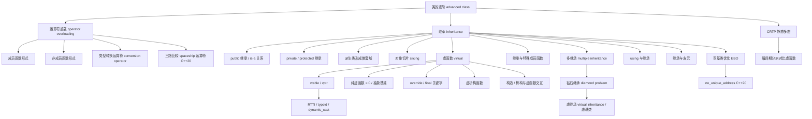
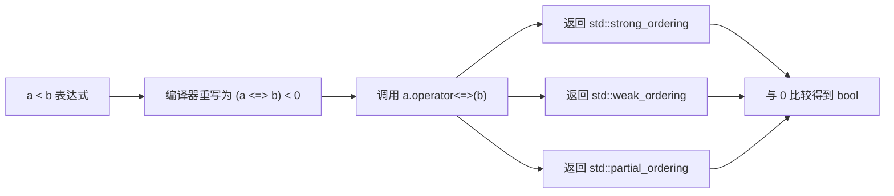
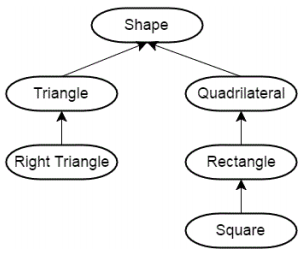
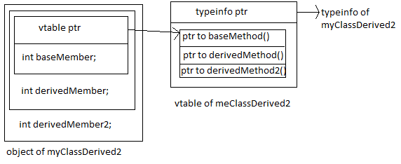
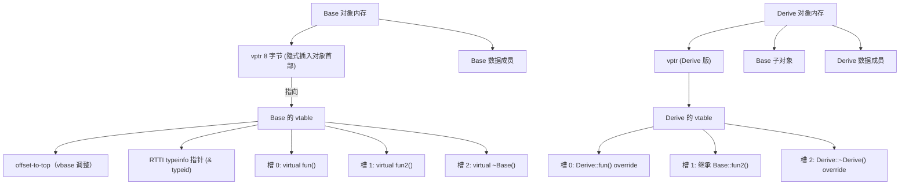
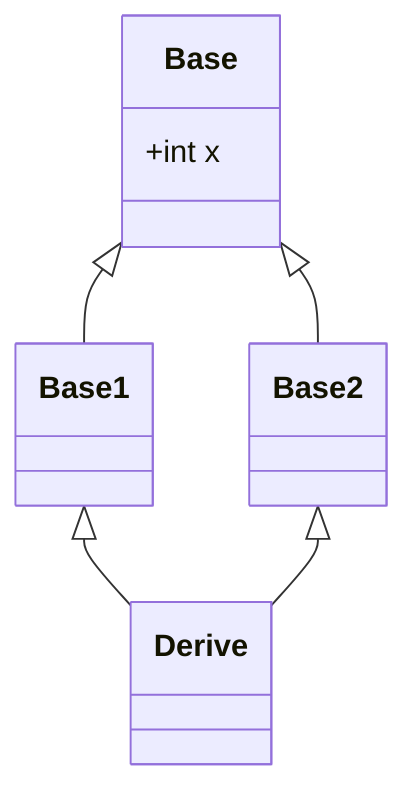
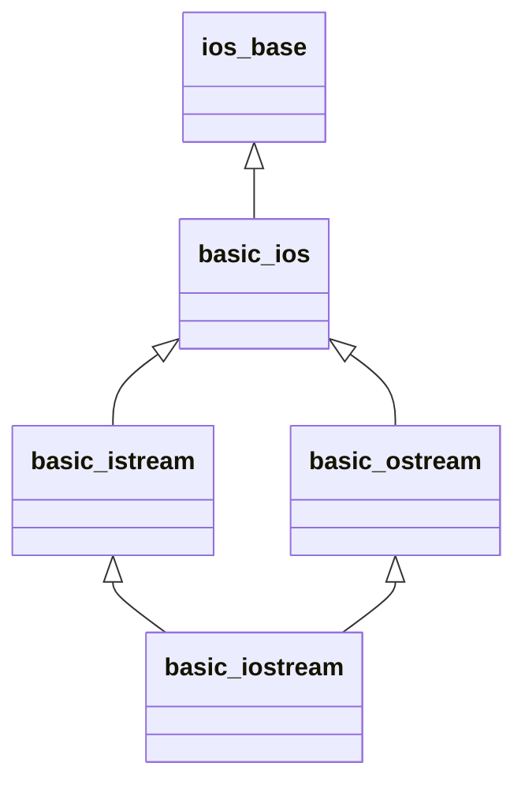

# 第十二章：类的进阶

> **一句话定义**：类的进阶（advanced class）以**运算符重载（operator overloading）**、**继承（inheritance）**、**虚函数（virtual）/ vtable / vptr**、**RTTI（`dynamic_cast` / `typeid`）**、**多继承与虚继承（virtual inheritance）**、**`override` / `final`** 等机制把第 11 章的「单一类」拓展为「**类层级（class hierarchy）**」，使 C++ 同时具备「**编译期静态分派**」与「**运行期动态多态（dynamic polymorphism）**」两种抽象能力；本章是 BZY C++ Notes 的「**原理版**」金样姐妹篇，重点剖析 vtable / vptr 在 Itanium C++ ABI 下的内存布局、构造析构与虚函数的相互作用、CRTP 静态多态替代方案，以及 C++20 三路比较 `<=>` 与 concepts 对继承层级的重塑。

## 章节知识框架


```mermaid
graph TD
  Adv[类的进阶 advanced class] --> Op[运算符重载 operator overloading]
  Adv --> Inh[继承 inheritance]
  Op --> OpMember[成员函数形式]
  Op --> OpNonMember[非成员函数形式]
  Op --> OpConv[类型转换运算符 conversion operator]
  Op --> OpSpaceship[三路比较 spaceship 运算符 C++20]
  Inh --> Public[public 继承 / is-a 关系]
  Inh --> PrivProt[private / protected 继承]
  Inh --> Scope[派生类形成嵌套域]
  Inh --> Slicing[对象切片 slicing]
  Inh --> Virtual[虚函数 virtual]
  Virtual --> Vtable[vtable / vptr]
  Vtable --> RTTI[RTTI / typeid / dynamic_cast]
  Virtual --> PureVirt[纯虚函数 = 0 / 抽象基类]
  Virtual --> Override[override / final 关键字]
  Virtual --> VirtDtor[虚析构函数]
  Virtual --> CtorDtorInter[构造 / 析构与虚函数交互]
  Inh --> Special[继承与特殊成员函数]
  Inh --> Multi[多继承 multiple inheritance]
  Multi --> Diamond[钻石继承 diamond problem]
  Diamond --> VirtBase[虚继承 virtual inheritance / 虚基类]
  Inh --> UsingDecl[using 与继承]
  Inh --> Friend[继承与友元]
  Inh --> EBO[空基类优化 EBO]
  EBO --> NoUniqueAddr[no_unique_address C++20]
  Adv --> CRTP[CRTP 静态多态]
  CRTP --> Static[编译期分派对比虚函数]
```

## 12.0 为什么需要类的进阶（设计动机 · Why advanced classes exist）

第 11 章把「**单个类**」打磨到能管理资源（RAII）、能定义生命周期（构造 / 拷贝 / 移动 / 析构）。但工业级 C++ 代码（GUI 框架 Qt、I/O 流 `<iostream>`、几何引擎、协议栈、AST 节点树）天然需要表达**抽象与变体**：「一个 `Shape` 可以是 `Circle` 也可以是 `Square`」、「一个 `Stream` 可以是文件流也可以是字符串流」。 这种抽象有两条互补路径：

1. **静态分派（static dispatch）**：模板 / CRTP / `if constexpr`，编译期决定调用哪个版本，零运行期代价，详见第 13 章金样。
2. **动态分派（dynamic dispatch）**：本章主题。通过 `virtual` 关键字告诉编译器：「调用此函数时，请通过 vtable 间接跳转到运行期对象的真实类型对应的实现」。代价是一次间接 call + 阻塞内联，收益是**接口与实现分离**、**二进制层面的开放扩展（OCP）**。

C++ 设计层的取舍（Stroustrup *Design and Evolution of C++* §11；ARM 1990 §10）：

- **零代价原则（zero-overhead rule）**：「**不为你不使用的特性付费**」。所以默认成员函数**不是虚函数**，必须显式 `virtual`；这与 Java 「所有方法默认虚」 形成鲜明对比。
- **C 兼容布局**：非虚类的对象布局等价于一个 C `struct`；引入第一个 `virtual` 时才插入 vptr（通常位于对象首部 8 字节）。
- **完全用户控制**：是否多态、是否抽象、虚基类如何共享 —— 全部由用户在源码层标注。

| 维度 | 静态多态（模板 / CRTP） | 动态多态（virtual + vtable） |
|---|---|---|
| 分派时机 | 编译期 | 运行期，通过 vptr / vtable |
| 内联 | 完全可内联 | 一般不内联（需 devirtualize） |
| 二进制开销 | 每实例化一份代码 | 每类一份 vtable + 每对象一个 vptr |
| 接口形式 | 隐式（duck typing），C++20 可显式（concepts） | 显式（基类虚接口 / 抽象类） |
| 扩展 | 需源码可见 | 二进制可扩展（动态加载插件） |
| ABI 影响 | 模板实例化签名进 ABI | vtable 布局 / `typeinfo` 进 ABI |
| 典型场景 | 容器、算法、策略对象、表达式模板 | 抽象工厂、GUI 树、解释器节点、I/O 流 |

> **金样口径**：本章每个 `####` 子节按 **Why → Mechanism（vtable / RTTI / 钻石问题内存布局）→ Standard Clause（N4861 §11.7 derived classes、§7.6.1.6 dynamic_cast、§6.7.3 type identification；Itanium C++ ABI vtable layout）→ Practice → Modern Replacement（concepts / CRTP / `final` / NVI / `<=>`）** 五段式展开。

---

## 1.运算符重载

### 1.0 节段动机

运算符重载（operator overloading）让用户定义类型获得**与内建类型同样的语法外观（syntactic uniformity）**：`a + b`、`c << x`、`p[i]`、`*it`、`f(x,y)`。配合第 11 章构造 / 析构、本章继承与虚函数，C++ 实现了「**抽象数据类型（ADT）即一等公民**」的目标（Stroustrup 1979 *Cfront* 设计文档）。

但运算符重载是**重度滥用磁石**：`operator<<` 既可以是流插入，也可能被误用为「移位」；`&&` / `||` / `,` 重载后会丢失短路语义。本节按「**合法形式 → 实现位置 → 现代替代**」三层组织。

### 1.使用 operator 关键字引入重载函数

1. 重载不能发明新的运算，不能改变运算的优先级与结合性，通常不改变运算含义
2. 函数参数个数与运算操作数个数相同，至少一个为类类型
3. 除 operator() 外其它运算符不能有缺省参数
4. 可以选择实现为成员函数与非成员函数
   1. 通常来说，实现为成员函数会以 *this 作为第一个操作数（[注意 == 与 <=> 的重载](https://en.cppreference.com/w/cpp/language/operators)

#### Why（为什么用 operator 关键字）

C++ 选择「**保留字 + 运算符记号**」组合 `operator+` / `operator<<` / `operator()` 来命名重载，而非像 Python 的 `__add__` 那种 dunder。原因有三：

- **语法对齐**：调用点写 `a + b`，函数声明里 `operator+` 直接对应运算符 token，便于读者把代码与重载查表对上。
- **可重载性约束的强制载体**：标准在 [over.oper] 明确列出可重载与不可重载集合；只要用了 `operator` 关键字，编译器即可静态约束。
- **保留运算符语义**：优先级、结合性、参数个数全部由 token 决定，不可由用户修改，所以 `a + b * c` 永远先算 `b * c`，无论是否重载。

#### Mechanism（编译器到底做了什么）

1. 词法分析时把 `operator` + 后续运算符 token 合并为一个 identifier，登记到名字表。
2. 调用点 `a + b` 触发**重载解析（overload resolution，[over.match]）**：
   - 候选集 = 内建运算符 + 成员 `operator+` + 命名空间内 / ADL 找到的非成员 `operator+`。
   - 按转换序列等级排序，选最佳。
3. 对于 `a + b`：若是成员函数，重写为 `a.operator+(b)`（左操作数自动成为 `*this`）；若是非成员函数，重写为 `operator+(a, b)`。
4. 三大约束硬编码于规则：
   - **参数个数 = 运算符元数**（一元一个、二元两个；成员函数隐含一个 `*this`）。
   - **至少一个操作数是类 / 枚举类型**（[over.oper]/6），不允许 `operator+(int,int)` 这种「污染内建运算」。
   - **除 `operator()` 外不得有缺省实参**（[over.call] / [over.oper]/8）。

```c++
#include <iostream>

struct Str
{
    int val = 3;
    // 成员函数
    //通常，实现为成员函数会以 *this 作为第一个操作数（注意 == 与 <=> 的重载）
    // 实际已经接收了两个操作数，一个是Str类型的对象，一个是y
    auto operator () (int y = 4) // 可以加缺省参数
    {
        // 第一个()和 + 等价，描述运算符是什么
        // ()中引入多少参数不确定，所以此时可以引入缺省参数
        return val + y;
    }

    // auto operator + (Str x, Str y)// 实际包含了三个参数，错误
    auto operator + (Str x)
    {
        Str res;
        res.val = val + x.val;
        return res;
    }
};

Str Add(Str &x, Str &y)
{
    Str z;
    z.val = x.val + y.val;
    return z;
}

// C++11还不支持 auto
auto operator + (Str &x, Str &y)// 函数的函数名
{
    Str z;
    z.val = x.val + y.val;
    return z;
}

auto operator + (Str2 &x, Str2 &y)// 函数的函数名
{
    // 也可以重载
}

//函数参数个数与运算操作数个数相同，至少一个为类类型
auto operator + (Str &x, Str &y, Str &z)// 函数的函数名
{
    // 可以包含1 or 2个参数，但绝不能包含3个及以上参数
    // 因为 + 本身是二元操作符
}
// 至少一个为类类型
auto operator + (int &x, double &y)
{
    // 不能都是内建数据类型，至少有一个是类类型or枚举类型
}

// 除 operator() 外其它运算符不能有缺省参数
auto operator + (Str x, Str y = Str{})// 错误
{
    //
}

int main()
{
    Str x;
    Str y;
    Str z = Add(x, y);   // x + y  更简洁明了，+ 运算符重载
    // 希望实现Str的 x + y, 运算符重载
    Str z = x + y;
    std::cout << z.val << std::endl;
    std::cout << x(5) << std::endl;
    // 打出 8, 也可以x(), 使用缺省参数; ()中引入多少参数不确定，所以此时可以引入缺省参数

    //operator +定义在类内
    Str z = x + y;
    // 注意，x对应缺省参数，*this对应的缺省Str类型参数
    // 实参 y 对应形参 Str x
}

```

#### Standard Clause

- 可重载运算符集合：N4861 [over.oper]
- 操作数与参数个数对应：[over.oper]/6
- 缺省实参限制：[over.oper]/8
- `operator()` 例外说明：[over.call]
- cppreference 总览：https://en.cppreference.com/w/cpp/language/operators

#### Practice

- **不要发明新运算**：`operator+` 不要写成"打印"或"分配"，会让读者懵；保留运算符的代数 / 算术直觉（结合律、交换律、短路等）。
- **设计点**：「成员 vs 非成员」由「**首操作数是否需要类型转换**」决定 —— 见 §1.3 详述。
- **签名一致性**：返回类型应让 `(a+b)+c`、`a += b`、`b = a + c` 都自然能写；通常 `operator+` 返回 `T`（按值），`operator+=` 返回 `T&`（链式）。

#### Modern Replacement

- C++20 **三路比较 `<=>`** + `= default` 可以**一行替代** `==/!=/</<=/>/>=` 六个运算符重载（见 §1.4）。
- C++20 **`std::format` / `std::print`** 可以替代部分 `operator<<` 流式写法。
- C++23 引入 `static operator()` —— 允许 `()` 重载没有 `*this` 开销，对函数对象（functor）友好（P1169R4）。

godbolt：[operator + / () / [] 基础重载示例](https://godbolt.org/?source=#g:!((g:!((g:!((h:codeEditor,i:(filename:'1',fontScale:14,fontUsePx:'0',j:1,lang:c%2B%2B,source:'%23include+%3Ciostream%3E%0Astruct+S%7Bint+v%3B+auto+operator%2B(S+o)const%7Breturn+S%7Bv%2Bo.v%7D%3B%7D+int+operator()(int+y%3D4)const%7Breturn+v%2By%3B%7D+int%26+operator%5B%5D(int+)%7Breturn+v%3B%7D%7D%3B%0Aint+main()%7BS+a%7B3%7D%2Cb%7B5%7D%3Bauto+c%3Da%2Bb%3Bstd::cout%3C%3Cc.v%3C%3C%27+%27%3C%3Ca()%3C%3C%27+%27%3C%3Cb%5B0%5D%3B%7D'),k:50,l:'4',n:'0',o:'',s:0,t:'0'),(g:!((h:compiler,i:(compiler:g142,filters:(),lang:c%2B%2B,libs:!(),options:'-std%3Dc%2B%2B17',source:1),l:'5',n:'0',o:'+x86-64+gcc+14.2+(C%2B%2B17,+Editor+%231)',t:'0')),k:50,l:'4',n:'0',o:'',s:0,t:'0'))),l:'2',n:'0',o:'',t:'0'),version:4)

### [2.根据重载特性，可以将运算符进一步划分](https://en.cppreference.com/w/cpp/language/operators)

1. 可重载且必须实现为成员函数的运算符（ =,[],(),-> 与转型运算符）
2. 可重载且可以实现为非成员函数的运算符
3. **可重载但不建议重载的运算符**（ &&, ||, 逗号运算符）
   1. C++17 中规定了相应的求值顺序但没有方式实现短路逻辑
4. 不可重载的运算符（如 ? ：运算符）

#### Why

C++ 把运算符按「**重载形式约束**」分四档，是为了在「**自由度**」与「**可预期语义**」之间取平衡：

- 必须成员函数：`=` / `[]` / `()` / `->` / 转型运算符 —— 因为它们与对象**身份**绑定（赋值要返回引用、`->` 要支持智能指针递归、转型运算符隐式触发）。
- 可成员可非成员：`+ - * / == < > <<` —— 留给设计者自由，遵循「**对称运算用非成员，状态修改运算用成员**」的常规。
- 不建议重载：`&& || ,` —— 重载后会**变成普通函数调用**，丢失「**短路**」与「**先左后右求值**」的保证（C++17 通过 [expr.log.and]/3 给出求值顺序，但短路仍无法实现）。
- 不可重载：`.` / `.*` / `?:` / `::` / `sizeof` / `alignof` / `typeid` —— 这些是**编译器机制**而非「**普通函数能模拟的运算**」。

#### Mechanism

- `operator=` 必须是成员函数：因为它是**特殊成员函数**，参与 `= default` / `= delete` 合成规则（[class.copy.assign]）。
- `operator[]` C++23 后允许多参数：`a[i,j]`（P2128R6），但仍只能是成员函数。
- `operator->` 的"递归调用"语义：返回类型若非指针，会再次对其调用 `operator->`（[over.ref]/2）—— `std::unique_ptr<T>::operator->` 的设计核心。
- 不可重载列表（[over.oper]/1）：`.` `.*` `::` `?:` `sizeof` `alignof` `noexcept` `typeid` `static_cast` 等关键字 / 内置 token。

#### Standard Clause

- 必须成员函数：[over.ass] / [over.sub] / [over.call] / [over.ref] / [over.conv]
- `&& || ,` 重载丢失短路：[over.match.oper]/6 + [expr.log.and]
- 不可重载集合：[over.oper]/1
- cppreference：https://en.cppreference.com/w/cpp/language/operators#Restrictions

#### Practice

- `operator->` 务必返回指针或可链式 `->` 的对象，否则就违背"smart pointer 透明"语义。
- `operator,` 几乎只在某些 DSL（如 Eigen 矩阵初始化）里使用 —— 普通工程代码**不要重载**。
- `&&` / `||` —— 想表达"短路逻辑"请用普通函数 `and(p, q)` 或 lambda 延迟求值；不要重载。

#### Modern Replacement

- C++20 `<=>` 让 `<`、`<=`、`>`、`>=`、`==`、`!=` 一行 `auto operator<=>(const T&) const = default;` 自动合成 —— 不再需要"手写六个"。
- C++23 多下标 `operator[](i,j,k)` 替代 `operator()(i,j,k)` 的几何 / 矩阵库 DSL（P2128R6）。
- `std::three_way_comparable` concept（C++20）配合 `<=>` 可做静态约束（替代 SFINAE）。

### 3.重载详述1

1. 对称运算符通常定义为非成员函数以支持**首个操作数的类型转换**
2. 移位运算符一定要定义为非成员函数，因为其首个操作数类型为流类型
3. 赋值运算符也可以接收一般参数
4. operator [] 通常返回引用
5. 自增、自减运算符的前缀、后缀重载方法
6. 使用解引用运算符（ * ）与成员访问运算符（ -> ）模拟指针行为
   1. 注意" ." 运算符不能重载
   2.  "→" 会递归调用"→"操作
7. 使用函数调用运算符构造可调用对象

#### Why · 为什么对称运算符要非成员

设 `T x; int n;` 想支持 `x + n` 与 `n + x` 两种写法。如果 `operator+` 是**成员函数**，那 `n + x` 会被解析为 `n.operator+(x)` —— `int` 没有该成员，编译失败。**非成员函数** `operator+(int, T)` 和 `operator+(T, int)` 或单一 `operator+(T, T)` + 隐式转换则两种顺序都能匹配。这是「**对称运算用非成员**」的根因。

#### Mechanism · 移位运算符与流

`std::ostream& operator<<(std::ostream&, const T&)` 的首操作数是**流引用**而非 `T`，所以不能写成 `T` 的成员函数。它的合法形式只能是**非成员函数**（通常配合 `friend` 访问私有成员）。`std::cout << x << y` 之所以能链式，是因为它返回 `std::ostream&`，让下一个 `<<` 继续以同一流为左操作数。

#### Mechanism · 自增 / 自减区分前后缀

C++ 通过「**额外的 `int` 哑参数**」区分前后缀（[over.inc]）：

```c++
struct Counter {
  int n = 0;
  Counter& operator++();      // 前缀：++c —— 返回引用、修改自身
  Counter  operator++(int);    // 后缀：c++ —— 返回旧值（必须按值返回原对象）
};
```

后缀版本里的 `int` 参数从不被使用，仅用作签名区分；通常实现为「**copy + 调用前缀 + 返回 copy**」（即 *postfix-in-terms-of-prefix*）。

#### Mechanism · operator-> 递归调用

`p->m` 等价于 `(p.operator->())->m`：

- 若 `p.operator->()` 返回**指针** `T*` —— 用 `->` 内建语义访问 `m`。
- 若返回**类对象** —— **再次**调用其 `operator->`，递归直到得到指针。

这就是 `std::unique_ptr<T>::operator->()` 能让 `up->method()` 工作的机制：它返回 `T*`，编译器直接拿来做成员访问。

```c++
// 对称运算符通常定义为非成员函数以支持首个操作数的类型转换
// 对称运算符: 接收的两个操作数可以互换
#include <iostream>

struct Str
{
    Str(int x)
        : val(x)
        {}
    auto operator +(Str input) {
        return Str(val + input.val);
    }

    int val;
};

int main() {
    Str x = 3;
}


```

```c++
// 前后缀自增的现代写法
struct Iter {
    int pos = 0;
    Iter& operator++()    { ++pos; return *this; }            // 前缀
    Iter  operator++(int) { Iter old = *this; ++(*this); return old; } // 后缀
};

// 流插入运算符（移位运算符）必须是非成员
#include <ostream>
struct Pt { int x, y; };
std::ostream& operator<<(std::ostream& os, const Pt& p) {
    return os << '(' << p.x << ',' << p.y << ')';
}
```

#### Standard Clause

- 自增 / 自减区分：[over.inc]
- 流式 `<<` `>>`：[over.match.oper]
- `operator->` 递归：[over.ref]/2
- `operator[]` 通常返回引用：[over.sub]
- cppreference：https://en.cppreference.com/w/cpp/language/operators

#### Practice

- `operator[]` 想区分**读**与**写**：用 `T& operator[](size_t)` 与 `const T& operator[](size_t) const` 两个版本（const-correctness）。
- `operator->()` 的返回类型记住一个原则：「**让 `p->m` 能继续做成员访问**」。
- 自增 / 自减绝大多数情况下，**前缀比后缀更廉价**（后缀要拷贝旧值），所以"`for (auto it = v.begin(); it != v.end(); ++it)`"是惯用法。

#### Modern Replacement

- C++23 多参数 `operator[]`：`mat[i, j, k]` 直接替代 `mat(i, j, k)` 的 DSL 写法。
- C++20 `std::ranges::iterator_t<R>` 让自定义迭代器与 ranges 协作，配合 `std::ranges::input_range` concept 静态校验。

### 4.重载详述 2

1. 类型转换运算符
   1. 函数声明为 operator type() const
   2. 与单参数构造函数一样，都引入了一种类型转换方式
   3. 注意避免引入歧义性与意料之外的行为
   4. explicit bool 的特殊性：用于条件表达式时会进行隐式类型转换
2. C++ 20 中对 == 与 <=> 的重载
   1. 通过 == 定义 !=
   2. 通过 <=> 定义多种比较逻辑
   3. 隐式交换操作数
   4. 注意 <=> 可返回的类型： strong_ordering, week_ordering, partial_ordering

#### Why · 类型转换运算符

「**单参数构造函数**」与「**类型转换运算符**」是两种**互逆**的隐式类型转换通道：

- 单参数构造 `T(U)` —— 把 `U` 隐式转成 `T`。
- 类型转换 `operator U() const` —— 把 `T` 隐式转成 `U`。

它们让 ADT（如 `std::string`）能透明地与内建类型互转，但也带来**意料之外的转换**风险（[conv]）。

#### Mechanism · explicit bool

`explicit operator bool() const` 是 C++11 提出的**安全条件式**机制：

- 在**条件表达式**（`if`、`while`、`for`、`!`、`&&`、`||`、`?:`、`static_assert`）位置，编译器**允许**隐式触发 `explicit operator bool()`，称为「**contextual conversion**」（[conv]/4）。
- 在其它位置（如 `int n = obj;`），即使有 `operator bool` 也不会隐式触发，必须显式 `bool(obj)` —— 避免与 `int` 隐式连环转换造成歧义。

这就是 `std::unique_ptr<T>::operator bool()` / `std::optional<T>::operator bool()` 能直接写 `if (ptr) { ... }` 的机制。

#### Mechanism · C++20 三路比较 `<=>`

C++20 通过 P0515R3 / P1185R2 引入「**飞船运算符（spaceship operator）**」`a <=> b`，统一了之前六个比较运算符的重载需求：

```c++
#include <compare>
struct V {
    int x, y;
    // 一行合成：编译器自动产生 == != < <= > >= 六个运算符
    auto operator<=>(const V&) const = default;
};
```

返回类型有三档（[cmp.categories]）：

| 类别 | 含义 | 例子 |
|---|---|---|
| `std::strong_ordering` | 全序，且相等者互换可观察 | `int`、`std::string` |
| `std::weak_ordering` | 全序，但相等者可能不可分（如忽略大小写） | 字符串忽略大小写比较 |
| `std::partial_ordering` | 部分序，存在不可比对（NaN） | `float`、`double` |

编译器为 `a < b` / `a > b` / `a <= b` / `a >= b` 自动**重写**为 `(a <=> b) < 0` 等形式（[expr.spaceship]）。`==` / `!=` 由 `operator==` 或 `<=>` 二者之一推导（P1185R2 解耦 `==` 与 `<=>`）。

> **金样图**（vtable 与比较运算符无关，但展示了"运算符表"概念）：


```mermaid
flowchart LR
  Expr["a < b 表达式"] --> Rewrite["编译器重写为 (a <=> b) < 0"]
  Rewrite --> Spaceship["调用 a.operator<=>(b)"]
  Spaceship --> CatStrong["返回 std::strong_ordering"]
  Spaceship --> CatWeak["返回 std::weak_ordering"]
  Spaceship --> CatPartial["返回 std::partial_ordering"]
  CatStrong --> Compare["与 0 比较得到 bool"]
  CatWeak --> Compare
  CatPartial --> Compare
```

#### Standard Clause

- 类型转换运算符：[class.conv.fct]
- `explicit operator bool`：[class.conv]、[conv]/4 contextual conversion
- 三路比较：[expr.spaceship] / [cmp.categories] / [class.compare.default]
- WG21：P0515R3、P1185R2
- cppreference：https://en.cppreference.com/w/cpp/language/operator_comparison

#### Practice

- 单参数构造与转换运算符**优先加 `explicit`**，避免隐式转换链导致 GotW #6 那种"两步隐式转换"陷阱。
- `explicit operator bool` 是惯用法：`std::unique_ptr` / `std::shared_ptr` / `std::optional` / `std::expected` / 文件流都用它。
- C++20 中**只要 `<=>` 是 `= default` 且返回 `strong_ordering`**，可以做 NTTP（非类型模板参数）—— 让自定义类型作为模板形参。

#### Modern Replacement

- C++20 `auto operator<=>(const T&) const = default;` 一行替代 6 个比较运算符。
- `std::ranges::less` / `std::compare_three_way` 在算法中替代手写比较器。
- `std::strong_order` / `std::weak_order` / `std::partial_order` 三个 CPO（customization point object）—— 替代 `<` 在容器排序里的使用，对 NaN 友好。

godbolt：[C++20 `<=>` defaulted 三路比较](https://godbolt.org/?source=#g:!((g:!((g:!((h:codeEditor,i:(filename:'1',fontScale:14,fontUsePx:'0',j:1,lang:c%2B%2B,source:'%23include+%3Ccompare%3E%0A%23include+%3Ciostream%3E%0Astruct+V%7Bint+x%2Cy%3Bauto+operator%3C%3D%3E(const+V%26)const%3Ddefault%3B%7D%3B%0Aint+main()%7BV+a%7B1%2C2%7D%2Cb%7B1%2C3%7D%3Bstd::cout%3C%3C(a%3Cb)%3C%3C(a%3D%3Db)%3B%7D'),k:50,l:'4',n:'0',o:'',s:0,t:'0'),(g:!((h:compiler,i:(compiler:g142,filters:(),lang:c%2B%2B,libs:!(),options:'-std%3Dc%2B%2B20',source:1),l:'5',n:'0',o:'+x86-64+gcc+14.2+(C%2B%2B20,+Editor+%231)',t:'0')),k:50,l:'4',n:'0',o:'',s:0,t:'0'))),l:'2',n:'0',o:'',t:'0'),version:4)

---

## 2.类的继承

### 2.0 节段动机

继承（inheritance）让一个类（**派生类 / derived class**）**复用并扩展**另一个类（**基类 / base class**）的接口与实现。C++ 的继承同时承载两件事：

1. **实现继承（implementation inheritance）**：派生类**自动拥有**基类的非私有数据成员与非私有方法。
2. **接口继承（interface inheritance / subtyping）**：派生类的对象**可以通过基类指针 / 引用使用**，触发 *Liskov 替换原则（LSP）*。

`public` 继承表达「**is-a（是一个）**」关系；`private` 继承表达「**implemented-in-terms-of**」（"根据基类实现"）；`protected` 继承几乎从不使用。

### 通过类的继承（派生）来引入"是一个"的关系

1. 通常采用 public 继承（ struct V.S. class ）
2. 注意：继承部分不是类的声明
3. 使用基类的指针或引用可以指向派生类对象
4. 静态类型 V.S. 动态类型
5. protected 限定符：派生类可访问



#### Why

`public` 继承的语义契约是：**派生类对象在概念上"是一个"基类对象**（Liskov substitution principle，Liskov 1987）。所有"基类引用 / 指针可用"的位置，传入派生类对象都应是合法且行为正确的。一旦违反这条契约，类层级就会变得脆弱（"a Square is not a Rectangle"GotW 经典例子）。

#### Mechanism · struct vs class 缺省继承形式

| 派生说明形式 | `struct` 派生类 | `class` 派生类 |
|---|---|---|
| 不写访问修饰符 | 缺省 **`public`** 继承 | 缺省 **`private`** 继承 |

所以 `struct D : Base` 等价于 `struct D : public Base`，但 `class D : Base` 等价于 `class D : private Base` —— 这是初学者最常踩的坑之一。

#### Mechanism · 静态类型与动态类型

```c++
Base* p = new Derive();   // 静态类型 Base* ；动态类型 Derive*
Base& r = *p;             // 静态类型 Base& ；动态类型 Derive&
```

- **静态类型（static type）**：表达式在**源码 / 编译期**已确定的类型 —— 由变量声明决定。
- **动态类型（dynamic type）**：运行期对象实际所属的最派生类型 —— 由构造时实际类型决定。

非虚成员调用按**静态类型**分派；虚成员调用按**动态类型**分派（详见虚函数节）。这是「**编译期 / 运行期**」分派的本质区分。

#### Mechanism · `protected` 访问限定符

- `public`：所有地方可访问。
- `protected`：本类、派生类、`friend` 可访问；普通外部代码不可访问。
- `private`：仅本类、`friend` 可访问。

「**派生类可见，外部不可见**」是 `protected` 的核心定义。

```c++
#include <iostream>
#include <string>
#include <vector>

// 通常采用 public 继承（ struct V.S. class ）
// 通常可以把public省略，此时struct缺省public继承
// 如果是class，缺省时是private继承

struct Base
{
    void fun() {}
};

struct Base2 : Base
{
};

//注意：继承部分不是类的声明
class Derive;

// Derive 派生自 Base
class Derive : public Base // public 公有继承
{
    // 好处
    // 使用基类的指针或引用可以指向派生类对象
};

class Derive : public Base2
{
    void fun() {}
};
class Derive2 : public Base2
{
};

int main()
{
    Derive d; // Derive 直接继承自 Base
    Derive2 d2;
    // 通常不能使用不同的类型绑定
    //（某一个类型的指针绑定到另一个类型的对象）
    // 使用基类的指针或引用可以指向派生类对象
    Base& ref = d;
    Base* ptr = &d;

    // 静态类型 V.S. 动态类型
    // ref 类型为 Base&; ptr类型为 Base* ---- 静态类型（对编译器）
    // 动态类型：运行期为 ref 和 ptr 赋予的实际类型
    // 动态类型：ref 为 Derive& ;ptr类型为 Derive*

    ref.fun2();// 编译会报错，虽然ref的动态类型绑定到了Derive&，但是编译器无法接收，它只看静态类型
    ptr = &d2;// 不会报错，对应的静态类型不会发生改变，但是动态类型发生改变
    // 动态类型是在运行期知道的类型，可以在运行期发生改变
    // 静态类型在编译期知道，不可以发生改变
}
///////////////////////////////////////////////////////////////
// protected 限定符：派生类可访问
struct Base
{
public:
    void Fun() {}
protected:
    void proFun() {}
    int x;
private:
    void fun() {}
};

class Derive : public Base
{
public:
    void fun2() {
        // fun(); // 也无法访问
        Fun(); // public 可以访问
        proFun();// protected 可以调用
        x; // 对于数据成员也一样
    }
};

int main()
{
    Base b;
    // b.fun();// 错误，private，不能在类外调用

    Derive d;
    d.Fun();// 可以运行
    // b.proFun(); d.proFun() 都不能调用（类外）
    d.fun2();
}
```

#### Standard Clause

- 派生类语法：N4861 [class.derived] / §11.7 Derived classes
- 访问限定符：[class.access] / §11.9
- 静态类型 vs 动态类型：[defns.dynamic.type] / [defns.static.type]
- cppreference：https://en.cppreference.com/w/cpp/language/derived_class

#### Practice

- 90% 的工程代码用 `public` 继承表达 is-a；`private` 继承多用在「**已有类的功能由基类提供**」（如 `noncopyable` 基类）。
- 避免「**对象切片（object slicing）**」：把派生类对象**按值**传给基类形参 / 返回值，会丢失派生类的部分。改用基类引用 / 指针 / `std::unique_ptr<Base>`。
- 「**对象切片**」详解：

  ```c++
  void f(Base b);    // 按值——派生类传入会被切片
  void g(Base& b);   // 按引用——保留动态类型，安全
  ```

#### Modern Replacement

- C++20 concepts 让「**对接口的约束**」可以**不通过继承**表达 —— 例如 `template<std::ranges::range R> void f(R&& r);`，调用方无需写继承层级。
- 现代 C++ 大量场景用**组合 + std::function / 函数对象 + concepts** 替代「**为复用功能而继承**」。

### 类的派生会形成嵌套域

1. 派生类所在域位于基类内部
2. 派生类中的名称定义会覆盖基类
3. 使用域操作符显式访问基类成员
4. 在派生类中调用基类的构造函数

#### Why · 派生类是基类的嵌套域

C++ 名称查找规则把**派生类作用域 nested in 基类作用域**（[basic.scope.class]）—— 也就是说，派生类里**先查派生类**，找不到再向上查基类，最后查全局 / 命名空间。这造就「**派生类同名成员遮蔽（shadows）基类同名成员**」的行为。

#### Mechanism

```c++
struct Base { int val = 2; };
struct Derive : Base {
    int val = 3;          // 遮蔽 Base::val
    void show() {
        std::cout << val;         // 3 ——派生类版本
        std::cout << Base::val;   // 2 ——用域操作符显式访问
    }
};
```

> **遮蔽是按名字**而非按签名 —— 即使函数签名不同，只要名字相同，整个名字在派生类中都会**整体**遮蔽基类的所有同名重载（[basic.lookup.unqual]）。所以可以用 `using Base::fun;` 把基类的重载族重新引入派生类作用域（详见 §补充知识 · using 与继承）。

#### Mechanism · 派生类构造函数调用基类构造函数

派生类对象的构造顺序（[class.base.init]/13）：

1. 虚基类的构造函数（按 mro 顺序）
2. 直接基类的构造函数（按声明顺序）
3. 派生类的非静态数据成员（按声明顺序）
4. 派生类构造函数体

派生类构造函数若不显式调用基类构造，则**自动调用基类的缺省构造**。要显式调用基类的非缺省构造，必须在**初始化列表**里写：

```c++
Derive(int a) : Base(a) { ... }
```

```c++
#include <iostream>
#include <string>
#include <vector>

struct Base
{
public:
    void Fun() {}
    int val = 2;
protected:
    void proFun() {}
    int x;
private:
    void fun() {}
};
// 4.在派生类中调用基类的构造函数
class Derive : public Base
    // Derive 派生自 Base，相当于Base是一个大的域，
    // Derive 嵌套在 Base 中
{
public:
    Derive()
    {
        std::cout << "Derive Constructor is called." << std::endl;
    }
    void fun2() {
        proFun();
        x;
        std::cout << val << std::endl;
        // 打印出 3
        // 先在 Derive 域中找，再去 Base
        // 3.使用域操作符显式访问基类成员
        std::cout << Base::val << std::endl;// 显式操作
    }
    int val = 3; // 去掉后打印Base中的val
};
// 1. 派生类所在域位于基类内部
// 2. 派生类中的名称定义会覆盖基类
int d; //
int main()
{
    Derive d; // 会把全局域中同名的 d 掩盖掉
    d.fun2();
    {

    }
    std::cout << d.val << std::endl;
}
///////////////////////////////////////////////////////////////
// 4.在派生类中调用基类的构造函数
struct Base
{
    Base()
    // Base(int)
    {
        std::cout << "Base Constructor is called." << std::endl;
    }
};
class Derive : public Base
{
public:
    Derive()
    // Derive(int a) // Derive 会调用Base构造函数，但是在缺省情况下，只会尝试去调用Base的缺省构造函数；此时需要在Derive中显式调用Base构造函数：先完成基类的构造，再完成派生类的构造
    {
        std::cout << "Derive Constructor is called." << std::endl;
    }
};

int main()
{
    Derive d;
    //Base Constructor is called.
    //Derive Constructor is called.
}
///////////////////////////////////////////////////////////////
// 4.在派生类中调用基类的构造函数
struct Base
{
    // 初始化列表只对构造函数有用
    Base(int)
    {
        std::cout << "Base Constructor is called." << std::endl;
    }
};
class Derive : public Base
{
public:
    Derive(int a) // 用初始化列表 显式调用基类的构造函数
        : Base(a) // 不需要域构造符指定Base::Base(a)
    {
        // 此时需要在Derive中显式调用Base构造函数：
        // 先完成基类的构造，再完成派生类的构造
        // Base::Base(a) // 此处不行
        // 当执行至此时，初始化的部分已经完成了
        std::cout << "Derive Constructor is called." << std::endl;
    }
};

int main()
{
    Derive d;
}

```

#### Standard Clause

- 派生类作用域嵌套：[basic.scope.class]
- 名称遮蔽：[basic.lookup.unqual]
- 构造顺序：[class.base.init]/13
- cppreference：https://en.cppreference.com/w/cpp/language/derived_class

#### Practice

- **永远在初始化列表显式调用基类的非缺省构造**，否则编译器尝试调用缺省构造而失败。
- 用 `Base::name` 显式打破遮蔽，比起 `using Base::name;` 一次性引入，前者更局部 / 更清晰。
- 派生类**没有继承基类的构造函数**（C++03），但 C++11 可以用 `using Base::Base;` 一行继承（§补充知识）。

#### Modern Replacement

- C++11 `using Base::Base;` 让派生类**继承构造函数**（[namespace.udecl]/15），避免一个个手写转发构造。
- C++20 `[[no_unique_address]]` 与 EBO 配合（§补充知识 · 空基类优化），减少派生类对象尺寸。

### 虚函数

1. #### 通过虚函数与引用（指针）实现动态绑定

   

   1. 使用关键字 virtual 引入
   2. 非静态、非构造函数可声明为虚函数
   3. 虚函数会引入 [vtable 结构](https://www.avabodh.com/cxxin/multivirtual.html)
      1. dynamic_cast
      2. 好处：
         1. 整个类的对象中包含typeinfo，它是一个动态类型

2. #### 虚函数在基类中的定义

   1. 引入缺省逻辑
   2. 可以通过 = 0 声明纯虚函数，相应地构造抽象基类

3. #### 虚函数在派生类中的重写（ override ）

   1. 函数签名保持不变（返回类型可以是原始返回指针 / 引用类型的派生指针 / 引用类型）
   2. 虚函数特性保持不变
   3. override 关键字

4. #### 由虚函数所引入的动态绑定属于运行期行为，与编译期行为有所区别

   1. 虚函数的缺省实参只会考虑静态类型
   2. 虚函数的调用成本高于非虚函数
      1. final 关键字
   3. 为什么要使用指针（或引用）引入动态绑定
   4. 在构造函数中调用虚函数要小心
   5. 派生类的析构函数会隐式调用基类的析构函数
   6. 通常来说要将基类的析构函数声明为 virtual 的
   7. 在派生类中修改虚函数的访问权限

#### Why · 虚函数的设计目标

虚函数的本质问题：**编译期看到的是基类指针 / 引用，运行期希望调用派生类的实现**。这种「**编译期表达接口，运行期决定实现**」的能力，是面向对象的核心 —— 也是 C++ 区别于纯 C 的最关键特性之一。

设计选择：

- **默认非虚（zero-overhead）**：与 Java 默认 virtual 相反，C++ 让用户为「**多态能力**」显式付费。
- **单一调度（single dispatch）**：仅按 `this`（首操作数）的动态类型分派；多重调度（multimethods）需要 visitor 模式或 `std::variant` + `std::visit`。
- **`virtual` 标注在基类**，派生类的同签名函数**自动也是虚的**（[class.virtual]/2）。

#### Mechanism · vtable / vptr 的内存布局（Itanium C++ ABI）

Itanium C++ ABI（Linux / macOS / 大部分 Unix 平台的 C++ ABI 标准；MSVC 用类似但不同的方案）定义了 vtable 的精确布局：


```mermaid
graph TD
  ObjBase["Base 对象内存"] --> Vptr["vptr 8 字节 (隐式插入对象首部)"]
  ObjBase --> BaseData["Base 数据成员"]
  Vptr -- "指向" --> Vtable["Base 的 vtable"]
  Vtable --> Offset["offset-to-top（vbase 调整）"]
  Vtable --> TInfo["RTTI typeinfo 指针 (& typeid)"]
  Vtable --> Slot0["槽 0: virtual fun()"]
  Vtable --> Slot1["槽 1: virtual fun2()"]
  Vtable --> Slot2["槽 2: virtual ~Base()"]
  ObjDer["Derive 对象内存"] --> VptrD["vptr (Derive 版)"]
  ObjDer --> BaseDataInDer["Base 子对象"]
  ObjDer --> DerData["Derive 数据成员"]
  VptrD --> VtableD["Derive 的 vtable"]
  VtableD --> SlotD0["槽 0: Derive::fun() override"]
  VtableD --> SlotD1["槽 1: 继承 Base::fun2()"]
  VtableD --> SlotD2["槽 2: Derive::~Derive() override"]
```

**关键事实**：

1. **每个有虚函数的类有一份 vtable**，存放在只读段。
2. **每个该类的对象有一个 vptr**（通常 8 字节，对象首部），指向所属类的 vtable。
3. **派生类对象的 vptr 在构造时**先指向基类 vtable，构造完基类后再改写为派生类 vtable —— 这是「**构造函数中调用虚函数会得到基类版本**」的根本原因。
4. **`dynamic_cast` 通过 vtable 找到 typeinfo**，再做类型 ID 比较；非多态类型（无虚函数）不能 `dynamic_cast`。

调用 `ptr->fun()` 翻译为 x86-64 汇编大致是：

```
mov rax, [rdi]          ; rdi = ptr，读 vptr
call qword [rax + N*8]  ; N 是 fun 在 vtable 中的索引
```

这就是「**两次内存访问 + 一次间接 call**」—— 虚函数的运行期开销。

#### Mechanism · `dynamic_cast` 与 RTTI

`dynamic_cast<Derived*>(base_ptr)`（[expr.dynamic.cast] / [class.gen.id]）：

- 对**多态类型**（含至少一个虚函数）有效；否则编译错。
- 实际做法：从 `base_ptr` 的 vptr 走到 vtable，从 vtable 取 typeinfo 指针，与目标类型的 typeinfo 比较 —— 包含「**沿继承链向下走，看 typeinfo 链是否包含目标类型**」的运行期遍历。
- 转换**指针**失败返回 `nullptr`；转换**引用**失败抛 `std::bad_cast`。

`typeid(expr)` 同样依赖 vtable 中的 typeinfo 指针（[expr.typeid]）—— 这就是为什么 typeid 用于非多态类型时返回**静态类型**而不是动态类型的原因。

```c++
#include <iostream>
#include <string>
#include <vector>

// 对于构造任何虚函数，都会引入vtable的结构
// 好处1.引入动态类型 typeinfo
struct Base
{
    virtual void baseMethod() {}
    int baseMember;
};
struct myClassDerived : public Base
{
	virtual void derivedMethod() {}
    int derivedMember;
};
struct myClassDerived2 : public myClassDerived
{
	virtual void derivedMethod2() {}
    int derivedMember2;
};
int main()
{
    myClassDerived2 d;
    Base& b = d;
    Base* ptr = &d;
    // 上述转换是派生类转换为基类，描述了 "是一个" 的关系
    // 反过来不行，基类的引用or指针转换为派生类的不可以；因为基类->派生类的转换本质上是静态类型->动态类型的转换，静态类型不一定对应动态类型，转换会出错。为了引入相对安全的转换，利用 dynamic_cast
    myClassDerived2& d2 = dynamic_cast<myClassDerived2&>(b);
    myClassDerived2* ptr2 = dynamic_cast<myClassDerived2*>(ptr);
    // 此时支持编译并运行，是因为系统中包含了 typeinfo
    // typeinfo 由 vtable 引入
    // vtable 是因为我们定义了 virtual引入
    // Base中的虚函数注释掉则会报错，即基类不支持多态
}
//////////////////////////////////
int main()
{
    myClassDerived2 d;
    myClassDerived& b = d;
    myClassDerived* ptr = &d;
    // 此时需要 myClassDerived 中有虚函数
    myClassDerived2& d2 = dynamic_cast<myClassDerived2&>(b);
    myClassDerived2* ptr2 = dynamic_cast<myClassDerived2*>(ptr);
    // 对于 dynamic_cast
    // 转换指针：对于要把基类的指针转换为派生类的指针，如果基类的指针指向的确实是派生类的地址，转换成功；否则返回 nullptr
    // 转换引用：如果基类的引用确实绑定到派生类的引用，转换成功；否则，动态类型不匹配，抛出异常；异常会在最后一章讨论
    // dynamic_cast 是在运行期发生的，需要花时间（还不少）；
    // 需要通过 vtable 指针获取 vtable，通过vtable查找typeinfo
}
//////////////////////////////////
int main()
{
    myClassDerived2 d;
    Base& b = d;
    Base* ptr = &d;
    // 因为myClassDerived2继承自myClassDerived，因此如下转换也可以
    // 这样的转换过程是要在 dynamic_cast 中计算完成的，即运行期计算，较耗时，一般高性能，dynamic_cast慎用
    myClassDerived& d2 = dynamic_cast<myClassDerived&>(b);
    myClassDerived* ptr2 = dynamic_cast<myClassDerived*>(ptr);
}

```

#### Mechanism · 纯虚函数 = 0 与抽象基类

```c++
struct Base {
    virtual void fun() = 0;   // 纯虚函数
};
```

`= 0` 的语法含义（[class.abstract]）：

- 在 vtable 中**开一个槽，槽指向一个特殊"纯虚函数桥（pure virtual stub）"**（典型实现是 `__cxa_pure_virtual`，调用时会调 `std::terminate`）。
- 含纯虚函数的类称为**抽象类（abstract class）**：**不能实例化**对象，但可以声明指针 / 引用。
- 派生类若不重写所有纯虚函数，**仍是抽象类**。

纯虚函数**也可以有定义**（在类外定义），用于派生类显式 `Base::fun()` 调用以共享逻辑。

```c++
// 虚函数在基类中的定义
// 1. 引入缺省逻辑
// 2. 可以通过 = 0 声明纯虚函数，相应地构造抽象基类
#include <iostream>
#include <string>
#include <vector>

struct Base
{
    // 1. 在基类中引入缺省逻辑
    virtual void fun() // 缺省虚函数
    {
        std::cout << "Base::fun() is called." << std::endl;
    }
};

struct Derive : Base
{
    // Derive 派生自 Base
    // fun()是 public的
    // 虚函数在派生类中的重写（ override ）
    void fun()
    {
        std::cout << "Derive::fun() is called." << std::endl;
    }
};

int main()
{
    Derive d;
    d.fun();

    Base& b = d;// 即使是 Base& 打出的也是Derive::fun() is called.
    b.fun();
    // 此时打印的也是 Derive::fun() is called.
    // 因为引入虚函数，构造vtable

    // 注意，如果Base没有使用虚函数定义，打印的是 Base::fun() is called.
    // 这意味着：1.在派生类确实可以覆盖基类的行为；
    // 2.调用派生类的函数必须使用派生类的对象而不能是基类的对象
    // 因为没有虚函数的定义相当于没有vtable，即所有的调用都在编译期时绑定，同时，编译期只看静态类型，因此调用 Base::fun()

}
//////////////////////////////////
// 虚函数在派生类中的重写（ override ）//区分overload 重载
// 1. 函数签名保持不变
//   （返回类型可以是原始返回指针 / 引用类型的派生指针 / 引用类型）
// 2. 虚函数特性保持不变
// 3. override 关键字
struct Base
{
    virtual void fun()
    {
        std::cout << "Base::fun() is called." << std::endl;
    }
};
struct Derive : Base
{
    void fun()
    {
        std::cout << "Derive::fun() is called." << std::endl;
    }
};

// 同样调用proc，由于传递类型不一样，表现出了不同的行为
// 称之为： 动态多态（通过动态类型实现的运行期的多态）
// 动态多态实际上是基于派生类和基类实现的
void proc(Base& b)
{
    b.fun();
}

int main()
{
    Derive d;
    proc(d);// 这样调用本质是拿d去初始化d
    // 调用 Derive::fun()

    Base b;
    proc(b);// 调用Base::fun
    // proc
}
//////////////////////////////////
// 函数签名保持不变
// （返回类型可以是原始返回指针 / 引用类型的派生指针 / 引用类型）
struct Base2 {};
struct Derive2 : Base2 {};
struct Base
{
    // 虚函数仅限于这样的修改
    virtual Base2& fun()
    // virtual void fun()
    {
        std::cout << "Base::fun() is called." << std::endl;
        static Base2 b;
        return b;

    }
};
struct Derive : Base
{
    Derive2& fun()
    //int fun() // 错误，return type不匹配，改了虚函数，函数签名不一样
    // void fun(int ) // 能编译，但是打印出来的是Base::fun()
    // 此时，构成的不是override关系，而是overload，两个函数签名的参数列表不一样，Derive会获取Base中的fun()作为重载
    {
        std::cout << "Derive::fun() is called." << std::endl;
        static Derive2 inst;
        return inst;
        // return 3;
    }
};
void proc(Base& b)
{
    b.fun();
}

int main()
{
    Derive d;
    proc(d);

    Base b;
    proc(b);
}
//////////////////////////////////
// 定义纯虚函数
struct Base
{
	virtual void fun() = 0; // 定义纯虚函数
    // 可以通过 = 0 声明纯虚函数，相应地构造抽象基类
    // 纯虚函数在基类中定义，可能的目的：引入缺省逻辑
    // 功能1.在 vtable 中开个槽，调用函数需要通过vtable找到这个槽去调用，= 0 大概率就是为了开个槽，这个指针并不指向具体的逻辑；想表达的意思是：这实际上是一个接口，需要在基类中有这个接口，然后在派生类中可能没有给缺省的实现，但是要求在派生类中实现这样的接口，
    // 2. 可能指向一个函数，为这个函数引入缺省逻辑

    // 本质：在派生类中引入了这样的接口，但是派生类太抽象了，不知道如何给它引入缺省逻辑，所以在基类中可以直接=0，然后再在派生类中给出具体的实现。所以相当于是开了个槽的作用
    // 同时，这个类叫做抽象基类（包含纯虚函数）特性：不能声明抽象基类的对象；但是可以声明它的指针or引用指向一个派生类

};
struct Derive : Base
{
    void fun()
    {
        std::cout << "Derive::fun() is called." << std::endl;
    }
};
struct Derive2 : Base
{
    // 合法
};
void proc(Base& b)
{
    b.fun();
}

int main()
{
    Derive d;
    proc(d);
    // 这个类叫做抽象基类（包含纯虚函数）特性：不能声明抽象基类的对象；但是可以声明它的指针or引用指向一个派生类
    Base& b = d;
    proc(b);
    // Derive2 d2;//但是无法构造Derive2类型的对象，这是因为它派生自Base，Base中有纯虚函数，Derive2并没有对这个纯虚函数进行重写，因此这个fun()还是个纯虚函数，因此Derive2还是一个抽象基类

    // 如果包含纯虚函数，想构造出相应的对象，就必须把所有的纯虚函数都进行重写
}
//////////////////////////////////
struct Base
{
	virtual void fun() = 0;
};
struct Derive : Base
{
    void fun()
    {
        std::cout << "Derive::fun() is called." << std::endl;
    }
};
struct Derive2 : Derive // 继承自Derive，不再是纯虚函数
{ // 因此，Derive2 不再是抽象基类，可被构造对象
};
void proc(Base& b)
{
    b.fun();
}
int main()
{
    Derive d;
    proc(d);
    Derive2 d2;
}
//////////////////////////////////
// 给纯虚函数引入定义
struct Base
{
	virtual void fun() = 0;
};
// 要求1：不能在类内部定义，必须在类外部定义
void Base::fun()
{
    std::cout << "Base::fun() is called." << std::endl;
}
// 2.为纯虚函数引入定义，应用非常少
// 即便对纯虚函数引入定义，这并不改变 Base 是一个抽象基类的本质
// 还是不能 Base b; 无法构造出来
struct Derive : Base
{
    void fun()
    {
        Base::fun();// 需要使用域操作符显式调用，才能使用
        std::cout << "Derive::fun() is called." << std::endl;
    }
};
// 什么情况需要给纯虚函数给出定义：在基类中不知道它缺省的实现是怎么样的；
// 要求派生类必须给出具体实现；
// 虽然不知道缺省实现是怎么样的，但可能会知道缺省实现中包含一些辅助逻辑，比如这些辅助逻辑是能放到具体实现的开头来调用的；此时，可以利用纯虚函数的定义，来引入这个辅助逻辑。
// 即便如此，给纯虚函数引入定义使用较少
///////////////////////////////////////////////////////////////
// 虚函数特性保持不变
struct Base
{
	virtual void fun()
    {
        std::cout << "Base::fun() is called." << std::endl;
    }
};
struct Derive : Base
{
    void fun() // 没有引入 virtual
        // 但只要在基类中声明是虚函数，它还是虚函数
    {
        std::cout << "Derive::fun() is called." << std::endl;
    }
};
struct Derive2 : Derive
{
    void fun() // 仍然是虚函数
    {
        std::cout << "Derive::fun() is called." << std::endl;
    }
};
///////////////////////////////////////////////////////////////
// override 关键字，更好地检查重写情况
struct Base
{
	virtual void fun()
    {
        std::cout << "Base::fun() is called." << std::endl;
    }
};
struct Derive : Base
{
    // void fun(int) // 重载关系
    // void fnu() // 不相关, 希望编译期给出报错信息
    void fun() override // 此时显式声明它是一个重写函数，上述情况就可以报错了
    {
        std::cout << "Derive::fun() is called." << std::endl;
    }
};
```

#### Mechanism · `override` 与 `final`

C++11 引入两个**上下文关键字（contextual keyword）**（[class.virtual]）：

- **`override`**：标注派生类成员"打算重写基类虚函数"。若签名不匹配，编译器报错。**所有现代代码必须用 `override`**。
- **`final`**：
  - 用在函数上：禁止进一步派生类重写该虚函数。
  - 用在类名后：禁止进一步派生该类，同时让编译器对该类的所有虚函数调用做**去虚化（devirtualization）** —— 直接编译成普通 call，性能接近非虚函数。

```c++
struct Base { virtual void f(); };
struct Derive  : Base { void f() override; };
struct Derive2 : Base { void f() override final; };  // f 不能再被重写
struct Derive3 final : Base { void f() override; };  // Derive3 整体不可派生
```

#### Mechanism · 协变返回类型（covariant return type）

派生类重写虚函数时，返回类型可以是**原始返回指针 / 引用类型的派生指针 / 引用**（[class.virtual]/8）—— 这就是「**协变返回（covariant return）**」：

```c++
struct Base2 {};
struct Derive2 : Base2 {};
struct Base   { virtual Base2&  fun(); };
struct Derive : Base { Derive2& fun() override; };  // 返回派生类引用合法
```

`Clone()` 工厂模式中常用：基类 `Base* clone() const`，派生类 `Derive* clone() const override`，调用方拿到的就是派生类指针，无需 `dynamic_cast`。

#### Mechanism · 缺省实参与静态类型

```c++
struct Base   { virtual void fun(int x = 3) { std::cout << "Base "  << x; } };
struct Derive : Base { void fun(int x = 4) override { std::cout << "Derive " << x; } };

void proc(Base& b) { b.fun(); }  // 等价 b.fun(3)，因为编译器只看静态类型 Base&

int main() {
    Derive d; proc(d);  // 输出 "Derive 3"
}
```

**虚函数的缺省实参在编译期按静态类型填充**（[dcl.fct.default]/9）—— 这是 C++ FAQ 里反复出现的 bug 来源。**绝不要在虚函数上写缺省实参**。

#### Mechanism · 构造析构中调用虚函数

构造函数 / 析构函数中调用虚函数，**永远只调用本类版本**，不会触发派生类版本（[class.cdtor]/4）。

原因：

- 构造期间，派生类部分还**未构造**，vptr **指向当前正在构造的层的 vtable**。
- 析构期间反向：派生类先析构，vptr 改写回基类版本，再调基类析构。

这意味着「**在构造函数中调用虚函数会得到本类版本**」 —— 想触发派生类版本的人会失望。

#### Mechanism · 虚析构函数

```c++
struct Base   { virtual ~Base() = default; };
struct Derive : Base { ~Derive(); };

Base* p = new Derive;
delete p;  // 通过基类指针删派生类对象：必须 virtual ~Base 才能正确析构 Derive
```

若 `~Base()` 不是 `virtual`，`delete p` 是**未定义行为**（[expr.delete]/3）—— 实践中通常只析构 Base 部分，导致 Derive 部分的资源泄漏。

> **铁则**：**任何打算被 public 继承的类，析构函数必须是 `public virtual`，或 `protected non-virtual`**（Scott Meyers *Effective C++* 条款 7、Herb Sutter *GotW* #18）。

```c++
/*
由虚函数所引入的动态绑定属于运行期行为，与编译期行为有所区别
	虚函数的缺省实参只会考虑静态类型
	虚函数的调用成本高于非虚函数
		final 关键字
	为什么要使用指针（或引用）引入动态绑定
	在构造函数中调用虚函数要小心
	派生类的析构函数会隐式调用基类的析构函数
	通常来说要将基类的析构函数声明为 virtual 的
	在派生类中修改虚函数的访问权限
*/
///////////////////////////////////////////////////////////////
#include <iostream>
#include <string>
#include <vector>

struct Base
{
	virtual void fun(int x = 3)
    {
        std::cout << "Base: " << x << std::endl;
    }
};
struct Derive : Base
{
    // 加入 final 关键字，告诉编译器接下来会有一些类派生自 Derive，但是派生自 Derive 的新的类，都不会对 fun() 这个虚函数再进行重写；编译器能在一定程度上优化原有的 vtable 的结构，从而使性能在一定程度上得到提升。
    void fun(int x = 4) override final
    {
        std::cout << "Derive: " << x << std::endl;
    }
};
void proc(Base& b)
{
    b.fun();
    // 在C++ insight中，被翻译成：
    // b.fun(3); // 编译期完成

    // 在编译期只知道它的静态类型，因此缺省能够选择的范围有限，将对应的值直接填进去
}
int main()
{
    // 虚函数的缺省实参只会考虑静态类型
    Derive d;
    proc(d); // 系统打印的是 Derive: 3
    // 选择 3 而不是 4 ，这是因为虚函数的缺省实参只会考虑静态类型
}
///////////////////////////////////////////////////////////////
// 虚函数的调用成本高于非虚函数
// 对于非虚函数：函数的位置在编译后直接固定下来，翻译成汇编代码，调用是时参数压栈，跳转到函数对应的具体的位置再执行即可。
// 对于虚函数，在运行期调用哪一个函数本质是通过函数指针实现的，函数指针本身是一个相对较慢的实现：先到 vtable 指针中获取 vtable 的地址，在槽中找到对应的函数的地址，找到地址后再跳转到相应的函数中。
// 因此，C++缺省情况下，不会把函数声明成虚函数，必须显式添加 virtual
// java 没有虚函数的概念，换句话说，java所有的函数都是虚函数；虚函数是比较容易使用的
// 引入虚函数，在派生类中修改虚函数：希望相应的对象调用修改后的逻辑。
// 好处：对用户友好
///////////////////////////////////////////////////////////////
// final 关键字
// 在 vtable 中查找函数较慢，运行期行为
// 加入 final 关键字，告诉编译器接下来会有一些类派生自 Derive，但是派生自 Derive 的新的类，都不会对 fun() 这个虚函数再进行重写；编译器能在一定程度上优化原有的 vtable 的结构，从而使性能在一定程度上得到提升。
// 考虑类中定义了很多虚函数，一个派生类可能对很多虚函数进行重写，
// 比如一个派生类中对10个虚函数进行重写，并在接下来不会对这10个虚函数引入任何修改，此时解决方案：1.对 10 个虚函数都加final关键字，提升一定性能；2.通常情况下不会再修改意味着这个类不再会被派生，（类的派生和虚函数紧密相关），如果一个派生类的虚函数都是final，那此时可以在这个类定义处加上final
struct Derive final : Base
// 不会有派生类派生自它，类中虚函数也不会再被修改

struct Derive2 : Derive // 此时就会报错了
///////////////////////////////////////////////////////////////
// 为什么要使用指针（或引用）引入动态绑定
struct Base
{
	virtual void fun()
    {
        std::cout << "Base::fun() is called." << std::endl;
    }
};
struct Derive : Base
{
    void fun() override final
    {
        std::cout << "Derive::fun() is called." << y <<std::endl;
        // 如果构造Base打印的是Derive的版本，程序出错，因为不知道y是啥
    }
    int y;
};
void proc(Base b) // 此时调用Base::fun()
    // 注意Derive派生自Base，因此先会把Base构造出来，在构造过程中所有的虚函数都是和Base相匹配的，构造完之后再构造Derive（相当于是额外部分），此时会将原始虚函数的指针指向函数具体的位置替换成override的，这是编译器实现的过程，因此会产生以下影响：
    // Base b 会使用d来构造Base b，d是一个派生类可以被隐式转换成基类，但是构造b的结果的虚函数一定是Base::fun()版本
{
    b.fun();
}
// Base& b 使用引用或指针时不一样，因为并不会构造一个实际的对象，指向原始的对象
int main() {
    Derive d;
    proc(d);
}
///////////////////////////////////////////////////////////////
// 在构造函数中调用虚函数要小心
struct Base
{
    Base()
    {
        // 此时Base()已经构造好了
        fun();
    }
	virtual void fun()
    {
        std::cout << "Base: " << std::endl;
    }
};
struct Derive : Base
{
    Derive()
        : Base() // 此时还没构造好Derive，调用Base()
        {
            fun();// 此时Derive构造完毕，打印Derive
        }
    void fun() override final
    {
        std::cout << "Derive: " << std::endl;
    }
};

int main()
{
    Derive d;
}
///////////////////////////////////////////////////////////////
// 派生类的析构函数会隐式调用基类的析构函数
struct Base
{
    virtual ~Base() // 这样可以保证析构时肯定会调用Derive再调用Base
    ~Base()
    {
        std::cout << "Base: " << std::endl;
    }
};
struct Derive : Base
{
    ~Derive(){
        std::cout << "Derive: " << std::endl;
    }
};

int main()
{
    Derive* d = new Derive();
    delete d;
    // 先打印出Derive: 再打印Base:
    // 构造时先构造Base，再构造Derive
    // 析构时先析构Derive，析构Base
    // 先构造后删除原则
}
/////////////////
int main(){
    Derive* d = new Derive();
    // 整点花的
    Base* b = d;
    delete b;
    // 系统未定义的行为，大概率只会调用Base的析构
    // delete 干了两件事，1.调用类的析构，2.释放内存
    // 对于第一点，是在编译器确定的
}
/////////////////
#include <memory>
int main()
{
    // C++ 不能控制这样的行为
    std::shared_ptr<Base> ptr(new Derive());
    // 调用了 Derive 和 Base

    std::unique_ptr<Base> ptr(new Derive());
    // 只调用了 Base 的析构
}

virtual ~Base() // 保证析构时先调用 Derive 再调用 Base
// 此时 ~Base() 和 ~Derive() 都是虚函数；因此编译删除时会查找vtable对应的槽，对于 Derive 构造的对象，动态类型，Derive 的指针；对于 Derive 析构一定会调用 ~Derive()；C++规定，调用虚函数的析构后，一定会调用基类的析构。

// 引申：
// 1. virtual ~Base() = default; // C++11，基类中，目的：把析构函数搞成virtual，后面所有派生于它的析构函数都是 virtual；这样后续操作会比较和谐；
// 2. 是否基类中的析构函数一定要定义成虚函数？不是，当使用基类的指针来删除派生类的对象时，行为不确定，需要。如果使用派生类的指针删除，则不需要
// 什么时候使用派生类的指针而不是基类的指针？实际上是有的，但是大部分情况下，定义派生结构和引入虚函数，通常需要基类的指针或引用来绑定派生类的对象；当派生类是一个泛型类，基类里面实现了一些特定功能，泛型类派生自基类，将这些功能拿过来作为泛型类的一些接口，此时会直接用泛型类的指针，这种情况下基类的析构函数就不需要声明成虚函数（因为虚函数调用成本高）
 ///////////////////////////////////////////////////////////////
// 在派生类中修改虚函数的访问权限
struct Base
{
// protected:
private:
	virtual void fun()
    {
        std::cout << "Base: " << std::endl;
    }
};
struct Derive final : Base
{
public:
    void fun() override
    {
        // Base::fun(); // 不行，private 只能类内访问，派生类也不能访问
        // 编译期就不行
        std::cout << "Derive: " << std::endl;
    }
};

int main()
{
    Derive d;
    d.fun(); // Derive::fun() 是 public 的

    Base& b = d;
    b.fun(); // 此时报错，因为编译期考虑静态类型，绑定为 Base::fun()
}


```

#### Mechanism · NVI（Non-Virtual Interface）模式

Herb Sutter *Virtuality* 一文（C/C++ Users Journal 2001）提出 NVI 模式：

```c++
class Shape {
public:
    void draw() const { do_draw(); log(); }  // 非虚 public 接口
private:
    virtual void do_draw() const = 0;        // 私有虚 hook
    void log() const { /* 公共逻辑 */ }
};
```

「**接口公开但非虚，行为虚但不公开**」—— 让基类有机会在调用前后做"前/后处理"，派生类只关心 hook 点。这是模板方法（Template Method）设计模式在 C++ 中的标准形态。

#### Standard Clause

- 虚函数语义：N4861 [class.virtual] / §11.7.3
- vtable / vptr：Itanium C++ ABI §2.5 (https://itanium-cxx-abi.github.io/cxx-abi/abi.html#vtable)
- 纯虚函数 / 抽象类：[class.abstract]
- `override` / `final`：[class.virtual]/4-5
- 构造期 vptr 行为：[class.cdtor]/4
- 协变返回：[class.virtual]/8
- 缺省实参按静态类型：[dcl.fct.default]/9
- 虚析构与 delete 通过基类指针：[expr.delete]/3
- RTTI：[expr.typeid] / [class.gen.id]
- cppreference：https://en.cppreference.com/w/cpp/language/virtual / https://en.cppreference.com/w/cpp/language/typeid

#### Practice

- **必须用 `override`** —— 防止签名漂移导致的"以为重写了，实际是重载"。
- 析构函数遵循铁则（见 GotW #18）：public virtual 或 protected non-virtual。
- 避免在构造 / 析构中调用虚函数；如必须，加上 `Base::fun()` 显式静态分派。
- **不在虚函数上写缺省实参**；缺省实参要么放非虚 wrapper，要么不要。
- 用 `final` 给可去虚化的类 / 函数标注，让优化器生成更紧凑代码。
- **去虚化（devirtualization）**：clang/gcc 在 `-O2` 下能识别"实际类型已知"或" `final` 标注"的虚调用，把它编译成普通 call。

#### Modern Replacement

- C++17 `if constexpr` + 模板 + concepts —— 一些"小规模运行期变体"可以用**编译期分派**替代虚函数。
- C++17 `std::variant<Cat, Dog, Bird> + std::visit` —— 「**封闭类型集合**」场景下避免虚函数与 vtable 开销。
- CRTP（Curiously Recurring Template Pattern，§补充知识）：编译期静态分派 + 类似虚函数的接口形态，适合性能敏感场景。
- C++20 concepts 替代「**抽象基类用作接口约束**」 —— 例如 `template<DrawableShape S> void render(S&);`。

godbolt：[虚函数 / vtable / final 去虚化](https://godbolt.org/?source=#g:!((g:!((g:!((h:codeEditor,i:(filename:'1',fontScale:14,fontUsePx:'0',j:1,lang:c%2B%2B,source:'%23include+%3Ciostream%3E%0Astruct+B%7Bvirtual+void+f()%7Bstd::cout%3C%3C%22B%5Cn%22%3B%7D+virtual+~B()%3Ddefault%3B%7D%3B%0Astruct+D+final+:+B%7Bvoid+f()+override%7Bstd::cout%3C%3C%22D%5Cn%22%3B%7D%7D%3B%0Aint+main()%7BD+d%3B+B%26+b%3Dd%3B+b.f()%3B%7D'),k:50,l:'4',n:'0',o:'',s:0,t:'0'),(g:!((h:compiler,i:(compiler:g142,filters:(),lang:c%2B%2B,libs:!(),options:'-std%3Dc%2B%2B17+-O2',source:1),l:'5',n:'0',o:'+x86-64+gcc+14.2+(C%2B%2B17+-O2,+Editor+%231)',t:'0')),k:50,l:'4',n:'0',o:'',s:0,t:'0'))),l:'2',n:'0',o:'',t:'0'),version:4)

### 继承与特殊成员函数

1. 派生类合成的...
   1. 缺省构造函数会隐式调用**基类**的缺省构造函数
   2. 拷贝构造函数将隐式调用**基类**的拷贝构造函数
   3. 赋值函数将隐式调用**基类**的赋值函数
2. 派生类的析构函数会调用基类的析构函数
3. 派生类的其它构造函数将隐式调用基类的缺省构造函数
4. 所有的特殊成员函数在显式定义时都可能需要显式调用基类相关成员
5. 构造与销毁顺序
   1. 基类的构造函数会先调用，之后才涉及到派生类中数据成员的构造
   2. 派生类中的数据成员会被先销毁，之后才涉及到基类的析构函数调用

#### Why · 特殊成员函数的"继承穿透"

第 11 章金样讲过单类的特殊成员函数：缺省构造、拷贝构造、移动构造、拷贝赋值、移动赋值、析构。在继承层级下，这六个函数都需要**穿透到基类**完成对应操作，否则基类子对象的资源管理会损坏。

#### Mechanism · 合成版本的调用规则

| 派生类合成的特殊成员函数 | 隐式调用基类的对应成员 |
|---|---|
| 缺省构造 `D()` | `Base()` 缺省构造 |
| 拷贝构造 `D(const D&)` | `Base(const Base&)` 拷贝构造 |
| 移动构造 `D(D&&)` （C++11） | `Base(Base&&)` 移动构造（若可用，否则拷贝） |
| 拷贝赋值 `D& operator=(const D&)` | `Base::operator=(const Base&)` |
| 移动赋值 `D& operator=(D&&)` | `Base::operator=(Base&&)` |
| 析构 `~D()` | `~Base()` （自动，逆序） |

**派生类的其它构造函数（非缺省 / 拷贝 / 移动）若不显式调用基类构造，则编译器仍会注入对 `Base()` 缺省构造的调用** —— 如果 `Base` 没有缺省构造，编译失败。

#### Mechanism · 构造与销毁顺序

```
构造（自外向内）：     销毁（自内向外）：
1. 虚基类             1. 派生类数据成员
2. 直接基类           2. 派生类析构体
3. 派生类数据成员      3. 直接基类析构
4. 派生类构造体        4. 虚基类析构
```

「**先构造后销毁，构造与销毁顺序相反**」 —— 这条规则保证了**对象在其生命周期内任何时刻都处于「**完整可用**」状态**。

```c++
#include <iostream>
#include <memory>

struct Base
{
    Base() // 缺省构造函数
    {
        std::cout << "Base default constructor is called " << std::endl;
    }
    // Base(int) 可能对于这个类而言有意义，但是这个意义并不能像缺省、拷贝、赋值、析构函数推广到其他的类；意义不固定，编译器不敢用
    Base(int)
    {
        std::cout << "Base constructor 2 is called " << std::endl;
    }

    Base(const Base& val) // 拷贝构造函数
    {
        std::cout << "Base copy constructor is called " << std::endl;
    }
    Base& operator = (const Base&) // 赋值函数
    {
        std::cout << "Base assignment is called " << std::endl;
    }

    ~Base()
    {
        std::cout << "Base destructor is called " << std::endl;
    }
};

struct Derive : Base
{
    // Derive() = default;  // 这样也是从基类中调用合成
    // Derive(const Derive& val) = default; // 编译器所合成的拷贝构造函数会调用基类的拷贝构造函数
    // Derive(const Derive& val){}    // 派生类的其它构造函数将隐式调用基类的缺省构造函数，这时候编译器调用的也是缺省 Base()
    // Derive& operator = (const Derive&) = default;
    // 派生类的析构函数会调用基类的析构函数
    // Derive(int) {}
    ~Derive()
    {
        std::cout << "Derive destructor is called " << std::endl;
    }

   // 所有的特殊成员函数在显式定义时都可能需要显式调用基类相关成员
   // 通过初始化列表
   Derive()
       : Base(0) // Base constructor 2 is called
   {}
   Derive(const Derive& input)
       : Base(input) // Base copy constructor is called
   {

   }
   Derive& operator = (const Derive& val)
   {
       Base::operator = (val);
       return *this;
   }
};

int main()
{
    /// 缺省构造函数会隐式调用 基类 的缺省构造函数
    // Derive 中没有显式给出相关的构造函数的实现，系统会合成一个，考虑基类的相关构造函数
    Derive d;     // Base default constructor is called
    // 拷贝构造函数将隐式调用 基类 的拷贝构造函数
    Derive x(d);  // Base copy constructor is called
    // 赋值函数将隐式调用 基类 的赋值函数
    x = d;        // Base assignment is called

    /// 派生类的其它构造函数将隐式调用基类的缺省构造函数
    Derive d(3); // 此时输出 Base default constructor is called
    // 而不是 int 那个;
    // 特殊的构造函数：缺省、拷贝、赋值、析构，这些函数是有明确的意义的
    // 因此在派生类中，可以用它们固有的意义去调用（派生类的构造->用基类构造...）
    // 缺省构造函数：不需要提供任何参数，目的是构造对象，即便构造出来是缺省状态（没提供任何参数）
    // 拷贝构造、赋值函数：进行对象的赋值
    // 析构函数：对象的销毁

}
// 构造与销毁顺序
// 1. 基类的构造函数会先调用，之后才涉及到派生类中数据成员的构造
// 2. 派生类中的数据成员会被先销毁，之后才涉及到基类的析构函数调用


```

#### Standard Clause

- 派生类特殊成员函数合成：[class.copy.ctor] / [class.copy.assign] / [class.dtor]
- 构造顺序：[class.base.init]/13
- 析构顺序：[class.dtor]/11
- cppreference：https://en.cppreference.com/w/cpp/language/derived_class

#### Practice

- 显式定义特殊成员函数时，**记得在初始化列表 / 函数体里显式调用基类对应版本**。否则拷贝构造会丢失基类子对象（"slicing in inheritance"）。
- 拷贝赋值的标准模式：`Base::operator=(other); /* derive 自己的部分 */ return *this;`
- Rule of Zero / Three / Five 同样适用于派生类（详见 11 章金样）。

#### Modern Replacement

- C++11 `= default` / `= delete` 让"我想要合成版本但显式声明"成为可能：
  ```c++
  class D : public Base {
      D(const D&) = default;       // 显式声明合成
      D& operator=(D&&) = delete;  // 禁用移动赋值
  };
  ```
- 大量「**资源型基类**」可以提取为 `noncopyable` 基类（Boost）或 `std::pmr::polymorphic_allocator` 的层级。

---

## 补充知识

> 本节聚合「**继承相关的实务话题**」：访问权限继承、`using` 与继承、友元与继承、容器中保存不同类型对象、多继承 / 虚继承 / 钻石问题、空基类优化（EBO）与 `[[no_unique_address]]`，以及 CRTP 静态多态。

1. [public 与 private 继承](https://www.programiz.com/cpp-programming/public-protected-private-inheritance)
   1. public 继承：描述 "是一个" 的关系
   2. private 继承：描述 "根据基类实现出" 的关系
   3. protected 继承：几乎不会使用
2. using 与继承
   1. 使用 using 改变基类成员的访问权限（能干，但通常不这么干）
      1. 派生类可以访问该成员
      2. 无法改变构造函数的访问权限
   2. **使用 using 继承基类的构造函数逻辑** （较常用）
   3. using 与部分重写
3. 继承与友元
   1. 友元关系无法继承，但基类的友元可以访问派生类中基类的相关成员
4. 通过基类指针实现在容器中保存不同类型对象
5. 多重继承与虚继承
6. 空基类优化与[ [ [no_unique_address](https://en.cppreference.com/w/cpp/language/ebo) ] ]属性

### 补充 · public / protected / private 继承的访问转换

#### Why

基类成员的访问权限 `public / protected / private` 是「**在基类视角**」的限定；继承说明符 `public / protected / private` 则定义「**派生类视角下**」基类成员能被怎样使用：

| 基类成员 | `public` 继承后 | `protected` 继承后 | `private` 继承后 |
|---|---|---|---|
| `public`    | 在 D 中 `public`    | 在 D 中 `protected` | 在 D 中 `private` |
| `protected` | 在 D 中 `protected` | 在 D 中 `protected` | 在 D 中 `private` |
| `private`   | D 不可访问          | D 不可访问          | D 不可访问 |

> **关键规律**：「**派生说明符相当于一个上限（cap）**」 —— 取「基类成员原访问权限」与「派生说明符」中的较严者。

`public` 继承说明「**派生类对象是基类对象的一种**」，触发隐式向上转换；`private` 继承不触发隐式转换（除非在派生类内部）。

#### Standard Clause

- 访问转换：N4861 [class.access.base]
- cppreference：https://en.cppreference.com/w/cpp/language/access#Access_levels_of_base_class_members

```c++
#include <iostream>

struct Base
{
public:
    //..
    // 1. public 继承：描述 "是一个" 的关系
private:
    //..
    // 2. private 继承：描述 "根据基类实现出" 的关系
    // 对于派生类不可见
protected:
    //..
    // 3. protected 继承：几乎不会使用
    // 对于派生类可见，但是之外不可使用
};

// 注意，无论采取什么样的方式继承，基类中的public/private/protected对于派生类的影响都是一样的
struct Derive : protected Base
{
};
///////////////////////////////////////////////////////////////
class Base {
  public:
    int x;
  protected:
    int y;
  private:
    int z;
};

class PublicDerived: public Base {
  // x is public
  // y is protected
  // z is not accessible from PublicDerived
};

class ProtectedDerived: protected Base {
  // x is protected
  // y is protected
  // z is not accessible from ProtectedDerived
};

class PrivateDerived: private Base {
  // x is private
  // y is private
  // z is not accessible from PrivateDerived
};
///////////////////////////////////////////////////////////////
```

### 补充 · using 与继承

#### Why · using 声明的三个用途

1. **改变基类成员的访问权限**（在派生类中重新公开 / 重新隐藏）。
2. **继承基类的构造函数逻辑**（C++11 起，[namespace.udecl]/15），避免一个个手写转发构造。
3. **解决「**派生类同名成员遮蔽基类的同名重载族**」** —— 用 `using Base::fun;` 把基类的整个重载族重新引入派生类作用域，再加派生类自己的版本。

#### Mechanism

- `using Base::member;` —— 把 `member` 名字（包括其所有重载）按当前访问限定符引入派生类作用域。
- `using Base::Base;` —— 让派生类**继承基类的所有非缺省 / 非拷贝 / 非移动构造函数签名**（这三个仍是派生类自己合成）。
- **无法改变构造函数的访问权限** —— `using Base::Base` 不能把 `protected` 构造改成 `public`。

```c++
/*
	using 与继承
	1. 使用 using 改变基类成员的访问权限
   		1. 派生类可以访问该成员
   		2. 无法改变构造函数的访问权限
	2. 使用 using 继承基类的构造函数逻辑
	3. using 与部分重写
*/

struct Base {
public:
    int x;
    void fun(int) {}
private:
    int y;
protected:
    Base(int val) {}
    int z;
    void fun() {}
};

struct Derive : public Base
{
public:
    // 1.派生类可以访问该成员
    using Base::z; // 使用 using 改变基类成员的访问权限
    // using Base::y; // 对于基类的 private ，派生类不可见
    using Base::fun; // 对函数也可以，但只是给出一个函数的名称fun 而不是fun()
    // 把所有名称为fun的函数，都放到 public 中；
    // using Base::Base; // 2. 无法改变构造函数的访问权限
private:
    using Base::x; // 权限改变
};

int main()
{
    Derive d;
    d.z;
    d.fun();
}
///////////////////////////////////////////////////////////////
// 使用 using 继承基类的构造函数逻辑
struct Base {
public:
    Base(int val) {}
};

// Derive 派生自 Base，且没有引入新的数据成员；
// 这种情况，可能对于 Base 的构造函数，直接拿到 Derive 中用就可以
// 1.重新定义这些构造函数，这些构造函数再显式调用 Base
// 2.Base 中构造函数较多，一一对应较慢，此时使用 using Base::Base，能把所有的构造函数拿过来，在 Derive 就能完成相应的构造
struct Derive : public Base
{
public:
    using Base::Base;
};
///////////////////////////////////////////////////////////////
// using 与部分重写
struct Base {
protected:
  virtual void fun() {
      std::cout << "1\n";
  }
  virtual void fun(int) {
      std::cout << "2\n";
  }
};

struct Derive : public Base
{
public:
    using Base::fun; // 改变函数访问权限, 且它们仍是虚函数
    // 在引入这个之前，系统会判断Derive是否引入了对 fun 的重写，因此系统只会引入Base::fun()；换言之，using 的优先级低于重写的优先级

    // 此时还希望能重新定义函数，能做到
    void fun(int) override
    {
      std::cout << "3\n";
    }
private: // 注意，如果在private中重写 fun()；public 中也只会引入Base::fun()；
		// 且Derive::fun(int)无法被外部调用
};

int main()
{
    Derive d;
    d.fun();
    d.fun(3);
}
///////////////////////////////////////////////////////////////
// using 与部分重写的延申
struct Base
{
protected:
    // Base(int val) {} // 此时不行
    Base() {} // 缺省构造函数
    Base(const Base&) {} // 拷贝构造函数
};
// 先处理 Derive 的结构，发现 Derive 中没有显式定义缺省构造函数
// 因此，会合成缺省构造函数，特点：1.是 public 的；2.尝试调用 Base 中的构造函数
struct Derive : public Base
{
public:
    using Base::Base;  // 无法改变构造函数的访问权限
    // Derive() = default; // 相当于这样，编译器自动合成一个缺省构造函数
};

int main()
{
    Derive d;
    Derive d1(d);
}
```

#### Standard Clause

- using 声明：[namespace.udecl]
- 继承构造函数：[namespace.udecl]/15
- using 与名字遮蔽：[basic.lookup.unqual]
- cppreference：https://en.cppreference.com/w/cpp/language/using_declaration

#### Practice

- 用 `using Base::Base;` 替代「**手写转发构造函数模板**」 —— 大幅减少派生类样板代码。
- 「**部分重写 + 保留基类重载族**」是处理`overload + override`混用最常见手法。

#### Modern Replacement

- C++20 `using enum`（[enum.udecl]）允许把基类作用域里的 `enum` 成员引入派生类 —— 减少 `Base::E::value` 这种长前缀。

### 补充 · 继承与友元

#### Why

「**友元关系是单向的、不传递的**」（[class.friend]/9）。基类的友元不会自动成为派生类的友元；反之亦然。原因：友元是「**为该类破墙**」的私有授权，传递性会破坏封装。

```c++
// 继承与友元
// 1. 友元关系无法继承，但基类的友元可以访问派生类中基类的相关成员
#include <iostream>

struct Base
{
protected:
    // friend void fun(const Base&); // 放在这里可以
    int x = 10; // 访问权限限制，不能在类外访问
};
struct Derive : public Base
{
    // friend void fun(const Base&); // 此处不行，派生类的友元不能打破基类的封装
    friend void fun(const Derive&);
    // 友元关系无法继承
private:
    int y = 20;
};

//void fun(const Base& val)
void fun(const Derive& val)
{
    std::cout << val.x << std::endl; // 访问y没问题
}

int main()
{
    Derive d;
    fun(d);
}
///////////////////////////////////////////////////////////////
// 在基类中引入友元
// 基类的友元可以访问派生类中基类的相关成员
struct Derive;
struct Base
{
    // 接收 Derive，且它是 Base 的友元
    // Derive 派生自 Base，它的一部分对象是 Base 的；
    // 比如 Derive 对象存在 x，但 x 是隶属于 Base 的；
    // 而友元打破了 Base 的封装，因此 fun 可以访问 Base 的 X
    // 虽然传入的是 Derive，但仍可以访问 x
    friend void fun(const Derive&); // 需要提前声明 Derive
protected:
    int x = 10; // 访问权限限制，不能在类外访问
};
struct Derive : public Base
{
private:
    int y = 20;
};
void fun(const Derive& val)
{
    std::cout << val.x << std::endl; // 此时 y 不能访问
    // 只能访问 Derive 中属于 Base 的那部分，不能访问 Derive 的部分
}

int main()
{
    Derive d;
    fun(d);
}
```

#### Standard Clause

- 友元不可继承：[class.friend]/9
- cppreference：https://en.cppreference.com/w/cpp/language/friend

### 补充 · 通过基类指针实现在容器中保存不同类型对象

#### Why · 异质容器（heterogeneous container）

`std::vector<T>` 要求 `T` 单一类型 —— 无法直接保存 `Cat` 与 `Dog`。OO 经典解：

```c++
std::vector<std::shared_ptr<Base>> zoo;
zoo.emplace_back(std::make_shared<Cat>());
zoo.emplace_back(std::make_shared<Dog>());
for (auto& a : zoo) a->speak();
```

通过**基类指针 + 虚函数**实现「**容器存储异构对象**」 —— 这是 C++ OOP 的标志性技巧，也是大量框架（GUI 组件树、AST 节点）的基础。

```c++
// 1. 通过基类指针实现在容器中保存不同类型对象
#include <iostream>
#include <vector>
#include <memory>

struct Base
{
    // 为什么定义double：虚函数，在派生类中重写，虚函数的返回类型得和基类一致
    // int 和 double 要返回一个公共类型的话，只能取 double
    // 对于保存不同类型的对象还是有限制，比如 int 和 string，两者没有公共对象
    virtual double GetValue() = 0;

    virtual ~Base() = default; // 声明析构为虚函数，保证析构可控
};

struct Derive : public Base
{
    // 定义构造函数
    Derive(int x)
        : val(x) {}
    double GetValue() override
    {
        return val;
    }
    int val;
};
struct Derive2 : public Base
{
    // 定义构造函数
    Derive2(double x)
        : val(x) {}
    double GetValue() override
    {
        return val;
    }
    double val;
};

int main()
{
    //Derive d;
    //Base* ptr; // 通过基类指针指向派生类的地址
    // 应用：内建数组or vector or list，保存的对象的类型是一致的
    // why ？ 这样实现非常简单，并能够满足大部分需求

    // vector 同时保存 int 和 double 类型
    // 如何实现：使用派生的方法，引入间接的层
    std::vector<std::shared_ptr<Base>> vec; // 保存 Base 指针，使用基类指针指向派生类的对象
    // 保存一个 int 一个 double
    vec.emplace_back(new Derive{1}); // 注意析构时是未定义的，应添加析构函数
    vec.emplace_back(new Derive2{3.14});
    // 如何使用 vec 里的数据，vec中的对象是 std::shared_ptr<Base>
    // 1.用dynamic_cast转换成Derive或Derive2的对象，转换完再返回对象
    // 2.提供虚函数

    std::cout << vec[0]->GetValue() << std::endl;
    std::cout << vec[1]->GetValue() << std::endl;

}
```

#### Modern Replacement

- C++17 `std::variant<Cat, Dog, Bird>` + `std::visit` —— **封闭类型集合**场景下零 vtable 开销，性能更好。
- C++20 ranges + concepts 让"对若干类型做统一处理"可以**完全在编译期**完成。

### 补充 · 多重继承、虚继承与钻石问题

#### Why · 钻石问题（diamond problem）


```mermaid
classDiagram
  class Base { +int x }
  class Base1
  class Base2
  class Derive
  Base <|-- Base1
  Base <|-- Base2
  Base1 <|-- Derive
  Base2 <|-- Derive
```

若 `Base1` 和 `Base2` 都派生自 `Base`，`Derive` 又同时派生自 `Base1` 和 `Base2` —— **钻石形（diamond shape）继承**。问题：`Derive` 对象里出现**两份 `Base` 子对象**，导致 `d.x` 二义性、布局浪费、`dynamic_cast` 行为复杂。

#### Mechanism · 虚继承（virtual inheritance）

```c++
struct Base  { int x; };
struct Base1 : virtual Base {};   // virtual 标注：共享 Base 子对象
struct Base2 : virtual Base {};
struct Derive : Base1, Base2 {};  // 此时 Derive 中只有 *一份* Base 子对象
```

**`virtual` 标在继承说明里**（不是函数前），告知编译器：**多个派生路径**通向 `Base` 时，**共享同一份 `Base` 子对象**。

Itanium C++ ABI 下，虚继承通过 **vbtable（virtual base table）/ vbase offset** 实现：派生类对象除了 vptr，还多一个**指向虚基类子对象偏移的指针**，构造时通过这个偏移定位共享基类。代价：

- 对象布局变大（多一个 vbptr）。
- 访问虚基类成员要多一次间接寻址（先读偏移，再加到对象指针）。
- 最派生类（most derived class）**直接负责调用虚基类构造函数**（[class.base.init]/8）—— 中间派生类的 `Base1(args)` / `Base2(args)` 对虚基类的构造请求**被忽略**。

```c++
// 2. 多重继承与虚继承（日常应用相对较少）
#include <iostream>
#include <vector>
#include <memory>

struct Base
{
    virtual ~Base() = default;
    int x;
};

struct Base1 : virtual Base
{
    virtual ~Base1() = default;
};
struct Base2 : virtual Base
{
    virtual ~Base2() = default;
};
// 多重继承，场景：输入输出流
struct Derive : public Base1, public Base2
   	// 可以用Base1或Base2指针保存Derive对象
{
};

int main()
{
    Derive d; // 包含 Base1 和 Base2 的对象；
    // Base1 派生自 Base，包含Base，Base2也是
    // 此时对 d.x 进行名称查找，发现Base1和Base2的基类Base中都包含x，此时不知道是那个x；此时需要引入虚继承
    d.x;
    // 虚继承：编译器在处理Derive时，发现Base1和Base2都派生自Base，且都是虚继承，此时编译器在我们构造的对象Derive中，只保存 Base 的一个实例
}

// 一些问题：继承完的内存布局是什么样的？如果使用Base1、2去访问Derive对象时，涉及到指针的隐式移动？
```

#### Mechanism · I/O 流的经典钻石

C++ 标准库 `<iostream>` 就是钻石继承的最大用例：


```mermaid
classDiagram
  class ios_base
  class basic_ios
  class basic_istream
  class basic_ostream
  class basic_iostream
  ios_base <|-- basic_ios
  basic_ios <|-- basic_istream
  basic_ios <|-- basic_ostream
  basic_istream <|-- basic_iostream
  basic_ostream <|-- basic_iostream
```

`basic_iostream`（用于 `std::fstream`、`std::stringstream`）同时派生自 `basic_istream` 与 `basic_ostream`，两者都派生自 `basic_ios` —— `basic_ios` 必须用虚继承共享。

#### Standard Clause

- 多继承：N4861 [class.derived] / §11.7
- 虚继承：[class.mi] / [class.derived.virtual]
- Itanium C++ ABI 虚基类布局：https://itanium-cxx-abi.github.io/cxx-abi/abi.html#vbase-layout
- 虚基类构造规则：[class.base.init]/8
- cppreference：https://en.cppreference.com/w/cpp/language/derived_class#Virtual_base_classes

#### Practice

- 多继承通常**只在「**一个真正的基类 + 多个 mixin 接口**」**场景下使用 —— 例如 Qt 的 `QWidget : public QObject, public QPaintDevice`。
- 钻石继承 = 复杂度警告灯；如果一定要钻石，**必须用 `virtual` 继承**，并且**清楚最派生类负责虚基类构造**。
- 用 `dynamic_cast` 在虚继承层级中向下转换有特殊代价（需要走 vbtable）；性能敏感场景考虑组合替代。

#### Modern Replacement

- C++17 `std::variant` + 访问者模式替代多类型动态层级。
- 「**接口 mixin**」可用 concepts 替代 —— 不必继承一个空抽象类来"声明接口"。

### 补充 · 空基类优化 EBO 与 C++20 `[[no_unique_address]]`

#### Why

C++ 要求 `sizeof(T) >= 1`（"每个对象有唯一地址"），即使 `T` 没有数据成员也至少 1 字节。当 `T` 作为**基类**时，**空基类优化（empty base optimization, EBO）** 允许编译器把空基类子对象的尺寸压成 0，避免浪费。

但作为**数据成员**时，EBO 不能直接生效 —— C++20 引入 `[[no_unique_address]]`（P0840R2）让数据成员也享受 EBO。

```c++
// 3. 空基类优化与[ [ no_unique_address ] ]属性
#include <iostream>
#include <vector>
#include <memory>

struct Base
{
    void fun()
    {
    }
};
// 派生类的对象中要包含一块内存，这块内存用来表示基类的内存；
// 如果基类本身并不包含任何东西，那么这块内存可以被省去
struct Derive : public Base // 空基类优化（基类中不包含任何数据成员）
{
    int x;
    // Base b;
};

int main()
{
    Base a[10]; // 需要区分不同的对象
    a[0]         a[1]       // 两者地址应不同，意味着sizeof(Base)必须得是一个非零值
    *(a + 0)     *(a + 1)   // 相当于 a + 1*sizeof(Base) 的偏移量
    std::cout << sizeof(Base) << std::endl; // 打印出 1，加入void fun()也还是1
    //
    std::cout << sizeof(Derive) << std::endl; // 大小是4，int占4个字节
    // Base b 大小是1，为了内存对齐，此时一共占8个字节；这样的内存占用是不希望看到的，所以派生自Base，此时大小为 4 并且包含了Base中的对象——空基类优化
}
///////////////////////
// 因为有些时候Derive只想用Base中的函数， 并不想描述两者是 is a 的关系
// C++20 中引入 [ [ no_unique_address ] ]属性
struct Base
{
    void fun()
    {
    }
};
struct Derive
{
    int x;
    // Base b; // 此时 Derive 大小是8字节
    [[no_unique_address]] Base b; // 大小为 4
    // 描述：要在 Derive 中引入 Base b，目的是调用b中的成员实现一些相应的功能；但是不为 b 显式分配空间来保存。
    // 这样更好地描述程序设计意图，不要 is a 的关系，只是要使用 b 中的功能；C++20引入，对对象尺寸要求严格时使用（也可用空基类优化）

};

int main()
{
    std::cout << sizeof(Derive) << std::endl;
}
```

#### Standard Clause

- EBO：[class] / cppreference https://en.cppreference.com/w/cpp/language/ebo
- `[[no_unique_address]]`：[dcl.attr.nouniqueaddr]
- WG21：P0840R2 Language support for empty objects

#### Practice

- 标准库大量利用 EBO：`std::unique_ptr<T, Deleter>` 当 `Deleter` 为空类时不占额外空间；`std::pair<EmptyT1, T2>` 同理。
- 写自己的"策略类"库时，把策略对象作为基类（或 `[[no_unique_address]]` 成员）即可享受 EBO，避免被人当成"无用的 1 字节"。

### 补充 · CRTP 静态多态（Curiously Recurring Template Pattern）

#### Why · CRTP 的设计动机

CRTP（James Coplien 1995 *Curiously Recurring Template Patterns*）让**派生类作为模板参数传给基类**，从而在基类里**编译期**知道派生类的真实类型 —— 实现「**接口 + 默认实现**」的同时**完全消除虚函数开销**。

#### Mechanism

```c++
template<class D>
struct Base {
    void interface()                 // 公共非虚接口
    { static_cast<D*>(this)->impl(); } // 在编译期解析到派生类实现
    void impl() { /* 默认 */ }
};

struct Derive : Base<Derive> {       // 把自己作为模板参数传给基类
    void impl() { /* 派生类版 */ }
};

void user(auto& x) { x.interface(); }
Derive d; user(d);                   // 完全编译期分派，零虚函数开销
```

| 维度 | 虚函数 | CRTP |
|---|---|---|
| 分派时机 | 运行期 | 编译期 |
| 内联 | 一般不内联 | 完全可内联 |
| ABI 影响 | vtable / vptr | 模板实例化签名 |
| 表达能力 | 异质容器 / 二进制扩展 | 同质静态层级 |
| 用例 | GUI 树、AST | Eigen 表达式模板、`std::enable_shared_from_this` |

#### Standard Clause / 参考

- 标准库内部用例：`std::enable_shared_from_this<T>` 就是 CRTP。
- WG21：P1402R0 Inheriting parent's enable_shared_from_this
- cppreference：https://en.cppreference.com/w/cpp/memory/enable_shared_from_this

#### Modern Replacement

- C++20 concepts 让"接口 + 默认实现"可以**完全不用继承**：
  ```c++
  template<class T> concept Drawable = requires(T t) { t.draw(); };
  void render(Drawable auto& x) { x.draw(); }
  ```
- C++23 explicit object parameter（"deducing this"，P0847R7）让 CRTP **可以省去** `static_cast<D*>(this)`：
  ```c++
  struct Base {
      template<class Self>
      void interface(this Self&& self) { self.impl(); }
  };
  ```

godbolt：[CRTP 静态多态](https://godbolt.org/?source=#g:!((g:!((g:!((h:codeEditor,i:(filename:'1',fontScale:14,fontUsePx:'0',j:1,lang:c%2B%2B,source:'%23include+%3Ciostream%3E%0Atemplate%3Cclass+D%3E+struct+B%7Bvoid+go()%7Bstatic_cast%3CD*%3E(this)-%3Eimpl()%3B%7D%7D%3B%0Astruct+D+:+B%3CD%3E%7Bvoid+impl()%7Bstd::cout%3C%3C%22static%5Cn%22%3B%7D%7D%3B%0Aint+main()%7BD+d%3B+d.go()%3B%7D'),k:50,l:'4',n:'0',o:'',s:0,t:'0'),(g:!((h:compiler,i:(compiler:g142,filters:(),lang:c%2B%2B,libs:!(),options:'-std%3Dc%2B%2B17+-O2',source:1),l:'5',n:'0',o:'+x86-64+gcc+14.2+(C%2B%2B17+-O2,+Editor+%231)',t:'0')),k:50,l:'4',n:'0',o:'',s:0,t:'0'))),l:'2',n:'0',o:'',t:'0'),version:4)

---

## 12.M 类层级机制深度剖析

### 12.M.1 vtable 共享与 typeinfo

- 同一个类（不分翻译单元）共享**一份** vtable，由编译器在该类**关键函数（key function）**所在 TU 生成（Itanium C++ ABI §5.2.3）。
- "关键函数"通常是**第一个非纯虚、非内联**的虚函数；若全部都纯虚或全部都内联，则 vtable 在每个 TU 都生成（weak 符号，链接器去重）。
- `typeid` 返回的 `std::type_info` 对象通过 vtable 中的 `typeinfo` 指针定位 —— 这就是为什么 `typeid` 对非多态类型只返回静态类型。

### 12.M.2 dynamic_cast 失败的可能形态

| 形态 | 行为 |
|---|---|
| `dynamic_cast<D*>(B*)` 但实际类型不是 `D` | 返回 `nullptr` |
| `dynamic_cast<D&>(B&)` 但实际类型不是 `D` | 抛 `std::bad_cast` |
| 对**非多态类型**（无虚函数）使用 `dynamic_cast` | 编译错（除非 `void*` 形式） |
| `dynamic_cast<void*>(B*)` | 返回指向最派生子对象起始地址 |

### 12.M.3 多继承的指针调整（pointer adjustment）

```c++
struct A { int a; };
struct B { int b; virtual void f(); };
struct D : A, B { int d; };

D* pd = new D;
B* pb = pd;     // 编译器隐式调整：pb = (char*)pd + offsetof(D, B 子对象)
A* pa = pd;     // pa = pd（A 在前，偏移 0）
D* pd2 = (D*)pb; // static_cast<D*>(pb) 反向调整偏移
```

每次 `static_cast` / 隐式转换在多继承下都可能伴随**指针偏移调整** —— 这是 C++ ABI 层最常见的"指针不相等但指同一对象"现象。

### 12.M.4 排查工具一览

| 工具 | 命令 | 用途 |
|---|---|---|
| `g++ -fdump-class-hierarchy` | `g++ -fdump-class-hierarchy=t.dump t.cpp` | 看类层级、vtable 槽位、子对象偏移 |
| `clang++ -Xclang -fdump-vtable-layouts` | clang vtable 布局 | 与 gcc 互相印证 |
| `objdump -C -t a.out` | 查看 demangled 符号表 | 验证 vtable 是否被生成 |
| `gdb` `info vtbl` | 调试时打印对象的 vtable | 运行时验证多态分派 |
| godbolt + `-fdump-class-hierarchy` | 在线 | 快速实验 vtable 布局 |

---

## 12.N 现代 C++ 补丁段（C++20/23 重点扩写）

### 12.N.1 C++20 三路比较 `<=>` 一键合成比较运算符（P0515R3 / P1185R2）

```c++
#include <compare>
struct Version {
    int major, minor, patch;
    auto operator<=>(const Version&) const = default;  // 合成 6 个运算符
};
Version a{1,2,3}, b{1,2,4};
bool r = a < b;   // 编译器重写为 (a <=> b) < 0
```

`std::strong_ordering` / `std::weak_ordering` / `std::partial_ordering` 三档语义见 §1.4。

### 12.N.2 C++20 abbreviated function template + concepts 替代传统抽象基类

```c++
// 旧 OO 写法
struct IShape { virtual void draw() const = 0; virtual ~IShape() = default; };
void render(const IShape& s) { s.draw(); }

// 现代 concepts 写法（无虚函数，编译期检查）
template<class T> concept Drawable = requires(const T& t) { t.draw(); };
void render(const Drawable auto& s) { s.draw(); }
```

代价：失去运行期异质容器能力（concepts 无法替代虚函数的运行期分派）。**虚函数仍不可替代** —— 但**接口约束**这一职责可以下放到 concepts。

### 12.N.3 C++23 explicit object parameter（"deducing this"，P0847R7）

```c++
struct Counter {
    int n = 0;
    template<class Self>
    auto& operator++(this Self&& self) { ++self.n; return self; }
};
```

应用于 CRTP 时**消除 `static_cast<D*>(this)` 模板膨胀**，让基类直接拿到派生类的完整类型。

### 12.N.4 C++20 模块（modules）与虚函数

虚函数的 vtable 由「**关键函数所在 TU**」生成；模块化后，这一规则演变为「**模块实例化点**」。`export class` 中的虚函数仍遵循 Itanium C++ ABI 的 vtable 共享语义。

### 12.N.5 C++23 `static operator()` 与 `static operator[]`（P1169R4 / P2128R6）

```c++
struct Cube {
    static constexpr int operator()(int x) { return x*x*x; }   // C++23 静态函数对象
    static constexpr int operator[](int i, int j) { return i*j; } // C++23 多参数下标
};
int v = Cube{}(3);     // 27
int w = Cube{}[2, 5];  // 10
```

### 12.N.6 重要 WG21 paper 索引

| 编号 | 标题 | 影响 |
|---|---|---|
| N4861 | C++20 Working Draft | 本章所引标准条款的根 |
| P0515R3 | Consistent comparison | 三路比较 `<=>` 引入 |
| P1185R2 | <=> != == | `==` 与 `<=>` 解耦 |
| P0840R2 | Language support for empty objects | `[[no_unique_address]]` |
| P0847R7 | Deducing this | C++23 explicit object parameter |
| P1169R4 | static operator() | C++23 静态函数调用运算符 |
| P2128R6 | Multidimensional subscript operator | C++23 多下标 `operator[]` |
| Itanium C++ ABI | https://itanium-cxx-abi.github.io/cxx-abi/abi.html | vtable / vbtable / typeinfo 布局规范 |

### 12.N.7 C++26 展望（速记）

- **静态反射（P2996）** —— 将允许"在编译期遍历类的成员 / 虚函数表"，让序列化、ORM、属性系统不再依赖宏 / 代码生成。
- **模式匹配（P1371）** —— 替代部分访问者模式（visitor），与 `std::variant` 组合使用。
- **接口契约（contracts，P2900）** —— 让虚函数能在标准层声明前/后置条件，强化 LSP 检查。

---

## 易错点 / 现代 C++ 补丁（≥ 10 条）

> 类的进阶章节是 C++ 工程师踩坑最密集的地方之一；下列每条配场景与排查关键词。

1. **`struct` vs `class` 缺省继承形式不同** —— `class D : Base` 缺省 `private` 继承，常导致"派生类对象不能传给基类指针"。排查：明确写 `class D : public Base`。
2. **缺少 `override` 关键字** —— 派生类签名漂移（多了一个 `const`、参数少一个）变成"新的重载"，运行期始终调用基类版本。排查：所有打算重写的虚函数加 `override`。
3. **`virtual` 析构函数遗漏** —— 用基类指针 `delete` 派生类对象时，未定义行为（通常只析构基类部分，内存泄漏）。铁则：可被 `public` 继承的类析构必须 `public virtual` 或 `protected non-virtual`。
4. **在构造 / 析构函数中调用虚函数** —— 永远只调本类版本，与"派生类已构造好"的直觉相反。改用：构造完成后再调用；或 NVI 模式。
5. **虚函数缺省实参陷阱** —— 缺省实参按**静态类型**填充，导致"派生类调到自己版本但参数是基类的缺省"。**绝不要**给虚函数加缺省实参。
6. **对象切片（slicing）** —— `void f(Base b)` 按值传派生类对象会丢失派生部分。改用：`Base&` / `Base*` / `std::shared_ptr<Base>`。
7. **多继承钻石未用 `virtual`** —— 两份基类子对象 + 二义性访问。改用：`struct Base1 : virtual Base`。
8. **虚继承下中间类构造虚基类被忽略** —— 最派生类**必须**自己显式构造虚基类，否则虚基类用缺省构造；中间类的 `Base1(args) : Base(args)` 写法被无视。
9. **`dynamic_cast` 性能误用** —— 通过遍历 typeinfo 链运行期完成，远慢于 `static_cast` / 虚函数分派。性能敏感场景考虑：虚函数 + 双分派 / `std::variant` + visit。
10. **非多态类型 `dynamic_cast` 编译错** —— 类没有任何虚函数时，编译器不会生成 vtable / typeinfo，`dynamic_cast` 直接报错。解：加 `virtual ~Base() = default;`。
11. **`typeid` 对非多态类型返回静态类型** —— 写日志或反射时容易踩，发现 typeid 输出全是基类名。解：基类加虚析构。
12. **协变返回类型限制** —— 派生类重写虚函数返回类型只能是「原始指针 / 引用的派生指针 / 引用」 —— 不能是任意"相关类型"。
13. **`final` 与 ABI 兼容性** —— `final` 会让该类 / 函数无法被后续库扩展；用在公开 API 时谨慎。
14. **使用基类指针操作派生类数组** —— `Base* p = new Derive[10]; delete[] p;` 是未定义行为（即使 `~Base` 是 virtual）—— 因为数组下标算术基于 `sizeof(Base)` 而非 `sizeof(Derive)`。**永不要这样写**。
15. **`std::shared_ptr<Base>` vs `std::unique_ptr<Base>` 析构差异** —— `shared_ptr` 在构造时类型擦除保存 deleter，即使 `~Base` 非 virtual 也能正确析构派生类；`unique_ptr` 不行，必须 virtual 析构。
16. **godbolt 链接漂移** —— 用 `client.gd` 缩短链 6 个月后死链。本章一律使用完整参数链接（参考 `drawio/CONCEPTS.md §5`）。

---

## 相关模块

- [相关模块: → drawio/04.classes-inheritance.svg](../drawio/04.classes-inheritance.svg)
- [相关模块: → drawio/00.global-knowledge-map.svg](../drawio/00.global-knowledge-map.svg)

后续：深入看一些面向对象的设计，C++中类的内存布局
