# 第十三章：模板

> **一句话定义**：模板（template）是 C++ 在编译期实现**参数化多态**的核心机制，用 `template<typename T>` 把类型、值、模板本身参数化，由编译器在实例化（instantiation）时生成具体代码；它支撑了 STL 容器/算法、`std::unique_ptr`、`std::function`、CTAD、SFINAE、concepts、变长模板、完美转发等几乎所有现代 C++ 抽象。本章是 BZY C++ Notes 的「原理版」金样：从设计动机讲到两阶段名称查找、ODR-use、reference collapsing、SFINAE 链与 C++20 concepts/requires/缩写函数模板的替代写法。

## 章节知识框架

```mermaid
graph TD
  Templates[模板 templates] --> FuncTpl[函数模板 function template]
  Templates --> ClassTpl[类模板 class template]
  Templates --> VarTpl[变量模板 variable template C++14]
  Templates --> AliasTpl[别名模板 alias template C++11]
  Templates --> Variadic[变长模板 variadic template]
  FuncTpl --> Deduct[模板实参推导]
  FuncTpl --> Overload[函数模板重载]
  FuncTpl --> Spec[函数模板特化]
  Deduct --> URef[万能引用 / 引用折叠]
  Deduct --> Forward[std::forward 完美转发]
  ClassTpl --> MemberTpl[成员函数模板]
  ClassTpl --> CTAD[CTAD C++17]
  ClassTpl --> PartialSpec[偏特化 partial specialization]
  Variadic --> Pack[参数包 parameter pack]
  Pack --> FoldExpr[折叠表达式 C++17]
  Templates --> NTTP[非类型模板参数 NTTP]
  Templates --> TTP[模板模板参数 TTP]
  Templates --> TwoPhase[两阶段名称查找]
  Templates --> Disambig[typename / template 消歧]
  Templates --> Concepts[Concepts C++20]
  Concepts --> RequiresClause[requires 从句]
  Concepts --> RequiresExpr[requires 表达式]
  Concepts --> Abbrev[缩写函数模板 auto x]
  Templates --> SFINAE[SFINAE]
  SFINAE --> EnableIf[std::enable_if]
  SFINAE --> VoidT[std::void_t]
```



## 13.0 为什么需要模板（设计动机 · Why templates exist）

在 1989 年 C with Classes 时代，泛型容器只能依靠两条路径完成：

- **`void*` + 强制转换**：例如 C 标准库 `qsort(void*, size_t, size_t, int(*)(const void*,const void*))`，把类型擦除到 `void*`，由用户在比较器里强转。代价是**类型不安全 + 强转开销 + 函数调用开销**，编译器无法把比较器内联进排序循环。
- **宏（preprocessor macros）**：`#define STACK_OF(T) struct stack_##T { T* data; size_t n; }` 这种"穷人泛型"在 C 项目中长期使用。但宏不参与名称查找、不感知作用域、错误消息不可读，并且**无法做类型推导**。

C++ 模板的设计目标（Stroustrup 1988 paper *Parameterized Types for C++*；后在 D&E §15 详述）是：

1. **零代价抽象（zero-overhead abstraction）**：实例化后产生的代码应当与手写专用版本质量相当；任何抽象的运行期代价由编译期付出。
2. **类型安全**：模板形参 `T` 是真正的类型，参与重载解析、ADL、转换序列。
3. **可扩展**：用户可以为自己的类型特化模板（traits / hash / std::swap）。
4. **编译期多态**：相对于虚函数（动态分派 / vtable / 间接 call），模板提供**静态分派**（编译期决定调用谁）。

| 维度 | 模板（编译期多态） | 虚函数（运行期多态） |
|---|---|---|
| 分派时机 | 编译期 | 运行期（通过 vptr/vtable） |
| 代码膨胀 | 每个实例化一份 | 单份代码 + 每对象 1 个 vptr |
| 内联机会 | 完全可内联 | 一般不内联（除非 devirtualize） |
| 接口形式 | 隐式（duck typing），C++20 可显式（concepts） | 显式（基类纯虚接口） |
| ABI 兼容 | 实例化签名进入 ABI | 虚表布局进入 ABI |
| 错误信息 | 历史上"模板地狱"，concepts 后改善 | 编译期通常清晰 |
| 典型用途 | 容器、算法、策略对象、`unique_ptr` | 抽象工厂、UI 组件树、可插拔后端 |

> **金样口径**：本章每个 `####` 子节按 **Why → Mechanism → Standard Clause → Practice → Modern Replacement** 五段式展开。`Standard Clause` 引用 [cppreference](https://en.cppreference.com/w/cpp/language/templates) 与 N4861 / draft 章节号，`Modern Replacement` 给出 concepts / `if constexpr` / CTAD / 缩写函数模板等 C++20 替代写法。

---

## 1.函数模板

### 1.0 节段动机

函数模板（function template）是模板机制中最先被引入的形态（K. Stroustrup 1988，ARM 1990 章 14）。它解决"对所有可比较类型实现一个 `max`、对所有可迭代序列实现一个 `find`"这种**算法对类型无关**的问题。函数模板**不是函数**，它是**一族函数的生成方案**（"a recipe for generating functions"，引自 *The C++ Programming Language* 4ed §23.2）。

### 1. 使用 template 关键字引入模板： template<typename T> void fun(T) {...}

1. 函数模板的声明与定义
2. typename 关键字可以替换为 class ，含义相同
3. 函数模板中包含了两对参数：
   1. 函数形参 / 实参
   2. 模板形参 / 实参

#### Why（为什么这样写）

`template` 关键字是**编译器进入模板模式**的标记：在它之后的 `<...>` 列表声明的标识符（如 `T`）成为**模板形参**，遵循特殊的名称查找规则（dependent name lookup，§13.M）。`typename` 在此处的字面含义是"接下来这个标识符代表一个类型"，与 `class` 完全等价（这是历史遗留：C++98 委员会为避免引入新关键字，复用了 `class`；后来引入 `typename` 让意图更清晰）。

> **易混点**：`template<class T>` 的 `class` 与"声明一个类"的 `class` 没有任何语义关联；它只是一个保留字的两个用法。不要被它误导以为 `T` 必须是 class 类型 —— `T` 可以是 `int`、`int*`、引用、其他模板的实例等。

```c++
#include <iostream>

// 函数模板的声明, 可以多次声明
template<typename T>
void fun(T);

// 函数模板的定义，不能多次定义
template<typename T> // 模板 <类型模板参数，形式参数T，表面了一种类型>
void fun(T input)
// input 本身是函数模板的形式参数（函数的形式参数）；运行期调用
// <typename T>中的T也是形式参数，称为模板形参
// 模板形参：需要在编译期赋予相应的实参 -> 将函数模板实例化出相应的函数
{
    // 函数模板中包含了两对参数：
        // 1. 函数形参 / 实参
        // 2. 模板形参 / 实参
    std::cout << input << std::endl;
}
int main()
{
}
```

#### Mechanism（编译器到底做了什么）

1. **词法 / 语法分析阶段**：编译器看到 `template<typename T>`，把后面紧跟的实体（函数声明、类声明、变量声明、别名声明、`concept` 声明之一）登记到符号表中，**类型为"模板"而非"函数"**。
2. **首阶段语义检查（first phase of two-phase lookup）**：在模板定义点检查所有**与模板形参无关的名字**（non-dependent names）。例如 `std::cout`、`std::endl` 必须此时已可见。
3. **延迟检查（second phase, at point of instantiation, POI）**：所有 `T` 相关的依赖名字（如 `T::iterator`、`operator<<(std::ostream&, T)`）推迟到**实例化时**再查找，对 ADL 与重载解析重新开启。

#### Standard Clause

- 模板声明语法：N4861 [temp.pre] / [temp.param]
- cppreference 索引页：https://en.cppreference.com/w/cpp/language/function_template
- `typename` 与 `class` 等价：[temp.param]/4

#### Practice

- 同一个模板可以**多次声明**（每个 TU 内都可以前置声明），但**只能定义一次**（ODR for templates，[temp.spec]/5）。
- 模板**不要**前置声明在 `.cpp` 然后在另一个 `.cpp` 定义 —— 因为实例化点（POI）需要看到定义。

#### Modern Replacement (C++20)

```c++
// C++20 缩写函数模板（abbreviated function template）
// 与 template<typename T> void fun(T) 完全等价
void fun(auto input) { std::cout << input << '\n'; }
```

godbolt：[函数模板基础 + 缩写形式](https://godbolt.org/?source=#g:!((g:!((g:!((h:codeEditor,i:(filename:'1',fontScale:14,fontUsePx:'0',j:1,lang:c%2B%2B,source:'%23include+%3Ciostream%3E%0Atemplate%3Ctypename+T%3E+void+fun_old(T+x)%7Bstd::cout%3C%3Cx%3C%3C%27%5Cn%27%3B%7D%0Avoid+fun_new(auto+x)%7Bstd::cout%3C%3Cx%3C%3C%27%5Cn%27%3B%7D%0Aint+main()%7Bfun_old(1)%3Bfun_new(2)%3B%7D'))),k:50,l:'4',n:'0',o:'',s:0,t:'0'),(g:!((h:compiler,i:(compiler:g142,filters:(),lang:c%2B%2B,libs:!(),options:'-std%3Dc%2B%2B20',source:1),l:'5',n:'0',o:'+x86-64+gcc+14.2+(C%2B%2B20,+Editor+%231)',t:'0')),k:50,l:'4',n:'0',o:'',s:0,t:'0')),l:'2',n:'0',o:'',t:'0'),version:4)

### 2. 函数模板的显式实例化： fun<int>(3)

1. 实例化会使得编译器产生相应的函数(函数模板并非函数，不能调用)
2. 编译期的两阶段处理
   1. 模板语法检查
   2. 模板实例化
3. 模板必须在实例化时可见——翻译单元的一处定义原则
4. 注意与内联函数的异同

#### Why

「实例化（instantiation）」是把模板从一个"代码模板"变成一个"实际函数定义"的过程。**没有实例化的模板，链接器看不到任何符号**。这就是为什么有人会问"我明明在头文件里写了 `template<typename T> void f(T)`，链接报错 `undefined reference to f<int>`？" —— 因为他在 `.cpp` 里写了定义但只在另一个 `.cpp` 里调用，POI 处编译单元看不到定义。

#### Mechanism

编译期两阶段处理（two-phase translation for templates）：

1. **Phase 1（语法检查 / 非依赖名查找）**：在模板**定义**处发生。检查模板语法、解析非依赖名（non-dependent name）。
2. **Phase 2（实例化 / 依赖名查找）**：在模板**使用**点（POI, Point Of Instantiation）发生。把模板实参代入模板形参，对依赖名做查找 + ADL，最终生成一个具体的函数/类型/变量定义。

```c++
#include <iostream>

template<class T> // class 也可以，代表 T 是一个类型;但是不能用 struct

// 编译期的两阶段处理：1.模板语法检查
template<typename T>
void fun(T input)
{
    std::cout << input << std::endl;
}
int main()
{
    // int 是模板实参，代替T，实例化出函数void fun<int>(int input)
    // 3 对应函数实参
    fun<int>(3); // 此时才会 2.模板实例化
    // 实例化会使得编译器产生相应的函数(函数模板并非函数，不能调用)
    fun<double>(3);  // 实例化出两个函数

    // 给定模板形参，是显式实例化；还有隐式实例化，更复杂
}
///////C++ insight ///////
template<typename T>
void fun(T input)
{
  (std::cout << input) << std::endl;
}
/* First instantiated from: insights.cpp:12 */
#ifdef INSIGHTS_USE_TEMPLATE
template<>
void fun<int>(int input)
{
  std::cout.operator<<(input).operator<<(std::endl);
}
#endif
/* First instantiated from: insights.cpp:14 */
#ifdef INSIGHTS_USE_TEMPLATE
template<>
void fun<double>(double input)
{
  std::cout.operator<<(input).operator<<(std::endl);
}
#endif
///////////////////////////////////////////////////
// 1. 模板必须在实例化时可见——翻译单元的一处定义原则
// 2. 注意与内联函数的异同
////////////// header.h //////////////
#include <iostream>

// 翻译单元的一处定义原则
template <typename T>
void fun(T input)
{
    std::cout << input << std::endl;
}
// 目的：在翻译单元可见，从而进行实例化

// inline 相当于把程序级的一处定义原则退化成翻译单元级的一处定义原则
inline void normal_fun()
{
}
// inline : 该函数定义的内容在一定情况下需要在调用的地方进行展开，形成内联
////////////// header.h //////////////
template <typename T>
inline void fun(T input)
// 加入inline 是告诉编译器可以选择把这个函数在调用处展开
// 相应去掉函数调用，实现内联函数相应的功能
{
    std::cout << input << std::endl;
}
//////////////////////////////////////
```

#### Standard Clause

- 两阶段查找：N4861 [temp.dep] / [temp.res]
- ODR for templates：[basic.def.odr]/13
- 实例化语法：[temp.explicit]
- cppreference：https://en.cppreference.com/w/cpp/language/function_template#Function_template_instantiation

#### Practice

- **模板 vs 内联**：
  - 普通函数 → 程序级 ODR：整个程序只能有一处定义。
  - `inline` 函数 → 翻译单元级 ODR：每个 TU 内必须看到定义，但允许在多个 TU 中重复定义，链接器去重。
  - 模板（函数 / 变量 / 类成员）→ 隐式具备 `inline` 语义：定义放头文件中，多 TU 重复实例化由链接器去重。
- **模板放头文件**是 C++ 一致的工程惯例；不要把模板定义藏进 `.cpp`，除非用显式实例化定义（见 §1.9）暴露所需特化。

#### Modern Replacement

C++20 modules（`export template<typename T> void fun(T)` in module unit）让模板**不再要求"定义必须可见"**——module purview 自动导出实例化所需信息，缓解了"模板必须放头文件"带来的编译时间问题。但 g++/clang 的 module 支持仍在演进，本书主线维持头文件惯例。

### 3. 函数模板的重载

#### Why

函数模板可以与其它函数模板、与普通函数共存于同名标识符下，参与**重载解析（overload resolution）**。这是模板形参允许部分相同（形参列表不同形态）下的合法做法，也是 STL `std::find` / `std::find_if` / `std::find_if_not` 这类一族算法的设计基础。

#### Mechanism

重载解析在函数模板上的步骤（[over.match] 简化版）：

1. 名称查找产生候选集（candidate set）。
2. 对每个函数模板**尝试模板实参推导**（[temp.deduct]），失败则该模板被剔除（这就是 SFINAE）。
3. 对剩下的候选做**重载解析**：先匹配，再按用户定义转换等级排序。
4. 若仍有多个最佳候选：
   - 普通函数 vs 函数模板等价匹配 → 优先非模板；
   - 多个模板等价匹配 → 用**偏序（partial ordering）规则**选最 specialized 的那个（[temp.func.order]）；
   - 还无法决出胜者 → 编译期 `ambiguous` 错误。

```c++
#include <iostream>

template <typename T>
void fun(T input)
{
    std::cout << input << std::endl;
}

template <typename T>
void fun(T* input) // 接收的参数列表的类型不同，也可引入重载
{
    std::cout << *input << std::endl;
}

template <typename T, typename T2>
void fun(T input, T2 input2)
{
    std::cout << input << std::endl;
    std::cout << input2 << std::endl;
}

int main()
{
    int x = 3;
    fun<int>(&x);
}
```

#### Standard Clause

- [temp.over]、[temp.func.order]
- cppreference：https://en.cppreference.com/w/cpp/language/overload_resolution

#### Practice

- 函数模板重载比"函数模板特化"更接近重载解析直觉；除非真的需要类模板的偏特化能力，优先用**重载**而非函数模板特化（详见 §1.11）。

#### Modern Replacement

C++20 concepts 让重载之间用 `requires` / concept 显式区分而不依赖 SFINAE 的偶然失败：

```c++
template<std::integral T>      void fun(T);   // 仅当 T 是整型
template<std::floating_point T> void fun(T); // 仅当 T 是浮点型
```

### 4. 模板实参的类型推导

1. 如果函数模板在实例化时没有显式指定模板实参，那么系统会尝试进行推导
2. 推导是基于函数实参（表达式）确定模板实参的过程，其基本原则与 auto 类型推导相似
   1. 函数形参是左值引用 / 指针：
      1. 忽略表达式类型中的引用
      2. 将表达式类型与函数形参模式匹配以确定模板实参
   2. 函数形参是万能引用
      1. 如果实参表达式是右值，那么模板形参被推导为去掉引用的基本类型
      2. 如果实参表达式是左值，那么模板形参被推导为左值引用，触发引用折叠
3. 函数形参不包含引用
   1. 忽略表达式类型中的引用
   2. 忽略顶层 const
   3. 数组、函数转换成相应的指针类型

#### Why

每次手写 `f<int>(x)`、`g<std::vector<int>::iterator>(it)` 会让代码不可读。模板实参推导（template argument deduction，§[temp.deduct]）让编译器从函数调用上下文反推 `T`，使 `std::max(1, 2)` 直接工作。这是 `auto` 推导（C++11）和 CTAD（C++17）的底层根基。

#### Mechanism

| 模板形参形态 | 推导规则要点 |
|---|---|
| `T`（按值） | 忽略表达式顶层 cv / 引用；数组 / 函数 → 指针 decay |
| `T&`（左值引用） | 表达式必须是左值；T 保留 cv，**不**保留引用 |
| `const T&` | 任意值类别；T 不带 cv，因为 const 在引用上 |
| `T&&`（万能引用，**只**在函数模板形参位置） | 实参是左值 → T 推导为 `U&`（引用折叠产生 `U&`）；实参是右值 → T 推导为 `U` |
| `T*` | 实参必须能转成指针；T = 去掉指针的部分（保留 cv） |
| `T(&)[N]` | 数组引用形式：T 与 N 同时推导，保留数组性 |
| `Container<T>` | "类模板形态匹配"，T = 实参类型的第一个模板实参（[temp.deduct.type]） |

**引用折叠（reference collapsing）规则**（[dcl.ref]/6，决定万能引用结果）：

| T 是 | T& 折叠为 | T&& 折叠为 |
|---|---|---|
| `U` | `U&` | `U&&` |
| `U&` | `U&` | `U&` |
| `U&&` | `U&` | `U&&` |

即"任何一边出现 `&` → 折叠为 `&`，只有两边都是 `&&` → 才是 `&&`"。这是 `std::forward<T>(x)` 能正确转发左 / 右值的数学基础。

```c++
// 模板实参推导：四种典型形态
#include <type_traits>

template<class T> void byvalue(T) {}
template<class T> void byref(T&) {}
template<class T> void bycref(const T&) {}
template<class T> void byuref(T&&) {}    // 万能引用（forwarding reference）

int main() {
    int x = 1;
    const int cx = 1;
    int& rx = x;
    byvalue(rx);    // T = int       （忽略引用，忽略顶层 const）
    byref(cx);      // T = const int （保留 cv）
    bycref(42);     // T = int       （const 由形参承担）
    byuref(x);      // T = int&      （左值 → 引用折叠保持引用）
    byuref(42);     // T = int       （右值 → T 不带引用）
}
```

#### Standard Clause

- [temp.deduct] / [temp.deduct.call] / [temp.deduct.type]
- 引用折叠：[dcl.ref]/6
- cppreference：https://en.cppreference.com/w/cpp/language/template_argument_deduction

#### Practice

- 「万能引用」**只有**在 `T&&` 形态（T 是这一层模板的形参）才成立。`std::vector<T>&&` 不是万能引用，而是真正的右值引用 —— 因为 T 已被外层模板决定，这一层不参与推导。
- `std::forward<T>(x)` 必须显式给出 `T`，因为它依赖外层模板的 `T` 来重建值类别。

#### Modern Replacement

C++14 `auto`、C++20 `decltype(auto)` 在 lambda 形参与返回类型上提供类似推导：

```c++
auto closure = [](auto&& x) -> decltype(auto) { return std::forward<decltype(x)>(x); };
```

### 5. 模板实参并非总是能够推导得到

1. 如果模板形参与函数形参无关，则无法推导
2. 即使相关，也不一定能进行推导，推导成功也可能存在因歧义而无法使用

#### Why

模板形参的推导依赖函数形参对应的实参。如果模板形参**只在返回类型 / 内部 alias 上出现**而不出现在函数形参列表，编译器没有信息来源。

#### Mechanism

```c++
template<typename R, typename T>
R cast(T t);            // R 与任何函数形参都无关 → 无法推导

int main() {
    cast<long>(3);      // OK，必须显式指定 R=long
    // cast(3);         // 错：R 不可推导
}
```

歧义的典型例子：

```c++
template<typename T> void f(T, T);
f(1, 2.0);              // 一个 int 一个 double → 推导歧义；显式 f<double>(1, 2.0) 即可
```

#### Standard Clause

- [temp.deduct.call]/4: "如果某个模板形参在任何被推导的形参中均不出现，则它不被推导。"

#### Practice

- 推导能力受限不是缺陷而是设计：让显式实参 / 缺省实参 / 重载共同决定调用形态。

### 6. 在无法推导时，编译器会选择使用缺省模板实参

1. 可以为任意位置的模板形参指定缺省模板实参——注意与函数缺省实参的区别

#### Why

类似函数缺省实参为「常用值」让位，模板的缺省实参为「常用类型」让位。如 `std::vector<T, A = std::allocator<T>>`，绝大多数使用者不传 `A`。

#### Mechanism

```c++
template<typename T, typename Comparator = std::less<T>>
void sort_with(std::vector<T>& v, Comparator cmp = {}) { /* ... */ }
```

- 函数缺省实参：作用于**函数实参**，运行期相关；
- 模板缺省实参：作用于**模板实参**，编译期相关。
- C++ 11 之后**函数模板**也允许缺省模板实参（之前仅类模板可以）。

#### Standard Clause

- [temp.param]/9
- cppreference：https://en.cppreference.com/w/cpp/language/template_parameters#Default_template_arguments

### 7. 显式指定部分模板实参

1. 显式指定的模板实参必须从最左边开始，依次指定
2. 模板形参的声明顺序会影响调用的灵活性

#### Why

当部分模板形参不可推导、部分可推导时，希望显式指定不可推导的部分、让其余自动推导。这是 `std::make_shared<T>(args...)` 的形态——返回类型 `T` 必须显式给，参数 `args...` 自动推导。

#### Mechanism

```c++
template<typename Tag, typename T>     // Tag 不可推导（不在形参列表）
T tagged(T value) { return value; }

tagged<struct OrderId>(42);            // 显式 Tag，T 自动推导为 int
```

把不可推导的形参放前面，可推导的放后面 —— **模板形参顺序设计直接决定调用站的便捷度**。这是写 API 时容易被忽视的设计点。

#### Standard Clause

- [temp.arg.explicit]
- cppreference：https://en.cppreference.com/w/cpp/language/template_argument_deduction#Explicit_template_arguments

### 8. 函数模板制动推导时会遇到的几种情况

1. 函数形参无法匹配—— SFINAE （替换失败并非错误）
2. 模板与非模板同时匹配，匹配等级相同，此时选择非模板的版本
3. 多个模板同时匹配，此时采用偏序关系确定选择"最特殊"的版本

#### Why · SFINAE 的设计哲学

SFINAE（Substitution Failure Is Not An Error，"替换失败非错误"）由 Daveed Vandevoorde 在 1990s 提出，最早出现在 ARM 的脚注里：当一个模板实例化过程中出现**类型替换失败**（如把 `int` 代入 `T::iterator`），它只意味着**这个候选从重载集中剔除**，而**不是编译错误**。这让模板可以充当"编译期 if"。

#### Mechanism

```c++
// 经典 SFINAE：仅当 T 有 ::value_type 时启用第一个重载
#include <type_traits>
#include <utility>

template<class T>
typename T::value_type first(const T& c) { return *c.begin(); }   // 候选 A

template<class T>
auto first(T x) -> decltype(x[0]) { return x[0]; }                 // 候选 B

// vector<int>：A 替换成功（value_type 存在），优先级也比 B 高
// int[5]：    A 替换失败（int[5] 没有 ::value_type） → 仅 B 存活
```

**模板 vs 非模板的偏好规则**（[over.match.best]/2.5）：在其它条件等同时，非模板版本胜出。这是为了让用户写的"普通函数"能稳定 override 库的模板默认值。

**偏序（partial ordering）**：当两个函数模板都能匹配时，编译器以"哪个模板的形参集合是另一个的特例"来排序。例如：

```c++
template<class T> void g(T);     // 通用
template<class T> void g(T*);    // 更 specialized（T* 是 T 的子集）
int x; g(&x);                    // 选 g(T*)
```

#### Standard Clause

- SFINAE：[temp.deduct]/8、[temp.deduct.general]
- 模板 vs 非模板偏好：[over.match.best]/2.5
- 偏序：[temp.func.order]
- cppreference：https://en.cppreference.com/w/cpp/language/sfinae

#### Modern Replacement

C++20 concepts 把 SFINAE 的"偶然失败"替换为"显式声明的约束失败"：

```c++
template<class T> requires requires(T t){ t.begin(); } // 显式：T 必须有 begin()
auto first(T c){ return *c.begin(); }
```

误差报告从"deeply nested template substitution failure"变为"constraint not satisfied: T does not satisfy ..."。

### 9. 函数模板的实例化控制

1. 显式实例化定义： template void fun<int>(int) / template void fun(int)
2. 显式实例化声明： extern template void fun<int>(int) / extern template void fun(int)
3. 注意一处定义原则
4. 注意实例化过程中的模板形参推导

#### Why

模板放头文件意味着每个 TU 都会重新实例化同一份 `vector<int>`、`unique_ptr<MyT>` —— 编译时间膨胀。**显式实例化定义 / 声明**让你在一个 `.cpp` 里集中生成实例，在其它 `.cpp` 里用 `extern template` 抑制重复实例化。

#### Mechanism

```c++
// in: tpl.h
template<class T> void fun(T) { /* ... */ }

// in: tpl.cpp
#include "tpl.h"
template void fun<int>(int);          // 显式实例化定义：在此 TU 强制生成符号
template void fun<double>(double);

// in: client.cpp
#include "tpl.h"
extern template void fun<int>(int);    // 显式实例化声明：本 TU 不再实例化，用 tpl.o 的
int main(){ fun(1); fun<int>(2); }
```

效益：链接器去重 + 显著降低编译时间。STL 实现广泛使用此技术（如 libc++ 对 `std::string` / `std::basic_streambuf` 做显式实例化）。

#### Standard Clause

- [temp.explicit]
- cppreference：https://en.cppreference.com/w/cpp/language/function_template#Explicit_instantiation

### 10. 函数模板的 ( 完全 ) 特化： template<> void f<int>(int) / template<> void f(int)

1. 并不引入新的（同名）名称，只是为某个模板针对特定模板实参提供优化算法
2. 注意与重载的区别
3. 注意特化过程中的模板形参推导

#### Why

主模板提供通用算法；当某个具体类型存在更高效或语义不同的实现时，提供**完全特化（full specialization）**作为替代。`std::swap` 的传统实现就是允许用户为自定义类型特化。

#### Mechanism

```c++
template<class T> bool less_(T a, T b){ return a<b; }
template<>        bool less_<const char*>(const char* a, const char* b){ return std::strcmp(a,b)<0; }
```

**关键区别**：函数模板的完全特化**不参与重载解析**，它只是为主模板挑选具体实参时改变实现。它对模板偏序与函数模板重载有"反直觉"的交互（详见 §1.11）。

#### Standard Clause

- [temp.spec]、[temp.expl.spec]
- cppreference：https://en.cppreference.com/w/cpp/language/template_specialization

### 11. 避免使用函数模板的特化

1. 不参与重载解析，会产生反直觉的效果
2. 通常可以用重载代替
3. 一些不便于重载的情况：无法建立模板形参与函数形参的关联
   1. 使用 if constexpr 解决
   2. 引入"假"函数形参
   3. 通过类模板特化解决

#### Why

Herb Sutter 在 GotW #49 详细论述了"为什么应当避免函数模板特化"。核心问题：

```c++
template<class T> void f(T);             // 主模板 #1
template<>        void f<int*>(int*);    // 特化 #1a：依附于主模板 #1
template<class T> void f(T*);            // 主模板 #2（重载）
f((int*)nullptr);                         // 选 #2（不是 #1a！）
```

特化 #1a 只是给 #1 添加针对 `int*` 的实现；调用解析依旧在 #1、#2 之间选。结果是**特化"看起来定义了"，实际"没被用到"**——典型坑。

#### Mechanism · 三种替代方案

1. **直接用重载（最常用）**：

```c++
template<class T> void f(T);
void f(int*);   // 普通重载，参与重载解析
```

2. **`if constexpr`（C++17）**：对模板形参做编译期分派而不引入新重载/特化：

```c++
template<class T> void f(T x){
    if constexpr(std::is_pointer_v<T>) { /* pointer path */ }
    else                                { /* value path */ }
}
```

3. **类模板特化承载**：把"按类型分派"放进 helper 类模板里：

```c++
template<class T> struct f_impl { static void run(T); };
template<class T> struct f_impl<T*> { static void run(T*); };  // 部分特化（类模板可以）
template<class T> void f(T x){ f_impl<T>::run(x); }
```

类模板**支持偏特化**，而函数模板**只支持完全特化**——这是 §1.11 推荐用类模板特化承载的根本原因。

#### Standard Clause

- 偏特化仅类模板：[temp.class.spec]
- `if constexpr`：[stmt.if]/2
- cppreference：https://en.cppreference.com/w/cpp/language/if#Constexpr_if

#### Practice

工程上 99% 的函数模板特化都应当改写成上述三种之一。把"函数模板特化"放进"会用、但不推荐"的工具箱。

### 12. (C++20) 函数模板的简化形式：使用 auto 定义模板参数类型

1. 优势：书写简捷
2. 劣势：在函数内部需要间接获取参数类型信息

#### Why

C++20 缩写函数模板（abbreviated function template, P1141R2）允许在普通函数形参位置直接写 `auto`，编译器把它视为"无名模板形参 + `auto` 推导"。

#### Mechanism

```c++
void f(auto x){ /* ... */ }   // 等价于 template<class T> void f(T x)
void g(std::integral auto x); // 加 concept 约束
```

形参类型推断为 `T`，但函数体内无法直接命名 `T`，需要 `decltype(x)` 获取（这是"劣势"的来源）：

```c++
void f(auto x){
    using T = decltype(x);
    typename std::remove_cvref<T>::type y = x;   // 拿到底层类型
}
```

#### Standard Clause

- P1141R2 "Yet another approach for constrained declarations"
- [dcl.fct]/16、[dcl.spec.auto]
- cppreference：https://en.cppreference.com/w/cpp/language/function_template#Abbreviated_function_template

#### Modern Replacement Index

| 旧写法 | C++20 现代写法 |
|---|---|
| `template<class T> std::enable_if_t<std::is_integral_v<T>,void> f(T)` | `void f(std::integral auto)` |
| 大量 SFINAE 重载 | concepts + `requires` 从句 |
| `template<class T> void f(T&& x){ /* forward */ }` | `void f(auto&& x){ /* forward */ }` |

---

## 2.类模板与成员函数模板

### 2.0 节段动机

类模板（class template）是 STL 容器、`std::optional`、`std::variant`、`std::tuple`、智能指针的实现基石。它的实例化语义与函数模板**不同**：成员函数**仅在被用到时**才实例化（lazy member instantiation），这让类模板可以接受不完全满足所有成员要求的类型——典型如 `std::vector<T>` 只要 `T` 在被调用的那些成员里满足相应要求即可。

### 1. 使用 template 关键字引入模板： template<typename T> class B {…};

1. 类模板的声明与定义——翻译单元的一处定义原则
2. 成员函数只有在调用时才会被实例化
3. 类内类模板名称的简写
4. 类模板成员函数的定义（类内、类外）

#### Why

类模板让我们写"`Stack<T>`、`Vector<T>`、`Map<K,V>`"，而不是"`Stack_int`、`Stack_string` ..."。这是 STL 设计的入口。

#### Mechanism · 4 个关键事实

1. **类内简写**：在类模板**作用域内**，`B<T>` 与 `B` 同义（注入类名 injected-class-name），所以构造函数可以写 `B()` 而非 `B<T>()`。
2. **成员函数实例化是惰性的**（[temp.inst]/2）：未被调用的成员函数不会被实例化，因此其中可能存在的"对 T 的隐式要求"不会触发错误。这就是 `std::vector<int*>::sort()` 在 `int*` 不可比较时仍然能存在的根因（只要你不调用 sort）。
3. **ODR 形式**：类模板定义需要在每个使用 TU 中可见（通常放头文件）。
4. **成员函数可类内 / 类外定义**：类外定义要重复完整 `template<...>` 头：

```c++
template<class T> class Stack { void push(T); };
template<class T> void Stack<T>::push(T v){ /* ... */ }   // 类外定义
```

#### Standard Clause

- [temp.class]、[temp.mem]
- 惰性实例化：[temp.inst]/2
- cppreference：https://en.cppreference.com/w/cpp/language/class_template

godbolt：[类模板惰性成员实例化](https://godbolt.org/?source=#g:!((g:!((g:!((h:codeEditor,i:(filename:'1',fontScale:14,fontUsePx:'0',j:1,lang:c%2B%2B,source:'%23include+%3Cvector%3E%0Astruct+NoLess%7Bint+x%3B%7D%3B%0Aint+main()%7B%0A++std::vector%3CNoLess%3E+v%3B%0A++v.push_back(%7B1%7D)%3B%0A%7D'))),k:50,l:'4',n:'0',o:'',s:0,t:'0'),(g:!((h:compiler,i:(compiler:g142,filters:(),lang:c%2B%2B,libs:!(),options:'-std%3Dc%2B%2B17',source:1),l:'5',n:'0',o:'+x86-64+gcc+14.2+(C%2B%2B17)',t:'0')),k:50,l:'4',n:'0',o:'',s:0,t:'0')),l:'2',n:'0',o:'',t:'0'),version:4)

### 2. 成员函数模板

1. 类的成员函数模板
2. 类模板的成员函数模板

#### Why

成员函数模板（member function template）允许在非模板类或类模板内再嵌套模板，处理"接受任意可转换 / 任意迭代器范围"的接口。例如 `std::vector` 的 `template<class It> vector(It first, It last)`。

#### Mechanism

```c++
// (a) 普通类的成员函数模板
struct Printer {
    template<class T> void print(const T& v){ std::cout << v << '\n'; }
};

// (b) 类模板的成员函数模板（双重 template）
template<class T> class Box {
public:
    template<class U> void put(U&& u){ data = std::forward<U>(u); }
private:
    T data;
};

template<class T> template<class U>     // 类外定义要写两层 template 头
void Box<T>::put(U&&) { /* defined out-of-class */ }
```

**Practice**：成员函数模板**不能**是 `virtual`——因为编译器无法为"模板可能产生无穷多个版本"建立 vtable 槽位（[temp.mem]/3）。这是抽象工厂等 OOP 模式与模板交互时反复碰到的限制。

#### Standard Clause

- [temp.mem]、[temp.mem.func]

### 3. 友元函数（模板）

1. 可以声明一个函数模板为某个类（模板）的友元
2. C++11 支持声明模板参数为友元

#### Why

类模板常需要把"操作模板形参的非成员算法"作为友元访问私有数据（如 `operator<<` 重载、CRTP）。C++11 允许 `friend T;`——直接把模板形参声明为友元，CRTP 注入更顺手。

#### Mechanism

```c++
template<class T> class Box {
    template<class U> friend std::ostream& operator<<(std::ostream&, const Box<U>&);
    T data;
    friend T;                                  // C++11：把 T 自己声明为友元
};
template<class U> std::ostream& operator<<(std::ostream& os, const Box<U>& b){
    return os << b.data;
}
```

#### Standard Clause

- [class.friend]/9-10
- cppreference：https://en.cppreference.com/w/cpp/language/friend

### 4. 类模板的实例化

1. 与函数实例化很像
2. 可以实例化整个类，或者类中的某个成员函数

#### Why

类模板的实例化粒度比函数模板细：可以**显式实例化整个类**（产生所有成员的符号），也可以**显式实例化单个成员函数**。前者用于库交付，后者用于精细优化编译时间。

#### Mechanism

```c++
template class std::vector<int>;                  // 实例化整个类（所有成员函数符号）
template void  std::vector<int>::push_back(int);  // 仅实例化单个成员函数
```

`extern template class std::vector<int>;` 抑制重复实例化（用于客户端 TU），把成员符号留给已编译好的 stdlib 实现。这是 libc++/libstdc++ 的核心模式之一。

#### Standard Clause

- [temp.explicit]/1-3
- cppreference：https://en.cppreference.com/w/cpp/language/class_template#Explicit_instantiation

### 5. 类模板的（完全）特化 / 部分特化（偏特化）

1. 特化版本与基础版本可以拥有完全不同的实现

#### Why · 偏特化的不可替代价值

函数模板**没有偏特化**，类模板**有偏特化**。这是 §1.11 反复强调"用类模板包装替代函数模板特化"的原因。

#### Mechanism

```c++
template<class T>          struct trait      { static constexpr bool is_ptr = false; };  // 主模板
template<class T>          struct trait<T*>  { static constexpr bool is_ptr = true;  };  // 偏特化
template<>                 struct trait<int> { static constexpr bool is_ptr = false; }; // 完全特化
```

偏特化的本质：**给出一个"模板模式"，主模板的某个参数被进一步约束**（如 `T*`、`std::vector<T>`、`Map<K, std::vector<V>>`）。模板偏序规则会在多个偏特化之间挑出最 specialized 的那个。

#### Standard Clause

- [temp.class.spec]、[temp.class.spec.match]
- cppreference：https://en.cppreference.com/w/cpp/language/partial_specialization

#### Practice

`<type_traits>` 整个库的实现都是"主模板 + 偏特化 + 完全特化"。比如：

```c++
template<class T>   struct remove_reference      { using type = T; };
template<class T>   struct remove_reference<T&>  { using type = T; };
template<class T>   struct remove_reference<T&&> { using type = T; };
```

### 6. 类模板的实参推导（从 C++17 开始）

1. 基于构造函数的实参推导
2. 用户自定义的推导指引
3. 注意：引入实参推导并不意味着降低了类型限制！
4. C++ 17 之前的解决方案：引入辅助模板函数

#### Why · CTAD 的设计意图

C++17 之前你必须写 `std::pair<int, double> p(1, 2.0)`、`std::vector<int> v{1,2,3}`、`std::lock_guard<std::mutex> lk(m)`——重复劳动。**CTAD（Class Template Argument Deduction，类模板实参推导）**让你写 `std::pair p(1,2.0)`，由构造函数 / 推导指引（deduction guide）推出模板实参。

#### Mechanism

1. **隐式推导**：从构造函数形参反推。
2. **显式推导指引（deduction guide）**：

```c++
template<class T> struct S { S(T); };
S(const char*) -> S<std::string>;          // 推导指引：char* 实参生成 S<std::string>
S s("hi");                                  // s 是 S<std::string>
```

3. **C++17 之前的解决方案：辅助工厂函数**：`std::make_pair`、`std::make_tuple`、`std::make_shared` 就是为了规避手写实参；CTAD 之后这些 `make_X` 主要价值缩窄到"避免大括号悬解析 + 调用 `std::forward`"。

```c++
// CTAD 之前
auto p = std::make_pair(1, 2.0);     // 工厂函数 + auto
// CTAD
std::pair p{1, 2.0};                  // 直接推导
```

#### Standard Clause

- [temp.deduct.guide]、[over.match.class.deduct]
- P0091R3 "Template argument deduction for class templates"
- cppreference：https://en.cppreference.com/w/cpp/language/class_template_argument_deduction

#### Practice

CTAD **不削弱类型约束**：如果主模板要求 `T` 满足某 concept，CTAD 推导出的 `T` 同样要满足；推导失败仍然报错。

---

## 3.Concepts

### 3.0 节段动机

模板长期被诟病的两点：(a) "duck typing"——模板形参的接口要求是隐式的，看代码读不出"T 需要支持什么"；(b) 编译错误信息一旦命中 SFINAE/偏序失败，会展开成几千行嵌套替换错误。**Concepts（C++20）**就是把"模板形参必须满足的约束"显式声明，且让编译错误在约束失败点直接报告。

> Concepts 由 Bjarne Stroustrup 与 Andrew Sutton 在 2008–2017 间多次提案，最终落地于 P0734R0 / P0848R3 / P1814R0 等。它替代了"Concepts TS"中复杂的命名空间 / 概念映射方案，采用轻量的"布尔编译期谓词 + `requires` 从句"形态。

### 1. 模板的问题：没有对模板参数引入相应的限制

1. 参数是否可以正常工作，通常需要阅读代码进行理解
2. 编译报错友好性较差 (vector<int&>)

#### Why

```c++
template<class T> T sum(const std::vector<T>& v){
    T r{}; for(auto& x: v) r += x; return r;     // 隐含要求：T 可默认构造、有 operator+=
}
```

读者必须从函数体反推出 T 的隐式契约。误用时（如 `vector<int&>`）触发的错误指向标准库内部的迭代器实现，让人摸不着头脑。

### 2. （ C++20 ） Concepts ：编译期谓词，基于给定的输入，返回 true 或 false

1. 与 constraints （ require 从句）一起使用限制模板参数
2. 通常置于表示模板形参的尖括号后面进行限制

#### Mechanism · 三种约束写法

```c++
// (1) requires 从句紧跟模板形参列表
template<class T> requires std::integral<T>
T square(T x){ return x*x; }

// (2) 模板形参位置的"概念名 + 类型形参"
template<std::integral T>
T square(T x){ return x*x; }

// (3) 缩写函数模板
auto square(std::integral auto x){ return x*x; }
```

三种形态在重载解析中**等价**。第 (3) 种最简洁。

### 3. Concept 的定义与使用

1. 包含一个模板参数的 Concept
   1. 使用 requires 从句
   2. 直接替换 typename
2. 包含多个模板参数的 Concept
   1. 用做类型 constraint 时，少传递一个参数，推导出的类型将作为首个参数

#### Mechanism

```c++
// 定义：concept 是一个编译期 bool 表达式
template<class T> concept Addable = requires(T a, T b){ a + b; };

// 单形参 concept 用法
template<Addable T> T plus_(T a, T b){ return a+b; }

// 多形参 concept：第一个槽位由用法点的"被推导类型"自动填入
template<class T, class U> concept SameAs = std::is_same_v<T,U>;
template<SameAs<int> T> void want_int(T);   // 等价于 SameAs<T,int>
```

> **第一形参"被吃掉"是 Concepts 的设计精髓**：让 "T 满足 SameAs<int>" 读起来像"T 是 int"，更接近自然语言。

#### Standard Clause

- [temp.concept]、[temp.constr]
- P0734R0
- cppreference：https://en.cppreference.com/w/cpp/language/constraints

### 4. requires 表达式

1. 简单表达式：表明可以接收的操作
2. 类型表达式：表明是一个有效的类型
3. 复合表达式：表明操作的有效性，以及操作返回类型的特性
4. 嵌套表达式：包含其它的限定表达式

#### Mechanism · 4 类 requirement

```c++
template<class T> concept C = requires(T t, T* p) {
    t + t;                              // (a) 简单：表达式合法即可
    typename T::value_type;             // (b) 类型：T::value_type 是合法类型名
    { t.size() } -> std::convertible_to<size_t>;   // (c) 复合：表达式 + 返回类型约束
    requires sizeof(T) >= 4;            // (d) 嵌套：再嵌一个常量表达式约束
};
```

- (a) **simple-requirement**：纯语法检查，结果合法即满足。
- (b) **type-requirement**：要求依赖类型存在。
- (c) **compound-requirement**：`{expr} noexcept -> Concept`，可附加 `noexcept` 与返回类型 concept。
- (d) **nested-requirement**：以 `requires` 关键字开头，引入子谓词。

#### Standard Clause

- [expr.prim.req]
- cppreference：https://en.cppreference.com/w/cpp/language/requires

### 5. 注意区分 requires 从句与 requires 表达式

#### Mechanism

两个 `requires` 关键字看似同名实非同物：

| 形态 | 语法位置 | 角色 |
|---|---|---|
| **requires 从句（requires-clause）** | 模板形参列表后 / 函数声明符后 | 决定模板能否被使用（true/false） |
| **requires 表达式（requires-expression）** | 任何接受 bool 的位置 | 计算出 bool，常作为 concept 体 |

```c++
template<class T>
requires requires(T t){ t.size(); }       // 左边: requires-clause; 右边: requires-expression
void f(T);
```

把它读成"requires (clause): requires (expression) { … }"即可。

### 6. requires 从句会影响重载解析与特化版本的选取

1. 只有 requires 从句有效而且返回为 true 时相应的模板才会被考虑
2. requires 从句所引入的限定具有偏序特性，系统会选择限制最严格的版本

#### Mechanism · 约束的偏序（subsumption）

```c++
template<class T> concept Integral = std::is_integral_v<T>;
template<class T> concept Signed   = Integral<T> && std::is_signed_v<T>;

template<Integral T> void f(T);     // 弱约束
template<Signed   T> void f(T);     // 强约束（包含 Integral）

f(1);                                // 选 Signed 版本（strictly more constrained）
```

编译器按"约束公式蕴含关系"决定最严格的版本（subsumption rule，[temp.constr.order]）。

#### Standard Clause

- [temp.constr.order]
- cppreference：https://en.cppreference.com/w/cpp/language/constraints#Constraint_subsumption

### 7. 特化小技巧：在声明中引入" A||B" 进行限制，之后分别针对 A 与 B 引入特化

#### Why

把"两个看似无关的入口"写成同一个主模板，然后对 A 与 B 分别偏特化——这是把"if-A-else-B"的 SFINAE 转化为"主模板 ∨ 偏特化"的标准技巧。

#### Mechanism

```c++
template<class T> requires (std::is_integral_v<T> || std::is_floating_point_v<T>)
struct num_traits { /* 通用入口 */ };

template<std::integral T>        struct num_traits<T> { /* int 路径 */ };
template<std::floating_point T>  struct num_traits<T> { /* float 路径 */ };
```

主模板提供"门票"，偏特化分流。

---

## 4.模板相关内容

### 4.0 节段动机

本节汇总函数模板 / 类模板"主线"之外的高级机制：**非类型模板参数（NTTP）/ 模板模板参数（TTP）/ 别名模板 / 变量模板 / 变长模板 / 完美转发 / 消歧关键字**。它们是元编程、STL 实现、Eigen / fmt / Boost.Hana 这类库的核心工具。

### 1. 数值模板参数与模板模板参数

1. 模板可以接收（编译期常量）数值作为模板参数
   1. template <int a> class Str;
   2. template <typename T, T value> class Str;
   3. (C++ 17) template <auto value> class Str;
   4. (C++ 20) 接收字面值类对象与浮点数作为模板参数
      1. 目前 clang 12 不支持接收浮点数作为模板参数
2. 接收模板作为模板参数
   1. template <template<typename T> class C> class Str;
   2. (C++17) template <template<typename T> typename C> class Str;
   3. C++17 开始，模板的模板实参考虑缺省模板实参（ clang 12 支持程度有限）
      1. Str<vector> 是否支持？

#### Why · NTTP & TTP 的存在价值

- **NTTP（Non-Type Template Parameter）**：让模板"按值参数化"。`std::array<T, N>` 的 `N` 就是 NTTP，让大小成为编译期常量，零运行期开销。
- **TTP（Template Template Parameter）**：让模板"按模板参数化"。`Stack<int, std::vector>`——以容器模板本身为参数，由 Stack 自己选择如何实例化。

#### Mechanism · NTTP 4 阶段演进

| C++ 版本 | NTTP 形态 | 示例 |
|---|---|---|
| C++98 | 整型 / 指针 / 引用 / 成员指针 | `template<int N> class Buf` |
| C++11 | 加入 `nullptr_t` | — |
| C++17 | `auto` NTTP（类型由实参推导） | `template<auto V> struct X;` |
| C++20 | 字面值类对象（structural type）、浮点 | `template<MyTag T> struct Tagged;` |

#### Mechanism · TTP

```c++
template<class T, template<class, class> class Container = std::vector>
class Stack {
    Container<T, std::allocator<T>> data;
};
Stack<int> s;        // 默认 std::vector
```

C++17 之前 TTP 形参必须是 `class`，C++17 之后允许 `typename` 同时也允许"考虑缺省模板实参"（P0522R0），让 `Stack<int, std::vector>` 这种"只填一个槽"的写法成立。

#### Standard Clause

- NTTP：[temp.param]/4, [temp.arg.nontype]
- TTP：[temp.param]/13, P0522R0
- C++20 structural NTTP：P1907R1
- cppreference：https://en.cppreference.com/w/cpp/language/template_parameters

### 2. 别名模板与变长模板

1. 别名模板
   1. 可以使用 using 引入别名模板
      1. 为模板本身引入别名
      2. 为类模板的成员引入别名
      3. 别名模板不支持特化，但可以基于类模板的特化引入别名，以实现类似特化的功能
         1. 注意与实参推导的关系
2. 变长模板（ Variadic Template ）
   1. 变长模板参数与参数包
   2. 变长模板参数可以是数值、类型或模板
   3. sizeof... 操作
   4. 注意变长模板参数的位置

#### Why · 别名模板

C++11 引入 `using NewName = Old;` 替代 `typedef`，并允许其携带模板形参，成为"别名模板（alias template）"。`std::add_const_t<T>`、`std::enable_if_t<...>` 都是别名模板，把"`typename xxx<T>::type`"压缩为"`xxx_t<T>`"，可读性巨大提升。

```c++
template<class T> using Ptr = T*;        // 别名模板
Ptr<int> p;                              // int*
```

**约束**：别名模板**不能特化**（[temp.alias]/2）。但可以"基于已特化的类模板引入别名"实现类似效果：

```c++
template<class T> struct impl { using type = T; };
template<class T> struct impl<T*> { using type = T; };
template<class T> using Strip = typename impl<T>::type;
```

#### Why · 变长模板（Variadic Template）

`printf` 等 C 可变参数函数没有类型安全。**变长模板**（C++11，N2242）让我们能写类型安全的 `std::tuple<Ts...>` / `std::make_unique<T>(Args&&...)`。

#### Mechanism · 参数包（parameter pack）

```c++
template<class... Args>      // 类型参数包
void log(Args... args);

template<int... Ns>          // NTTP 包
struct seq {};

template<template<class> class... Tpls>   // TTP 包
struct holder {};

template<class... Ts>
void k() { static_assert(sizeof...(Ts) > 0); }   // sizeof... 取得包大小
```

**位置约束**：参数包必须放在最后（[temp.variadic]/6），除非编译器能用其他信息（如尾随缺省 / 形参列表前的 NTTP）唯一推导出。

#### Standard Clause

- 别名模板：[temp.alias]、cppreference https://en.cppreference.com/w/cpp/language/type_alias
- 变长模板：[temp.variadic]、N2242
- cppreference variadic：https://en.cppreference.com/w/cpp/language/parameter_pack

### 3. 包展开与折叠表达式

1. 包展开
   1. (C++11) 通过包展开技术操作变长模板参数
   2. 包展开语句可以很复杂，需要明确是哪一部分展开，在哪里展开
2. 折叠表达式
   1. (C++17) 折叠表达式
      1. 基于逗号的折叠表达式应用
      2. 折叠表达式用于表达式求值，无法处理输入（输出）是类型与模板的情形

#### Why

变长模板提供"包"的概念，需要语法把包**展开**成实际表达式 / 实参列表。

#### Mechanism · 包展开（pack expansion）

```c++
template<class... Ts> void f(Ts... xs);

template<class... Ts>
void g(Ts... xs){
    f(xs...);                       // 展开为 f(x1, x2, x3, ...)
    f((xs + 1)...);                 // 展开为 f(x1+1, x2+1, x3+1, ...)
    int arr[] = { (std::cout<<xs, 0)... };  // C++11 hack：用初始化列表的求值顺序
    (void)arr;
}
```

#### Mechanism · 折叠表达式（fold expression, C++17）

| 形式 | 展开 |
|---|---|
| `(... op pack)`     | 左折叠：`((p1 op p2) op p3) op p4` |
| `(pack op ...)`     | 右折叠：`p1 op (p2 op (p3 op p4))` |
| `(init op ... op pack)` | 左折叠带初值 |
| `(pack op ... op init)` | 右折叠带初值 |

```c++
template<class... Ts> auto sum(Ts... xs){ return (xs + ...); }     // 右折叠
template<class... Ts> void print(Ts... xs){ ((std::cout<<xs<<' '), ...); }  // 逗号折叠
```

**约束**：折叠表达式只对表达式求值有效；它**无法对类型 / 模板**做折叠（那是变长模板 + 元编程 / `std::tuple` 的工作）。

#### Standard Clause

- 包展开：[temp.variadic]
- 折叠表达式：[expr.prim.fold]、N4191
- cppreference fold：https://en.cppreference.com/w/cpp/language/fold

### 4. 完美转发与 lambda 表达式模板

1. (C++11) 完美转发： std::forward 函数
   1. 通常与万能引用结合使用
   2. 同时处理传入参数是左值或右值的情形
2. (C++20) lambda表达式模板

#### Why · 完美转发

"工厂函数"经常需要把外部传入的实参一字不动地转交给被构造对象的构造函数。如果工厂用 `T t` 按值接，会触发拷贝；用 `T& t` 不能接右值；用 `const T& t` 把右值降级为左值，导致内部 move 失效。**万能引用（forwarding reference, `T&&`）+ `std::forward<T>(t)`** 把"值类别"完整地保留转发出去。

#### Mechanism

```c++
template<class T, class... Args>
std::unique_ptr<T> make_unique_(Args&&... args){
    return std::unique_ptr<T>(new T(std::forward<Args>(args)...));   // 完美转发参数包
}
```

`std::forward<T>(x)` 等价于 `static_cast<T&&>(x)`，加上引用折叠：

- T = `U&` → 强制为 `U&` → 左值；
- T = `U`  → 强制为 `U&&` → 右值。

> **Scott Meyers** *Effective Modern C++* Items 23–25 是这一节的扩展阅读。

#### Mechanism · lambda 表达式模板（C++20）

C++14 已有 generic lambda：

```c++
auto f = [](auto x){ return x*x; };   // 等价于带 operator()<T> 的闭包
```

C++20 进一步允许显式 lambda 模板形参：

```c++
auto f = []<class T>(T x){ return x*x; };
auto g = []<class T, std::size_t N>(std::array<T,N>& a){ /* 拿到 N 直接用 */ };
```

让你可以**显式命名** lambda 的模板形参，做依赖类型 / NTTP 操作。

#### Standard Clause

- 完美转发：[forward]、N1385、N2027
- lambda 模板：P0428R2
- cppreference forward：https://en.cppreference.com/w/cpp/utility/forward
- cppreference lambda：https://en.cppreference.com/w/cpp/language/lambda

godbolt：[完美转发演示](https://godbolt.org/?source=#g:!((g:!((g:!((h:codeEditor,i:(filename:'1',fontScale:14,fontUsePx:'0',j:1,lang:c%2B%2B,source:'%23include+%3Cmemory%3E%0A%23include+%3Ciostream%3E%0Astruct+W%7BW()%7Bstd::cout%3C%3C%22ctor%22%3B%7DW(W%26%26)%7Bstd::cout%3C%3C%22move%22%3B%7DW(const+W%26)%7Bstd::cout%3C%3C%22copy%22%3B%7D%7D%3B%0Atemplate%3Cclass+T,class...+A%3E+std::unique_ptr%3CT%3E+mu(A%26%26...+a)%7Breturn+std::unique_ptr%3CT%3E(new+T(std::forward%3CA%3E(a)...))%3B%7D%0Aint+main()%7BW+w%3B+auto+p%3Dmu%3CW%3E(std::move(w))%3B%7D'))),k:50,l:'4',n:'0',o:'',s:0,t:'0'),(g:!((h:compiler,i:(compiler:g142,filters:(),lang:c%2B%2B,libs:!(),options:'-std%3Dc%2B%2B20',source:1),l:'5',n:'0',o:'+x86-64+gcc+14.2+(C%2B%2B20)',t:'0')),k:50,l:'4',n:'0',o:'',s:0,t:'0')),l:'2',n:'0',o:'',t:'0'),version:4)

### 5. 消除歧义与变量模板

1. 使用 typename 与 template 消除歧义
   1. 使用 typename 表示一个依赖名称是类型而非静态数据成员
   2. 使用 template 表示一个依赖名称是模板
   3. template 与成员函数模板调用
2. (C++14) 变量模板
   1. template <typename T> T pi = (T)3.1415926;
   2. 其它形式的变量模板

#### Why · 消歧关键字

模板里的 `T::xxx` 是"依赖名称（dependent name）"。在 first phase 阶段，编译器**不知道** `xxx` 是类型还是静态成员还是模板，所以默认按"非类型"解析。出现 `typename T::iterator it;` 或 `t.template foo<int>();` 这种写法是为了**强制告诉编译器**：

- `typename` → 这个依赖名是**类型**；
- `template` → 这个依赖名是**模板**（防止 `<` 被解析为小于号）。

#### Mechanism

```c++
template<class T>
void f(T t){
    typename T::value_type v{};            // (a) 没有 typename 会被当作"成员变量乘以 ...."
    auto it = t.template begin<int>();      // (b) 没有 template 会把 begin<int 当作"成员 < int"
}
```

C++20 **放宽**了在某些"明确是类型上下文"位置的 `typename` 要求（P0634R3）—— 如在 `using A = T::B;` 这种 alias 声明里 `typename` 可省。但在函数体里仍需。

#### Why · 变量模板（C++14）

C++14 引入变量模板（N3651）以替代"`struct xxx { static constexpr value = ... };`"的传统写法。如 `std::is_same_v<A,B>` 替代 `std::is_same<A,B>::value`，可读性显著改善。

```c++
template<class T> constexpr T pi = T(3.1415926535897932385L);
double a = pi<double>;
float  b = pi<float>;
```

变量模板与函数模板一样可特化：

```c++
template<class T> constexpr bool always_false = false;
template<> constexpr bool always_false<int> = true;
```

#### Standard Clause

- 消歧 typename / template：[temp.res]、P0634R3 (C++20 relax)
- 变量模板：[temp.variable]、N3651
- cppreference typename：https://en.cppreference.com/w/cpp/keyword/typename
- cppreference 变量模板：https://en.cppreference.com/w/cpp/language/variable_template

---

## 13.M 实例化机制深度剖析（新增大节）

### 13.M.1 两阶段名称查找（two-phase name lookup）

C++ 模板 lookup 的核心难点之一。规则（[temp.dep] / [temp.res]）：

1. **首阶段**（模板定义点）：所有**非依赖名（non-dependent name）**完成 lookup 与重载解析。
2. **次阶段**（POI, point of instantiation）：所有**依赖名（dependent name）**完成 lookup，**带 ADL**。

```c++
namespace lib { struct A{}; void op(A); }
template<class T> void f(T t){
    op(t);                  // 依赖名 → 次阶段 ADL → 找到 lib::op
    std::cout << "hi";       // 非依赖名 → 首阶段，定义点必须可见 std::cout
}
```

> 历史坑：MSVC 在 2015 之前**不严格**实施两阶段查找，导致大量 Windows 代码在迁移到 Clang/GCC 时报错。把 `/permissive-` 打开可以强制 MSVC 走标准。

### 13.M.2 ODR-use vs 显式实例化

**ODR-use（[basic.def.odr]/3）**：一个实体若被"以需要其定义存在的方式使用"则称为 odr-used，链接器必须找到它的唯一定义。对于模板：

- 调用 `f<int>(3)` → odr-use `f<int>` → 隐式实例化 → 产生符号。
- 仅取地址 `&f<int>` → 也是 odr-use → 实例化。
- 仅 `decltype(f<int>(3))` → **非** odr-use → 不实例化（unevaluated context）。

显式实例化定义 `template void f<int>(int);` 强制实例化即使没有 odr-use；`extern template ...` 反之，抑制。

### 13.M.3 编译错误典型形态

| 错误形态 | 触发条件 | 排查 |
|---|---|---|
| `undefined reference to f<int>(int)` | 模板定义在 `.cpp`，调用方 TU 看不到定义 | 把定义搬到 `.h` 或用显式实例化定义 |
| `error: 'T::iterator' was not declared in this scope` | 缺 `typename` 消歧 | 加 `typename` |
| `note: candidate template ignored: substitution failure ...` | SFINAE 失败链 | 用 `requires` / `concepts` 让失败信息显式 |
| `ambiguous template instantiation for ...` | 多个偏特化都同样 specialized | 进一步收紧某个偏特化或加 `requires` |
| `error: 'auto' not allowed in non-static struct member` | 把缩写函数模板用在不允许的位置 | 改成显式 `template<...>` |

### 13.M.4 排查工具一览

| 工具 | 命令 | 用途 |
|---|---|---|
| godbolt + `-fdump-class-hierarchy` | `g++ -fdump-class-hierarchy=t.dump` | 看类模板实例化后的 vtable / 基类布局 |
| clang `-ast-dump` | `clang++ -Xclang -ast-dump -fsyntax-only t.cpp` | 看实例化后的 AST，定位 dependent name resolution |
| cppinsights.io | 在线粘代码 | 把模板"翻译"成实例化后的普通 C++（本章 §1.2 的示例就是它的输出） |
| `c++filt` | `nm a.o | c++filt` | 把 mangled 符号 demangle 回模板签名 |
| concepts diagnostics | `g++ -fdiagnostics-show-template-tree` | 让 concepts 失败时报告以树形展开 |

---

## 13.N 现代 C++ 补丁段（C++20/23 重点扩写）

### 13.N.1 C++20 concepts 全面替代 SFINAE

| 旧 SFINAE 写法 | 现代 concepts 写法 |
|---|---|
| `template<class T, std::enable_if_t<std::is_integral_v<T>,int>=0> void f(T)` | `template<std::integral T> void f(T)` |
| `template<class T> auto f(T t) -> decltype(t.size(), void())` | `template<class T> requires requires(T t){ t.size(); } void f(T)` |
| 一族 SFINAE 重载 | concepts subsumption 自动决议 |

### 13.N.2 C++20 abbreviated function templates（缩写函数模板）

```c++
void f(auto x);                          // 等价 template<class T> void f(T)
void g(std::integral auto x);            // 加约束
void h(auto&& x);                        // 万能引用 + 推导
```

设计来源 **P1141R2** "Yet another approach for constrained declarations"。代价是不能直接命名 `T`（要 `decltype(x)`）。

### 13.N.3 CTAD（C++17）+ user-defined deduction guide

```c++
template<class T> struct Wrap { T t; };
template<class T> Wrap(T) -> Wrap<T>;   // 显式推导指引
Wrap w{42};                              // Wrap<int>
```

C++20 进一步允许 alias 模板的 CTAD（P1814R0）：

```c++
template<class T> using Vec = std::vector<T>;
Vec v{1,2,3};                            // C++20：alias CTAD，v 是 std::vector<int>
```

### 13.N.4 缩写函数模板 vs `std::ranges` concept 集

`std::ranges` 库（C++20）提供 `std::ranges::range`、`std::ranges::view`、`std::ranges::input_range` 等数十个 concept。它们与缩写函数模板组合写算法极其简洁：

```c++
auto sum(std::ranges::input_range auto&& r){
    using T = std::ranges::range_value_t<decltype(r)>;
    T total{};
    for(auto&& x: r) total += x;
    return total;
}
```

### 13.N.5 重要 WG21 paper 索引

| 编号 | 标题 | 影响 |
|---|---|---|
| N4861 | C++20 Working Draft | 本章所引标准条款的根 |
| P0091R3 | Template argument deduction for class templates | CTAD |
| P0428R2 | Familiar template syntax for generic lambdas | C++20 lambda 模板 |
| P0522R0 | Matching of template template parameters excludes compatible templates | C++17 TTP 默认实参 |
| P0634R3 | Down with typename! | 放宽 `typename` 要求 |
| P0732R2 | Class types in non-type template parameters | C++20 structural NTTP |
| P0734R0 | Wording for C++20 concepts | concepts 整合落地 |
| P1141R2 | Yet another approach for constrained declarations | 缩写函数模板 |
| P1814R0 | CTAD for alias templates | alias CTAD |
| P1907R1 | Inconsistencies with non-type template parameters | 浮点 NTTP |

### 13.N.6 C++23 与 C++26 展望（速记）

- **C++23**：`if consteval`（[stmt.if]）、`std::expected<T,E>`、`std::print` —— 与模板交互的有 `static operator()`（让 lambda 闭包变成"无对象调用"也更便宜）。
- **C++26**：reflection（P2996）、pattern matching（P1371）将把"模板元编程"推向"反射元编程"，是下一代 C++ 的重大变化。

---

## 易错点（≥ 10 条）

> 模板章节是 C++ 工程师踩坑最多的地方之一；下列每条配场景与排查关键词。

1. **两阶段查找未生效（特别是 MSVC pre-2015）** —— 现象：在头文件里写的非依赖名 `xxx` 在 MSVC 通过编译，迁移到 GCC/Clang 就找不到。排查：MSVC 加 `/permissive-`，或者把所有非依赖名加上完整作用域。
2. **遗漏 `typename` 消歧** —— `T::iterator it;` 在依赖上下文里报错 `expected ';' before 'it'`。改成 `typename T::iterator it;`。
3. **遗漏 `template` 关键字** —— `obj.foo<int>()` 在 `obj` 是依赖名时，`<` 被解析为小于号。改成 `obj.template foo<int>()`。
4. **模板定义放进 `.cpp` 引发 unresolved external** —— 链接器报 `undefined reference to f<int>(...)`。解：模板定义放头文件，或显式实例化定义。
5. **特化必须在原命名空间** —— 试图在外面 `template<> void std::swap<MyT>(MyT&, MyT&)` 编译错或为不同名字。解：把特化放到 `namespace std { ... }` 内（仅允许标准库点名允许的几个模板），或使用 ADL 友好的 `swap`。
6. **部分特化只对类模板有效** —— 试图为函数模板写偏特化得到"explicit specialization in non-namespace scope"或被当成重载。解：用类模板包装承载偏特化。
7. **函数模板特化与重载混淆**（§1.11 GotW #49 经典坑）—— 看起来重载没被选到。解：用普通函数重载或 `if constexpr` 分派。
8. **万能引用 `T&&` 不在模板形参位置就**不是**万能引用** —— `std::vector<T>&&` 是右值引用而非万能引用，不会触发引用折叠。
9. **`std::forward<T>(x)` 漏写 `T`** —— `std::forward(x)` 编译不过。`T` 不能推导，必须显式给。
10. **NTTP 必须是 structural type（C++20 之前更严）** —— C++17 不能用 `std::string` 做 NTTP。C++20 允许但仍要求类型是 *structural type*（公开基类、公开非静态数据成员、constexpr 析构等）。
11. **CTAD 与移动 / 拷贝构造形态相同的"歧义"** —— `std::vector v(it1, it2)` 可能被 CTAD 解释成"两个 iterator 构造"或"两个 size+value 构造"——用显式推导指引消除。
12. **模板成员函数不能是 `virtual`** —— 编译报错 "function template … cannot be virtual"。解：把模板算法外置成自由函数，或用类型擦除（CRTP / `std::function`）。
13. **变长模板包展开位置错误** —— `f(xs)...` 想展开 `xs`，但展开点错；要写 `f(xs...)` 或 `(f(xs), ...)`。
14. **CRTP 中"派生类是不完整类型"的二阶段误解** —— `template<class D> struct B { D& self(){ return static_cast<D&>(*this);}};` 里 `D` 在 B 的成员函数体内是完整的——因为成员函数惰性实例化，调用点 `D` 已完整。
15. **godbolt 链接漂移** —— 用 `client.gd` 缩短链 6 个月后死链。本章一律使用完整参数链接（参考 `drawio/CONCEPTS.md §5`）。

---

## 相关模块

- [相关模块: → drawio/05.templates-metaprogramming.svg](../drawio/05.templates-metaprogramming.svg)
- [相关模块: → drawio/00.global-knowledge-map.svg](../drawio/00.global-knowledge-map.svg)
