# 第十四章：元编程

> **一句话定义**：元编程（metaprogramming）是"操纵程序的程序"——在 C++ 里特指利用模板（template）、`constexpr/consteval` 函数、`<type_traits>` 库、`std::enable_if` / `std::void_t` / `std::conditional` / `std::integral_constant` / `std::true_type` / `std::false_type` 等编译期工具，把"判断、分支、循环、类型变换"全部搬到编译期完成的工程实践；它以 SFINAE（substitution failure is not an error）为底层契约，以 type_traits 元编程库为词汇表，以模板特化 / `if constexpr` (C++17) / concepts (C++20) 为控制流原语，最终目标是零运行期开销下的类型安全与代码复用。本章是 BZY C++ Notes 的「原理版」金样章节（紧接第 13 章模板）：从 Erwin Unruh 1994 编译期质数生成讲到 C++20 concepts 取代 SFINAE 的完整谱系。

## 章节知识框架

```mermaid
graph TD
  Meta[元编程 metaprogramming] --> Why[Why · 编译期计算]
  Meta --> Metadata[元数据 metadata]
  Metadata --> MV[数值 value]
  Metadata --> MT[类型 type]
  Metadata --> MTpl[模板 template]
  Meta --> Form[元程序形态]
  Form --> Tpl[模板]
  Form --> CE[constexpr / consteval 函数]
  Form --> Sizeof[sizeof / alignof / decltype]
  Meta --> Traits[type_traits 库]
  Traits --> IsSame[std::is_same]
  Traits --> RemoveRef[std::remove_reference]
  Traits --> RemoveCV[std::remove_cv]
  Traits --> AddConst[std::add_const]
  Traits --> Conditional[std::conditional]
  Traits --> IntCon[std::integral_constant]
  IntCon --> TrueType[std::true_type]
  IntCon --> FalseType[std::false_type]
  Meta --> Branch[编译期分支]
  Branch --> IfCxpr[if constexpr C++17]
  Branch --> Spec[模板偏特化]
  Branch --> EnableIf[std::enable_if SFINAE]
  Branch --> VoidT[std::void_t C++17]
  Branch --> Concepts[Concepts C++20]
  Branch --> Ternary[三元运算符 + std::conditional]
  Meta --> Loop[编译期循环 = 递归]
  Loop --> RecurseNum[数值递归]
  Loop --> RecurseArr[数组遍历]
  Meta --> Reduce[减少实例化]
  Reduce --> Conjunction[std::conjunction 短路]
  Reduce --> Disjunction[std::disjunction 短路]
```



## 14.0 为什么需要元编程（设计动机 · Why metaprogramming exists）

在 C 时代，工程师只能在两条窄路径上做"操纵程序的程序"：

- **预处理器宏（preprocessor macros）**：`#define MAX(a,b) ((a)>(b)?(a):(b))`。无类型、无作用域、无递归（除少数 token-pasting 技巧）、出错信息基本不可读。它甚至连"已知 `T` 是否是整型？"这种最简单的元问题都无法回答。
- **手写多份重复代码**：为 `int`、`double`、`MyStruct` 各写一份排序、序列化、相等比较。维护时只能靠 grep + 替换，最终成为代码腐烂的温床。

C++ 模板（第 13 章）提供"参数化多态"；但**仅有模板还不够**——一旦遇到"如果 `T` 是指针，就调 `delete`；否则不调"这种**对类型本身做判断**的需求，模板必须再上一层抽象，即"对程序自身做计算"。这一层就是**元编程**：

1. **编译期计算 vs 运行期开销**：把 `factorial(5)` 在编译期算成 `120` 写入二进制，运行时零成本；把"该容器是否支持 `.size()`"在编译期决议，运行时不出现 `if-else`。
2. **替代宏**：把 `#define` 系统级 hack 升级为类型安全、参与重载解析、能够给出可读错误的语言级机制（concepts 让错误信息显著改善）。
3. **替代手写多份重复代码**：用一份模板 + type_traits 覆盖所有类型变体；新增类型自动适配。
4. **与模板（Ch13）的协作**：模板提供"参数化"，元编程提供"判断 / 选择"。两者合起来等价于"编译期的图灵完备语言"（已被 Veldhuizen 1996 证明：C++ 模板 + 特化 = 图灵完备）。

### 元编程的历史里程碑（简表）

| 年份 | 事件 | 影响 |
|---|---|---|
| 1994 | Erwin Unruh 在 Siemens 用模板让 g++ **在编译错误信息里输出质数列表** | 第一个公认的"元程序"——元编程被发现而非被发明 |
| 1995 | Todd Veldhuizen, *Using C++ template metaprogramming for dimensional analysis* | 证明 TMP 可用于工程级类型安全 |
| 1996 | Veldhuizen, *Expression Templates* | 表达式模板优化数值库（Blitz++） |
| 2003 | Andrei Alexandrescu, *Modern C++ Design* | Policy-based design、type-list、CRTP 系统化 |
| 2005 | Boost.MPL / Boost.Fusion | 编译期 STL |
| 2011 | C++11 标准库引入 `<type_traits>` | 把元编程"词汇表"标准化（`std::is_same`、`std::enable_if`、`std::integral_constant`） |
| 2014 | C++14 变量模板 + `_v` / `_t` 别名 | `is_same_v<A,B>`，可读性显著改善 |
| 2017 | C++17 `if constexpr` + `std::void_t` + 折叠表达式 | 大量 SFINAE 模板被"分支函数"取代 |
| 2020 | C++20 concepts / requires / `std::is_constant_evaluated()` | SFINAE 进入"可选机制"，concepts 成为主流约束方式 |
| 2023+ | C++23/26 reflection（P2996）、模式匹配（P1371） | 元编程从"模板黑魔法"走向"反射元编程" |

> **金样口径**：本章每个 `####` 子节按 **Why → Mechanism → Standard Clause → Practice → Modern Replacement** 五段式展开，与第 13 章模板章节保持一致。`Standard Clause` 引用 [cppreference](https://en.cppreference.com/w/cpp/header/type_traits) 与 N4861 / draft 章节号，`Modern Replacement` 给出 concepts / `if constexpr` 等 C++20 替代写法。

---

## 1.元编程的引入

### 1.0 节段动机

本节把"元编程"作为概念从泛型编程剥离出来——很多入门读者把模板就等同于元编程，但实际上模板只是元编程**最常用**的载体，并非全部。本节定义"元数据 / 元程序"，并给出元编程的两大性质（输入输出均为常量、函数无副作用），为后续小节铺垫。

### 1. 从泛型编程到元编程

1. 泛型编程：使用一套代码处理不同类型
2. 对于一些特殊的类型需要引入额外的处理逻辑——引入操纵程序的程序
3. 元编程与编译期计算

#### Why（为什么需要"再上一层"）

泛型编程（generic programming）的诉求是"一套代码处理多种类型"，例如 `template<class T> T max(T a, T b){return a>b?a:b;}`。但很快就会遇到"对**类型本身**分支"的需求：

- 想对**指针**类型 `T*` 做 `delete`；对**非指针**类型不做任何事。
- 想对**算术类型**（`int`、`double`）启用某个重载；对**用户类型**禁用。
- 想根据 `T` 的尺寸选择不同的实现：小 `T` 走 SBO（small buffer optimization）；大 `T` 走堆分配。

这些需求里，**"被操纵的对象不再是数据，而是类型本身"**——这正是元编程的定义边界。

#### Mechanism

在 C++ 中，元编程的"被操纵对象"统称为**元数据（metadata）**，它有三种：

| 元数据种类 | 例子 | 编译期可读？ | 编译期可写？ |
|---|---|---|---|
| 数值（value） | `42`, `sizeof(T)`, NTTP `int N` | 是 | 通过模板实参 / `constexpr` |
| 类型（type） | `int`, `std::vector<int>`, `T*` | 是 | 通过 type_traits / 模板特化 |
| 模板（template） | `std::vector`, `std::pair` | 是（作为 TTP） | 通过模板模板形参 / 别名模板 |

"操纵元数据的程序"就是元程序（metaprogram）。它的"运行"发生在编译期；它的"输出"被烘焙进二进制；运行期开销为零。

```c++
#include <type_traits>

// 元程序示例：对指针类型 T*，输出 T；对非指针类型，输出 T 本身
template<class T> struct StripPtr            { using type = T; };
template<class T> struct StripPtr<T*>        { using type = T; };

// 使用
static_assert(std::is_same_v<StripPtr<int*>::type, int>);
static_assert(std::is_same_v<StripPtr<int>::type,  int>);
```

这段代码运行时**完全消失**——它只在编译期作为"类型计算"存在。这就是元编程区别于普通模板的核心特征。

#### Standard Clause

- 模板与元编程基础：N4861 [temp]、[temp.decls]
- type_traits 库：N4861 [meta]、[meta.type.synop]
- cppreference 元编程概览：<https://en.cppreference.com/w/cpp/language/template_metaprogramming>

#### Practice

- 工程上，"先泛型，后元"——能用一份模板解决就不要上元；只在出现"按类型分支"时才引入 type_traits / `if constexpr`。
- 给所有元函数（输出类型的"函数"）写 `_t` 后缀别名，给所有元谓词（输出数值的"函数"）写 `_v` 后缀变量模板，与标准库 `<type_traits>` 风格统一。

#### Modern Replacement

C++20 起，**concepts** 把"对类型分支"的语义提升到语言层（不再是 SFINAE hack）：

```c++
template<class T> void f(T t) requires std::is_pointer_v<T>      { delete t; }
template<class T> void f(T t) requires (!std::is_pointer_v<T>)   { /* nothing */ }
```

后续 §14.N 详述。

### 2. 第一个元程序示例（Erwin Unruh）

1. 在编译错误中产生质数

#### Why（为什么这个例子被铭刻在 C++ 史册）

1994 年 Siemens 的 Erwin Unruh 在 X3J16 委员会会议上演示了一段代码：编译时 g++ 报出的错误信息里**按顺序排列着前 N 个质数**。这是世界上第一段被公认的"元程序"——它证明 C++ 模板在 1994 年就已经具备"在编译期做实际计算"的能力，**虽然这个能力从未被语言设计者刻意赋予**。元编程不是被发明的，是被发现的。

#### Mechanism

Unruh 的原版利用了一个"特性"：编译错误信息会打印模板实例化栈，把每一步的具体值露出来。通过让"非质数被抛弃 / 质数被打印"，错误信息里就出现了质数序列。这是 SFINAE 与编译错误信息的早期联动。一段现代化（且可编译）的精简版：

```c++
// 编译期质数判定与列举（C++17 简化版，去掉 Unruh 的 trick）
#include <iostream>
#include <type_traits>

template<int N, int D>
struct is_prime_helper {
    static constexpr bool value =
        (N % D != 0) && is_prime_helper<N, D - 1>::value;
};
template<int N> struct is_prime_helper<N, 1> { static constexpr bool value = true; };

template<int N>
struct is_prime { static constexpr bool value = is_prime_helper<N, N / 2>::value; };
template<> struct is_prime<1> { static constexpr bool value = false; };
template<> struct is_prime<2> { static constexpr bool value = true; };

template<int N> constexpr bool is_prime_v = is_prime<N>::value;

int main() {
    static_assert(is_prime_v<7>);
    static_assert(is_prime_v<13>);
    static_assert(!is_prime_v<15>);
}
```

godbolt：[Unruh 风格质数判定](https://godbolt.org/?source=#g:!((g:!((g:!((h:codeEditor,i:(filename:'1',fontScale:14,fontUsePx:'0',j:1,lang:c%2B%2B,source:'%23include+%3Ctype_traits%3E%0Atemplate%3Cint+N,int+D%3E+struct+H%7Bstatic+constexpr+bool+v%3D(N%25D!!%3D0)%26%26H%3CN,D-1%3E::v%3B%7D%3B%0Atemplate%3Cint+N%3E+struct+H%3CN,1%3E%7Bstatic+constexpr+bool+v%3Dtrue%3B%7D%3B%0Atemplate%3Cint+N%3E+struct+is_prime%7Bstatic+constexpr+bool+v%3DH%3CN,N/2%3E::v%3B%7D%3B%0Atemplate%3C%3E+struct+is_prime%3C1%3E%7Bstatic+constexpr+bool+v%3Dfalse%3B%7D%3B%0Atemplate%3C%3E+struct+is_prime%3C2%3E%7Bstatic+constexpr+bool+v%3Dtrue%3B%7D%3B%0Aint+main()%7Bstatic_assert(is_prime%3C13%3E::v)%3Bstatic_assert(!is_prime%3C15%3E::v)%3B%7D'))),k:50,l:'4',n:'0',o:'',s:0,t:'0'),(g:!((h:compiler,i:(compiler:g142,filters:(),lang:c%2B%2B,libs:!(),options:'-std%3Dc%2B%2B17',source:1),l:'5',n:'0',o:'+x86-64+gcc+14.2+(C%2B%2B17)',t:'0')),k:50,l:'4',n:'0',o:'',s:0,t:'0')),l:'2',n:'0',o:'',t:'0'),version:4)

#### Standard Clause

- `static_assert`：N4861 [dcl.dcl]/9
- 模板递归实例化：[temp.inst]
- 实例化深度上限：编译器实现定义（gcc 默认 900，可 `-ftemplate-depth=N` 调整）

#### Practice

- 写编译期递归一定要给**递归基（base case）**做偏特化或全特化；忘了就触发"递归实例化超出深度"。
- 现代写法（C++14+）已被 `constexpr` 函数 + 普通递归取代——更短、错误更可读：

```c++
constexpr bool is_prime(int n, int d = -1){
    if(d == -1) d = n / 2;
    if(n < 2) return false;
    if(d == 1) return true;
    return (n % d != 0) && is_prime(n, d - 1);
}
static_assert(is_prime(13));
```

#### Modern Replacement

C++20 `consteval` 函数把"必须编译期求值"显式表达：

```c++
consteval bool prime20(int n){
    if(n < 2) return false;
    for(int i = 2; i*i <= n; ++i) if(n%i == 0) return false;
    return true;
}
static_assert(prime20(97));
```

`consteval` 函数**只能**在编译期被调用——任何企图运行期调用都是编译错。这是"零运行期开销"的语言级保证。

### 3. 使用编译期运算辅助运行期计算

1. 不是简单地将整个运算一分为二
2. 详细分析哪些内容可以放到编译期，哪些需要放到运行期
   1. 如果某种信息需要在运行期确定，那么通常无法利用编译期计算

#### Why

新手常常以为"上元编程 = 程序更快"。实际上元编程是**重新切分编译期 / 运行期边界**的工具，并非自动魔法。一个数据是否可以放到编译期，取决于这个数据的**所有输入**在编译期是否已知；只要存在一个输入需要运行期才能得到（如用户输入、文件内容、网络包），那么以它为根的整个计算树都只能放到运行期。

#### Mechanism

把一个计算切成"编译期 + 运行期"的步骤：

1. **逆向追溯输入来源**：从最终输出回溯所有输入。
2. **染色**：编译期可知输入染绿色，运行期输入染红色。
3. **截断**：只把"纯绿色子树"放到编译期；遇到红色节点立刻切到运行期。

```c++
#include <array>
#include <iostream>

// 例：编译期打表，运行期查表
template<int N>
constexpr std::array<int, N> make_squares(){
    std::array<int, N> a{};
    for(int i = 0; i < N; ++i) a[i] = i*i;       // 编译期循环
    return a;
}

constexpr auto sq100 = make_squares<100>();      // 编译期一次性算完

int main(){
    int x; std::cin >> x;                         // 运行期输入 → 红色节点
    if(0 <= x && x < 100) std::cout << sq100[x]; // O(1) 运行期查表
}
```

#### Standard Clause

- C++14 `constexpr` 函数体放宽：N3652 / [dcl.constexpr]
- C++17 `if constexpr`：[stmt.if]/2
- C++20 `consteval` / `constinit`：[dcl.consteval] / [dcl.constinit]
- cppreference：<https://en.cppreference.com/w/cpp/language/constexpr>

#### Practice

- "如果某种信息需要在运行期确定，那么通常无法利用编译期计算"——这是 §14.1.3 原文断言，工程实战中等价于"不要试图编译期解析用户输入"。
- 如果某个 `constexpr` 函数被运行期调用导致没有性能收益，加上 `consteval` 把意图说清，编译器会强制你只在编译期调用。

#### Modern Replacement

C++23 `if consteval`（P1938R3）让一段函数在**编译期 / 运行期使用不同代码路径**：

```c++
constexpr int f(int x){
    if consteval {
        return x*x;            // 编译期分支：可以用 consteval-only 工具
    } else {
        return slow_runtime(x); // 运行期分支
    }
}
```

### 4. 元程序的形式

1. 模板， constexpr 函数，其它编译期可使用的函数（如 sizeof ）
2. 通常以函数为单位，也被称为函数式编程

#### Why

"元程序长什么样"在不同时代有不同答案。1994 年 Unruh 风格是"模板偏特化 + 递归"；2003 年 Alexandrescu 风格是"类模板 + `::type` / `::value`"；2011 年 C++11 标准化的形式是"type_traits"；2014/17 之后则是 `constexpr` 函数 + 变量模板 + `if constexpr`。形式不同，但共同点是：**输入与输出都是元数据，过程无副作用**。

#### Mechanism

C++ 现代元程序的常见"语法外壳"：

| 形式 | 例子 | 适用场景 |
|---|---|---|
| 类模板 + `::type` | `std::remove_reference<T>::type` | 类型变换（type → type） |
| 类模板 + `::value` | `std::is_same<A,B>::value` | 类型谓词（type → value） |
| 别名模板 `_t` | `std::remove_reference_t<T>` | 类型变换简写 |
| 变量模板 `_v` | `std::is_same_v<A,B>` | 谓词简写 |
| `constexpr` 函数 | `constexpr int sq(int n){return n*n;}` | 数值计算（value → value） |
| `consteval` 函数 | `consteval int prime(int)` | 强制编译期 |
| `if constexpr` | `if constexpr (std::is_pointer_v<T>) ...` | 分支（编译期决议） |
| 折叠表达式 | `(xs + ...)` | 编译期循环（包展开） |
| concepts（C++20） | `template<std::integral T>` | 显式约束 |

#### Standard Clause

- 元编程基础：[temp.dep]、[meta]
- 函数式风格无副作用要求：[expr.const]/4（`constexpr` 函数约束）
- cppreference type_traits：<https://en.cppreference.com/w/cpp/header/type_traits>

#### Practice

- 写元程序时**主动以函数为单位思考**：输入 → 输出 → 不修改外部状态。这就是"函数式"——不是 OOP 的方法链而是数学函数。
- 一个元函数（meta-function）输出类型时把结果放进 `::type`，输出数值时放进 `::value`，是 C++11 标准约定，外部代码可以与 `<type_traits>` 工具链组合。

#### Modern Replacement

C++23 反射提案 P2996 把"操纵程序"上升为**语言级反射操作符**（`^T`、`splice` 等），届时元程序将不再依赖模板特化技巧，而是用反射 API 写直接的元代码。

### 5. 元数据

1. 基本元数据：数值、类型、模板
2. 数组

#### Why

C++ 元编程之所以图灵完备，是因为它的元数据足够丰富——不仅有数值，还有"类型本身"、"模板本身"，甚至"由数值 / 类型 / 模板组成的数组"。这是 C++ TMP 强于其它语言模板系统（如 Java 泛型、C# 泛型）的关键。

#### Mechanism

| 元数据 | 表示形式 | 例子 |
|---|---|---|
| 数值 | NTTP / `constexpr` 变量 | `int N`, `sizeof(T)`, `42` |
| 类型 | 模板形参 / `typename` | `T`, `std::vector<int>`, `int*` |
| 模板 | TTP（模板模板形参） | `template<class> class C` |
| 数值数组 | `std::integer_sequence<int, 1,2,3>` (C++14) | 编译期计数器 |
| 类型数组 | typelist (Boost.MP11 `mp_list<int,double,char>`) | TMP 标准容器 |
| 模板数组 | typelist of templates | 罕见，但能写 |

```c++
// 数值数组：std::integer_sequence
#include <utility>
#include <iostream>

template<class T, T... Is>
void print(std::integer_sequence<T, Is...>){
    ((std::cout << Is << ' '), ...);             // 折叠表达式遍历
}

int main(){
    print(std::make_integer_sequence<int, 5>{}); // 0 1 2 3 4
}
```

#### Standard Clause

- 数值 NTTP：[temp.arg.nontype]
- 类型形参：[temp.param]/4
- 模板模板形参：[temp.param]/13
- `std::integer_sequence`：N3658、[intseq]
- cppreference：<https://en.cppreference.com/w/cpp/utility/integer_sequence>

#### Practice

- 当你需要"在编译期遍历 `0..N-1`"时，几乎一定是 `std::make_index_sequence<N>` + 折叠表达式或包展开。这是 C++14 之后元编程的事实标准模式。
- 类型数组写库时优先用 [Boost.MP11](https://www.boost.org/doc/libs/release/libs/mp11/) 或 [boost::hana](https://www.boost.org/doc/libs/release/libs/hana/)；不要自己手写 `cons<head, tail>`。

#### Modern Replacement

C++26 反射（P2996）将允许用 `std::meta::list_of<int,double>` 等内建数据结构直接表示类型列表，不再需要 typelist 模板技巧。

### 6. 元程序的性质

1. 输入输出均为 "常量"
2. 函数无副作用

#### Why

理解元程序的两条性质是写出**可组合元程序**的前提。**输入输出均为常量**意味着元函数不能"修改"输入（只能"产生"新输出）；**无副作用**意味着元函数不能"输出到屏幕 / 文件 / 改 global"。这两条把元编程紧紧约束在函数式范式里。

#### Mechanism

C++ 的语言机制天然保证这两条性质：

| 性质 | 语言保证 |
|---|---|
| 输入是常量 | 模板实参必须是常量表达式（[expr.const]） |
| 输出是常量 | `::type` 是类型别名（不可变）；`::value` 是 `static constexpr` |
| 无副作用 | `constexpr` 函数不能修改非局部变量（[dcl.constexpr]/3） |
| 引用透明 | 同一模板实参实例化出同一结果（[temp.spec]） |

这与 Haskell / OCaml 的纯函数语义高度一致——这是为什么"C++ 模板元编程是函数式编程"的语言学解释。

#### Standard Clause

- `constexpr` 函数约束：[dcl.constexpr]/3
- 常量表达式：[expr.const]
- cppreference constexpr：<https://en.cppreference.com/w/cpp/language/constexpr>

#### Practice

- 元程序里**绝对不要**用 `static` 局部变量、不要写 IO、不要 `new`。即便编译器在某些情况下不报错，等价的语义也不存在。
- 把元程序当数学函数看待：相同输入必产生相同输出，写测试用 `static_assert` 而非运行期断言。

#### Modern Replacement

C++20 `consteval` 显式表达"此函数仅编译期可调用"；C++20 `std::is_constant_evaluated()`（[meta.const.eval]）让函数体可以"知道自己被编译期还是运行期调用"，把这种"双轨"性质做成显式语法。

### 7. type_traits元编程库

1. C++11 引入到标准中，用于元编程的基本组件

#### Why

在 C++11 之前，每个项目都自己抄一份 Boost.MPL 或者 Loki。C++11 把"最常用的元工具"标准化进 `<type_traits>`，成为全行业的"元编程词汇表"，让代码可读可移植。

#### Mechanism

`<type_traits>` 大致分四组：

| 组 | 例子 | 输入 → 输出 |
|---|---|---|
| 类型谓词（type predicate） | `is_integral`, `is_pointer`, `is_class`, `is_same`, `is_base_of` | type → bool |
| 类型变换（type transformation） | `remove_reference`, `remove_cv`, `add_pointer`, `decay`, `make_signed` | type → type |
| 关系（relation） | `is_convertible`, `is_constructible`, `is_invocable` | type pair → bool |
| 工具（utility） | `enable_if`, `conditional`, `void_t`, `conjunction`, `disjunction`, `negation` | meta-utility |

```c++
#include <type_traits>
using A = std::remove_reference_t<int&>;        // int
using B = std::add_const_t<int>;                // const int
static_assert( std::is_same_v<A, int>);
static_assert( std::is_same_v<B, const int>);
static_assert( std::is_integral_v<long long>);
static_assert(!std::is_class_v<int>);
```

#### Standard Clause

- `<type_traits>`：[meta]
- 全部 trait 列表：[meta.type.synop]
- cppreference：<https://en.cppreference.com/w/cpp/header/type_traits>

#### Practice

- 永远优先用 `_t` / `_v` 别名（C++14+），不要写裸 `::type` / `::value`。
- 自己写元工具时**严格仿照 traits 的接口**：输入模板形参；输出 `::type` 或 `::value`；提供 `_t` 与 `_v` 别名。

#### Modern Replacement

C++20 起，大量 traits 与同名 concepts 配对：`std::is_integral_v<T>` ↔ `std::integral<T>`、`std::is_convertible_v<F,T>` ↔ `std::convertible_to<F,T>`。在新代码里优先用 concepts（可读 + 错误信息友好）。

---

## 2.顺序、分支、循环代码的编写方式

### 2.0 节段动机

任何编程范式都需要"顺序、分支、循环"三种控制流原语。本节把这三种原语在**编译期**的等价物逐一讲清：顺序代码 = 类型变换链；分支代码 = 模板特化 / `if constexpr` / SFINAE / concepts；循环代码 = 递归实例化 + 折叠表达式。理解这三种原语是把任何运行期算法搬到编译期的基础。

### 1. 顺序代码的编写方式

1. 类型转换示例：为输入类型去掉引用并添加 const
2. 代码无需至于函数中
   1. 通常置于模板中，以头文件的形式提供
3. 更复杂的示例：
   1. 以数值、类型、模板作为输入
   2. 以数值、类型、模板作为输出
4. 引入限定符防止误用
5. 通过别名模板简化调用方式

#### Why

"顺序"在编译期表现为"类型变换的串联"——一个类型经过一连串 traits 操作变成另一个类型。这是元编程最常见的形态。

#### Mechanism

一个完整的"顺序"示例：

```c++
#include <type_traits>

// 输入 T → 去引用 → 加 const → 输出
template<class T>
struct remove_ref_add_const {
    using type = std::add_const_t<std::remove_reference_t<T>>;
};

template<class T>
using remove_ref_add_const_t = typename remove_ref_add_const<T>::type;

static_assert(std::is_same_v<remove_ref_add_const_t<int&>, const int>);
static_assert(std::is_same_v<remove_ref_add_const_t<const int&>, const int>);
```

要点：

1. **代码无需至于函数中**——元程序的形式是类模板或别名模板，不是普通函数。
2. **通常置于模板中，以头文件的形式提供**——因为模板必须在实例化点可见。
3. 输入输出可以是**数值、类型、模板**的任意组合：

```c++
// 输入 = 数值 N + 类型 T；输出 = 类型（T 的 N 维数组）
template<class T, int N>
struct array_of { using type = T[N]; };
template<class T, int N> using array_of_t = typename array_of<T, N>::type;

static_assert(std::is_same_v<array_of_t<int, 5>, int[5]>);
```

#### Standard Clause

- 别名模板：[temp.alias]
- type_traits 标准化：[meta]
- cppreference 别名模板：<https://en.cppreference.com/w/cpp/language/type_alias>

#### Practice

- **引入限定符防止误用**：在元函数模板上加 `requires` 或 SFINAE 约束，让"无意义输入"在编译期立刻报错：

```c++
template<class T> requires (!std::is_reference_v<T>)
struct only_value_type { using type = T; };
```

- **通过别名模板简化调用方式**：标准库 `_t` / `_v` 后缀是事实约定；自己写元函数请同样提供别名 / 变量模板版本。

#### Modern Replacement

C++20 的 concepts 让"输入限定符"显式：`template<std::integral T> ...`；C++23 的 `static operator()` 让元函数可以"无需实例化即可调用"。

### 2. 分支代码的编写方式

1. 基于 if constexpr 的分支：便于理解只能处理数值，同时要小心引入运行期计算
2. 基于（偏）特化引入分支：常见分支引入方式但书写麻烦
3. 基于 std::conditional 引入分支：语法简单但应用场景受限
4. 基于 SFINAE 引入分支
   1. 基于 std::enable_if 引入分支：语法不易懂但功能强大
      1. 注意用做缺省模板实参不能引入分支！
   2. 基于 std::void_t 引入分支： C++17 中的新方法，通过 "无效语句" 触发分支
5. 基于 concept 引入分支： C++20 中的方法
   1. 可用于替换 enable_if
6. 基于三元运算符引入分支： std::conditional 的数值版本

#### Why

编译期分支是元编程最常被需要的能力。但 C++ 没有"编译期 if"语句到 C++17 才有（`if constexpr`）；在此之前必须靠**模板特化 + SFINAE** 等技巧绕弯。理解这六种分支方式的取舍是元编程工程实战的核心技能。

#### Mechanism · 6 种分支写法对比表

| # | 写法 | 引入版本 | 适用对象 | 优势 | 劣势 |
|---|---|---|---|---|---|
| ① | `if constexpr` | C++17 | 数值 / `constexpr` 谓词 | 语法直白，最像普通 `if` | 仅在函数体内；不参与重载解析；舍弃分支仍需语法正确 |
| ② | 模板（偏）特化 | C++98 | 类型 / 模板 | 通用，能表达类型上分支 | 书写繁琐；语法噪声大 |
| ③ | `std::conditional<B, T, F>` | C++11 | 类型选择 | 一行表达"三元运算符"语义 | 只能选类型，不能跑代码；两个分支都会实例化 |
| ④a | `std::enable_if` (SFINAE) | C++11 | 重载解析 | 兼容老代码；强大 | 错误信息糟糕；坑多（特别是默认模板实参形式） |
| ④b | `std::void_t` (SFINAE) | C++17 | 探测式 SFINAE | 表达"接口存在性" | 仍属于 SFINAE，错误信息差 |
| ⑤ | concepts / `requires` | C++20 | 重载解析 + 显式约束 | 错误信息清晰，参与 subsumption | 仅 C++20+ |
| ⑥ | 三元 `?:` + `std::conditional` | C++11 | 数值 / 类型 | 紧凑 | 与 `std::conditional` 同样两分支都求值 |

#### Mechanism · ① if constexpr

```c++
template<class T>
void print(T x){
    if constexpr (std::is_pointer_v<T>) std::cout << *x;
    else                                std::cout << x;
}
```

**便于理解只能处理数值**：`if constexpr` 的条件必须是常量表达式（数值 → `bool`）。**同时要小心引入运行期计算**：因为 `if constexpr` 在函数体内，舍弃分支虽不参与代码生成，但仍参与**模板首阶段**语法检查；舍弃分支里写 `T::nonexistent` 仍会在第二阶段（依赖名）触发。

#### Mechanism · ② 偏特化

```c++
template<class T> struct PtrTraits             { static constexpr bool is_ptr = false; };
template<class T> struct PtrTraits<T*>         { static constexpr bool is_ptr = true;  };
```

**常见分支引入方式但书写麻烦**：每个分支都要写一个完整的偏特化体；当分支多时模板代码量爆炸。

#### Mechanism · ③ std::conditional

```c++
template<class T>
using SignedOrFallback = std::conditional_t<std::is_integral_v<T>, std::make_signed_t<T>, T>;
```

**语法简单但应用场景受限**：只能从两个**类型**里选一个，不能像 `if constexpr` 一样"分支执行不同代码"。而且两个分支都会被实例化，分支里如果有非法类型表达式（如 `T::value` 对没有 `value` 的类型）会编译失败——见 §14.3 减少实例化技巧。

#### Mechanism · ④a std::enable_if

```c++
// 形态 1：返回类型位置（最稳）
template<class T>
std::enable_if_t<std::is_integral_v<T>, void> g(T) { /* int 版本 */ }
template<class T>
std::enable_if_t<!std::is_integral_v<T>, void> g(T) { /* 非 int 版本 */ }

// 形态 2：额外模板形参（不能用做"缺省模板实参"！见 Practice）
template<class T, std::enable_if_t<std::is_integral_v<T>, int> = 0>
void h(T) {}
```

**注意用做缺省模板实参不能引入分支！** —— 因为缺省模板实参**不参与 SFINAE 的同名歧义判定**：两个看起来"靠 enable_if 区分"的模板会被认为是**同一个模板的重新声明**，而非两个不同模板。修复方法是把 enable_if 放进**形参类型**或**返回类型**位置，使两个模板的签名不同。

#### Mechanism · ④b std::void_t

```c++
// "类型 T 是否拥有成员 ::value_type？"探测
template<class, class = void> struct has_value_type : std::false_type {};
template<class T> struct has_value_type<T, std::void_t<typename T::value_type>>
                  : std::true_type {};
```

**通过 "无效语句" 触发分支**：`std::void_t<E>` 永远等于 `void`——但只在 `E` 是合法表达式时；非法时 SFINAE 失败，回到主模板（`std::false_type`）。这是 C++17 引入的 SFINAE 经典探测惯用法。

#### Mechanism · ⑤ concepts (C++20)

```c++
template<class T> void g(T) requires std::integral<T>      { /* int 版本 */ }
template<class T> void g(T) requires (!std::integral<T>)   { /* 非 int 版本 */ }

// 或者更紧凑
void g(std::integral auto)     { /* int 版本 */ }
void g(auto)                   { /* fallback */ }
```

**可用于替换 enable_if**——一对一替换，错误信息从"一大段红色 SFINAE 失败链"变成"约束未满足：T 不是 integral"，可读性巨大提升。

#### Mechanism · ⑥ 三元 `?:` + std::conditional

```c++
template<class T>
constexpr int category = std::is_integral_v<T> ? 1 : std::is_floating_point_v<T> ? 2 : 0;
```

`std::conditional` 的数值版本——直接用三元运算符在 `constexpr` 上下文中做数值分支。

#### Standard Clause

- `if constexpr`：[stmt.if]/2、N3651
- 偏特化：[temp.class.spec]
- `std::conditional`：[meta.trans.other]、[conditional]
- `std::enable_if`：[meta.rel] / [enable_if]
- `std::void_t`：[meta.trans.other]、N3911
- concepts：[temp.concept]、[temp.constr]
- cppreference if constexpr：<https://en.cppreference.com/w/cpp/language/if#Constexpr_if>

#### Practice

- 新代码 95% 用 `if constexpr` + concepts；只在维护 C++11/14 代码时才会写 enable_if。
- enable_if 形态 1（返回类型位置）几乎总是优于形态 2，因为不踩"缺省模板实参不能引入分支"的坑。

#### Modern Replacement

C++20 concepts 完整替代 enable_if，详见 §14.N.1 对照表。

### 3. 循环代码的编写方式

1. 简单示例：计算二进制中包含 1 的个数
2. 使用递归实现循环
3. 任何一种分支代码的编写方式都对应相应的循环代码编写方式
4. 使用循环处理数组：获取数组中 id=0,2,4,6... 的元素
5. 相对复杂的示例：获取数组中最后三个元素

#### Why

C++ 模板系统**没有循环关键字**——所有"循环"都是递归实例化（C++03/11 风格）或包展开 + 折叠表达式（C++17 风格）。理解这两条路径是写元算法的前提。

#### Mechanism · 使用递归实现循环

```c++
// 简单示例：计算二进制中包含 1 的个数（编译期）
template<unsigned N> struct popcount {
    static constexpr int value = (N & 1) + popcount<(N >> 1)>::value;
};
template<> struct popcount<0> { static constexpr int value = 0; };

static_assert(popcount<0b1101>::value == 3);
```

每次递归调用 = 循环一次；递归基（base case）= 循环出口。"**任何一种分支代码的编写方式都对应相应的循环代码编写方式**"——可以用偏特化做出口，可以用 `if constexpr` 做出口，可以用 enable_if 做出口，可以用 concepts 做出口。

#### Mechanism · 包展开 / 折叠表达式实现循环（C++14+）

```c++
// 使用循环处理数组：获取数组中 id=0,2,4,6... 的元素
#include <array>
#include <utility>

template<class T, size_t N, size_t... Is>
constexpr auto pick_impl(const std::array<T,N>& a, std::index_sequence<Is...>){
    return std::array<T, sizeof...(Is)>{ a[2*Is]... };
}
template<class T, size_t N>
constexpr auto pick_even(const std::array<T,N>& a){
    return pick_impl(a, std::make_index_sequence<(N+1)/2>{});
}

constexpr std::array<int,6> A = {0,1,2,3,4,5};
constexpr auto B = pick_even(A);     // {0, 2, 4}
```

```c++
// 相对复杂的示例：获取数组中最后三个元素
template<class T, size_t N, size_t... Is>
constexpr auto last3_impl(const std::array<T,N>& a, std::index_sequence<Is...>){
    return std::array<T, 3>{ a[N - 3 + Is]... };
}
template<class T, size_t N>
constexpr auto last3(const std::array<T,N>& a){
    static_assert(N >= 3);
    return last3_impl(a, std::make_index_sequence<3>{});
}
```

godbolt：[编译期数组下标取偶 / 取尾三](https://godbolt.org/?source=#g:!((g:!((g:!((h:codeEditor,i:(filename:'1',fontScale:14,fontUsePx:'0',j:1,lang:c%2B%2B,source:'%23include+%3Carray%3E%0A%23include+%3Cutility%3E%0Atemplate%3Cclass+T,size_t+N,size_t...+Is%3E%0Aconstexpr+auto+pi(const+std::array%3CT,N%3E%26+a,std::index_sequence%3CIs...%3E)%7Breturn+std::array%3CT,sizeof...(Is)%3E%7Ba%5B2*Is%5D...%7D%3B%7D%0Atemplate%3Cclass+T,size_t+N%3E+constexpr+auto+pe(const+std::array%3CT,N%3E%26+a)%7Breturn+pi(a,std::make_index_sequence%3C(N%2B1)/2%3E%7B%7D)%3B%7D%0Aconstexpr+std::array%3Cint,6%3E+A%3D%7B0,1,2,3,4,5%7D%3B%0Aconstexpr+auto+B%3Dpe(A)%3B%0Astatic_assert(B%5B0%5D%3D%3D0%26%26B%5B1%5D%3D%3D2%26%26B%5B2%5D%3D%3D4)%3B%0Aint+main()%7B%7D'))),k:50,l:'4',n:'0',o:'',s:0,t:'0'),(g:!((h:compiler,i:(compiler:g142,filters:(),lang:c%2B%2B,libs:!(),options:'-std%3Dc%2B%2B17',source:1),l:'5',n:'0',o:'+x86-64+gcc+14.2+(C%2B%2B17)',t:'0')),k:50,l:'4',n:'0',o:'',s:0,t:'0')),l:'2',n:'0',o:'',t:'0'),version:4)

#### Standard Clause

- 模板递归实例化：[temp.inst]
- 包展开：[temp.variadic]
- 折叠表达式：[expr.prim.fold]、N4191
- `std::integer_sequence` / `std::index_sequence`：[intseq]、N3658
- cppreference fold：<https://en.cppreference.com/w/cpp/language/fold>

#### Practice

- 编译期数组操作的事实标准模式是 `std::make_index_sequence<N>` + 折叠 / 包展开；不要再手写递归遍历。
- 如果担心递归深度（超过 900 触发 `-ftemplate-depth` 警告），用尾递归 + 偏特化将 N 分成两半（log N 深度），而不是线性 1+(N-1) 风格。

#### Modern Replacement

C++20 `if constexpr` + `if consteval` + 折叠表达式让"编译期循环"几乎完全等价于运行期 `for` 循环写法：

```c++
template<class... Ts>
void print_all(Ts... xs){
    ((std::cout << xs << ' '), ...);          // 折叠表达式即编译期 for
}
```

C++23 P1306R2 `template for` 提案如获通过，将引入语言级编译期 `for` 语句，进一步简化。

---

## 3.减少实例化的技巧

### 3.0 节段动机

模板每次"实例化"对编译器都是一次类型展开 + 代码生成，耗内存与时间。当一个工程模板深度叠加（如 Eigen / Boost.Spirit），编译时间能达到数十分钟、内存数 GB。本节给出工程上常用的实例化削减技巧。

### 1. 为什么要减少实例化

1. 提升编译速度，减少编译所需内存

#### Why

每次模板实例化都会让编译器：

1. 把模板形参代入定义体；
2. 重新跑一遍语法分析 + 语义检查；
3. 生成符号 / 代码 / 调试信息。

当深度叠加时，**单次编译的内存占用与实例化数量呈幂级数关系**。Eigen 项目曾报告单个 .cpp 编译占用 5GB 内存——大部分来自模板实例化爆炸。

#### Mechanism

衡量"实例化爆炸"可用工具：

| 工具 | 命令 | 用途 |
|---|---|---|
| g++ template profiling | `g++ -ftime-report -ftime-trace t.cpp` | 输出每个 phase 的耗时 |
| clang template profiling | `clang++ -ftime-trace t.cpp` → `.json` | 用 chrome://tracing 可视化 |
| `templight` | clang 插件 | 追踪每次实例化 |
| `cppinsights.io` | 在线 | 看实例化展开结果 |

#### Standard Clause

- 实例化点（POI）：[temp.point]
- 编译时间限制：实现定义（编译器具体策略）

#### Practice

- 大项目里"模板编译时间"通常是开发瓶颈。**测量先于优化**：先 `-ftime-trace`，再针对热点削减实例化。

#### Modern Replacement

C++20 **modules** 把模板的"必须在头文件可见"放宽——module 边界处的实例化信息可被预编译复用，编译时间降低 30-70%（视项目而定）。

### 2. 相关技巧

1. 提取重复逻辑以减少实例个数
2. conditional 使用时避免实例化
3. 使用 std::conjunction / std::disjunction 引入短路逻辑

#### Why

`std::conditional` 与 `std::enable_if` 都有一个反直觉行为：**两个分支都会被实例化**。当某个分支里包含"对当前 T 来说非法"的表达式时，编译就会失败——即便那个分支理论上"不会被选中"。这就是为什么很多元程序在某些类型上 mysteriously 编译报错。

#### Mechanism · 提取重复逻辑

```c++
// 反面：N 个版本各自实例化
template<class T> void f1(){ /* big body */ }
template<class T> void f2(){ /* big body */ }
template<class T> void f3(){ /* big body */ }

// 正面：把通用部分提到非模板函数
void common_impl(/*...*/);
template<class T> void f1(){ /* small */ common_impl(); }
template<class T> void f2(){ /* small */ common_impl(); }
template<class T> void f3(){ /* small */ common_impl(); }
```

#### Mechanism · conditional 使用时避免实例化

```c++
// 反面：BadBranch<T>::type 在 T 不满足时仍被实例化
template<class T>
using Bad = std::conditional_t<std::is_integral_v<T>,
                                typename T::value_type,    // 非整型时这里非法
                                T>;
// 编译器会同时尝试两个分支 → 非整型时立即报错

// 正面：用 traits 包裹延迟实例化
template<class T> struct GetValueType { using type = typename T::value_type; };
template<class T> using Good = typename std::conditional_t<std::is_integral_v<T>,
                                                          std::type_identity<T>,
                                                          GetValueType<T>>::type;
```

**关键诀窍**：把"可能失败的元函数"包进一个**懒求值**的间接层（一个类模板），让 `std::conditional` 选择**类模板本身**，而非选择"已经求值出来"的类型。被选中的那个类模板才会再被 `::type` 触发实例化。

#### Mechanism · std::conjunction / std::disjunction 短路

```c++
// 反面：is_a_v && is_b_v 是普通 && —— 两边都求值
template<class T> constexpr bool ok_v = is_a_v<T> && is_b_v<T>;

// 正面：std::conjunction 真短路，第一个 false 后不再求值
template<class T> using ok = std::conjunction<is_a<T>, is_b<T>>;
```

`std::conjunction<B1, B2, ..., Bn>`（[meta.logical]）有**短路语义**：从左到右求值，第一个 `false_type` 即返回，**后续 B_k 完全不实例化**。这对"先判断类型存在性，再访问该类型成员"的元代码至关重要：

```c++
// 没有 has_value_type<T>::value 为 true 时不会去访问 T::value_type
template<class T> constexpr bool need =
    std::conjunction_v<has_value_type<T>, std::is_integral<typename T::value_type>>;
//                                          ^^^^^^^^^^^^^^^^^^^^^^^^^^^^^^^^^^^^^^^
//                                          只有 has_value_type<T> 为 true 时才实例化
```

`std::disjunction<...>` 是 `||` 的短路版本：第一个 `true_type` 即返回。`std::negation<B>` 是 `!`。

#### Standard Clause

- `std::conjunction` / `disjunction` / `negation`：[meta.logical]、N4140 §20.15.7
- `std::type_identity`：[meta.trans.other]（C++20 引入但思想 C++11 起即可手写）
- cppreference conjunction：<https://en.cppreference.com/w/cpp/types/conjunction>
- cppreference type_identity：<https://en.cppreference.com/w/cpp/types/type_identity>

#### Practice

- 元代码出现 `std::conditional<C, A, B>` 而 A 或 B 之一"有可能在某些 T 上非法"——立刻包一层 `type_identity`-like 间接层。
- 元代码出现 `is_a_v<T> && is_b_v<T>`——立刻改用 `std::conjunction_v<is_a<T>, is_b<T>>`。

#### Modern Replacement

C++20 concepts 的 **subsumption**（[temp.constr.order]）天然短路：`requires C1<T> && C2<T>` 里 C1 不满足时 C2 不实例化。这是 concepts 比 enable_if 更高效的另一原因。

### 3. 其它技巧介绍

1. 减少分摊复杂度的数组元素访问操作

#### Why

编译期访问"数组第 N 个元素"如果用线性递归（每次取第一个，剩下的尾递归），实例化深度是 O(N)；如果用二分（中位数划分），是 O(log N)。当 N 很大（如 1024+）时差距显著。

#### Mechanism

```c++
// 线性版本：深度 O(N)
template<size_t I, class T0, class... Ts>
struct at_linear : at_linear<I-1, Ts...> {};
template<class T0, class... Ts>
struct at_linear<0, T0, Ts...> { using type = T0; };

// 二分版本：深度 O(log N)，分摊到 log 级实例化
// 可借鉴 Boost.MP11 mp_at 实现 —— 利用 std::tuple_element + std::tuple 把
// "找第 I 个" 变成已经被编译器深度优化的内置操作。
#include <tuple>
template<size_t I, class... Ts>
using at_fast = std::tuple_element_t<I, std::tuple<Ts...>>;
```

`std::tuple_element` 在主流编译器内部实现里走特化展开 / 内置 intrinsic，深度被压缩到 O(log N) 甚至 O(1) 量级。这是"减少分摊复杂度的数组元素访问操作"的核心技巧。

#### Standard Clause

- `std::tuple_element`：[tuple.elem]
- 编译器对 tuple 的优化（intrinsic）：实现定义，参考 Clang `__type_pack_element`（P1985 提案标准化）

#### Practice

- 编译期"找第 N 个类型"几乎一定走 `std::tuple_element_t<N, std::tuple<Ts...>>`，不要手写线性递归。
- Boost.MP11 / hana 都对常见操作（`mp_at`、`mp_size`、`mp_push_back`）做了二分 / intrinsic 优化，工程项目直接用即可。

#### Modern Replacement

C++23/26 反射操作符 `^T` + 反射数据结构有望让"编译期类型列表索引"成为 O(1) 内建操作。

---

## 14.M 元编程深度剖析（新增大节）

### 14.M.1 type_traits 全家桶速查

| 类别 | 代表 trait | 输入 → 输出 |
|---|---|---|
| 基本类型分类 | `is_void`, `is_null_pointer`, `is_integral`, `is_floating_point`, `is_array`, `is_pointer`, `is_reference`, `is_member_pointer`, `is_enum`, `is_union`, `is_class`, `is_function` | type → bool |
| 复合分类 | `is_arithmetic`, `is_fundamental`, `is_scalar`, `is_object`, `is_compound`, `is_reference`, `is_member_pointer` | type → bool |
| 类型属性 | `is_const`, `is_volatile`, `is_trivial`, `is_standard_layout`, `is_pod`, `is_empty`, `is_polymorphic`, `is_abstract`, `is_signed`, `is_unsigned`, `is_aggregate` (C++17) | type → bool |
| 支持操作 | `is_constructible`, `is_default_constructible`, `is_copy_constructible`, `is_move_constructible`, `is_assignable`, `is_destructible`, `is_swappable` (C++17) | type → bool |
| `*_v` / `*_t` 简写 | `is_*_v<T>`、`*_t<T>` | C++14 引入 |
| 关系 | `is_same`, `is_base_of`, `is_convertible`, `is_invocable` (C++17), `is_invocable_r` | type pair → bool |
| 引用 / cv 变换 | `remove_reference`, `add_lvalue_reference`, `add_rvalue_reference`, `remove_cv`, `remove_const`, `remove_volatile`, `add_const`, `add_volatile`, `add_cv` | type → type |
| 指针 / 数组变换 | `remove_pointer`, `add_pointer`, `remove_extent`, `remove_all_extents` | type → type |
| 符号变换 | `make_signed`, `make_unsigned` | type → type |
| 推导辅助 | `decay`, `common_type`, `underlying_type`, `result_of` (C++11，弃用), `invoke_result` (C++17) | type → type |
| 控制 / 工具 | `enable_if`, `conditional`, `void_t` (C++17), `conjunction`, `disjunction`, `negation` (C++17), `type_identity` (C++20) | meta-utility |

**`std::integral_constant` 是一切谓词的基类**：

```c++
template<class T, T v>
struct integral_constant {
    static constexpr T value = v;
    using value_type = T;
    using type = integral_constant;
    constexpr operator value_type() const noexcept { return value; }
    constexpr value_type operator()() const noexcept { return value; }
};

using true_type  = integral_constant<bool, true>;
using false_type = integral_constant<bool, false>;
```

所有 `is_xxx` 的实现都返回 `std::true_type` / `std::false_type`——这是"类型即谓词"的具体载体。

### 14.M.2 SFINAE 高级模式

#### 模式 A：返回类型 SFINAE（最稳）

```c++
template<class T>
auto f(T t) -> std::enable_if_t<std::is_integral_v<T>, void> { /* int */ }
template<class T>
auto f(T t) -> std::enable_if_t<!std::is_integral_v<T>, void> { /* non-int */ }
```

#### 模式 B：表达式 SFINAE + `decltype`

```c++
template<class T>
auto sort_(T& c) -> decltype(c.sort(), void()) { c.sort(); }      // 有成员 sort()
template<class T>
auto sort_(T& c) -> decltype(std::sort(std::begin(c), std::end(c)), void()) {
    std::sort(std::begin(c), std::end(c));                          // 否则自由算法
}
```

`decltype(expr1, expr2, ..., return_type())` 是"逗号运算符 + 最后一项作为返回类型"。`expr1` 失败 → SFINAE → 候选被剔除。

#### 模式 C：`void_t` 探测器

```c++
template<class, class = void> struct has_iterator : std::false_type {};
template<class T> struct has_iterator<T, std::void_t<typename T::iterator>>
                  : std::true_type {};
```

C++17 `std::void_t<E>` = `void`，前提是 `E` 合法；非法时整模板特化被 SFINAE 掉，回到主模板。

#### 模式 D：`std::is_detected` 风格（Library Fundamentals TS / Boost.Hana）

```c++
template<class T> using has_resize_t = decltype(std::declval<T&>().resize(0));
template<class T> constexpr bool has_resize_v = std::is_detected_v<has_resize_t, T>;
```

把"探测某个表达式是否合法"封装成 detector idiom，可读性比 `void_t` 略好。

### 14.M.3 编译期数据结构

#### `std::integer_sequence` / `std::index_sequence`（C++14）

```c++
#include <utility>
template<class T, T... Is>
void p(std::integer_sequence<T, Is...>);
auto s = std::make_index_sequence<10>{};  // index_sequence<0,1,...,9>
```

是编译期"数值数组"的标准载体，配合包展开做编译期 for 循环。

#### typelist（手写 / Boost.MP11）

```c++
template<class... Ts> struct typelist {};

// size
template<class L> struct size;
template<class... Ts> struct size<typelist<Ts...>> :
    std::integral_constant<size_t, sizeof...(Ts)> {};

// push_back
template<class L, class T> struct push_back;
template<class... Ts, class T> struct push_back<typelist<Ts...>, T>
    { using type = typelist<Ts..., T>; };
```

工程上**不要自己手写**——直接用 [Boost.MP11](https://www.boost.org/doc/libs/release/libs/mp11/) `mp_list<...>` + `mp_size`, `mp_push_back`, `mp_at`, `mp_transform`, `mp_fold` 等 ~200 个内置操作。

#### 折叠表达式（C++17）

```c++
template<class... Ts> auto sum(Ts... xs){ return (xs + ...); }
template<class... Ts> bool all(Ts... xs){ return (xs && ...); }
```

把"包展开"从语法层抽象出来，写起来像折叠 reducer。

### 14.M.4 `if constexpr` vs 模板特化 vs SFINAE 对比表

| 维度 | `if constexpr` | 偏特化 | SFINAE（enable_if） | concepts |
|---|---|---|---|---|
| 引入版本 | C++17 | C++98 | C++11 | C++20 |
| 写法成本 | 低（函数体） | 中（重写模板） | 高（噪声多） | 低（一行） |
| 错误信息 | 好 | 好 | 差 | 极好（subsumption 报告） |
| 重载解析参与 | 否 | 是 | 是 | 是 |
| 适用粒度 | 函数体内 | 整个类 / 函数 | 整个函数 | 整个函数 / 模板 |
| 舍弃分支是否实例化 | 否（仅依赖名舍弃） | 否（不同特化） | 否（替换失败） | 否 |
| 推荐 | 函数体内首选 | 类模板分支 | 仅老代码维护 | 新代码首选 |

### 14.M.5 Tag dispatch vs concept dispatch

#### Tag dispatch（C++98 经典惯用法）

```c++
// 给每种迭代器分类定义"标签类型"
struct input_iterator_tag {};
struct forward_iterator_tag : input_iterator_tag {};
struct bidirectional_iterator_tag : forward_iterator_tag {};
struct random_access_iterator_tag : bidirectional_iterator_tag {};

// 按标签重载
template<class It>
void advance_impl(It& it, int n, random_access_iterator_tag){ it += n; }
template<class It>
void advance_impl(It& it, int n, bidirectional_iterator_tag){ if(n>0) while(n--) ++it; else while(n++) --it; }
template<class It>
void advance_impl(It& it, int n, input_iterator_tag){ while(n--) ++it; }

template<class It>
void advance(It& it, int n){
    advance_impl(it, n, typename std::iterator_traits<It>::iterator_category{});
}
```

#### Concept dispatch（C++20）

```c++
template<std::random_access_iterator It> void advance(It& it, int n){ it += n; }
template<std::bidirectional_iterator It>  void advance(It& it, int n){ /* ... */ }
template<std::input_iterator It>          void advance(It& it, int n){ while(n--) ++it; }
```

Concept dispatch 让"分类即约束"显式：错误信息直接说"It 不是 random_access_iterator"，而 tag dispatch 报"找不到匹配重载"。两者运行期等价，编译期可读性差异极大。

---

## 14.N 现代 C++ 补丁段（C++20/23 重点扩写）

### 14.N.1 C++20 concepts 取代 SFINAE 对照表

| 旧 SFINAE 写法（C++11/14/17） | 现代 concepts 写法（C++20） |
|---|---|
| `template<class T, std::enable_if_t<std::is_integral_v<T>,int>=0> void f(T)` | `template<std::integral T> void f(T)` |
| `template<class T> auto f(T t) -> decltype(t.size(), void())` | `template<class T> requires requires(T t){t.size();} void f(T)` |
| `template<class T, class = std::void_t<typename T::iterator>> void f(T)` | `template<class T> requires requires{typename T::iterator;} void f(T)` |
| `std::enable_if_t<std::conjunction_v<A<T>, B<T>>, void> g(T)` | `template<class T> requires (A_v<T> && B_v<T>) void g(T)` |
| `std::is_invocable_r_v<R, F, Args...>` 重载 | `template<class F, class... A> requires std::invocable<F, A...> ...` |

### 14.N.2 requires clause vs requires expression

C++20 有两个 `requires`，新手必混：

```c++
// requires CLAUSE：约束模板
template<class T> requires std::integral<T>
void f(T);

// requires EXPRESSION：构造一个"约束表达式"（bool 字面值）
template<class T>
constexpr bool has_plus = requires(T a, T b){ a + b; };

// 两者经常嵌套：requires-clause 里写 requires-expression
template<class T> requires requires(T a, T b){ a + b; }
T add(T a, T b){ return a + b; }
```

记忆方法：**clause 在模板头**（限定模板）；**expression 在表达式位置**（返回 `bool`）。

### 14.N.3 standard concepts（C++20 `<concepts>` 头）

| 头 | 关键 concept |
|---|---|
| `<concepts>` | `same_as`, `derived_from`, `convertible_to`, `common_with`, `assignable_from`, `swappable`, `destructible`, `constructible_from`, `default_initializable`, `move_constructible`, `copy_constructible`, `equality_comparable`, `totally_ordered`, `movable`, `copyable`, `semiregular`, `regular`, `invocable`, `regular_invocable`, `predicate`, `relation`, `equivalence_relation`, `strict_weak_order` |
| `<iterator>` | `input_iterator`, `forward_iterator`, `bidirectional_iterator`, `random_access_iterator`, `contiguous_iterator`, `sentinel_for`, `sized_sentinel_for` |
| `<ranges>` | `range`, `view`, `input_range`, `forward_range`, `bidirectional_range`, `random_access_range`, `contiguous_range`, `sized_range`, `viewable_range` |
| 类型谓词式 | `integral`, `signed_integral`, `unsigned_integral`, `floating_point` |

这些 concepts 覆盖了过去 90% 的 enable_if 用例。

### 14.N.4 requires 与 abbreviated function template 组合

```c++
// 无 concept 的缩写函数模板（auto 形参）
void f(auto x);                              // == template<class T> void f(T)

// 加 concept 约束
void g(std::integral auto x);                // == template<std::integral T> void g(T)

// 万能引用 + concept
void h(std::movable auto&& x);
```

设计来源 **P1141R2** "Yet another approach for constrained declarations"。代价：不能直接命名 `T`，要用 `decltype(x)`。

### 14.N.5 `std::is_constant_evaluated()`（C++20 [meta.const.eval]）

```c++
constexpr int f(int x){
    if (std::is_constant_evaluated()) {
        return /* 编译期实现 */;
    } else {
        return /* 运行期实现，可用 SIMD */;
    }
}
```

让一个 `constexpr` 函数在编译期 / 运行期使用不同实现。C++23 升级为 **`if consteval`** 语法糖（P1938R3）。

### 14.N.6 `consteval` 与 `constinit`（C++20）

- `consteval`：函数**只能**在编译期被调用（"immediate function"）。
- `constinit`：变量**必须**在编译期初始化，但仍可运行期修改——解决 static initialization order fiasco（[basic.start.static]）。

### 14.N.7 重要 WG21 paper 索引（元编程相关）

| 编号 | 标题 | 影响 |
|---|---|---|
| N4861 | C++20 Working Draft | 本章所引标准条款的根 |
| N3911 | TransformationTrait Alias `void_t` | C++17 `std::void_t` |
| N3651 | Variable templates | C++14 变量模板，`is_same_v` 等 |
| N3658 | Compile-time integer sequences | `std::integer_sequence` |
| P0734R0 | Wording for C++20 concepts | concepts 整合落地 |
| P0732R2 | Class types in non-type template parameters | C++20 structural NTTP（影响 traits） |
| P1141R2 | Yet another approach for constrained declarations | 缩写函数模板 + concept |
| P1938R3 | `if consteval` | C++23 编译期 / 运行期分支语法 |
| P1985R3 | Universal template parameters | 未来：统一模板形参 |
| P2996R0 | Reflection for C++26 | 反射元编程的根基 |

### 14.N.8 C++23 / C++26 元编程展望（速记）

- **C++23**：`if consteval` 替代 `std::is_constant_evaluated()`；`static operator()` 让无状态闭包成为零开销；`std::expected` 给元 traits 增加了"可能失败的类型变换"概念。
- **C++26**：反射 P2996 把模板元编程**升级**为反射元编程——用 `^Type`、`splice(...)`、`std::meta::members_of(...)` 写元代码，错误信息与 IDE 工具支持显著改善；模式匹配 P1371 与 reflection 结合可能让 traits 库被改写一次。

---

## 易错点（≥ 15 条）

> 元编程是 C++ 工程师踩坑最深的领域之一；下列每条配场景与排查关键词。

1. **`std::conditional` 两分支都被实例化** —— 当某分支在某些 T 下非法时立即报错。解：用 `type_identity`-like 间接层延迟实例化（见 §14.3.2）。
2. **`std::enable_if` 作为缺省模板实参不能区分重载** —— 两个看起来"靠 enable_if 分支"的模板被认为是**同一个模板**的重复声明，编译报"redefinition"。解：把 enable_if 放进返回类型或形参类型位置。
3. **`if constexpr` 舍弃分支仍要语法合法** —— 即便逻辑上不会进入，舍弃分支的非依赖名仍参与首阶段语法检查。解：把可能非法的表达式藏进依赖名（如包一层模板）。
4. **`std::void_t` 与默认模板实参顺序错误** —— 写成 `template<class T, std::void_t<...>>` 而非 `template<class, class = void>` + 偏特化，会失去探测能力。解：照搬标准 detector idiom。
5. **`decltype` 与 `std::declval` 误用** —— 用 `T{}` 而非 `std::declval<T>()` 探测成员，导致需要 default-constructible 才能 SFINAE。解：永远用 `std::declval<T>()`（[declval]），它在 unevaluated context 里产生 `T&&`，不要求 T 可构造。
6. **type_traits `::value` vs `::type` 用法混淆** —— 谓词用 `::value`（或 `_v`），类型变换用 `::type`（或 `_t`）；写反了编译报"unknown type name 'value'"或"not a type"。
7. **partial template specialization on function templates (not allowed)** —— 写 `template<class T> void f<T*>(T*){...}` 编译报错"function template partial specialization is not allowed"。解：用普通函数重载，或用 tag dispatch / `if constexpr`。
8. **ODR violations in inline templates** —— 在两个 TU 里用相同名字但实现不同的模板特化导致 ODR 违反；链接器可能不报，运行行为未定义。解：特化放头文件，所有 TU 看到一致定义。
9. **explicit instantiation vs implicit** —— `template void f<int>(int);`（显式定义）vs `extern template void f<int>(int);`（抑制隐式）写错位置导致链接缺失或重复。解：在 .h 用 `extern template`，在唯一的 .cpp 用显式实例化定义。
10. **template-id vs type-id confusion** —— 在依赖上下文里 `T::foo<int>` 被解析为"成员 foo 小于 int"。解：写 `T::template foo<int>`，给编译器"foo 是模板"的提示。
11. **CRTP 在基类成员中访问派生类成员** —— `template<class D> struct B { void f(){ D::x; } };`。如果 `D::x` 是 `D` 的非静态成员，在 B 实例化时 D 仍可能"不完整"。解：把访问放进**成员函数体**（成员函数惰性实例化），不要放到 B 的非成员位置或 nested type 别名上。
12. **错把 `T&&` 当万能引用** —— 在**已经被外层模板决定的 T** 上 `T&&` 不是万能引用，仅是右值引用，不触发引用折叠。解：万能引用要求 `T` 在**这一层模板**上做推导。
13. **`std::forward<T>(x)` 漏写 `T`** —— 编译失败。`T` 不能推导，必须显式给。
14. **递归元模板触发 `-ftemplate-depth` 警告** —— 默认 900，大型 typelist 操作会超。解：写二分（log N 深度）而非线性递归；或加 `-ftemplate-depth=2000`（慎用）。
15. **SFINAE 仅对 "immediate context" 生效** —— 在 SFINAE 替换过程中**只对"直接 immediate context"**的失败生效（[temp.deduct]/8）；嵌套实例化失败时是 hard error 不是 SFINAE。解：把可能失败的元表达式放进 `decltype(...)` 等"立即语境"里。
16. **godbolt 链接漂移** —— 用 `client.gd` 缩短链 6 个月后死链。本章一律使用完整参数链接（参考 `drawio/CONCEPTS.md §5`）。
17. **混用 `std::conjunction` 与 `&&`** —— `std::conjunction<A,B>` 与 `A_v && B_v` 语义相近但前者短路实例化、后者不短路。元代码里写错有可能让"不该实例化的 B" 被强行实例化导致编译失败。
18. **`std::integral_constant` 的隐式转换被滥用** —— `integral_constant<int, 5>{} == 5` 通过隐式转换变 `int` 再比较；但放在模板形参位置时未必想要隐式转换。元代码里建议显式 `decltype::value`。

---

## 相关模块

- [相关模块: → drawio/05.templates-metaprogramming.svg](../drawio/05.templates-metaprogramming.svg)
- [相关模块: → drawio/07.modern-toolchain.svg](../drawio/07.modern-toolchain.svg)
- [相关模块: → drawio/00.global-knowledge-map.svg](../drawio/00.global-knowledge-map.svg)
