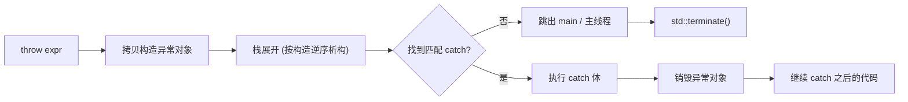

# 第十五章：其他的工具与技术

> **一句话定义**：本章是「现代 C++ 工程师手册」的杂项工具速查章——围绕 `try/catch/throw` 异常处理、`noexcept`（限定符 + 操作符）、`function-try-block`、`std::exception` 标准异常族、`enum` / `enum class`（C++11 起的有作用域枚举）、`union` 与 `std::variant` (C++17) 安全替代、嵌套类 / 局部类、嵌套与匿名名字空间（C++17 简化 `A::B::C`）、位域（bit-field）、`volatile`（与 `std::atomic` 的区分），逐项给出 API 速查表、栈展开图、`[[nodiscard]]` / `[[deprecated]]` / `[[likely]]` 等 C++17/20/23 现代化补丁，并提供 godbolt（gcc 14.2，`-std=c++17`）可链回的完整示例链接，供工程师在「调用过程中的非正常行为」与「跨翻译单元的代码组织」两类问题里随时翻阅。

## 章节知识框架

```mermaid
graph TD
  c15_root["第十五章 杂项工具"]

  c15_root --> c15_exc["异常处理 (Exception)"]
  c15_root --> c15_eu["枚举与联合 (enum / union)"]
  c15_root --> c15_nl["嵌套类 / 局部类"]
  c15_root --> c15_ns["命名空间 (namespace)"]
  c15_root --> c15_bv["位域与 volatile"]

  c15_exc --> c15_ttc["try / catch / throw"]
  c15_exc --> c15_unwind["栈展开 (stack unwinding)"]
  c15_exc --> c15_eobj["异常对象 (exception object)"]
  c15_exc --> c15_neox["noexcept 限定符/操作符"]
  c15_exc --> c15_ftb["function-try-block"]
  c15_exc --> c15_stdexc["std::exception 族"]
  c15_exc --> c15_terminate["terminate / unhandled"]

  c15_eu --> c15_enum["unscoped enum"]
  c15_eu --> c15_enumcls["enum class (C++11)"]
  c15_eu --> c15_under["underlying_type"]
  c15_eu --> c15_union["union / anonymous"]
  c15_eu --> c15_variant["std::variant (C++17)"]

  c15_nl --> c15_nested["嵌套类 nested class"]
  c15_nl --> c15_local["局部类 local class"]

  c15_ns --> c15_nestns["nested namespace"]
  c15_ns --> c15_inlinens["inline namespace"]
  c15_ns --> c15_anonns["anonymous namespace"]
  c15_ns --> c15_using["using directive / declaration"]

  c15_bv --> c15_bit["bit-field"]
  c15_bv --> c15_volatile["volatile"]
  c15_bv --> c15_atomic["std::atomic (替代)"]
```



## 15.0 杂项工具速查总表

> 全章主干速查表；后续小节是每一行的展开。

| 工具 | 关键字 / 头文件 | 一句话语义 | 标准时间线 | 常见易错 |
|---|---|---|---|---|
| 异常处理 | `try` / `catch` / `throw` | 非正常行为的非局部跳转 | C++98 | 析构 / `operator delete` 抛异常 |
| 栈展开 | 语义机制 | 局部对象按构造逆序销毁 | C++98 | 部分构造的成员不被析构 |
| 异常对象 | `throw expr` 的拷贝 | 临时对象在展开期间保留 | C++98 | `catch` 取值拷贝 → slicing |
| `noexcept` 限定符 | `noexcept(bool)` | 声明函数不抛 | C++11 | 抛出即 `std::terminate` |
| `noexcept` 操作符 | `noexcept(expr)` | 编译期查询表达式是否可能抛 | C++11 | 在未求值语境（不真正执行 `expr`） |
| `function-try-block` | `try` 跟在初始化列表外 | 捕获构造 / 析构内抛出 | C++98 | 构造函数 ftb 中只能 rethrow |
| 标准异常 | `<stdexcept>` / `<exception>` | `std::exception` 派生体系 | C++98 / C++11 补强 | `what()` 的存活期 |
| `enum`（无作用域） | `enum E { ... }` | 旧式枚举，名字进入外层作用域 | C++98 | 隐式转 `int` 污染重载 |
| `enum class` | `enum class E : T { ... }` | 强类型 + 严格作用域 | C++11 | 与 `int` 不互转，需 `static_cast` |
| `union` | `union U { ... }` | 多类型共享同段存储 | C++98 / C++11 起允许非平凡成员 | 活跃成员追踪靠程序员 |
| `std::variant` | `<variant>` | 类型安全的标签化联合 | C++17 | `std::get` 错型抛 `bad_variant_access` |
| 嵌套类 | 类体内 `class Inner { ... }` | 拥有外围类的作用域嵌套 | C++98 | 不自动访问外围类非静态成员 |
| 局部类 | 函数体内 `class Local { ... }` | 仅函数内可见 | C++98 | 不能定义静态数据成员 |
| 嵌套名字空间 | `namespace A::B::C { ... }` | 一行声明深嵌套 | C++17 | 不能跳跃定义不存在的中间层（pre-C++17） |
| `inline namespace` | `inline namespace v1 { ... }` | ABI 版本号、库演化 | C++11 | 跨内联名字空间的特化必须穿透 |
| 匿名 namespace | `namespace { ... }` | 翻译单元内部链接 | C++98 | 头文件中的匿名 ns = ODR 地雷 |
| 位域 | `T name : N;` | 显式声明成员位宽 | C++98 | 不可取地址 / 无引用 |
| `volatile` | `volatile T x;` | 表明对象可能被程序外修改 | C++98 / C++20 缩窄滥用 | 不保证线程同步，需 `std::atomic` |
| `typeid` | `<typeinfo>` | 运行时类型识别 | C++98 | 对多态类型才动态分发 |
| `static_cast` 家族 | `<>` 四兄弟 | 命名转换的统一语法 | C++98 | `reinterpret_cast` 几乎都是 UB |
| `extern "C"` | 链接说明 | 关闭名称修饰，跨语言 ABI | C++98 | C++ 重载在 `extern "C"` 内非法 |
| `[[nodiscard]]` | 属性 | 返回值被忽略时给警告 | C++17 / C++20 加 reason 串 | 与 `void` 函数无意义 |
| `[[deprecated]]` | 属性 | 标记弃用 | C++14 | 仅警告，不阻止链接 |
| `[[likely]]` / `[[unlikely]]` | 属性 | 分支预测提示 | C++20 | 仅作用于语句 |
| `std::expected<T,E>` | `<expected>` | 不抛错的「值或错」 | C++23 | 没有标准的链式 `then` 之前需手写 |
| `std::print / println` | `<print>` | 类型安全格式化 IO | C++23 | 早期实现需要 libfmt fallback |

> 法则：能用 `enum class` 不用 `enum`；能用 `std::variant` 不用 `union`；能用 `std::atomic` 不用 `volatile`；能用 `noexcept` 标注真正不抛的函数，让标准库 `move-only` 容器的搬迁走优化路径。

godbolt（一次性观察 `enum class` + `std::variant` + `noexcept` 三件套）：
<https://godbolt.org/?source=#g:!((g:!((g:!((h:codeEditor,i:(filename:'1',fontScale:14,fontUsePx:'0',j:1,lang:c%2B%2B,source:'%23include+%3Cvariant%3E%0A%23include+%3Ciostream%3E%0Aenum+class+Color%7Bred,green,blue%7D%3B%0Avoid+f()+noexcept%7B%7D%0Aint+main()%7B%0A++std::variant%3Cint,std::string%3E+v%7B42%7D%3B%0A++std::cout+%3C%3C+std::get%3Cint%3E(v)+%3C%3C+%22%5Cn%22%3B%0A++static_assert(noexcept(f()))%3B%0A++Color+c+%3D+Color::red%3B(void)c%3B%0A%7D'),k:50,l:'4',n:'0',o:'',s:0,t:'0'),(g:!((h:compiler,i:(compiler:g142,filters:(),lang:c%2B%2B,libs:!(),options:'-std%3Dc%2B%2B17',source:1),l:'5',n:'0',o:'+x86-64+gcc+14.2+(C%2B%2B17)',t:'0')),k:50,l:'4',n:'0',o:'',s:0,t:'0')),l:'2',n:'0',o:'',t:'0'),version:4>

---

## 1.异常处理

> 法则：异常用于「真正异常」的场景；常规分支（解析失败、用户输入错）继续走返回值 / `std::optional` / `std::expected` (C++23)。

异常处理流程速查：



### 用于处理程序在调用过程中的非正常行为

> 法则：识别「调用过程中的非正常行为」是异常的语义边界。返回错误码 vs 异常的选择，按调用栈深度与正常路径是否需要承担分支成本来决定。

异常 vs 传统返回值速查：

| 维度 | 传统返回值法 | 异常机制 |
|---|---|---|
| 表达 | 函数返回 `int` / `bool` / `errno` 码 | `try / catch / throw` |
| 正常路径开销 | 每层都要 `if (rc != 0)` 检查 | 零开销（zero-cost exception model） |
| 异常路径开销 | 一次比较 | 栈展开非常昂贵（拷贝 + 析构 + RTTI 查表） |
| 跨深栈传递错误 | 每层手写转发 | 自动跨越调用层级 |
| 跨 ABI / `extern "C"` | 友好 | 不可（C 没有异常） |
| 构造函数报错 | 难（无返回值） | 自然支持 |
| 析构函数报错 | 自然支持 | 禁止（会 `std::terminate`） |
| 编译器优化空间 | 一般 | `noexcept` 函数额外优化 |

1. 传统的处理方法：传返回值表示函数调用是否正常结束
2. C++ 中的处理方法：通过关键字 try/catch/throw 引入异常处理机制

```c++
// try / catch / throw 最小骨架
#include <stdexcept>
#include <iostream>

void f(int x){
    if (x < 0) throw std::invalid_argument("x must be non-negative");
}

int main(){
    try {
        f(-1);
    } catch (const std::invalid_argument& e){
        std::cerr << "caught: " << e.what() << '\n';
    }
}
```

godbolt（最小 `throw / catch` 骨架）：
<https://godbolt.org/?source=#g:!((g:!((g:!((h:codeEditor,i:(filename:'1',fontScale:14,fontUsePx:'0',j:1,lang:c%2B%2B,source:'%23include+%3Cstdexcept%3E%0A%23include+%3Ciostream%3E%0Avoid+f(int+x)%7Bif(x%3C0)throw+std::invalid_argument(%22neg%22)%3B%7D%0Aint+main()%7Btry%7Bf(-1)%3B%7Dcatch(const+std::exception%26+e)%7Bstd::cerr%3C%3Ce.what()%3C%3C%5C%22%5C%5Cn%5C%22%3B%7D%7D'),k:50,l:'4',n:'0',o:'',s:0,t:'0'),(g:!((h:compiler,i:(compiler:g142,filters:(),lang:c%2B%2B,libs:!(),options:'-std%3Dc%2B%2B17',source:1),l:'5',n:'0',o:'+x86-64+gcc+14.2',t:'0')),k:50,l:'4',n:'0',o:'',s:0,t:'0')),l:'2',n:'0',o:'',t:'0'),version:4>

### 异常触发时的系统行为——栈展开

> 法则：栈展开过程中**任何额外异常逃出析构都会触发 `std::terminate`**。所以析构函数（以及 `operator delete`）必须 `noexcept` 或内部 try/catch 包住。

栈展开（stack unwinding）逐步行为：

1. 抛出异常后续的代码不会被执行
2. 局部对象会按照构造相反的顺序自动销毁
3. 系统尝试匹配相应的 catch 代码段
   1. 如果匹配则执行其中的逻辑，之后执行 catch 后续的代码
   2. 如果不匹配则继续进行栈展开，直到“跳出”main 函数，触发 terminate 结束运行

栈展开关键事件速查：

| 事件 | 时机 | 关键 API |
|---|---|---|
| 异常对象拷贝构造 | `throw` 执行瞬间 | 编译器合成的临时对象 |
| 局部对象逆序析构 | 离开作用域时 | 各类型 `~T()` |
| 当前栈帧 catch 表查找 | 每个函数返回点 | C++ ABI 的 `.gcc_except_table` |
| catch 形参绑定 | 找到匹配 | 引用 / 拷贝 |
| 异常对象销毁 | catch 块结束（或显式 rethrow） | 编译器合成 |
| `std::terminate` 调用 | 未匹配 / 析构再抛 | `std::set_terminate` 可换 handler |

```c++
// 栈展开示例：观察析构逆序
#include <iostream>
#include <stdexcept>
struct G {
    const char* tag;
    G(const char* t):tag(t){ std::cout << "ctor " << tag << '\n'; }
    ~G(){ std::cout << "dtor " << tag << '\n'; }
};
void deep(){
    G a("a");
    {
        G b("b");
        throw std::runtime_error("boom"); // 退出时先析构 b，再析构 a
    }
}
int main(){
    try { deep(); } catch(const std::exception& e){ std::cerr << "caught: " << e.what() << '\n'; }
}
```

### 异常对象

> 法则：异常对象的「拷贝行为」决定了你应当抛**值**、catch**引用**。

1. 系统会使用抛出的异常拷贝初始化一个临时对象，称为异常对象
2. 异常对象会在栈展开过程中被保留，并最终传递给匹配的 catch 语句

异常对象生命周期速查：

| 阶段 | 谁拥有 | 关键性质 |
|---|---|---|
| `throw e` | 编译器合成的临时区 | 拷贝 / 移动初始化（C++11 起允许移动） |
| 栈展开期间 | 编译器维护 | 通过 unwind 库（libunwind/libgcc_s）保活 |
| 进入 catch 形参 | catch 形参绑定 | 引用形参 = 别名；值形参 = 二次拷贝 |
| catch 体执行完 | 异常对象销毁 | 除非 `throw;` 继续 rethrow |

```c++
// catch 引用 vs 值的差异（slicing）
struct Base { virtual const char* who()const{return "Base";} };
struct Derived : Base { const char* who()const override{return "Derived";} };

int main(){
    try { throw Derived{}; }
    catch (Base b){      /* 值 catch，slicing 成 Base */ std::printf("%s\n", b.who()); }   // Base
    try { throw Derived{}; }
    catch (const Base& b){ /* 引用 catch，多态保留 */    std::printf("%s\n", b.who()); }   // Derived
}
```

### try / catch 语句块

> 法则：catch 顺序按「从派生到基」从上到下排，否则下面的 catch 永远不被命中。

1. 一个 try 语句块后面可以跟一到多个 catch 语句块
2. 每个 catch 语句块用于匹配一种类型的异常对象
3. catch 语句块的匹配按照从上到下进行
4. 使用 catch(...) 匹配任意异常
5. 在 catch 中调用 throw 继续抛出相同的异常

catch 子句匹配规则速查：

| 形式 | 匹配什么 | 备注 |
|---|---|---|
| `catch (T)` | 异常对象按值拷贝为 `T` | 可能 slicing |
| `catch (T&)` / `catch (const T&)` | 引用绑定到异常对象 | 推荐 |
| `catch (T*)` | 异常对象本身就是 `T*`（很少用） | 易内存泄漏 |
| `catch (Base&)` | 匹配 `Base` 及其派生 | 多态分派 |
| `catch (...)` | 匹配任意类型 | 必须放最后 |
| `throw;`（裸 throw） | 重新抛出当前异常 | 仅在 catch 块中合法 |
| `throw new_exc;` | 抛出新异常 | 不是 rethrow |

```c++
try {
    risky();
} catch (const std::out_of_range& e){ /* 派生：先 */ }
  catch (const std::logic_error& e){  /* 基类：后 */ }
  catch (const std::exception& e){    /* 标准基类 */ }
  catch (...){                        /* 兜底 */ throw; /* rethrow */ }
```

### 在一个异常未处理完成时抛出新的异常会导致程序崩溃

> 法则：析构、`operator delete`、`noexcept` 函数中**不能让异常逃出**。

1. 不要在析构函数或 operator delete 函数重载版本中抛出异常
2. 通常来说， catch 所接收的异常类型为引用类型

「不能抛异常」的位置速查：

| 位置 | 抛出后果 | 应对方案 |
|---|---|---|
| 析构函数 | 若已经在展开中 → `terminate` | 析构内 try/catch；析构函数默认 `noexcept` (C++11) |
| `operator delete` / `operator delete[]` | `terminate` | 内部用 try/catch 兜底 |
| `noexcept` 函数 | 直接 `terminate`（不展开调用方栈） | 真正不抛才声明；否则别加 |
| 信号处理器 | UB | 不要在 signal handler 里抛 |
| 线程析构 / `std::thread` 未 `join` | `terminate` | 用 `jthread` (C++20) 或保证 join |
| `static` / 线程局部对象的构造 | C++ 标准：抛出 → `terminate` (C++17 起 `[basic.start.init]`) | 把可能抛的初始化移到运行时 |

### 异常与构造、析构函数

> 法则：构造函数抛异常时已构造的子对象会被销毁；**但本身的析构函数不会被调用**——因为对象从未"完全构造"。函数级 try 块（`function-try-block`）是唯一能 catch 初始化列表里抛出的方式。

1. 使用 function-try-block保护初始化逻辑
2. 在构造函数中抛出异常：
   1. 已经构造的成员会被销毁，但类本身的析构函数不会被调用

function-try-block（FTB）速查：

| 用途 | 是否常用 | 规则 |
|---|---|---|
| 包裹构造函数：catch 初始化列表 + 函数体的异常 | 偶尔（构造期资源清理） | catch 内必须 rethrow（或终止），不能"吞" |
| 包裹析构函数 | 极少 | 同上 |
| 包裹普通函数 | 等价于把函数体写成大 `try { ... } catch (...)` | 没特别价值 |
| 包裹 main | 合法 | catch 内可以正常返回 |

```c++
// function-try-block：捕获 base 子对象初始化时抛出的异常
struct Base { Base(int x){ if (x<0) throw std::invalid_argument("x<0"); } };
struct D : Base {
    int n;
    D(int x, int y) try : Base(x), n(y) { /* body */ }
    catch (const std::exception& e){
        // 已构造的 Base 子对象已被销毁
        std::cerr << "ctor failed: " << e.what() << '\n';
        // 必须 rethrow（标准规定构造 ftb 的 catch 隐式 rethrow）
        // 即使写了 return; 编译器也会 implicit-rethrow
    }
};
```

godbolt（function-try-block）：
<https://godbolt.org/?source=#g:!((g:!((g:!((h:codeEditor,i:(filename:'1',fontScale:14,fontUsePx:'0',j:1,lang:c%2B%2B,source:'%23include+%3Cstdexcept%3E%0A%23include+%3Ciostream%3E%0Astruct+B%7BB(int+x)%7Bif(x%3C0)throw+std::invalid_argument(%22x%22)%3B%7D%7D%3B%0Astruct+D:B%7BD(int+x,int+y)try:B(x)%7B(void)y%3B%7Dcatch(const+std::exception%26+e)%7Bstd::cerr%3C%3C%22caught%22%3C%3C+e.what()%3C%3C%22%5Cn%22%3B%7D%7D%3B%0Aint+main()%7Btry%7BD+d(-1,2)%3B%7Dcatch(const+std::exception%26+e)%7Bstd::cerr%3C%3C%22rethrow%22%3C%3C+e.what()%3C%3C%22%5Cn%22%3B%7D%7D'),k:50,l:'4',n:'0',o:'',s:0,t:'0'),(g:!((h:compiler,i:(compiler:g142,filters:(),lang:c%2B%2B,libs:!(),options:'-std%3Dc%2B%2B17',source:1),l:'5',n:'0',o:'+x86-64+gcc+14.2+(C%2B%2B17)',t:'0')),k:50,l:'4',n:'0',o:'',s:0,t:'0')),l:'2',n:'0',o:'',t:'0'),version:4>

### 描述函数是否会抛出异常

> 法则：从 C++17 起，**异常规范成为函数类型的一部分**（[P0012R1]），`noexcept` 的函数指针不能赋给可抛函数指针；C++98 的 dynamic-exception-specification（`throw()` / `throw(int,char)`）在 C++11 起被弃用，C++17 完全移除（除了等价于 `noexcept` 的空 `throw()`）。

1. 如果函数不会抛出异常，则应表明以为系统提供更多的优化空间
   1. C++ 98 的方式： throw() / throw(int, char)
   2. C++11 后的改进： noexcept / noexcept(false)

异常规范演化速查：

| 写法 | 标准 | 状态 |
|---|---|---|
| `void f() throw();` | C++98 | C++11 起 deprecated；C++17 起 = `noexcept` |
| `void f() throw(int, std::exception);` | C++98 | C++17 起完全移除 |
| `void f() noexcept;` | C++11 | 推荐 |
| `void f() noexcept(true);` | C++11 | 同 `noexcept` |
| `void f() noexcept(false);` | C++11 | 同未标 |
| `void f() noexcept(noexcept(g()));` | C++11 条件 noexcept | 让 noexcept 跟随依赖函数 |

### noexcept

> 法则：`noexcept` 有两副面孔——**限定符**写在函数声明后面；**操作符**`noexcept(expr)` 在编译期问 "`expr` 是否能保证不抛"。

1. 限定符：接收 false / true 表示是否会抛出异常
2. 操作符：接收一个表达式，根据表达式是否可能抛出异常返回 false/true
3. 在声明了 noexcept 的函数中抛出异常会导致 terminate 被调用，程序终止
4. 不作为函数重载依据，但函数指针、虚拟函数重写时要保持形式兼容

`noexcept` 限定符 vs 操作符速查：

| 形式 | 出现位置 | 求值时机 | 返回类型 |
|---|---|---|---|
| `void f() noexcept;` | 函数声明尾 | 编译期 | 函数属性 |
| `void f() noexcept(bool_expr);` | 函数声明尾 | 编译期常量 | 函数属性 |
| `noexcept(expr)` | 表达式语境 | 编译期，**未求值** | `bool` |
| `static_assert(noexcept(f()));` | 任意 | 编译期 | — |

```c++
// noexcept 双角色示例
void g();                            // 可能抛
void f() noexcept { /* 不抛 */ }     // 限定符

static_assert(noexcept(f()));        // 操作符：true
static_assert(!noexcept(g()));       // 操作符：false（保守地认为可能抛）

// 条件 noexcept：跟随 T 的 move ctor 是否 noexcept
template<class T>
void wrap(T t) noexcept(noexcept(T(std::move(t)))){
    T tmp(std::move(t));
    (void)tmp;
}
```

`noexcept` 影响标准库行为的关键场景：

| 场景 | 行为差异 |
|---|---|
| `std::vector::push_back / emplace_back` 触发 reallocation | move ctor `noexcept` → 移动；否则 → 拷贝（强异常保证） |
| `std::move_if_noexcept(x)` | 内部判断 move ctor 是否 noexcept，选择移动或拷贝 |
| 虚函数 override | `noexcept` 派生可以覆盖 `noexcept(false)` 基类；反过来不行 |
| 函数指针赋值 | C++17 起 noexcept 是函数类型的一部分 |
| 析构函数 | C++11 起默认 `noexcept`，除非任一成员析构非 noexcept |

### 标准异常

> 法则：自定义异常**继承 `std::exception` 或其派生**，重写 `what()` 返回 `const char*`；保证 `what()` 的返回字符串至少与异常对象同寿。

标准异常体系速查：

| 异常类 | 头文件 | 语义 | 抛出方 |
|---|---|---|---|
| `std::exception` | `<exception>` | 所有标准异常基类 | 派生使用 |
| `std::logic_error` | `<stdexcept>` | 程序逻辑错（可在写代码时避免） | — |
| `std::invalid_argument` | `<stdexcept>` | 实参非法 | `std::stoi("xyz")` |
| `std::domain_error` | `<stdexcept>` | 数学域外 | 自定义 |
| `std::length_error` | `<stdexcept>` | 长度超限 | `std::string::resize` |
| `std::out_of_range` | `<stdexcept>` | 越界 | `vector::at` / `map::at` |
| `std::runtime_error` | `<stdexcept>` | 运行期才知道的错 | — |
| `std::range_error` | `<stdexcept>` | 内部计算溢出 | `<regex>` |
| `std::overflow_error` | `<stdexcept>` | 溢出 | `bitset::to_ulong` |
| `std::underflow_error` | `<stdexcept>` | 下溢 | — |
| `std::bad_alloc` | `<new>` | new 失败 | `new T` |
| `std::bad_cast` | `<typeinfo>` | `dynamic_cast<T&>` 失败 | — |
| `std::bad_typeid` | `<typeinfo>` | `typeid(*ptr)` 中 ptr 为 nullptr | — |
| `std::bad_exception` | `<exception>` | 与已废止 `unexpected` 配合 | C++17 移除关联 |
| `std::bad_function_call` | `<functional>` | 调用空 `std::function` | — |
| `std::bad_weak_ptr` | `<memory>` | `shared_ptr(weak)` 弱引用过期 | — |
| `std::bad_optional_access` | `<optional>` | 空 `optional::value()` | C++17 |
| `std::bad_variant_access` | `<variant>` | `std::get<T>` 错型 | C++17 |
| `std::bad_any_cast` | `<any>` | `any_cast` 错型 | C++17 |
| `std::system_error` | `<system_error>` | 含 `error_code` 的系统级错 | OS API |
| `std::filesystem::filesystem_error` | `<filesystem>` | 含路径上下文的 OS 错 | C++17 |
| `std::ios_base::failure` | `<ios>` | 流异常（需开启 `exceptions` 掩码） | — |
| `std::nested_exception` | `<exception>` | 嵌套异常 | `std::throw_with_nested` |

```c++
// 自定义异常
#include <stdexcept>
struct ParseError : std::runtime_error {
    int line;
    ParseError(int ln, const std::string& msg)
        : std::runtime_error(msg), line(ln) {}
};
```

### 正确对待异常处理

> 法则：异常是"非正常路径"的工具；常规分支不要硬塞异常。

1. 不要滥用：异常的执行成本非常高
2. 不要不用：对于真正的异常场景，异常处理是相对高效、简洁的处理方式
3. 编写异常安全的代码

异常安全级别（exception safety guarantees）速查：

| 级别 | 中文 | 行为 | 例子 |
|---|---|---|---|
| no-throw | 不抛 | 永不抛异常 | swap、destructor、`noexcept` 函数 |
| strong | 强保证 | 抛出后状态回滚到调用前 | `vector::push_back` 在 noexcept move 下 |
| basic | 基本保证 | 抛出后不变量保留、不泄漏，但状态可能改变 | 多数标准库默认 |
| no | 无保证 | 抛出后可能数据破坏 | 避免 |

写异常安全代码的核心成例（idiom）：

- **RAII**：所有资源（内存、文件、锁、socket）放进对象，析构释放（Ch08 智能指针 / Ch11 类）。
- **copy-and-swap idiom**：复制赋值先拷贝再 `swap`，让赋值变成强保证（`swap` 必须 `noexcept`）。
- **scope_guard / `std::experimental::scope_exit`**：手动回滚作用域内已执行的副作用。
- **`std::uncaught_exceptions()` (C++17)**：替代被废止的 `std::uncaught_exception()`，在析构里判断是否在异常展开中（Andrei Alexandrescu「scope guard 11」原型）。

---

## 2.枚举与联合

> 法则：能用 `enum class` 不用 `enum`；能用 `std::variant` 不用 `union`。

### 枚举(enum) ：一种取值受限的特殊类型

1. **无作用域枚举**
2. **有作用域枚举（ C++11 起）**
3. 枚举项缺省使用 0 初始化，依次递增，可以使用常量表达式来修改缺省值
4. 可以为枚举指定底层类型，表明了枚举项的尺寸
5. 无作用域枚举项可隐式转换为整数值；也可用 static_cast 在枚举项与整数值间转换
6. 注意区分枚举的定义与声明

枚举两种形态速查：

| 维度 | unscoped `enum`（C++98） | scoped `enum class`（C++11） |
|---|---|---|
| 引入语法 | `enum E { red, green };` | `enum class E { red, green };` |
| 名字进入作用域 | 外层作用域 + 枚举类型作用域 | 仅枚举类型作用域 |
| 与整型互转 | 隐式 `enum → int` | 全部需 `static_cast` |
| 底层类型 | 实现定义（够大即可） | 默认 `int`，可指定 |
| 前向声明 | C++11 起允许（需指定底层类型） | 允许 |
| 与 `using enum E;`（C++20） | 把所有枚举值引入当前作用域 | 同 |
| 比较 | 与同枚举类型 + 整型 | 只允许同枚举类型 |
| 推荐度 | 不推荐 | 推荐 |

```c++
// 无作用域 vs 有作用域枚举
enum Color { red, green, blue };          // 旧式
enum class Light : std::uint8_t { red, green, yellow };  // 新式 + 显式底层类型

int x = red;                              // OK：隐式转 int
// int y = Light::red;                    // 错：必须 static_cast
auto y = static_cast<std::uint8_t>(Light::red); // OK

// C++17 起前向声明
enum class Status : int;
// 之后某个 .cpp 中给出完整定义
enum class Status : int { ok, fail };
```

godbolt（scoped enum + underlying_type + C++20 `using enum`）：
<https://godbolt.org/?source=#g:!((g:!((g:!((h:codeEditor,i:(filename:'1',fontScale:14,fontUsePx:'0',j:1,lang:c%2B%2B,source:'%23include+%3Ctype_traits%3E%0A%23include+%3Ciostream%3E%0Aenum+class+Color:unsigned+char%7Bred,green,blue%7D%3B%0Aint+main()%7B%0A++Color+c+%3D+Color::green%3B%0A++std::cout%3C%3Cstatic_cast%3Cint%3E(c)%3C%3C%22%5Cn%22%3B%0A++static_assert(std::is_same_v%3Cstd::underlying_type_t%3CColor%3E,unsigned+char%3E)%3B%0A%7D'),k:50,l:'4',n:'0',o:'',s:0,t:'0'),(g:!((h:compiler,i:(compiler:g142,filters:(),lang:c%2B%2B,libs:!(),options:'-std%3Dc%2B%2B17',source:1),l:'5',n:'0',o:'+x86-64+gcc+14.2+(C%2B%2B17)',t:'0')),k:50,l:'4',n:'0',o:'',s:0,t:'0')),l:'2',n:'0',o:'',t:'0'),version:4>

`std::underlying_type` 与 `std::to_underlying`（C++23）速查：

| API | 标准 | 用途 |
|---|---|---|
| `std::underlying_type_t<E>` | C++11 | 取枚举底层整型 |
| `static_cast<std::underlying_type_t<E>>(e)` | C++11 | 转底层 |
| `std::to_underlying(e)` | C++23 | 简化上面两步：`std::to_underlying(Color::red)` |

### 联合（ union ）：将多个类型合并到一起以节省空间

1. 通常与枚举一起使用
2. 匿名联合
3. 在联合中包含非内建类型（ C++11 起）

`union` 速查：

| 维度 | C-union | C++11 起的 union | `std::variant`（C++17） |
|---|---|---|---|
| 存放多个类型 | 同一段内存 | 同一段内存（允许非平凡类型） | 内部按 `union` 实现 |
| 活跃成员追踪 | 无 | 无（程序员自己记） | 标签 `index()` |
| 类型安全 | 否 | 否 | 是 |
| 构造 / 析构非平凡成员 | 不允许 | 允许，但需 placement-new / 显式析构 | 自动 |
| 错型访问 | UB | UB | 抛 `std::bad_variant_access` |
| 推荐度 | 兼容 C 时用 | 极少用 | 推荐 |

```c++
// 1. C 风格 union（仅内建）
union U1 { int i; double d; };

// 2. C++11 起 union 允许非平凡成员（手动管理生存期）
#include <new>
#include <string>
union U2 {
    int i;
    std::string s;
    U2():i(0){}                    // 显式选 active 成员
    ~U2(){}                        // 析构需外部决策
};
int main(){
    U2 u;
    new (&u.s) std::string("hi"); // placement-new 构造 active 成员
    u.s.~basic_string();          // 显式析构
}

// 3. 匿名 union（在 struct 中实现 tagged-union）
struct Value {
    enum class K { I, D } tag;
    union { int i; double d; };
    Value(int x):tag(K::I), i(x){}
    Value(double x):tag(K::D), d(x){}
};

// 4. C++17 推荐：std::variant
#include <variant>
std::variant<int, double, std::string> v = 3.14;
```

`std::variant` 速查表：

| API | 用途 | 错误处理 |
|---|---|---|
| `std::variant<Ts...>` | 标签化联合 | — |
| `v.index()` | 返回当前 active 类型的下标 | — |
| `std::get<T>(v)` / `std::get<I>(v)` | 取值 | 错型抛 `bad_variant_access` |
| `std::get_if<T>(&v)` | 取指针 | 错型返回 `nullptr` |
| `std::holds_alternative<T>(v)` | 探测 | bool |
| `std::visit(visitor, v)` | 类型分派 | 静态 + 编译期 |
| `std::monostate` | 空状态占位（默认构造） | — |

---

## 3.嵌套类与局部类

> 法则：嵌套类是「类内 namespace + 类型」的合体；局部类是函数私有的、轻量的、不能有静态数据成员的类。

### 嵌套类：在类中定义的类

1. 嵌套类具有自己的域，与外围类的域形成嵌套关系
2. 嵌套类中的名称查找失败时会在其外围类中继续查找
   1. 嵌套类与外围类单独拥有各自的成员

嵌套类与外围类的访问关系速查：

| 关系 | 是否允许 | 备注 |
|---|---|---|
| 嵌套类访问外围类的 public/protected | 允许 | 名称查找规则 |
| 嵌套类访问外围类的 private 静态成员 | C++11 起允许（[class.access.nest]） | 自动具有访问权限 |
| 嵌套类访问外围类的 private 非静态成员 | 需要外围类对象 + friend 或显式作用域 | — |
| 外围类访问嵌套类的 private 成员 | 不允许，除非 friend | 嵌套不等于 friend |
| 嵌套类的对象独立 | 是 | 不会自带外围对象指针 |
| 嵌套类在外围类内 / 外定义 | 都可 | 外部定义需 `Outer::Inner::method()` |

```c++
struct Outer {
    struct Inner {                // 嵌套类
        void f();
    };
    static int s_x;
    int x;
};
inline void Outer::Inner::f() {
    int y = Outer::s_x;           // OK：嵌套类可以访问外围类静态成员
    // int z = ((Outer*)nullptr)->x;  // 错：需要外围对象
}
```

### 局部类：可以在函数内部定义的类

1. 可以访问外围函数中定义的类型声明、静态对象与枚举
2. 局部类可以定义成员函数，但成员函数的定义必须位于类内部
3. 局部类不能定义静态数据成员

局部类限制速查：

| 维度 | 局部类（local class） | 普通类 |
|---|---|---|
| 定义位置 | 函数体内 | 命名空间 / 类 / 全局 |
| 静态数据成员 | **不允许** | 允许 |
| 静态成员函数 | 允许 | 允许 |
| 成员函数定义 | **必须类内定义**（inline） | 类内或类外 |
| 访问外围函数局部对象 | 仅静态 / 枚举 / typedef | — |
| 访问外围函数自动变量 | 不允许（用 lambda 捕获代替） | — |
| 实例化模板 | C++11 前不能作为模板实参；C++11 起允许 | 允许 |
| 推荐度 | 偶尔用作"轻量 functor"；多被 lambda 取代 | — |

```c++
void f(int x){
    static int s = 0;
    enum E { a, b };
    struct Local {
        void run(){
            s += 1;            // OK：static
            (void)a;           // OK：enum
            // (void)x;        // 错：x 是自动局部，局部类无法访问
        }
    };
    Local{}.run();
}
// 等价的 lambda 版本
auto g = [&](int x){ static int s=0; auto run=[&]{ s+=1; (void)x; }; run(); };
```

---

## 4.嵌套名字空间与匿名名字空间

> 法则：C++17 起一句话定义深嵌套；匿名 namespace 等价于（更现代的）`static`，用于翻译单元内部链接。

### 嵌套名字空间

1. 名字空间可以嵌套，嵌套名字空间形成嵌套域
2. 注意同样的名字空间定义可以出现在程序多处，以向同一个名字空间中增加声明或定义
3. C++17 开始可以简化嵌套名字空间的定义

C++17 嵌套 namespace 简化语法速查：

| 写法 | 标准 | 等价 |
|---|---|---|
| `namespace A { namespace B { namespace C { ... }}}` | C++98 | — |
| `namespace A::B::C { ... }` | C++17 | 简化深嵌套 |
| `namespace A::B::inline C { ... }` | C++20 | 嵌套语法里嵌入 inline namespace |

```c++
// C++98
namespace A { namespace B { namespace C { void f(); } } }
// C++17：一行搞定
namespace A::B::C { void f(); }
// C++20：在路径中插入 inline namespace
namespace A::B::inline v1 { void f(); }
```

### 匿名名字空间

1. 用于构造仅翻译单元可见的对象
2. 可用 static 代替
3. 可作为嵌套名字空间

`static` vs 匿名 namespace vs `inline` 变量速查：

| 写法 | 链接性 | 优缺 |
|---|---|---|
| `static int x;` （文件作用域） | 内部链接 | C 兼容；类型可见性受限 |
| `namespace { int x; }` | 内部链接 | 适用于类型 / 模板 / using-decl |
| `inline int x = 0;` （C++17） | 外部链接、ODR-safe | 头文件可见的"全局变量" |
| `constexpr int x = 0;` （文件级） | 内部链接（除非 `inline`） | 编译期常量 |

```c++
// 翻译单元局部
namespace {
    int counter = 0;             // 仅本 .cpp 可见
    template<class T> void log(const T& t){ /* ... */ }
}
```

`inline namespace`（C++11）速查 —— ABI/版本演化常用：

| 用途 | 写法 | 效果 |
|---|---|---|
| 默认版本 | `namespace lib { inline namespace v2 { ... } namespace v1 { ... } }` | `lib::foo` == `lib::v2::foo`；可显式访问旧版 |
| 跨 ABI 升级 | 升级版放 inline ns；老版本兼容保留 | 二进制 ABI 名字带 `v2` 段 |
| 标准库 | `std::__1::`（libc++）/ `std::__cxx11::` | 实现细节 |

---

## 5.位域与 volatile 关键字

> 法则：位域是"显式声明 N 个比特宽"的成员；`volatile` 与"线程间同步"完全无关，多线程同步请用 `std::atomic` / `std::mutex`。

### 位域：显示表明对象尺寸（所占位数）

1. 在结构体 / 类中使用
2. 多个位域对象可能会被打包存取
3. 声明了位域的对象无法取地址，因此不能使用指针或非常量引用进行绑定
4. 尺寸通常会小于对象类型所对应的尺寸，否则取值受类型限制

位域语法与限制速查：

| 维度 | 行为 |
|---|---|
| 语法 | `T name : N;`（`T` 通常 `unsigned` / 整型 / 枚举） |
| 0 宽匿名位域 | `T : 0;` 强制对齐到下一个底层单元边界 |
| 匿名位域 | `T : N;` 占位填充 |
| 取地址 | `&obj.field` —— **非法** |
| 引用 | 非 const 引用绑定 —— 非法；`const T&` 可（创建临时） |
| `sizeof` | `sizeof(struct)` 仍按对齐对齐；`sizeof(field)` —— 非法 |
| 跨字节打包 | 实现定义（可能跨 byte，gcc 默认贴合） |
| 与位运算 | 编译器自动生成 mask + shift |
| 与 `enum class` | C++11 起允许位域底层为 enum |

```c++
// 经典硬件寄存器映射
struct StatusReg {
    unsigned ready  : 1;
    unsigned error  : 1;
    unsigned        : 2;          // 匿名占位
    unsigned mode   : 4;
};
static_assert(sizeof(StatusReg) <= 4);

StatusReg s{};
s.ready = 1;
// auto p = &s.ready;             // 错：位域不可取地址
// int& r = s.mode;               // 错：非 const 引用
const int& r = s.mode;            // OK：const 引用绑定到临时
```

godbolt（位域 + 打包）：
<https://godbolt.org/?source=#g:!((g:!((g:!((h:codeEditor,i:(filename:'1',fontScale:14,fontUsePx:'0',j:1,lang:c%2B%2B,source:'%23include+%3Ciostream%3E%0Astruct+S%7Bunsigned+a:3%3Bunsigned+b:5%3Bunsigned+c:8%3B%7D%3B%0Aint+main()%7B%0A++S+s%7B5,17,200%7D%3B%0A++std::cout%3C%3Csizeof(S)%3C%3C%22+%22%3C%3Cs.a%3C%3C%22+%22%3C%3Cs.b%3C%3C%22+%22%3C%3Cs.c%3C%3C%22%5Cn%22%3B%0A%7D'),k:50,l:'4',n:'0',o:'',s:0,t:'0'),(g:!((h:compiler,i:(compiler:g142,filters:(),lang:c%2B%2B,libs:!(),options:'-std%3Dc%2B%2B17',source:1),l:'5',n:'0',o:'+x86-64+gcc+14.2+(C%2B%2B17)',t:'0')),k:50,l:'4',n:'0',o:'',s:0,t:'0')),l:'2',n:'0',o:'',t:'0'),version:4>

### volatile关键字

1. 表明一个对象的可能会被当前程序以外的逻辑修改
2. 相应对象的读写可能会加重程序负担
3. 注意慎重使用：一些情况下可以用 **atomic** 代替

`volatile` vs `std::atomic` vs `std::mutex` 速查：

| 维度 | `volatile T` | `std::atomic<T>` | `std::mutex` + 普通 T |
|---|---|---|---|
| 抑制编译器优化（不缓存到寄存器） | 是 | 是 | 临界区内由屏障保证 |
| 线程间可见性（happens-before） | **否** | 是（按 `memory_order`） | 是 |
| 原子读 / 写 | 仅 word 对齐 + 单条机器指令时偶然成立（实现定义） | 保证 | 临界区保证 |
| 读-改-写原子（如 `++`） | **否** | 是（`fetch_add`） | 是 |
| 适用场景 | 内存映射 IO / signal handler / setjmp/longjmp | 多线程共享标志 / 计数器 | 复杂结构共享 |
| C++20 缩窄 | 复合赋值 / `++` / `--` 弃用（[P1152R4]） | — | — |
| 与 const | `const volatile` 表示「不可写但可能被外部改」 | — | — |

> 误用：`volatile bool stop_flag` 在多线程下并不保证可见性；正确做法是 `std::atomic<bool> stop_flag`。

```c++
// 硬件映射：volatile 合理使用
volatile std::uint32_t* uart_status = reinterpret_cast<std::uint32_t*>(0x4000'0000);
while ((*uart_status & 0x1) == 0) { /* 等待硬件置位 */ }

// 多线程标志位：std::atomic
#include <atomic>
std::atomic<bool> stop{false};
// 线程 A: while (!stop.load()) work();
// 线程 B: stop.store(true);
```

---

## 15.6 现代 C++ 补丁（C++17 / C++20 / C++23 速查）

| 标准 | 特性 | 与本章接口 | 一句话用法 |
|---|---|---|---|
| C++11 | `enum class` + 底层类型 | 强类型枚举 | `enum class E : std::uint8_t { ... }` |
| C++11 | `noexcept` 限定符 / 操作符 | 异常优化 | `void f() noexcept;` `static_assert(noexcept(f()));` |
| C++11 | `inline namespace` | ABI 版本演化 | `inline namespace v2 { ... }` |
| C++11 | union 允许非平凡成员 | union 现代化 | placement-new + 显式析构 |
| C++14 | `[[deprecated]]` / `[[deprecated("reason")]]` | 标记弃用 | `[[deprecated("use Bar")]] void foo();` |
| C++17 | 嵌套 namespace 简写 | `namespace A::B::C` | 一行声明深嵌套 |
| C++17 | `[[nodiscard]]` | 防止忽略返回值 | `[[nodiscard]] error_code init();` |
| C++17 | `[[fallthrough]]` | 显式声明 switch 穿透 | `case 1: do_it(); [[fallthrough]]; case 2: ...` |
| C++17 | `[[maybe_unused]]` | 抑制未用警告 | `[[maybe_unused]] auto x = ...;` |
| C++17 | `std::variant` | 类型安全 tagged union | `std::variant<int, std::string>` |
| C++17 | `std::optional` | 可能为空的返回 | 替代「错误码 + out 参数」 |
| C++17 | `std::uncaught_exceptions()` | 替代 `uncaught_exception()` | 检测嵌套异常计数 |
| C++17 | inline variable | 头文件全局 | `inline int g = 0;` |
| C++17 | 异常规范从函数类型一部分 | `noexcept` 进入类型系统 | `void(*p)() noexcept;` |
| C++17 | structured binding | 解包 enum + variant | `auto [tag, val] = ...` |
| C++17 | `std::byte` | 强类型字节 | `<cstddef>` |
| C++20 | `[[likely]]` / `[[unlikely]]` | 分支预测提示 | `if (e) [[likely]] { ... }` |
| C++20 | `[[no_unique_address]]` | EBO 替代 | 空成员零开销 |
| C++20 | `using enum E;` | 引入枚举成员 | `using enum Light;` |
| C++20 | `consteval` / `constinit` | 编译期 / 启动期保证 | 与 `constexpr` 区分 |
| C++20 | `volatile` 复合操作弃用 | `++v` / `v += 1` 警告 | 改 `std::atomic` |
| C++20 | `std::source_location` | 替代 `__FILE__/__LINE__` | 自定义异常自动带源位置 |
| C++20 | `std::stacktrace`（实际 C++23） | 异常带堆栈 | 用 `std::throw_with_nested` 配合 |
| C++23 | `std::expected<T, E>` | 不抛错的"值或错" | `expected<int, ErrorCode>` |
| C++23 | `std::print` / `std::println` | 类型安全格式化 IO | `<print>` |
| C++23 | `std::to_underlying(e)` | 枚举转底层 | 简化 `static_cast` |
| C++23 | `std::stacktrace` | 调用堆栈 | `<stacktrace>` |
| C++26（draft） | reflection（P2996） | 编译期反射 | 替代手写 enum→string |
| C++26（draft） | contract assertions（P2900） | `pre/post/contract` | 取代 `assert` |

`std::expected` 替代异常的范型对照：

| 维度 | 异常 | `std::expected<T,E>` |
|---|---|---|
| 错误传递 | 自动跨层 | 显式 `if (!r) return std::unexpected(r.error());` |
| 正常路径开销 | 零 | 极小（多一次条件分支） |
| 异常路径开销 | 高（栈展开） | 与正常路径相同 |
| `noexcept` 函数 | 不能抛 | 可以返回错 |
| 与 ABI 边界 | 不友好 | 友好（POD） |
| 链式组合 | 较弱 | `and_then` / `transform` / `or_else`（C++23） |

```c++
// C++23 std::expected 例子
#include <expected>
#include <string>
std::expected<int, std::string> parse(const std::string& s){
    try { return std::stoi(s); }
    catch(...) { return std::unexpected("invalid"); }
}
// 调用方
auto r = parse("42");
if (r) { /* *r */ } else { /* r.error() */ }
```

```c++
// C++23 std::print：替代 std::cout / printf
#include <print>
int main(){ std::println("hello {} ({})", "world", 42); }
```

godbolt（`[[nodiscard]]` + `[[likely]]` + `using enum`，C++20）：
<https://godbolt.org/?source=#g:!((g:!((g:!((h:codeEditor,i:(filename:'1',fontScale:14,fontUsePx:'0',j:1,lang:c%2B%2B,source:'%23include+%3Ciostream%3E%0Aenum+class+E%7Bok,fail%7D%3B%0A%5B%5Bnodiscard%5D%5D+E+init()%7Breturn+E::ok%3B%7D%0Aint+main()%7B%0A++using+enum+E%3B%0A++auto+r+%3D+init()%3B%0A++if(r%3D%3Dok)+%5B%5Blikely%5D%5D+std::cout%3C%3C%22ok%5Cn%22%3B%0A%7D'),k:50,l:'4',n:'0',o:'',s:0,t:'0'),(g:!((h:compiler,i:(compiler:g142,filters:(),lang:c%2B%2B,libs:!(),options:'-std%3Dc%2B%2B20',source:1),l:'5',n:'0',o:'+x86-64+gcc+14.2+(C%2B%2B20)',t:'0')),k:50,l:'4',n:'0',o:'',s:0,t:'0')),l:'2',n:'0',o:'',t:'0'),version:4>

---

## 15.7 易错点 / 工程师避坑指南

1. **析构函数中抛异常**：若当前正在栈展开（`std::uncaught_exceptions() > 0`），析构再抛会直接 `std::terminate`。C++11 起析构函数默认 `noexcept(true)`，任何 escape 出去的异常都会终止程序。要么内部 try/catch 兜底，要么提供 `void close()` 让用户在析构前显式调用并 catch。
2. **`operator delete` 重载里抛异常**：与析构相同的后果——`terminate`；标准库假定 deallocation 永不抛。
3. **catch 取值（slicing）**：`catch (std::exception e)` 会把派生异常切成基类，`what()` 丢失派生信息；永远写 `catch (const std::exception& e)`。
4. **catch 顺序错误**：把 `catch(std::exception&)` 写在 `catch(std::out_of_range&)` 之前，后者永远不被命中（编译器多数会警告 `-Wexceptions`）。
5. **rethrow 写错**：`throw e;` 不是 rethrow，是新抛（基于 `e` 的副本，发生 slicing）；rethrow 只能写 `throw;` 且仅在 catch 内合法。
6. **`noexcept` 函数中抛出**：直接 `terminate`，不展开调用方栈。给函数加 `noexcept` 前必须保证内部所有可能抛的调用都被 catch 住或本身 noexcept。
7. **条件 noexcept 漏算**：写 `void f() noexcept(noexcept(g()))` 时，若 `g()` 后续变为可抛，`f` 的 `noexcept` 属性会跟着变，可能让基于此的优化（vector reallocation 选 move）退化为拷贝；提交大改动前 `static_assert(noexcept(f()))`。
8. **函数指针 noexcept 不兼容**：C++17 起 `noexcept` 是函数类型的一部分。`void (*p)() = noexcept_fn;` 合法，反向 `void (*p)() noexcept = may_throw_fn;` 非法。
9. **`enum`（无作用域）泄漏到外层**：`enum Color { red };` 会污染外层名字空间，与其他 `red` 冲突；用 `enum class`。
10. **`enum` 到 `int` 的隐式转换参与重载**：`void f(int); void f(double);` + `f(red);` 调 `f(int)` 而不是开发者预期。改 `enum class` 或显式 `static_cast`。
11. **匿名 union 中的非平凡成员未显式构造**：匿名 union 不会自动构造任一成员；进入构造后必须 placement-new 第一个 active 成员。
12. **`union` 跨成员读**：写一个成员、读另一个非对应的成员是 UB（type-punning），不是合法做法；C++ 的合法 type-pun 是 `std::memcpy` 或 C++20 `std::bit_cast`。
13. **嵌套类不自动 friend 外围类**：嵌套类访问外围类的 private 非静态成员需要 friend 或外围对象 + 显式作用域。
14. **局部类不能有静态数据成员**：局部类内部 `static int x;` 是非法（无法在外部给出定义）；用文件作用域 `static` 或 `inline` 变量替代。
15. **C++17 前的嵌套 namespace 跳层定义**：`namespace A::B { ... }` 仅在 C++17 起合法；旧代码必须逐层 `namespace A { namespace B { ... } }`。
16. **`inline namespace` 与显式特化**：对 `inline namespace v2 { template<class T> struct X; }` 的特化必须写 `template<> struct lib::v2::X<int> { ... };` 在外部命名空间内打开 `lib::v2`，而不是 `lib`。
17. **匿名 namespace 在头文件**：每个 `#include` 该头文件的翻译单元都得到独立副本，符号 ODR 不一致 + 数据多份；匿名 namespace 永远只放 .cpp。
18. **位域取地址 / 引用**：`&s.field` 非法；非 const 引用绑定也非法；这是工程师写 `std::bind` / `std::ref` 时的常见编译错。
19. **位域跨字节布局**：标准未规定字节内的位次序（大端 / 小端 / 实现定义），位域不能用作跨编译器的二进制协议；硬件寄存器映射要按目标平台测试。
20. **位域底层类型为 `bool`**：`bool b : 1;` 合法且常见，但若位宽超过 1，多数实现仍 ≤ 1 字节。
21. **`volatile` 当线程同步原语**：仅"不缓存到寄存器"≠ "其他线程可见"；多线程必须 `std::atomic` 或 `std::mutex`。
22. **`volatile` 复合操作（C++20 弃用）**：`++v`、`v += 1`、`v = v;` 在 `v` 为 volatile 时已被 C++20 [P1152R4] 弃用，C++23 进一步移除；改用 `std::atomic` 或显式 `load + store`。
23. **`typeid` 对非多态类型**：`typeid(*ptr)` 当 `*ptr` 不是多态时返回的是静态类型（编译期决议），不会触发 RTTI 查 vtable；多态查询请确保至少有一个虚函数。
24. **`dynamic_cast<T&>` 失败抛 `std::bad_cast`**：而 `dynamic_cast<T*>` 失败返回 `nullptr`；二者错误处理代码不一样。
25. **`extern "C"` 内不允许重载**：C 没有名称修饰；`extern "C" void f(int); extern "C" void f(double);` 编译错误。
26. **跨 `extern "C"` 抛异常**：跨 C ABI 边界传播异常是 UB；要么不抛，要么在边界包一层 catch 转返回码。
27. **`function-try-block` 构造函数 catch 隐式 rethrow**：即使 catch 块里写 `return;` 也无效，标准要求构造的 ftb catch 必须 rethrow；不要在这里"吞掉"异常。
28. **构造期成员析构**：构造函数抛出后，已构造的基类 / 成员按构造逆序析构，但本类析构函数**不被调用**。析构函数与构造函数对称仅在对象「完整构造完」之后。
29. **栈展开期间 `std::uncaught_exceptions()`（C++17 起）**：返回当前未捕获异常数；用它实现 scope guard 区分"正常退出 / 异常退出"远比已废弃的 `uncaught_exception()` 安全。
30. **`std::variant` 异常安全**：若赋值过程中新构造失败，variant 会进入 valueless-by-exception 状态，此时 `index() == variant_npos`、`std::get` 抛 `bad_variant_access`；需要"绝不 valueless"的请用 `std::variant<std::monostate, ...>` + 仅 visit。

---

## 相关模块

- [相关模块%EF%BC%9A → drawio/06.io-exceptions.svg](../drawio/06.io-exceptions.svg)
- [相关模块%EF%BC%9A → drawio/05.templates-metaprogramming.svg](../drawio/05.templates-metaprogramming.svg)
- [相关模块%EF%BC%9A → drawio/00.global-knowledge-map.svg](../drawio/00.global-knowledge-map.svg)
